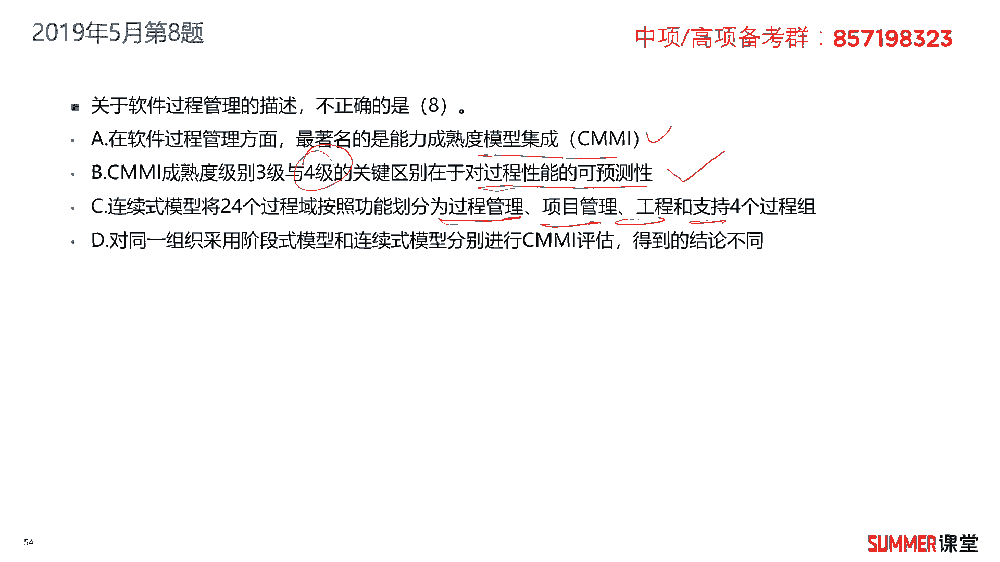

# 2023年软考信息系统项目管理师视频教程【总结到位，清晰易懂】-软考高项培训视频 - P12：1-2-5 软件成熟度模型CMMI - summer课堂 - BV1wM4y1Z7ny

我们接着来学习cmi软件成熟度模型，这个知识点说实话有点难啊。

他记的东西会比较多，而且非常难记，但是从最近几年考试来看，基本上都会有一分，所以该记得你还是得记，现在记不住没关系，我们考前再花点时间，看一下什么叫cm mi能力的能力，成熟度模型很简单。

就是对一家公司的软件开发能力进行评估嘛，啊我记得10年前，华为的软件开发能力就已经是cm mi 5了，最高级别，当时华山还是c n m m i4 ，第四集瑞杰第三集，10年前啊。

他们的软件开发能力大概是这样子的，肯定华为最牛逼嘛是吧，但是现在这些厂商，这些网络厂商，华为华三锐捷都是包括生育服务，都是已经到了cmi 5了，第五集就最高级了，级别越高说明你的软件开发能力越强。

这应该能理解吧，我记得我觉得很多人学完这个c m i之后，不知道这是什么玩意儿，说简单一点就是评估一家公司，你的软件开发能力行不行，分成12345级，一级就最弱鸡，第五集就最牛逼，很好理解吧。

啊非常好理解，o然后这个成熟度模型里面，它有两种分类的一个方法，第一个叫阶段式模型，阶段式模型，第二个叫连续式模型，阶段式模型主要就是评估你这个组织的成熟度，就你这家公司到底成不成熟，包括你成立的时间。

然后你的员工数量，你有多少架构师，有多少，高级工程师，主要是评估你的公司的情况，组织成熟度，第二种，连续连续式的模型，是评估你这家公司组组织过程的能力，那就是你开发软件。

你的这个软件开发的过程规划分析设计，各个阶段你做的怎么样，包括做项目管理是吧，相当于第一个啊模型啊，第一第一个阶这个阶段是模型哈啊，他评估的是你这家公司行不行，第二个阶段是你这家公司干事情行不行啊。

主要就是这两种区分的方法啊，第一种阶段式模型，它里面是分成五个级别的，但是我们书上只写了四个级别，因为第一集他觉得太太low了啊，没没怎么写，没写哈哈没写，我还是给大家补充一下吧。

还是给大家补充一下，就是l一到l5 ，可以把我们这个公司啊分成这么五级，l一叫初始级，就是你干一些干软件开发的工作，是不可预测的，是被动的，你能完成工作，但是经常延误，经常延期，而且成本超支。

这是初始级啊，第二集叫可管理级啊，是人就够进行项目层面的管理，项目是有计划而被执行，有度量且能够被控制的，你能够对项目进行一些控制啊，第三集你能够实现主动的而非被动的控制，你能够做一些大项目了。

到了三级之后，你就能做一些软件的大项目，第四集叫量化管理机，公司是数据推动的，它关键词就是量化啊，量化可控的啊，就是具体完成的时间啊，具体的成本效益等等，各方面都可以实现量化的控制，而且是可预测的。

而且是可预测的，可量化可预测，这是第四集的关键词，第五集就最牛逼的这一集，他的啊关键词就是稳定的，灵活的，你能够基于基于我们新的机会或者挑战，迅速的做出调整，能够敏捷的满足一些需求。

能够敏捷的满足一些需求啊，所以最厉害的一级优化剂，它的关键词是持续优化，持续改进，能够比较灵活啊，能够比较灵活，这就是对我们一家公司进行软件评级，可以评成这么五级，平成这么五级。

反正一级和二级没有没有谁去平啊，基本上啊这太low了吗，评出来对吧，人家一来就五级，你给我整个一级，二级是不是比较比较不具有代表性啊，就跟大家举个例子一样啊，人家都是硕士研究生啊，或者是博士，好意思吗。

是吧啊，还不如不拿呢，所以一二级基本上没有什么人关注啊，主要关注的就是345这三个等级。

然后我们书上写了，主要就是啊2345啊这四个等级，那这四个等级里面它会有一些过程域啊，会有一些过程域，我们来看一下哈，就是这两种方法哈，第一个是评评判组织的，第二种是评判这个组织干事的能力的。

这两种方法各有优缺点啊，均采用24个过程域来来表示，你看啊第二集里面有这么多过程运啊，然后第三集里面啊要从这些方面去做评估嘛，是吧啊，要从这些方面去做评估，都是24个过程运啊。

这里面加起来这里面加起来一共啊，这边是24个啊，这边是24个，就是我评估的一些点啊，一共包含24个过程域，他们在逻辑上是等价的，在逻辑上是等价的，对同一个组织采用两种模型进行评估啊。

最后得到的结论应该是相同的，最后得到的结论应该是相同的，作为记忆的知识点啊，为什么相同，你就不管了啊，反正他得到的结果就是相同的，ok啊，我们前面讲的都是一些比较基础的知识点了。

然后还有一个很难的就是哈哈，就是后面的这个过程与他可能会考到的啊，可能会考到的，他考到a随便拎一个过程一出来啊，比如说项目的监督与控制，它是属于这个这个还是他一列四个选项出来，让你去选这玩意。

我觉得就很烦，不好记是吧，不好记，我们还是简单的给大家去看一下啊，简单的给大家看一下啊，首先啊a2 的可管理集，它里面包含需求管理，项目计划啊，配置管理，项目监督与控制，供应商合同管理度量和分析过程。

产品质量保证包含这么多个过程与啊，我们注意啊，怎么注意呀，就是需求计划配置间合同度量，质保合同数量之宝，相当于把前面的这几个过程给你做了一个总结，需求计划配置监督，然后合同度量呃，质量啊。

质量及时总结了，这种助剂好像也不是特别好记是吧啊，没有办法啊，这玩意儿的确有点偏啊，如果大家有好记的一些方法和思路啊，可以同步给同步给我，然后我给大家梳理一下，你看下面的啊，以第一集也差不多啊。

内容太多了啊，内容太多了，反正下来自己看吧，我就不给大家去念了，念也没什么意思是吧，这边可能总结的要好记一点啊，这边也好记一点，你看过程管理里边会有组织级过程焦点，组织及过程定义组织及培训。

然后组织集过程性能，组织集过程管理实施，你看诶带过程，这过程管理运营，它里面有三个带过程的，然后加一个改革培训，有过程的都是过程管理，那这种叫好记忆点是吧，但是左边这玩意儿的确不好记哈，啊的确不好记啊。

没关系，我也不强迫大家啊，你能记就记，记不了就算了，是吧，大不了就一分嘛啊大不了就一分啊，所以这种东西没关系的哈啊没关系，你能记就记，记不了，我们就在别的地方多拿分啊。

在别的地方多拿分，ok我们来看一下啊，我们历年的考题，2018年11月的第九题，cmi的连续式表示法和阶段式表示法，分别表示什么，连续式表示法表示的是组织的过程能力。

而阶段式表示法表示我们组织的成熟度啊，表示组织的成熟度，一个是组织本身，另外一个是组织干事情的能力，所以这道题选择b答案，2019年关于软件过程管理的描述，不正确的是哪一个，a在软件过程管理方面。

最著名的是人力成熟度模型集成叫c m i啊，没有问题，b c m i成熟度级别，三级与四级的，关键在于对过程性能的可预测性啊，四级主要就是量化可预测嘛，肯定没有问题，然后c连续式模型将24个过程。

按照功能划分为工程管理，项目管理，工程和支持四个过程中。

连续式模型看一下哈，连续式模型分成过程管理，项目管理，工程和支持，没有问题是吧，这边这四个还是要记一下的，至少要把左边这四个记下嘛，那右边这些24个你记不了，那就再输了，左边这四个是要记得这四个啊。

是要记的o好接着来看哦，还有一个选项哈，d对同一组织采用两种模型进行评估，得到的结论，不同的结论相同，得到结论肯定相同，所以这题不正确的选择d答案。

2019年11月的第八题，在cmi阶段表示法中，过程与属于过程与哪一个属于以第一级很烦哦，过程与哪个属于第一级，相当于就考到了里面的24个过程域了啊，这种题如果实在不会，那就算了，选a啊，组织及过程啊。

焦点啊，组织集过程焦点看吧，组织集过程焦点在这儿，它属于以定一级的，2020年11月的第九题，在cmi连续式模型当中，技术解决方案过程与属于哪一个过程组的，属于哪个过程组，属于工程过程组。

看到没有技术解决方案，属于工程，考得很细哈啊，这种题真的就考得很细，下一个题，2022年5月第11题，企业能够将软件管理和工程，两方面的各种文档化标准化，并综合从该组织的标准软件过程。

综合成该组织的标准软件过程，所有的项目均使用经批准裁剪的标准软件过程，来开发和维护软件，软件产品的生产在整个软件过程是可见的，由此可以判断，这个企业已经达到了c m i的哪一个级别，哪一个级别。

这道题其实有难度啊，他考的比较接近于场景化是吧，那几个过程它的特点啊，其实第三集的话主要就实现标准化，它这里面提到的标准化应该是没什么问题的，第四集关键词量化还有什么可预测嘛，如果是第四集的话。

会出现这种关键字，第五集就更牛逼了啊，持续改进能面对挑这个新的挑战啊，什么灵活啊，更敏捷敏捷式开发对吧，肯定不是第五集啊，像这种题哈，如果大家实在不知道，告诉大家一个技巧，告诉大家一个技巧啊。

就是第一二集一般是不会选的，没有哪个企业搞个什么c a m i e2 ，没从来就没听说过第五集他特别牛逼，你就选第五集，这里面好像没有表现出他已经牛逼的，吊炸天的那种是吧，所以第五集一般不会选啊。

一般不会选，那就在bc当中去选，就在b c当中去选明白，如果你实在不知道的话，我们瞎猜也不能猜，a和d要拆b和c，这样你的正确率就提升了啊，就能达到50%啊，这道题很明显选c啊。

因为它没有第四集的关键词，量化和可预测是吧啊，只是可视这个可视化标可见的，然后做标准的嘛啊标准的那就是这是第三集哦，我们再回顾一下第三集长什么样。

给大家一起解解释第三集主动的而非被动的啊，他能够主动管理吗是吧，刚刚提到的，他能做裁剪啊等等各方面啊，是主动的，能够为项目或者大项目项目集合啊提供指南，这里面其实还没有解释的特别详细啊。

但是我们可以通过量化啊，它里面提到的一些关键词去去评估。

哎，他肯定不是处于第四级的啊，肯定不是属于第四级，所以这道题选择啊，cm mi 3，它的级别啊，能力等级，这个三级是以第一级，他是这样的一个过程啊，就是被描述为已定义的过程。

以定义的过程是一种以管理的过程，这种过程按照组织的啊裁剪指南，从组织标准的过程当中裁剪得到啊，就以你比标准过程可能是十个过程，但我们这项目管理的时候可能只需要八个啊，不是所有的过程都要走一遍吗，对吧。

可以从里面去裁剪，它具有受维护的过程描述啊，并且将过程相关的经验贡献给组织过程资产啊，什么是组织过程资产，去组织的经验教训啊，组织的啊，一些呃软性的资产嘛是吧，经验教训，那项目经验那肯定是软性的资产。

我们在讲项目管理的时候，还会遇到它。

