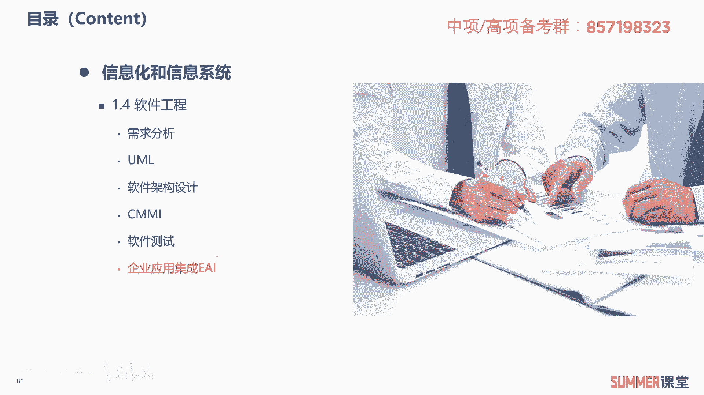
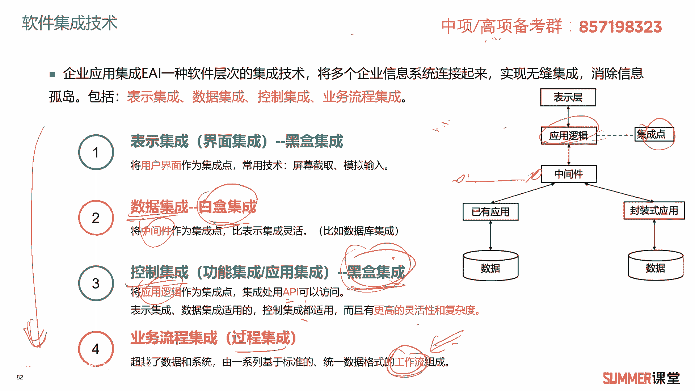
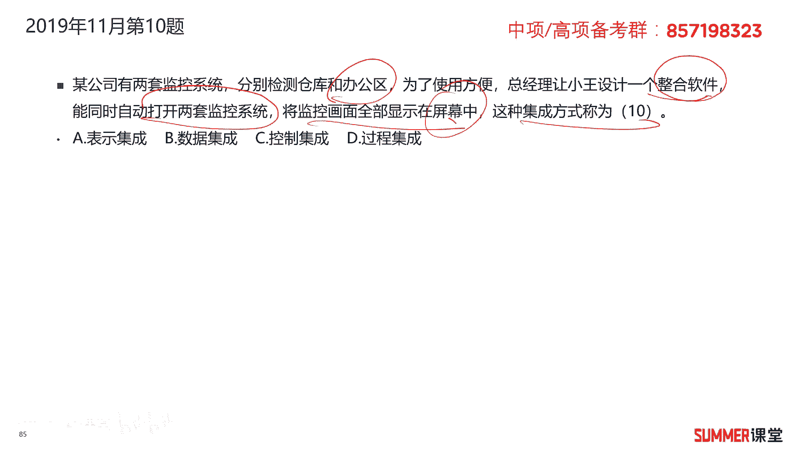
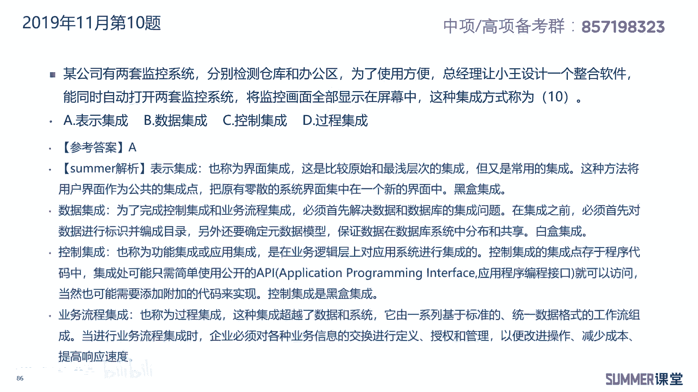
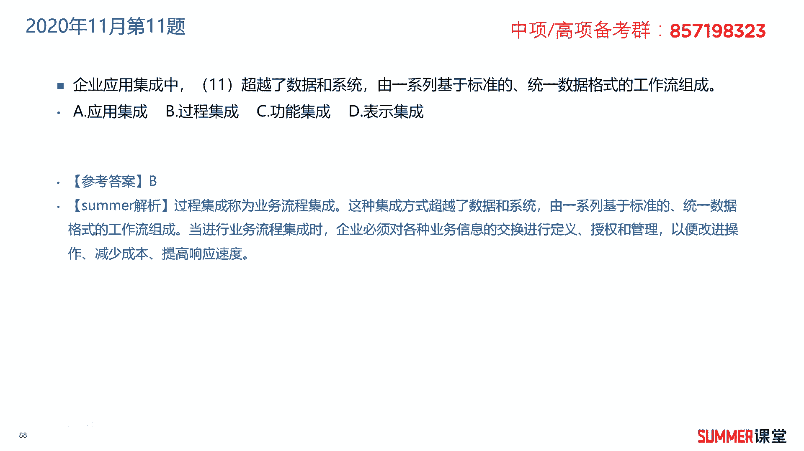
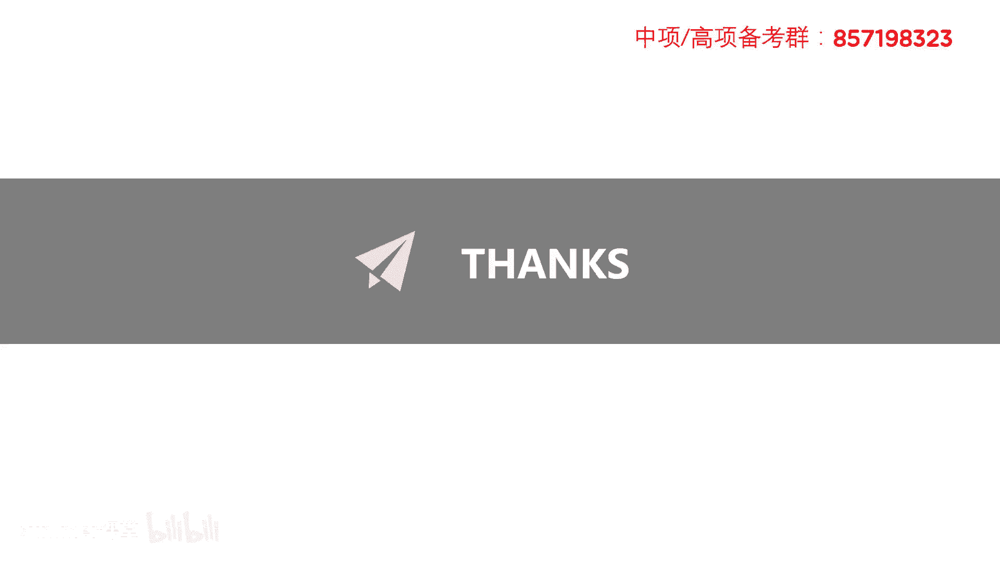

# 2023年软考信息系统项目管理师视频教程【总结到位，清晰易懂】-软考高项培训视频 - P14：1-2-7 企业应用集成EAI - summer课堂 - BV1wM4y1Z7ny

好我们下面接着学习企业应用集成，e a i，e a i就是企业应用集成这三个单词的缩写。

什么是企业应用集成呢，啊它是一种软件层次的集成技术，将多个企业信息系统连接起来，实现无缝集成，消除信息孤岛啊，不好理解是吧，我给大家举个例子，可能大家都明白了啊，比如说像很多年前。

我们应该能够在新闻里面看到啊，就是有些人他是在全国内内结了很多次婚啊，北京结一次，上海结一次，结一次回重庆或者是武汉哪儿啊，再结一次婚，对吧啊，可以结多次婚，原因是什么，因为早些年我们国家的这个婚姻啊。

婚姻的数据就是你婚姻状态的数据，跟户籍的数据它是没有打通的啊，没有打通的，户籍的数据，在公安，他们是两个部门啊，大家互不相通，互不相通，所以就可能造成你在很多很多个地方都能啊，都能结婚。

而且而且各个省他婚姻的数据，它本身也又没有打通啊，它本身的这个数据有没有打通，它只在本省内有效是吧，很多年前是这样子的啊，所以我们可以看到啊，在电视里面看到啊这样类似的新闻，但是现在肯定不行的呀。

包括跟户籍数据等等，全是打通了的，它是实现了什么，实现了系统的集成了啊，然后把我们底层的数据打红，所以现在你想重婚是不是叫犯罪了，重婚罪对吧啊，ok我们的这个集成技术它包含四种叫表示集，分别是表示集成。

数据集成，控制集成和业务流程集成，这四种，大家要记一下，另外还要掌握这四种，它分别指什么，表示集成也叫界面集成，它是将用户界面作为集成点，常用的技术是屏幕截取模拟输入，什么意思。

比如说我们大家可能很多公司用的oa，oa ov一般都会有一个单点登录功能，就登录oa之后，然后我可以通过这个oa这个界面，去访问很多系统啊，啊b c等等一系列的系统，那我点b系统之后。

其实它是给我连接到b系统这个应用里面去了，这只是一个链接啊，啊只是一个链接，就跟我们现在访问很多很多网站的啊，这个主页，比如说你访问百度的首页，它里面诶可能给你一些导航是吧。

你点这个导航就就跳到相应的页面去了嘛，这就是表示集成啊，把不同的啊，把不同的网站或者e业务系统，给你放到同一个界面，那其他底层还是单独的这个系统啊，你要访问这个系统，你还是要到他本跳转过去啊。

访问它本身吗，ok啊这是最简单的表示集成，将用户界面作为集成点，第二个叫数据集成，它是把中间件作为集成点，比表示集成更加灵活，比如说a数据库的集成，第三种控制集成也叫功能集成或者应用集成。

它是把应用逻辑作为集成点，通过api啊去访问啊，去做集成，那表示集成数据集成啊，适用的，然后我们控制集成它都啊控制集成都适用啊，都适用，而且有更高的灵活性和复杂度，这是控制机场，然后接着是业务流程集成。

它超越了数据和系统，由一系列基于标准的统一格式的工作流来构成，这几种集成，首先先记一下它的名字，接着他们的集成点，集成点要要掌握好这个关键词，业务流程集成也叫过程集成，它的关键词是数据流。

你看到这些关键词的时候，你一定要知道他说的是哪个集成，把它对应起来，把它对应起来，这是第一点考点啊，第二点你还需要掌握这些集成，它是黑盒还是白盒啊，是黑盒还是白盒，前面三个啊都第一个是黑盒。

然后第二个是白河，第三个黑盒啊，第四个白盒和黑盒没说啊，也没考过，我们就不管他了，我们就不管，ok这是第二个考点，第三个考点就是我不通过文字给你描述出来了，我给你画个图，你画个图。

a集成点在这集成点在应用逻辑上它很明显吗，是控制集成是吧，或者我集成点给你画在中间件这啊，这集成点那它是什么集成，它是数据集成，ok这是第三种考法，考试无非就逃不出这么几种考法，还有还有一个考法啊。

就是从上到下啊，了解他从上到下集成度是越来越高的，集成度最简单的就是用户界面集成嘛，啊也是表示集成对吧啊，相当于就是给你甩了一个超链接啊，你里边的啊内容啊，系统没有做任何的改变啊，没做任何的改变。

ok我们来看一下历年的真题，2019年5月第11题，企业应用集成技术可以消除信息孤岛，将多个企业信息连接起来，实现无缝集成，下图表示的是什么，集成集成点在应用逻辑，这很明显是控制集成是吧啊。

它的集成点通过图画出来的，这也是经典考点，考过很多次的，2019年11月的第十题，某公司有两套监控系统，分别检测仓库和办公区，为了使用方面，总经理让小王设计一个整合软件，能够同时自动打开两套监控系统。

将监控的画面显示在屏幕当中，这种集成方式称为什么，他有没有动底层的数据或者逻辑啊，没有，只是把两个监控给你显示到一个画面里面吗，这在现实生活中也用的很多。

所以很明显他是表示集成只做了界面的整合，所以选择a答案。

2020年11月的第11题，企业应用集成中什么超越了数据和系统，由一系列基于标准的统一格式的工作流组成，关键词，看到工作流，我们选过程集成，到了后期，你可能就要达到夏老师这种熟练度哈。

啊当然刚开始可能还是有点不熟是吧，没关系啊，没不熟的话，你翻一下前面啊，稍微看一下啊，稍微看一下啊，反正就一页的知识点啊，就这一页你说性价比高不高嘛，那基本上每年必考啊。

基本上每年必考。

