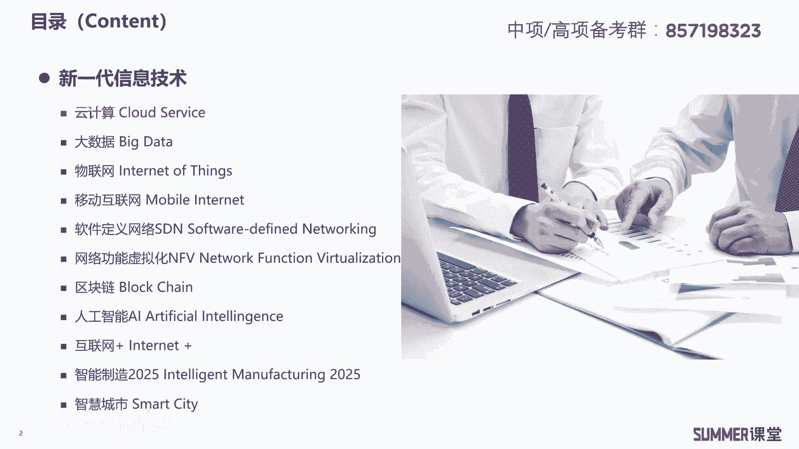
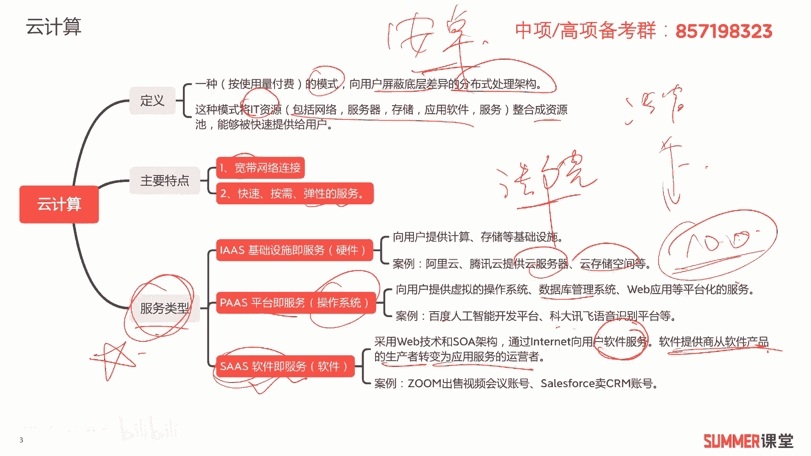
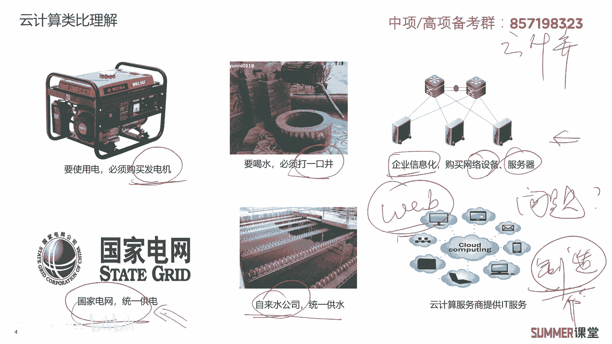
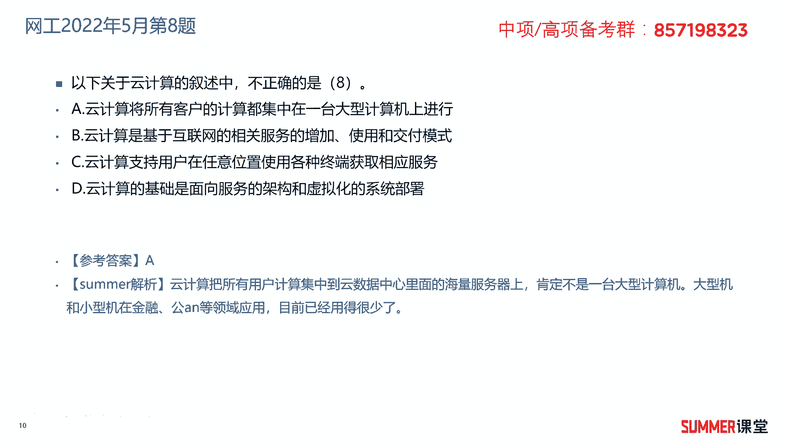

# 2023年软考信息系统项目管理师视频教程【总结到位，清晰易懂】-软考高项培训视频 - P15：1-3-1 云计算 - summer课堂 - BV1wM4y1Z7ny

大家好，我是你们的夏老师，我们下面接着学习第一章的第三个模块新技术。

这里面会给大家介绍很多种新技术，但是对于这些技术，我们点到即止，考试只要你会做题就行了，不会给大家展开去讲啊，因为展开了也讲不完，这里面每一个技术，其实都不是对应着一本书的问题了啊。

这是大学人家的一个专业啊，人家花好几年时间来学习一个方向是吧啊，所以如果你对其中某一块感兴趣的话，下来可以花点时间自己去研究，我们主要是给大家去扫盲好，首先来看一下第一个技术。

云计算，云计算最近新年应该特别火，大家也听了很多，首先来看一下它它的定义啊，它是一种按使用量付费的模式，向用户屏蔽底层差异的分布式处理架构，这种模式将it资源整合成资源池，然后被用户快速的访问。

快速的提供给我们的用户，哪些t资源整合成资源池呢，这里面做了一个简单的总结，典型的比如说有网络服务器，存储应用软件，还有服务啊，包括网络安全等等，都可以整合成我们的资源池，它主要的特点两个。

第一个宽带网络连接啊，你要有比较大的带宽来连接网络，然后使用云计算，如果是比网速比较慢的话，你所有的处理都在后端给你传过来，其实用户一般很难接受，第二就是快速按需服务啊，去预备弹性的服务啊。

你想使用多少就用多少，跟你用水用电一样啊，你可以快速的获得相应的语音资源啊，待会我们举个例子，大家就很好理解了，接着云计算的服务类型，这是重点，需要大家一定掌握啊，一定掌握考试考他考的非常多啊。

三个类型，as path和sars，as s的话是基础设施及服务，相当于为用户提供硬件，比如说以前你要计算资源的话，你就要买服务器，要存储资源的话，你可能要买存储设备。

现在现在你只需要向云服务商去申请云服务器，云存储资源就行了，这叫e为你提供的是硬件设备，相当于pan是平台及服务，相当于为你提供的是操作系统啊，向用户提供虚拟的操作系统，数据库管理系统。

web应用等平台化的服务，比如说典型的百度的人工智能开发平台，科大讯飞的语音识别平台等等，我们可以基于这些平台去做二次开发啊，去做二次开发啊，比较典型的我以前的一个合作伙伴，他们是做法院的，是做法院的。

法院有一个业务，这是什么啊，他们之间的一些对话，全部要做记录的，最早就是数据员用手写肯定很慢是吧，后来是不是就有了语音识别，有了语音识别，有了语音识别，这种做法院的公司，所有的模块都是他们自己开发吗。

不是啊，不是他们是基于这种开发平台去做语音识别，就有点像什么，就有点像比如说国产的手机，大家都是用的安卓去做开发一样的道理是吧，安卓给你提供底层的很多东西，你基于他去做开发就行了啊。

比如说这里面语音识别也是一样的啊，其实有很多公司有语音识别的这种平台啊，啊比如说科大讯飞，比如说像百度他自己也有啊，这种就是平台及服务，它为你提供的类似于操作系统这样的服务，你可以基于它的平台去做开发。

第三个是sars软件及服务，软件及服务啊，说的通俗易懂一点，就传统的软件厂商，我就是卖软件，一套基础的软件，我卖1万块钱啊，高级的软件啊，可能我卖50万 100万对吧，我直接是卖的东西，卖的产品是软件。

但是sars之后，这些软件厂商他开始卖什么啊，开始卖账号了啊，比如说room他是搞视频会议的，以前他是通过出卖软件来获取利益的，现在人家卖的是视频会议的账号啊，怎么卖呢。

那比如说100个人开会的这种视频会议账号，我1年收你1万块钱，比如说你想要扩扩大你的这个开会的人数，你要扩展到500人，那我1年收你10万块钱是吧，他就卖账号了啊，卖账号应该很好理解吧，以前卖软件。

现在我卖账号啊，软件我给你部署好啊，都在云端啊，你通过账号进来可以用就行了好吧，这是sars sars，大家还需要注意一下他的解释啊，他的这个术语和定义哈，是采用web技术和s o a架构。

s o a是面向服务的架构，通过internet向用户提供软件服务，软件提供商，从软件产品的生产者，变为了应用服务的运营者啊，这是他的转变，ok关于云计算的三种模式啊，这是重点。

为了让大家更方便的理解云计算。

我们村里面做了一个类比，就是很多年前如果你想要用电，就必须要购买柴油发电机，而且还要买柴油自己发电，自己用，到后来是不是有了国家电网，他能够把所有的发电站发的电给你集中起来，然后输送到需要的客户这啊。

你客户你想用多少就用呗是吧，最终反正给你安一个列表，按需使用嘛，然后我们根据你的用量来计费，以前农村你想喝水怎么办，你必须要打口井嘛，自己从井里面抽出来喝，现在是不是有自来水公司啦，进行统一的供水。

根据你的用量给最后交钱吗，啊现在云计算也是一样的啊，云计算它的理念其实跟我们讲的，用电和用水的例子非常类似，以前你要搞信息化，要买各种各样的设备，网络设备，服务器存储，然后网络安全设备对吧。

买了这些设备之后，你还要建机房，把设备放在里边，机房还要有恒温恒湿，你还要买空调啊等等乱七八糟的设备，除此之外，是不是你还要招一两个人来负责平时的运维啊，对吧，这传统的企业信息化就这么搞的。

还是比较花钱的，但现在啊，现在我们是可以买云服务商的云服务了，就机房啊，设备这些你都不需要买，你按需的去租用人家的服务就行了，这对中小型公司特别友好啊，大企业你可以依旧搞自己的机房，没什么问题。

但一些中小型企业你想一下啊，你要你要买设备，然后还要用一个房间来做机房啊，接着你还招一两个人来做运维，成本就相当高了是吧啊，但是一云有云计算这种模式啊，你用云服务商的资源。

然后按照你的使用量付费就行了啊，可以极大的节省成本，而且也能够快速上线，你想一下，你如果你传统自己搞买设备，你需要时间，招人需要时间，然后机房的建设等等是不是需要挺多时间啊，那后期你要扩容还比较麻烦。

但云服务你要扩容再往上，在那个网页面上你勾勾点点啊，三分钟就完了啊，所以云计算它是不是有一系列的优势啊，啊有一系列的优势，那么问大家一个问题，云计算有没有什么问题啊，或者是劣势存在的问题，能想出来吗。

第一个问题严重依赖于网络嘛，我们要访问云服务商的资源，我们是不是要通过网络去访问，如果断网了，那肯定就没辙，所以他对离线的业务啊不友好，严重依赖网络，第二个问题数据安全问题。

你把所有的东西都交给云服务商，都在云上去处理，那么你的数据安全能有效保障吗，不能啊，是有一定风险的，所以有些单位，它的敏感数据肯定是放在我单位内部的，然后一些无关紧要的数据，我可以放到云上是吧啊。

就我把一部分比如一些企业生产制造类的企业，它的一些制造数据是很重要的，数据中心里面，然后比如说a对外访问的这种web网站啊，网站一些宣传信息我放到公有云，放到阿里云，腾讯云，这肯定是没问题的，是吧啊。

关于云计算的两个问题啊，简单给大家去说了一下啊。

简单给大家去说了一下好了，我们来做几道练习题，2018年5月的第六题，某云计算服务商向电信运营商提供计算能力，存储空间以及相应的运营管理服务，按照云计算服务提供的资源层次，这个服务类型属于什么计算能力。

存储空间，是不是它相当于硬件给你提供的是硬件，而且它对应哪两个硬件，什么是用于计算的硬件服务器嘛是吧，服务器存储空间是不是常见的存储设备，它对应的硬件，所以很明显，为你提供硬件的就是基础设施及服务。

所以选择a答案，2019年5月的第五题，什么向用户提供办公软件，工作流等服务，使软件提供商从软件的生产者，变成服务的运营者，以前是卖软件，现在我卖账号啊，然后后面这句话是不是我们典型的sars啊。

sars所以这道题选择c答案，选择c答案啊，常见的云计算的三层架构就是s may提供硬件，然后pass提供操作系统，sars是给你提供软件的账号，提供软件的服务，然后death death的话。

有些啊有些文章上可以看到，但是我们书上没写哈，建议大家简单了解一下，它是数据作为一种服务啊，数据作为一种服务，比如说a大数据服务是吧，大数据服务的话都不算数据作为一种服务，因为大数据服务其实是。

他对数据进行了一定的分析了，对数据进行了分析，了解一下啊，对答案了，下好，接着看一道网络工程师的题，2022年5月的第八题，以下关于云计算的叙述中不正确的是哪一个，a云计算，将所有用户的计算。

都集中在一台大型计算机上运行，对不对啊，如果你有点it常识，可以很明显判断出它是错的，云计算其典型的架构我们一直提的是叫分布式，分布式架构，它典型的一个思想是什么呢，就是三个臭皮匠顶个诸葛亮。

顶一个诸葛亮啊，这样的原理，他用的设备其实都是中低端设备，它底层的服务器都是两路服务器，两路服务器，两路服务器说白了就是两颗cpu的服务器嘛对吧，两路服务器之上是不是还有四路服务器。

然后大型机它的性能依次是往上面去，这么往上去，真的哈，两路服务器就是比较常规的啊，常规的服务器啊，大型机相比，性能是最低的啊，性能是最低的，但没关系啊，啊你看那种啊，像腾讯阿里这一类的互联网公司。

人家服务器几万台，几10万台对吧哈，它一台服服务器的性能不够强，没关系，人家分布式架构，多台服务器一起工作，所以它最终的性能也是可以实现比较强的，o a答案明显的错误，b云计算是基于互。

基于互联网的相关服务的增加使用和交互模式，反正我觉得这句话有点不通哈，云计算是基于互联网的，前半句肯定没有问题，相关服务的增加使用和交互交互模式，反正我读起来怪怪的哈，读起来怪怪的啊，不管他不管他。

c云计算支持用户在任意位置使用各种终端，获取服务，在任何地方，只要你往若能通，就可以使用任何终端啊，用手机电脑都没有问题，d云计算的基础是面向服务的架构和，虚拟化的系统部署，面向服务的架构。

s o a刚刚给大家去说过吧，那虚拟化大家了解一下啊，比如说我们要向啊，云服务商去申请一个服务器资源，其他本质上给你的是虚拟机，它底层有台物理服务器，然后上面开出很多虚拟机来，开出很多虚拟机来。

然后把相应的虚拟机，比如这个虚拟机给张三，用这个给李四，这给王五，所以云计算的底层是严重依赖虚拟化，虚拟化的技术啊，这是他非常关键的一点啊，没有问题。

