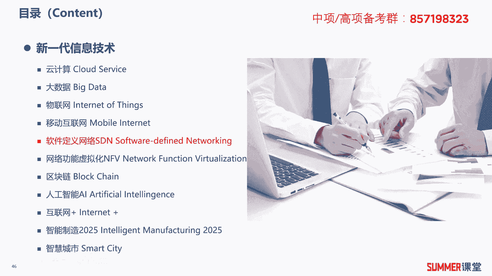
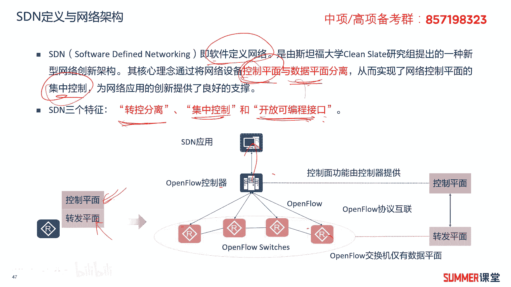
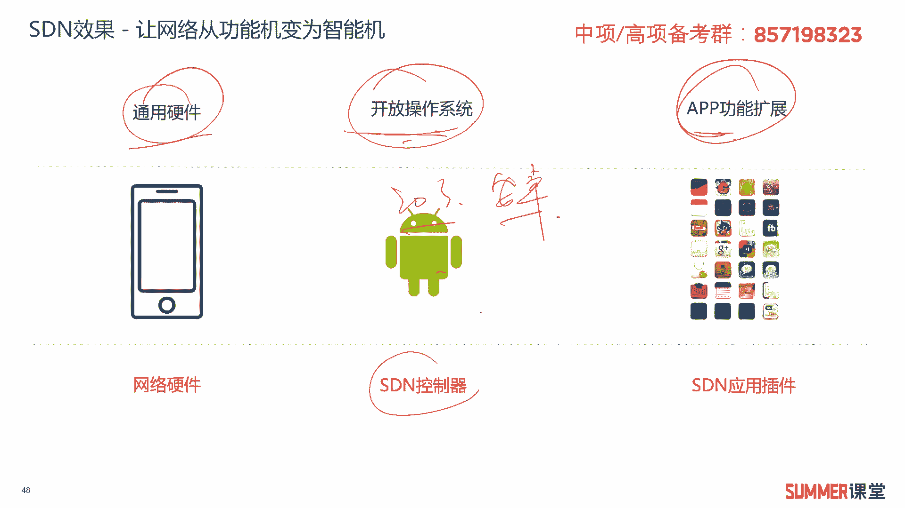
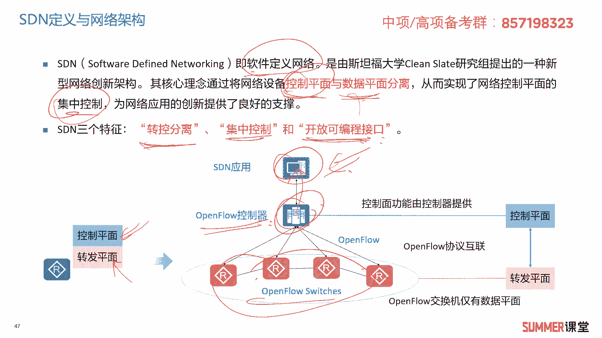
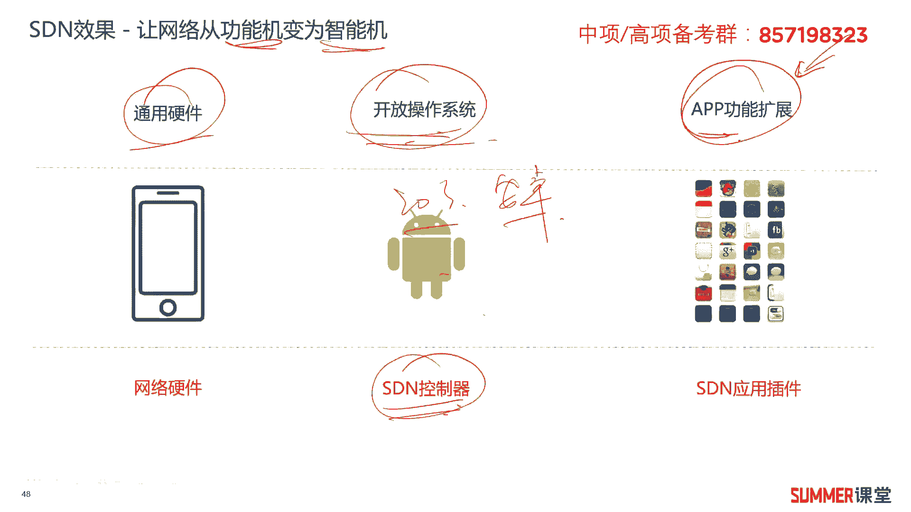
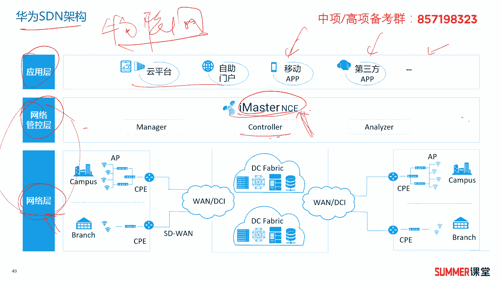
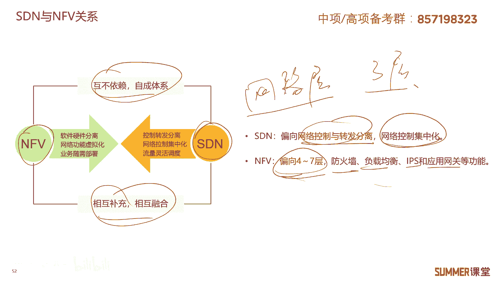
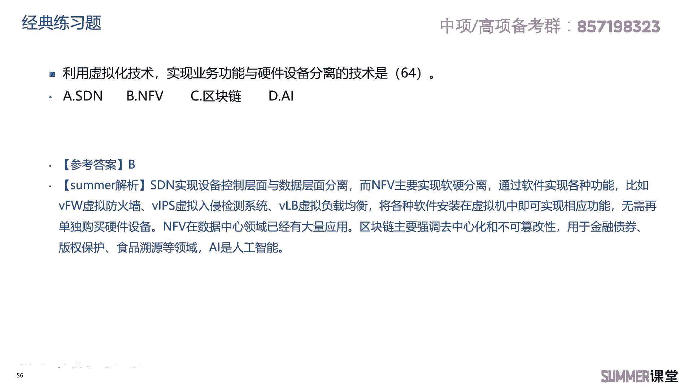

# 2023年软考信息系统项目管理师视频教程【总结到位，清晰易懂】-软考高项培训视频 - P19：1-3-5 SDN和NFV - summer课堂 - BV1wM4y1Z7ny

我们接着来学习sdn和nfa，也就是软件定义网络和网络功能虚拟化，这是在网络领域比较新的两个技术啊。

希望大家能够了解，首先sdn全称是software designed to working，软件定义网络，如果你是搞网络的，或多或少都听过，它的核心理念，是将网络设备的控制层面和转发层面。

也叫数据层面分离，集中控制，为网络应用的创新提供了良好的支撑啊，这是什么意思啊，听起来很神啊，我给大家解释一下啊，比如说这里面是有很多台路由器是吧，传统的网络，每台路由器都有转发层面和控制层面啊。

控制层面就是你可以登录这台路由器，对它进行相应的配置，配置好之后，后面他按照你的配置进行数据的转发吗，我们可以登录每一台路由器对它进行配置啊，应该很好理解吧，每一台设备都是单独的设备吗。

现在s d n之后，就是这些设备只负责转发，我们控制，由一台控制器，s d n的控制器，来对下面的所有设备进行统一的配置和管理，我们配的话，这些都不能配了，你只能配它啊，只能配它。

那相当于就有一个超级大网管啊，对产品所有的设备进行统一的管理和配置，这就是控制层面配置管理啊，控制层面，然后数据转发啊，就是它的数据层面嘛，那相当于就把我们传统的这种网络设备，它的控制层面给抽出来了。

抽到了什么，抽到了我们的控制器，这里边来ok与控制器进行统一的控制，然后你要实现一些高级的功能，你在控制器的基础上，你去做一些开发啊，去做一些开发，实现相应的功能嘛对吧，s d n的三个特征啊。

转控分离，集中控制，开放可编程接口啊，了解了解，如果给你出个选项，你知道诶，这是sd的功能就可以了，为了让大家更方便的理解sdn，我给大家举了一个例子。

就是跟我们的安卓啊是比较类似的，或者跟安卓或者苹果的系统嘛，对吧啊，我们首先底层有通用通用的硬件，然后上面跑一个开放的操作系统啊，比如说一典型的ios或者是安卓啊。

安卓然后我们在这两个系统的基础上进行开发，你要实现功能是不是通过app来实现在网络领域，在s d n里面，这个安卓这个平台，就相当于s d n的控制器是吧。

你看一下啊，这就是安卓上面，我们通过开发app应用来实现相应的功能，就不用对底层那些设备进行操作了，你对它的操作都是基于控制器来进行的，ok啊。

传统的传统的我们软件开发，或者或者是手机的开发，你是要基于每个硬件去开发的，那这玩意儿就有点麻烦是吧，也不够统一，但是你有一个统一的开放平台，开放平台就是s店的控制器对它进行开发。

那这样的话就变得简单容易很多，ok所以sdn实现的效果就是，让网络从功能机变成智能机，我们可以在上层开发各种各样的app啊，当然s店的内容特别多，完全展开可能要我讲过一门课程，专门讲sdn。

讲了讲了十几个小时吧，我记得啊，所以了解就行了啊，了解就行了。

看一下华为sdn的架构哈啊分成三层，最底层是网络层，网络层及各种各样的设备嘛对吧，最典型的最常用的就是路由器交换机，当然除了路由器交换机以外，可能还有wifi啊，还有防火墙啊等等等等各种各样的设备。

最典型的网络设备其实就是路由器和交换机，这两个是最典型的对吧，中间层叫网络管控层啊，最核心的是什么是control啊，就控制器嘛对下面的进行控制，能进行统一配置的，这叫啊，这叫控制器啊，这叫控制器。

华为的sdn里面有个关键的组件，叫imaster n c e哈啊，如果你是考网归，我们会给你展开讲它的一些功能，但是考高项就算了啊，因为高校不是偏技术的，你只是要对基础的一些架构，有基本的认识就行了。

所以中间啊相当于就是一个网络的控制器，然后上层是应用对吧，我们可以开发各种各样的移动app，或者用第三方的app啊，或者是跟云平台啊去对接啊，都可以，这是华为s店的架构，三层，最底层是网络层。

中间控制器，上层是应用上等式应用啊，这个这个跟我们前面讲的物联网的架构，物联网的架构有区别是吧，但也有点像啊，比如上层都是应用层吗，区别在哪，区别它下两层是不一样的啊，下两层是不一样的。

希望大家不要混淆。

不要混淆好，接着还有一个东西叫nfa，网络功能虚拟化，网络功能虚拟化听起来特别高大上，好像很牛逼，但是我给你通俗易懂的一讲，你觉得就这玩意儿吗是吧，没什么新东西好吧，网络功能虚拟化啊，给大家举个例子哈。

就传统的比如说你要实现安全功能，可能你要买一些防火墙啊，硬件设备对吧，你要实现n a t，还有专门的n a t设备，或者通过路由器去实现n a t吗，啊比如说a你安全设备的话。

还有最常见的防火墙入侵检测，什么上网行为管理a s g等等各种各样的设备，你要实现这些功能，你要把这些设备都买回家是吧，买回家之后是不是好多台硬件设备啊，啊是很多台硬件设备啊，其实也也要花不少钱嘛。

现在n f a的思路就是，我底层通过我通用的服务器，然后在上面虚拟很多虚拟机，对应的，比如说诶这个虚拟机就是安装防火墙的软件，这个虚拟机安装ip s软件，这个虚拟机我给它安装上网行为管理软件。

所以在一台服务器上，我就可以实现这么多功能了，而这些功能通过什么来实现，通过软件来实现，通过软件来实现，不必要啊，不不是必须买你专门的硬件，明白啊，直接底层都用通用的服务器啊。

那我就不需要买你的硬件设备了，我买软件的就行了，ok那它的核心原理就是，将需要专用硬件实现的一些功能啊，改为通用的硬件来实现，可以用通用的硬件，通用的硬件最常见的什么设备吗。

我直接就写成改成服务器来实现对吧，就是改成服务器来实现嘛，ok这就是n f a的定义，再通过一张图来让你更好的理解n f a，我们底层用电信级的标准服务器，机架式的刀片。

或者是各种各样的高功耗的高高密度，低功耗的服务器啊，都都可以啊，反正底层就是标准的服务器嘛对吧，那服务器你简单理解就是性能更牛逼一点的，电脑跟电脑其实本质上没啥区别，都cpu内存。

然后然后硬盘等等构成的，只是服务器的内存容量要大一点，cpu要强一点，是吧，它本质上就是电脑嘛啊本质上就是电脑哈，然后底层是标准的硬件，然后上面我可以虚拟出很多虚拟机，然后来安装相应的这些功能。

来实现具体的业务吗对吧，当然这些功能我们是可以通过虚拟化平台的，统一来管理的啊，统一来管理，进行全局的管理和控制，这就是nfo通过软件来实现具体的功能，这些功能可能是a防v防火墙，就是软件的防火墙吗。

还有v i p s v负载均衡lb啊，这些都是可以通过软件安装在我们的服务器里。

面，安装在虚拟机里面，很好理解吧，啊应该很好理解，在这边啊，简单的总结一下，就是c dn跟n f a的关系，他们是互不依赖，各成体系的啊，相互补充，相互融合，sdn主要偏向于网络层面，网络层面。

网络层面就是三层啊，三层及三层以下的，而n f v主要偏向于4~7层，偏向于4~7层是吧，n f a他偏向4~7层，主要实现以防火墙负载均衡，i p s啊，应用网关等等啊，这些高层次的功能是吧。

高层次的功能。

那这两个术语希望大家能够啊能够理解，能够理解好做两道练习题，网络工程师2022年5月的第63题，在5g关键技术当中，使网络的灵活性，可管理性，可扩展性大幅提升的是什么技术，我觉得这道题比较新颖啊。

比较新颖，首先盖了一顶5g的帽子，有些人说哎老师都不讲5g啊，5g这玩意儿我都不会怎么办，盖了一顶5d5 g的帽子，本质上在考你什么，再考你sdn啊，控制层面和数据层面分离，是不是典型的sdn的定义吗。

对吧，那这玩意儿其实挺简单的啊，其实挺简单的，所以很明显选择a答案，再看一道练习题，利用虚拟化技术，实现业务功能与硬件设备分离的是什么技术，是不是刚讲的nfc技术。

我们通过把标准服务器虚拟成很多台虚拟机，然后在虚拟机里面安装相应的软件业务嘛啊，从而就实现了业务跟硬件设备的混分离，你要买防火墙，你不需要买一台防火墙硬件设备啊，你只需要买个防火墙软件。

安装进你的虚拟机里面就可以了，买i p s也是一样的，买个v i p s是吧，就是一个软件。

