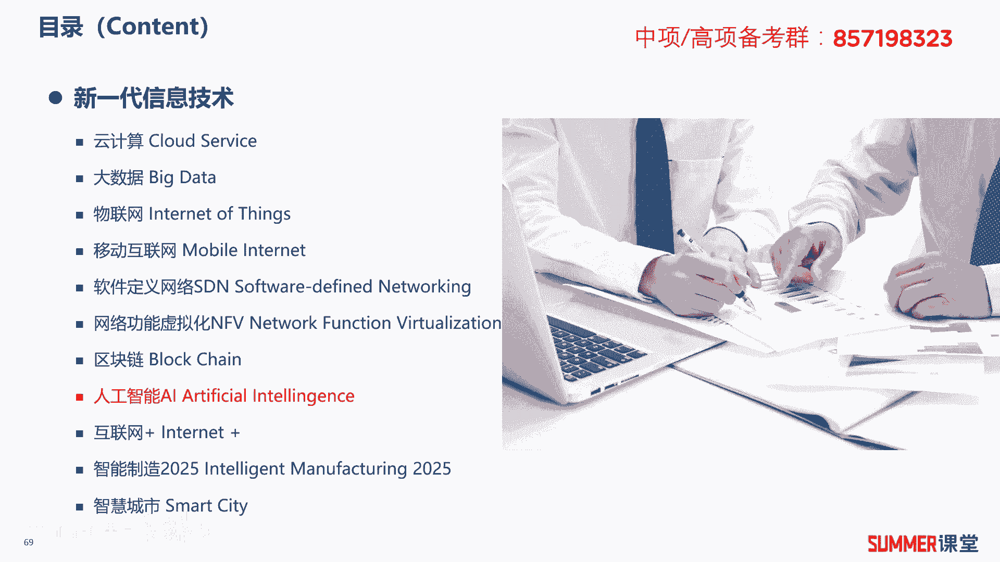
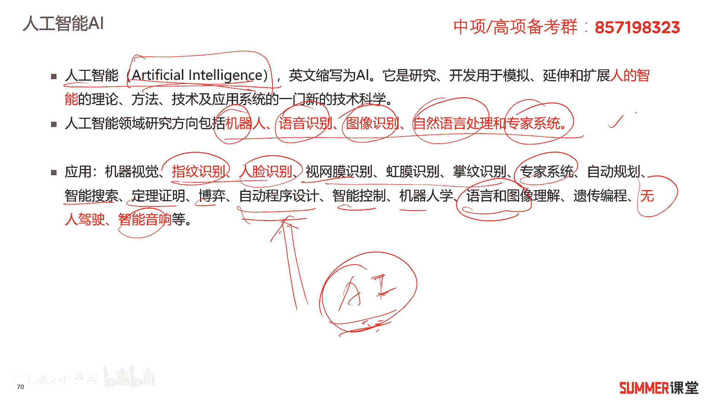
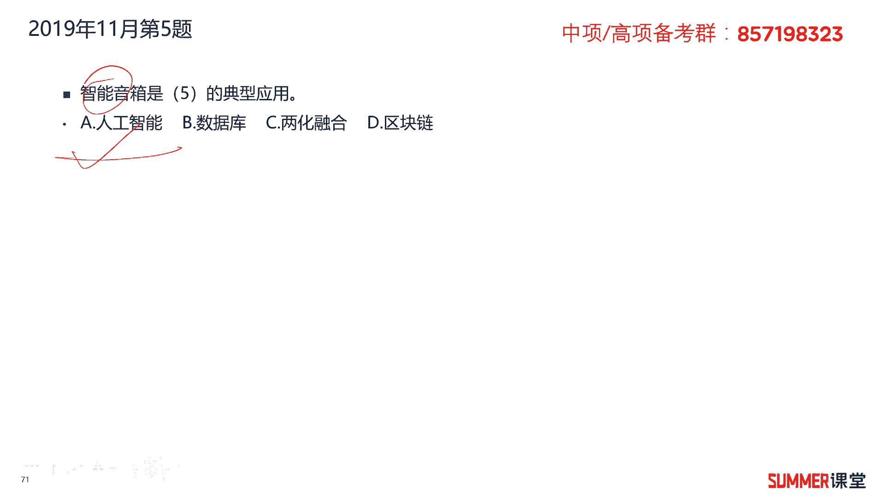
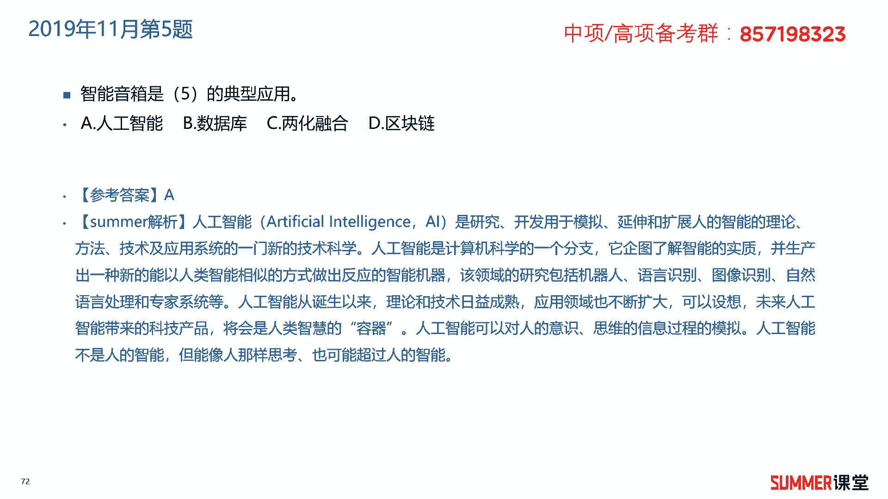
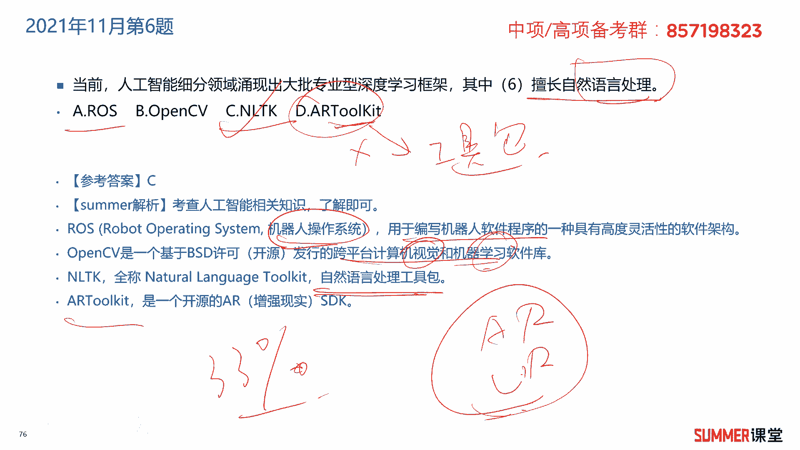
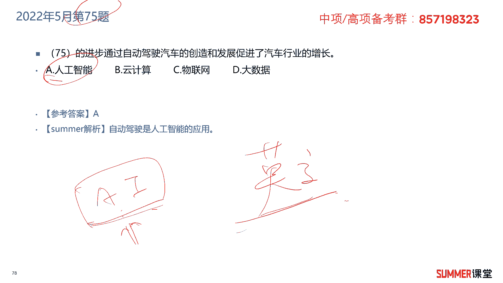

# 2023年软考信息系统项目管理师视频教程【总结到位，清晰易懂】-软考高项培训视频 - P21：1-3-7 人工智能AI - summer课堂 - BV1wM4y1Z7ny

我们接着来学习人工智能ai啊，听着很牛逼哈，但是要求我们掌握的内容并不多，首先第一个知识点，人工智能是哪两个单词的缩写，一定要注意哦，这个东西在下在上午的英文选择题里面，是可能出现的。

artificial intelligence，人工智能简称ai，它是研究开发用于模拟和延伸，扩展人类智能的理论方法，技术以及应用的一门新的科学技术，人工智能领域研究方向包括机器人，语音识别，图像识别。

自然语言处理专家系统研究的方向，大家需要注意一下，应用的领域非常非常广，机器视觉，指纹识别，人脸识别啊，什么虹膜识别，视网膜识别，掌纹识别就各种识别啊，专家系统啊，什么自动规划啊，智能搜索定理的证明。

博弈自动程序设计，看到没有，将来程序都可能由机器人来帮你写啊，由ai写程序，这可不是危言耸听，所以在未来，其实很多岗位都可能面临着失业啊，特别是一些低级岗位，一些低级的程序员啊。

一些低级的测试岗都可能会被机器人替代，这绝对不是危言耸听的对吧，这是未来发展的一个趋势，但你说他全部取代可不可能，绝对不可能，特别是跟人相关的什么销售啊，售前啊这类的工作a i很难取代的啊，很难取代。

还有些智能控制，然后机器人学前面讲过语言和图像的理解，什么遗传编程，无人驾驶智能音响，标红的这几个基本上都考过的，无人驾驶智能音响啊，指纹识别，人脸识别，图像识别，所以它的应用我们看一下。

简单读一下是吧，考到你一个选项，你知道哪个是哪个不是就行了，o关于人工智能就给大家讲这么多内容啊，不到一页还不到一页好。

我们来看练习题，2019年11月的第五题，智能音箱是什么的，典型应用人工智能啊，你可以跟他交互啊，比如小爱同学是吧。

那这一类的大家应该都用过吧，所以选择a答案。

2020年11月的第五题，什么不属于人工智能技术的应用，机器人肯定是啊，语音识别语言的理解是，然后图像识别也是扫码支付，跟人工智能有没有关系，关键是有没有人的思维嘛，其其他几个都会有人的思维。

机器人是不是会有人的思维啊，语言理解理解肯定是人能干的啊，图像的识别我们可以通过眼睛去识别，可以通过一些智能摄像头去识别是吧，这肯定是有人的思维的，而扫码支付跟人的思维好像没太大关系，所以选择c答案。

2021年11月的第六题，这道题就稍微难一点了啊，他说当前人工智能细分领域，涌现出了大p专业型深度学习的框架，其中什么擅长自然语言的处理，给了你几个啊，几个框架啊，几个框架可以和一些这个相当。

相当于就是平台的插件嘛，啊平台插件啊，这个大家需要注意一下哈，如果实在不会，那就算了，第一个r o s它指的是机器人操作系统，用于编写机器人程序的一种架构，open cv。

这是用于机器视觉和机器学习的一个软件库，n l t k自然语言处理的工工具包，正常自然语言处理的什么叫自然语言，我们说话这种叫自然语言是吧，a r a r ticket啊。

一般看到a r你知道是什么a r vr虚拟现实，增强现实是吧啊，所以这个tk一般是一个工具，就two tok嘛啊工具包是吧，工具包，所以这道题如果你实在不会，你看d答案大概率是不选的，大概率是不选。

你在a b c当去瞎猜嘛，能猜出来就就30%的，33的正确率是吧，ok啊当然考了这道题之后，你把a b c d这四个选项啊，稍微的看一下啊，稍微看一下。

接着下一题，2022年5月的第75题什么的进步，通过自动驾驶汽车的创造和发展，促进了汽车行业的增长啊，自动驾驶相关的是不是人工智能ai吗，啊所以这道题选择a答案啊，75题是不是考了一道英文题啊。

考了一道英文题啊，人工智能当然是翻译过来的，当然是翻译过来的啊，当他除了英文的话，就是刚刚讲的那个a i这两个这两个单词啊，这两个单词啊，你可你不知道的，翻过那个回过头去看一下啊，看一下啊。

