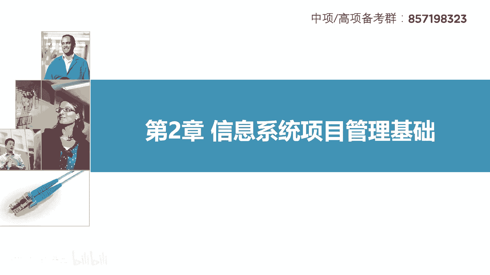
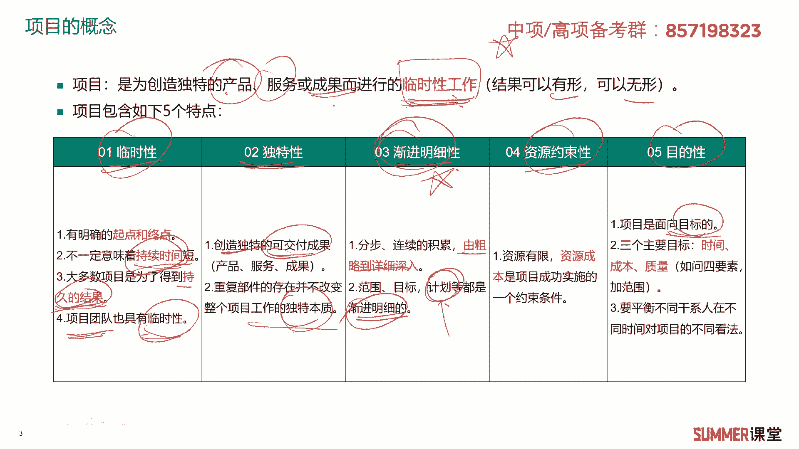

# 2023年软考信息系统项目管理师视频教程【总结到位，清晰易懂】-软考高项培训视频 - P23：2-1 项目管理基础 - summer课堂 - BV1wM4y1Z7ny

大家好，我是你们的夏老师，我们下面学习第二章信息系统项目管理基础。

首先来看一下第一部分项目管理基础。

什么是项目呢，这里面有一个定义，项目是为创造独特产品服务或者成果，而进行的临时性工作，项目创造的成果或者结果，可以是有形的，也可以是无形的，有形的，比如说修一栋楼，无形的，比如说可能是监理服务。

可能是一些软件测评的服务对吧，另外这里面需要注意的，标红的关键字项目是临时性的工作，这个时间可能很长，但是它是有期限的对吧，另外项目有如下的五个特点，这五个特点不需要需要你死记硬背。

但是你要理解选择题会出现啊，选择题会出现好，我们首先来看一下啊五个特点，第一个临时性到项目有明确的起点和终点，他是临时的嘛对吧，那当然临时不意味着时间短哦，啊有些项目可能持续十几年。

比如说现在正在建的成都到西藏拉萨的高铁，这可能要建十几年的对吧，这也是一个项目吗，那不一定持续时间很短，那当然我们软件类的项目，i t类的项目一般来讲不会持续太长，一般都是1年内搞定对吧。

当然有些大项目可能会稍微长一点，第三大多数的项目是为了得到持久的结果，这是一个考点，需要注意，我记得有年的选择题，他就出现过，他说项目和项目得到的结果都是临时的不对，你修一栋楼可能23年修完了。

但是修完这栋楼他是要用50年，要用70年的对吧，所以他得到的结果往往是持久的，不是临时的，ok啊这种理解性理解性记忆，第四项目团队啊也具有临时性，你想一下修啊，修房子嘛对吧，里面会用很多民工，民工。

一般这个项目搞完了，那就解散了，那去下下一个项目了，对不对是吧，所以民工算不算我们施工团队里面的这个项目，项目团队人员嘛，那肯定算啊，他也是具有临时性的，这是项目的第一个特性，临时性。

然后第二个特性独特性啊，创造独特的可交付成果啊，世界上没有完全相同的两个事物，没有完全相同的两片叶子嘛对吧，虽然你可能都是某一个产品，但是但是你不同的时间交交付，交付不给不同的用户还是有区别的。

所以它有具有独特性项目的交付成果，第二就是重复部件的存在，并不改变整个项目的独特本质，就每个项目都是独特的啊，都没有完全相同的项目，ok这是它的独特性，第三啊，渐进明细性，这一点比较重要哈。

啊渐进明细性就是我们做项目往往是分布啊，连续的积累，由粗略到深入啊，刚开始是比较粗略的，然后到最后交付的时候，越来越接近客户想要的这个东西是吧，渐进明细，然后包括我们后面要讲的什么范围呀。

什么进度啊等等，一系列的管理都是要渐进明细的，包括你做计划啊，包括你的计划，刚开始做的计划可能要粗略一点，但是随着我们项目的推进，不断的去更新优化，我们的计划让它越来越详细是吧，要绿色的。

这三个非常重要，希望大家要理解啊，不用记考试，不会考你案例分析让你去背下来写下来，但是选择题出一个选项出来，要选得对是吧啊，第四个第五个特性啊，这就比较简单了啊，什么资源约束性，就做一个项目。

你的时间是有限的，不可能让你做100年对吧，你的这个金钱是有限的啊，比如说花300万 500万，你要完成，这叫资源约束啊，目的性，最后我们肯定是要面向目标嘛，最后要有一定的可交付成果是吧。

这是项目的五个特点啊。

希望大家能够理解接着项目终止的几种情况啊，以如下的四种啊，大家了解这个选择题也是考过的，当项目目标达成，做完了，这项目是不是就终止了呀，啊第二种情况，第一种是正常情况，第二种就是做不完的情况。

比如说项目因为不会或者不能达到目标，而终止啊，举个例子，比如说你要修一个楼，专门高考，用6月7号到8号全国的统一高考是吧，但是你发现我到了6月16月1号了啊，预计还有三个月才能完工，你赶得上最高考吗。

是不是赶不上了，赶不上，那这个项目可能就不做了呗，因为你达不到目标嘛是吧，你做完也没有意义啊，我要赶今年的高考是吧，这第二种情况，第三种情况就当项目需求不复存在的时候，那就是这个项目不用做了。

那其实跟第四点比较接近，就是如果客户顾客或者发起人，他希望终止项目，这个项目也可能被终止掉了，也就是不让做了，最典型的例子，可能我们这个项目跟了3年5年，做了很多的前期工作，但是最后客户的大领导换了。

那大领导就不支持你，他他就觉得这个项目就不用做是吧，他想做其他的项目，而在中国这种这种问题应该是很常见的对吧，然后大领导一换啊，以前的很多积累可能就要付诸东流，所以我们做项目给他的建议是什么。

尽量的要快，天下武功唯快不破，你不要拖很久，拖久了之后变数就大了嘛是吧，ok这是关于项目终止的几个呃几种情况。

大家了解一下，另外还需要会区分项目和运运营，也叫日常运作，或者有些地方叫做运维，他们之间的一个关系，希望大家能够会区分运营啊，也叫日常运作，它是生成重复性结果的持续性工作，简单理解。

比如说一个一栋房子修好了，可能2年修好了，这个项目就完成了对吧，但是房子修好了之后，是不是物业要负责后期的运营啊，哪哪里坏了，然后还包括日常的这个巡检，你要你要你要跟上来吗，这叫日常的运营。

在i t领域也是一样的呀，啊一个大型的，比如说智慧医疗和智慧城市的项目，可能花了1年把它做完了，做完了之后，后期是不是有各种各样的问题啊，需要啊，需要运维吗，是吧啊。

所以所以项目和运营或者运维他们的区别啊，这里面给大家总结了一下它持续的时间，项目是一次性的创新活动，它是临时的，而运营是持久性的，而且是重复的一个活动对吧，然后然后项目的责任人是项目经理，日常运营。

他的负责人是部门经理，这两个是比较重要的啊，其他的大家也可以看一下啊，包括资源的需求，项目比较多变，日常的运营一般比较稳定，但他们的共同点都需要人员实施，都有资源的限制啊，都需要按照计划去执行。

去定期的监控啊，主要掌握他们的不同点，特别是标红的啊，特别是标红的啊，需要注意一下理解什么是项目啊。

什么是运营，那接着信息系统项目的特点，这里面文字挺多啊，说实话讲这种其实挺无聊的对吧，但是他要考，我记得最近哪次考试就考过，大型信息系统项目的特点，给你列了几个啊，a b c d选项啊，像这种的话。

你觉得你要背吗啊，不用理解性记忆就行了是吧，其实就理解就行了，都不需要记忆啊，第一个特点啊，目标不明确啊，其实i t的项目哈，信息化的项目说实话变数挺多的啊，包括客户，有些客户他这个ui。

有些可能他觉得我们应该用红色对吧，有些觉得哦科技嘛我应该用蓝色是吧，他就是这个小小的就想起了问题，有可能会折腾我们项目的这个团队人员，给他折腾很久，折腾的很难受是吧，所以他的目标不是那么明确。

不像我们修一栋楼，修一条高速，只要你设计出来了，然后后面按照设计去做啊，当然也会有变动，但是变动不像我们i t里面变动的这么频繁吗，大体的东西是不变的对吧，但是信息系统项目的特点啊，第一个目标不明确。

第二个需求变化比较频繁，第三个智力密集型，一般写程序的搞i t的，大部分人还是上上过大学的，但是工地上民工啊，可能很多都是初中啊，高中毕业对吧，智力密集型应该很好理解，设计队伍庞大，设计人员高度专业化。

然后涉及的承包商比较多，承包商可能分布在世界的各地，相互联系比较复杂，特别是一些大型的i t公司，比如说典型的像华为，他如果搞个手机p50 这个项目哈，p手机p50 可能它是一个大型的一个项目了。

它里面牵涉到摄像头团队，在法国，然后他的算法团队啊，在俄罗斯是吧，还有一些其他的各种各样的外包商，像华为这种，它在中国最大的外包上，应该是东软做软件的公司吗，是吧啊，外包商也很多。

所以他们这块的联系是比较复杂的，那可能分布在世界各地，然后系统集成项目当中，需要研制研制开发大量的软硬件系统啊，系统集成呢把各种各样的软件啊，硬件啊集成起来啊，典型的典型的像我们做智慧城市的一些项目。

你要买服务器，存储要买啊，什么云平台，要买交换机是吧，软件硬件还有上层的应用系统都会有，这个应该没啥问题，然后项目的生命周期比较短啊，短是相对而言啊，修一修一个楼盘，一般来讲35年嘛是吧，修房子。

但是我们做一个项目i t的项目其实比较多的，是在六个月之类都要完成，当然也有好几年了，这个相对而言比较少，大部分项目i t项目信息系统，项目周期没有特别长啊，没有特别长，这相对于传统项目来讲。

它还是比较短的啊，接着是通常需要大量的新技术，i t技术的发展日新月异嘛，所以有各种各样的新技术啊，比如最近几年比较火的什么人工智能，区块链，互联网，互联网加其实也不算一个新技术了哈哈，新技术有哪些。

人工智能，云大物移嘛对吧，云计算，大数据，物联网，然后人工智能，区块链这些是吧，新技术使用与维护的要求啊，比较复杂啊，啊这些大家读一读啊，读一读，理解理解就行了，ok这是关于信息系统项目的特点。

接着项目管理的定义啊，什么是项目管理呢，项目管理是在项目活动中运用知识，技能工具技术，在一定的时间成本，算成本质量等要求下，实现项目的这个成果性目标，就是应用工具。

然后在一定的约束条件下完成我们的目标嘛，是吧，常见的约束就是时间，针对时间我们要做进度管理，以前老版的教材叫叫实践本诶，我看一下是新版的教材叫实验管理，新版的p p里面应该叫叫时间管理啊。

现在我们的那个高像书里面，一般说的还是进度管理哈啊成本就钱嘛，那质量就不用说了，你交付的东西要满足客户的要求是吧，这是传统的三约束条件，如果有些时候会说四个约束条件，就会加上范围，项目的约束条件。

一般包含这么四个范围，时间成本和质量啊，需要大家稍微记忆一下啊，你如果想要要尽快完成这个项目，时间短，那么范围和质量不变的情况下，那么你要多花钱是吧，如果你想想少花钱，要控制成本。

然后要么你就要增加我的时间，减少我的范围或者降低质量要求，你不能说时间时间不变，范围不变，质量又不变，然后你还控制成本，这是不太现实的，就跟我这里面总结了一个例子一样，买电脑大家都应该明白的一个道理。

你既想配置高，又想质量好，还想价格低，这是完全不存在的是吧啊，这几个这几个条件它是相互约束的，如果你要想质量好，又想配置高，那么你就得接受价格比较高是吧，如果你想配置高，又要价格比较低。

那么你就要接受质量比较差或者是二手的，这是项目里边的几个约束条件啊，应该很好理解是吧。

好接着项目管理的特点，项目管理是一项复杂性的工作，项目管理具有创造性，项目管理需要集权领导，和建立专门的项目组织啊，项目部嘛是吧，有项目经理去领导，然后项目经理在项目管理中，起着非常重要的作用。

然后社会经济政治文件，在环境都会对项目产生影响，这个应该很好理解是吧啊，比如说像现在的大毛和二毛啊，正正较量着呢对吧，你不可能在你如果在在乌克兰做个项目啊，对你现在的这个环境对你有没有影响。

那肯定有影响嘛，对吧，ok这是关于项目管理啊，关于项目的一些基础啊，大家了解理解就行啊。

