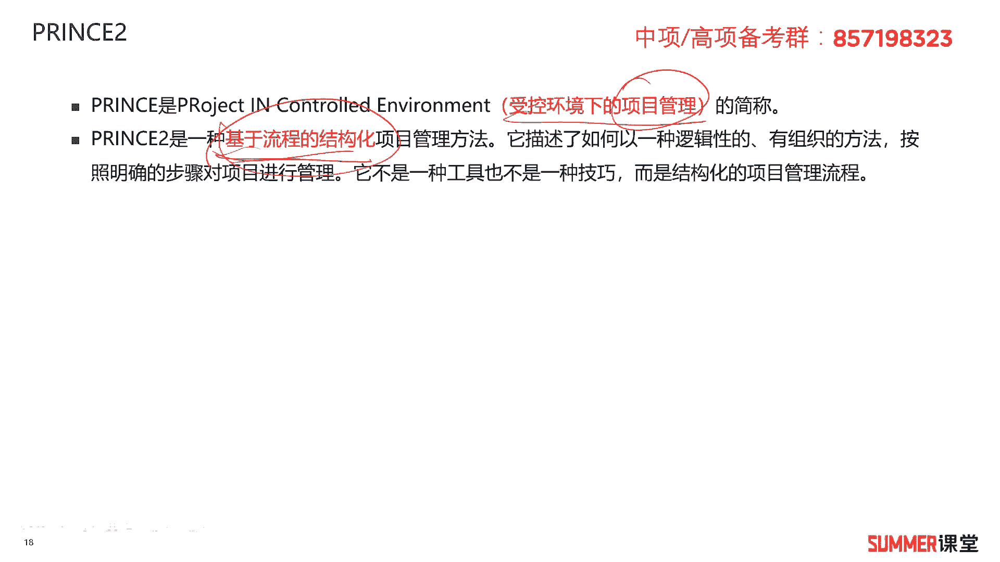

# 2023年软考信息系统项目管理师视频教程【总结到位，清晰易懂】-软考高项培训视频 - P25：2-3 IPMP PMP Prince2 - summer课堂 - BV1wM4y1Z7ny

好我们接着来看一下几个扫盲的知识点，i偏僻，偏僻和press to啊，这这两块的话基本上考试不怎么涉及，但是我们书上有，而且他是跟项目管理相关的，作为你知识的扩展还是有必要了解一下的啊。

首先i p p是什么，他是国际项目经理资质认证，说白了这是一个证书，他是国际上的项目管理的一个证书，由国际项目管理协会颁发，听起来很牛逼，带国际对吧，但是跟联合国一样啊，没毛用哈是吧，大家发现没有。

我记得想我们我读小学的时候啊，啊当时学学这个社会还是学历史啊，当时联合国秘书长这些都有海浪记哈啊，感觉比较牛逼，但是现在这些年，你是不是觉得联合国真的是一毛钱不值，有什么用啊，对吧，哼大毛二毛打架。

他他能决定就决定让人家打不打嘛对吧，所以这个东西大家了解一下就行了啊，反正也没人考i pm，那这个a p p证书它分成四个等级，a b c d，其中a级是最牛逼的啊，这是认证的高级项目经理。

了解一下就行了，那下一个就比较重要了啊，pmi pmi它是项目管理协会，或者直接叫美国的一个项目管理协会啊，他是老美的啊，它是老美的啊，这个东西比较重要，为什么。

因为这个协会他编写了一本书叫pmbok啊，英文叫pbo，它中文叫项目管理知识体系指南，这个东西很重要，怎么重要呢，因为我们高校的教材，高高校的教材是基本上是完全参考pmbok，五点第五版。

第五版的内容基本上是照抄过来的啊，没有太大的区别，高项第三版的教材是2017年更新的，然后现在pmbok它是每4年更新一次吗，2020年最新的版本是第七版，第七版，第七版依旧是十大管理啊。

依旧依旧是十大管理，没有太大的更新啊，当然里面有一些细小的这个升级啊，有一些细小的升级，所以这个大家稍微注意一下，这个东西跟我们高像是息息相关的，对吧哈哈他的他也推一个证书。

他推了一个证书叫什么叫p n p，项目管理专业人士资格认证，当然我也考了p n p啊，啊p m p，他的知识点跟我们高校项目管理的知识点，基本上是至少95%都是重合的，95%都是重合的。

只p m p考试都是选择题，相对而言会容易一些啊，会容易一些，然后这个考试考试费比较贵哈，考试费是3。9，然后还强制培训，或者你不培训也可以花钱买p d u，什么叫p d吗，就证明你参加过培训。

参加过学习的一个证明，这还是需要花钱的，所以这个考试的成本，那加起来基本上不会小于5000，有些培训可能都3000以上，所以你考下来六七千块钱是吧，那另外还需要花钱续证啊，花钱续增它有效期的话。

我记得是3年吧啊怎么花钱续增啊，就购买p6 嘛，证明你在持续学习，所以老美的这个证的话就有点麻烦啊，什么思科，包括华为的认证也是一样的，你需要持续的花钱去续证，但是高校拿到证之后终身有效。

是不是这一点还是比较比较好的，另外考试费比较低嘛，你看这种一次不过3900就打水漂了，而我们高校考试费200多块钱吗。

是吧啊，但是我还是希望大家一次能考过啊，而针对偏僻的这个级别啊，与报考他跟国际上的这个c级那是相当的，那就刚才讲的那个国际证书，国际项目管理这个证书c级相当了解一下，报考者必须具备下面的啊。

这些条件要具有学士学历或者同等大学学历，要有4500小时的什么项目管理经验，然后呃申请之日前6年内要具备什么，36个月的啊，这个项目管理经验啊，这些其实我觉得都挺扯淡的啊，包括你的学历。

因为这是美老美的一个证书，你的学历他是查不了的是吧，这个中国的一些这个这个系统他不会来查你啊，所以这个基本上没有什么限制，基本上都能考啊，你虚假承诺吗，那那就继续考呗是吧，没什么问题啊，啊没什么问题。

那p m p一年考四次，分别在三六九12月，然后p p证书有效期3年，3年过后要续pdu，说白了就是交钱，那交钱买pd，交钱证明你在不断的持续的学习，好吧啊，p m p跟我们高校啊比较接近啊，比较接近。

所以大家要了解一下，因为目前在世界内哈认可的项目管理的证书，我们国家肯定是高校，然后偏僻它在国际上的认可度还是挺高的，所以在一些外企还是有很多的考pp，还是有很多人考p n b，包括我没有在外企。

我也考了p n b啊对吧，他还是有点用啊。

还是有点用的，另外还有一个项目管理的一个证书啊。

一个体系叫princess to，那这个东西我没考过，但是我一个同事考过了解一下哈，它是指受控环境下的这个项目管理的一个简称，它基于流程的结构化项目管理方法，什么是基于流程，什么是结构化，你就不用管了。

那关键字读一下，有一个印象，如果考试考了，你出个选择题，你大概能够感觉到选择对就行了是吧，ok这是press two啊。

对大家没有太高的掌握要求，然后需要注意的就是，它把我们的这个项目分成了这个四要素啊，按照原则，流程主题项目环境这四要素啊去做划分，这个作为一个呃不是记忆吧，反正你多看两遍。

万一考到选择题。