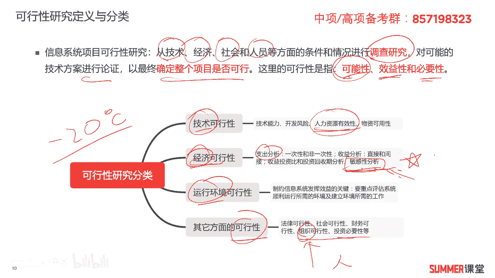
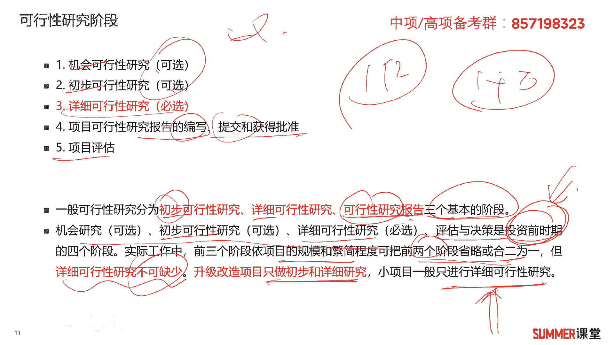
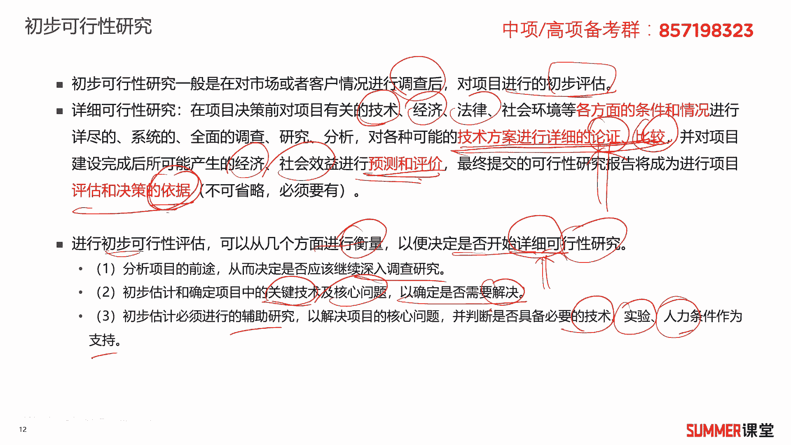
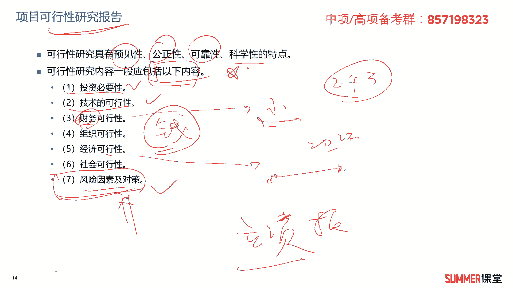

# 2023年软考信息系统项目管理师视频教程【总结到位，清晰易懂】-软考高项培训视频 - P30：3-2 可行性研究 - summer课堂 - BV1wM4y1Z7ny

好我们接着来看第二小节可行性研究，可研是一个非常重要的动作。

所以我们用单独的啊一个小节来做讲解啊，信息系统项目可行性研究是从技术，经济，社会和人员等多方面的条件和情况，进行调查研究，对可能的技术方案进行论证，以最终确定整个项目是否可行，这里面的可行性是指可能性。

效益性和必要性，就是能不能做嘛是吧，有没有效益，有没有必要，它的分类有技术可行性研究，经济可行性研究，运行环境的可行性和其他方面的可行性，技术很好理解啊，技术的能力，开发风险什么。

你有没有足够的熟练的工程师对吧，包括我给大家去讲的最通俗的一个例子，就是光照照光速的飞船，你这个技术上就不可行，那经济说白了就是钱嘛是吧，说白了就是钱，但是大家需要注意一下啊，经济可行性研究。

包括啊支出的分析，收益的分析，收益的分析里面有一个非常重要的，叫敏感性分析，一看到敏感性分析，那就是钱是经济可行性，这个需要注意哦，啊如果你是学一建的，经济里面应该会重点去讲啊，什么敏感性分析这些好吧。

讲到这里你需要知道敏感性分析，他肯定是经济可行性研究，接着是运行环境的可行性啊，运行环境有大的运行环境，比如说宏观的啊，这种是偏向于大的，这种社会层面的一些运行环境，你说乌克兰啊。

乌克兰这块他是不是就不太稳定啊是吧，就没有做一些大项目的这个可靠的环境，当然还有一些小的环境，比如说我生产一个疫苗，它要求的温度就是负的，20 20摄氏度去运输和保存，这是小的啊，运行环境嘛。

当然还有其他方面的什么法律的呀，社会的财务的呀，组织的呀，组织是什么东西啊，组织说白了就是人啊，组说白了就是人，然后还有投资的必要性，是可行性研究的分类啊，大家了解一下啊。

了解一下啊，这个可行性研究的阶段其实刚刚已经说过了，那再给大家去强调一下啊，分成机会可言，初步可言，详细可言，其中详细可言，这是必选的，前面两个可选是吧，前面两个可选，然后有项目的可行性研究报告的编写。

提交获得b批准，最后是项目的评估，下面的评估我们放到下一节里面去讲，他应该算可可研的后期阶段啊，后期阶段三个基本的阶段啊，书上我觉得写的很乱哈啊真的写的很乱，三个基本阶段有出不可言。

详细可言和可行性研究报告啊，有人说a老师他这个可言的三个阶段，为什么不是机会可言，出不可言，详细可言啊，啊反正我也这么觉得啊，但是他这么写怎么讲呢，反正我觉得不是很好是吧。

他这么写你也不能说他有多大问题，反正我个人觉得不是很好的，好，接着看，那后面就是机会可言，初步可言和详细可言以及评估决策，是投资前期的四个阶段，是不是把这些做完了才决定。

我是不是花一个亿来搞你这个项目吗，啊如果像我刚刚说的，花一个亿，最后只能收1000万回来，那我倒亏9000万，我这项目干嘛，那肯定不干呀是吧，实际工作中，前三个阶段，一项目的规模繁衍程度啊。

可以把两个阶段和合成一个阶段啊，可以把两个阶段和一个阶段，或者甚至有些小项目可以真的是可以做，把前三个阶段都合成一个都可以是吧，但是详细可行研究是必不可少的啊，必不可缺，升级项目只做初步和详细的研究。

小项目一般只进行详细，可以就是他这个动作是标准的，根据项目的大小，根据项目的实际情况，我们可以进行灵活的拆解。

可以进行灵活的拆解，接着给大家去分析一下初步可言和详细可言哈，初步可行性研究，一般是对市场或者客户的情况进行调查后，对项目进行初步的评估，刚刚已经说过了是吧，详细可言是在决策前对项目有关的技术，经济。

法律，社会环境等各方面的条件和情况，进行详尽的系统的全面的分析啊，对各种可能的技术方案进行论证和比较，这个很重要哦，我从成都到北京有多条路啊，有多种方法，具体选哪一种，要进行详细的全面的论证和比较。

最终选择诶，我坐飞机是吧，并要对项目建设完成后可能产生的经济影响，社会效益进行预测和评价，最终提交了可行性研究报告，会成为进行项目评估和决策的预计啊，项目评估和决策的依据是吧，标红的这些你多读一下啊。

多读一下，因为它往往是出选择题来考的，下午案例分析不可能让你去写写这块明白好，接着往下进行初步可行性研可行性评估啊，可以从如下几个方面进行衡量，以确定是否开始详细可进行研究。

因为有些时候你可能在机会研究，初步研究决定这个事儿就不可干，那干了之后我肯定亏钱，那就没有必要进行详细可言了嘛是吧，都进入不到这一步，如果这项目要干，肯定是要进行详细可言的。

ok啊从哪些方面来进行衡量呢，从第一个分析项目的前途，从而决定是否进行深入的研究，第二步，初步估计和确定项目中的关键技术和核心问题，以确定是否需要解决，有些关键技术如果你不突破的话。

你这个项目做不了对吧，第三初步估计必须进行的辅助研究，以解决项目的核心问题，判断是否具有必要的技术实验人力条件啊，作为知识，这是初步可言之后啊。

我们要去衡量的几个东西啊，了解作为了解的知识点好，下面来看可行性研究的步骤啊，步骤第一步确定项目的规模和目标，第二步研究正在运行的系统，第三步建立新系统的逻辑模型，第四步导出和评价各种方案。

各种方案对吧，做评估，然后推荐可行的或者建议的方案，编写可行性研究的报告，最后递交可行性研究报告，这么几个过程啊，大家了解一下啊，反正你读一读啊，不要求你背，接着可行性研究报告的内容啊，需要注意一下。

可行性研究报告的内容里面包含哪些东西呢，前面一句话哈，可信研究具有什么预见性功能，功能性，可靠性，科学性也是个性，了解一下啊，重点是可言的内容，包含投资的必要性啊，为什么要干这个项目啊，你要说明白是吧。

然后技术上是可行的啊，要要说现在a这些技术在哪些地方用啊，这个反馈怎么样啊，技术上证明他可行没有问题，财务上可行有钱啊，组织上可行，有人是吧，那有人问你，财务可行性研究跟经济可行性研究。

这两个不都是钱吗，是吧，那不都是钱吗，呃有什么区别啊，说实话哈，那本质上其实差不多，但是还是有点区别，财务一般要小一点，财务一般是小一点，比如公司的财务是吧，那你这个公司的状况，经济可行研究。

就有点像国家宏观经济这种大的形式了，是不是啊，我们从大的形式来讲，现在现在这个就是现现在2022年哈，这个阶段你去创业好像是不太合适的，大的经济形势不太好是吧，是大环境，但你从你个人来讲。

我的公司账上有2000万的现金，那我亏了也亏得起，这叫财务可行性，一个是大的，一个是小的啊，这么理解就行了哈，然后社会可可行性啊，社会的啊，这个自然状况稳定性等等，然后风险应对以及对策，这是考过的。

刚刚我是不是给大家说过吗，项目的立项报告里边啊，立项立项报告里面有没有风险及应，风险因素及应对啊，没有，这是科研里面的内容，你看考试怎么考的呀，是不是就把它混淆着混着来考了啊，注意一下啊。

你可以自己翻回去，对比一下我们的可行性研究报告的内容。

