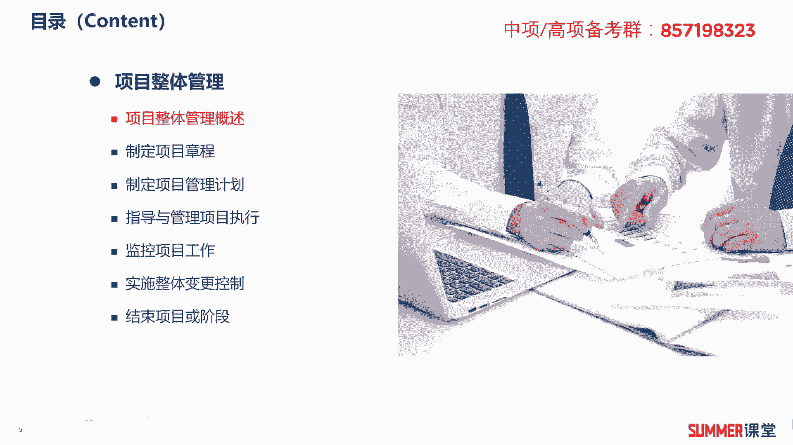
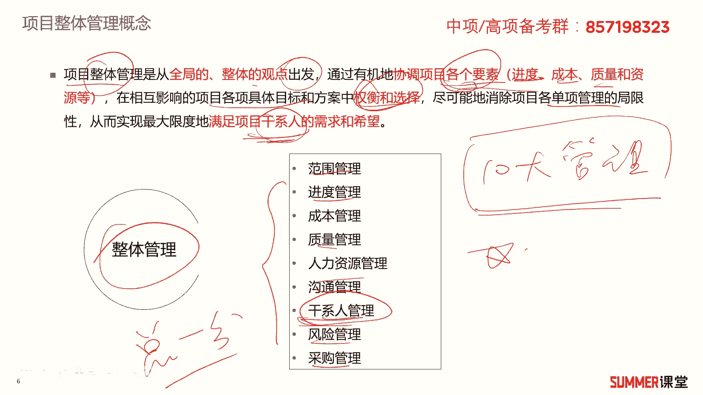
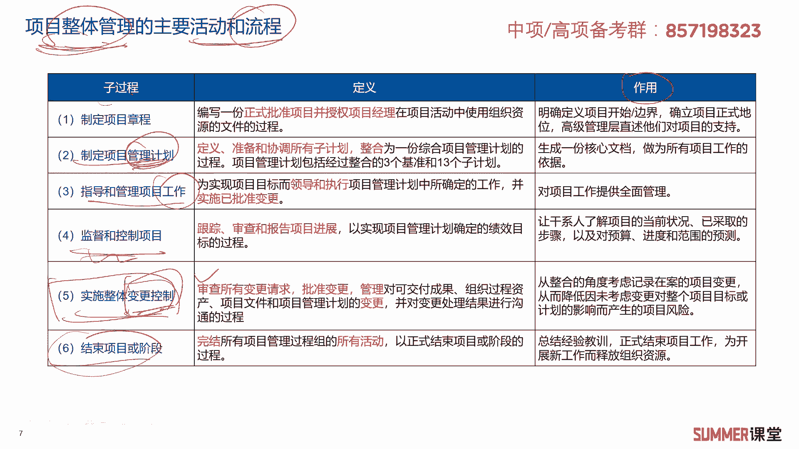
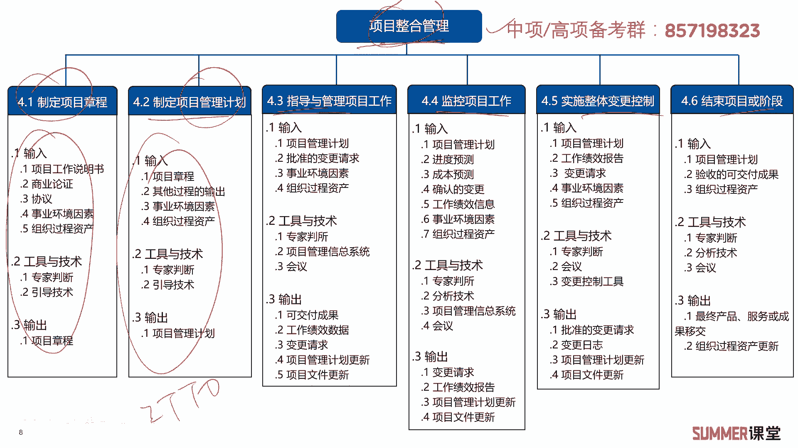

# 2023年软考信息系统项目管理师视频教程【总结到位，清晰易懂】-软考高项培训视频 - P33：4-1 项目整体管理概述 - summer课堂 - BV1wM4y1Z7ny

第一节项目整体管理概述，什么是项目整体管理啊，这里面有一个概念，他说项目整体管理是从全局的整体的观点出发，通过有机的协调各个要素，协调哪些要素呢啊包括进度，成本质量和资源等等。

在相互影响的项目各项具体目标和方案当中，权衡选择，对项目进行一个总的管理对吧，那尽可能的消除项目单项管理的局限性，从而最大限度地满足干系人的需求和希望，干系人我们前面提过，主要就是跟这个项目相关的人啊。

比如说像甲方向客户对吧，除了客户之外，干系人其实包括很多哈，包括很多，比如说我我以前举个例子，你这工地要施工附近的居民，他也是干系的，我们后面还有专门的干系人管理一个章节哈。

这里面就不细展开给大家去讲了，反正说白了项目整体管理，就从全局整体的角度出发来管理，我们项目的各个要素，最后满足大家各方的要求，是吧啊，其实我们这个十大管理的逻辑哈，十大管理的逻辑也是比较清晰的。

什么样的一个逻辑啊，总分型架构嘛，先说总的我怎么来管，就是整体管理，然后接着有九大管理范围，管理进度管理，成本管理，质量管理，人力资源沟通干系人，风险采购是吧，总分型架构，先说这个项目总体怎么干。

最后说具体的每一方面怎么干，你把这个架构理解了，后面学起来就很轻松，这是整本书的核心啊啊这本书的核心，ok项目整体管理我们怎么管呢。

那刚刚不是说了吗，西式的管理思想主要关注的是流程和标准化，那怎么干，第一步，第一步制定项目章程，第二步制定项目管理计划，第三步指导和管理项目工作，第四步，那监督和控制项目，第五步实施人体变更控制。

第六步结束项目阶段就就干这六步，你就能够实现项目的整体管理了，具体每一步的定义和作用啊，内容啊，其实怎么讲呢，其实还是有点多是吧，如果让你背下来很难，至少现在这个阶段我先不给大家去读哈，嗯也不给大家。

也不让大家去背，你学完之后，你对项目整体管理有一个基本的认识，你再来看这一页就比较清晰了是吧，我给大家解释一下项目整体管理的这个子过程，就具体怎么做，项目整体管理，第一步，先制定一个项目章程。

这相当于是一个总章，制定项目章程之后，我们要做计划嘛对吧，干事情肯定要做计划呗，我们后面基本上所有的包括你管进度，管范围，管钱都是要制定计划的，制定计划之后，我们就根据这个计划来干工作了是吧。

就指导和管理项目工作，干这个工作的过程中还要干什么呀，还要监督和控制吗，还有监控，看有没有偏离我们预先设定的计划，偏离的计划我们要实时的去纠偏对吧，所以第四步是监控，第五步实施整体变更控制，说白了。

就是你项目不可能完完全全按照计划走的啊，有些时候可能是计划有问题，有些时候是计划没问题，我走偏了，那我是不是要做相应的一些变更啊，那走偏了我再走回来呗，对啊，所以要实施整体变更控制，有些变更是允许的。

有些变更就不允许才变，哪些允许，哪些不允许，这就是变更控制的内容，后面还有一个章节专门讲变更，当然这里面有一个小节，它也是变更是吧，这里面会讲一部分，还有一部分我们会放到后面啊，放到后面变更章节去讲啊。

第六步就是结束项目或者阶段整体管理。

就干这么六部的事啊，别看只有六部哈，其实它里面内容很多，内容很多，完整的内容就在这一页看到没有，制定项项目章程怎么制定啊，啊又要干里面这么多的这个工作是吧，怎么制定项目管理计划呀。

他他是不是要给你一些思路啊，啊包括这些步骤都是整合管理，一共就分六步啊，干完这六步你整合管理就干完了，那具体每一步怎么干，他又给你一些指导，这是一些标准化的流程是吧，不一定所有的项目都完全用得上。

但是也有些项目可以往里面去选一些来用，那具体怎么用的，我们一步一步给大家去讲，ok啊这是整合管理的六个步骤，以及每个步骤里面包含的输入输出工具和技术，是不是里面都是i t t o啊，刚给大家去讲了啊。

i t t这些i d t 10大管理的，i t t还是需要要要求大家要要记得，那最好理解性的记忆，当你第一遍你不可能记得住的是吧，第一遍听我们的这个课程主要是理解啊，然后到了后期你结合做题再来记忆啊。

再来记忆，ok这就是项目整合管理的啊，整个过程啊，先给大家简单的看一下，我们后面一步一步的来讲啊。

