# 2023年软考信息系统项目管理师视频教程【总结到位，清晰易懂】-软考高项培训视频 - P34：4-2 制定项目章程 - summer课堂 - BV1wM4y1Z7ny

好我们接着来看第二小节，制定项目章程，制定项目章程，其实是我们项目整合管理的第一步是吧，然后设定项目管理计划是第二步，第三步，第四步，第五步，第六步，整个项目组合管理就是这么六个过程。

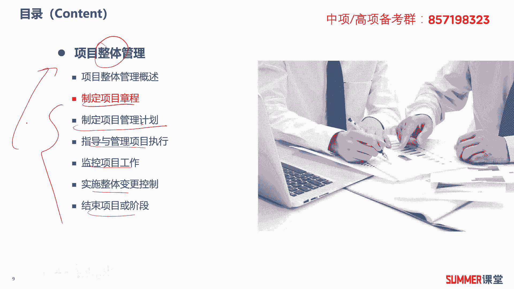

那首先来看一下第一个过程，制定项目章程，制定项目章程，它的i t t o下面的这个图啊，最核心的这个过程就是要输出项目的章程，它首先你要知道什么是项目章程啊对吧，项目章程是正式授予一个项目和项目资金。

的一个文件，它由项目发起人，一般是高层或者项目组织之外的主办人颁发，重点来了哟，项目章程干什么的，正式授权一个项目或者授权项目的资金啊，授权项目的资金，或者让项目经理可以动用组织资源，资源就很多吗。

有可能是钱，有可能是人对吧，还需要注意项目章程是由谁发起的呀，它是由项目发起人发起的，或者叫颁发的考试，经常怎么考，考，项目章程由项目经理签发，对不对，肯定不对呀，ok另外还有几句话需要注意。

这也是历年考试的高频考点，第一个第一个核心知识点就是项目章程，十大十大管理里面哈，第一个核心知识点项目章程，那项目章程正式宣布项目的存在，对项目的开始实施赋予了合法的地位，项目章程那边颁发。

意味着项目的企业手续合法，项目的投资者正式启动，项目正式启动，都是章程这个东西，它的作用对吧，可以正式的接手这个项目了啊，可以正式接手这个项目，说简单一点，项目章程是什么，启动公告啊。

启动公告就通知全员，然后项目经理他就可以动用我组织的资源了，哎比如说你要要人问谁去要，比如你要设计的人是不是要问设计部的老大，这个职能部经理需要需要人吗，对吧啊，有了这个启动公告之后。

赋予了你动用组织资源这样的一个能力，然后你才能够去要的，这就是项目章程，它是制定项目章程这个过程的一个输出文件啊。

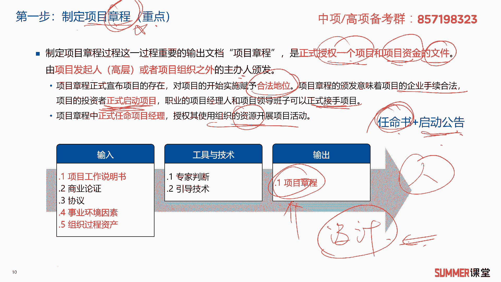

一个输出文件，ok非常重要哦，项目章程它主要包含的一些内容，时点这十点不要求大家要背下来，但是你要读一读比较熟悉，我还是给大家读一下哈，项目当成主要的内容，有概括性的项目描述和产品描述。

这个项目要干什么，最后要说出什么东西，它是概括性的，不是那么详细对吧，刚开始那项目的初期，也不可能做得特别详细是吧，那第二他有项目的目的或者批准项目的理由，项目的总体要求，包括总体的范围。

总体的质量要求等等啊，可测量的项目目标和相关的成功标准啊，这个应该是选择题里面经常考的啊，多读一下项目的主要风险啊，看到没有他这里面的一些关键词哈，概括性的总体要求，主要风险，总体的里程碑计划。

总体的预算，然后还有一些审批的要求，委派项目经理以及项目，以及项目经理的职责和职权啊，委派的项目经理是谁对吧，姓名这些写下来，发起人或者其他批准项目章程的人，员的姓名和职权，谁批准的这个项目经理。

这个项目章程一般是公司的老总或者副总，对不对啊，这十点啊一定要多读一下，因为项目章程是非常重要的一个文件，我们把它再总结一下，再简单的说一下项目中长章程主要有什么作用，第一个让项目经理看清方向。

主要我这个项目要干什么嘛对吧，你有一些概括性的项目描述和产品描述，然后项目的目的这些都有说明，第二个认清形式啊，这个项目是要花多少钱，大体花多少钱，你有你有多少钱，你才能干多大的事儿是吧，认清形势。

另外一个就是分清责任，什么叫分清责任呢，就项目章程里面其他有定义，我们项目的这个大的方向是吧，有定义大的方向，我们项目经理就按照这个大的方向去干，如果干完之后发现你项目的方向都不对。

那最后肯定是不不能达到客户的一个要求的，那这是谁的问题，如果你项目经理里面啊不对，你的项目章程里面写的方向不对，那肯定不是项目经理的责任啊，那是发起人的责任是吧，项目章程是发起人制定的，明白啊。

这就是项目章程这个文件它的作用啊，顺便再问大家一个问题，如果项目章程要修改，由谁去修改啊，给你几个选项，a项目经理b发起的c c c b啊，变更控制委员会啊，d项目成员由谁由谁去修改。

嗯肯定是由发起的去修改啊，一般人能动项目当什么啊，不能动的哈对吧，ok啊这个大家啊理解记得项目章程啊。

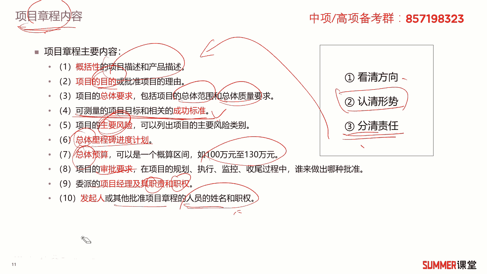

具体具体长什么样哈啊具体就长这样子，这是一个信息系统项目章程模板，项目的名称啊，批准的时间，项目背景的介绍，目标这个项目相关的一些人，项目的产品项目经理是谁，你可以用的一些资源条件。

然后签发人签发时间啊，这些项目章程比较简单是吧，一些小呃，一些大项目的这个章程相对复杂啊，但有些项目的这个项目章程可能就简单一点啊，这个是可可简可繁的，有些时候项目章程也叫项目任务输入。

或者项目许可证书，项目启动文件名称不一样啊，名称不一样。

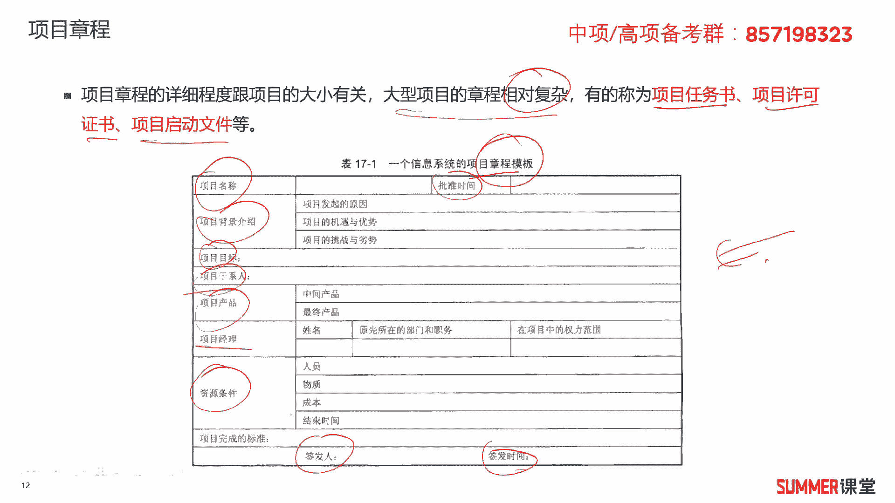

但是啊本质啊就是啊就可能是项目项目章程啊，好我们再来看一下啊，这点项目章程的注意事项啊，这是一些经常考的一些点哈，项目以外的实体来启动啊，比如说常见的是发起人啊，po项目管理办公室。

然后项目组合指导委员会啊，经批准的项目章程啊，意味着项目的正式启动，项目章程在执行组织与需求组织之间，建立起了和建立起了伙伴关系，通过编制我们的项目章程，来确认项目符合组织的战略和日常运营的需要。

不要把项目当成看成合同，因为其中未承诺报酬或金钱，或用于交换的对价啊，这些东西的话呃怎么讲呢，啊读一读哈啊读一读啊，多少呢啊，不是吧，我们前面给大家去强调过，做科研的时候还没有项目经理，对吧啊。

一般是在一般是在制定项目章程的时候，最好是项目经理能参与项目章程的一个制定，让他对项目有基本的了解，注意哦，这里面需要注意哈，标红的项目经理应该尽早参与项目章程的制定。

也就是在整合管理的前期制定项目章程的时候，让他参与项目章程的制定，但是这是让他参与哈，不是说让完全由项目经理来发起这个项目章程，是吧啊，让他参与制定，了解我们项目的一些总体目标啊，这个趋势需要注意的是。

让他参与，不是说这个这个这个项目章程，就是由项目经理发起的，他发起或者是他发布，是由是由这些人来发布的啊，这是需要注意的，不要混淆哈，那这句话是对的，项目经理应该尽早参与项目章程的制定。

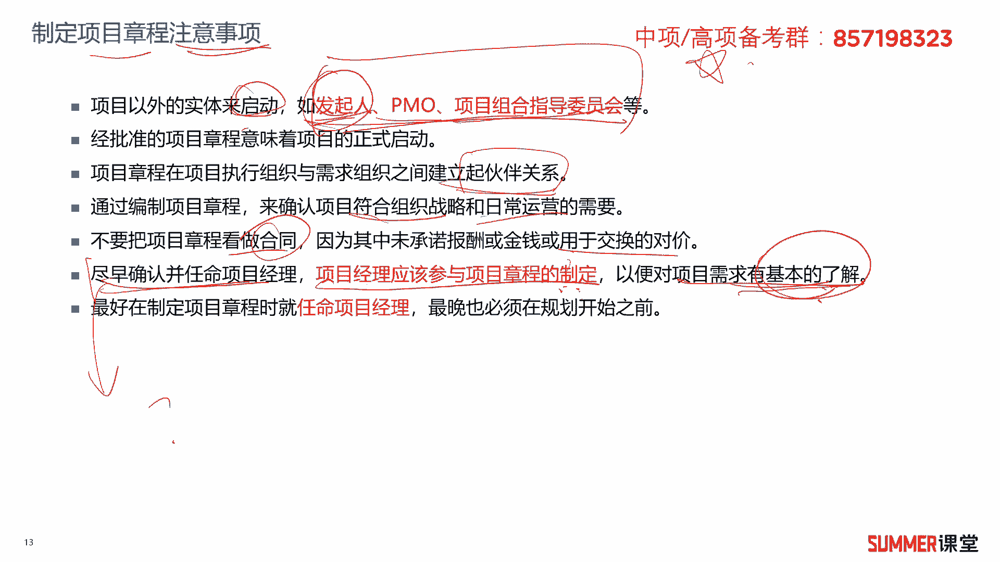

参与它的制定啊，没有问题，但是但是如果如果说由谁来颁发。

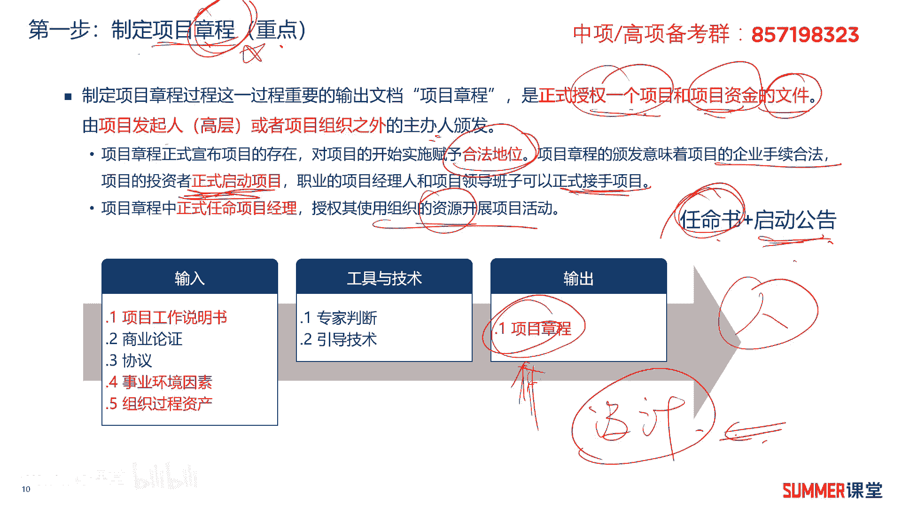

由项目经理来颁发，那就错了啊，这这一点应该以一些人可能会有点疑惑啊，会有一点疑惑，最晚也要在我们规划之前，规划是不是制定项目章程的下一个动作啊，也就是说你可以项目章程制定完了。

因为做规划相当于是不是做计划嘛，做打草稿，这项目怎么干，项目怎么干呀，是由谁去做这个计划呀，那肯定是要项目经理，带着我们的项目团队去做计划了嘛对吧，那肯定要有一个领头羊，那这时候项目经理一定要存在了。

没有没有一个领头羊，下面的人也不知道干啥呀是吧。

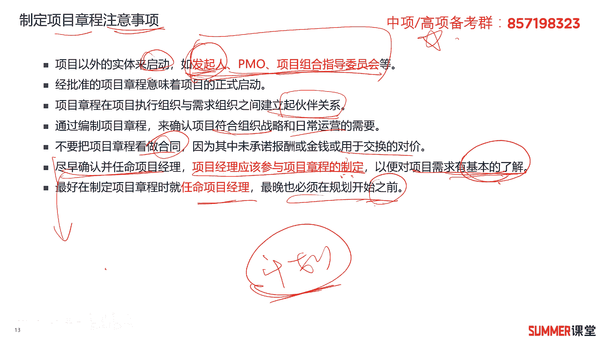

这是制定项目章程需要注意的几个点好，我们来看两道练习题，这是2013年的一道真题，他说某项目经理所在的单位，正在启动一个新的项目，配备了虚拟项目小组，什么叫虚拟项目小组啊。

就有类似于这种矩阵型的管理架构是吧，如果说虚拟项目小组啊，一般还还到不到举证呢，有点像这个职能部门里面抽几个人，抽出来给他组成这种项目小组，根据过去的经验啊，在项目经理认识诶。

这个小组成员对职能经理的配合啊，远超过对项目经理的配合，因此项目经理决定请求单位要制定什么东西，很明显嘛，他这个虚拟小组哈，虚拟小组，其实一般来讲，你来讲只能职能型组织里面会多一些啊。

当然他这里面说的是矩阵去环境哈，这肯定就是一个矩阵架构了啊，说白了就是从几个部门里面抽了，抽了abc这三个人出来组成一个虚拟项目小组，这是不是一个矩阵型的项目组织啊，啊去申请了这个项目的项目组织。

他觉得这些人都是属于都是属于这几个部门的，平时应该听他们部门经理的话多一点，不怎么听，不怎么鸟这个项目经理，那要怎么办，让他们尽量的配合，赋予项目经理调动组织资源的这样的一个权利，你如果没有项目章程。

就没有这个群，你这个项目经理就相当于没有上方宝剑嘛是吧，人家就不鸟你对吧，所以这里面是要求单位制定项目章程，那这题还是比较比较经典的哈啊比较经典，所以这道题选择b好，接着再看一道题，项目经理对项目负责。

其正式权利有什么，获得项目章程，这道题就简单很多了是吧，简单粗暴，项目章程正式赋予项目经理的这个权限。

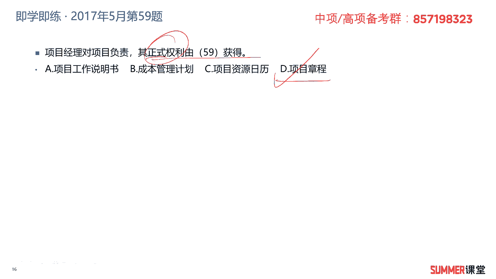

ok所以这道题选择d答案好，我们先前主要讲的是什么啊，项目章程也就是智力，项目章程这个过程它关键的一个输出文件，关键的输出文件就只有一个项目章程啊，说到这儿的话啊，说到这儿的话，顺便给大家去强调一下。

因为我们后面讲的内容，会涉及到大量的i t t o，就是这样的这样的图形啊，i t t o怎么去学，怎么去记这个i t t o呢，我有一个建议就是你先看输出，一般来讲输出内容相对而言会少一些啊。

方便记忆，然后你这第一个第一点，第二点就是你可以通过输出去反推，他可能的输入可能和可能的工具和技术，这个逻辑是比较清晰的，它是有一定逻辑的，那就跟我刚刚讲的最早讲的那个例子一样，我要做一个实施方案诶。

我可以参考什么资料啊对吧，那比如说我为了得到这个项目章程，我要参考哪些资料啊，要参考哪些资料啊，这里面主要是这么五个啊，五个啊，第一个啊，第一个是项目工作说明书，它是由项目提供的产品或者服务的文字说明。

就我这项目最终要开发出什么个东西来，或者是要诞生什么样的服务啊，有个基本的一个说明，比较简单啊，商业论证是从商业角度提供必要的一些信息，决定项目是否投资，比如说前面那些这个呃可言差，也算商业论证是吧啊。

第三个就协议协议包含的东西比较多了啊，有合同，有谅解备忘录，然后协议输入口头协议，有包括邮件啊等等，这些都可以算协议，协议合同是比较正式的，你看其他的相对而言就没有那么正式对吧啊，第四个和第五个啊。

这是关键哦啊这是关键哦，这是历年考试的一个重点核心考点，事业环境因素和组织过程资产，希望大家务必要理解，因为这两个东西是很多过程的输入啊，是很多过程的输入，除了这儿要用，那要参考它。

其他后面还有非常多的过程要参考这两个东西，所以大家务必要理解。

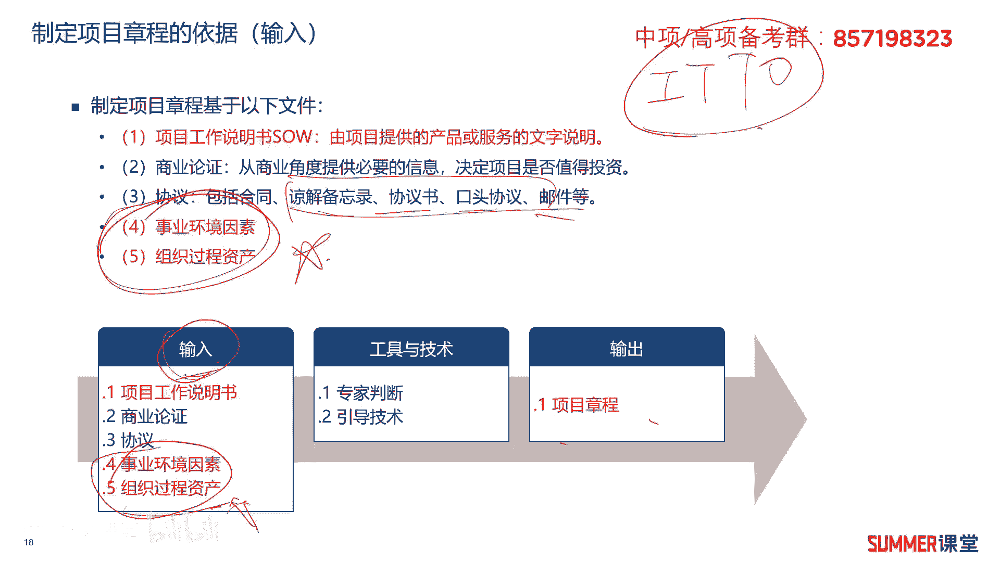

首先什么是事业环境因素呢，它是围绕项目或影响项目成败的，任何内外部环境因素，这个说了当没说，每个字都认识，但是讲完不知道他说的是什么东西对吧，我给大家简单总结一下，它就是客观存在的一些东西。

他可能是积极的，也可能是消极的，不可能因为你做这个项目，它就产生变化变化，那典型的事业环境因素有哪些啊，比如说我这个公司的文化，那文化这个东西是长久积累下来的是吧。

不可能因为你这个项目我改改变我公司的文化，还有一些规章制度，法律法规标准等等，这些东西能改变吗，能不能改变，不能改变对吧，客观存在的，你变不了，你没有办法，你只能接受的这种叫事业环境因素。

事业环境因素包含的内容挺多哈，那我们还是给大家看一下啊，包含哪些呢，前面给大家去说了文化啊，规章制度，法律法规这些，还有一些现有的一些人力资源啊，现于现有的人力资源，还有就是人事管理的一些制度方针啊。

这是公司规定的啊，接着第六个是公司工作核准制度啊，工作核准制度，什么叫工作核准制度啊，啊简单理解就是每天早上八点上班，五点下班，这这种制度对吧，大的制度不能变，还有市场因素啊，干系人风险承受能力。

那是干这个人的风险承受能力啊，基本上也是也是不太可变的啊，第八第九标红的，还有第六啊，这几点需要注意一下，这是考试经常考的商业数据库啊，比如说成本估算的数据，行业风险研究信息，风险数据库，风险数据库。

这个考过考过几次了哈啊，成本估算的这个数据，成本估算的数据是什么东西啊，那如果在建筑领域，它应该叫定额啊，什么叫定额，什么叫定额，定额就是我这个地区政府统计的市场，市场价格啊，比如水泥多少钱1吨。

然后然后我的那个钢筋啊多少钱1吨是吧，这些就是成本估算的一些数据嘛，它是他算一个商业数据库啊，商业数据库接着就是项目管理信息系统，就是一套软件啊，简单理解就一套软件，这些都是不可变的啊，不可变的啊。

比如项目管理的一个软件，你不可能因为我这个项目，让这个软件开发商给我单独的定制开发一下，是吧啊，这些都是事业环境因素，大家一定要要读一读啊，比较熟悉啊，比较熟悉，说实话事业环境因素还稍微难理解一点啊。

有点绕啊，给大家总结的就是客观存在，客观承认。

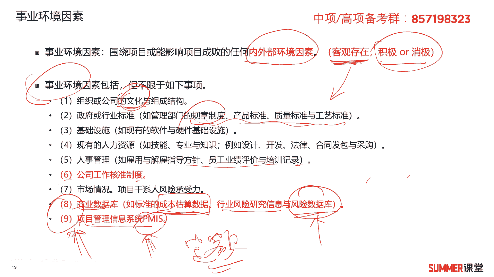

一般般来讲我们是动不了的啊，一般来讲是动不了的，然后另外一个叫组织过程资产啊，这个东西就好理解了啊，非常好理解哼，他是反映组织从以前项目当中吸取的一些，经验教训，或者学习到的一些知识，简单来讲。

哪些是组织过程资产，我们产生了一些文档啊，经验教训是吧，那当然组织在项目管理过程中，制定的各种规章制度啊，指导方针是什么规范啊，行为准则工具等等，它都是组织过程资产，有人说老师不对呀。

你刚刚怎么跟我们讲的，刚刚你说了什么规章制度，这个标准规范，他不是事业环境因素吗，为什么这儿又搞成什么组织过程资产，两个不是重叠了吗，那重不重叠不处理，为什么这里面有限制啊。

在项目管理过程中制定的这些东西，是组织过程资产，如果他单独说规章制度规范标准，那肯定是事业环境因素对吧，要看前提条件哦，这是需要注意的，还有就是历史项目的一些经验和教训。

那经验就成功的教训就失败了嘛对吧，一般来讲教训是失败了，还有一些文档啊，历史信息都是组织过程资产啊，组织过程资产，这个东西应该是比较好理解的对吧。

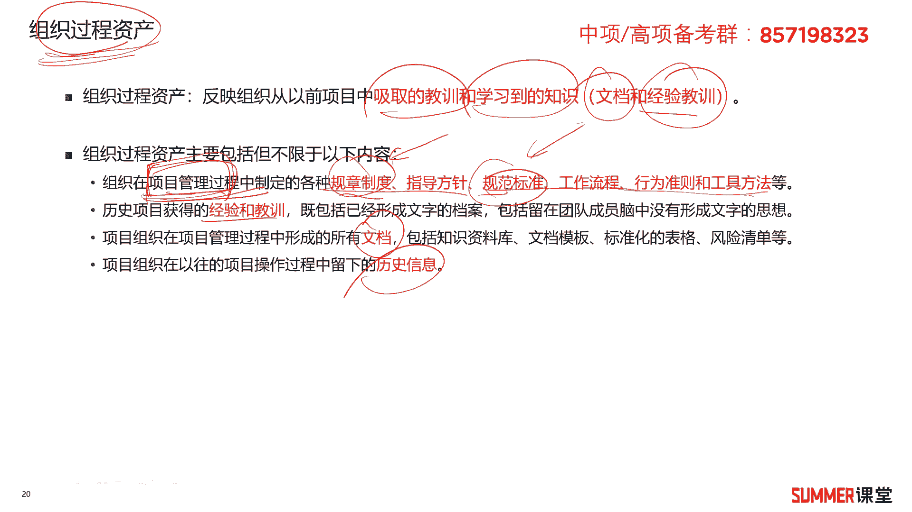

至少会比我们的事业环境因素好理解的多啊，这里面给大家去做了一个对比，这个东西很重要哦，非常非常重要，事业环境因素是内外部的环境因素，它是客观的，一般来讲我们动不了啊，不能改变。

然后组织过程资产主要就是文档和经验教训，还有一些历史信息，对吧啊，这个对比的表格希望大家下来多看一下啊，多读一下啊，不要求你背啊。

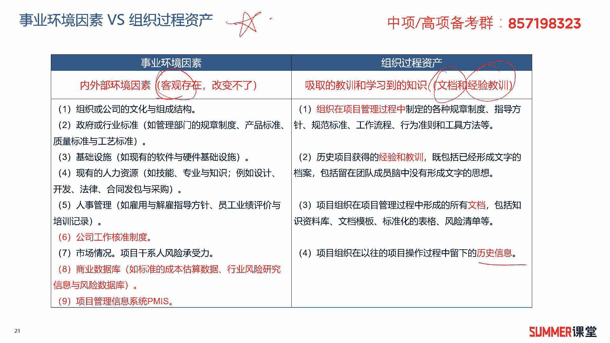

这个不会让你去默写，但是他会出选择题啊，会出选择题好。

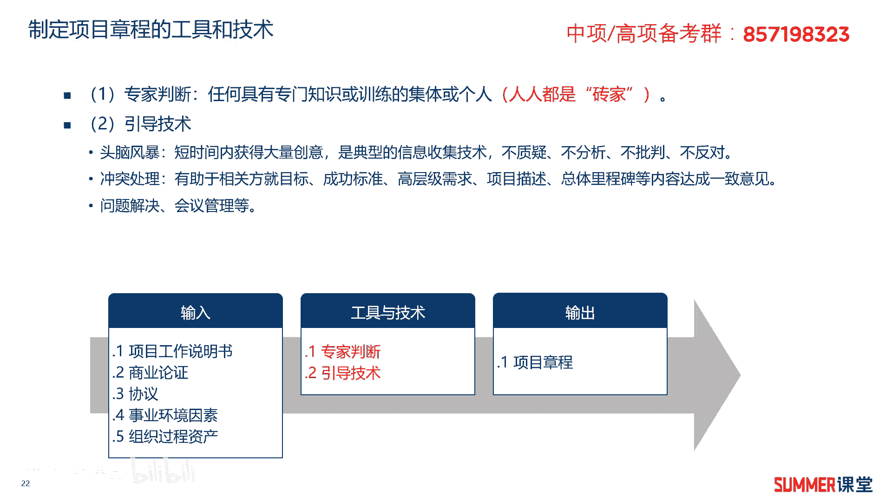

我们这一部分讲的是什么，相当于我们首先是讲的讲的这个输出是吧。

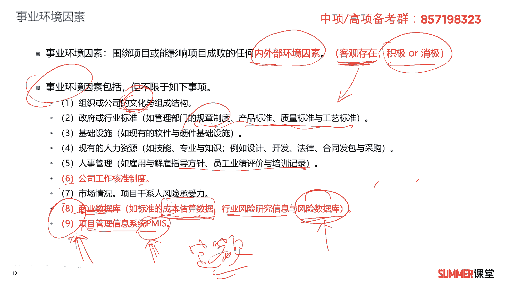

项目章程给你讲了，然后a我们讲了，接着把输入文件给你讲了，我们接着就来看工具和技术了啊，发现我们讲的这个步骤是倒叙哈，我觉得倒叙是符合人们的这个思维逻辑的，就是我为了要得到这个东西是吧。

我要参考什么东西，参考的这些东西怎么得到它呢，它会有一些工具和技术。

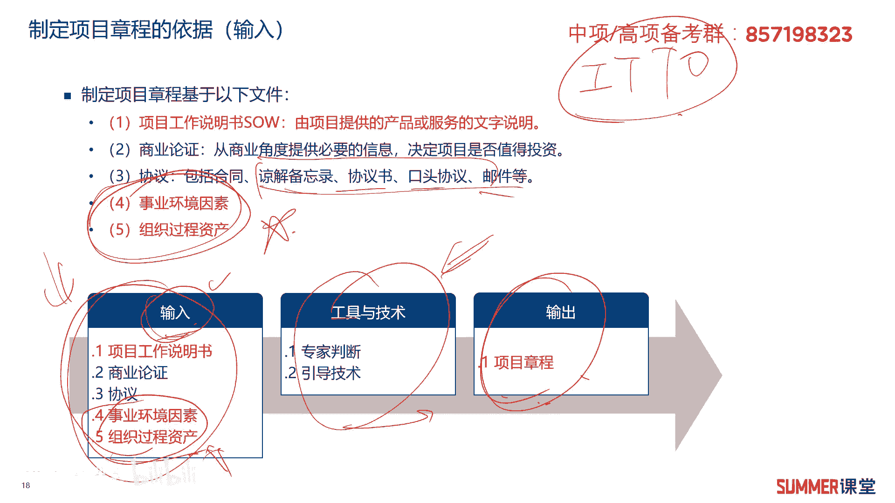

它底层是有这样的一个逻辑在里面的啊，有这样的逻辑好，我们来看一下啊，就中间这部分工具和技术，工具技术两个专家判断和引导技术专家判断，这个比较简单，就是找有说简单一点，就找专家来给你判断一下啊。

我我怎么输出这个项目章程是吧啊，想不到是什么东西，那就写你讲的，你也要写写个方案，那怎么办，那找专家来给我指导一下，是不是，但是这里面需要处理专家，他不一定不一定就是专家库里面的专家啊，比如说夏老师啊。

还是财政啊，什么发改的专家对吧，他不一定是这种专家库的专家，任何具备专业知识或者训练的集体和个人，他都可以被称为专家，就人人都是专家对吧，那你这个专家可能找一个职能部门的经理啊，甚至他不是经理。

他是你们这个公司比较有经验的一个人，让他过来给你指导指导，那这就叫专家判断嘛，那比较简单，专业判断在后面的很多过程还会用得上，我们这里面重点来说一下引导技术，什么是引导技术呢，啊什么是引导技术。

听起来好像有点高大上哈，简单来讲就是在某些时候需要人来引导一下啊，举个例子啊，举个例子啊，比如说我们讨论啊，今天那今天晚上我们要聚餐啊，吃什么东西呢，然后就进行头脑风暴啊，我们部门十个人。

大家轮流发言啊，有些人说今天晚上我们吃火锅，有些晚上有些说我们吃烤肉，还有些说哎整个西餐嘛对吧，高大上一点，然后讨论讨论者就各种意见就出来了啊，可能有的人就突然蹦了出来啊，我们吃个什么外星人啊。

这个外星人，然后有人就说诶有没有外星人啊对吧，外星人在哪啊啊等等，就越讨论越偏了啊，这是我们进行讨论和进行投脑风暴的时候，经常会会会遇到的，就是有些时候走着走着就走偏了对吧，那这时候可能你们老大就说。

我们我们回不要不要逃走偏了哈，啊给大家十分钟啊，一定要决定晚上吃什么啊，所以这时候就又把本来已经偏到偏到外星人，骗到什么81区的，这种讨论是又给你揪回来了呀，所以你的领导其实他就是在引导嘛对吧。

这就是引导基础，让大家不要太偏离我们的目标啊，引导技术经常被用于头脑风暴啊，冲突处理问题的解决或者会议管理，那典型的开会也是，如果大家在那瞎讨论，那最后开不出个什么东西来了。

一定要有一个会议的一个管理人或者主持人，他就是引导大家达到会议的一个目的吗对吧，那这就是引导技术，你说我要用文字给你解释一下什么是引导技术，这玩意儿很难，但是我讲一个例子，你应该就能理解了对吧。

讲个例子就能理解他经常被用在这些地方，这是考试的考点选择题里面出过好多次的，顺便再给大家讲一下头脑风暴啊，什么是投脑风暴啊，刚刚我讲的那个例子就投了风暴啊，晚上吃什么，大家自己就是随便发言对吧。

我们不质疑，也不分析，也不批判啊，也不反对啊，随便随便发言，这叫头脑风暴，它可以在短时间内收集到大量的一些创意，注意到大量的信息，也是典型的信息收集的一个技术，我们后面还会讲信息收集哈，包括收集需求。

然后冲突管理，就是a和b本来他们在工作上有矛盾是吧啊，有矛盾，这时候我们领导是不是可以去引导一下呀，啊找a b分别谈一下心，喝一顿酒啊，怎么着啊，我们肯定是要向大家的好的方面去看嘛，对吧啊。

引导一下大家往好的方面去看啊，就是冲突的地方，我们尽量的尽量的把它给淡化，是不需要引导啊，这需要引导是吧啊，问题解决会议这个就不用说了啊，都都可以啊，采用引导技术，这是关于关于制定项目章程的工具和技术。

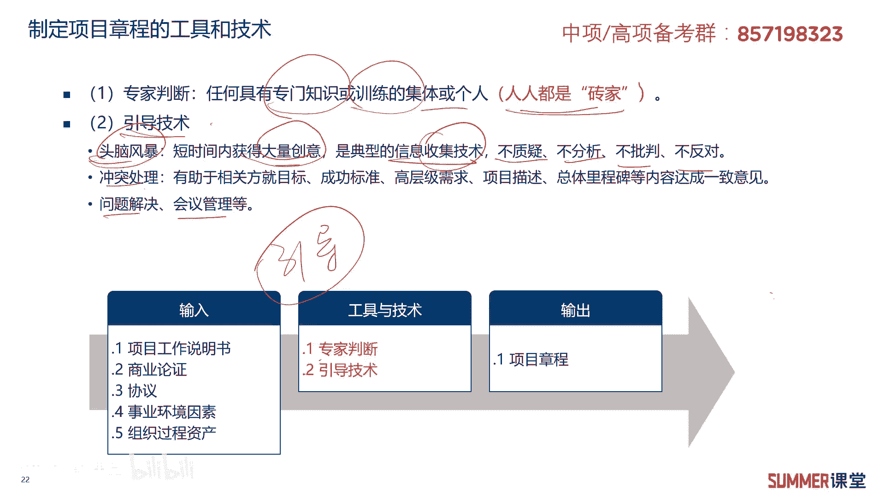

相对而言还是比较简单，后面还有引导技术的一些说明哈啊，给大家简单看一下，它是一种领导力的风格啊，无需大权在握啊，引导者的工作就是促使他人承担责任，引导者被邀请来主持会议，但不参加会议的讨论。

也不去批评判或者影响会议的结果，只是你会议走偏了的时候，我给你拉回来，往我们这会用目标靠一靠是吧，引导者在聚焦，而聚焦在会议如何高效的开展，他不会向参加者提供他个人的意见，而是会提供会议的流程和工具。

引导者不会赞成某个观点，而是要确保每个人的心声，都能够被其他人听得到，引导技术可以用于头脑风暴冲突管理问题解决，会议在制定项目管理计划的时候，也可以使用这句话是什么东西啊。

啊这句话前半句后半句就是两个选项啊，这是两个选项，所以需要注意啊，啊选择题里面经常会出现的。

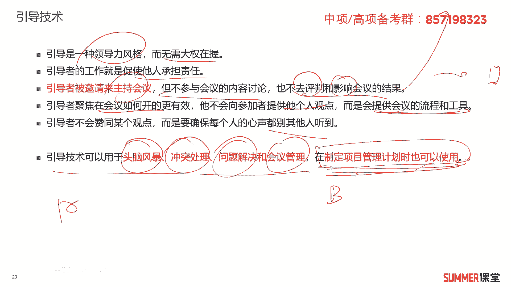

然后上面这些啊，大家读一读啊，读一读啊，引导有哪些作用呢，啊有哪些作用啊，这里面总结了一下哈，这东西在什么地方用啊，比如说你写论文，有些时候你要写一些工具和技术，就制定项目章程怎么制制定的呀对吧。

那你可以可能就会用到引导技术吗，那写论文的时候是引导技术，那是引导技术怎么去引导的呀，那它实现了一个什么效果啊，有什么作用啊，诶写论文是不是就用上了啊，引导技术的作用啊，几个点给大家简单看一下哈。

第一个协助团队成员理清自己的需要，并且制定行动计划去满足这些需要，第二个为团队提供流程和决策流程，帮助团队节省时间，然后做出高质量的决策，决策的时候，包括做计划的时候，都可以用引导技术啊，不要走偏嘛。

第三确保团队高效的讨论不偏离主力，特别是开会的时候，会议过程中是不是尽量的要有人去引导一下，第四个他能够促进团队达成共识，确保每个人的意见都被考虑到，在团队协作过程中，辅导团队解决冲突。

我们尽量往共同利益去看啊，不要为那些鸡毛蒜皮的事情，搞得大家不和谐，不开心是吧，第六帮助团队有效地利用内部和外部资源，第七引导大家分担责任，激励团队中每个人的影响力嗯，这些点的话啊，你稍微看一下。

可以结合自己的一些实际情况去做一定的扩展。

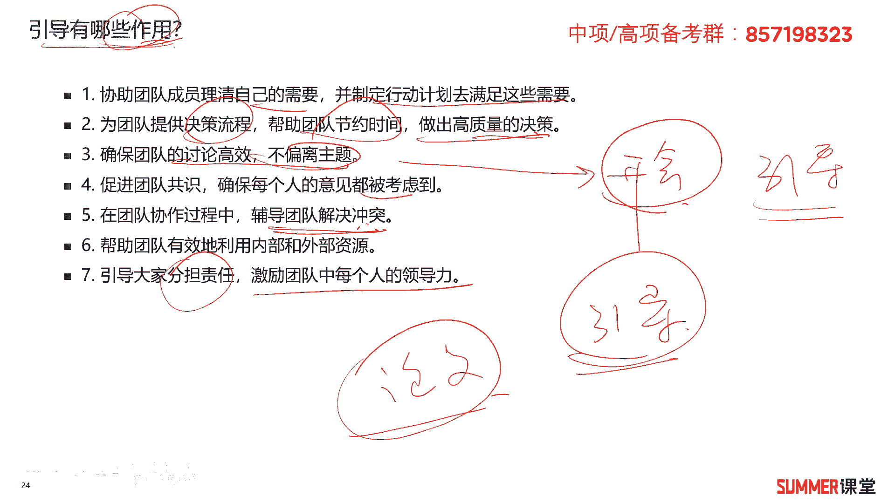

这个主要是写论文用的啊。