# 2023年软考信息系统项目管理师视频教程【总结到位，清晰易懂】-软考高项培训视频 - P35：4-3 制定项目管理计划 - summer课堂 - BV1wM4y1Z7ny

好我们刚刚讲了项目整合管理的第一步，制定项目章程啊，接着进入第二步，制定项目管理计划，项目章程是授予我们项目经理权限，授予了你权限之后，你是不是要干事情啊，那你怎么驱赶项目呢，第一步是不是要做计划。

计划这个东西，基本上是贯穿于所有的管理过程的啊，无论是管质量还是管成本。

肯定都是要做计划的对吧，我们整体管理也是要做计划的啊，首先来看一下制定项目管理计划，它这个过程它是定义准备和协调所有的子计划，并且把它们整合为一份综合的项目管理，计划的过程啊，这么一看好像两眼一抹黑啊。

说白了就是你在这个整合管理里面，总的就总分总架构里面，你是不是要要考虑其他的分项的子计划呀，啊比如说成本管理计划，然后质量管理计划，范围管理计划是吧，你要考虑到啊，就是你要把其他要要定义准备好。

协调到其他所有的这种子计划，并且把它们整合起来，整合起来作用是生成一份核心文件啊，作为所有项目工作的依据啊，所有项目工作最核心的十大管理，是不是你这个是总的，然后我们后面还有很多分的管理呢，是吧啊。

什么质量管理啊，这些都是你后面的项目工作吗，你都是要依据我的项目管理，这个大的计划的对吧，那整个i t t啊，如下图所示，它最核心的输出是项目管理计划，制定项目管理计划，肯定要输出项目管理计划了是吧。

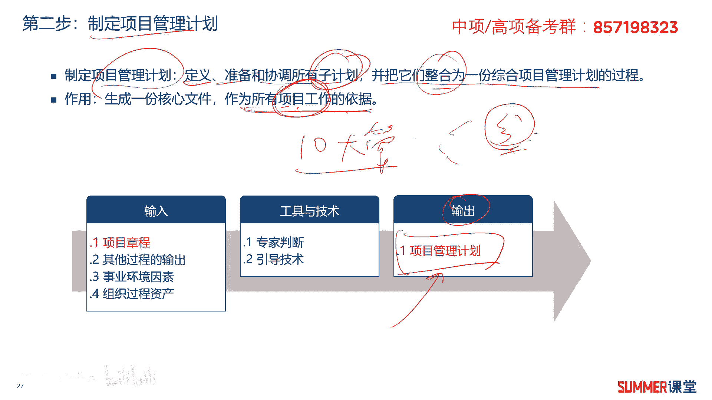

下面我们重点来看一下制定项目管理计划，它的核心输出文件，项目管理计划，项目管理计划是项目的主计划，总体计划，他确认了执行监控和结束项目的方式和方法，包括项目所需要执行的过程，项目生命周期。

里程碑和阶段划分等全局的内容，标红的考虑考虑他不会让你去填，他写一句话出来问你，对不对，就a b c d几个选项嘛，那你选对的是吧，下面哪个说法是对的啊，你需要注意哈。

项目管理计划包含这几个东西等全局的内容，项目管理计划是其他子计划制定的依据和基础，我们后面比如说你要讲成本管理的时候，要学成本管理的时候，成本管理是不是有个成本管理计划，成本管理的一个计划。

成本管理的计划，它的输入就有一个项目管理计划，你做成本管理计划，从子计划的时候，你要参考项目管理计划明白，所以他是从整体上指导我们项目工作的，有序进行，项目管理计划详略均可啊，一般第一次做的话。

项目管理计划都比较粗，因为你的输入信息不是特别多嘛对吧，它主要由子计划和基准构成啊，子计划和基层构成，它还包括里程碑清单，资源是你风险登记册，这也是考点好问，你项目管理计划不包括哪一个。

给你写个a b c d几个选项出来啊，这些都是包括的哈啊前面标红的明白，那需要大家就要稍微记一下喽。

啊需要大家稍微记一下，我们来看一下项目管理计划的一个构成，项目管理有计划的过程，主要有这么多个子计划，然后有有有有三个基准来构成四个基准哈，说这个我截的是，偏不可以pmbok第六版啊。

里面的内容如果按照pp和第五版的话，他应该就是基准的话，就三个啊，子计划和基准有什么区别，大家清楚吗，那子计划应该都能理解哈，前面我不是讲过吗，啊整个架构是总分型架构，你做项目管理计划是一个总计划。

总计划里面其实包含很多分计划的是吧，分计划就是你的什么质量啊，成本啊这些啊，它它它包含的分计划，那基准是什么东西啊，啊记住我简单给大家举个例子，那简单给大家举个例子，就是我要从成都啊，又是又是从成都哈。

我要从成都出发，要去北京啊，要去北京有三条路，有三种方法啊，可以开车去，可以坐高铁，还可以坐飞机啊，还可以坐飞机，这三种我都可以把它做成计划嘛对吧，这三条路啊都是可以的，但是啊最后啊领导说啊。

家里面的这个领导说啊，我们这次就一定要坐高铁，被领导确认拍板了的这种计划，那就是基准了对吧，那就坐坐高铁为是，是不是啊，这就是基准哈，同样我们落实到具体的项目当中也是一样的啊，也是一样的啊。

比如说客户要买买一批交换机，那具体买哪个厂商的呢啊可以买几种选项啊，比如说最稳定的啊，可能买国外的，买四颗，然后但是考虑到国产化啊，然后我们资金又有限，那就买可能买这个锐捷的啊。

有些时候还考虑我可能要买个大牌了啊，是不是要买买华为的呀，这三个都是计划，但是最后领导一拍板啊，说我们这次就要用思科的，那用思科的就是一个基准的，所以什么是基准。

基准就是被拍板被确认了的这种计划就叫基准，这基准跟计划的一个区别，希望大家要注意一下啊，项目管理计划就包含这些内容，主要是这种子计划，还有三个基准啊，有些时候会把它看作四个基准。

另外项目管理计划和项目文件啊，它是不一样的啊，至于什么是项目文件，项目文件里面有很多内容，这些内容在后面都会学，所以现在先不给大家去展开了展开，因为这些你都没学对吧，你也不懂啊。

所以啊所以就我们后面啊再再来学啊，后面再来学，学完之后你翻过头来看这些东西。

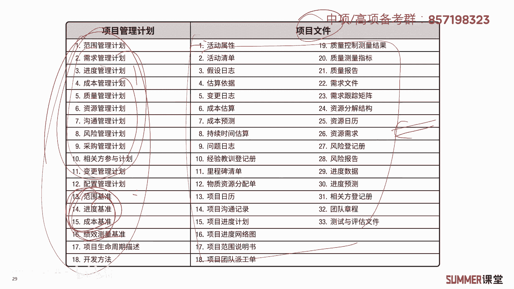

就会印象更加深刻，好吧，这是关于项目管理计划，我们下面做一道题，它是关于制定项目管理计划的描述，不正确的是哪一个，a进度基准，成本基准和风险分级测，是制定项目管理计划的输入，对不对啊。

有些人可能还不熟啊，不熟没关系，我们接着看后面感，接着看后面b项目管理计划制定啊，确定了执行监控和结束项目的方式方法，这是不是前面讲过的一句原话，没问题，肯定是对的，所以治理项目管理计划时。

专家判断是常用的工具和技术。

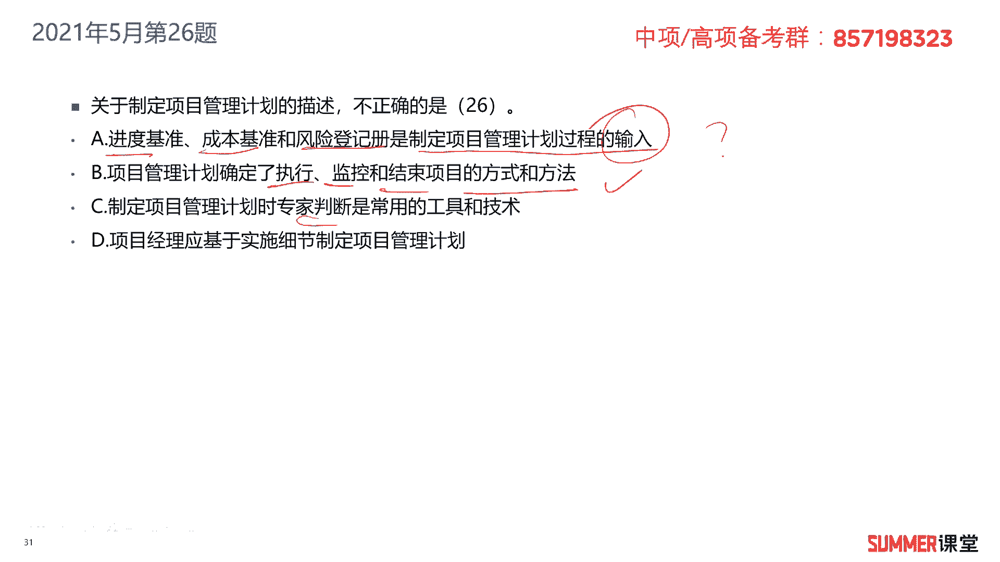

有没有制定项目管理计划，有专家判断吗，这还没给大家去讲到哈，那这个也不需要讲了吗，跟前面的制定项目章程是不一样的啊。

一样的啊，所以b和c肯定是没有问题的对吧，那再看一下d，项目经理应基于实施细节制定项目管理计划，对不对，对不对不对，d很明显是错的啊，为什么项目管理计划一般来讲是个总计划，它可详可虐。

我们第一次制定的时候，绝大部分不可能有太多的实施细节的，第一次制定的时候，一般来讲它都是虐的是吧啊，我们项目管理计划是在后期不断的去优化啊，去更新，把这个计划越做越好嘛对吧，比如说让你现在啊。

比如我们国家就国家要做个14 五规划啊，14 五规划它是一个总体的规划，后期其实每年都会基于14 五规划里面的，一些要求，做一些更细致的深入的规划啊，相当于做计划的一个更新的对吧。

所以他刚要基于实施细节去做，那肯定不对嘛，从两个层面他都不对，第一个就是我们前面讲过项目管理计划，它是可详可略的，他不一定要基于实施细节去做啊，而且绝大部分情况第一次哈。

前期的项目管理计划应该是比较粗略的，所以d是明显的错误啊，b是明显的错误，那么a呢对不对，我们来看一下，再读一下哈，他说进度基准，成本基准，这是讲的几个基准，就是被确认了的这种计划就叫基准。

还有风险登记册是制定项目管理计划的输入，怎么判断它，对不对啊，第一次拿到这个题，a答案可能是肯定是很晕的啊，为什么，因为的确他有点难啊，的确还有点难，项目管理计划我们先前讲了。

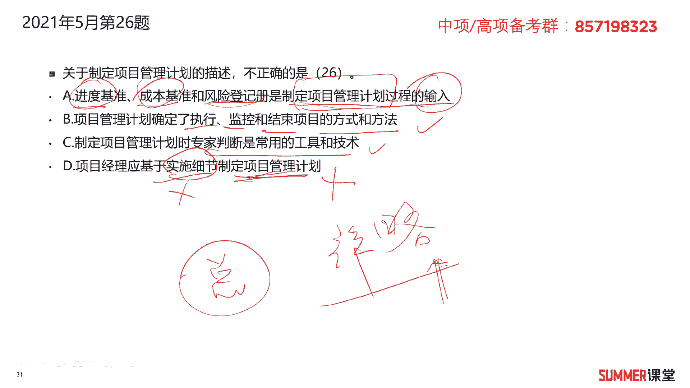

他的输出是不是有项目管理计划，项目管理计划里面包含哪些内容，包含子计划，包含基准是吧啊，所以这道题你这道题一看。

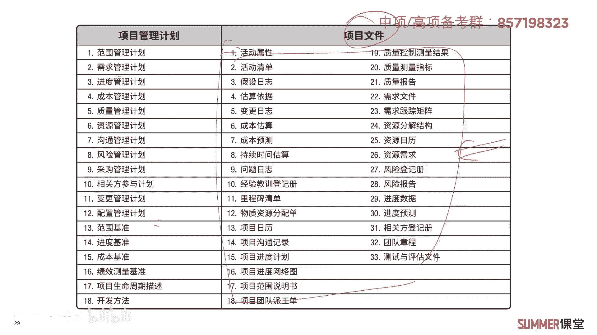

基准基准和这两个基准嘛，肯定是项目管理计划的它的一个输出啊。

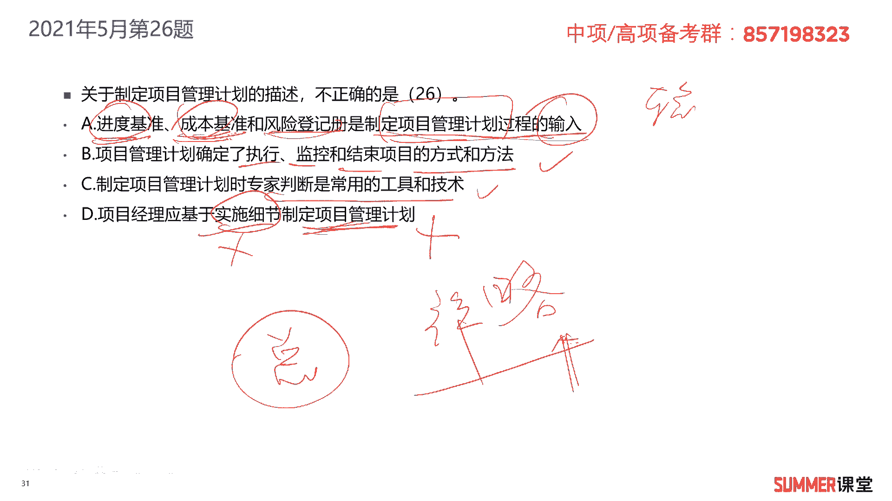

对不对，下的输出，那风险增肌侧，风险增肌侧，我们再看一下哈啊这里面没有写风险登记册。

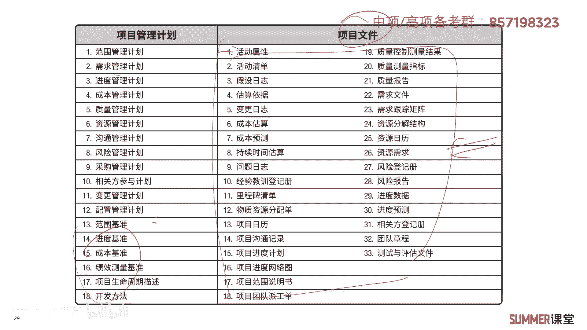

但是我们前面有时候还补充了几个，项目管理计划，包括里程碑清单，然后资源日历，风险登记册，还有这些，这这这几个标红的，它都是项目管理计划的内容是吧，那可能我们那表格里面没有。

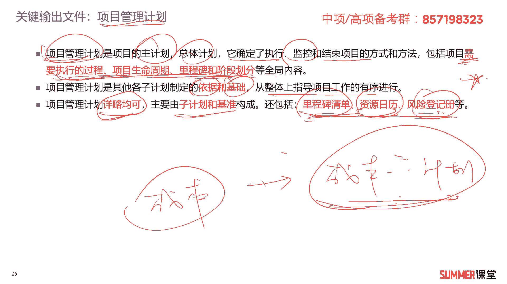

但是它包含这些东西，所以a答案我们提到的这三个东西，它其实都是属于项目管理计划。

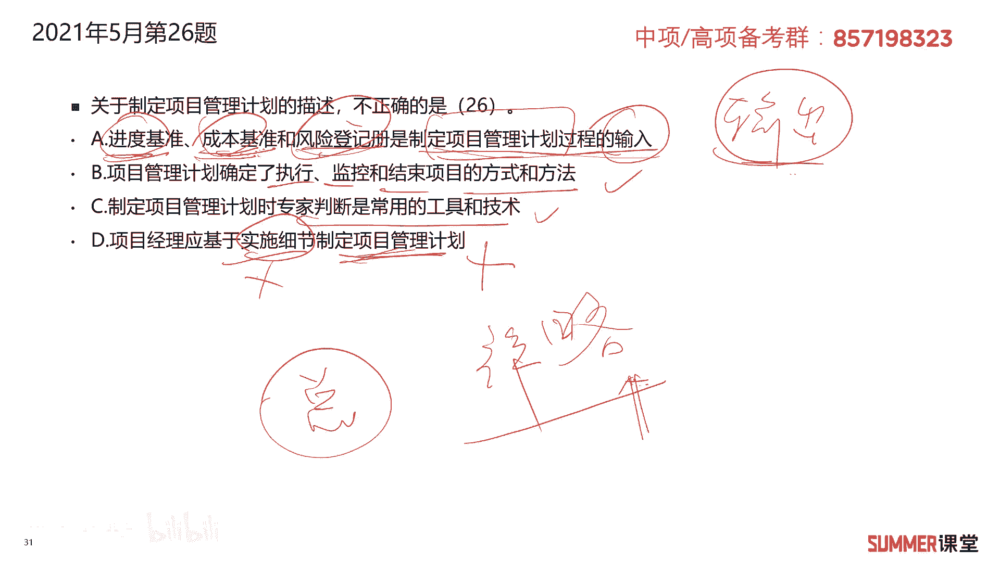

这个输出它的内容是吧啊，都是属于项目管理计划。

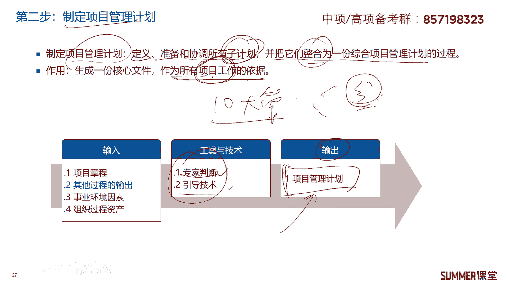

它的内容，项目管理计划，是不是制定项目管理计划的输出啊，他这里面说的是输入，那他是不是错了啊，这么理解他就错了是吧，但是哈哈但是来了哟啊但是来了哟，我们看一下制定项目管理计划，它的一个输入啊。

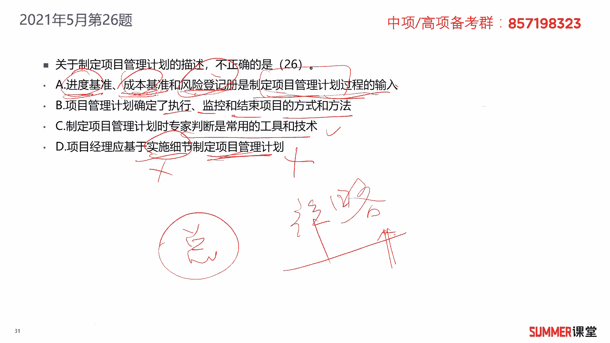

它的一个输入在哪呢，诶在这儿啊，看下它的输入哈，输入有项目张口，项目章程是不是上一个过程的输出，一般来讲是上一个过程的输出，就是下一个过程的输入，项目章程没问题，然后事业环境因素。

组织过程资产我们重点强调过了啊，针对很多很多过程的输入都会有这两个东西，还有一个东西叫其他过程的输出，那什么叫其他过程输是吧啊，我们这里边是总的一个过程是吧，然后其他还有很多分的过程啊。

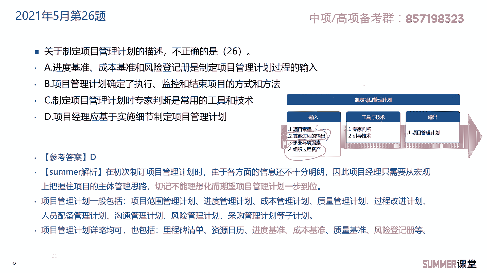

啊还有很多分过程啊，比如说我举个例子，我们后面讲的进度的时候会有制定进度啊，计划制定进度计划，这个制定进度计划里面是不是有有进度基准，对吧啊，有进度计算啊，进度基准是不是其他过程的输出啊，是不是啊。

是啊，那的确啊，对不对不对，这个进度基准，其他过程，这个输出，可不可以作为制定项目管理计划的输入，可不可以问你可不可以可以，那么有人就问问你老师，那不对呀，你这个输出里面有有这个进度基准。

成本基准都有他，你这个输入有他，这个不就不就输入和输出都有它，那不就循环了吗，不就是有问题了吗，没问题啊，的确输入和输出都有它为什么没问题，因为我们讲过项目管理是一个循环的过程。

你刚开始你可能还没有其他过程的输出是吧，我先搞一个简单的就基准一点嘛，啊基准一点，但后面随着时间的变化，项目的推进，那项目的推进，然后你其他过程就有，比如说基准1。1了是吧。

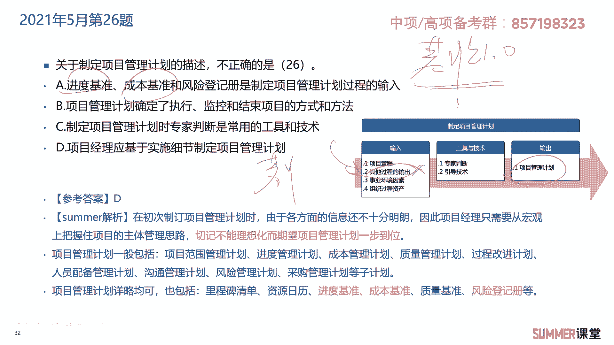

那就由这边你搞进进度管理的时候，是不是这里面搞了一个基准1。1。

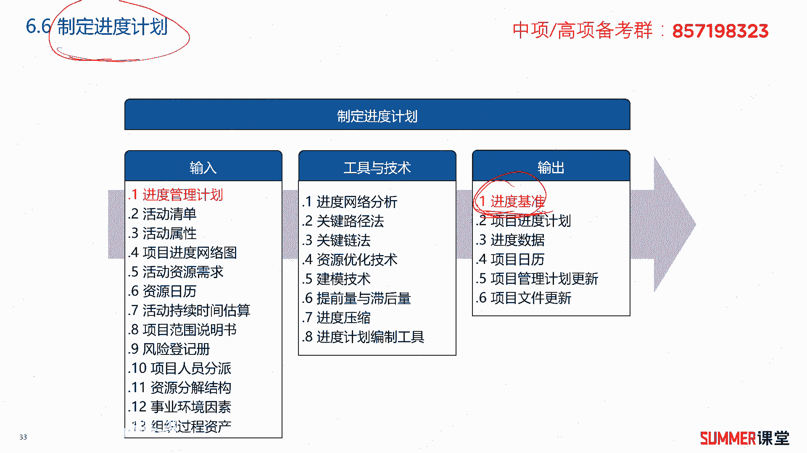

然后我再用基准1。1再输出100基准二点，是不是项目管理是这样不断的推进的一个过程，你的计划也会越做越详细，刚开始是比较粗略的明白，所以这道题a答案是对的，你一定要回想起我们前面讲的。

项目管理是一个循序渐进的一个过程，它是不断推进的一个过程啊，反正我以前看过有些老师的解析啊，他说这个东西就是输出啊，不不是输入，你不要只看那只看他这个文字的表面，你要理解项目管理这个过程它是不断推进。

不断循环的啊，我这么解释，我相信绝大部分人应该能够理解哈啊，应该能够理解，就是我们的项目管理计划不是一步到位的啊，不是一步到位的，ok那我们来看一下解析哈，还得给大家读一下解析，有可能也会出选项的。

就是在初次制定我们项目管理计划的时候，由于各方面的信息还不十分明朗，因此项目经理只需要从宏观上去，把握主体的管理思路，切记不能理想化，而期望项目管理计划一步到位，这个管理计划是要更新的呀对吧。

刚开始一个一点，后面1。11。5啊，什么1。81。9，3。05。01步一步更新的对吧，项目管理计划一般包含各个子计划，还包含什么，还包含这些东西，里程碑清单，资源日历啊，当然这里面还没讲啊。

这是在后续章节去讲的，现在他是什么啊，不重要啊，后面听完整个课程，你就知道它是什么了，在后续章节会讲，然后进度基准，成本基准，质量基准啊，风险登记册啊等等啊等等，这是项目管理计划啊，它的内容啊。

这道题说实话有点难啊。

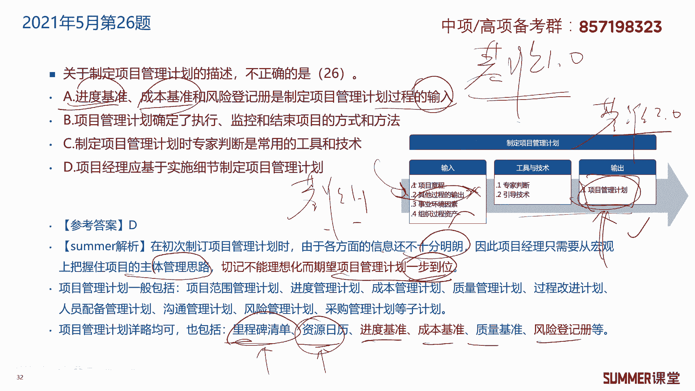

的确有点难哈，理解就好，理解就好，我们接着来看一下计划编制的流程，我们在整合管理的时候要编一个计划，叫项目管理计划，它是一个总的是一个全局的对吧。

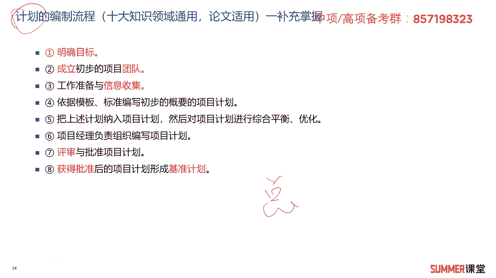

我们待会讲进度的时候会有一个进度计划。

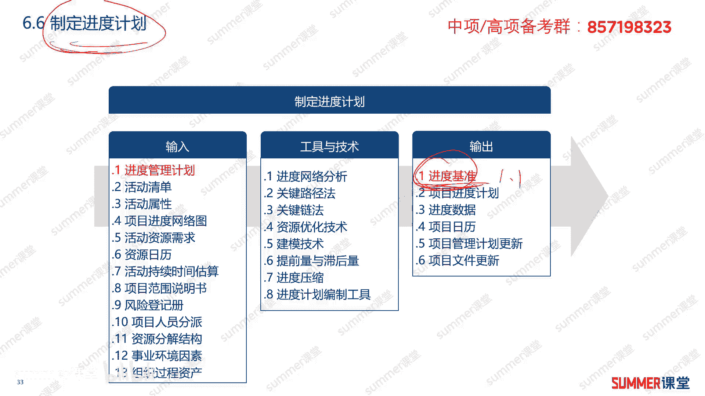

讲成本的时候会有一个成本管理的计划，然后讲质量的时候也有质量管理计划，其他的就是分的嘛对吧，但是所有的计划编制看流程都差不多，十大领域它是通用的，你写论文可以用得上，因为我们怎么被编计划的呀，对吧啊。

比如说一个质量的论文，质量的论文可能就是质量管理计划嘛，那这计划怎么编制啊，又是哪些思路啊，12345678给了大家这么八部的思路，你写论文的时候可以按照这个节奏啊去写。

也不是说你把这八部要背下来去完完整的，还是这个来，你按照自己的理解，你对哪些理解的透，你就稍微写个两三点，那就可以了对吧，计划编制的流程哈啊梳理一下，第一步要明确我们的目标，你是要干什么。

第二个成立初步的项目团队，要有人要去做一些准备和信息收集，比如说诶我们以前做过类似项目的模板啊对吧，把它收集起来，然后依据模板标准来编写，初步的概要的项目计划，那就编写初步的一个计划。

把上述的计划纳入到项目计划当中啊，然后针对针对我们的项目计划，进行综合的评估啊，平衡啊，进行优化吗，那第六步，项目经理负责负责编写项目计划，项目经理负责组织编写，对应该是组织编写组编写编写。

可以由下面的小地干，项目经理是组织协调的一个作用，最后是评审与审批，我们的这个计划获得批准之后，我们要形成基准，什么是基准，就是获得批准之后的一个计划就会形成基准，或者我们正式确认了的啊。

这种计划就会形成基准以后，我们按照这个来对吧，这就是标准了啊，这些标准这是计划编制的整个流程啊，大家稍微梳理一下啊，稍微处理一下，主要是写论文用的明白好，接着计划编制的几个原则。

这这也是所有的知识领域都通用的哈啊，十大管理里面都通用目标的统一原则啊，大家劲要往一处使啊，方案的统一，然后我们管理过程的统一，技术和管理要相协调，技术和管理同等重要，然后计划的统一。

管理人员的统一管理，最后两个比较重要的，打一个五角星，就是要让所有的干系人都参与进来啊，干系人管理后面还有一个章节啊，啊如果你实在不明白，你就先先记住，然后接着是渐进明细，逐步求精。

那边计划刚不是说了吗，能不能移步到位，不能移步到位，计划都是不断的去更新，去优化的啊，不可能一步就编出一个完美的计划出来，没有这种事情，他就拿中国来讲，改革开放这么几十年，我们取得了飞速的化发展。

你说刚开始改革开放的时候，他就他就能够把编一个完美的计划出来，我们现在取得这样的成就吗，其实现在学术成就已经超出了，超出了当初领导的一个期望了啊，真的在在我们实施的过程中不断的去优化啊。

不断的去逐步求精对吧，那边计划也是一样的啊。

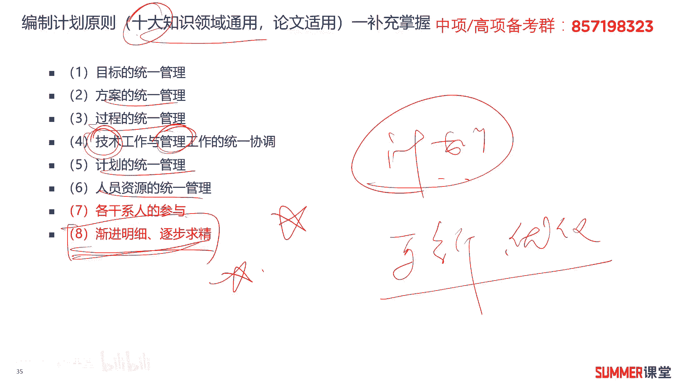