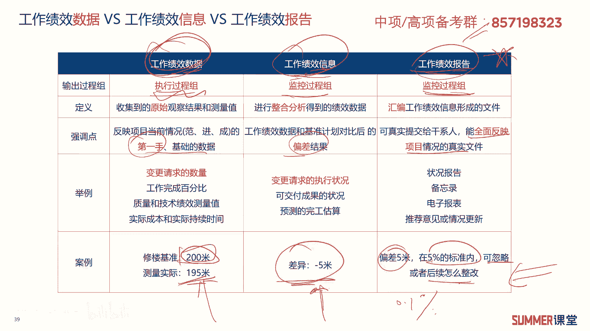
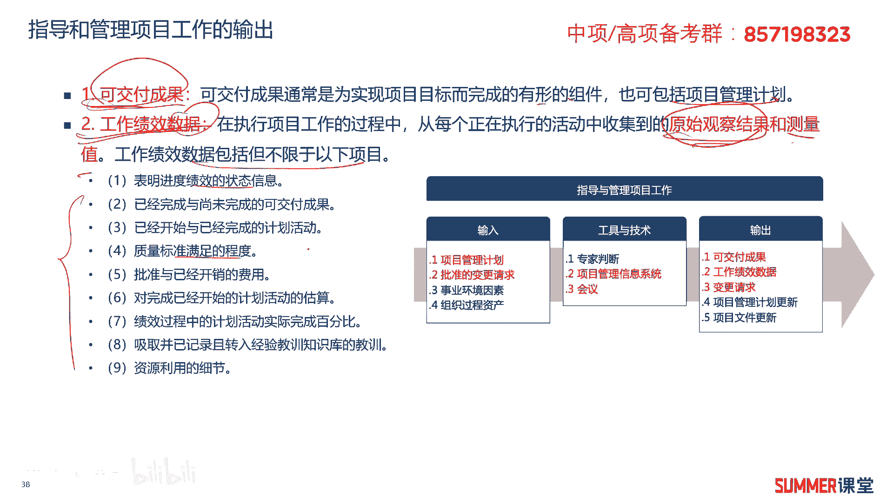
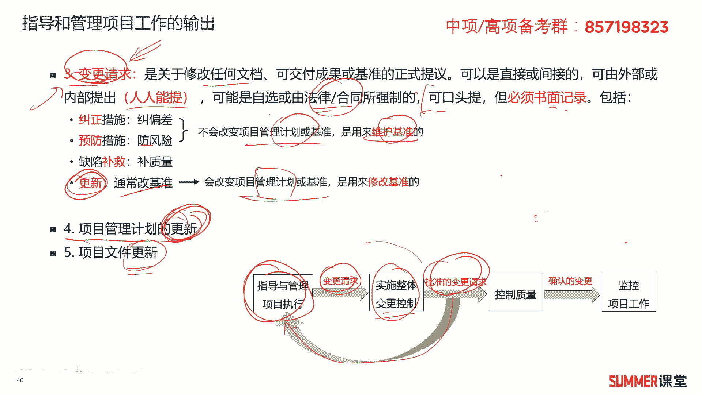
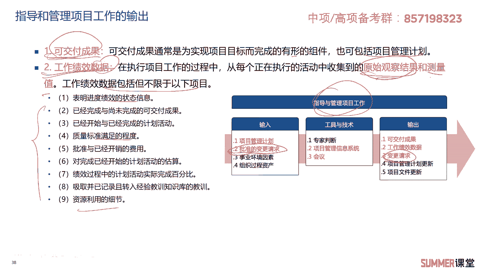
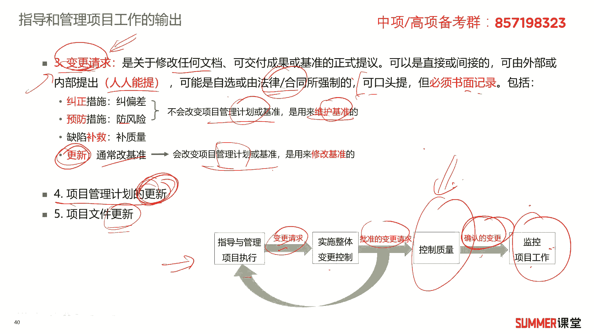
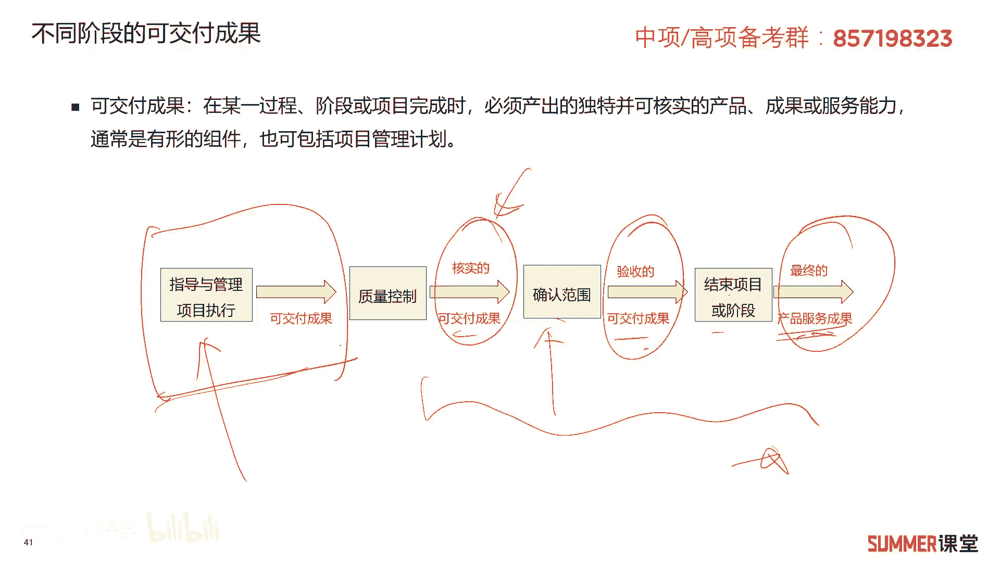
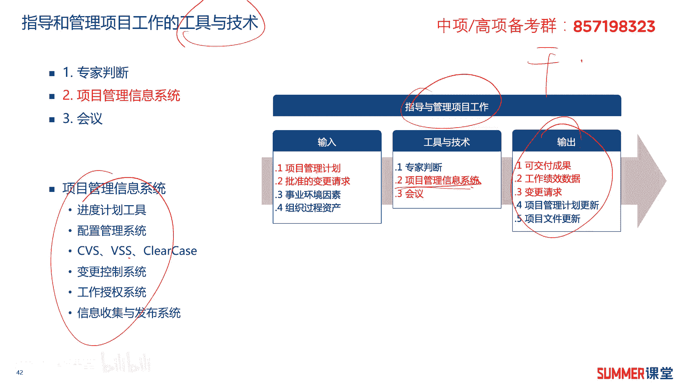
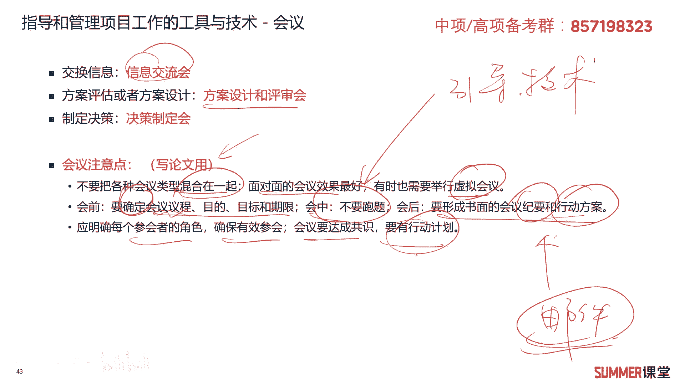

# 2023年软考信息系统项目管理师视频教程【总结到位，清晰易懂】-软考高项培训视频 - P36：4-4 指导与管理项目执行 - summer课堂 - BV1wM4y1Z7ny

好我们前面第二步制定了项目管理计划，制定完计划之后，是不是就要干活了，干活进入第三步，指导与管理项目执行啊。

说简单一点就是干活是吧啊，针对这个过程，它的定义是为实现项目目标而领导和执行，项目管理计划中所确定的工作，并实施以批准变更的过程，说的更简单通俗一点，我们干活是干两块是事情，第一块就是你计划中的事情嘛。

对吧，你项目管理计划当中的事情，第二部啊，第二个就是干批准的变更啊，有些是计划当中的，有些是计划之外的，计划之外的就是变更嘛，但变更一定是要被批准的，我们才干变更，有可能提了很多，提了十个变更。

但最后发现有效的被批准了，就只有一个，所以指导和管理项目工作就是干活干两块事情，第一个干计划中的事情，第二个干被批准的变更，ok这个过程说简单也很简单是吧，它的作用是对项目工作提供全面的管理。

包括管管范围，进度成本质量等等啊，同时要收集绩效数据啊，所以这个过程他的输出要复杂一点的，输出有可交付成果，你干活吗，干完了是不是有相应的可交付成果啊，那是文档还是还是修完一栋楼啦，这些都是可交付成果。

还有工作绩效数据啊，工作绩效数据我们后面会重点去讲啊，而且与它相关的还有工作绩效性记忆，还有工作绩效报告，这是要对比记忆的，这是要考的，另外还有就是变更请求，干活的过程当中可能会提出一些变更来对吧。

好我们重点来看一下啊，首先看一下它的输出可交付成果，这个称号理解的啊，它是通常为实现项目目标而完成的，有形的组件，也可以是一些无形的服务对吧，不一定是有形的组件啊，当然也可能是项目管理计划的一个更新。

是可交付成果啊，修一栋楼出来，这就是可交付成果啊，你完成了某个设计文档，这也是可交付成果，第二个是像呃这个工作绩效数据，它是在执行项目过程当中，从每一个正在执行的活动当中收集到的，原始观察结果和测量值。

这玩意儿什么东西啊啊什么东西啊啊。

不好理解啊，不好理解没关系，我们给大家举个例子，工作绩效数据它是属于执行过程组的啊，举个例子哈，比如说我这个楼基准我是要修2百米啊，是要修2百米，然后我实际测量是195米，这就是我的工作绩效数据啊。

原始的一个数据对吧，跟基准啊，这两个都是工作绩效数据，那工作绩效信息是什么东西，就是我现在偏离了5米-5米，这就是工作绩效信息，相当于对原始的数据进行了一定量的加工，再加工还是比较简单，比较粗糙的是吧。

还有一个东西叫工作绩效报告啊，就是偏差5米，但是根据我们的合同，在5%以内的这个偏差都是可以忽略，可以接受的对吧，或者如果你不是5%，那你可能要求0。1%，那超过5米，那就超标了，后续怎么整改。

那你可能要给个123整个一建议，这叫工作绩效报告，那绩效数据信息报告，希望大家能够理解，数据是第一球手的基础的资料，然后信息是有偏差的一个结果，然后报告啊，报告你是要提交给相应的干系人的啊。

比如出了问题啊，有这种偏差，你是要提供给领导的，领导他不可能给你看数据的，有可能他看不懂对啊，看信息他有可能也看不太懂，太懂啊，所以你给领导看就要看这种文字性的总结性，说明性的东西。

能全面反映项目真实情况的一个文件啊，这就是这三者之间的差异，重点哦，考试经常考问你a提交给领导，我们应该提交什么，a工作绩效数据b然后工作绩效信息，c是工作绩效报告啊。

d你给你搞个什么项目文档或者项目管理计划，提交什么，肯定是工作绩效报告啊，那领导要看报告，那其他的你都给我少来，还需要注意，他们是不同过程中组的输出数据是执行过程组，然后是细效信息，是监控过程组。

报告也是监控过程组啊，这张表格非常重要，考点啊，考点。

这就是，这就是我们指导和管理项目工作的，第二个输出文件啊，工作绩效数据说到这，顺便给大家去对比了另外两个东西对吧，嗯工作绩效信息和工作绩效的啊，报告啊，工作绩效数据它包含的这个内容啊。

大家可以简单看一看对吧，什么绩效的状态啊啊然后这个标准的达成度啊。

然后资源利用的细节啊等等啊，看一看就行了啊，看一看就行了，好接着往下哈，第三个输出是变更请求，好变更请求它是关于修改任何文档啊，可交付成果或基准的一个正式的一个提议啊，就是提变更嘛对吧。

提变更请求可以是直接的，也可以是间接的，可以是内部提的，也可以是外部提的，那就人人都可以提嘛对吧，有可能是自选的，也有可能是一些强制的啊，自选的就是呃先对比强制吧，强制就一般是法律合同规定的。

你不按这个来就不行对吧，一般个人提的可能是一些简单的自选的啊，这都可以啊，所以变更有各种各样的形式啊，各种各样的人都可以提，可以口头提诶，也可以书面的题，但需要注意变更必须要书面记录。

变更是可以口头提的啊，需要注意哦，如果给你一个选项，那我们的变更请求必须书面提出，对不对不对啊，不对哈哈，举个例子，就是你在做一个工地，修一栋楼，隔壁的王大妈就给你提了一个变更。

他说你晚上工施工到12点，凌晨12点打扰我们睡觉了，他口头给你提问，你这是不是变更请求啊，那肯定是变更请求啊对吧，对我们的项目管理人员，他提的这个变更，即使是王大妈提的对吧，他也是我们项目的干系的。

你是要书面记录的啊，要去处理，后续要去反馈的，你别说你有些人就是可能小白，就说这个王大妈跟我们项目好像没太大关系，对吧，不鸟他，那最后人家纠结20个，30个村民把你工地给你围了啊。

你这个项目就干不下去了，那很正常哈，那他会举的功力，这个例子有些运营商的可能会比较有感受，就是低这个工地地址跟修基站这个差不多啊，修基站差不多啊，你在一个地方啊，修基站啊。

有些时候有些时候某个村民不满意啊，真的是把你把你这个鸡蛋给你围了啊，或者把鸡蛋给你拆了，这个可能是吧，这信息化项目里面也是经常见到的，所以针对我们干系人提出的一些变更请求，我们是不是要要书面的记录啊。

啊要书面的记录，而且要反馈，要去处理啊，要去处理啊，处理变更的方法啊，提了下面的这么几种啊，第一个就是纠正啊，有些偏差的话，我们要纠正，还可以有些预防措施，防止风险，那这两种的话都是不会改变原来的计划。

或者基准的，就是用来维护基准的啊，用来维护基准的，当然还有一些缺陷的一些补救措施啊，比如出了问题，我给你啊去做去做升级嘛对吧，去做处理啊，当然还有一种处理方式，就是更新我们的基准了啊。

改改改我们原来的这个基准是吧，这个会改变项目管理计划，会改变项目管理计划，这是针对变更的一些处理方法啊，大家了解啊，大家了解啊，另外啊这个过程这个过程还有哪些输出啊，啊项目管理计划的更新。

是不是项目管理计划会持续更新啊，不是你前面那个动作做完了就算了的，还会持续更新，还有项目文件啊，要保持更新啊，要把它吃根一啊，说到这儿的话啊，说到变更请求啊，这里边我们给大家把变更请求这几个字。

相关的啊，给大家梳理一下，指指导与管理项目执行它的输出叫变更请求啊，要记住啊，它是它是变更请求，变更请求，可以作为下一步实施整体变更控制，的一个输入啊，一个输入由他输入，然后又输出批准的变更请求。

批准的变更请求是不是他的输入啊，那是不是指导与管理项目执行的输入啊。

是的，你看一下前面的吧，前面这个i t t后批准的变更请求是吧，是指导与管理项目工作的一个输入，他的输出有变更请求啊，有些人说老师怎么这么绕啊，是这个这个又是变更请求，又是批准的变更请求，又是输出。

又是输出啊，我头都晕了，现在晕嗯，其实还好啊，没太大关系哈啊，听第一遍的时候，一般人是不会把它梳理的特别清楚的，反正你知道这个东西。

到考前你是要记住的就行了，那现在你记不住没关系啊是吧，那记不住没有关系啊，反正你知道我给你讲讲过这个东西，而且它很重要，那他很重要，o然后还有一个叫确认的变更，确认的变更是控制质量的输出。

它是作为监控项目工作的一个输入，而这两个过程是指这个过程是质量管理的对吧，这个过程是项目整体管理的质量管理还没讲吗，当然你你不会咯是吧，那这里面只把它把它梳理一下。

到时候你这个讲义你是可以作为复习材料的，对吧啊，考前你是要拿出来啊，好好的看一下的好吧，这是关于变更在几个过程当中的一个应用，可能说实话啊这里有点难啊，不是第一次就要让你记住的明白啊。

你知道大概是个怎么回事啊。

就行了，好接着还有不同阶段的可交付成果啊，这里边也给大家总结了一下啊，我们指导与管理项目执行，也就是整合管理的第三步对吧，它的输出有一个可交付成果，可交付成果可以作为质量管理的一个输入啊。

然后最后输出的是一个核实的可交付成果啊，核实的可交付成果又作为确认范围，这范围管理的啊，一个输入是吧，最后输出验收的可交付成果，那最后结束和或者结结结束项目或阶段，输出一个最终的产品或者服务成果。

那就是最终的一个产品啊，这是可交付成果在不同阶段它们的变化啊，它们的不同变化啊，这个过程也是有点复杂的啊，大家先不用啊，多么着急要把它给记住，因为后背面这个过程你都没学呀是吧，我们只学到了这儿哈。

我们只学到了，这是不是这个过程讲的是指导与管理项目执行，它有一个输出叫可交付成果，你把它给掌握就行了，这些是后面再学的，但是它很重要啊，先梳理一下啊，先梳理一下，让大家有个基本的认识。

好我们接着来看呃，指导与其指导和管理项目工作的工具和技术，我们讲了输出是吧，输入其实比较简单嘛啊输入没有太多可讲的啊，我们这个阶段主要就是干事情要干活了，干活干两个方面，干计划。

然后干被批准的变更请求是吧，那就这两块嘛，那其他的事业环境因素和组织过程，资产这个东西前面已经讲过了，没什么可说的对吧，我们再来看一下里面用到的一些工具和技术，专家判断啊。

前面讲过的那第二个项目信息管理系统是一套，是一套软件是吧，简单理解就是这就是软件嘛对吧，但是这个软件它里面东西可能有很多哈啊，有可能有这些软件，还有什么进度管理的计划工具，还有一些什么授权管理工具。

进行收集与发布的这种这种系统软件啊，都都可能啊，那这些都可能嗯，虽然说把它说成软件不是特别合理啊，但是绝大部分情况你可以把理解成软件就行了。

是吧啊历程软件就行了，我们重点来说一下最后一个啊，最后一个最后一个就是会议啊，大家经常开会吧，应该不陌生是吧，项目当中也会有各种各样的会有交换信息的，就是信息交流会有方案评估或者方案设计的。

叫方案设计和评审会，还有制定决策的，就决策制定的一些会对吧，开会大家需要注意几个点，那这几个点平时选择题，案例分析啊，一般来讲考的不多，选择题不会怎么考，案例分析可能偶尔出现，论文里面大家可以写啊是吧。

会议这个东西再再熟悉不过了，实在不知道写啥的时候，是不是可以写一下会议啊，啊写一下会议啊，会议需要注意什么，这里面提到了几个点，第一个不要把各种类型，各种会议类型混合在一起，就是要开具体的专题会。

一个会最好去解决一个问题对吧，另外面对面的会议效果最好，有时也可以举行虚拟会议，虚拟会议就是视频会议嘛啊典型的视频会议，比如说像当前，全国很多地方可能都还没有解封是吧，有好多地方没解封。

不可能出差去开线下会议的，那就线上会议嘛啊，线上会议最近几年也比比较流行，看学生都上网课了对吧，另外会前要根据会议的议程，目的目标和期限要去，要要提前确认确认出来是吧，要提前发发你的这个会议的公告啊。

会议的通知和公告，那会中不要跑题，怎么保证不要跑题啊，怎么保证是不是有一个引导技术啊，我们前面讲的对吧，会后要形成书面的会议纪要和行动方案，形成之后怎么办，一般是要群发邮件的。

是不是把我会议的纪要和行动方案，这些东西发给干系人嘛啊，相关的一些人啊，应明确每个角每个参会的角色，确保有效参会，会议达成共识，要有行动计划，那这些就是开会啊需要注意的啊，开会需要注意的啊。

写论文可能会用得到啊。

