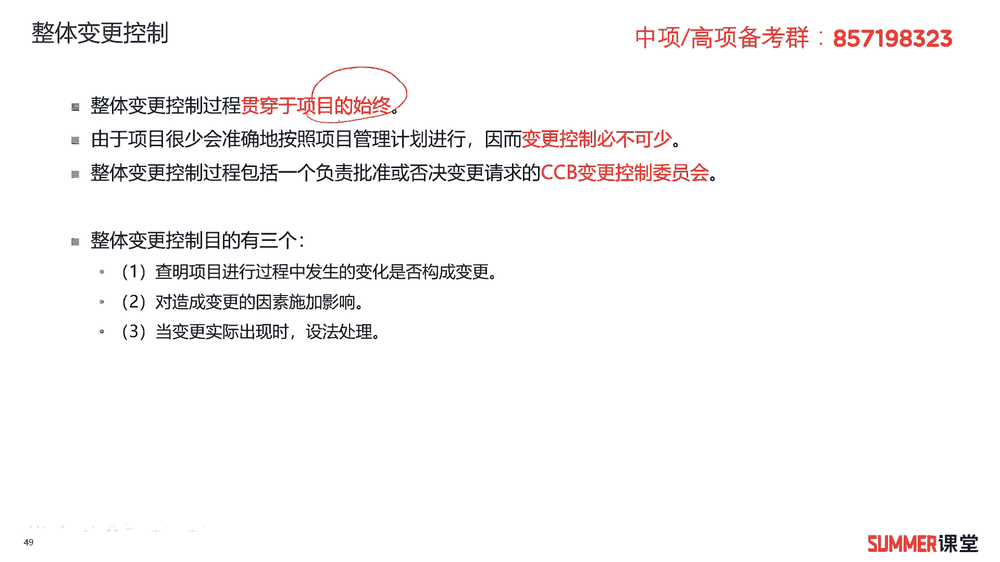
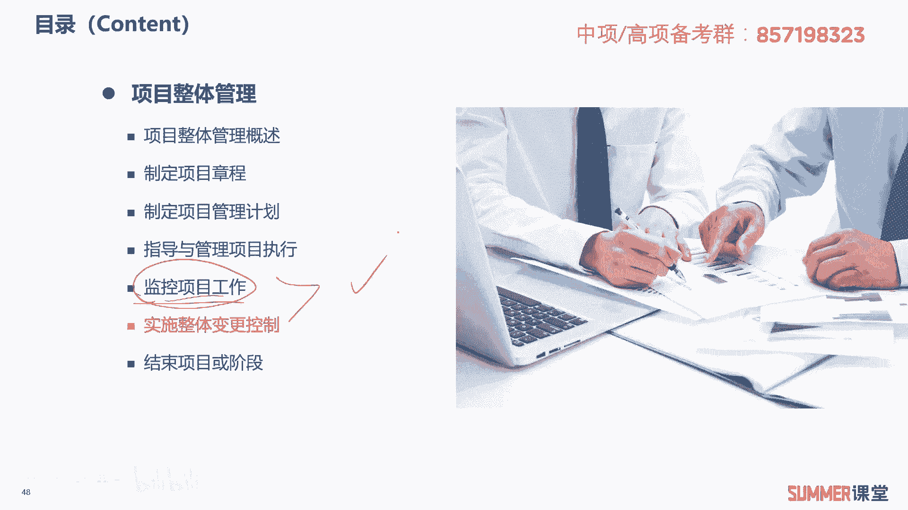
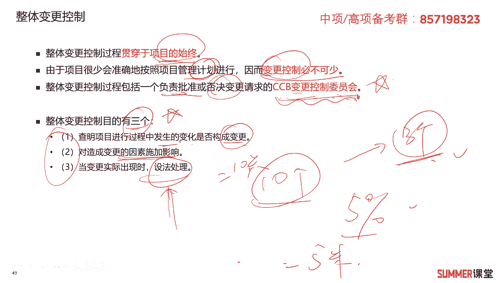
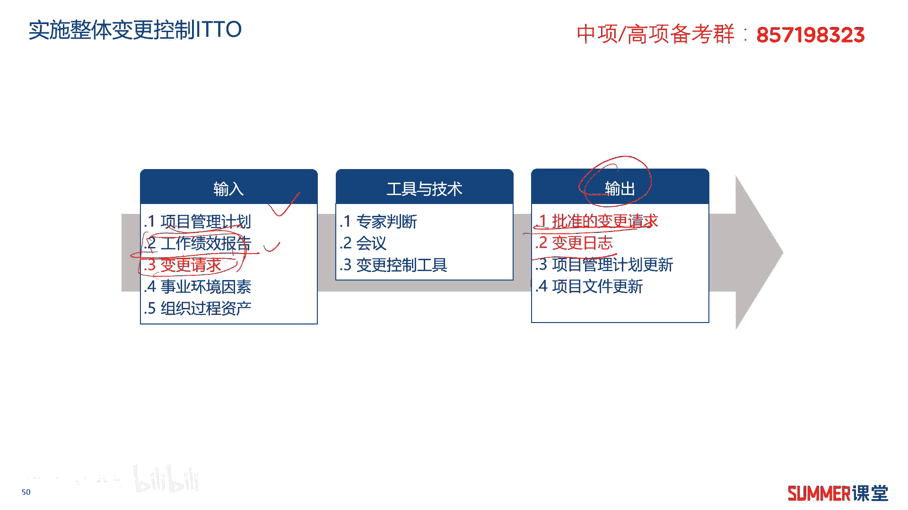
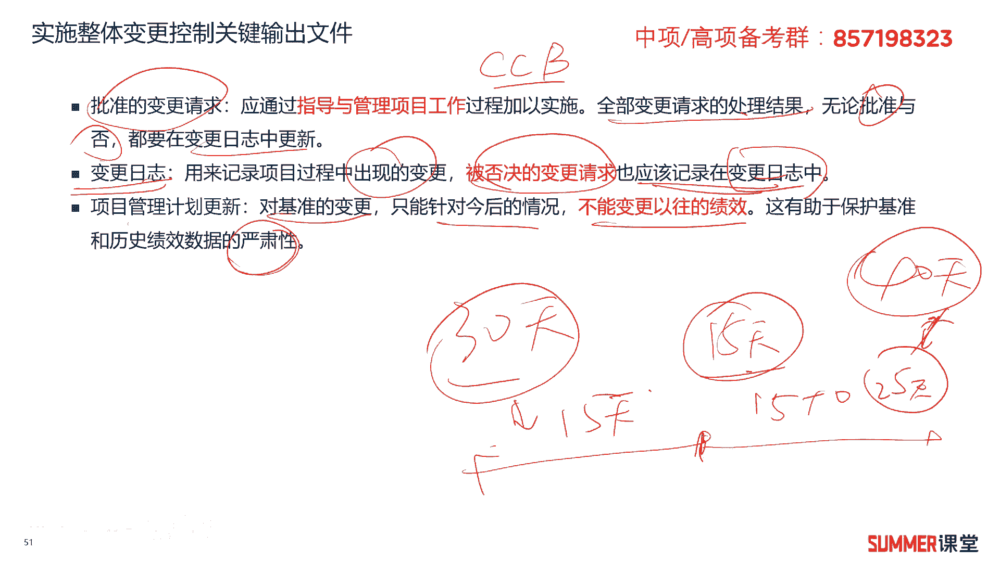
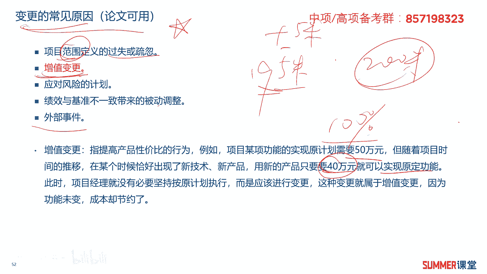
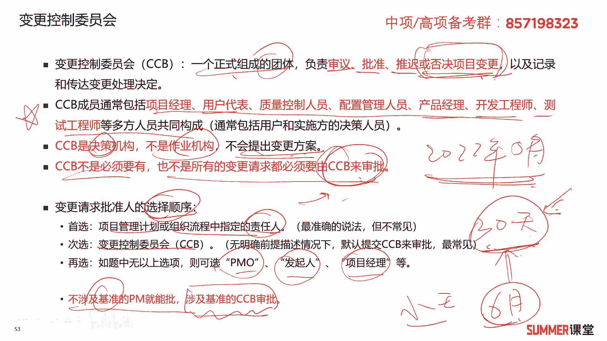

# 2023年软考信息系统项目管理师视频教程【总结到位，清晰易懂】-软考高项培训视频 - P38：4-6 实施整体变更控制 - summer课堂 - BV1wM4y1Z7ny

好我们接着来看第五步，实施整体变更控制啊。

这一步也挺重要啊，因为后面还有一个章节专门讲变更管理的，其实这个章节实施整体变更控制，跟变更管理内容其实比较接近哈，我们后面还会给大家去讲啊，整体变更控制，它的这个过程是贯穿于项目的时钟诶。

前面我们是不是讲过监控项目工作，他也是不是贯穿于项目始终的呀，这两个都是ok。

这个由于项目很少会准确的按照计划进行，有句话叫计划赶不上变化嘛，是吧啊，所以变更控制肯定是必不可少的，什么叫变更控制，就是可能我们项目执行过程中啊，有干系人提了十个变更出来吗。

不是所有的都要被接受的对吧，我们经过分析处理之后，可能这十个变更当中有三个是被批准的变更，那这时候这个过程啊从时刻变更到三个变更，这个过程就叫变更控制嘛对吧，整体变更控制过程啊。

包含一个负责批准或者否决变更请求的，一个部门或一个机构，这个机构叫c c b变更控制委员会，作为一个重点啊，需要记一下，负责批准或者否决变更请求的一个部门，叫c c b变更控制委员会。

我们后面还有一页专门来讲c c b的啊，我们先来先整体过一遍哈，就整体变更控制的目的有三个，这三个目的作为一个重点也要记一下啊，选择题是考过的，第一个查明项目进行过程中发生变更，是否呃发发生的变化。

是否构成变更，什么意思啊，啊比如说刚刚我举的那个例子，本来也是要修2百米的一个楼，这是一个基准，但你最后修了195米，他是不是有变化，但变化就一定变更吗，那如果你的这个指标是5%以内都正常的。

那有没有超过5%吗，5米有没有超过5%，2百米的5%是多少啊，10米如果有偏差，10米才构成变更是吧，我偏差5米负的5米不构成变更啊是吧，虽然有变化，但不构成变更，能理解吧。

第二个是对造成变更的因因素啊，要施加影响，那为什么，如果哈如果它已经超标了，我我才去施加影响吗，如果当你最后测量修了195米，你考虑为什么修修了这个195米啊，是设计的问题还是施工哪儿出了问题对吧。

就变更能产生的这些因素要施加影响，当变更实际出现时，要设法去处理，设法处理是什么，设法处理就是不是处理你这个变化啊，是真的是构成了变更之后我才去处理啊，如果没有影响，我就不需要处理明白。

这是整体变更控制的目的啊，整体变更控制的目的，希望大家能够理解啊，把它作为一个重点啊。

考试也是考过的，另外实施整体变更控制的i t t o啊，大家可以看一下输出是批准的变更请求，然后还有一个叫变更日志输入标红的，关键的哈啊是变更请求，在项目管理计划啊，这就不用说了对吧。

计划肯定是很多过程的输入，还有组织过程，资产事业环境因素，这也不用说啊，工作绩效报告，是实施整体变更控制的一个输入啊，这个也可以把它作为一个重点啊，这两个啊。

这两个ok我们还是重点来看一下它的输出文件，批准的变更请求，它是指通过指导好与管理项目工作这个过程啊，这个过程由谁由谁批准就变更请求了，由谁批准，刚讲过吗是吧，讲过啊，一般是由c c b嘛。

变更控制委员会去批准啊，去批准啊，全部的变更请求的一个处理结果啊，有些可能是批准的啊，有些就不批准的啊，需要注意的就是，无论是批准的还是被否定的啊，一些变更都要在变更日志当中去体现啊。

所以还有一个输出文件叫变更日志，用来记录项目中出现的一些变更，被否决的变更请求也应该出现在变更日志里边，所以才变更的日子里面，这里面还有项目管理计划的更新对吧，有了这种变更之后。

我们是不是要更新我的项目管理计划呀，啊更新我的项目管理计划，但是需要注意的是，需要注意的是，对基准的变更只能针对以后的情况，那不能改变以往的技巧啊，这有助于保护基准和历史绩效数据的严肃性啊。

就是本来以前我这个项目是预计30天完成的，但是干到干到15天的时候，发现30天完不成，那肯定完不成了，那怎么办啊，经过各方协调修改一下基准，可能我整个项目40天完成，但前面的这35天。

那前面的这15天干的事情，是以30天为基准计算，那后面的可能还有多少天啊，15+10，后面这25天就以40天这个基准啊，去去计算了啊。

他的绩效是这样去评估的啊，这个了解就行了啊，接着啊，变更常见的原因，这也是重点，那写论文或者案例里面都可能会出现的，那选择题也考过，第一个是项目范围定义的过失或者是疏忽啊，你第一项范围的时候啊。

d的有问题，第二个是增值变更啊，什么叫增值变更，这个应该不太好理解，下面给大家解释一下，它是指提高产品性价比的行为，比如说我以前实验某项功能要50万，但是随着时间的推移，出现了某个新产品新技术。

我只要40万就能实现原定的功能，那是不是省钱了呀，那功能没有变，成本去却节约了，这叫增值变更，这块可能好像要偏一点是吧，真正面跟标红啊，接着呃就是变更的原因哈啊应对风险的计划。

风险管理我们后面会学到哈啊，就是风险识别是一个长期的过程，就前期可能有些风险我就没识别到，到了后期识别到一些风险，然后针针对这些风险，我是不是要有一些应对计划呀，所以应对计划是不是前期没有的呀。

我后期加上去的是不是算一个变更啊，算的啊，算的应该是绩效与基准不一致，带来的一些被动变更，五个这个第四个用解释吗哈用用不用解释啊，绩效与基准不一致，可能有些人还是不理解哈，还是给大家说一下。

因为他这个表述可能不是那么人性化啊，举个例子，你的绩效修了195米，还是刚才那个例子，我基准是修2百米，是不是，如果是要严格按照百分之百的2百米来衡量，他是不是不达标吗，那是不是要被动调整嘛。

啊你还要加高5米吗，对不对啊，这就是绩效和基准不一致，还有一些就是外部事件，外部的事件就很多了哟，啊什么地震啊，洪水啊这种天灾啊，特别多啊，不可能项目不一样啊，不同项目不一样，这就是变更常见的啊。

一些原因你写论文的时候是可以使用的啊。

可以使用的，根据自己的总结啊，可以再优化一下啊，接着啊，c c b项目的变更控制委员会，它是一个正是组成的一个团体，负责审议批准，推迟或者否决我们的项目变更，以及记录和传达变更处理的决定，决定要变更了。

他要把这个变更的消息，要发给我们所有的项目成员对吧，c c b啊，它通常包括哪些哪些组成，2022年5月就考了这玩意儿，包含哪些成员，包含项目经理啊，用户代表，质量控制人员，配置管理人员，产品经理。

开发工程师，测试工程师等多方面的人员构成，通常它是包括用户，还有实施方的一些决策人员的啊，这是ccb的组成，考过一个案例分析，是让你去写出来的哈，啊不是选择题让你写出来的，所以这个东西是不是要背啊。

啊是不是要记啊啊是的，另外需要注意c c b它是决策机构，它不是作业机构，它不会提出变更方案，变更方案不是他提的是吧啊，他是负责审批或者否决我们的变更方案的啊，需要注意哦。

这里是重点选择题出现过无数次的啊，知道ccb也不是必须要有啊，也不是所有的变更都要由ccp ccp来审批啊，为什么啊，因为提出变更之后，我们项目经理会进行一个初审，有些基础的变更就到不了c c b站啊。

比如说小张，那今天请个假，你说对我们这项目有有没有变更，整体来讲还是有点变更的，小张请假了对吧，人力资源这块有变更吗，人手可能不够，用不用啊，不用那项目经理直接就p了就得了呗。

他这个对项目不会有太大的影响是吧，所以变更控制它有个呃变更控制流程，我们在讲变更管理的时候再给大家去讲，这里面先抛出来啊，有些东西直接到项目经理就能解决了，那他就不会上升到c c b来审批是吧。

然后变更请求批准人的这个选择顺序，一般来讲是这样子的啊，这个就作为了解了哈啊，首选，如果项目管理计划或者组织流程当中，有指定的责任人，那就由指定的责任人去负责审批，如果没有。

一般是由c c b啊去审批变更的啊，如果有没有c c b是吧，或者我们做选择题没有上面的选项，你可以选p o发起人或者项目经理啊，去审批变更啊，这都是可以的，另外标红的大家需要注意，不涉及基准的变更。

项目经理就能批，涉及到的基，涉及到基准的变更，要c c b变更控制委员会去审批，什么叫基准啊，什么叫基准，我们前面讲项目管理计划的时候，给大家去讲过对吧，比如说这个项目啊，我计划是30天完成。

那最后经过领导审批决定诶，这个就30天完成，把它作为一个基准了，经过领导审批的这种计划就叫基准，那我们就参照这个来明白啊，如果啊一个工作啊，它不影响这个这个基准，那就是还是30天完成。

小小张小王请天假无所谓啊，你说这个小王这个核心工程师，他说他要休假六个月啊，休假半年，那这可能就影响基准了是吧，项目经理就不能审批。

