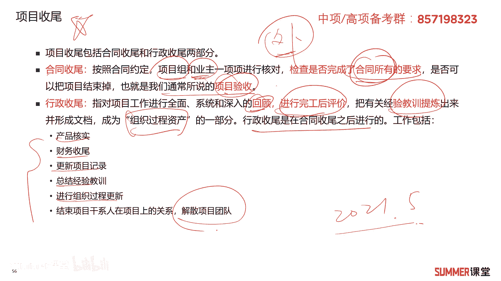

# 2023年软考信息系统项目管理师视频教程【总结到位，清晰易懂】-软考高项培训视频 - P39：4-7 结束项目或阶段 - summer课堂 - BV1wM4y1Z7ny

我们接着来看项目整体管理的最后一步，结束项目或阶段。

那这个过程相对而言比较简单一点啊，他是完结所有项目管理过程组的所有活动啊，已正式结束项目或者阶段的这样的一个过程，那这个过程的作用主要是总结经验教训，正式结束我们的项目工作，为开展新工作而释放组织资源。

项目干完了，项目团队成员撤回来对吧，那以后以后的项目或者其他行动工作啊，需要你啊，这就是最后一个阶段了啊，这个阶段他的i t p o啊，大家可以看一下啊，输出是最终的产品服务或者成果。

最终交交付给客户了是吧，然后它的输入有项目管理计划，有验收的可交付成果，有组织过程资产啊，标红的需要注意一下验收的可交付成果，他输输出是最终的产品，服务或者成果移交给客户，工具与技术都是老老三套了啊。

不用怎么说对吧啊，这个i t t就比较简单了，考试的话一般来讲他不太怎么考，考最后一个阶段不太怎么考，它一般考前面的阶段会多一些。

ok另外项目收尾啊，这里面需要注意哦，这是重点考点，核心考点我记得2021年5月还是哪1年啊，网络工程师的考试都考了，考了合同收尾和行政收尾，项目的收尾包括合同收尾和行政收尾这两部分。

什么时候合同收尾呢，它是根据合同的约定，我们的项目组就以乙方和业主，甲方一项一项的进行核对，检查你最终完成的这个产品，最终你的输出是否满足合同的要求，是否可以把项目给结束掉，这也就是我们说的项目验收。

合同收尾就验收验收通过了，那基本上合同上的要求你就达到了，对吧啊，这个比较简单啊，第二个叫行政收尾，是指项目工作进行全面系统和深入的回顾，进行完工后的评价，把有关的经验和教训总结出来，形成文档。

这也就是组织过程资产的一部分对吧，行政收尾是在合同收尾之后进行的啊，相当于合同收尾一般是对外的，是我们比如说我们是施工方吗，然后我们跟甲方一起去做，去去把我们的这个项目验收了，对吧啊，又有客户的参与。

而行政收尾是不是主要是对内的呀，我们这一类进行回顾总结评价，然后该颁奖的颁奖，该发奖金的发奖金，然后该总结经验教训的总结，经验教训啊，行政收尾它里面包含的内容会比较多啊，产品的核实，财务的收尾嗯。

财务收费就可能就项目要结款了，然后人员的工资，人员的奖金该发要发啊，更新项目的记录，总结经验教训，进行组织过程，资产的更新，结束项目干系人在项目上的一些关系啊，解散项目团队，ok啊，这是行政收尾。

这里面对比了一下这两个收尾，它们的相同点和不同点，相同点都需要核实产品都要总结经验教训，都要整理归档啊，都要形成什么组织过程，资产啊，相同点我们重点的要看不同点啊，重点的要看不同点。

这是非常重要的考点哦，啊非常重要的考点，合同社会主要是针对合同，每个合同都需要啊，都需要且只需要进行一次，一个合同进行一次收尾，那么问大家一个问题，一个项目我们需要进行几次合同作为，有可能是一次。

有可能是多次，因为一个项目可能签多个合同的，对吧啊，他是买方的采购员去进行确认，买方就是甲方嘛啊甲方进行确认，然后以合同的形式来进行的项目，整个项目来讲呃，整整个项目来说应该先进行合同收尾。

然后行政收尾啊，针对整个项目和各个阶段，每一个阶段结束后或者项目结束后都要做啊，他是要进行多次的行政收尾，可以进行多次啊，一个项目做完了，可以进行一次行政收尾，然后一个项目的一个阶段做完了。

比如说我设计做完了，我总结一下设计的一个经验对吧，这算不算行政收尾啊，算的，它是由项目发起人或者高级的，或者呃高层管理人员啊去做了一个确认，一般来讲是先进行合同收尾啊，再进行行政收尾。

ok这个对比注意一下考试的考点啊，考试的考点一定要明白什么是合同收尾。

什么是行政收尾，然后接着是项目验收，项目验收刚刚讲了嘛，主要就是合同收尾对吧，验收的意义是什么啊，验收标志着项目的正式结束或者阶段的结束，若项目顺利的通过验收，项目的当事人就可以终止各自的义务和责任了。

义务和责任是不是合同规定的呀，啊这合同规定的，从而获得相当相应的利益，验收之后该结款了就要结款了啊，该打钱了要打钱，对不对啊，第三项目的竣工验收是保证合同完，保证合同任务完成，提高质量水平的最后关口啊。

对于基本建设项目和投资项目，通过竣工验收，促进投资项目及时的投入生产和交付使用，将基本建设投资及时转入固定资产啊，那个发挥效益啊，什么意思啊，比如说我修一个工厂，那竣工验收之后他就投产了。

他就能什么他就能挣钱了呀对吧，他就能挣钱了啊，这些东西其实说实话，他可能就是从从工程的这种书上随便抄过来的，我也没有标红，你简单看一下就行了是吧。

也不要求大家把它给备注好吧，这是关于项目整合管理啊的六个过程，给大家讲完了，讲完之后，你可以再回顾一下，在心里边再磨一下诶，这个过程是怎么一步一步把我们这个项目，从总的层面把他管理下来了对吧。

整合管理就是总的管理，后面我们接着再给大家去讲分项的管理啊，什么范围啊，成本啊，质量啊，先来一个总的让大家找找感觉啊，第一次听哈，可能会稍微有一点会有一点晕，在在特别是讲a t t o的时候对吧。

有一点点晕是非常正常的啊，慢慢的你就习惯了，慢慢的你就习惯了要自己找感觉，你知道吧好吧。

