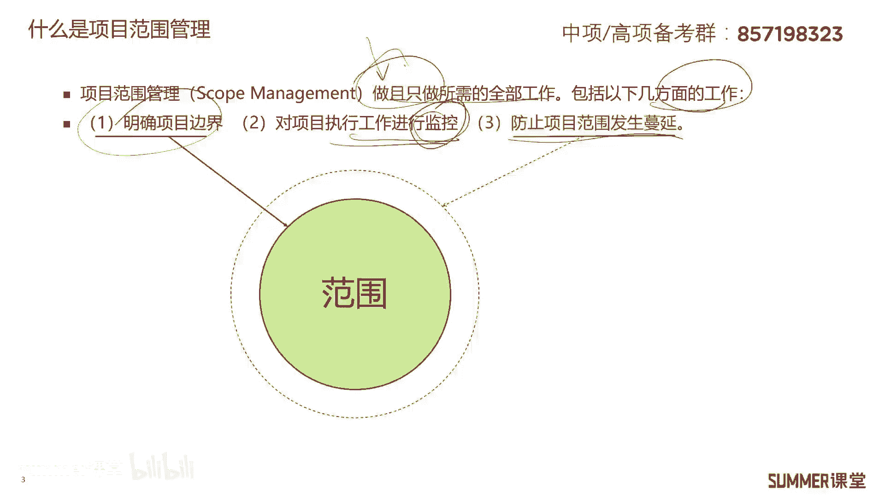
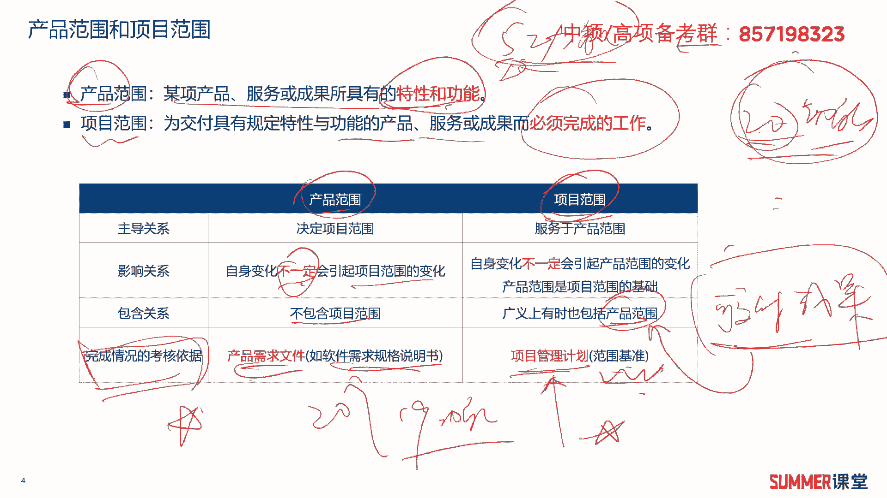
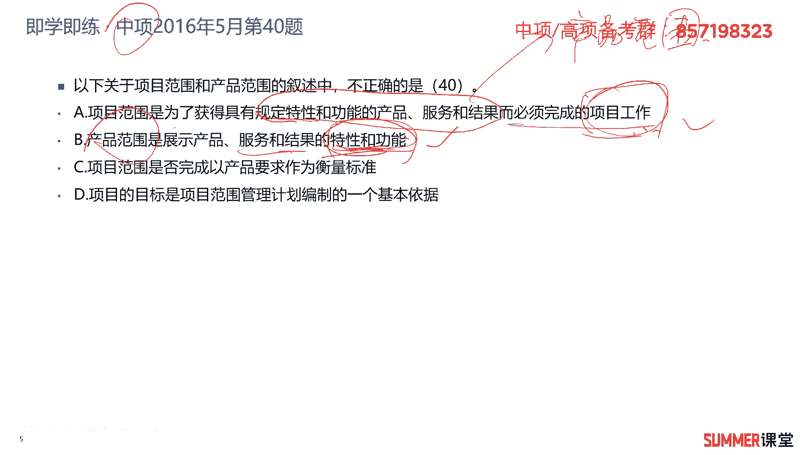
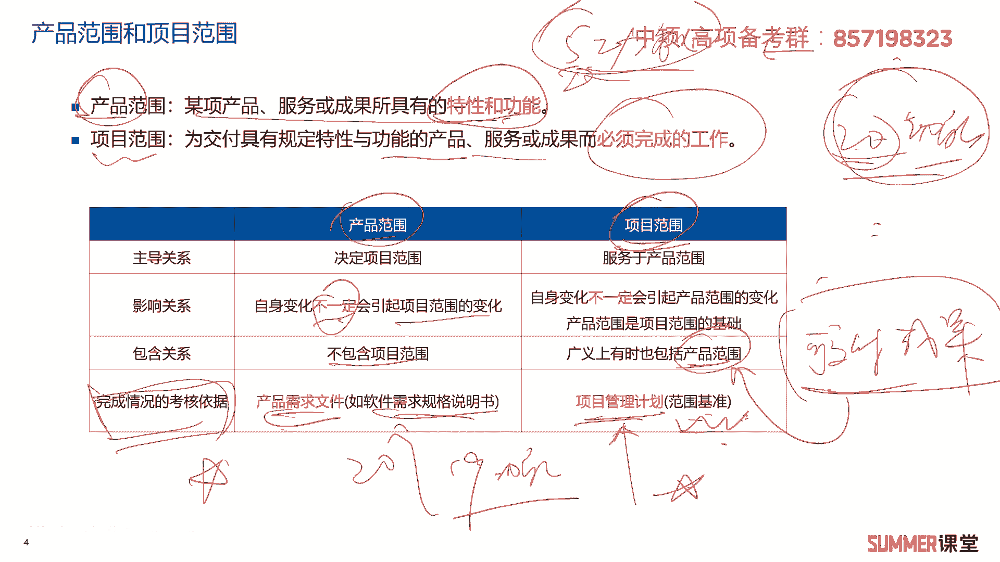
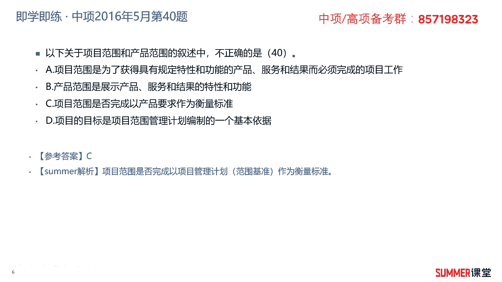
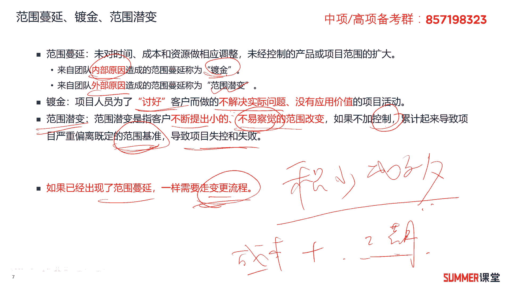
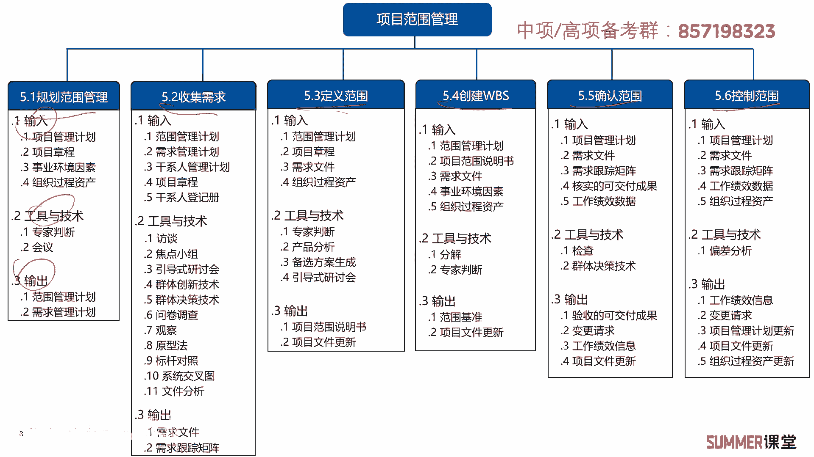

# 2023年软考信息系统项目管理师视频教程【总结到位，清晰易懂】-软考高项培训视频 - P40：5-1 范围管理概述 - summer课堂 - BV1wM4y1Z7ny

大家好，我是你们的夏老师，我们下面学习第五章项目范围管理。

首先来看一下范围管理概述啊，什么是项目范围管理呢，啊这里面有一个定义哈，就是做且只做所需的全部工作，我们要做全部的工作，但是也只做所需要的这些，那其他的超过我们规定的，那就不做呗，是吧啊。

项目范围管理啊，主要有如下三方面的工作，第一是明确项目的边界，那就是画一个圈，把范围圈在里边啊，不要超过这个边界是吧，然后要防止项目范围发生蔓延，这个圈不要扩大，那怎么防止呢，我们在执行的过程中。

是不是要对执行的工作进行监控啊，啊发现有月圈这个范围有扩大的一个趋势，我们就要及时的去做评估，及时的去做调整嘛对吧，这就是范围管理啊，需要做的几块工作。

那接着我们来看一下两个非常重要的概念啊，项目范围和产品范围啊，什么是产品范围呢，它是某项产品服务或成果所具有的特性和功能，这种官方文字的解释，说实话可能有点文绉绉的，但是我相信绝大部分人应该都能理解。

产品范围啊，比如说我们开发一个软件，它具备12345啊，这么五项功能，这也不像功能，就是产品范围啊对吧，那项目范围是为交付具有规定特性与功能的，产品服务或者成果而必须要完成的工作啊，说简单一点。

项目范围就是我们要开开发出这五个啊，五个功能，这个软件的五个功能，我们需要干哪些工作，这就叫项目范围，那下面有一个对比的表格啊，产品范围和项目范围啊，主导关系，首先是产品范围啊，决定了我们项目的范围啊。

比如说你这个产品只有五个功能，它跟这个产品有20个功能，最后项目范围肯定是不一样的是吧，有20个功能的话，你干的事情要多一点嘛，啊这个项目干的事情要多一点，项目范围往往是服务于产品范围的啊。

接着是影响关系，产品范围发生变化啊，不一定会引起项目范围的发发生变化啊，因为你对产品可能进行一个非常小的一个更改，那对我们这个项目工作量啊，或者是成本来讲没有太大的变化，基本上可以忽略不计是吧。

所以它是不一定，然后项目范围自身发生变化，也不一定引起产品的变化，也不一定引起产品的变化，比如说以前可能我测试走五步，现在我测试走经过优化，我走四步就行了，最后交互出来的产品它也是一样的啊，没什么变化。

ok啊，所以这两个都是不一定啊，不一定就是有可能啊，也有可能它不影响是吧啊，这这两个它不是一个非常强力的一个关系，另外需要注意就是产品范围啊，是项目范围的基础，为什么这么说，这个产品开发五个功能。

和这个产品开发20个功能，最后你这个项目是会有影响的，所以产品的变化，一般来讲，它有可能，大概率是会影响我们项目的一个变化的，是吧啊，一般来讲会影响，但也不是一定的，另外需要注意一下他们的包含关系。

就是产品范围啊，不包含项目的范围啊，项目的范围有时候广义上也会包含产品的范围，为什么项目范围有些时候还会包含产品范围呢，原因是什么，原因是你项目最后做出来，是有一个可交付成果的呀是吧。

项目做完是不是有可交付的成果，项目可交付成果很多时候就是产品，那就是搞出一个软件，搞出一个产品来嘛对吧，ok那前三个作为理解的知识点，稍微看一下，最重要的是第四块。

那就是衡量产品范围和项目范围完成的考核依，据，这个很重要，非常重要，产品范围怎么衡量它有没有完成，我们要看产品的需求文件啊，比如说软件的话，就是软件需求规格说明书里面列了，我这个软件有20个功能。

最后去检查啊，去检查你只开发了19个功能，那么还有一个功能是不是就没完成，那就不满足我的产品需求文件吗，或者叫软件规格说明书是吧，所以你的产品范围没有完成，而项目范围怎么确定有没有完成呢。

我们要看项目管理计划，更准确一点的来讲，我们是要看项目管理计划里边的范围基准，ok项目管理计划包含哪些内容，还记得吗，这是重点包含十几个子计划，然后还有三个或者四个基准啊。

不同版本书上写的可能有点有点差异，对吧啊，其中范围基准，成本基准啊，这些都是最常见的基准，需要注意哦，项目范围啊有没有完成，我们要看项目管理计划里面的范围基准，ok好。

我们来做一道题，这是中级的2016年考题啊，对这种类型的题，其实中级和高级考的差不多，他没有什么本质的差异哈，啊不要一看我们考高级，这是个终结的题，他觉得他很low啊，千万不要有这种思想好。

我们来看一下题目，以下关于项目范围和产品范围的叙述中，不正确的是哪一个，a项目范围是为了获得具有规定特性的，那更具有规定特性和功能的产品服务和结果，而必须要做的项目工作啊，读到前面这个东西。

你感觉有点问题对吧，这个东西是说的产品产品范围，对吧，但是后面人家说的就没问题了啊，要做的项目工作，项目范围，是不是为了得到产品而必须要做的项目工作嘛，那肯定是没问题的啊。

b产品范围是展示产品服务和特性的，是展示产品服务和结果的特性和功能，有没有问题，产品范围是我们这个产品产品本身，然后服务和结果啊，它特性和功能啊，这个好像有这个字有点写错哈，是展示这个词应该写错了。

感觉有点有点多，不太空，但是最后应该是没啥问题的，你看产品范围，关键就是我们产品或这个这个服务啊。

产品或者是啊，或者是有个东西叫啥叫叫叫成果啊。

对对对啊，叫成果，它的特性和功能嘛对吧，应该是没问题的，ok然后c项目范围是否完成，以产品要求作为衡量标准，项目范围是否完成以什么作为衡量标准啊，还记得吗，刚刚讲过以范围基准作为衡量的基准是吧。

好产品范围以什么作为基础啊，以我们的产品需求文件啊，产品需求文件是不是可以看出产品产品要求啊，可以啊，如果这改成产品范围就没问题，如果把这改成啊，这后面改成范围基准也没问题啊。

或者把后面改成项目管理计划，ok这个c选项很重要哦，大家一定要明白他为什么错啊，一定要明白他为什么错，d项目的目标是项目范围管理计划，编制的一个基本依据，对不对啊，对不对，那肯定没问题啊。

那项目的目标一般在什么地方体验，合同里面有项目的目标对吧，章程里边也有项目的目标，那就具体你要干什么事情吗，啊他是项目管理计划的一个编制依据，那肯定是啊，那编计划你肯定要看这些东西吗，是吧啊。

除了它是项目管理计划的一个基本依据，是不是成本啊，然后质量管理啊，包括我的这个进度管理，你都要看项目目标啊，对不对，我项目只有100万的预算，然后60天的工期，我要干干成一个什么什么样的一个一个事情啊。

这这这是我的项目项目的一个呃目标嘛，就在这个县之内是吧，这么多钱这么多时间要干成这个事情，所以他是很多啊，它是很多过程的一个依据啊，不仅是编制项这个项目管范围管理计划，你编其他的计划依旧要看项目标了。

所以d就是非常正确的一句话啊，所以这道题选择c答案好。

我们接着来看几个概念哈啊叫范围的蔓延，范围的蔓延又可以延伸出镀金和范围前面啊，什么叫范围蔓延啊，我们不看官方的解释哈，官方解释有点文绉绉的，范围蔓延就是以前这个圈这么大啊，后来变成这么大了是吧。

发生了蔓延，以前我只要五个功能啊，后来一客户提了20个功能出来，是不是是不是蔓延了吗，好像蔓延分两种，第一个是来自内部的原因造成项目蔓延，我们一般把它叫做镀金啊。

镀金镀金往往是项目人员为了讨好客户而做的，不解决实际问题，没有应用价值的项目活动啊，用一个中国成语来形容叫画蛇添足，多此一举是吧，这叫镀金，我给大家举个例子哈。

啊记得以前啊我们去跟客户去汇报ppt的时候，带了一个应届生啊，这个应届生啊，他把当天汇报的ppt其实准备的很充分，对客户的需求场景也研究的很透彻，最后讲完这个ppt之后，客户也很认可，觉得他很专业啊。

但是后面聊着聊着啊，聊着聊着，然后他觉得啊今天今天这个状态很好啊，然后然后客户也很高兴，然后他又给客户拿了另外一个ppt出来，就他不熟悉这个ppt，然后给客户讲这个ppt，那最后问题就来了。

那问题就来了，就是客户对，就是他讲的第二个东西就相当不满意，觉得他很不专业，所以本来你第一个目的已经达到了，你你多此一举反而造成了不好的结果，这就是明显的镀金嘛对吧，那这就是明显的镀金嗯。

明白它是由内部原因造成的，而且他而且他的这个他的一个效果哈啊，或者是他具体干什么啊，也给大家去说到了啊，理解理解就好哈，那第二种是来自团队外部原因造成的这个项目，项目范围蔓延叫做范围浅变范围。

前面是指客户在不断提出小的，不易察觉的这个范围改变啊，如果不加以控制的话，累计起来就会导致项目严重偏离，既定的范围基准，导致项目的失控或者失败啊，客户我们做项目哈，特别是软件的项目。

客户是经常会提一些各种各样的需求是吧，有些是小的需求，如果你不不及时察觉，不及时去做控制，那么一点一点的啊，这叫积什么积，积少成多，积少成多，最后就比较难搞了啊，所以对于这种范围。

前面客户提出需求怎么办啊，不是说你不可以提，可以提我们怎么办，要走变更控制啊对吧，我们项目整体管理里面是不是给大家讲过啊，要走整体的一个变更控制吗，那这里面你变范围就是我们要对范围进行控制，防止失控。

对吧啊，不是不可以变啊，可以变，我们要走变更控制流程要去评估啊，有些有些是你变了没问题，我不给你加钱，也不给也不加工期，但有些你给我变了之后，可能它开发量比较大，那是不是成本你要给我考虑给我加点钱啊。

啊工期以前60天诶，你给我加了这个功能，为我要开发三周呢，那你是不是给我，至少给我两周的一个灵活时间吗是吧，所以工期这些啊，这就是走走变更控制的目的哈，啊走变更控制的目的啊。

当然如果已经出现了范围的蔓延，一样要走变更的流程啊，要走变更的流程，ok这是关于范围的蔓延。

给大家去扩展了一下，另外项目范围管理一共分成六个过程啊，一共分成六部，规划范围管理，收集需求，定义范围，创建w bs，确认范围和控制范围啊，这六部里面又包含了很多的输入，输出以及工具是吧。

那我们先把这六步给稍微的记一下，然后输入输出与工具。

