# 2023年软考信息系统项目管理师视频教程【总结到位，清晰易懂】-软考高项培训视频 - P6：1-1-5 计算机网络技术 - summer课堂 - BV1wM4y1Z7ny

我们接着来学习常见的信息系统集成技术，那这个小节主要就是讲的技术，而且绝大部分都是讲的网络技术啊，如果你以前是学过网络工程师，或者网络规划设计师啊，甚至华为思科的一些认证啊。

你学这个章节的话就是小儿科了啊，比较容易啊，比较容易，当然如果你是计算机相关专业的大学，应该绝大部分人都是学过计算机网络的是吧啊，这里面主要讲的就是网络技术啊，当然还有附带的一点点。

可能后面会说中间件数据库。

我们啊就首先来看吧，一般很多教材在刚开始的时候啊，他都会讲o si的分层模型啊，计算机相关的教材，或者是你拿拿到任何一本计算机的书籍，他肯定会给你讲个o s i模型，tcp ip模型。

其实很多人一直不明白，包括老师早期也不明白，为什么一来跟我讲什么osi，不给我讲个交换机路由器啊，啊为什么啊，原因很简单啊，我们来给大家去分析哈，早期的计算机其实它是封闭系统。

所有的部件都是由同一个厂商来生产的，比如说典型的ibm全家桶里面cpu是i pm的，它的pod cpu，然后他跑的操作系统是他自己的ai x啊，小型机，这是它里面跑的一个叫unix系统啊。

对叫unix系统啊，我突然想差点说成了linux，是他自己封闭的一个unix系统，然后数据库也是他自己的对吧，那这种系统它的优点是安全性比较高啊，性能也比较强，但缺点也很明显，兼容性差。

全是a b m一家公司的，你换一家公司的来，对不起，不支持，而且更新的周期会比较慢啊，你要想更新数据库，那对不起，要需要我i b m这家公司它的升级，它的数据库升级了，更新了你才能更新是吧。

这是早期系统它的缺点，它的问题，现在呢大家发现没有，我们的计算机都叫兼容机，是软硬分离的，大家各司其职，比如说你的电脑，你的cpu用的英特尔或者amd，然后硬盘内存可以用三星啊。

可以用这个什么系数啊等等，各种各样的厂商操作系统，绝大部分可能用的都是微软啊，当然有一部分可能用苹果是吧，它是分离开来的，你可以用很多厂商的不同的产品把它组装起来，形成形成你的这个电脑系统是吧啊。

为什么现在能够能够用各个厂商的，然后大家组合起来实现同样的功能，早期就必须要用一加的了，原因很简单，就是早期没有做这样的一个分层，或者分层做得不到位啊，这个网络分层参考模型它能够实现什么效果。

就是各个组件它能够实现标准化，大家按照每个城市的标准去生产就行了，是吧啊，有助于产业的标准化，然后各个厂供应商共同进行开发，我们按照一定的标准进行开发，开发完了之后大家组合起来能够对接起来。

能够相互的通信啊，能够相相互的通信啊，比如说硬盘无非就那么几种接口嘛，对不对，然后我们满足这个接口的形态，那怼上去就直接能用了啊，怼上去就就直接能用，这就是为什么很多书籍刚开始的时候。

都会给你讲这个参考模型，参考模型它是什么，它就是一个标准，大家都按照这个标准来，最后我们才能够对接得起来，才一个系统才可以有不同的单位，不同的公司去搞，不然所有的东西都得一家公司搞，一家公司搞。

就封闭系统，封闭系统就面临各种各样的问题，开发周期比较长，然后比较贵是吧，更新不及时啊等等啊，肯定你现在的计算机系统都是开放的啊，都是开放的原因，就是有这样的参考模型，它确立了一套标准。

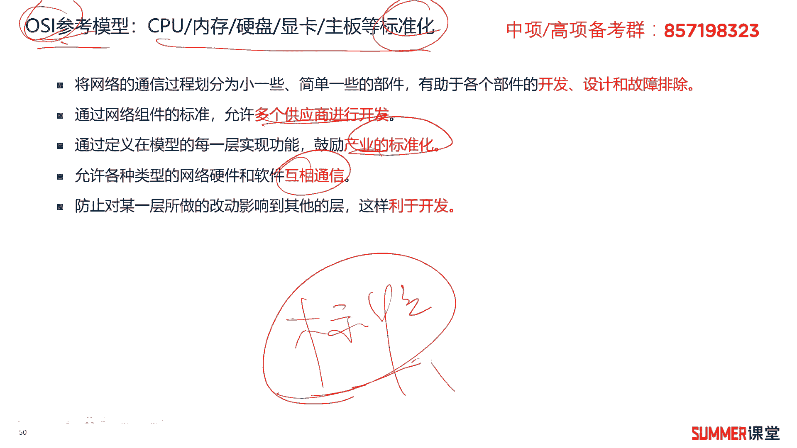

怎么样的标准呢啊怎么样的标准好，我们首先来看一下哈，啊我们主要会学两套标准，第一个是o s i模型，这个标准，第二个叫t c p i p模型标准啊，其实现行的网络当中，用的比较多的是tcp ip的模型。

但是我们还是会给大家去讲os i，因为tcp ip模型无非就是osi的一个简化版啊，一个简化版，我们先来看一下osi的参考模型，他这个参数模型是由一家标准化组织。

这标准化组织的名字叫iso国际标准化组织啊，国际标准化组织，它开发的开放网络互联这个模型，这个模型os i叫开放系统互联，开放系统互联，一个是osi，一个是i so这两个需要注意一下。

哈哈哈需要注意一下，但考试一般不会考，但是大家不要把它整混淆了，iso是一个标准化组织的名字啊，它的名字就叫国际标准化组织，os是一个参考模型啊，就相当于一个标准啊，相当于一个标准定义的这个标准。

他把我们的网络，把我们的计算机世界分成了七个层次，分别是物理层，数据链路层，网络层，传输层，会话层，应用层，表示层和应用层，每个城市的主要功能大家读一读看一看，还是要熟悉一下的啊，不用把它完全背下来啊。

你要熟悉一下啊，你要熟悉一下，因为考试他可能会考到你可能会考到你诶，比如说路由选择是哪个层次的功能，你要知道这是网络层的功能o啊，比如说我们绘画的创建与注销啊，是绘画层的功能。

但这个东西一般考的比较少了啊，一般我们考试主要还是考考t c p i p模型，这几层多一点啊，比如说像传输层它的功能，你要记住，提供端到端可靠或者不可靠的一个传输啊，像传输层。

网络层它的功能这是一定要啊一定要掌握的啊，一定要掌握的，ok分成这么几层，这么几层其实不太好记哈，给了大家一个筑基的词，就是巫术忘传会标音，就物理层，数据层，网络层，传输层，会话层，表示层，应用层。

一个巫师，他巫师忘记传了之后，这一老鹰就会发飙啊，简单这么理解吧，这么去记忆哈，然后啊现在用的比较多的是dcp ip的模型，他在os的基础上去做了一个简化，怎么样的一个简化呢。

把上面的三层给你整合成了应用层，给你整合成了应用层啊，接着下面的两层啊，给你整合成了一层，一般标准的t c p i p模型是四层，最下面的一层，我们把它叫做网络接口层，有些地方也叫网际接口层。

反正差不多哈，也有些地方就是我们下面这两层它依旧不整合，依旧叫物理层和数据链路层，也就是tcp模型，它按照按照五层来算，物理层，数据链路层，网络层，传输层，应用层啊，这样也对。

反正不同的书上写的可能有点不一样啊，可能有点不一样，但是大差不差啊，大家知道就行了啊，知道就行了，然后每个层次t c p i p模型它对应的名称好，物理层我们一般叫做叫做比特或者比特比特流。

然后数据链路层叫做增网络层，叫包传输层，叫数据段啊，教书一段应用层叫应用数据单元，也叫pd也叫p6 ，好吧，这个需要注意一下，另外重点是什么，重点是后面的每个层次对应的协议。

我们主要按照tcp ip模型来记啊，这些都是需要大家要掌握的哈，如果你以前是学过网络工程师的，这些都不需要记，很简单是吧，但是你是零基础的话，这块儿你就要花时间了，下来给我多写几遍，一定要给我记住。

因为这个东西有有好多这个方法吗，啊告诉你没有啊，如果真的是零基础，你就得给我就给我多写，然后明白每个协议它具体的功能啊，明白每个协议他拒绝功能，特别是应用层这些协议它的功能，这是需要大家掌握的。

你要知道这个协议是干什么用的，是吧啊，要知道这个协议是干什么用的，好吧啊，这一页很重要哦，啊非常重要啊，几个考点，第一个每个层次它的作用，它的功能要掌握，特别是传输层和网络层，这是考的比较多的啊。

第二个就是最核心的哈，第二个就是对应往对应着每次每个层次，他的这个协议啊，他的协议考法有两种，第一种你写一个出来啊，比如说tilt tilt在哪呢，intilate这里面还没写哦，写进去了。

tilate它属于哪个层次，它属于应用层，比如说tcp ud p它属于哪个层次，属于传输层是吧，然后告诉你a d h c p这个协议，它功能是干什么用的，它是用来为我们的用户分配ip地址用的是吧。

你要知道到这个层面，当然不是所有的协议，你可能都要知道功能哈，比如像p p p p p p p啊，像p p你说它的功能是什么，它就是一个封装协议，他没有什么特殊的功能，那主要是用来做数据封装的啊。

以太网你就知道他就是一个封装协议嘛，啊用在局域网里面的啊，用在局域网里面的。

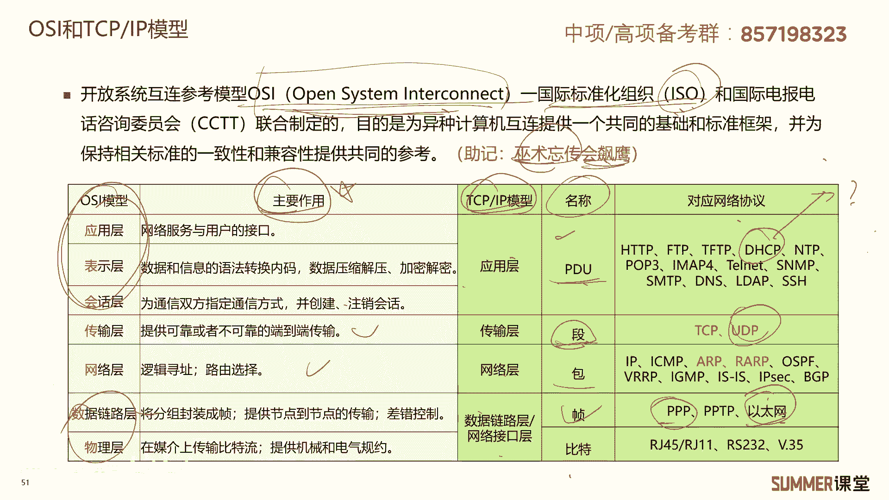

ok啊，当然我们待会一个一个来给大家去讲哈，啊会展开来给大家去讲，我首先看应用程啊啊大家要掌握的这些协议，还有它的功能，首先有两个是传文件用的啊，都是文件传输协议，ftp和tf t p都是传文件用的。

但是一个是基于tcp的，一个是基于udp的，一个是可靠的，一个是不可靠的，ftp它是可靠的，然后tf t p它是不可靠的啊，记住就行了，不可靠，它的效率会高一点啊，可靠。

因为他会花一些代价去处理可靠消息嘛，啊去处理可靠消息，就是在串数据之前，我会进行三次握手啊，当然哈说到这，有些人可能对这种三次握手又不理解啊，没关系，我就不展开了啊，如果你是没有网络基础的啊。

我跟你说太多反而容易晕，你知道吗，因为我们这个考试他考的是比较简单的技术，它不会考那么深入，所以你只需要知道这两个都是传文件用的，哪个效率高，t f t p的效率高，为什么，因为它是不可靠的。

他不需要花更多的精力去处理我们之间的消息，保证它是不是正确的是吧，所以他就一个劲地传嘛啊传错了啊，这个我也不管啊，传错误处理我也不管，它主要是保证我能够从a传到b就行了，但是ftp他就要保证可靠性了啊。

要保证可靠性，ok啊，他有两条连接，一条连接是用来做控制的啊，这个f t p有两条连接哈，一条用来做控制，一条用来传数据，了解一下啊，了解一下第三个协议叫ftp，那叫f t t p。

我们常见访问网页就是用了这个协议，它是建立在tcp之上啊，第四个s m t p是简单邮件传送协议，它是用来发邮件的，是用来发邮件的协议，dh cp是动态组织配置，动态主机配置协议。

用来自动分配ip地址的，比如说一个单位有1000台主机，如果要让你手动的去配ip地址，是不是累死你啊，但是我们可以设置一台dh cp的服务器，自动的为我们的内部的pc分配ip地址。

通过什么协议来实现d h c p嘛，d h c p像我们家用的啊，wifi里面也是用的dh cp啊，你不用给你连wifi之后，你不用给电脑去配ip地址是吧啊，是通过你的无线路由器啊。

dh cp分配ip地址的tilh是远程登录的协议，比如说你的设备在公司，我才有想在家登录上去管理我的设备怎么办，可以通过tilt去登录，需要注意的是，tilt它是铭文传送的。

还有一种远程登录的协议叫s h啊，这是加密传送的，书上没写，但是大家了解一下啊，了解一下d n s系统，它叫域名解析系统，它是建立在u d e p之上，建立在u t p之上。

至于什么是建立在u t p之上，你也不用管了啊，我如果给你展开的话，又会讲封装，如果是零基础，你听封装又会听得头晕是吧，所以了解就行了啊，了解就行了，他主要是把我们的域名解析成ip地址。

典型的比如3w点百度点com是吧，你可以解析成什么202点多少多少，解析成一个ip地址，有什么协议来实现，由d n s协议实现s n n p，这是简单网络管理协议，它主要用来实现网管系统。

对下面设备的一个管理啊，做网络管理用的，ok这些协议的功能，应用层协议的功能，希望大家能够理解，能够用自己的话说出来，就那么三五个字，你能把它说明白就行了，不用你掌握的特别深啊。

这就是我们高校考试它的一个特点啊。

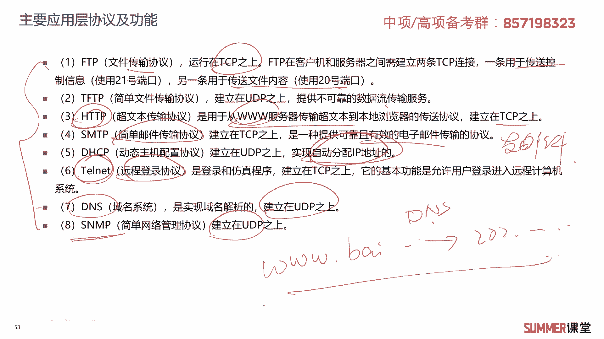

考得很简单啊，考得很简单，接着传输层只有两个协议哈，tcp和udp，tcp和udp他们是干什么用的呀，啊干什么用的呀，啊是用来负责提供流量控制，错误错误校验和排排序服务的流量控制，其实只有tcp有啊。

udp没有流量控制好，我们来看下这两个协议哈，第一个tcp它是面向连接的，一般用于传送数据量比较少，且可靠性要求比较高的这种场合，而udp是一种不可靠的无连接的协议，一般用于传送数据量比较大。

且对可靠性要求不是很高，但要求速度快的这种场景啊，比如说典型的像视频看视频，我们一般数据量会比较大嘛，而且实时性要求很高，如果开视频会议，你慢个三秒，那肯定就卡住了嘛对吧，语音也卡住了，就糊掉了。

那肯定不行，所以一般视频会议像我们的啊，语音啊等等，这些都是基于udp去传的，而文件啊我们一般基于tcp去传啊，这两个协议它的对比和区别，希望大家注意一下，tcp是面向连接的啊，什么叫面向连接。

相当于我在传数据之前给你打个招呼啊，你空闲的时候我再给你传啊，如果你很忙，那我就算了，而udp它是面向无连接的，他甭管你忙不忙，反正我想传就传，你接收到和接收不到，跟我没关系，反正我传给你了。

那就那就完了是吧，这两个需要理解，然后tcp它是可靠的，udp它不可靠，tcp啊，它有流量控制，还有一些窗口机制啊，流量控制，拥塞控制等等一系列的措施来保证啊，来保证我的流量传输是没有问题的啊。

常见的应用是web电子邮件，包括文件传输，而udp它是尽力而为的传送啊，就是我尽量的把我的数据传给你就行了啊，你收不收得到啊，这跟我一毛钱关系没有是吧，所以ud p常用于dns啊，视频应用，语音应用啊。

这两个对比，希望大家能够啊能够记忆一下啊，能够记一下，这里面举了个例子，比如说a t c p是面向连接的啊，你这样去喝水，它的喝水的速度比较慢啊，不容易漏水，而ud p面向无连接的啊。

这么去喝水喝水比较快，但是容易漏是吧啊，容易漏，这是传输层的两个协议，传输层就有且只有这两个协议。

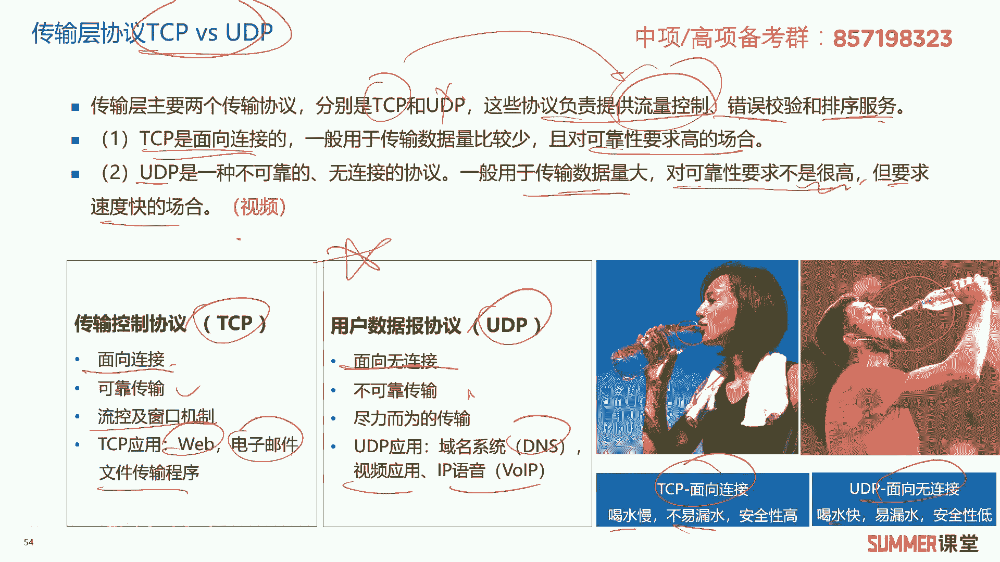

所以它们的区别和对比一定要掌握啊，一定要掌握，接着是网络层，网络层的协议其实还挺多的，但是最核心的就是ip协议是吧，网络层最核心的就i p，还有一个协议叫i c m p，它是用来做差错控制的。

i g m p用来做主播的，这个平时应该不怎么考，反正你看到主播就选i g n p就行了，a r p是用来做地址解析，r a r p也是用来做地址解析，a r p主要是把我们的ip地址解析成mac地址。

然后r a r p是把我们的mac地址，解析成ip地址啊，节省ip地址这几个协议的作用啊，大家啊把我刚刚讲的那几句话啊，给掌握就行了啊，别的就没有什么要求了，别的就没有什么要求了，至于什么是ip地址。

什么是mac地址，如果你实在不懂，你就不用管了啊，那你你给我记住，给我记住就行了是吧，ok这是网络层的这么几个协议啊，首先你要明白网络层有哪几个协议，我给你写一堆协议出来，你要是能够给我区分区分开来。

哪些是属于网络层的，哪些是属于传输层的，哪些是属于应用层的o啊，可能还有一些人会有疑问哈，就是a r p和r，a r p到底是属于数据链路层，还是网络层的协议啊，可能有些书上也会把他们说成。

数据链路层的协议啊，这个我们就不用纠结了，反正在高项考试里面，他肯定是网络层协议啊，肯定是网络层协议，这是考过很多次的。

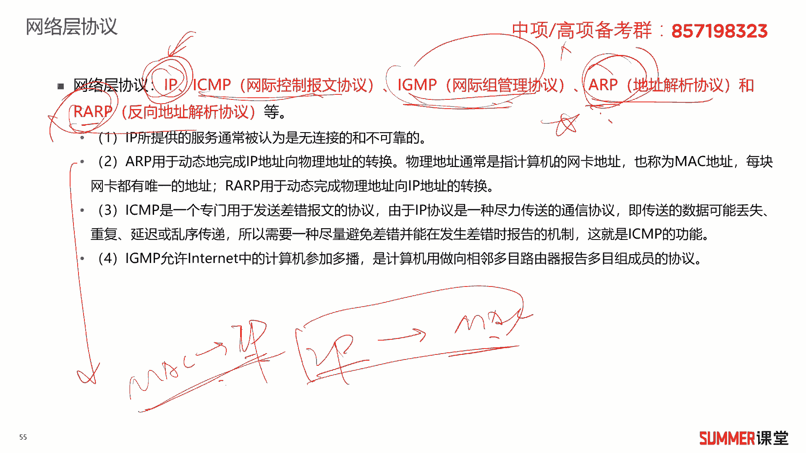

ok这是网络层的好，接着来看常见的几个网络互联的设备，希望大家要要掌握哈，这也是考过的啊，我们按照设备的层次啊来做划分啊，可以把它画成这么几类哈啊，物理层的设备，两个中继器和集线器，中继器一般很少考了。

集集器，集线器的话虽然现在也没有应用，但是可能会考到你，它是做纯粹的信号放大，延长我们传送的距离啊，比如说网线，大家知道网线能传多远吗，网线能传1百米是吧，我想超过1百米怎么办啊。

比如说p c一跟pc 2，我们中间超过1百米了，我中间加个集线器啊，那就可能可以延伸到2百米是吧，这里100，这里100，这是通过什么集线器或者中继器来实现的，它是物理层设备，纯粹的做信号放大。

数据链路层设备有两个网桥和交换机，它是基于mac地址来进行数据的转发，网络层有两个设备，路由器和三层交换机，它是基于ip地址来转发数据，这两个需要对比记一下，一个是基于二层的mac地址。

一个是基于三层的ip地址来减转发数据的，还有四层以上的设备，一般我们把它叫做网关，它会基于传输层甚至应用层来进行控制啊，比如说你的一些聊天消息啊，现在像上网行为管理这一类的设备，他都能够看得到是吧。

这一类其实就是偏向于网关类的设备，它可以基于应用层去检测啊，基于应用程去做深入检测，这个技术一般我们把它叫做d p i深入包检测，还有一个技术叫d f i嗯，深入流检测了解一下啊，这是不会考不会考。

这几个设备是需要注意的哈，特别是前面的三个极限器，网桥和交换机，路由器和三层交换机，他们的工作原理作为一个重点，作为一个重点一定要掌握，这是以前考试考过的。

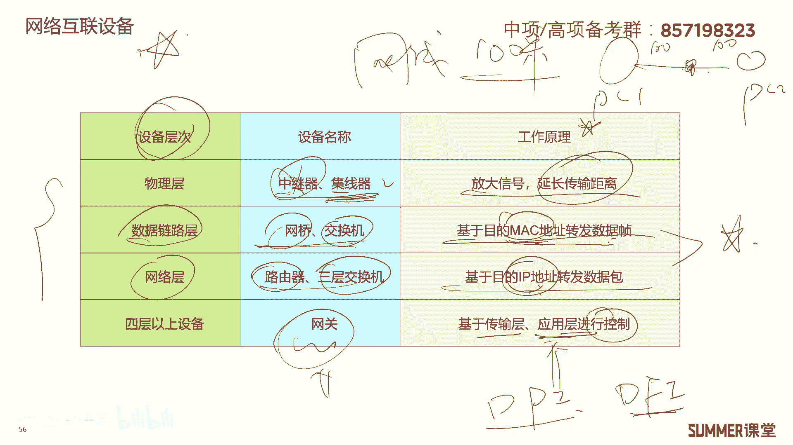

接着网络存储技术，网络存储技术说简单也很简单啊，最早我们的存储都是都是硬盘嘛，插在服务器的内部是吧，你看你这是一台服务器，然后里面有个硬盘来存数据，但但是最后发现我的数据量太大了。

硬盘这个服务器里面插的硬盘，虽然比电脑可能要多一点，你电脑就一个硬盘啊，最多两个硬盘，但是服务器可能差十个硬盘，但随着数据量的增加，你插十个硬盘也不够用了，怎么办，我们就可以把硬盘外置是吧啊。

就有点像有点像什么，有点像移动硬盘这种感觉，你的硬盘不够用了，我们可以插移动硬盘呗是吧，但是企业级的移动硬盘，插在服务器上的移动硬盘，这个量一般会比较大，一般你自己的移动硬盘就四个t，八个t顶顶天了嘛。

但是企业级的这种移动硬盘，它不叫移动硬盘啊，它叫g b o d啊，just bound of desk，就是一堆磁盘啊，一堆磁盘，但是它量可以很大啊，比如就一个这个东西，它可以有100个t啊。

可以有100个t啊，甚至更大啊，这就是这就是随着时间的推移，服务器的硬盘不够用，就出现了外挂硬盘阵列这种方案，这个方案叫death啊，叫对它，其实它的理念跟我们的移动硬盘，是不是一样的呀。

只是它容量比移动硬盘要大一点嘛，而且它的功能可能会会丰富一些，那可能会支持瑞德这一类的功能啊，支持瑞的这一类的功能啊，早期的d啊，早期的diss的话就是它就是一堆硬盘啊，什么功能都有我服务器来实现。

后期的death，他可能会把一些呃，瑞德啊，等等一些功能给你移到了这个death里面去啊，一般把它叫做智能智能days啊，它还是days嘛，我们考试你就不用管什么days。

什么普通diss智能days了，但考试就考你dd有什么有有什么特点啊，就是外接一个移动硬盘，那它的扩展性应该是比较差的，而且不方便管理嘛啊我举个例子，比如我这个单位有100台服务器，100台服务器。

每台服务器我要给他插个三个death，插三个移动盘，我就一共就300个移动硬盘，我好管吗，我怎么把这300个一硬盘容量进行统一管理，是不好整啊，东西太多了太乱了，而且你如果真的是有300台服务器。

每台服务器再接三个d，真的在服务器在机房里面会乱乱成鸡毛的，太乱了，它是现接来接去的很麻烦，所以后来又出现了一种方案，叫散存储区域网络啊，他相当于做了一个合并，以前你刚刚举的例子哈。

可能有300个days啊，就是300个外接的这种磁盘嘛对吧，管理起来特别麻烦，现在我把这300个我可以给你合并一下，我就整一个特别牛逼的存储是吧，你300台服务器，500台服务器都可以用我上面的资源啊。

都可以用我上面的资源，我这个存储系统，当然这个存储系统可能很大也很贵啊，它容量也非常非常多啊，我可以在上面虚拟出各种各样的啊一磁盘来，然后挂给不同的服务器去用，挂给不同服务器去用。

然后相当于我我后面就一台存储啊，那管理是不是就很方便了啊，分配资源也很方便对吧，然后由于我们服务器，最前端的服务器跟后端的存储，我们采用的连接协议不一样，我们可以分成i p3 ，fc 3和i b站。

这三种sun有什么区别啊，三种菜有什么区别，就中间连接的协议呗，中间我我的交换机，比如说服务器跟我的存储交换机，我用ip的交换机，ip以太网交换机，那就是i p3 呗，如果用f c的交换机。

那就是fc 3，如果用的ib交换机，那我这个sn就是a b3 ，明白啊，这三个它的区别明白吧，就中间连接的网络不一样啊，用什么交换机去连啊，所以de相当于是一个分布式的思想对吧，而我们的这种善。

我们的这种事是不是一种集中化的思想啊，最后我就用一个特别牛逼的存储，来为很多的服务器提供服务，我们后端只需要管理这么一台或者两台，存储就够了，资源管理，存储管理就方便很多了，这叫善，还有一种啊。

还有一种存储技术叫网络附加存储，网络附加存储，我发现很多人学了可能学了好几年，搞i t都搞了好多年，一直没明白什么是善，什么是last好，我给大家举个例子，你用过百度百度网盘吗。

啊用过什么阿里云盘吗是吧，你把百度网盘，阿里云盘都理解成nas就行了，它是用来进行文件共享的啊，用来进行文件共享的，只要网络可达就可以进行文件共享，而我们的这种扇是用来分配什么。

分为用户分配你电脑的什么c盘啊，d盘f盘的为你分配磁盘空间的，简单来讲，你的系统，你的操作系统，也是可以安装在d或者sn里边的，但是你的操作系统你能安装在阿里云里面吗，能不能呃呃呃阿里云盘哈。

不是阿里云啊，如果我说阿里云的话，有些人可能会理解成这个工业云的服务，就是你的操作系统，能不能安装在百度云盘或者阿里云盘，这种网盘里面，能不能不能，为什么，因为他们是last，他们提供的是文件共享服务。

好吧，最后给大家总结一下death，你理解理解成牛逼的大的这个移动硬盘就行了，然后sin啊，sin这个东西就是就是一个集中的存储分配，分配给不同的服务器去用，然后我们通过不同网络连接起来的。

就叫不同的三，那你简单理解成百度云盘或者阿里云盘就行了，好吧啊，这么理解应该是很好get到的，是很好跟说这是存储技术啊。

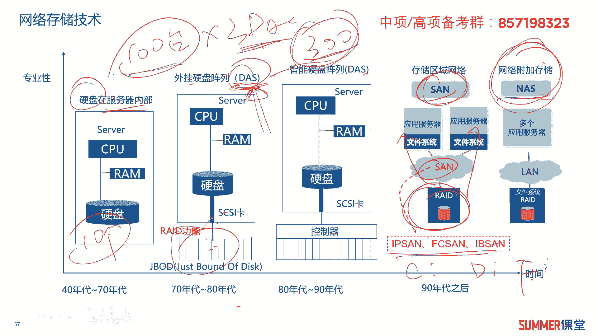

大家只需要掌握到这种程度，接着是网络的接入技术啊，网络接入技术分成有线和无线啊，有线啊，这里面罗列了好多种，但是大部分都已经淘汰了哈，我们来简单看一下啊，p s d n啊，这是模拟信号啊。

我们用电话线进行上网啊，速度是64k啊，但是不能同时打电话和上网，肯定早期的是这样子的，现在已经被淘汰了啊，不用了，i s d n啊，它跟前面的一个区别就是它的速率提升了，变成144k了。

而且可以同时打电话和上网啊，144k现在还有吗，肯定没有了，都被淘汰了啊，后面的一种接受方案叫h f c光电混合啊，什么样的光电混合就把光纤拉到小区小区，用传统的闭路电视来做来做互联网的接入。

这个技术也已经被淘汰了，以前网络工程师经常考的就是a h f c，这个技术，它的特点是什么，光纤到小区用户的接入采用的是闭路电视，那个同轴电缆采用闭路电视那个重置键了啊，了解一下哈。

这个技术a d s l早些年还有应用啊，我记得当时我用的a d s l都是四兆的啊，都是道的，它可以实现电话啊，也可以实现我们上网的上行和下行，就下载和上传嘛对吧，他用的是什么技术呢。

频分复用的技术可以实现电话和上网同时进行，而且他们的速率互不干扰，现在用的比较多的肯定是最后一种了，肯定是最后一种，最后一种就光纤入户嘛对吧，它核心的技术是什么，你一定要清楚哦。

啊现在的光纤入户我们用的最多的，它的核心技术是无源光网络，是胖啊，是胖核心主线啊，有o l t o n u分光器啊，o d n o n u是什么东西啊，就你家里的光猫啊，就叫o n u啊。

其他的了解下就行了啊，其他的了解一下，然后下行的数据，我们用广播的技术上行应用十分复用啊，用十分复用十分复用，也叫t d m a，我记得高级的网络规划设计师是考过他的啊，高项高项反正最近没考过啊。

还是给大家总结出来了哈哈总结出来了好，另外一种接入就无限接入，wifi技术你了解一下最新的wifi 6，他的专业术语也叫8012。11a差，理论速率可以达到9。6g，同时支持2。4g和5g两个频段啊。

两个频段，然后其他的3g4 g5 g了解就行了，这不是我们考试的重点啊，5g的话可能你需要注意一下它有些特点啊，第一个接触的容量特别大是吧，第二个低延时，第三个它带宽会比较大，第四个它允许海量的终端。

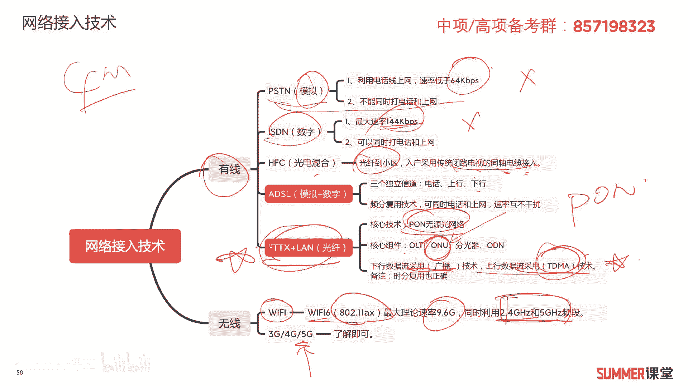

包括物联网终端接入嘛啊这些特点了解一下，了解一下，接着是网络的规划啊，网络的规划，网络的三层架构，这肯定是重点分成哪三层，接入层，汇聚层，核心层，这么三层不同层次的功能，这在很多考试里面都会考。

接入层主要负责用户接入，还有一些安全控制，访问控制在接入层，安全访问控制在接入，然后流量的汇聚设备，链路的等于路由控制策略控制，这些关于高级点的控制技术是在汇聚成，而核心层主要实现高速转发，路由选择。

然后服务器的接入可能放到核心层啊，不能层次的功能，把它作为一个记忆的知识点啊，网络出口它的功能了解一下就行了啊，了解一下就行了，主要是这三层啊，拉三层接入汇聚核心以及不同层次的功能。

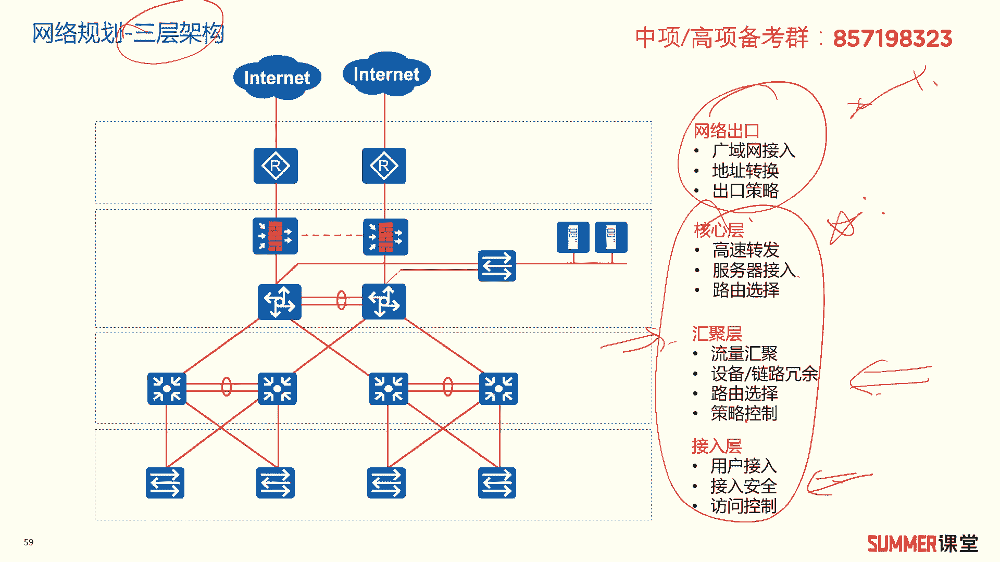

网络设计啊，网络设计的工作主要包括网络拓扑的设计，然后主干网络以及核心层设计，汇聚和接入层的设计，广域网出口的连接啊，也就是这个出口的设计，接着还有什么呢，还有无线网络的设计，可能会有wifi。

还有网络安全的设计啊，具体里面每一个设计里面内容特别多，我记得我当时讲了一门网络设计的课程，就是讲各个层次的设计，一共十个十个小时，所以你觉得我们能通过几句话，能把大家讲明白吗，不可能我跟你讲。

就讲这我要讲十几个小时的啊，如果给你敲实验的话，可能讲20个小时都有鱼对吧，所以你说这点这点东西肯定讲不太明白，你了解一下就行了啊，我们这考试对这块的要求没有那么高，然后信息安全的基本要素啊。

这里面有啊，我觉得他写的有点乱哈，因为在后面还有一个专门的章节来讲，信息安全啊，他这儿又提了一下信息安全，我们还是给大家去提一嘴吧啊，几个基本的要素，机密性，完整性，可用性，可控性，可审查性。

我们重点还是掌握前面三个，前面三个叫c i a特性，c是机密性那个单词的缩写，i是完整性单词的缩写，a是a而b那个叫什么，反正是可用性那个单词的缩写available吧，还是叫什么，反正记不太清了哈。

啊你你你你感兴趣的可以去找一下啊，机密性，完整性和可用性，它是c i a啊，cia特性啊，就是这三个特性的一个单词缩写啊，什么是机密性，就保证信息不泄露呗，怎么实现精密性啊，啊进行数据的加密是吧啊。

完整性就是信息不被修改嘛，啊只有允许的人才能修改啊，这叫完整性，怎么实现完整性，一般我们是用数字签名，数字签名可用性有什么，攻击是针对可用性的，拒绝服务攻击是针对可用性的了解。

既保就可用性是保证资源是可以用的，对吧啊，不至于攻击者占用我们资源的访问，导致授权的用户不能用吗，啊，典型的就是攻击者用d o s攻击拒绝服务攻击，攻击我们的可用性，然后可控性是可以控制授权范围内的。

信息流向及行为方式啊，典型的上班时间啊，你不能聊qq或者上班时间你不能看视频，我们是可以在出口部署上网行为管理来实现的，叫可用性，可控性啊，这叫可控性，都在我们网络管理员的控制之中是吧。

第五可审查性就可追追查嘛，啊有些地方也会叫审计，就你犯了问题之后，犯了事儿之后，我能查到你啊，我能查到你，一般通过上网行为管理或者日志审计，这一类的设备，它是可以可以实现的，事后追责啊，事后追责。

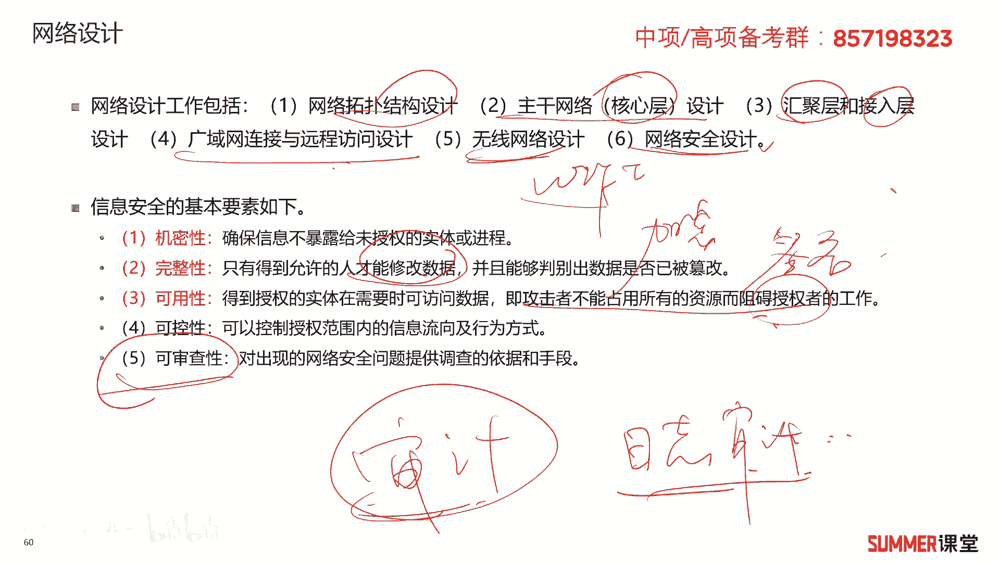

这是网络设计啊需要注意的几个点，ok我们下面来看一些题哈，看一下针对这一块啊，都怎么去考你，2018年5月第19题，tcp ip是internet的核心协议，应用程序通过应用层协议。

利用网络完成交互的任务啊，其中什么是用来在客户机和服务器之间，进行简单文件传输的协议，进行文件传输的协议有两个，第一个ftp，第二个t f t b是吧啊，c的话是网页嘛，然后d的话是邮件发邮件用的啊。

所以他们的功能你要清楚，然后进行简单文件传输的t是简单的嘛是吧，它它是基于udp的，这个是基于tcp的啊，tcp的可靠，u d p的效率比较高，但是它不可靠啊，它提供不复杂，开销不大。

u d p开销不不大啊，然后不复杂，那tcp相对而言会复杂一点，所以tcp基于tcp的这个f t p它会更可靠一些啊，这道题很明显啊，是不是选择b啊啊b的话，tf tp就叫简单文件传输协议。

第202018年5月第20题啊，在osi这个模型当中，什么的功能主要是将网络地址翻译成物理地址，网络地址是不是ip地址，物理地址就叫mark地址啊，物理地址就叫mark粒子，所以它是什么协议啊。

将ip地址翻译成mac地址，应该是a r p协议对吧，他并决定如何将数据从从发送方经路由倒接，是接收方的路由选择嘛是吧，路由选择是哪个城的工人路由选择。

我们翻译一下a翻译一下前面哈路有选择。

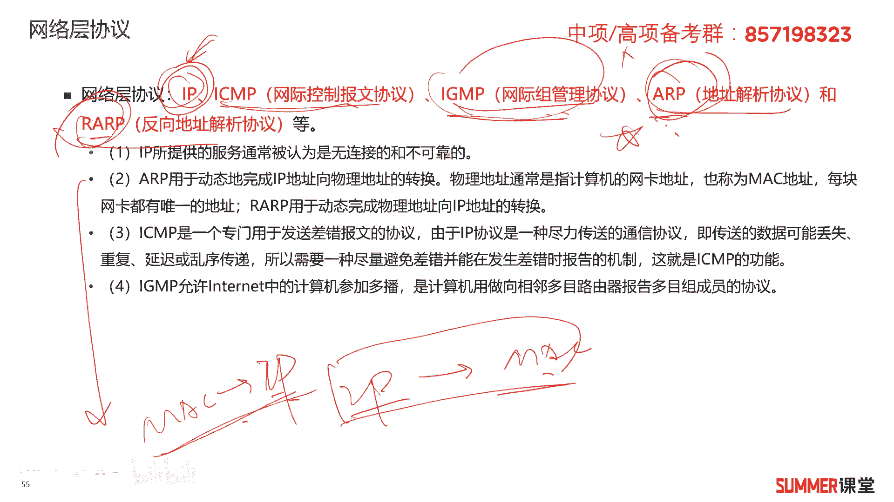

是不是网络层的功能啊，所以刚刚的那道题。

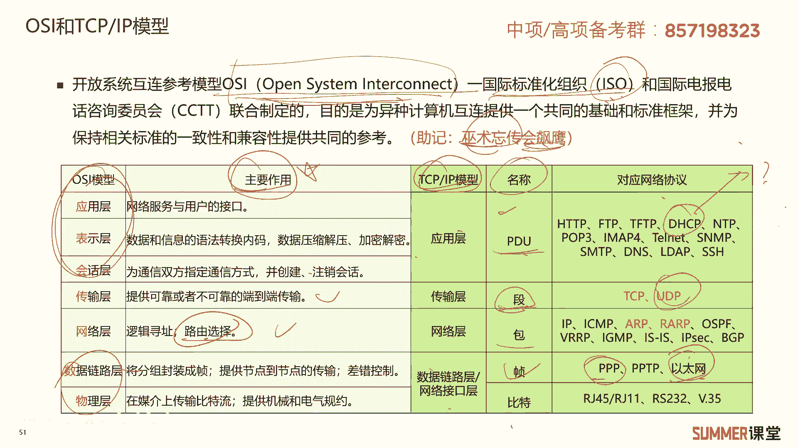

我们可以从两个地方判断自旋网络层，从两个地方，第一个他说的肯定是网络层功能对吧，网络层，然后第二从这判断它是描述的a r p协议，a r p协议属于哪个层次，a r p协议也是网络层啊，从两个地方判断。

我们这个地方这道题的话，就要选c网络层底层的逻辑，希望大家能够明白，2018年5月第21题，i trip e啊，802规范定义了网卡如何访问传输介质，以及如何在传输介质上传输数据的方法。

其中哪一个是重要的局域网协议，802。3叫以太网，这典型的局域网协议，802。11，这个也是要大家掌握的，这是什么，这是我们常说的wifi，好问大家一个问题，wifi和w有什么区别。

有什么区别和联系清楚吗，啊其实wifi的本质就是基于802。11协议的，w nw nine叫无线局域网，组建无线局域网的协议可能有很多，你用红外能不能组建无线局域网，可以啊，你用微波啊。

用其他各种各样的技术，都可以组建无线局域网的是吧啊，只是wifi是基于802。11协议的大烂啊，相当于wifi，它是w line的一个部分啊，这是w net这个圈，然后wifi只是里面的一个小部分对吧。

还有可能有其他的技术的组件，w v r那组逐渐w呢好理解啊，好理解，所以这道题明显选择b答案选择b答案，802。3，这是传统的以太网啊，传统的以太网，2018年11月第19题，osi汽车模型当中。

udp是属于哪一个层次的传输层，传承两个协议tcp，还有一个是udp，接着是这两个协议它们的区别和对比，这是要求大家要掌握的，如果还不掌握下来，多花点时间，多花点时间慢慢嚼呗是吧，内容不多啊。

考的这种题。

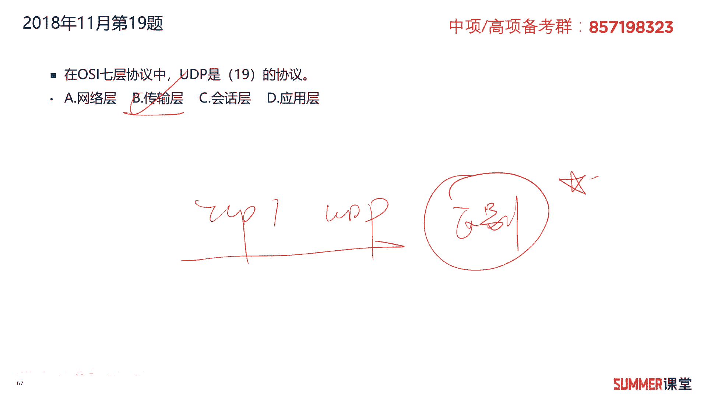

希望大家不要丢分啊，尽量的不要丢分，因为这种题是历年也考过很多次的，看一下哈，刚刚给大家去总结的传输层里面，所以这两个协议啊，啊其他的这些协议都需要注意，随便给你写个出来。

你要知道这个协议是属于哪一个层次的。

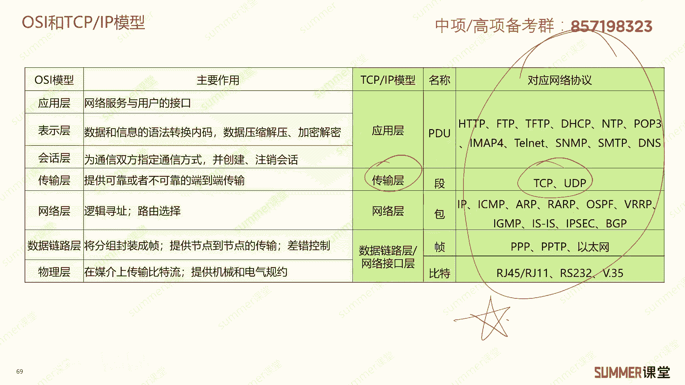

2018年11月第21题，关于网络存储技术的描述，正确的是哪一个，death是一种易于拓展的存储技术，易不易做的啊，不好拓展是吧，didas是不是我给大家去讲了，你就按照移动硬盘来理解移动硬盘。

你的移动硬盘满了，好拓展吗，好不好拓展啊，你可能要重新买一个，是不是比较难扩容啊，因为它不像其他的存储，你可以往里面加硬盘吗是吧，所以它不好扩展，b nas系统与das系统相同，都没有自己的文件系统。

nas是有自己的文件系统的，它是进行文件共享的，ok他有自己的文件系统好，顺便问问大家一个问题，就是sun有没有自己的文件系统，有没有没有sun和nas和san和death，都是为用户提供裸磁盘的。

为用户提供的楼层板啊，所以我们的呃，我们的这个操作系统是可以安装在sn里面的，也可以安装在death里面，但是你的操作系统不能安装在last里面，因为las给你提供的是文件服务对吧，他有自己的文件系统。

并提供的是文件服务，你就不能把操作系统安装在nas里面去了，理解啊，不理解也没关系啊，反正记住就行了，记住就行，c nas可以使用t c p i p作为其网络访问协议，可不可以，可以啊，你访问百度。

百度网盘，阿里云盘肯定是可以通过互联网去访问的，互联网就是跑的t c p i p啊，啊所以他肯定是对的啊，d sars采用了文件共享的方式，他写错了哈，不是他写错了。

他故意混淆你的sars是一个存储里面的呃，一个接口的接口的协议啊，存储里面接口的协议，应该last as是采用文件方式进行存取，你别看一字之差哈，区别可大了啊，区别可大了。

主要是为了为了混混淆你干扰你的啊，所以这道题正确的很明显，选择b答案诶，我选择c答案，选择c答案啊，刚输错了哈啊，选择c答案，2019年5月第19题，t c p i p模型当中。

taller属于哪个层次的应用层，这种题纯粹送分题，2019年11月第六题，2019年8月，华为正式发布自有系统，这个什么华为的自由操作系统是什么，鸿蒙是吧，其他的几个鲲鹏是华为的芯片。

然后升腾也是华为的芯片，麒麟国产化的操作系统，鸿蒙这个系统它是可以用于多种场景的，它可以是手机的操作系统啊，电视电视的系统也可以用鸿蒙是吧，现在华为在在汽车上也是在用鸿蒙。

所以他会把鸿蒙打造成一个跨平台的啊，跨平台的一个操作系统啊，适配各种各样的终端设备，了解一下啊，了解一下啊，鲲鹏是华为cpu的芯片，到其麒麟哦，对麒麟是华为手机的芯片，还有一个麒麟。

银河麒麟和和中标麒麟，那那个麒麟是操作系统，国产化的操作系统是吧，所以麒麟还有两个意思啊，华为手机芯片啊，有有麒麟有一个国产化电脑的操作系统嗯，国产化电脑的操作系统也170，顺便给大家普及一下啊。

国产化操作系统有哪些国内网操作系统啊，去电脑端的u s是吧，然后麒麟还有什么还有什么，还有中科方德啊等等，你可以去找一下，其实还是比较多的，升腾是华为ai处理的芯片，2019年11月第13题。

理论上ipv 6的地址数量是多少，ip v61 共是多少位的128位，i p v4 多少位，i p v4 是32位，所以i p v4 地址数量应该是二的32次方，i p v62 的128次方是吧。

选择d答，2019年11月第15题啊，其中不包括哪一家颁发5g牌照给四家哪四家，说问题像这种的话，就是怎么讲呢，他算跟时政相关，但是又比较基础的啊，又比较基础的啊，所以这道题选择d哈。

2019年11月第16题，通常来讲，什么应用占用带宽最大，肯定是视频监控应用咯，2020年11月的第二题，t c p i p模型当中哪一个协议属于网络层，所以网络层的a r p是吧，还有ra r p。

我们把其他协议都写出来，看大家是否还记得啊，i p是吧，i c m p，然后ig mp这些各个协议它的功能它的功能啊，希望大家不不不记得了，翻译一下刚刚我们讲的，翻译下，我们刚才讲的好。

作为一个小作业哈啊功能也希望大家能够掌握，啊物理层啊不对，路由路由器是工作在哪一个层次的啊，通过逻辑地址进行网络之间数据的转发，或者信息的转发，逻辑地址是不是ip地址，物理地址叫mark地址啊。

这是需要注意的哈，路由器肯定是工作在网络层的，除了路由器工作在网络层，还有什么设备工作在网络层，三层交换机是吧，物理层设备还记得吗，极限器，然后数据链路层，数据链路层的设备。

交换机和网桥这些要比较熟哈啊，如果考的考的这种题，我是希望我的学员不能丢分的啊，这种题是很基础很简单的，你只要把我给大家总结的这种表格给记住了，考试肯定是会做的，那肯定是会做的。

就是这样的一个表格嘛对吧，而且他们的原理，工作原理也是要求要求大家需要掌握的啊。

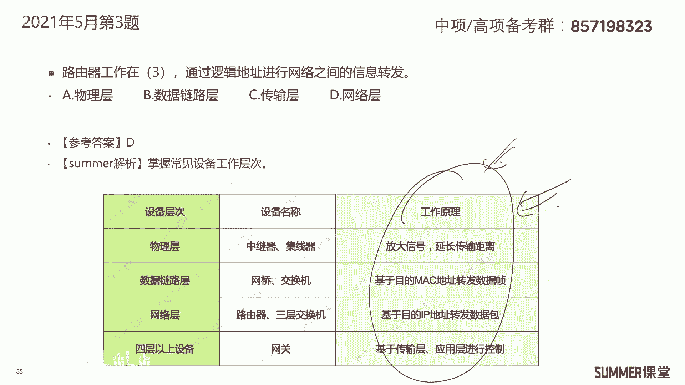

接着来看2021年5月的第四题，关于网络存储技术的描述，不正确的是哪一个，又考存储了是吧，a当容量增加时，采用直接附加存储的方式很难扩容，对的嘛，你移动硬盘是不是很难扩容，它就跟移动硬盘差不多啊。

只是企业级的移动硬盘比你家用的要大一些，b当网络附加存储，nas，网络附加存储，nas支持即插即用，可以经济的解决存储容量不足的问题，即插即用，而且能够灵活扩容吗，比如说你的百度网盘空间不够不够了。

怎么办，多花点钱去扩空间嘛，所以它是比较比较好的，解决了这个存储容量不足的问题，肯定是ok的，c光纤通道存储区域网络，fc上相对成本较低，配置简单，相对成本不低，配置也比较复杂啊。

反正这个需要注意一下哈，因为f c跟我们传统的网络不一样，fc它的带宽是2g啊，4g8 g 16 g的，我们传统的以太网可能都是100兆，然后1000兆十个g啊，40个g100 g的对吧啊。

传统的这种ip上，我们配的都是以太网交换机啊，以太网交换机，而fc 3配的是fc交换机，fc交换机估计很多人都没怎么见过，它主要用在数据中心里面的，所以懂他的人不多，他比较贵啊。

配置起来也要稍微麻烦一点啊，因为主要是不懂啊，大部分人你考什么时刻啊，华为啊，考这种认证，你配的是什么，包括我们考网络工程师，你配的都是以太网交换机，基本上都没有配过fc交换机的，所以它的配置比较复杂。

不正确的就是c d网际协议存储区域，网络这名字我觉得叫的好怪哈，网际协议存储区域网啊，其实你其实我们专业的话就直接说i p3 ，大家都知道怎么回事啊，i p3 嘛，i p3 的设备成本比较低。

可以共享和使用大容量的存储空间啊，没问题吧，ip的成本，以太传统以太网交换机成本是很低的，然后他带宽也很大，你看现在以太网带宽都到100g，剩400g了，400g的以太网啊，都商用了啊，都商用了。

它可以共享一些大容量的存储空间，没什么问题啊，没什么问题，所以这道题选择c答案，2022年5月的第八题，osi 7层模型当中r p c n f s啊，这个协议这两个协议属于哪一层。

可能这道题会稍微偏一点哈，啊会稍微偏一点啊，这两个协议大家记一下，它属于绘画层，属于绘画成，所以这道题选择c答案，你还需要知道绘画成有哪些协议，rpc circue和n f s啊。

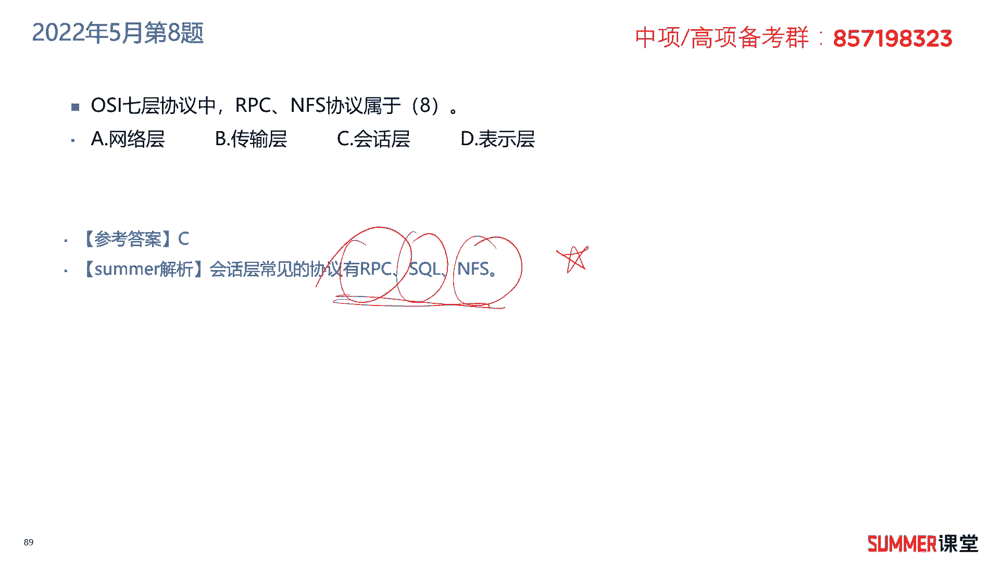