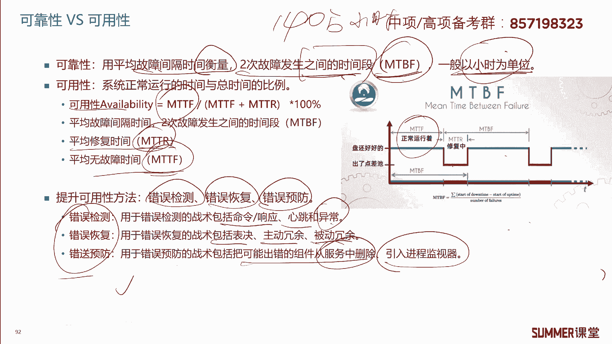
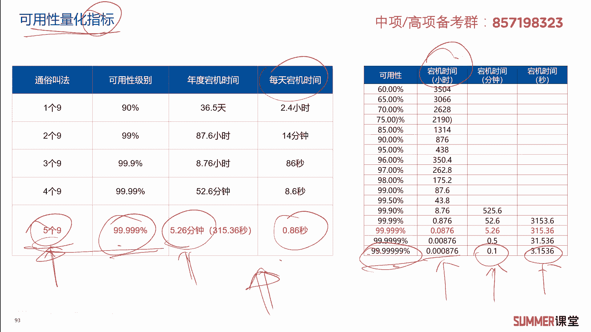

# 2023年软考信息系统项目管理师视频教程【总结到位，清晰易懂】-软考高项培训视频 - P7：1-1-6 数据仓库 中间件 可靠性 可用性 - summer课堂 - BV1wM4y1Z7ny

好我们下面来学习数据库与数据仓库技术，其实对数据库的要求并不高，我们只需要掌握，这里面总结了一句话啊，常见的数据库有oracle，my circle，circuserver，芒果db啊。

前三种都是关系型的数据库，而芒果db是非关系型数据库，什么是关系型数据库啊，就是非常正规的这种表格啊，一行一列，这就是关系型数据库，而非关系型数据库，比如说用来存视频的，用来存图图像的啊。

这种它就不是标准的表格吗，是吧啊，非关系型数据库了解一下就行了，然后数据仓库是一个面向主题的集成的，非意识的，而且随着时间变化的数据集合，说简单一点，数据仓库它是一个数据集合，用来支持管理和决策。

这个数据集合有什么特点呢，它是面向一个主题的啊，比如说我们这个数据仓库，它可能是用来分析汽油的啊，汽油价格变化的，也可能是用来分析用户喜好的，不同的主题他去读取的数据源肯定是不一样的，对吧。

我们是把各种各样的数据源通过抽取整理，把它汇集到数据仓库里面，这个过程一般我们把它叫做e t l，e t l是三个单词的缩写，一是抽取，然后t是转换不同的数据源来的数据，我们要把它转换成统一的格式啊。

因为有些可能是oracle，有些可能是server server，还有一些是芒果db的，我们把它转换成统一的格式，最后加载到数据仓库里面，加载到数据仓库里面，加载到数据仓库里面之后。

我们用o lamp服务器olap是什么东西，叫联机分析处理，相当于就对这些数据进行一轮分析和处理是吧，可以直接对数据仓库里面的数据进行分析，也可以把它弄到数据集市里面，相当于复制一份过来。

然后对这个数据进行一定的分析和处理，最后输出一些报表或者数据挖，挖掘的一些信息嘛，这就是整个数据仓库的应用啊，刚刚讲的面向主题哈啊还有集成，它集成了各个数多个数据源嘛。

啊非易失数据仓库里面的数据一般是不会丢失，或者它是不会删除的，就是随着时间的推移，它是会不断的增加啊，很少去删除啊，很少去删除，因为我们要基于时间去做一些分析啊，啊做一些统计，比如说a79 的价格。

最近3年，最近5年它是一个什么样的趋势，对吧啊，所以数据仓库里面的数据是随着时间而变化的，绝大部分都是增加，很少去做删除，很少去做删除，ok这是关于数据仓库的概念，这张图希望大家要注意一下。

我给你扣个空出来，你知道这是什么东西，比如说a这也知道这是e t l，在这个地方就把数据仓库是这样，然后这是数据集市，这是o lamp服务器olap，你简单理解就是数据分析的服务器是吧啊。

你你这这端就是我们用户输入的一些指令嘛，你要想要什么样的结果啊，想要报表吗，还是要想想去做查询，还是想去做一些数据挖掘上层的应用，或者我们用户想达到的一个结果啊。

这个是数据仓库的架构啊，大家了解啊，接着是中间件，中间件是以在一个分布式系统环境当中，处于操作系统和应用程序之间的一个软件，相当于它就是中间人啊，比如说我要跟一个老外去交流，这个老外他说的是德语。

而我我不懂德语，怎么样找一个翻译呗是吧，翻译就是中间件，它是在什么跟什么之间进行翻译的呀，操作系统os和应用程序app，中间件是一种独立的系统软件，或者叫服务程序，分布式应用软件，借助这种软件。

这种软件就是中间件哦，在不同的技术之间共享资源，中间件位于客户机服务器的操作系统之上，管理计算机资源和网络通信标红的，你需要注意一下，另外中间件的分类分成三种，底层型，通用型和集成型。

它们里面的代表简单看一下，简单看一下，以前是考过的，反正最近没怎么考，需要注意的，python它不是中间件，python是一种面向对象的编程语言啊，编程语言它不是中间件啊，编程语言的分类啊。

大家有概念吗啊python是是什么什么语言，是脚本语言是吧啊，是脚本语言，它是解释型的，那还有编译型的编译型的，比如java c加加啊这一类的，他就是编译型的语言，编译型的语言它会生成目标代码的啊。

比如说a windows里面就生成ex e是吧，它会生成这样的目标代码，一般大型的程序都会用这种编译型语言，用java c a去开发，而一些小型的啊，小型的程序我们一般用这类的脚本语言啊。

它不需要生成这种目标代码，在执行的时候直接执行源代码就行了是吧，ok啊需要注意啊，python它不是中间件啊。

它是一种计算机的编程语言，我们下面接着来看可靠性和可用性，可靠性用平均故障间隔时间来衡量，也就是两次故障发生之间的时间段啊，用英文单词m t b f来表示啊，我们来直接来看下面这张图。

什么表示m t v f它是第一次发生故障的时间，距离下一次发生故障的时间，它其实中间是包含了我们故障的修复时间，以及正常运行的，就是这个绿色的时间，用它来表示可靠性啊，可靠性mt b f mt b f。

也就是平均故障时间间隔啊，平均故障时间间隔一般是以小时为单位的，有些时候我们会看到，比如说a固态硬盘，它是它的平均故障时间间隔是140万小时，140万小时，这就是用来衡量可靠性的。

可用性是指系统系统正常运行的时间，和我们总时间的比例，系统正常运行的时间叫做什么，叫做m t t f，也叫平均无故障时间，对应到这张图里面，就是绿色的这块或者绿色的这边也是一样的。

这叫m t t f正常运行的时间，然后除以除以m t t f加上m t d r，m t dr是平均修复时间，平均修复的这个时间是不是是不是红色的呀，不可用的，所以可用性等于m t t f。

除以m t t f加mt t r，然后乘以百分之百，这两个东西你要清楚它分别代表的是什么啊，分别代表的是什么，相当于在可靠性和可用性里边是有三个啊，三个英文术语，第一个叫mt b f。

第二第二个叫m t t r，第三个叫m t t f，它分别代表的我们通过这张图去理解啊，通过这张图去理解啊，当然啊我们的高像啊，高校教材，它里面的可靠性和可用性主要来自于偏僻。

主要来自于p n p的一些知识点，其他书上可能写的跟他有点不一样啊，我们暂时不用管了啊，比如其他地方可用性，它不是用m t t f来算的，它是用m t b f来算的。

就m t b f除以t b f加上m t t r，反正知道有这样的一个计算公式就行了啊，不用去管它啊，考试就按照我们讲的这个公式来啊，考试竟然在我们书上的这个公式来，ok这是可靠性和可用性。

它的定义希望大家能理解，然后提升可用性的方法有三种，错误检测，然后错误的恢复错误预防，错误检测常见的啊，我们可以用一些命令啊，或者是用网管软件去检测错误嘛对吧，还有心跳啊，心跳线啊，异常检测，异常反馈。

错误的恢复啊，主要有哪些呢，冗余啊，主动用余和被动冗余错误的预防啊，我们可以把一些可能出出错的组件，从服务当中去删除，然后引入监控的进程，引入监控的基层，这几种针对可用性提升的方法啊。

希望大家要稍微看一下，这是考试考过的针对可用性的一些指标啊。

一般我们用多个几个九来形容啊，像电信级的一般至少是五个九是吧，你的可用性级别能达到99。999%，也就是1年当季的时间在五分钟左右啊，每天当季的时间0。86秒啊，其他还有更高级的可用性。

比如这里面几个九啊，1234567，七个九的可用性啊，七个九的可用性，然后当季时间啊，年当季时间是这么多小时啊，分钟1年宕机不足一分钟啊，1年到第三秒啊，第七个九的可用4g可可用性啊，大家了解一下。

相当于这个就更加宏观一点，大家更有感觉嘛，更有感觉，一般电信级就是要达到五个九，像电信联通啊，他们招了一些骨干设备，五个九的可用性要求。

可用性要求好，我们来看几道练习题，2018年11月的第22题，某企业要建设信息系统平台，要求系统的可用性达到四个九，系统a平均无故障时间是1万个小时，平均无故障时间是什么指标，mt t f是吧。

平均无故障时间，然后故障的平均维修时间，维修时间m t t r r表示recover嘛啊，维修时间，系统毕业的平均无故障时间是14000小时，平均故障的维修时间是1。5个小时，下列说法正确的是。

他问你哪一个系统符合可用性要求，就哪个系统是能达到四个九的要求的，我们直接把a b这两个系统，他们的可用性算出来嘛，是吧啊，可用性的公式还记得吗，前面给大家去讲的可用性。

那个叫ov可行性的单词，这个单词叫什么名字啊，avnerable吧。

a vinnerable on winner，winnerability，awnability啊，就是a吧，用a来表示它等于m t t f除以m t t f，加上m t t r是吧，系统啊，系统a的啊。

可用性等于等于10000÷10000+1嘛是吧，那系统b的等于14000，加上1。5分之14000啊，最后你算出来，算出来a的可用性，应该是99。999%啊，这能达到五个九。

五个九肯定能满足四个九的要求啊，但b等于99。9964964%，你说四舍五入，四舍五入等于多少，四舍五入底99。96，而且这种不能四舍五入哈，他肯定不满足四个九了对吧，只能满足三个九的可用性要求。

所以很明显只有系统a符合可用性的要求啊，系统b不符合啊。

这种题一定要会做哈，比较简单好，再来看一道题啊，这是2022年中级网络工程师，案例分析里面的题，他说评价系统可用性，通常用mt b f这个指标，平均故障间隔时间和好评价可靠性哈。

啊用它和m t t r还有一个叫平均修复时间啊，这两个指标，那其中mt b f指系统无故障运行的时间，通常用什么为单位，mt b f越什么可靠性就越高，是不是以小时为单位，mt b f越大。

表示它的可靠性就越高啊，所以这道题你看案例分析哈，冲击的案例分析出现过这种问题，需要注意一下哈啊需要注意一下，这里面有个解析，这个解析也希望大家读一下啊，就是有些厂商，它宣传它的固态硬盘。

m b t f为120万小时，120万小时，120万小时，你把它换算成年就是137年，其实它并不代表着我的固态硬盘，137年都不换，并不是这个意思啊，而是什么呢，而是而是你要这么去计算啊。

你先把它换算成换算成拉姆达这个公式啊，最后推出了一个1/137，表示这个硬盘的平均年故障率是0。7%，也就是说1年之内平均1000个硬盘，只有七个硬盘会出现故障，好吧，它代表的是这个意思。

并不是说137年都不出问题好吧，这个需要注意一下啊，需要注意一下好，我们接着再看另外一道题，2019年11月的第二题，中间件是一种独立的系统软件或者叫服务程序，什么不属于中间件。

哪一个python是编程语言，其他的几个都是中间件是吧，你去看一下啊，看一下中间件的分类啊，有三种分类啊，三种悖论，123每一种里面都有哪些，这些肯定都是包含在啊中间件里面的啊，所以这道题选择d答案。

2022年11月的，2020年11月的第三题啊，什么不属于关系型数据库，它是属于非关系型数据库的啊，其他几个都是关系型数据库，2021年11月的第四题，在可用性和可靠性规划与设计当中。

需要引入特定的方法来提高系统的可用性，其中把可能出错的部件从服务中删除，这里边属于什么策略，把可能出错的部件从服务当中删除，很明显是属于错误的预防，我们前面给大家去讲过可用性提高的三种方案。

检测恢复和预防，那其中把可能出错的部件从服务当中删除，是不是属于预防啊，属于预防检测和恢恢复的措施，大家也要看一下，以免下次考到你，你不会，ok这是需要大家稍微记一下的好吧。

关于第一章啊。

