# 2023年软考信息系统项目管理师视频教程【总结到位，清晰易懂】-软考高项培训视频 - P8：1-2-1 需求分析 - summer课堂 - BV1wM4y1Z7ny

大家好，我是你们的夏老师，我们下面学习第一章的第二个模块。

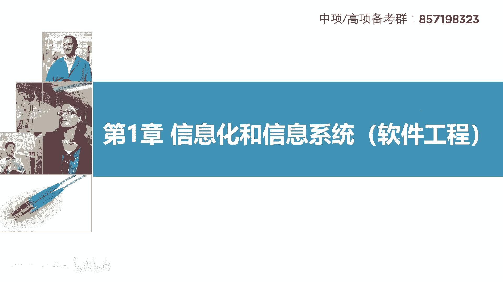

软件工程，软件工程每年大概会考到4~6分，而这个小节我们一共总结了六个，需要掌握的知识点，也就是极端情况，这六个知识点都会出现，每题一分，一共六分，当然有些年份可能考不了这么多。

但是有几个知识点基本上是必考的啊，比如说软件测试这一分肯定有企业应用集成，这一分少不了需求分析也是会有一分的啊，其他的从最近几次考试来看，cm mi一分，这样就有四分了对吧。

早些年份是比较喜欢考u m l的，但是从最近的考试来看，u ml会考得少一点，o关于常考的这几个打圈的需要注意一下，一定要多花时间把它搞懂好吧。

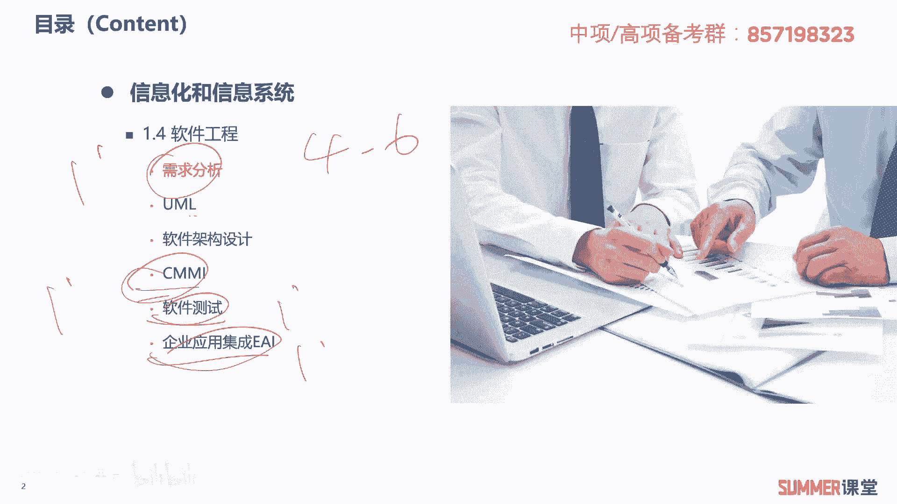

我们首先来看一下需求分析这一个小节，在正式讲需求分析之前，我们需要知道软件工程它的概念，软件工程是将系统的规范的，可度量的工程化方法应用于软件开发，运行和维护的全过程，什么叫工程化的方法。

也就是以前我们用于修路修桥，修房子的这些方法啊，这就是工程化的方法，把它用在软件领域，就一步一步按照节奏去走是吧，软件开发的啊，和软软件开发和运行维护的全过程是指的什么，知道需求分析，软件架构的设计。

软件设计过程管理，测试集成啊，其实这个标红的，基本上就是我们这个小节要给大家讲的内容啊，比如需求分析就是第一部分的内容，软件架构设计，后面会讲啊，软件设计简单的过一下，测试和集成是非常重要的，两个小节。

就这两个小节会考两分的是吧啊，需要注意一下，软件工程由方法，工具和过程三部分组成，像这种三个三个的，你就要有意识的去记一下软件工程的概念，作为了解，作为了解啊，重点是下面需求包含三类业务需求。

用户需求和系统需求，这是重点重点，历年考试考过很多次的业务需求，是指企业或者客户对系统高层次的目标要求，这叫业务需求，一看到高层次肯定要选业务需求，它通常来自项目的投资额，购买产品的客户。

客户单位的管理人员，市场营销部门或者是产品策划部门等等，总体来讲，关注业务需求的一般是领导啊，一般是领导，比如说一个医院，他要搞一套a p p，你觉得医院的院长他关注是什么，他关注app的功能吗。

不怎么关注，他，关注的是我搞了这个a p p之后，我上线了这个业务系统之后，我医院能不能评上三甲医院，能不能评上什么智慧，智慧医院这一类的大帽子是吧，这就是业务需求，而用户需求呢啊。

它是描述的用户的具体的一些目标啊，我们用户要求我们的软件系统，必须要实现的一些任务和功能啊，比如说a医院的一个a p p，主要有哪些人会有用户需求啊，我们的患者是吧，可能你要求一他能远程挂号啊。

能够在线的看我的一些检测报告是吧啊，医生护士都有自己的需求，这就是用户需求啊，用户需求不同的用户，他的需求肯定是不一样的，我们通常采用用户访谈或者问卷调查的方式，来获取用户的需求，第三个需求叫系统需求。

系统需求是从系统的角度来说明软件的需求，系统的角度我前面是不是讲过啊，什么系统啊，软件啊，系统啊，平台啊，那基本上就是翻译成软件，或者翻译成翻译成大软件，翻译成软件就行了。

只要从软件的角度来考虑这个软件的需求嘛，啊比如说哎我们这个软件要实现哪些功能对吧，第一个什么用户注册啊，第二个能在线查看检查报告对吧啊，反正这一类的吧，这都是它的功能需求啊，非功能的需求啊。

比如说性能需求啊，我的软件要同时支持1000个人啊，在线啊，这这算性能需求，它是属于非功能需求的，还有一些设计约束，我开发的这个a p p，我既要支持苹果用户，还要支持安卓用户，是不是设计约束啊。

设计约束啊，相当于同要同时兼容两个平台嘛，或者底层要兼容mysql或者oracle啊，这这种数据库啊，这是设计约束o关于需求啊，关于需求常见的业务需求，用户需求和系统需求，大家要理解，要理解。

另外系统需求又可以分成三个分成功能需求，非功能需求和设计约束，这三点需要注意，相当于有三个需求，然后一个需求又分了，又分了三个需求出来，明白啊，希望大家能够理解哈，这是重要的知识点，考试经常考。

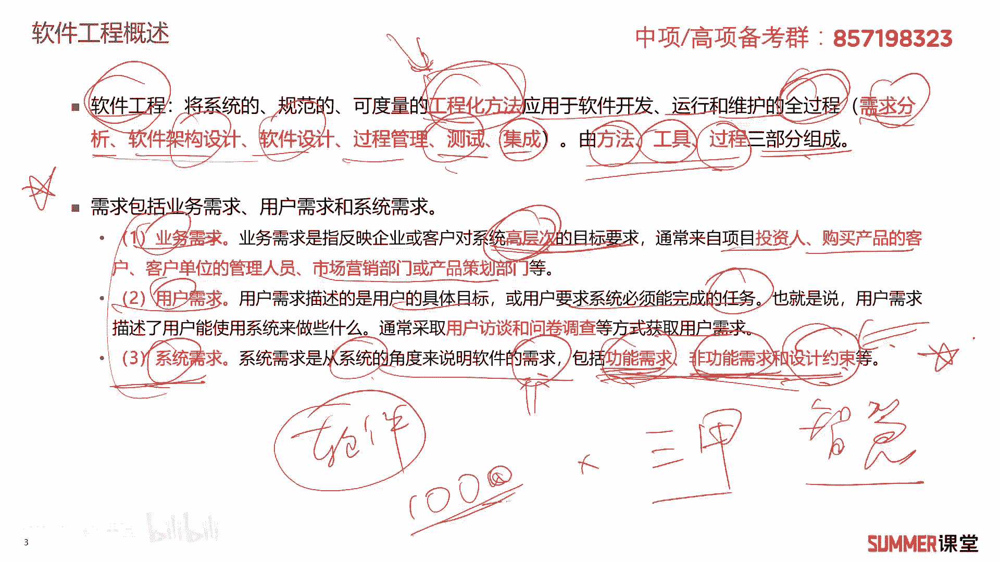

我们接着来看质量功能部署，q f d，它是一种将用户要求转换成软件需求的技术，目的是最大限度地提升软件工程过程中，用户的满意度，q f d将软件的需求分成了三类，常规需求。

期望需求和意外需求需要记忆一下，而且你需要知道这三类需求分别指什么，常规需求是用户认为软件系统应该能够做到的，功能或者能达到的性能实现越多，用户就会越满意啊，这叫常规需求啊。

典型的比如说你开发一个订票的软件，它基本的这个需求，常规需求肯定是可以订票吗是吧，那可以订票啊，不会闪退吗，这些是基本的需求，如果这种需求都实现不了，那你的订票软件还有用吗，那肯定就没没什么用了是吧。

第二个叫期望需求，是用户想当然地认为系统应该具备的功，能或者性能，但是并不能正确描述自己，想要得到这些功能或性能的需求啊，他想当然的认为啊，如果期望需求没有得到实现，会让用户感到不满意啊。

比如说开发一个12306的，12306的订票软件啊，客户想用用这个软件来定夏普卧铺的话，我想听下铺，但是这个软件好像没有实现，对吧啊，这这就是用户的期望需求没有实现的话，用户是不是就会感到不满意啊。

的确会会感到不满意，我每次买买卧铺，我都想买啥夏普，但是最后是随机的啊，最后是随机的对吧啊，ok这叫期望需求，而第三个叫意外需求，也称兴奋需求，这是用户要求以外的开发人员控制的啊。

实现了用户可能会很高兴，不实现也没太大的影响，这是不是锦上添花的一个需求啊，比如说现在这种订票的app啊，12306我们不仅可以订火车票，还可以订餐，还可以订餐啊，实现了是不是能提升用户的满意度。

ok这是质量功能部署里面的三类需求啊，什么是质量功能部署，希望大家理解一下这个概念，然后它里面的三类需求要求要记忆，要求要记忆，这非常重要，需求分析嘛，重点就是需求啊，需求这里面分了三类。

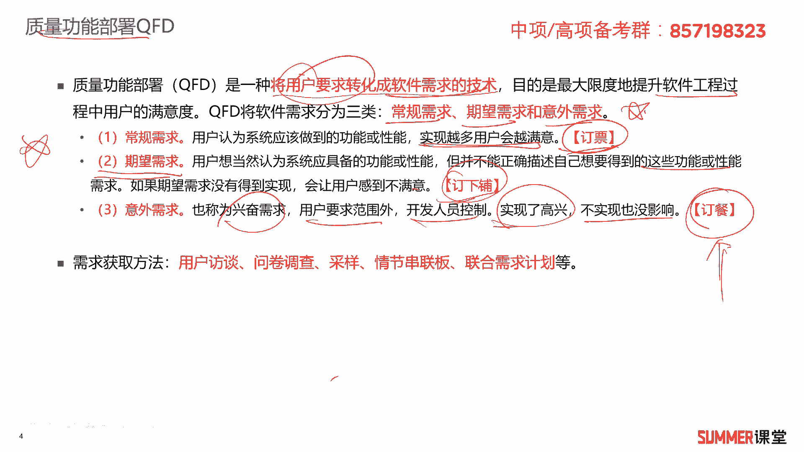

然后前面有三类是吧，业务需求，用户需求和系统需求，然后系统需求又分了三个啊，加起来差不多九个需求了是吧，不要混淆哦，不要混淆下来。

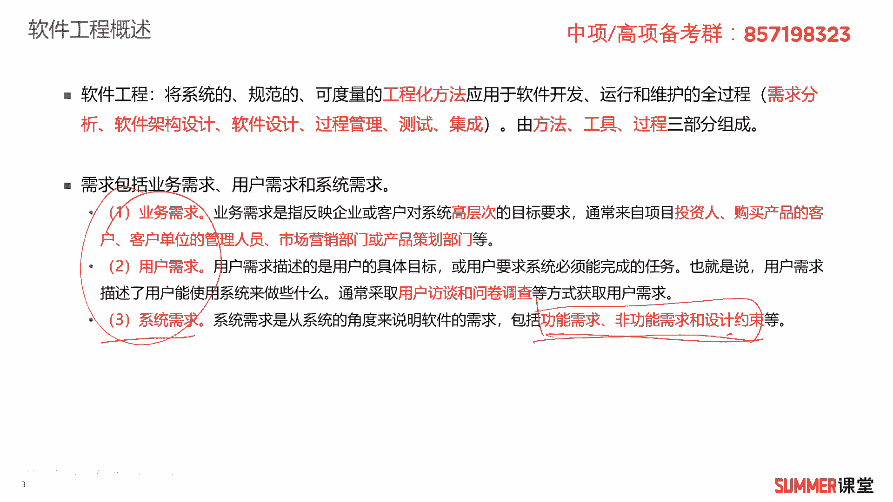

多花点时间稍微看一下，需求分析是历年的高频考点，考历年的高频考点，然后需求获取的方法有用户访谈，问卷调查，采样情节串联板，联合需求计划啊等等啊，了解一下这个了解一下就行了啊。

接着啊，需求分析啊，是是把杂乱无章的用户要求和用户的期望，转换成用户需求的这样的一个过程，一般分成三个阶段，需求的提出，需求的描述，需求的评审，好的需求标准啊，有如下的几个特性，这是重点可验证性啊。

无二异性就没有歧义吗，完整性，一致性，可测试性，确定性，可跟踪性，正确性，必要性，这些特性希望大家下来好好的看一下，你主要是要理解啊，理解我觉得没什么可解释的是吧。

可验证就这个需求可验证它是真的还是假的啊，无无2亿就没有歧义啊，这完整的一致的可以测试跟踪啊，可以测试跟踪啊，是正确的，有必要的，应该按字面意思意思，你大概都能够理解啊，都能够理解。

然后结构化的这个需求分析方法啊，它它进行需求分析的核心是数据字典，这句话标红的数据字典，希望大家把它作为记忆的知识点，结构化方法，我们前面是不是给大家去讲过，就一步一步的往下面走嘛对吧。

然后需求分析出来之后啊，我们有三种模型啊，有三种模型来表示这个需求哈啊，第一种模型叫数据模型，用实体联系图，也就是e r图来表示，第二种功能模型，用用数据流图也叫df地图来表示行为模型。

用状态转换图s t地图来表示，这是核心知识点，非常重要非常重要啊，考试如果考需求的话，50%的概率会考他啊，就靠这几个模型，而且这几个模型用什么图来表示啊，说实话这个有点难记啊，不好记怎么办。

怎么想办法呗，好告诉大家一个助记的方法，首先行为状态，你把这个这个给记住，行为状态应该还是读起来比较顺的是吧，然后功能牛牛啊，功能流怎么记，看下面这张图，流的话让我想到什么小河，这里面有一条河。

河里面是不是流着水，水有什么功能啊，谁有什么功能啊，谁可以供我们用户洗衣服，还可以在里面去游泳，还可以拿来喝是吧，可以拿来养鱼，所以水是有很多功能的，本来我想找一找一张图啊，找一张这个有河的图。

然后有人在里面洗衣服，有人在里面游泳，但是我没找到啊，没找到啊，没找到的话，就随便找了一张呗，啊随便找一张，反正流你就想到河，河的话有各种各样的功能，河里面有水，水有各种各样的功能，我就是这么记的哈。

啊一看到功能啊，一看到牛，我就要想到功能啊，流想到和河，想到功能是吧，你把这两个给记住了，它上面一个就比较好记了啊，数据啊，数据用实体联系图，用e r图来表示，至于什么是e r图。

什么是什么d f d s t d你就不用管了，我给你解释起来，比如说我给你解释个一二图啊，你还要还要懂数据库，可能啊，怎么联系的，怎么搞的，太复杂了啊，我觉得是完全没有必要展开的。

反正我告诉你前半截非常重要，后半截它的用途，一二图它的用途啊，什么描述实体属性，实体之间的一个关系，你看一看就行了啊，标红的你稍微注意一下啊，你自己读一下就ok，考试重点考哪儿啊，就考这就考这。

考前前面我告诉你高频考点，你肯定要一定要标注一下啊，一定要注意一下是吧啊，说到这儿的话啊，说到这儿的话给大家强调一下哈，就是听课的时候，你别只顾着听课，你该记得你就要记啊，那老师讲的一些重点。

该画的要画，你不然你就对这个屏幕听一下课，听完啥啥都忘记了，非常正常，因为这种东西平时你又接触不到是吧，所以你该把我们的讲义打印出来的，要打印，然后该做笔记的要做笔记，该记忆的要要记记啊，不是记哈。

不是记忆啊，记忆这个阶段还没什么必要啊，你反正该记下来的啊，我强调的一些重点，你勾画出来吗是吧，强调这些重点一定要勾画出来，这是需求分析里面非常核心的一个知识点啊。

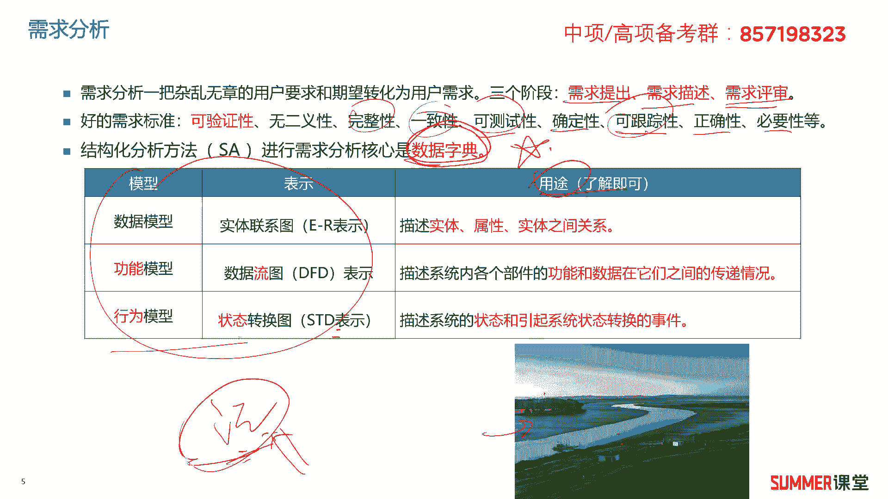

常见的几个模型和表示方法，接着需求分析的输出产物，在软件开发里面可能就是软件规格说明书啊，这是一个重点软件规格说明书，它是开发活动的一个产需求，开发活动的一个产物，目的是使项目干系人与开发团队。

对系统的初始规定有一个共同的理解，是开发工作的基础，开发工作的基础，软件规格说明书，它是一个技术文档，不是管理文档，所以类似项目预算啊，进度计划，风险分析等等，这些管理的内容。

是不会在软件规格说明书里面的，软件规格说明书包含哪些内容呢，啊我们这里边随便找了一个啊，给大家去看一下啊，它可能包含什么，可能包含范围引用文件需求，什么合格性规定，需求的可追踪性，尚未解决的问题。

注解附录等等，但也不一定完全按照他这个内容来，我们来看一下啊，一个真实的软件需软件这个规格说明书，它里面包含的内容啊，有参考的文献啊，一般的约束最核心的肯定是有功能需求嘛是吧，需求这肯定是最核心的。

当然还有性能需求啊，验收的标准啊，验收的标准啊，有有这些内容啊，这是一个真实的软件需求规格说明书，它包含的内容大家注意了解啊。

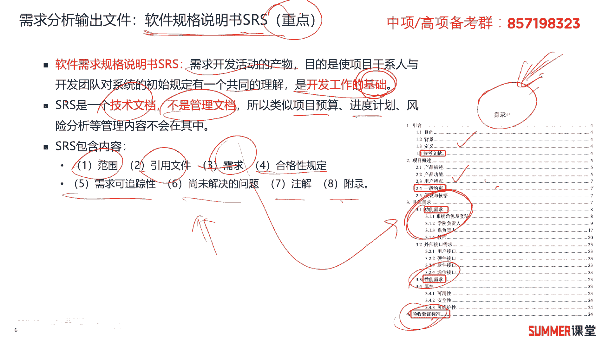

作为了解，接着是需求的验证和确认，我们把需求挖掘出来了，然后也写到文档里边了，但你这些需求对不对，我们是不是还要经过验证验证，也叫需求的确认，是为了确定如下几个方面的内容，第一个软件规格说明书里面。

软件需求规格说明书啊，正确的描述了预期，满足项目干系人需求的行为和特征，就是你是不是描述正确了是吧啊，描述正确了啊，第二个你的需求是不是正确，从正确的推导而来的啊，你推导过程有没有问题。

第三个你的需求是否是完整的高质量的啊，你所有地方的需求是否一致啊，然后你的需求是不会是不是为后续的设计，实现和测试提供了足够的基础啊，就是你需求完不完善啊，足不足够你后面搞搞设计对吧啊。

一般需求的评审和需求测试工作啊，是用来对需求进行验证的，需求评审需求的测试是用来进行需求验证的，需求评审，就是对我们的需求文档进行技术性的评审，大家开一个这种正式的评审会来讨论一下啊。

里面的需求有没有问题，这就叫需求评审或者需求验证，好，我们来看一下呃，几道真题，2018年11月的第七题，软件需求是多层次的，包括业务需求，用户需求，系统需求，其中业务需求是指什么。

a反映了企业或客户对系统高层次的目标需求，肯定没问题是吧啊，高层次的是业务需求，ok然后b描述了用户具体目标或用户要求，系统必须要完成的任务，这是不是用户需求啊，啊这是用户需求。

c从系统角度说明软件的需求，包含功能，非功能设计约束，这是系统需求d，描述了用户任务系统应该具备的功能和性能，描述功能和性能的是什么，是不是系统需求啊，但是这里面又有点像用户需求是吧，描述了用户系统。

用户系统也不是好描述，用用户系统也是也是系统需求啊，他没有没有没没有说成b这样b这个才是啊，才是用户需求d答案，它的核心还是在哪，核心还是在系统应该具备的功能核心呢，你别看到什么用户系统啊。

如果以后出个类似的题来来麻痹你哈，你别看他用户系统就是用户需求了啊，用户任务系统它前面是修饰词啊，本质就是系统嘛，系统具备的功能和性能是不是系统需求，这是系统需求，ok这道题你不仅要会选a。

而且要把b c d给我吃透，这种题是比较容易考到的啊，下次考你的时候稍微给你变一下，你就不不知道选什么了，那肯定不行是吧，好接着看2019年5月的第十题，关于软件工程的描述，不正确的是哪一个。

a软件工程对软件开发的质量进度，成本进行评估管理和控制啊，肯定没问题，用户需求反映客户高层次的目标要求，对不对，你肯定是业务需求啊啊才反映高层次的目标嘛，所以很明显b就是错的，前半句就错了。

后半句倒没问题，通常由项目的投资人客户提出，所以需求是用户对新系统在功能，行为性能方面的期望啊，没有什么问题，因为它没有指明是什么需求吗，d软件工程将系统的规范的，可度量的工程化方法运用于软件开发。

那句话我们是不是在前面给大家去讲过，那就是软件工程的定义，所以这道题这道题选择b答案，这道题选择b答案，第2019年的第七题，在软件需求分析当中，什么分别用来表示功能模型和行为模型，行为状态对吧。

所以最后肯定是要选状态的，那么直接就在d当中选吧，在d当中选功能模型，我给大家教大家的一个啊，我教大家的一个筑基的方法，是不是是不是你游啊游牛，你会想到河啊啊和有多种功能嘛对吧。

所以肯定是数据流图这道题选择a答案。

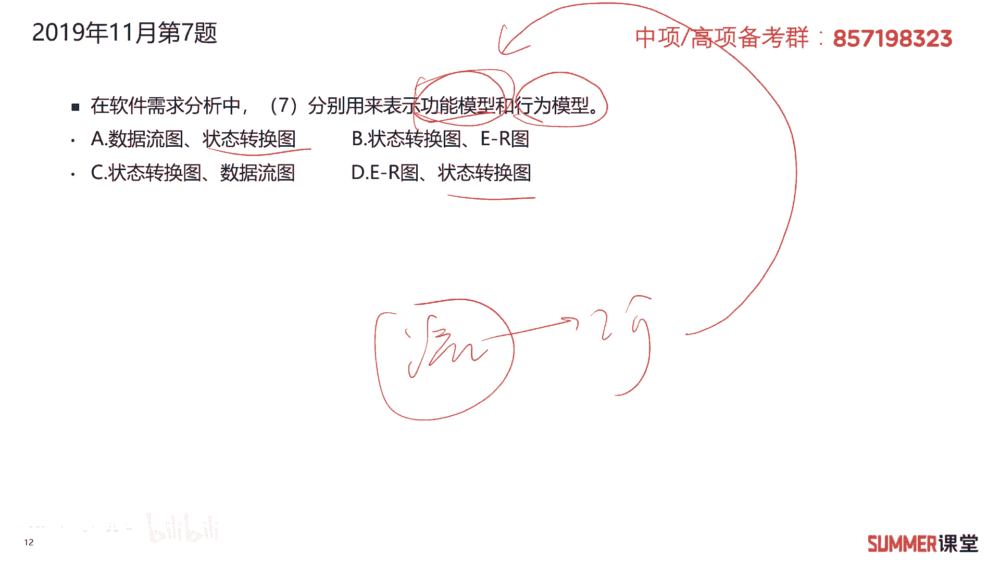

也就是考虑他考虑他很重要。

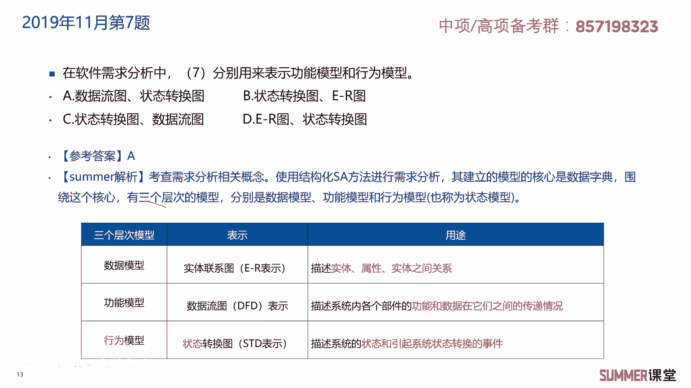

非常重要，务必要给我掌握到2020年11月的第八题，软件工程需求分析阶段，使用实体联系图来表示什么模型，实体联系图用来表示数据模型。

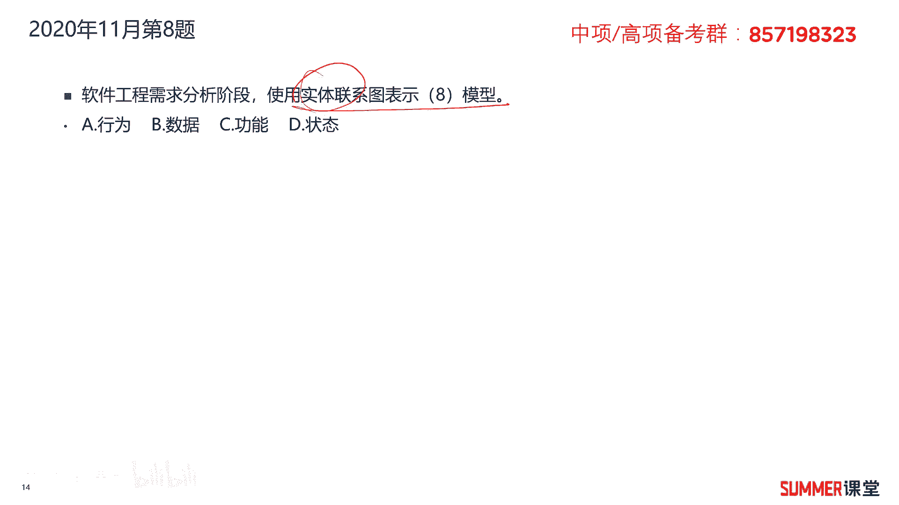

数据实体啊，还是它还是它是吧，你看考了好多次啊，就这一点知识，就这一点点考了无数次了哈。

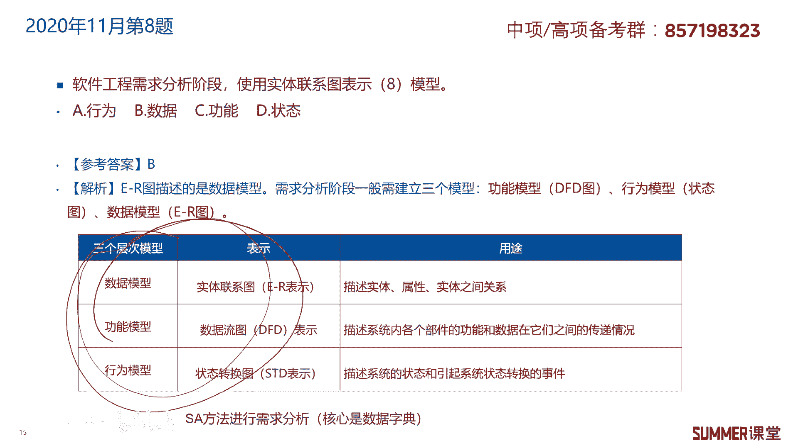

2022年5月的第九题，使用结构化分析sa的方法来进行需求分析，围绕数据字典建立三个层次的模型，不包括什么，不包括哪一个啊，肯定有实体关系图，数据流图，状态转换图。

而且他们的英文还记得吗啊这个是一二图是吧，数据流d f d啊，这个是s t d，所以d f d s t d啊，这几个图的英文还是需要注意一下哈，没有业务流程图啊，没有业务流程图，所以这道题选择b答案。

接着看下一题，在需求文件当中什么的需求可以作为基准使用，那就好的需求可以作为技能使用吗，知道哪些是好的需求啊，或者我们需求应该满足条件，可测试可测量啊，项目经理认可没有没有这一点哈，完整可追踪啊。

相对独立无依赖啊，没有这个特点，所以一三这里选择b答案，我们要知道好的需求标准可验证啊，无二异性，无歧异性，完整性，一致性，可测试确定性的，然后可追踪正确性和必要性，这道题是实际上就考的可验证嘛。

然后可测试完整性和可追踪性。

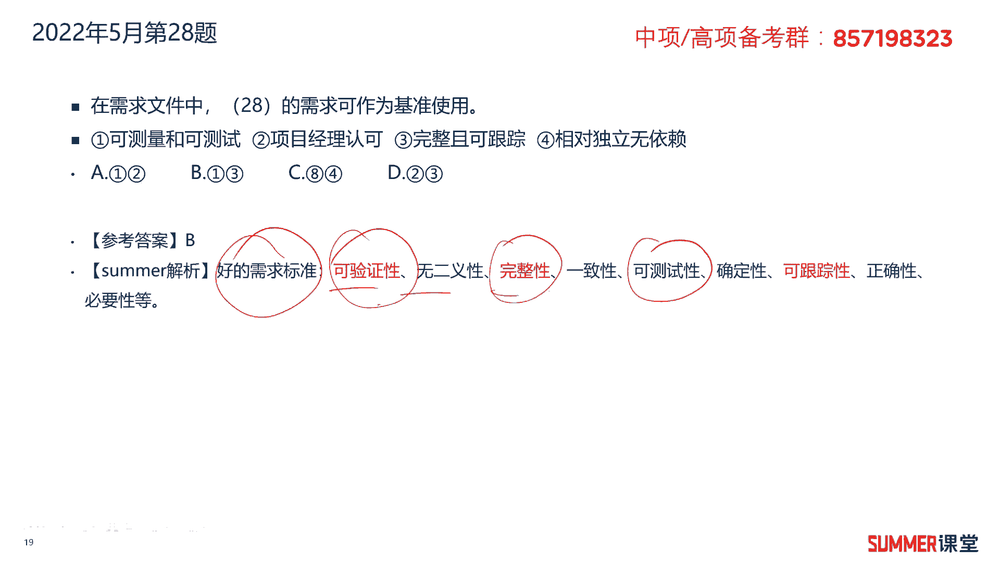

就考虑这几个啊，但我这没标红哈啊。