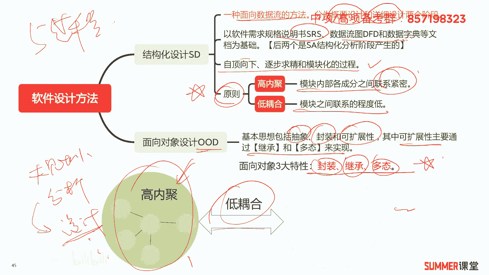
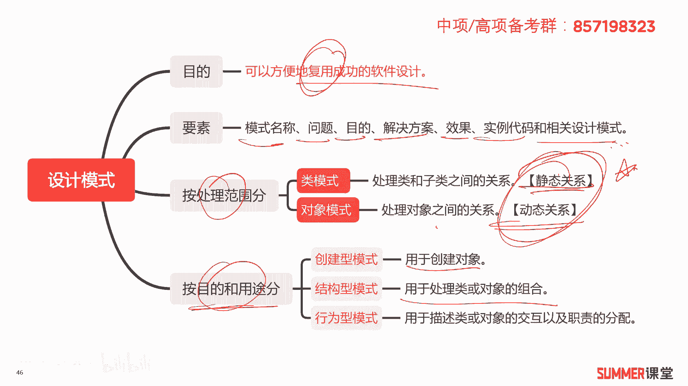
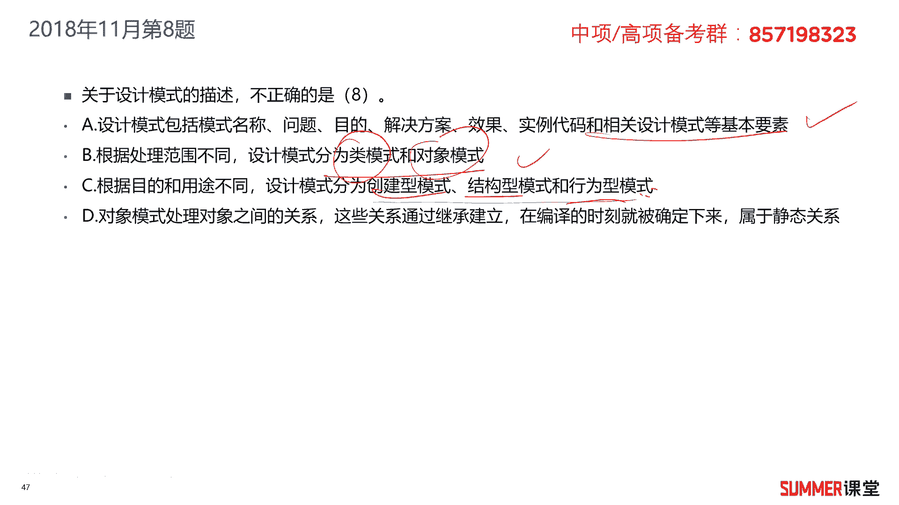
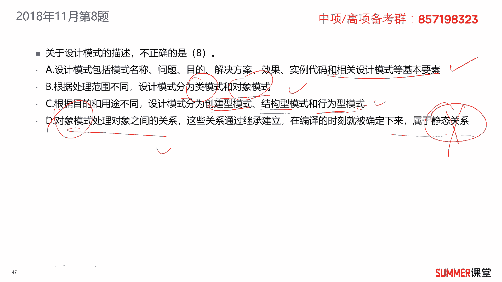
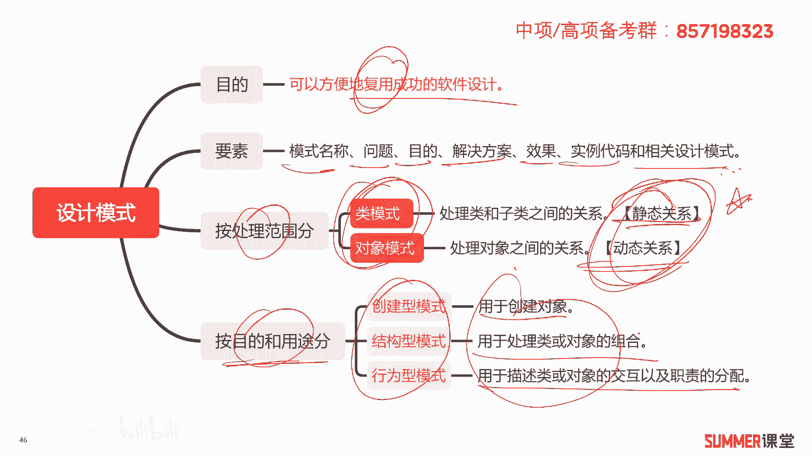
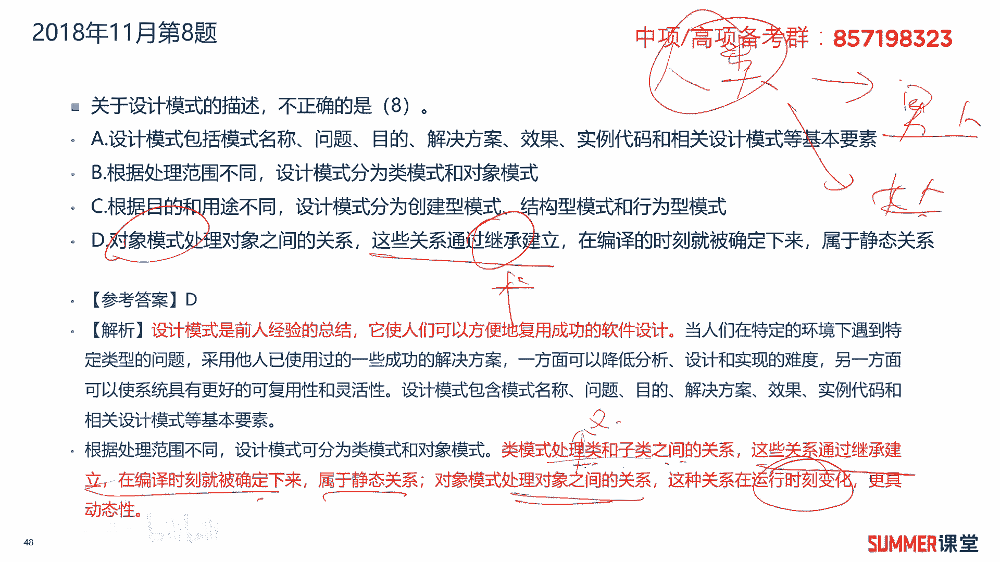

# 2023年软考信息系统项目管理师视频教程【总结到位，清晰易懂】-软考高项培训视频 - P11：1-2-4 设计模式 - summer课堂 - BV1wM4y1Z7ny

好我们下面来学习软件设计啊，首先看一下软件设计的方法，主要分为两种结构化的设计，sd和面向对象的设计，oo d s d它是structure design的缩写，o o d前面的o o表示面向对象。

d design结构化设计啊，它是一种面向数据流的方法啊，分成概要设计和详细设计两个阶段，它以三个文件作为基础，哪三个文件呢，分别是软件需求规格说明书，s r s数据流图d f d和数据字典。

其中你要做设计肯定要参考用户的需求是吧，用户的需求就记录在软件需求规格说明书，这个文件里边，然后你还要参考它前序过程的输出，我们做软件开发一共五个过程，大家还记得吗，五阶段模型，第一阶段规划是吧。

第二阶段分析分析完了之后再设计，最后再实施运维，所以现在讲的设计阶段，它前序过程是分析分析过程会有输出物的输出，什么东西呢啊输出我们的数据流图d f d，还有数据字典啊，这是结构化分析阶段啊。

结构化分析阶段，它的产物会作为我们软件设计阶段的一个输入，把这三个文件稍微的记一下，另外结构化设计它的精髓前面有没有讲过呀，有讲过三个字，三个金水自顶向下逐步求精，模块化的过程，结构化设计原则两个啊。

核心知识点重点，高内聚，低耦合，高类聚什么意思啊，就是模块内部之间各成分他们联系是很紧密的，比如说像这里边他模块内部联系很紧密，然后第耦合是指模块之间的联系程度很低，比如这个是模块一，这是模块二。

它们之间的联系程度是很低的，这叫低耦合，结构化设计的两个原则，高内聚低耦合，这是核心考点，一定要记住，接着面向对象的设计，它基本的思想包括抽象封装和可扩展性，其中扩展性主要通过继承和多态来实现的。

然后面向对象有三大特性，封装继承和多态这三大特性也是考过的啊。

所以记忆接着设计模式，设计模式的目的是为了可以方便的复用，我们成功的软件设计关键词，复用设计模式的要素包括模式的名称，问题目的解决方案，效果实例代码和相关的设计模式啊，了解一下，读一读。

设计模式有两种分类的方式哈，第一种是按处理范围分，第二种是按目的和用途来分，按处理范围分，可以分成内模式和对象模式，内模式是处理类和子类之间的关系，对象模式是处理对象之间的关系。

嗯按照字面意思应该也比较好理解，其中内模式是静态关系，而对象模式是动态关系，重点考过的考过的，所以要把它作为一个记忆的知识点，接着按目的和对象来分，我们的设计模式可以分成三种，创建型模式。

结构型模式和行为型模式，创建型模式是用于创建对象，结构型模式用于处理类或对象的组合，然后行为模式用于描述类或者对象的交互，以及职责的分配。

了解一下它的概念，了解一下，ok那我们来做一道例题，2018年11月的第八题，关于设计模式的描述，不正确的是哪一个，a设计模式，包括模式名称，问题目的解决方案，效果实例代码和相关设计模式等基本要素。

没有问题，刚刚给大家去读了一句原话，b根据处理范围的不同，设计模式可以分为类模式和对象模式，也没有问题吧，总结的根据目的和用途的不同，设计模式可以分为创建型，结构型和行为型啊。

不他们里面的解释什么是创建型，什么是结构型和型类型。

了解吧，我刚刚给大家去圈了这块链了解，然后这三个要记。

这两个要记，所以a b c是对的，那肯定d就有问题了，d对象模式处理对象之间的关系啊，没有问题，这些关系可以通过继承建立在编译的时刻啊，就被确定下来了，属于静态关系，对象模式属于动态关系。

类模式属于静态关系是吧，就考虑它这两个知识点。

所以不正确的，很明显，选择d答案，选择d答案啊，需要注意一下哈，内模式处理的是类和子类之间的关系啊，这些关系通过继承来建立，类和子类是通过继承来建立的，所以他这是继承建立也是错的啊。

对象模式不是通过继承来建立的，是吧啊，类模式才是通过继承来建立的，你想一下嘛，我给大家举个例子，人类和和男人女人，男人女人是不是子类，她是不是继承了人类的一些特性啊，啊这才是父类与子类的关系啊。

处理内膜是处理父类上少写了一个字，父类与子类的关系，它是通过继承来实现的，属于静态关系，然后对象模式是处理对象之间的关系啊，这种关系是时刻发生变化的啊。

具有动态性。