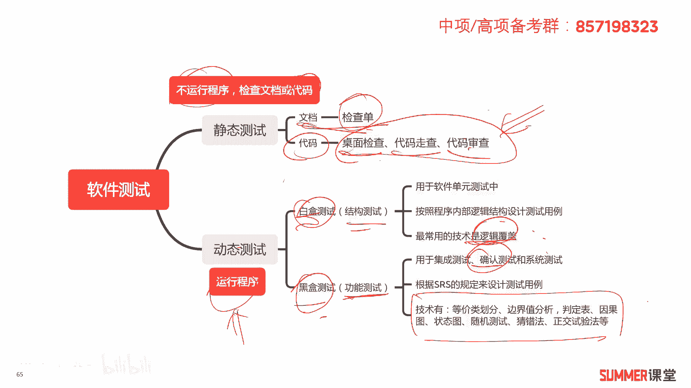
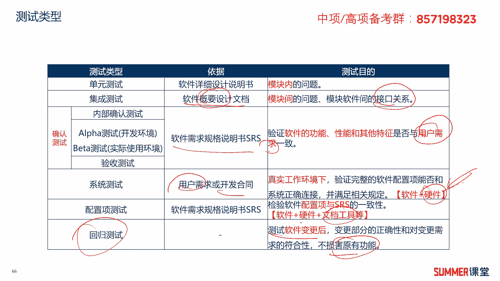
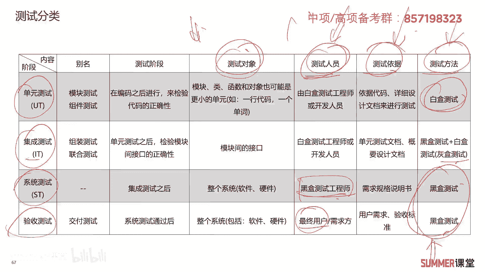
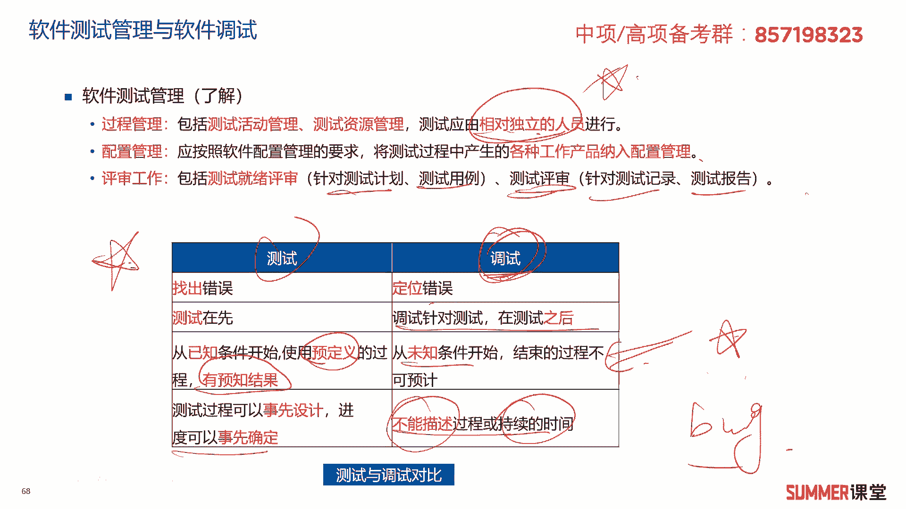
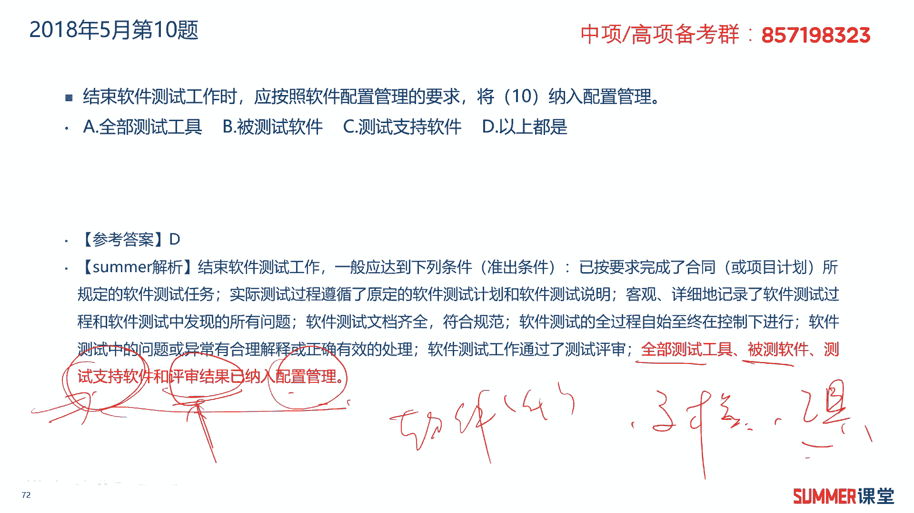
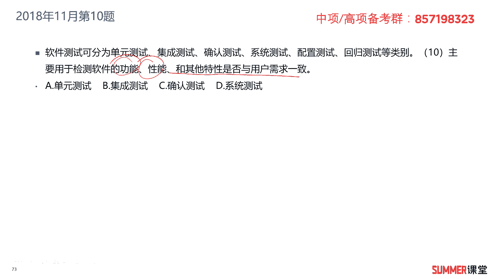
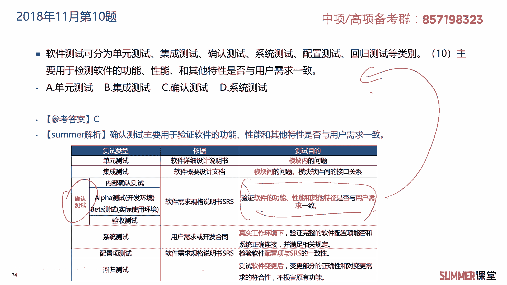
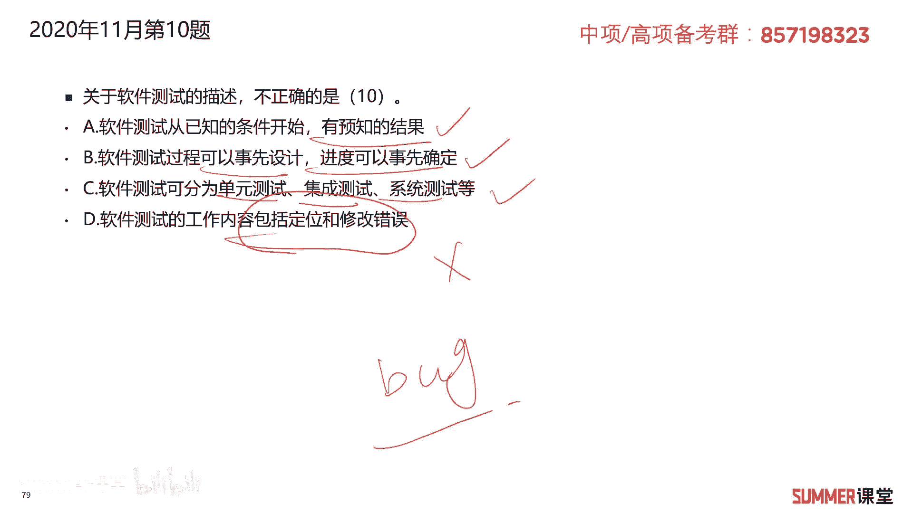

# 2023年软考信息系统项目管理师视频教程【总结到位，清晰易懂】-软考高项培训视频 - P13：1-2-6 软件测试 - summer课堂 - BV1wM4y1Z7ny

好我们接着来学习软件测试啊，这也是重点，每年必考至少有一分啊。

非常重要，没有哪1年不考的啊，所以一定要注意，软件测试分为静态测试和动态测试，什么是静态测试呢，简单理解就是不运行代码，检查文档或者检查我们的编码，这就是静态测试，检查文档常用的工具是检查单啊。

比如说我们要检查开发的某个文档，我们列出20条检查项啊，第一条，第二条，第三条一直往下，然后检查完a第一条没问题打勾，第二条没问题打勾，第三条有问题打叉，这叫检查单，就是根据我们列出来的检查项。

一项一项的对相关的文档进行检查，应该很好理解，然后第二个是针对代码的，针对代码常见的方式，桌面检查，代码走查和代码审查，你要知道这三种方式它是属于静态测试，它是不运行程序的。

不跑代码只是对你的代码进行一定的阅读，进行一定的检查，第二种动态测试，这叫跑代码了，就运行程序了是吧，里面可以分为白盒和黑盒测试，白河就是你要清楚里面的逻辑结构啊，也叫结构性测试。

然后黑盒的话你只需要管输入输出正不正常啊，中间是什么，他怎么跑的，你不用管，所以黑盒测试也叫功能性测试，一般静态测试都是白盒测试，静态测试都是白合的，因为你要看里面的代码嘛是吧，白盒测试啊。

经常用于单元测试当中，软件的单元测试中，按照程序内部的逻辑结构来设计测试用例，按照逻辑结构设计测试用例，最常用的技术是逻辑覆盖，逻辑覆盖是属于白盒测试，逻辑覆盖是属于动态测试，希望大家能够理解。

能够理解，接着黑盒测试，黑盒测试主要用于集成测试，确认测试和系统测试，你看大部分测试都是用的黑盒是吧，黑盒测试是根据软件需求规格说明书的规定，来设计测试用例，它里面的技术就很多了啊，技术大家了解一下啊。

了解一下主要掌握白盒测试它里面的技术，比如说逻辑覆盖这个少一点嘛是吧，像这么多，你记下来太难了啊，稍微读一下就行了，ok这是软件测试的啊。

两一种分类哈，按照静态和动态分，当然还有其他各种各样的分类，我们来看一下啊，这里面就有点多了哟啊包括单元测试，集成测试，确认测试，系统测试配置项测试和回归测试，单元测试它是模块内部的一个测试。

针对每个模块进行测试，依据软件详细设计说明书进行，然后c集成测试，集成测试它是测试模块间的啊，这个问题包括模块间它们接口的一些关系啊，依据软件概要设计文档，注意哦，集成测试依据概要设计文档。

然后确认测试啊，确认测试依据的是软件需求规格说明书，主要验证软件的功能性能和其他特性，是否与用户的需求一致啊，跟用户的需求去做比较的，这是确认测试，确认测试里面又分了很多种，有内部确认测试，阿尔法测试。

贝塔测试，还有验收测试，还有验收测试，确认测试有这么几种汉，他是内部测试，就是我们内部的程序员自己测一下阿尔法，测试到用户的开发环境里面啊去测，然后beta测试是用户实际使用了，在用户真实环境里面去测。

贝塔测试，很多软件都会有贝塔版本啊，都会有贝塔版本，贝塔版本是会给用户实际去用的，给用户实际去用的，好验收测试就最后啊用户的验收了是吧啊，确认测试啊有这么几种，大家了解一下，还有下面一种就是系统测试。

系统测试是根据用户的需求，或者是开发的合同来进行测试，它是到真实环境当中，会把软件和硬件联合起来跑，把软硬件和软件联合起来跑，软硬件才能组成系统嘛，软件组成系统，接着是配置项的测试啊，配置项的测试。

它是检查我们软件配置项是否与软件规格，软件需求规格书是否一致啊，什么叫配置项啊，配置像包含的东西就很多了，它包含软件啊，本身还有还有什么，还有牵涉到的硬硬硬件以及开发的啊，我们的工具文档。

所以从上到下啊，他测试的内容应该是越来越丰富了啊，前面的这几个主要就是测试软件嘛对吧，到系统测试的时候，我就联合硬件啊，联合硬件啊，具体去跑跑业务了啊，最后配置这项测试。

我最后还会把我们这个软件的一些文档啊，工具啊啊给你全部加进去，最后有一个特殊的啊回归测试，回归测试是软件发生变更之后啊，变对变更部分的正确性以及变更部分的符合性，进行测试啊。

保证你变更之后不损害原有的一些功能，这叫回归测试啊。

这些测试啊有点多，大家要稍微看一下啊，另外还有一张表格非常重要，这张表格是我很久以前总结的啊，反正我发现软考网络工程师，每年基本上都有一分出在这个表格里面啊，主要靠啊，主要按照阶段分啊。

把我们的啊测试分成了四个阶段，单元测试，集成测试，系统测试和验收测试啊，这四个阶段，然后这四个阶段它们分别测什么啊，分别测什么，然后是由谁去测测试的依据，测试的方法都是重点，以前考试最爱考测试的依据。

然后还有测试的人员啊，比如说我们的验收测试，是要由用户来参与的对吧，用户来验收嘛，那他花了钱，最后要看你的产品做不做的符不符合要求，验收测试肯定要用户参与，而系统测试呢啊一般由黑盒黑盒测试工程师。

然后还有就是测试方法，这也是考过的哎，比如说ac系统测试我们用的是什么方法进行测，用的是黑盒单元测试用的是白盒，然后集成测试一般用灰盒，灰盒就是黑盒加白盒啊，把这两个混合起来用，反正最后两个哈。

到了后期我们一般都会用黑盒啊，验收和系统测试都会用黑盒，所以这张表格很重要啊，大家一定要注意，特别是后面三个测试人员，测试依据和测试的方法，你要记忆，要有针对性的记忆。

最后来看一个知识点啊，软件测试管理与软件的调试啊，作为了解软件测试的管理啊，包括过程管理和配置管理啊，最后还有一个评审工作过程管理啊，里面又包含了测试活动的管理，还有测试资源的管理，测试活动一步二步啊。

具具体要怎么走，然后测试资源有多少人，有多少设备啊，测试应该由相对独立的人员进行很好理解，不能自己编码，自己测试，往往你测不出问题，你看不出来的，所以要找第三方或者是相对独立的人，来进行测试。

大公司里边开发和测试都是分开的吗是吧，开发和测试都是分开的，然后是配置管理，什么叫配置管理呢，我们应该高按，我们应该按照软件配置管理的要求，将测试过程中产生的各种工作产品，纳入到配置管理里面去。

配置管理就相当于是大杂烩，你软件测试过程中，包括你软件开发过程中用的一些工具呀，文档啊，然后等等等等一系列的东西，你都纳入到配置管理啊，后面还有一个章节专门讲配置管理的，所以这里面了解他啊。

就是我们交互交付给客户的最终东西，一般来讲不止这个软件的产品和代码，除了软件的产品和代码以外，还有什么，还有文档吗，文档肯定是必不可少的，这是最重要的啊，有可能还有你的开发工具啊，还有你的开发工具。

还有你过程产生的一系列，与这个软件相关的一些产品或者中间物啊，都都会纳入到配置下啊，交交给客户，交给客户，接着是评审工作啊，评审工作啊，包括啊测试就绪评审啊，主要针对测试计划和测试用例的，还有测试评审。

主要针对测试记录和测试报告的啊，下面有一个表格，我们总结了软件的测试和调试这两个过程，它们的区别，把它作为一个重点啊，测试主要是找出问题，找出错误，然后调试哎我们就来解决问题嘛是吧。

测试一般是由测试工程师来干的，调试是不是由程序员来做的，一般啊由程序员来做，测试工程师给你找出错误来了，然后你定位错误，你要去修改呀，修改bug吗是吧，一般测试在先，调试在后，调试在后啊。

测试是从已知的条件开始使用预定义的过程，它会有预知的结果啊，比如说你一个程序放在这儿，我对它进行一个输入，然后有一个输出啊，输你输入一个一个一个变量啊，你输出要么是正确的，要么是错误的啊。

他肯定肯定是有预知结果的，而调试是从未知条件开始结束的，过程不可预计，你看很多研发在调程序bug的时候，他可能能调出来啊，很很有可能他调不出来的啊，或者他花很长的时间，他也不一定能调出来啊，非常正常。

如果实在调不出来怎么办，那你看这个模块，反正我输入输入一个量输出是有问题的啊，具体什么原因，找了半天找不出来怎么办，那最后把这个模块重新写过，或者把这个模块用其他方案重新实现一下，有这种情况哈。

你别你在画画，在他的上面的时间花了很多，最后也搞不定，我们要想办法去解决啊，解决问题是关键对吧，就不要陷在死胡同里面了，是不是啊，所以调试是从未知条件开始结束的，过程是不可预计的。

这是以前考过的非常重要，测试的过程可以事先设计啊，进度可以事先确定，而调试啊不能够描述过程或者持续的时间，比如说调一个bug，有些简单的bug可能三个小时一个小时调好了，但有些bug你调个三天五天调。

调个三五个月，你都不一定能找出来，实在找不出来怎么办，找替代解决方案，不要在上面好啊，这是软件开发需要注意的好吧，关于测试和调试啊。

大家要掌握，ok我们来看真题，2018年5月的第九题，软件测试是发现软件错误的主要手段，软件测试的方法可以分为静态测试和动态测试，其中什么属于静态测试，代码走查属于静态测试功能测试。

典型的是动态嘛啊黑盒黑盒是不是动态，因为白河是静态还是动态，白和静态和动态他都可以用是吧，所以这个这个就不好确定了啊，这就不好确定，选择a答，2018年5月的第十题，结束软件测试工作时。

应该按照软件配置管理的要求，将什么纳入到配置管理当中，全部的测试工具，被测试的软件，然后测试支持软件，所有的东西嘛对吧，都要纳入到配置管理，所以这道题很明显啊，选择d哈啊，全部的测试工具，被测软件。

然后测试知识软件，然后评审的一些结果，都应该纳入到配置管理里面，配置管理里面简单来讲有哪些东西啊，啊可能有软件的一些代码啊，软件代码是吧，还有文档文档，你设计的文档，你凭什么这些文档，这就是文档性的嘛。

还有一些工具啊，还有一些工具啊，就你的测试过程用什么工具去测的啊，都要纳入到我们的配置管理里面去。

2018年11月的第十题，软件测试可以分为单元测试，集成测试，确认测试，然后系统测试，配置测试，回归测试等等，什么，主要用于检测软件的功能性能和其他特性，是否与用户的需求一致。

是不是确认测试啊啊确认测试诶，这儿它定义有吧，也就这句话，希望这张表格大家一定要下来好好的看一下。

特别是标红的，特别是标红的，2019年5月的第九题，关于软件测试的描述不正确的是哪一个，a采用桌面检查，代码走查和代码审查都属于动态测试的方法，很明显是错的，那这个题都不需要看后面了，让大家掌握了。

这三种都是属于静态测试的方法，是不需要跑代码的，我们只需要检查代码是啊，所以a是明显的错误，b控制流测试和数据流测试属于白盒测试，没有给大家去讲，但是它是正确的啊，作为记忆的知识点啊，多读一下。

c软件测试可以分为单元测试，集成测试，确认测试，系统测试等类别，没问题吧，d回归测试的目的是在软件变更之后，变更部分的正确性和对变更需求的符合性，以及功能性能等要求的不损害性啊，没有问题。

就是回归测试的话，就是变更之后检查一下啊，检查一下我们变更的部分它是否正确，以及对其他的模块是否有影响啊，没有问题，所以说所以这道题选择a答案，2019年11月的第九题，什么不需要了解代码的逻辑结构。

你只需要管输入输出是不是黑盒测试啊，选择b答案，2020年11月的第十题，关于软件测试的描述不正确的是哪一个，a软件测试从已知的条件开始，有预知的结果没有问题，软件测试可以事先设计进度。

也可以事先确定c软件测试可以分为单元测试，集成测试，系统测试等等啊，没有问题，d软件测试的工作内容包括定位和修改错误，包括定位和修改错误，那是调试啊，软件测试只是找出有问题，那就行了对吧，找出问题之后。

具体的后面的定位和调试交给程序员，你去修改bug嘛，去修改bug。

