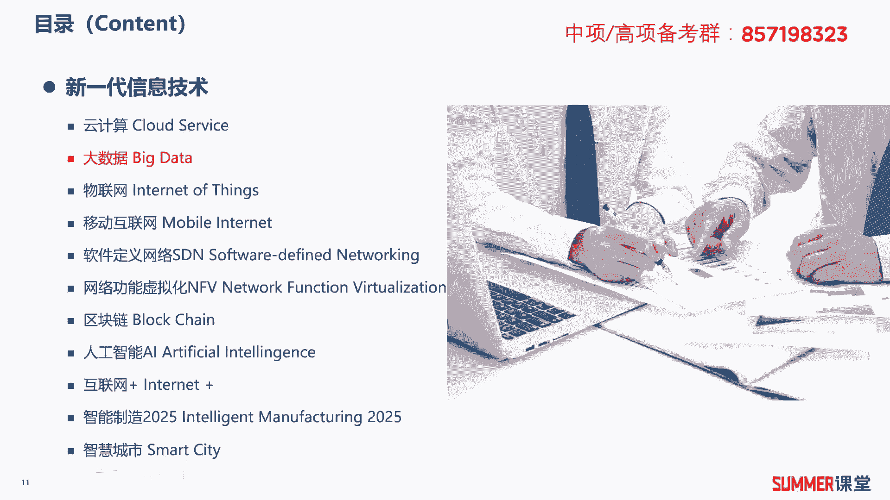
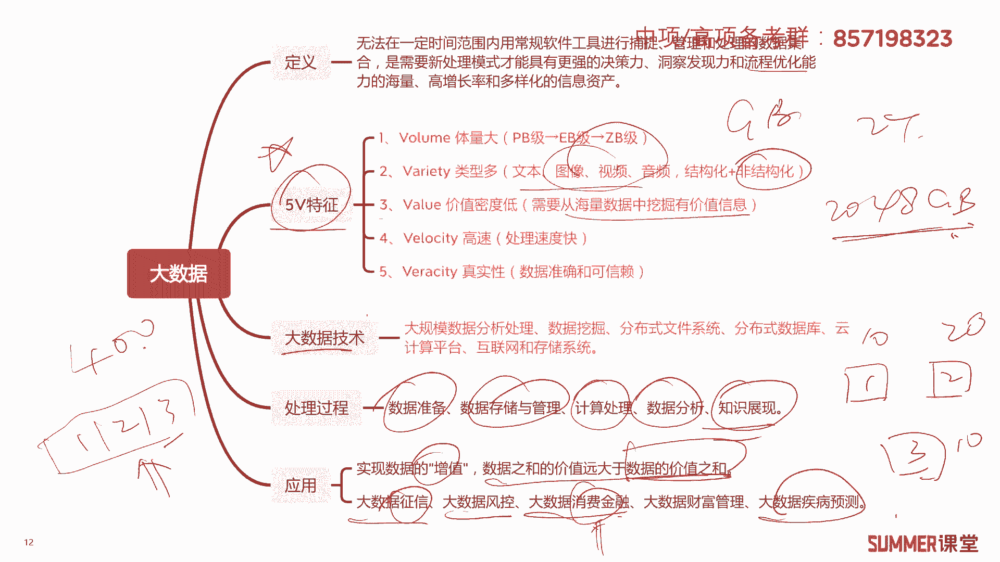
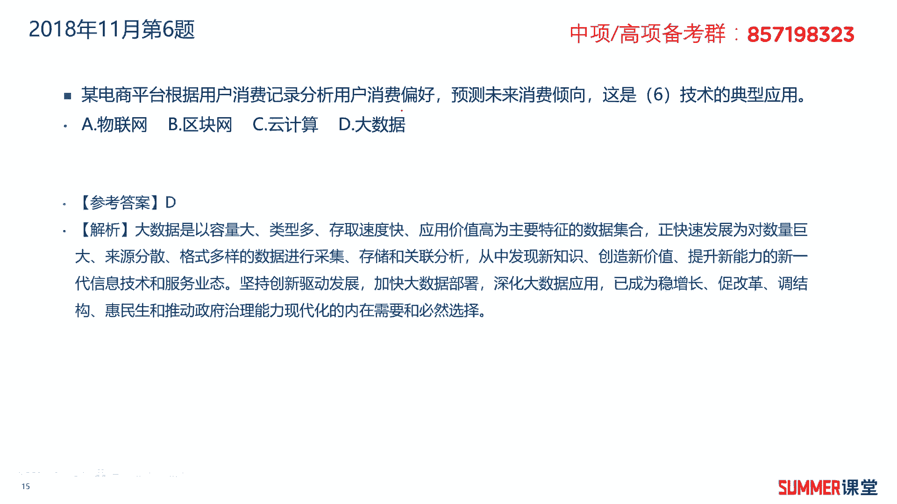
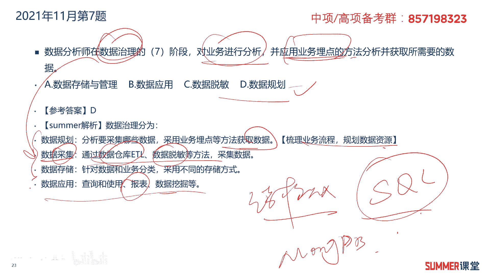
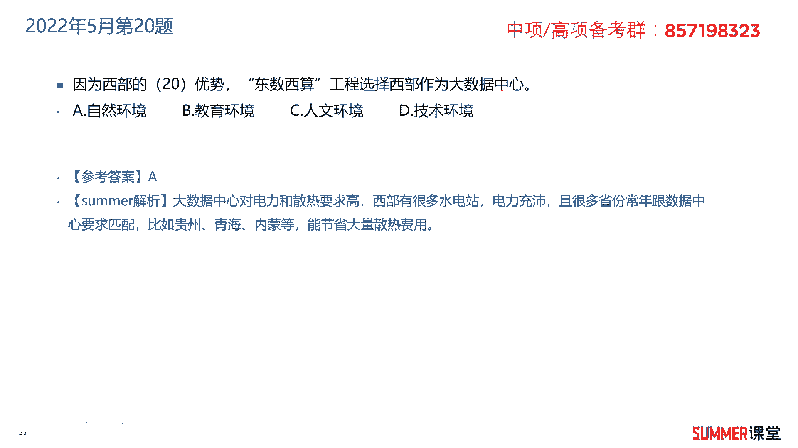

# 2023年软考信息系统项目管理师视频教程【总结到位，清晰易懂】-软考高项培训视频 - P16：1-3-2 大数据 - summer课堂 - BV1wM4y1Z7ny

首先看一下大数据的定义，它是指无法在一定时间内用常规软件进行捕捉，管理和处理的数据集合，是需要新型处理模式才具有更强的决策力，洞察发现力和优化和流程优化能力的，海量高增长率和多样化的信息资产啊。

这句话很长啊，啊读起来反正有点绕，看一看就行了，关键在什么，关键在下面，大数据的特点，它有5v的特征，这是核心知识点，希望大家一定要理解性记忆，第一个体量大，大数据的级别。

我们可能一般人用的级别的话都是gb嘛啊，比如说你的硬盘啊，大不了两个t是吧，两个t的话就是2048gb嘛对吧，他的单位还是比较小的，你看大大数据的话，一般都是p b1 b z b级别啊。

1p b是等于1024tb的，然后一个1b又等于1024啊pv啊，所以它的体量是比较大的，第二个类型比较多，我们现在的数据是不是多种多样的啊，有文本图像，视频，音频啊等等，有结构化的，也有非结构化的。

什么叫结构化的，就我们通过表格能够表示出来的，这种基本上就是结构化的啊，比如说典型的数据库是吧，非结构化的，像音频视频图片，这些都是非结构化的，第三是value是这个5v的话。

就五个单词哈啊value就价值密度比较低，我们需要从海量的数据中要挖掘有价值的信息，所以就诞生了数据挖掘，第四个叫高速啊，就是我们处理的速度要比较快，第五真实性要保证数据准确可信呐。

这是关于大数据的5v特性，希望你把它作为一个重点的知识点，一定要掌握，多看一看5a是指的哪五位，然后大数据技术，大数据老师，包括大数据技术，包括大数据的分析，挖数据挖掘，分布式文件系统。

然后分布式数据库，云计算平台啊，互联网存储技术等等啊，大数据的技术涉及面很广，我们常规的各种各样的技术，都可以被用在大数据里面，但是最核心的哈，大数据最核心的也是一个分布式的思想，分布式处理。

分布式处理，然后还可以借助云平台去处理处理的过程，包含数据的准备，数据存储与管理，然后计算处理数据分析和知识的展现，最后我就通过表格或者是图形化的方式，把分析的结果给你呈现出来，这大数据处理的过程。

了解大数据的应用啊，应用非常广，泛，它主要是实现数据的增值，数据之和的价值远大于数据的价值之和，什么意思啊，就是一个数据和另外一个数据，我们四个数据吧，那三个吧，别整那么多，三个数据，123。

数据一值十块钱，数据二值20块钱，数据三值十块钱，他们三个价值是多少钱，价值40块钱对吧，如果我能把这三个给你整合起来，123，那我们对它进行分析，它的价值就远不止40块钱，那可能他就值400块钱。

这就叫数据之和的价值远大于数据的价值之和，明白大概就这个意思好吧，经常被用于大用，在征信里面，然后风控啊，大数据的消费消费金融，消费金融啊，比如说现在有很多贷款，对不对。

他怎么知道你你这个人能带你多少钱，你的风险承受能力怎么样，大数据分析是不是你的很多账号，你的很多信息其实在网上爬虫，各种都能找得到啊，除非你不上网，除非你不上网，还有大数据的财富管理。

大数据的疾病预测啊等等啊，了解啊，这一页最关键的是什么，最关键的就是大数据的五维特性，然后大数据这些技术了解一下啊。

了解一下好吧，我们来看练习题，2018年11月的第六题，某电商平台根据用户消费记录，分析用户的消费偏好，预测未来的消费倾向，这是什么技术的典型应用啊，大数据是吧，这一点大家应该很熟吧。

比如说你通过某个app啊，搜索了手机之后，你会发现在网上给你推送的广告，基本上是跟手机电子产品相关的啊，这就是大数据的典型应用，分析你的消费偏好，分析你以前的浏览记录。

以前的购买记录来预测你未来的可能购买趋势。

接着看下一题，2019年5月第21题，基于买方的购买历史及行为，进行针对性的广告推送，是典型的什么应用，大数据应用啊，不需要多说了吧，2021年5月的第七题，关于大数据的特点，正确的是哪一个。

数据体量大，数据处理速度快，数据价值迷密度高，价值密度是很低的，因为它的量很大，我们要从量量很大的数据当中去挖掘，有价值的信息是吧，ok所以价值密度是很低的啊，要保证数据的真实结构化数据为主。

错的大数据的种类非常多，其实是以非结构化数据为主，音视频等等这一类的数据会占比更多，所以这道题选择124124，选择c答案啊，五位特性哦，这是重点，多花时间啊，记忆一下，就是2021年5月的第15题。

证券领域信息系统对数据存储量的要求较高，它的平均数据存储量在什么级别，这什么级别，这道题简直送分题，我跟你讲存储量很大了是吧，肯定不是招啊，我们现在个人的硬盘都是gb了啊，tb呢移动硬盘啊。

像我买了一个移动硬盘是两个tb的啊，买了一个我台式机买了一个固态硬盘，不是固态硬盘，买了个机械硬盘是四tb的，所以我个人的数据量都已经到达tb了，那肯定不选tb呗，那比tb更牛逼的就pb了是吧。

稍微记一下证券领域它的数据量到了pb级别，所以这道题选择d答案，2021年11月的第七题，数据分析师在数据治理的什么阶段，对业务进行分析，并应用业务买点的方法，分析并获取所需要的数据，业务买点是什么。

就是在网页或者是在某个应用上啊，买一些点去分析用户访问这个页面的频次，以及在这个页面停留的时间等等啊，去获得一些数据嘛，ok啊，其实数据治理啊它是分为四个阶段的，分别是规划采集，存储和应用这么四个阶段。

规划阶段主要就是梳理业务流程，然后规划数据资源，说简单一点就是分析我们要采集哪些数据是吧，分析要采集哪些数据，然后通过业务买点的方式去获取这些数据，就是你要采哪些数据啊，怎么去获取是吧啊，怎么去获取。

那么这里面描述的对业务进行分析，并采用业务买点的方法啊，然后获取数据，那肯定就是数据规划了啊，你要想要哪些数据，并且通过什么方式去去拿，这叫数据的规划，然后第二阶段叫数据采集。

就是我们通过一些技术把把数据采过来，常用的技术，数据仓库etl，然后数据的透明，这些都是采集技术，那存储应该就很好理解了，不同的数据，我们可能采用的采用的存储方式不一样，比如说你是结构化的。

结构化的数据，我们可能就是用这种circle，用数据库来来来存嘛是吧，什么oracle mysql这种，那非结构化的我们可能要用一些大数据的啊，这个存储平台，或者是或者是什么芒果db。

芒果tv这一类的数据库来存啊，数据的应用啊，就根据你的实际需求啊去做开发，然后输出相应的报表或者数据挖掘的结果，所以这道题选择d答案，大家需要掌握一下，就属于智力的啊，这么几个阶段，数据治理的几个阶段。

2022年5月的第20题，因为西部的什么优势，东数西算工程选择西部作为大数据中心，西部有什么优势啊，自然环境优势啊，因为大数据中心它是耗电的耗电大户是吧，另外啊另外他对环境的要求比较高。

特别是对环境的哪个要求，哪个指标，环境的温度要求比较高，所以我们国家的，目前很多大数据中心是建在什么地方的，现在贵阳比较多，贵阳全年平均温度26摄氏度，这个温度是比较适宜的啊，太高太低都不太合适啊。

你说现在三亚大数据中心其实温度就太高了啊，现在东北黑龙江温度就太低了是吧啊，一定要保持我们的温度平衡嘛，所以贵阳这个温度是比较合适的，还有现在哪些地方比较多啊，四川四川也会有大量的数据中心啊，为什么。

因为四川电力充沛，电力充沛，还有建在我看内蒙，我们国家哈大数据中心目前建在内蒙诶，内蒙的蒙内蒙和青海啊，这些都有啊，西部自然环境啊，第一个它有充沛的电力，第二个环境温度哈。

有几个省是比较适合见证大数据中心的，这个要理解，理解了之后就很好选了是吧。

