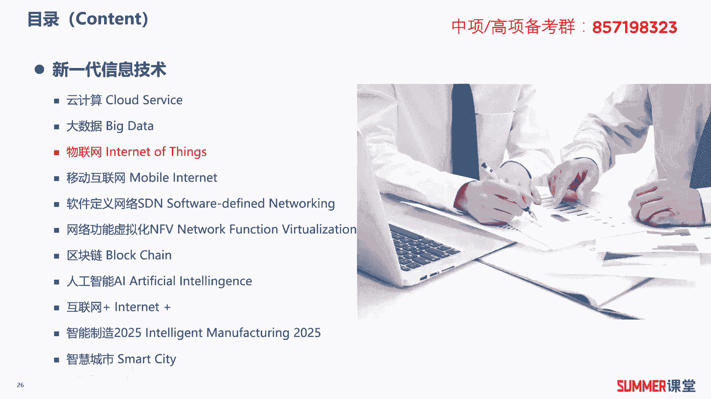
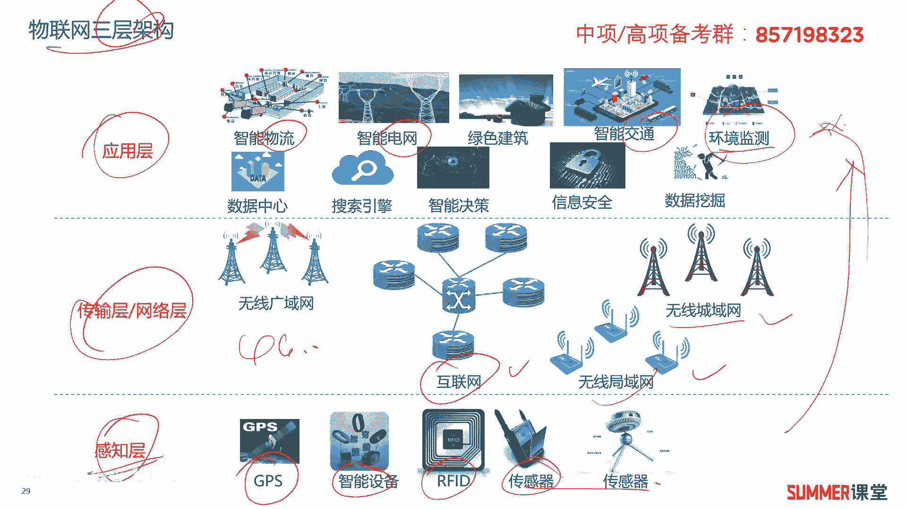
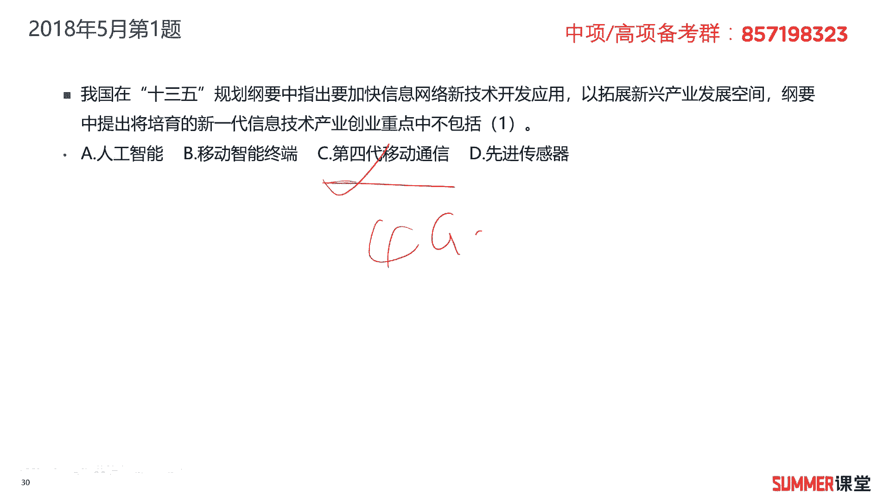
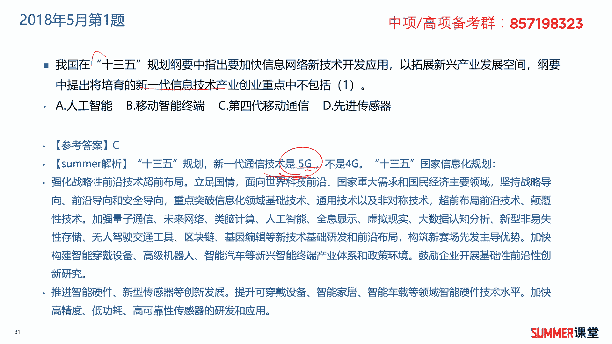
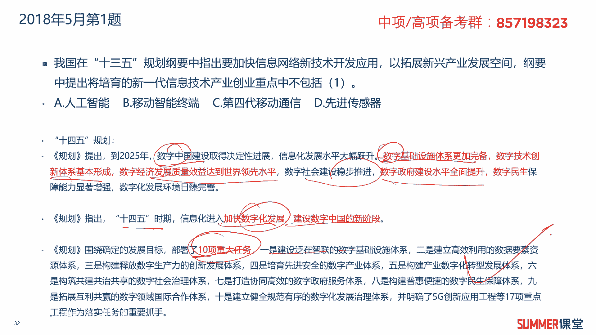
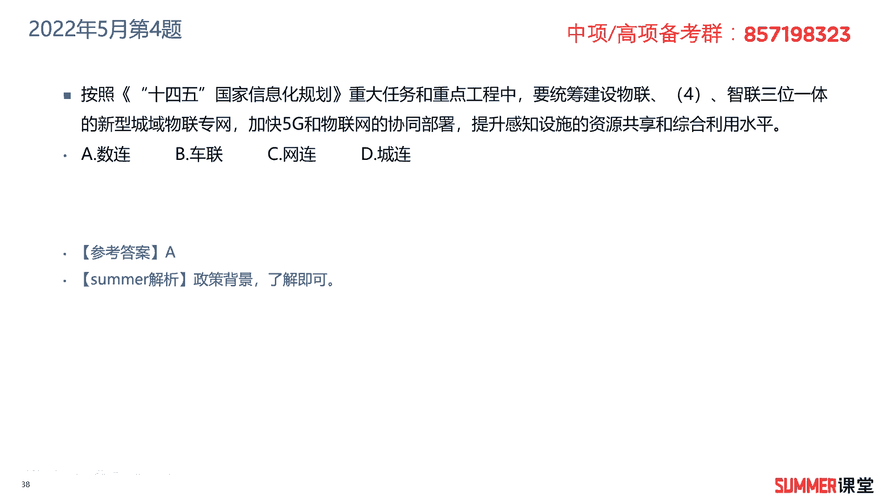

# 2023年软考信息系统项目管理师视频教程【总结到位，清晰易懂】-软考高项培训视频 - P17：1-3-3 物联网 - summer课堂 - BV1wM4y1Z7ny

我们接着来学习物联网，首先来看一下物联网的定义，物联网是通过信息传感设备，也就前端的传感器，然后按照约定的物联网协议，将前端传感器采集到的信息传给我们的后端，传给后端的服务器啊，从而实现相应的功能。

这是简单的理解啊，当然按照官方的定义，我们来看一下，他按照约定的协议，将任何物品与互联网相连接，进行信息交换和通信，以实现智能化的识别定位，跟踪监控和管理的一种网络，了解一下定义和概念啊。

总体来讲不是特别重要啊，重要的在后面标红的这句话，在物联网应用中有两项关键技术，分别是传感器技术和嵌入式技术啊，至于什么是传感器，什么是嵌入式啊，如果你有网络基础或者是有i t基础的。

应该或多或少有一定的了解，比如说在机房里边，我们经常用传感器去检测机房的温度湿度，还有机房有没有漏水，有没有啊，有没有火灾，火灾通过什么来监控啊，通过烟感传感器嘛是吧啊，这就是传感器嘛啊，传感器技术。

嵌入式技术，如果你大学期间搞过单片机，相应的开发，应该也会有了解啊，它主要就是一些小系统的开发啊，比如说一个系统它底层的啊，它底层的操作，这个操作系统可能就只有16k啊，这种基础的操作系统。

然后我们写的代码啊可能只有几十行，几百行，他这种小量的开发，它的体积比较小啊，所以比较省电是吧，所以比较沉淀啊，了解一下哈，这两个技术把它作为一个记忆的知识点，把它作为一个记忆的知识点，一定要知道。

然后接着是物联网典型的三层架构，核心知识点必须要掌握，必须要会的，拿三层，分别是感知层，网络层，有些时候也叫传输层，最上层是应用层，物联网的三层作为记忆的知识点，一定要掌握哦。

啊感知层由各种传感器构成啊，包括温湿度传感器，二维码的标签，然后r f i d的标签和读写器啊，摄像头啊，gps的感知终端啊，这些都是前端的感知层，它是物联网识别物体采集信息的来源，作为一个重点啊。

这是物联网识别物体采集信息的来源，在我们的感知层里边有一种非常重要的技术，叫rfid射频识别，它是物联网中使用的一种传感器技术，通过无线电信号识别特定目标，并读写相关的数据，而无需识别系统。

与特定目标之间建立机械或者光学的接触，有一个技术大家应该都比较熟，就是我们开车都会都会用到的，叫叫什么呢，就是etc啊，etc就是你过收费站的时候不用停下来，自动给你扣费吗啊，etc他用的是什么。

就是用的r f i d射频识别技术，在你的车上放一张卡，然后这张卡会跟我们的啊，会给我们的这个收费站道闸那的一个呃，r f i d的一个读取设备啊，去交互啊，最终读取你的行程，然后进行相应的扣费。

明白r f i d用的很多啊，包括我们住酒店会刷房卡，房卡用的什么技术啊，也是阿f i d技术，好吧啊，这个r f i d技术的应用，希望大家要知道它是属于物联网的感知层，这个技术很重要哦。

很多考试都会涉及啊，不仅我们的高校设计啊，如果你要考通信工程师，通信工程师，互联网里面，他讲物联网，依旧会把r f i d作为一个重点来讲，所以很重要很重要，这也是我们考过的哈，然后第二层啊。

往上面的一层叫网络层或者传输层，就是你你在感知层把数据采集到之后，我们要通过网络传给后台的应用平台是吧，所以中间会有网络层，它是由各种各样的网络来组成，包括广域网，然后网络管理系统，云平台等等啊等等。

这是整个物联网的中枢，负责传递和处理感知层获取的信息，中间网络层上面就是应用折痕，这是物联网和用户的接口，它与行业需求相结合，实现物联网智能的应用，说白了上面就是一些app啊，实现你想要的功能对吧。

ok啊，举个简单例子，其实滴滴也可以看成一个物联网的应用，滴滴也可以看成物联网的应用，就是在你前端是什么，前端是你手机，手机通过里边的gps去定位用户的位置是吧，定位用户的位置之后。

你要把相应的信息通过网络，你的4g5 g网络传给滴滴后台的啊，服务器嘛是吧，后台相当于是有些应用，然后从而从而实现实现用户打车的这个过程啊，其实它也是一种物联网的应用，ok好ok物联网的应用相当广。

比如说智能电网，智慧物流，智能家居，智能交通，智慧农业，环境保护，医疗健康啊等等等等啊，用的非常多啊，自己看一下就行了，物联网的关键在哪，这里面有一句话，然后中间的三层结构，这是它的核心啊。

其他的简单看一下啊。

其他的简单看一下好，我们接着来给大家去看一下，物联网的三层架构啊，通过一张图更形象的来给大家去展示，比如感知层前端的感知设备，我们可能是通过gps去感知的，还有一些智能可穿戴设备r f i d。

各种各样的传感器是吧，来采集数据嘛，收集相关的数据，收集到数据之后，我们通过网络传给后台，网络也有很多，你通过wifi可以通过运营商的什么成语网，通过互联网有限的网络。

还有一些通过这个什么基站都没有问题啊，反正你能通过一个网络，把你踩的数据传给后台啊，传给后台啊，后台就是相应的一些应用喽对吧，各种各样的基于不同行业的一些应用，比如说一在交通行业，在物流行业。

在电网啊啊，在环境监测啊，典型的像我们在环境监测，灾害监测里面用物联网也用了很多的啊，就是我们在河里面给它撒很多，传感知层的传感器嘛对吧，来监测水位，如果上游发现a发洪灾了，是不是这些传感器。

它会他会把收集到的这个水的一些信息给你，传到通过网络传到后台啊，你后台是不是就可以监测，可以报警的呀，那报警的你下游该疏散的就疏散吗，啊不至于你你是你发生的这个洪灾，还不知道什么情况是吧。

这就是典型的物联网的应用啊，其实在行业里面应用的挺广的啊。

在行业里面听应用的挺广，ok我们来看一下啊，练习题，2018年5月的第一题，我国在13 五规划纲要当中指出，要加快信息网络新技术开发应用，以拓展新兴产业发展空间，纲要中提出，将培育新一代信息技术产业。

创业重点中不包括哪一个，a人工智能，b移动智能终端，c第四代移动通信d先进传感器，不包括c第四代也就4g通信，因为因为13 五的时候已经到了5g阶段了啊。

他提出的新一代技术，应该是5g作为了解的知识点，当然如果现在考的话，一般一般来讲是不会考13 五了啊。

因为现在已经是14 五规划了对吧，所以针对14 五规划提到了的一些内容，大家需要注意一下，考试是可能考到你的，我简单给大家去看一下哈，14 五规划当中提出，到2025年，数字中国建设取得决定性的进展。

信息化化的发展水平大幅跃升，数字基础设施体系更加完备，数字技术创新体系基本形成，数字社会建设稳步推进，数字政府建设水平全面提升，数字民生保障能力显著增强，数字化发展环境日趋完善。

所以关键词是什么数字化嘛对吧，什么数字基础设施，数字政府，数字中国就是数字化，现在很多企业不是在提数字化转型吗，那本质来源于哪，或者它的数字化，这个词来源于我们国家的14 五规划纲要明白，所以很重要哦。

里面还提出了到14 57，信息化进入加快数字化发展，然后建设数字中国的新阶段，里边啊部署了十大重要任务啊，是他重要任务，这十大重要任务大家读一读哈，我就不给大家一个一个读了下来啊，自己看一下。

这种考试是比较容易考到的啊。

最新的政策最新的政策，ok我们接着来看下一题，物联网应用技术当中两项关键技术分别是什么，让大家作为记忆的知识点，分别是传感器技术和嵌入式技术，所以这道题选择b答案，2019年5月的第一题。

rfid射频技术应用于物联网的哪一个层次，运用于物联网的感知层，而且你还要知道我们生活中的etc，还有凡卡酒店的房卡都是用的rfid技术，以后给你举个这种实际的例子出来，给你描述一通，显得特别高大上。

比如说我给你描述etc，他可能给你描述特别特别特别多的一些，专业术语出来，反正最后让你选的时候，你要知道这是考你的物联网，而且它应用的是rfi d技术，明白好吧，这个要知道啊，接着来看下一题。

2022年5月的第四题，按照14 五国家信息化规划，重大任务和重点工程当中，要统筹建设物联，什么智联三位一体的新型城域物联专网，加快5g和物联网的协同发展，提升感知设施的是资源共享和综合利用水平。

14 五规划，我给大家提的一个关键词叫什么叫数字化呀，啊如果你知道了它的关键词是数字化，那么肯定5年数年嘛对吧。

