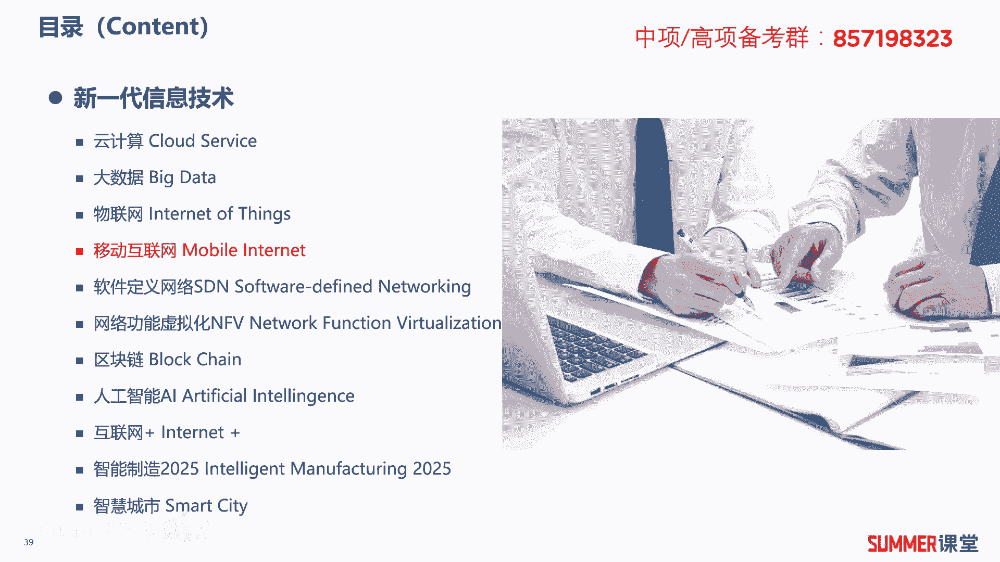
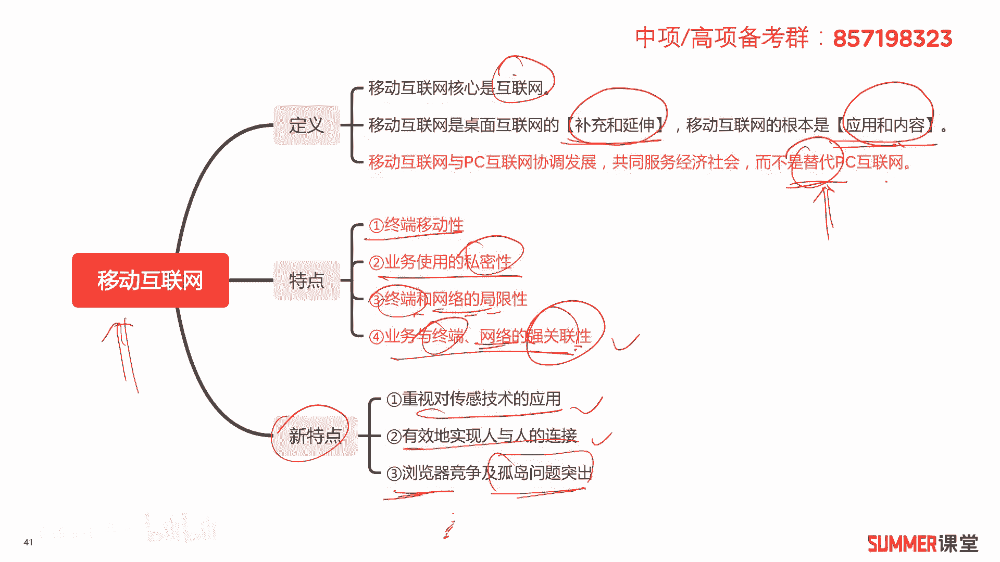
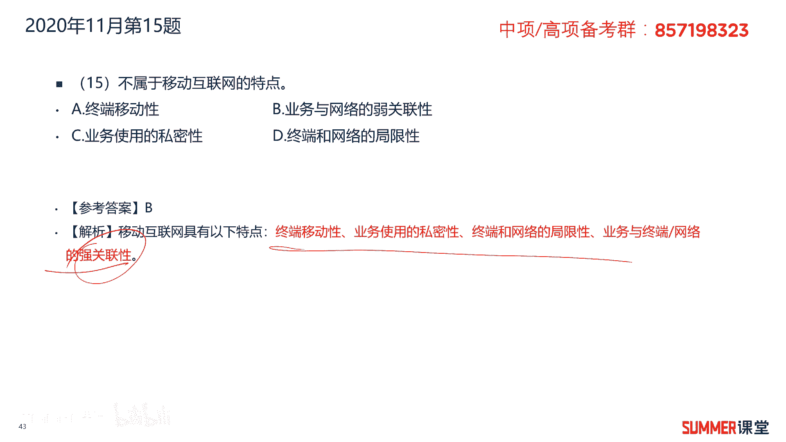
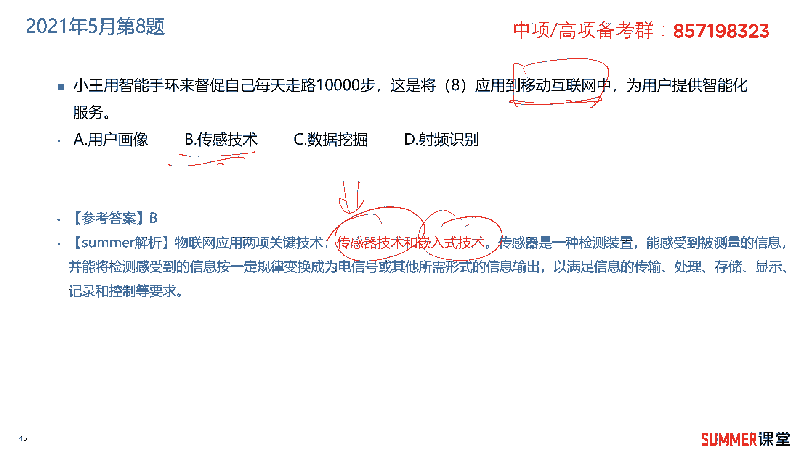

# 2023年软考信息系统项目管理师视频教程【总结到位，清晰易懂】-软考高项培训视频 - P18：1-3-4 移动互联网 - summer课堂 - BV1wM4y1Z7ny

我们接着学习移动互联网，首先来看一下移动互联网的定义，移动互联网的核心是互联网，而不是前面的移动，移动互联网是桌面互联网的补充和延伸，它的根本是应用和内容，这两个需要注意一下。

移动互联网与pc互联网协调发展，共同服务经济社会，而不是pc互联网的替代物，对啊他不是要替代我们传统的互联网，它只是作为传统互联网的补充，跟传统的pc互联网相辅相成的，明白啊，这一点需要注意考过的。

接着移动互联网，它有四个特点，分别是终端的移动性，很好理解，你的手机可以拿着到处跑，第二个业务使用的私密性，你通过手机去访问了什么东西，这个对其他人来讲是不可见的，是比较私密的，第三终端和网络的局限性。

就比如说你你要通过移动互联网去访问，你不可能用就不能用电脑了吗，啊你这个终端要支持4g或者支持wifi对吧啊，这是终端和网络的局限性，第四业务与终端网络的强关联性，第四点我觉得是特别不好理解的啊。

我们通过手机去访问某个业务，跟终端强相关吗，换个终端不行，跟网络强相关吗，你必须要用5g，用4g或者wifi不行，反正我觉得这理解起来就有问题是吧，但是考考试是考过这句话的，书上就这么写的。

书上这么写的，你就就这么热，业务与终端与网络都是强关联的好吧，反正我觉得解释不太通哈，你记住就行了，考试考过，然后新的特点呢，移动互联网还有几个新的特点，重视对传感技术的应用。

有效地实现人与人之间的连接啊，比如说现在的微信啊，现在的一系列的啊，这种聊天软件，是不是能够实现人和人之间的连接吗，然后第三浏览器竞争以及孤岛问题突出，浏览器竞争，这个又又不知道他是从哪抄的啊。

啊我去我去开翻了一下啊，反正我觉得移动互联网跟什么浏览器竞争，有毛关系啊，啊什么360qq各种各样的浏览器，那竞争会会是我们移动互联网的特点吗，移动互联网是不是现在普遍的都是用a p p啊。

浏览器你你打开的多吗，打开的不多是吧，孤岛问题，这个倒是存在什么叫孤岛问题，比如说你支付宝的钱能不能直接转到微信里面，转转不了，那这就是典型的孤岛问题嘛是吧，那这个问题是存在的啊。

在国内其实很多很多互联网公司就两大派，要么阿里系，要么要么这个腾讯集是吧，他们两派之间是会存在一些孤岛问题啊，这玩意儿好理解啊，前面的反正我也理解不了啊，没关系哈，理解不了，你把它给记住啊。

像这种东西他也是从各个地方到处去抄啊，抄下来之后就五花八门的，乌克八门的我们也没有必要去深究了，把它作为一个记忆的知识点啊，多读一读啊，不用死记硬背好吧。

关于移动互联网，就这点东西接着来看啊，两道练习题，2020年11月的第15题，它什么不属于移动互联网的特点，终端的移动性，肯定属于业务和网络的弱关联系吗，强关联性是吧，反正我觉得在实际的应用中。

业务跟网络应该是弱关联的，我觉得在实际应用中应该是没有问题的是吧，比如说你以12306，你访问这个业务，他他他就买票嘛是吧，买票你手机你用wifi还是用4g5 g有影响吗，有没有影响。

严格意义上来讲没影响没影响，就是弱关联啊，那应该是对的呀，但是他是错的，为什么，因为书上写的他是强关联，你就按照强关联去理解好吧，所以这里面需要注意，业务使用的私密性肯定没有问题。

终端和网络的局限性也没有问题，所以这道题选择b答案，选择b答案啊，书上就这么写的啊，就按照这么来就行了。

接着2021年5月的第八题，小王用智能手环来督促自己每天要走1万步，这是将什么应用到移动互联网当中，为用户提供智能化的服务，叫什么什么技术啊，肯定是传感器技术了对吧，感知用户一天走了多少步嘛啊。

其实你本质就是你的手机里面，或者你的手环里面内置了一个啊感应器嘛是吧，现在手机都带这个功能，也可以通过智能手环来实现，所以这道题选择b答案，这道题本质还是考物联网对吧啊，考虑互联网。

考互联网当中的这个关键技术，传感器技术和嵌入式，这里面很明显就是传感器技术嘛是吧，本质上是靠互联网。

