# 2023年软考信息系统项目管理师视频教程【总结到位，清晰易懂】-软考高项培训视频 - P1：01 信息系统项目管理师备考指南 - summer课堂 - BV1wM4y1Z7ny

ok啊今天是我们高校的第一次课哈，啊今天主要讲备考指南啊，主要是给大家去分享这门考试的啊，一些呃方法和注意一点啊。

注意一点，然后简单的做一个自我介绍啊，以前老学员可能知道哈，新学员简单了解一下吧，其实我在啊厂商啊干了啊不少年，所以项目经验这块应该算比较丰富啊，也考过各种各样的证书啊，其中有三个证是跟项目管理相关的。

第一个是偏僻啊，这是国外的一个项目管理的证书，然后一件里面有个工程项目管理啊，有一门课程，然后高项啊，这也是项目管理啊，所以我觉得我的课程啊应该来讲啊，不会那么枯燥啊，我会结合一些时间来给大家去讲啊。

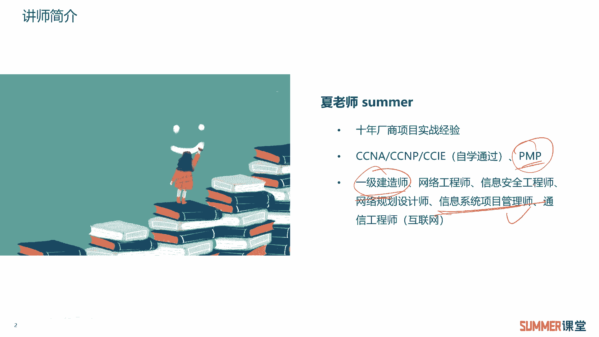

这是一些啊证书啊，大家可以参考一下啊，一键，然后高像以及啊p p啊，这三个是跟项目管理息息相关的啊，其他还有一些比如说像啊通信啊，像什么信息安全啊，网规啊啊这个证书也没列全哈，供大家参考啊，供大家参考。

好，我们今天的内容主要分成三块，第一块是软考证书的啊作用啊，以及软考证书的一个基本情况，然后第二块是我们今天核心内容就是高项啊，这个信息系统项目管理师简称高校哈，他具体考哪些内容啊。

我们应该怎么去准备啊，最后是大家常见的一些问题来进行答疑啊，前面经过简单的调研，其实也有不少人啊，没有听过我以前讲的背靠自然啊，虽然呃呃没没有听过这个软考证书的作用。

哈哈虽然这个东西我已经连续讲过好几次了，但是考虑到其实有不少新人啊，我还是给大家梳理一下啊。

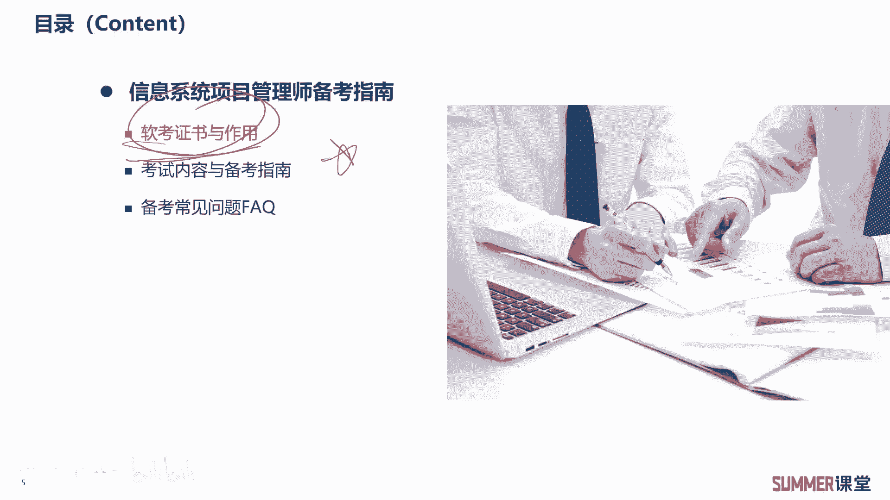

还是给大家梳理一下啊，首先啊软考它的全称是什么，全称是计算机技术和软件，专业技术资格水平考试啊，我们抽一个关键字出来啊，就计算机和软件的考试啊，再简单一点就是软件的考试是吧，简称软考。

它是由两个部门组织的，这两个部门，你看最后证书是落款到有这两个部门的章的啊，这个证书就是国家的权威证书啊，其他的有些你看似一些什么啊，培训中心或者是某某什么呃，这个这个呃人才中心啊，什么培训网啊。

他的这个章不带国徽的啊，肯定就没有这么权威o啊。

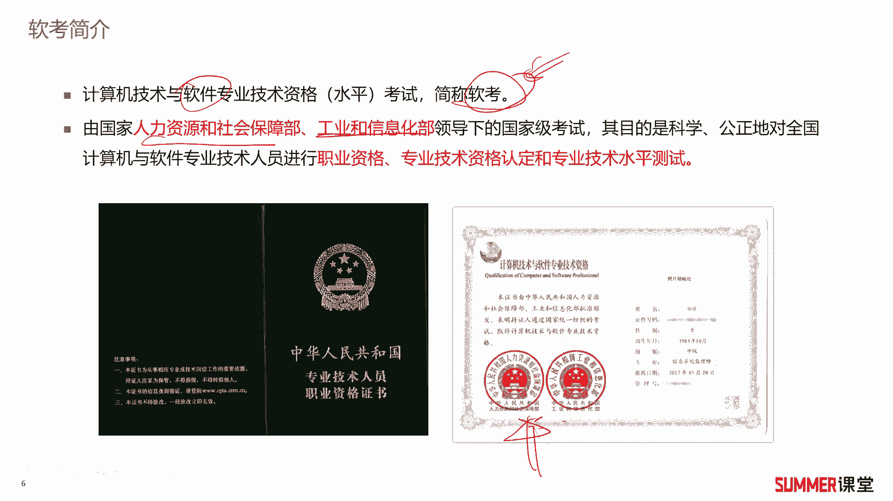

所以这是由国家去背书的一个证书，好吧啊，考试的说明啊，他是能够实现国际的互认啊，中日韩三国互认，因为软考最终啊最早起源于日本啊，我们引进过来的报名对象啊，与条件啊没有限制，但是每次只能报考一个科目啊。

这一点就比较人性化了，如果你要考通信工程师啊，要考通信工程师，他要要求你的专业跟通信相关，或者是跟计算机相关是吧，还要有工作年限啊，还要有工作年限啊，还要审核你有单位的什么社保。

带了个你确保你在这个单位上班啊，有些地方会审核啊，但是呃打绝大部分分地方一般就省这两个东西，你的大学专业，如果你大学是学文科的啊，学什么电子式电子商务，其实还好，如果是学什么语言英语的，那么对不起。

你考不了，那绝对考不了是吧，通信工程师会所啊，比如说一级建造师一样的呀，也是会审理的专业以及工作年限的，而我们这个考试啊没有限制，其实这一点就很人性化，你知道吗啊我后面会讲啊。

证书的作用有些考证它是为了什么，为了落户的啊，为了落户啊，会有很多宝妈去考我们的软考证书啊，特别是项目管理这种，它又是软考证书里面相对而言不是那么专业，或者对专业要求不高，偏文科的一个考试啊。

合格标准与通过率满分都是75分啊，75分高校是考三门，每门达到75，然后才能通过，中级通过率大概在10%左右，高级的通过率在10%到20啊，其中有一个比较特殊，往归会难一点。

网归很多地方是个位数的通过率啊，它的通过率是个位数啊，我们的高效啊基本上是在15%左右啊，通过率15%，证书长期有效，永不过期，无无需再认证啊，我就觉得这一点就就比较实用了，你考一个证跟随你一生啊是吧。

以后有什么福利或者是有什么政策，你都可以享受得到啊，报考的时间啊，高校啊，高校每年考两次，分别是在5月和11月，这两次考试报名是，一般是在开考前两个月就要开始报名，报名的方式，网上报名网上报名。

报名的网址是这，一般来讲绝大部分省份都是70块钱一颗啊，像高级考三科，你考试费就210块钱，200多块钱吗是吧，应该还是能够接受的，无论你考一个厂商的初级啊，厂商认证初级1000多，中级3000啊。

考华为的哈，然后高级考试费的话1万块钱对吧啊，所以国家这个考试还是还是比较实用的啊，性价比很高啊，性价比很高，甚至有些厂有些省份他不收考试费啊，我记得很清楚辽宁哈啊辽宁考试费是零啊。

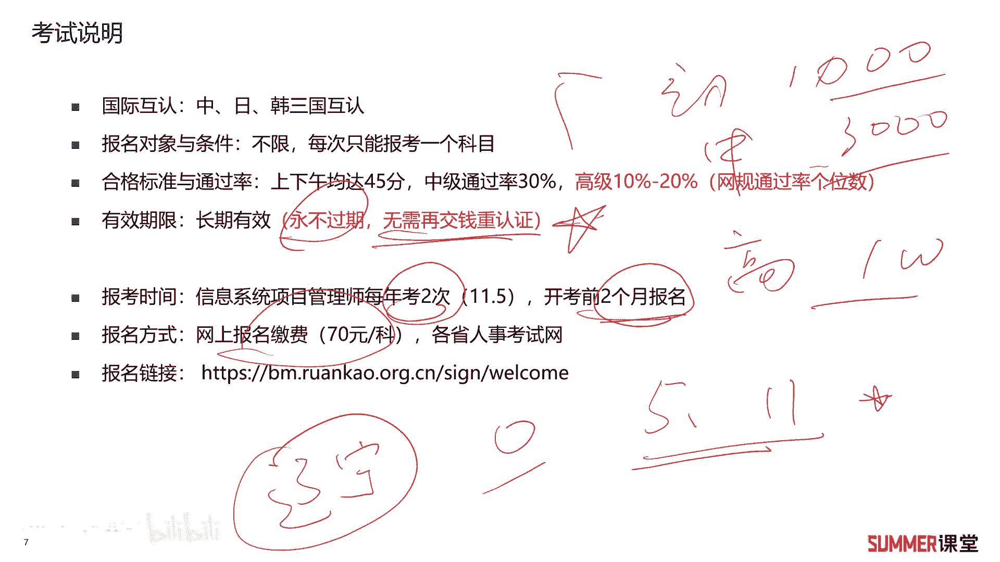

这就这意思嘛就更好了呗，哈不交钱嘛啊，软考的方向啊，以等级这里面做了一个梳理，首先分成三个等级，初级中级和高级啊，初级考的人很少，你可以把它忽略掉啊，一般我们都是考中级和高级啊，其中它又分成了五个方向。

软件网络应用技术，信息系统和信息服务，如果你是程序员，那肯定考软件方向呗对吧，如果你是说网络的主要考这个方向，而你既不是做软件，也不是做网络，有可能你还不是科班出身，你是学文的，那考什么。

那肯定是考信息系统啊，信息系统特别是高校和中向这两个，这两个偏文科啊，偏文科，记忆的东西会多一些啊，记忆的东西会多一些啊，目前我们有的辅导的话是有四个啊，其中啊网归网工。

信息安全工程师和信息系统项目管理师啊，这四个辅导，而我们今天讲的内容啊，就是它高尚啊，高尚好。

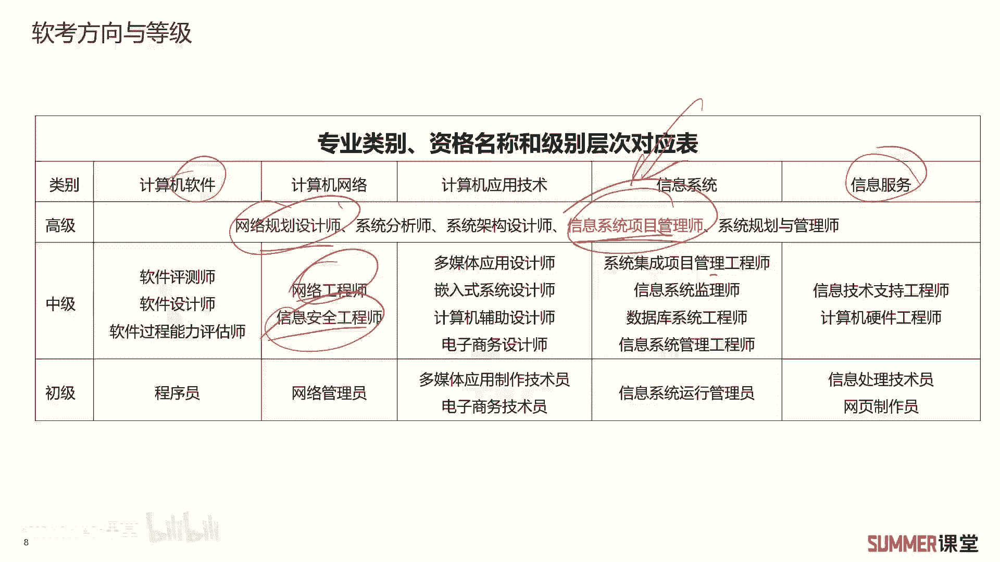

接着软考证书的作用，这里面总结了五点哈，第一个是职称，第二个你可以凭软考证书去申请进入专家库，成为评标专家，第三是项目的控标啊，特别是在乙方啊，乙方你们要做项目嘛，对吧啊，要招投标啊。

怎么去做项目的控制呢，待会我会讲啊，啊待会我会给大家细讲啊，这是项目控标啊，第四积分落户啊，或者有些地方直接叫职称落户啊，供小孩上学或者是买房，在很多城市比较适用，上海广州深圳天津啊，比如成都杭州等等。

其实有很多城市都是适用的啊，大家可以关注啊啊第五个人事补贴，个税减免，还有一些人才补贴，还有地方有人才补贴啊，包括免费的这个人才公寓啊等等，你怎么证明自己是个人才啊，啊我有高级职称啊。

你可以看一下各个省的针对人才的认定哈，高级职称是在里面的对吧，而高像就是一个高级职称好，这五点哈我们分别啊展开一下啊。

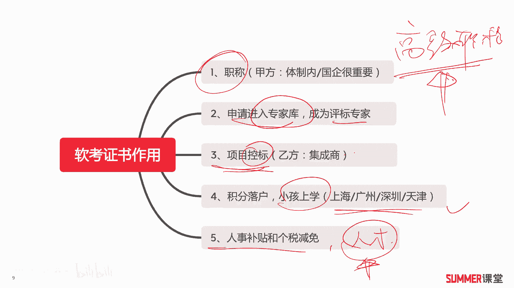

第一个啊评职称啊，评职称评职称就跟你去医院挂号一样啊，你挂个专家号是不是要贵一点，挂一个专家号是不是要贵一些啊，他的专家就是这个医生的一个职称吗，我们搞it的一样啊，你要你要有要进行等级的一个上升。

然后升职加薪嘛是吧，这个职称是跟你的啊，跟你的待遇相关的啊，当然体制内和事业单位职称啊，会支撑体系可能会全一点，有些私企它有自己的体系啊，他不一定要看我们这个证书啊是吧，这个看看单位哈啊。

看单位一般来讲，评职称是在体制内会更适用一些啊，会更实用一些，我们获取职称有三种方式啊，以考代评，考评结合和社会化的评审啊，以考代评，最典型的就是我们通过考试去获得职称。

也就是说你考过了这个高级这个高级的证书，就是你的职称啊，就是你的支撑啊，有些有些人说a老师不对啊，我们单位是要要要要要通过这个证书去评的呀，啊去严格意义上来讲，那个叫p啊，ping的是你的职务对吧。

其实你拿的这个证书就是你的职称，也就是说你有这个职称之后，有这个证之后，即使你没在事业单位，你在普通的民企啊，你在普通的民企，你们你们这家公司就没有相应的职称体系啊，但是你拿着这个证书依旧可以去落户。

可以去申请技术专家库，因为这个证书本质上来讲就是你个人的职称，全国通用的，而你单位聘的这个职务，这在单位内有效放到其他省，其他地方没用o啊，当然哈跟我们绝大部分相关的，可能是单位的这个职务啊。

这个给你带来的收益会大一点对吧，给你带来的收益会大一点啊，典型的软考就是以考代评的啊，就考过了相应的考试啊，就拿到支撑了，还有考评结合的，就先通过考试再组织评审啊，然后凭你的什么，凭你的业绩。

凭你的项目经验，然后还要组织一个ppt的答辩，非常典型的就是通信工程师高级啊，基本上是考评结合啊，通信工程师的高级啊，你通过考试之后还要组织答辩，组织专家评审啊，所以像这种带评的就有点麻烦啊。

带平的就有点麻烦啊，接着社会化的平手，一般会要求你的学历，你的成果专利什么，你写的书软件，著作权啊，课题啊，论文等等啊，这个东西就更复杂一些了，是不是就更复杂了啊，典型的代表什么畜牧业，林业，还有啊。

建筑业也是这么搞的啊，要有社会就社会化的评审啊，所以你要获取相应的指针，最简单的是不是就以考代评啊，通过的考试就拿了，这简不简单嘛，那肯定很简单是吧啊，职称有什么作用哈。

啊后面其实也有截图加工资嘛啊涨钱嘛。

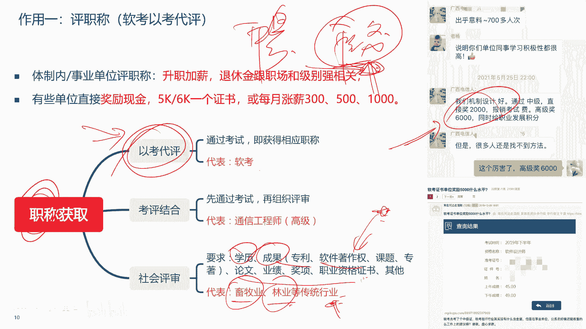

是不是以考代评，他最最早的文件是来自于国人部，2003年发的一个文件，就取得了相应的呃这个证书之后啊，就就获得了职称啊，不许不再进行单独的这个评审，这个文件供参考啊，现在依旧在沿用，依旧在沿用。

第二个作用啊，就是申请进入专家库，成为评标专家，评标专家的要求，这里面有好多项，但是最实质的最硬核的就第二项，你要有中级职称或者啊或者同等专业水平，同等专业水平，这个不好证明。

所以很多时候都是要求要有中级职称啊，并且8年工作经验或者直接有高级职称啊，直接有高级职称，当然有些省可能是要求有高级加8年啊，高级甲8年啊，不能省要求不一样啊，这是四川省的啊，四川省的。

你看其他要求大部分人都能满足吧是吧，身体健康啊，没有什么各种3年内没有什么不良行为，然后没有什么啊，这个欺诈啊等等啊，这个东西应该都都都满足，最硬核的就第二条，最硬核的就是第二条。

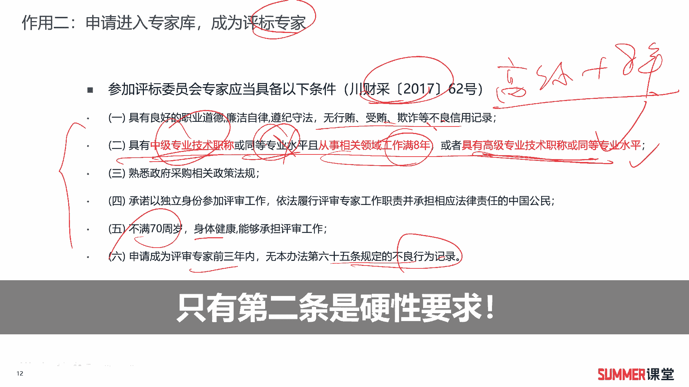

这是第二个作用，进入专家库，进入专家库成为评标专家有什么作用呢，第一个它本身是一项荣誉身份的象征对吧，接着你可以去接评标啊，可以为成为业主代表啊，去做一些需求论证啊，包括帮客户组织一些验收啊。

有一些额外的收入啊，有一些额外的收入啊，特别是大家那个以后啊，以后呃退休之后没事干的时候，你可以去干什么啊，你干这种啊啊干这种，辛辛苦苦大半天可能挣个50 100块钱，但是你吹着空调房频频标提提意见。

签个字，500块钱半天啊，这是非常常见的啊，非常常见的啊，我记得以前啊以前基本上还是400块钱半天，现在基本上涨价了哈哈500啊，这是这是最低限度哈啊最低限度高一点的啊，高一点的这个看具体的项目哈。

啊有些可能2000块钱半天啊，3000块钱半天的啊，都会有都会有是吧啊，这这是不是以后退休之后没事干的时候啊，吹着空调啊，签签字就把钱领了，那这不方便吗，所以现在也可以为以后做一些铺垫和积累。

前面提到的这几个作用哈，其实评标专家这个是要抽的，相对而言会会随机一点啊，但是你要从业主代表啊，需求论证啊，验收啊，这种这是邀请啊，这是邀请你去，那就不用抽了啊，就不用抽，如果你的圈子足够丰富啊。

你认识足够多的人，你一天是可以赶场的，什么叫赶场啊，有些评价不评价专家真的是赶场啊，一天去评三个项目啊，或者去做做五个项目的论证，这都是有的啊，所以他退休之后的工资，可能比比很多人的这个上班的工资都高。

对吧啊，真的有啊啊，而且还有不少啊，还有不少，当然这就需要圈子了哈，比如说你看这种啊，问了诶，有没有某个地方的专家，或者或者有个地方有个评，有个评审是吧啊，看来不来得及啊，这是做资格预售啊。

一天1000块钱啊，如果过夜的话，2000啊，做需求论证啊，三个人啊，信息化的专家啊，a e d大屏的专家预计两个小时啊，然后五位信息化方面的专家啊，在哪个地方做论证啊。

需求论证其实这个东西是比较简单一点的，评标可能要累一些评标，你你相当于当裁判嘛对吧，人家踢球，你要你要在那儿哈啊，要要要要去要要做这个中立的一个评判，但其他的论证的话，这些就看自己的这个积累了。

就提提意见啊，那你回去稍微调一下，改一下怎么样的啊。

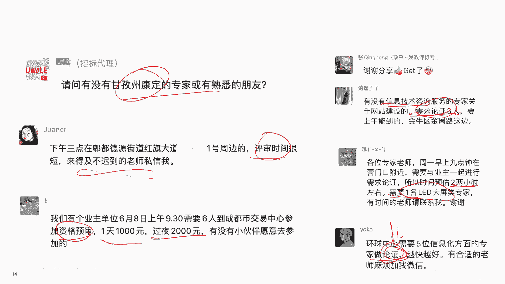

ok这是评标专家的啊一个作用哈，啊当然啊专家还是有一定权利的，我们要坚守底线，坚守底线，不要干一些啊乱纪的事情是吧啊，甚至是违法的事情，看这个啊这个项目啊，这就这就有点那个了啊，收起不正当利益。

四五万元到行政处罚啊，5万啊，最后禁止参加以后的评审活动了啊，这个哥们收了30万啊。

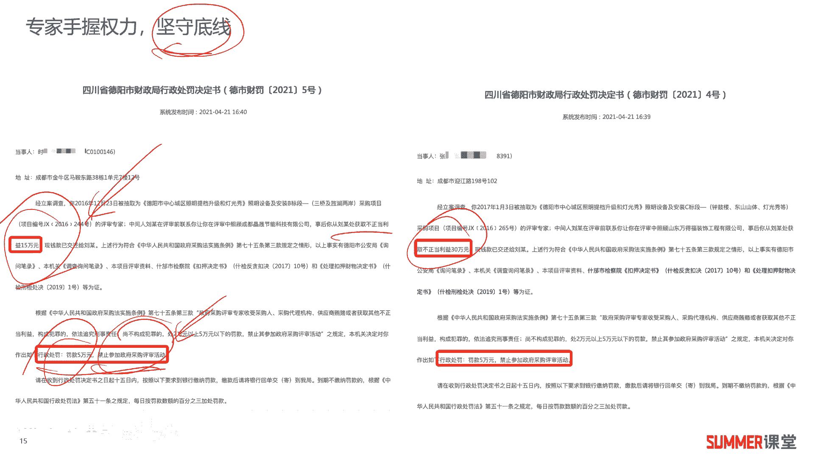

然后禁止参加什么评审，所以这种东西还是要守住底线，守住底线好，第三个作用，职称落户和积分落户啊，这个城市有很多哈，比如像上海深圳，广州成都，天津，杭州等等一系列的省份都会有职称入户的啊。

这样的一个啊这样的一个政策啊，大家可以看一下，这是广广州的广州入户的条件，有高级职称，年龄50岁以下直接落户啊，申办时缴纳社保都行，你以前没有社保啊，但是你只要有高级职称，50岁以下可以直接落户。

或者你有中级职称，40岁以下，有连续六个月的社保也可以落户，是吧啊，是不是，这就很方便了啊，这就很方便啊，这么说可能大家没什么感觉啊。

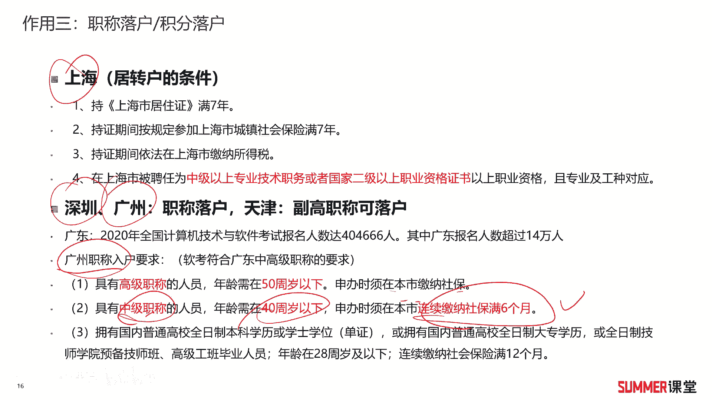

我从我们的一个交流群里面给大家截出来了，一个就是励志的宝妈们，他说他那个钟啊，就这个同学哈，他说那个中象群里面宝妈们的这个心，宝妈们辛苦学习啊，可励志了啊，关键是有些宝妈啊非常厉害，他们还抄书啊。

超出啊啊没毛病，好多宝妈都在考啊，这是考中项的啊。

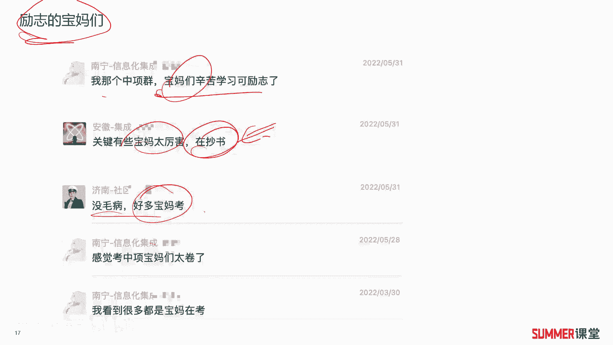

都在考，为什么呀啊为什么啊，我们通过一个啊一个这这是一个报道哈，供大家参考，应该都很好，就通过他应该就很好理解了啊，这是2020年，全国报考软考的人数超过了40万人啊，有一点戳中了广州妈妈的痛啊。

什么呢，入户广州也就落户广州嘛是吧啊，落户广广州啊，这个这是一个采访啊，看一下啊，来广州10年了，一直想入户广州，这样就能够免去许多麻烦，主要是能够解决什么上学的问题，买房的问题啊。

这两点哪个不是大问题啊，都是大问题是吧啊，入户广州有很多种方式哈，有一种比如说像积分落户的方式啊，就就积分嘛啊，看比如说你的工作单位啊，是大型国企，怎么上市公司啊，记多少分啊。

你的学历是硕士博士又记多少分啊，或者你有其他啊这个专利啊，还有出过什么书啊等等等等啊，就是最后积分排名，然后能落户，但是他在积分上跟别人有些差距，比如说你的学历不高，你工作的单位也一般啊。

这些不好搞了吗是吧，自身学历比较低啊，然后在学历加分这块，就已经落后别人一大截了啊，这个积分落户的话肯定是要排序的呀，看谁的积分高啊啊有可能一分也落户不了啊，所以积分落户有很大的不确定性啊。

但是但是有一个什么政策啊，有个什么政就是职称落户的政策啊，有相应的职称就可以落户吗。

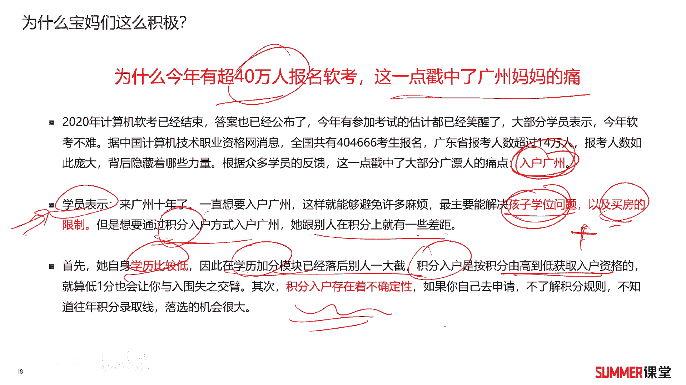

前面不是给大家讲了对吧，这是广州的政策啊，所以不知道大家发现没有，全国考软考的人差不多有1/3是广东的啊，是广东的，第一个广东本来就大，省人很多对吧，第二个，广东的信息化应该在全国也是排在靠前的啊。

第三个就是他职称落户啊，其实职称落户的不止广州，有很多，成都也是啊，成都也是可以直称落户的呀，像天津啊，深圳啊等等啊。

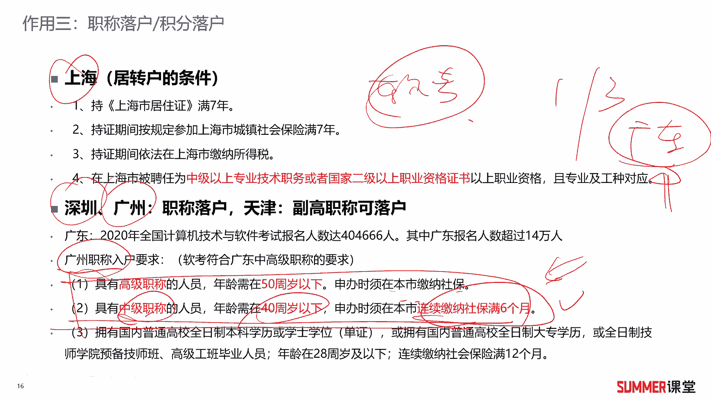

有好多哈，包括宁波啊，我觉得青海不是青海。

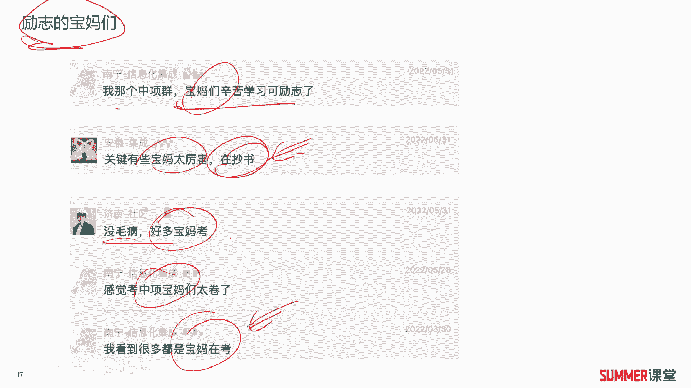

青岛资深落户的城市有很多，大家可以去具体查一下，具体查一下，直升工会是不是比较简单一点啊，比较简单一点啊，而且而且这种如果非科班出身哈，要想职称落户的，一般都是考什么，考项目管理，中项或者是高校。

原因有四个，第一个报名的门槛比较低啊，不限专业，不限学历，也不限工作年限，三不限，报考的难度相对而言比较低，项目管理是偏文科的啊，是偏文科的考试，不需要有太多的计算机基础啊，有些文员。

有些公司的前台也都在考，人家还考得过关键词是吧啊，这可能啊高像可能是最简单的高级了啊，最简单的高级啊，啊，接着第三个就是能够为我们的职业转型，项目的控标提供一些帮助啊，待会儿我们会讲到哈。

啊第四个它可以实现落户嘛。

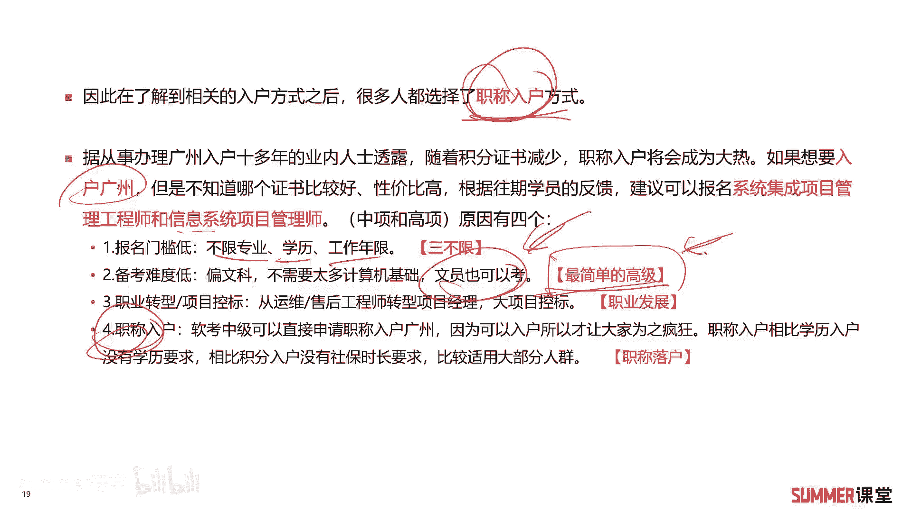

啊有很多城市有这样的一个政策啊，有这样的一个政策啊，第四个作用啊，它能够实现项目的控标和加分啊，因为现在随着我们的政府，采购法和招投标法的颁布，以及相应的实施条例的应用。

现在你想通过一条技术参数把项目控死，这是很难的，非常容易遭受自质疑对吧，但是如果你通过我们的售后服务经理，我们的项目经理这些去加分，这就比较容易容易啊，啊是说得过去的，特别是这种国家级的证书。

国家级的证书啊，你质疑也不好质疑，可以很容易地回复你对吧，我的项目经理要求有高效过分吗，要求有网归，我是一个网络的项目，信息化的项目，这两个都说得过去的，你不好质疑啊，从一个证书加一分或者两分别看。

别小看这一分和两分，两分啊啊有些时候在一个上千万的项目里面，他就代表着一两百万，如果你这个人，你的证书能够给公司带来啊，一两百万或者几10万的一个收益，你是不是就有底气有勇气去找老板给你提啊。

提提加薪的事情吧。

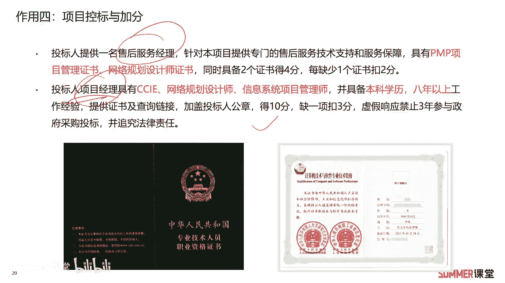

啊好吧啊，第四个作用啊，我们下面再来看一个案例啊，这是这是一个真实项目的一个评分规则，大家可以看一下人员的配置里面，是不是有有高效的要求啊，有高效的要求啊，你有中项得0。5，高项得一分啊，偏僻得得0。

5分，其他软考的高级得一个得0。5，其他软考的中级一个等0。3啊，对证书的要求六分啊，你要得这六分是相对而言比较容易的，但技术实力这边有三分啊，我以前详细的讲过哈哈就是特别是第一条啊，专利啊。

他要求提供专利的证书，查询截图或者和网址的链接啊，专利数量排名第一，得一分，排名第一，这个第二得0。8，一次一次减0。2嘛是吧，第三得零点啊，六分啊，就为了拿这一分，为了专利排名第一，有一家公司啊。

有一家公司他一共写了6000多页，6600页啊，因为你基本上你要先把把专利的证书放上去，把这个官网查询截图和查询网址放上去，一个专利基本上一页写了6000多个专利，就为了得知一分。

那你想一下团队这个人员配置六分，基本上十来页就能搞定对吧，所以这得分是不是就方便了很多呀，而且当时投这个大标哈，这是4000多万的标啊，都是一些大单位啊，比如说呃中通服务设计院，然后中电27所。

中电51所，也就海康威视，还有什么还有什么中航工业啊等等，一共18家，竞争的竞争是相当激烈的，竞争是相当激烈的啊，看到没有技术实力，你写这么多页啊，你就为了拿这三分，而且这还是三分当中的一分哈。

唉而我们的人员是很容易得分的，但是但是即使是这样啊，像人员配置这六分也有不少单位拿不起啊，我刚刚讲的这18家都是中字头的大企业啊，但是有些单位我记我记得很清楚啊，中通鉴中国通信建设啊，全称是什么。

记不清了啊，中通建四局四局在郑州，他的人员配置，这这分基本上丢了很多，没怎么拿到啊，他他他的这个软考的证书就很少了，好软考的证书就很少。

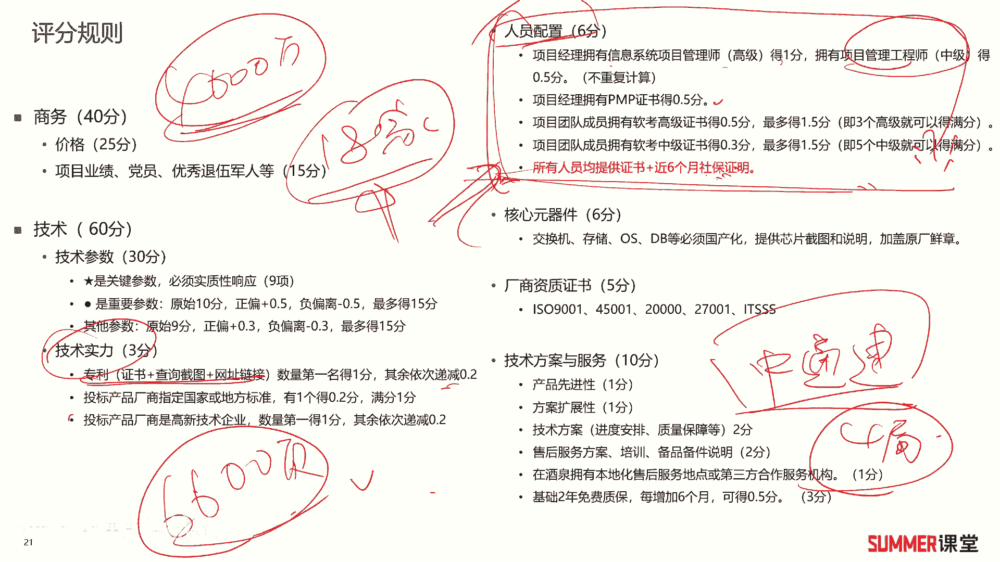

ok啊，所以这是真实项目的应用哈啊，所以它的价值应该还是挺大的啊，第五个作用可以退税，还有其他补贴，退税对所有人都适用，只要你工资大于5000，都是交了个税的对吧啊，软考啊，可以减免3600的额度啊。

这3600是不用扣税的啊，接着还有一些技能补贴啊，技能补贴这个看似有些省有有些省没有啊，呃我记得前前2年吧，应该是2020年对，2020年我是领了3500啊，那是那时候四川有有这个补贴。

好像现在四川把它给取掉了，因为财政估计财政预算不太充足啊，没钱了，所以他就不怎么发了哈，当然除了这个补贴之外，不同地方还有当地的补贴，特别是针对高级职称，针对这种人才的啊。

你看高级职称专业技术人才住房补贴，这是哪个地方的，宁波啊，宁波啊，宁波是会直接给你发钱的，比如像云南他有发一个东西啊，什么网络工程师这种都可以领4000啊，我没截全啊，啊没截全。

项目管理那个肯定也在里面的啊，这个高级领大几千，领大几千的啊，所以这就关注自己当地的人设啊，人社局发布的一些信息啊，发布的一些信息，这第五个作用哈啊第五个作用好针对软考的啊。

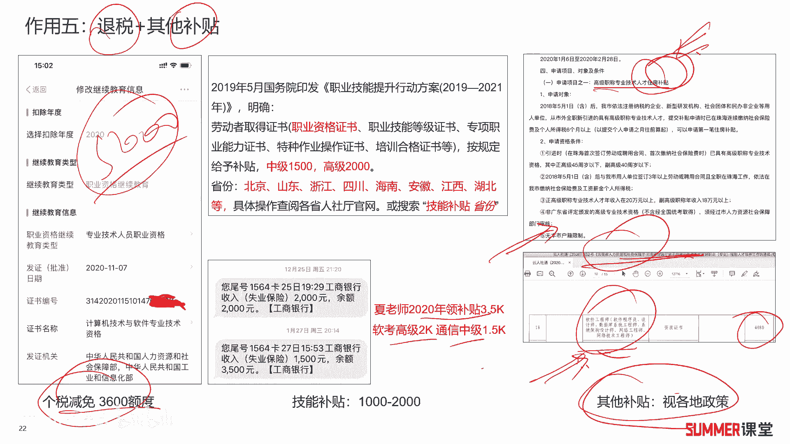

作用啊，我们介绍到这里，我们下面看第二块啊，考试的内容与备考指南啊，这是核心啊。

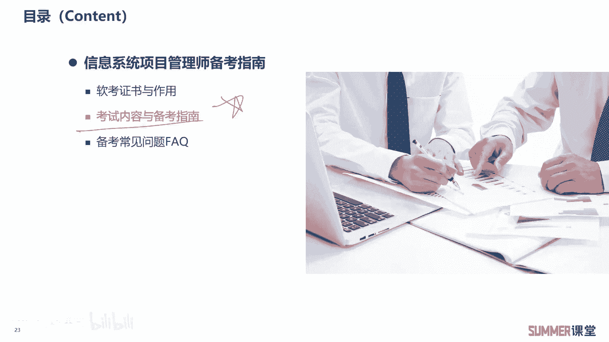

这是核心啊，首先我们来看一下项目管理的核心思想啊，我觉得这也虽然跟我们的教材好像没太大关系，但是我觉得很重要，为什么，因为我当年学高校的时候，我当年学高校的时候，我记得我已经学了快一半了，一大半了。

我都不知道这门课程他具体想要给我讲什么啊，听得云里雾里的啊，真的是云里雾里哈啊，但是我想通过就这一页来给大家讲明白，我们的项目管理究竟在给你讲什么东西啊，就应该跟你讲什么东西，我会给大家去对比一下。

就是中式和西式的这种管理思想啊，这个这两个图啊，大家都认识哈，秦皇汉武啊，这种大力啊，中国从古到今其实出现了几百位皇帝，差不多500位吧，但是能配得上大帝的不超过20位啊，真的是不超过20位啊。

秦皇秦皇汉武，唐宗宋祖是吧，还有一些呃就就不来去展开了，反正我一直觉得这种大地，他们都是管理学的大师啊，他们都是管理学的大师，他能够很好地平衡文臣武将宦官外戚，宗室藩王等等一切人之间的关系啊。

我前段时间我看了那个呃一个电视剧啊，85级的啊，讲讲堂，唐太宗李世民贞观之治还是叫什么啊，85集虽然有点长，但是我觉得还是挺精彩的啊，就是通过这个电视剧就反映出这种大地，真的不是一般的人物。

真的很牛逼啊，牛逼到天的那种啊，里面的什么帝王心术，他们个人的人格魅力，把各个这个臣子拿捏得死死的对吧啊，所以如果让他们来做项目管理啊，肯定大力都是项目管理的大师，项目管理大师啊，所以大家发现没有。

我们中式的管理思想，是比较强调个人的能力的啊，个人的能力了，500位皇帝当中只出了20来位啊，这种管理学大师啊，这种管理学大师是吧啊，这是中式的项目管理思想啊，接着是西式的管理思想。

他强调的是流程标准化，这个东西就是一个小白进来，我们按照流程走啊，标准的一步一步走啊，你大概就能及格啊，得个60分啊，得个60分啊，最典型的就是去去医院嘛，对吧啊，去医院啊，特别是小孩去医院一般干啥啊。

先啊先用那个好听诊器听一下啊，这个感冒你感冒发烧好啊，先听一下你的这个有没有什么肺炎是吧，你的肺是不是正常啊，第二步，张开嘴看一下你的喉咙有没有红，有没有发炎啊，接着啊让你去验个验个血。

然后从你的血的指标再来做判断啊，非常标准化啊，一步一步来，只要我们按照这个标准走啊，基本上不会出现太大的这个问题是吧啊，不会出现太大的问题啊，即使这个医生的医医学水平不太高，医术水平不太高。

但是按照这个来啊，比如说从你化验血的各个指标，什么白细胞啊，淋巴细胞啊，能够反映出诶，你是不是感冒了还是怎么着，对不对，他是强调流程和标准化的啊，按照按照这个流程走啊，比如说我们做项目管理啊。

如果是西式的项目管理，他就是让你去填各种表格，输出各种文件，然后里面用到各种标准的工具和方法啊，一步一步来啊，一步一步来啊，这是西式的管理思想啊，西式的管理思想啊，这里面或者你还可以对比一下。

就是中医把脉和西医验血啊，中医特别牛逼的中医，它通过把脉是可可以把你的这个身体状况，做一个综合的评估的啊，但是啊这个怎么讲呢，可能有些东西也不好讲，就是就是这个东西就有点玄学对吧。

100个中医里面可能有一个是神医啊，但是西医的话你按照标准的流程去走啊，我不能说有多少神医，但是我百分之七八十，反正我都能及格对吧啊，达到及格这个水平啊，达到及格这个水平，ok这就是项目管理的啊。

两种思想，第一种是强调个人的魅力，人格魅力，强调个人能力的啊，比如说中医其实也是这样子的啊，中医真的是那种学学通了，学透了的是非常厉害的，但是我们绝大部分人可能很少能够遇得到啊，很少能遇得到是吧。

而西医就标准的按照流程化来，我们项目管理，其实学的这本书哈，我们学的是什么思想，是西式的思想啊，因为你个人的能力，你的人格魅力，这个东西没法给你很好的去培养，但是我们可以强调流程。

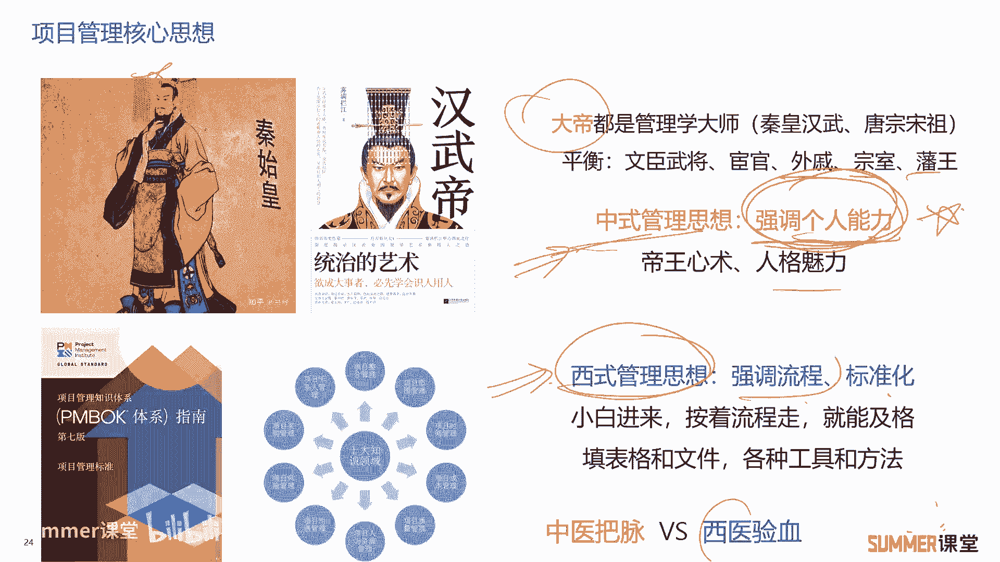

强调标准化，一步一步的来啊，按照整体的思路让你去填写表格，填写文件啊，最后一个小白进来啊，给你稍微培训一下啊，这个项目不一定你说你能够管到90分，但是你能管到60分，65分，这效果就达到了啊。

相当于能够批量生产，批量的复制对吧啊，能够批量的生产，能够批批量的复制好吧，这就是啊项目管理的啊一个核心思想啊，一个核心思想标准和流程化啊，具体落实到我们后面要讲的内容哈。

啊就是把我们项目分成四大领域啊，你项目管理怎么管呢啊怎么管呢啊，就是做整体管理，进度管理，成本管理，然后风险管理等等等等，反正核心的就是十大十大管理，四大管理啊，我们整本教材的架构啊，给大家梳理一下哈。

啊其实一共就分成三块的内容啊，第一块是信息化和信息系统的基础，官方教材大概有120页，主要讲技术啊，技术上午选择题考20分，下午案例分析和论文啊，不涉及啊，这一章可能对大部分来讲会会比较难啊。

因为它跟技术有关，跟技术有关，然后接着第二块内容，也就是核心呢十大管理是吧，他决定你是否能不能通过这门考试啊，十大管理它是教材的呃，第四到第12章这十大管理，然后还有项目管理的基础。

第二章和第三章啊非常重要，大家发现没有，我们这本书900页，900页，第一章120页，第二章260页，这260页要考你80%的分值啊，要考考你80%分，之所以重点清不清晰啊，还是挺积极的。

但是我们发现这本书写的就不好是吧，重点知识就260页，其他乱七八糟的给你写了450页，这不瞎扯淡吗，所以你闷着头在那看书，你觉得有用吗，那你觉得能get到它的重点在哪吗，啊很难是吧。

还是要有人给你稍微指点一下啊，剩下的啊，他一共就他的官方教材一共写了28章啊，其实核心知识第12章就已经结束了啊，第12章就已经结束了啊，你把前面12章学好了，考试基本上就过了啊，后面有这么多章啊。

有450页考的比较少啊，选择题考八到十分啊，不是不考啊，也有啊，八到十分大题偶尔会出现啊，也不是每年都会有啊，大题基本上都集集中在第二部分十大管理啊，里面比较重要的话就变更和配置管理啊。

变更其实我们在十大管理里面，整体管理里面也会讲项目的整体变更控制啊，所以这个东西其实在这里面也已经讲过了啊，或者部分讲过了是吧，ok啊这样一分大家重点应该就很清晰了，核心在中间啊。

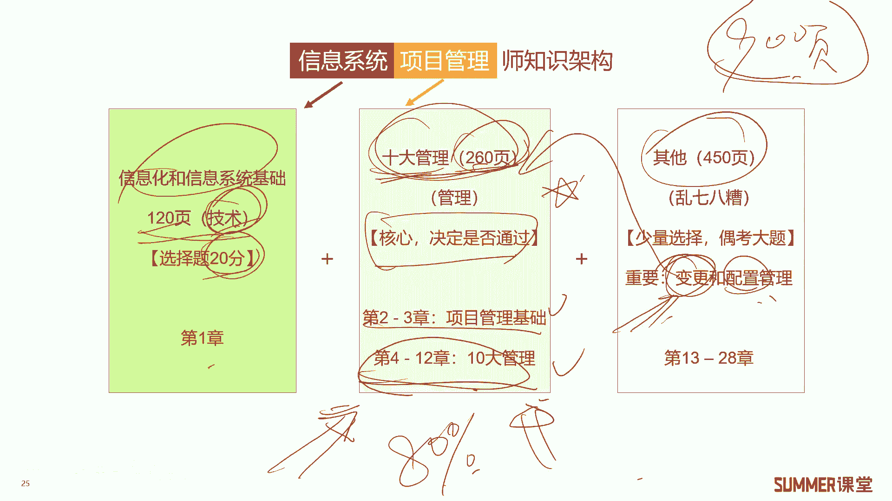

核心在中间好吧，我们针对每块啊，再简单的看一下第一块啊，也就第一章啊，考选择题的20分啊，考选择题20分啊，这块内容真的很多哈，书上写了差不多11个章节吧，啊我把它融合了一下，融合成十个章节啊。

内容很多，专业性也很强，如果不是计算机专业的学员的话，肯定是感觉偏难的，即使你是计算机专业的，也会感觉到难，为什么，因为相当于这100多页，它融合了十本书啊，融合了省本书很多领域啊。

啊如果即使你是选计算机的，现在你你从事的工作也是跟计算机相关，你不可能软件开发网络工程，然后然后那个呃呃就这个信息安全啊，以及这个最新的i t技术，还有信息系统的规划，那全部会啊，那不可能啊。

夏老师也不可能全部都会啊，我比较擅长的像网络安全，我很擅长是吧，然后新一代i t技术这个还行啊，网络工程这个集成技术，这里面主要讲网络啊，啊这个我是非常擅长的，其他的啊我也不是那么擅长明白啊。

所以术业有专攻嘛，对吧啊，你不可能所有的东西都学得很透的啊，即使你是专业搞信息化的啊，专业搞信息化的明白，但是比较好的就是他只考选择题20分左右哈，我们只要掌握重点，会做题就行了呀。

他的有些考点是比较常见的，而且是多次考的啊，我在讲精讲课的时候会告诉你啊，这个考点怎么考，有哪几种考法，你只要把我讲的掌握了，那就行了，有些知识点你是不必去深究的，你深究了就会掉进坑里啊，为什么呀。

我告诉你了，这是120页，它是十本书，你要全部搞透，你要去看十本书，甚至更多的书，你觉得可不可能现不现实吧，那不现实，而且他只考选择题啊，你你搞那么明白，下午又不考你。

案例分析论文涉及不到什么东西是吧啊，所以希望大家一定要啊把握我们学习的节奏，而且这20分建议大家拿个十分，12分啊，14分啊，这就这就够了啊，你说12分14分拿不到啊，拿十分啊，ok啊。

有些人说a老师我能不能拿八分，那八分有点少了啊，有点少了，为什么呀，因为20分，你瞎猜25%的正确率多少了，1/4的正确率啊，五分呢对吧，是不是五分啊，我看呃除以四啊。

就就是五分嘛啊你瞎猜基本上能吃能对五分啊，你全部选a或者b都能得五分，你说你你学了这么久，你就只能多多拿三分吗，这也也也有点坑嘛是吧，建议大家拿十分以上好，前20选前20道选择题拿到十分，那就够了呀。

那就够了啊，这是第一章啊，我们的啊一个学习啊。

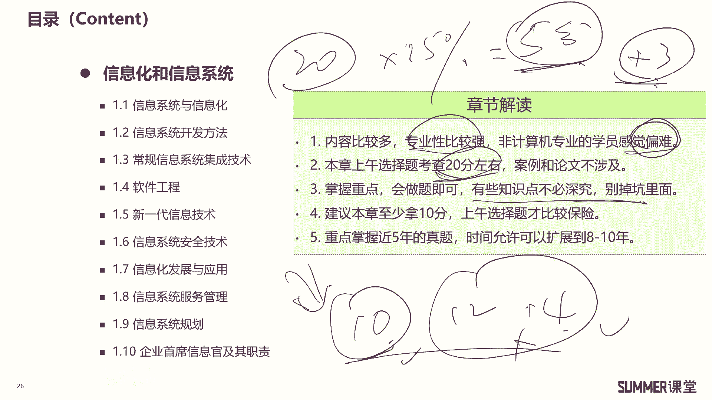

供大家参考啊，接着后面的十大管理啊，就一个整体管理总分型结构嘛，我们先讲整体项目应该怎么管啊，接着讲九个分支范围管理，进度管理，成本管理，质量管理等等啊，这几个啊其中最重要的啊是哪两个啊。

进度管理和成本管理很重要啊，啊下午案例分析至少25分，考的多的年份考了50分哈，所以所以它很重要，必有25分，而且是考下午案例二啊，案例分析的第二题啊，这两个是最重要的啊。

其他的这几个管理其实都还比较重要啊，十大管理嘛，这是我们整本教材或者整门课程的核心啊，这门课程的核心希望大家注意哈，啊接着再给大家去梳理一个概念啊，就是i t t o这是我们学习的时候会遇到的啊。

讲课的时候也给大家去讲过，这里面简单的说一下a t t l是什么意思啊，就是输入输出和工具与技术输入，就是你依据的是什么，参考的是什么，应该审查什么，然后输出就是你你应该得到一个什么东西吗。

那这里面举个例子，比如说你要写一个实施方案，实施方案就是你的输出，我怎么写呢，我如果我是小白，我不懂是吧，那怎么写啊，你是不是要有些输入啊，有些参考文件啊啊客户的需求，然后我们这个项目的合同。

还有比如说我这是一个啊，这是一个教育行业，这个行业的背景与行业的政策，是不是要参考，因为我们单位以前有没有做过类似的项目啊，有没有类似的模板啊，那借我参考一下，是不是啊啊这叫这都是输入。

就相当于你的参考，啊为了写这个实施方案，你就要参考这些东西啊，工具与技术，我我要写这个方案啊，我我不我不可能手写呗是吧，要有个电脑，还要有office软件，写好了之后，我可能要打印出来，然后交给客户啊。

交给客户，啊这就是典型的i t t啊，这in out啊，这是tt tt就是工具和技术啊，其实我们整本书很多管理都在学这个东西啊，当然今天我就不给大家去展开了啊，就不给大家去展开了啊。

因为展开内容会很多哈，我们学十大管理是给大家详细的去讲过的啊，里面涉及到的一些i t t有些需要大家理解啊，有些啊可能你还是稍微记一下最好tt，五是不要求大家全部要死记硬背下来啊。

你理解性的记忆就可以了啊，理解性的记忆啊，整本书其实很多地方都在学啊，学这个东西啊，比如说诶你成本怎么管理啊，对吧啊，成本管理分几步啊，每一步都有相应的i t t o，i t t o是什么东西啊。

我通过我这个例子，我相信应该能明白了哈，因为我当年学的时候，我觉得，我觉得那个老师就没把i t t o给我讲明白，天天给我搞什么dt，我都不知道这是什么鬼啊，通过这个例子希望大家能够明白好。

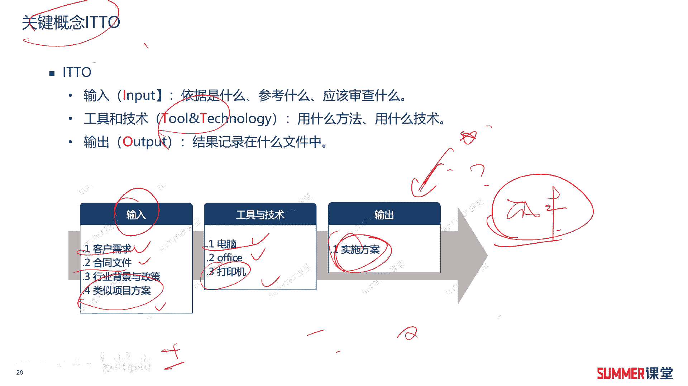

我们总结一下哈，啊高项啊，这这门考试一共考三门啊，一共考三门，综合知识，选择题，案例分析，然后论文啊综合知识是75道选择题啊，150分钟，150分钟是比较充裕的，时间很充足，案例分析考两个小时。

三道案例，三道大题，每题25分呃，呃不是两个小时，90分钟啊，90分钟，这90分钟时间还行啊，不是很不是很充裕，但也算不上紧张，时间最紧张的是论文两个小时啊，论文两个小时才写完，这时间非常紧张。

所以平时啊你该练习写字的，还是要练习写字啊，别在那考试，你写写2000多个字，你都写不出来两个小时，所以这也是论文难的一个原因之一，时间很紧张，考场没有啊，没有多的时间给你去思考，给你去打草稿，明白好。

我们一个一个看哈，综合知识，这75道选择题，我们重点是要做真题以及章节的练习题，真题啊已经发出来了啊，章节练习题啊，这两天我优化一下啊，也会也会发出来，一共20几个章节，所有的章节练习题啊。

基本上我都整理好了啊，最重要的就是要做好5年的真题，或者你做做2018年以后的真题，我觉得也行啊，因为每年考两次嘛是吧啊，需要注意哈，我一直强调的就是做真题一定是要做好，要做透，不等于你做了或者做过。

那绝对不能划等号的哈，啊夏老师考很多事，我做一套题要用一天啊，要用一天，我做一套题，我就希望通过一个题目，能把这一类的题目都给整明白啊，你去翻书嘛啊，你去网上查嘛，不明白了是吧，看老师的解析视频吗。

或者其他各种各样的方式整明白是最重要的，不要那狂刷题，刷了之后走马观花，啥都不会，这是非常不推荐的啊，反正我考的很多事，我基本上不太不太喜欢去做题海战术啊，我就是把5年或者有些是3年真题研究透啊。

如果1年考两次的，就3年就够了，基本上当你说再扩展一下5年，有没有必要做了10年，15年必要性不是很大，如果你时间特别充裕，你多做一点呃也可以，但是绝大部分人哈至少80%的人，至少80%的人。

只要你真的是把5年真题做好了，做明白了，那肯定是可以过的，我告诉你，你考不过了，你做个20年真题都没用是吧，你没有吃后嘛啊，没有把它做好，所以这一点很重要哈，啊一定要一定要注意啊，一定要注意。

不要为了做题去做题，就是案例分析，案例分析，我们后面会给大家去去出专题专题来讲啊，会出专题来讲，主要分成两块吧，第一个是计算专题，计算专题就成本和进度啊，一定是有一道大题的25分，那第二个就是简答题嘛。

啊简答题会给大家去做一些总结啊，怎么去啊怎么去啊，怎么去回答哈啊这块只看书还是不够的啊，扩展主要参考我们的专题就行了啊，参考我们的啊专题视频啊，也就是我们直播会给大家去讲的啊，接着论文啊。

论文以前都是二选一啊，二选一一般是一个啊，一个其他的这个题目你可能你没见过的啊，第二个题目就十大管理里面出啊，十大管理里面出，他在最近些年有点变化啊，就是有些年份年份的话。

他会出他出的这个论文不是十大管理的一个啊，不是什么进度管理，成本管理，而是让你写进度加成本，就有点双拼啊，双拼啊，这个是出现过的，然后2022年5月的考试，它又变了，就只有一个题目了。

不是两个题目让你去选，那就只有一个题目出了一个干系人管理，所以难度是不是又增加了呀，啊反正从最近两次的考试来看，高校的难度在较以前的基础上有所提升啊，有所提升啊，这块要求你写正式的项目啊。

我们后面专题会讲啊，也是都是45分合格啊，掌握套路，其实论文还好啊，论文还好啊，这里面你要写论文的话，十大管理的过程就必须要背，然后t t你至少要记住几个啊，当然有些人可能还没怎么学。

那时大管理哪些过程你不知道对吧，什么i t t o有哪些你也不知道啊，没关系，这个后面你如果听课的话，都会都会讲到的哈，都会都会讲的这些东西啊，反正你知道十大管理过程，都肯定是要背下来的啊。

这个无论用什么方法啊，在上在你上考场之前全部要把它背过啊，一共40大管理，然后47个子过程是吧，设置七个子过程要背的哈，包括每个子过程它的定义和作用啊，这写论文会用到的啊，写论文会用到的好。

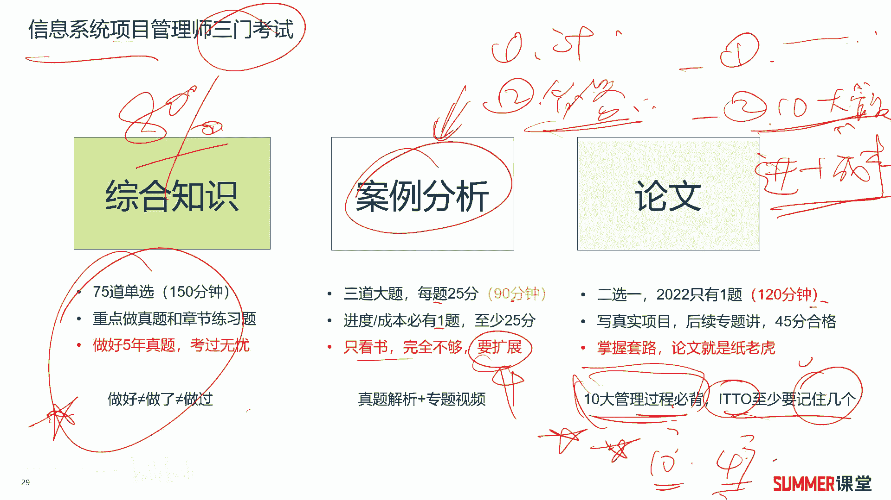

这三门考试，我们下面再给大家去分析一下，具体每门考试备考策略啊，你们考试备考策略啊，首先选择题，选择题其实分成五个模块啊，这是模块是分成五个的，第一个是i t技术，i t技术考20分对吧。

i t技术里面我又把它分成了五个，下五个子模块的啊，我们精讲就是按照这个这五个子模块来讲的，先前其实已经讲过了，主要就是知识点比较多，比较杂嘛啊，拿十分差不多就行了啊，低于八分的话就会影响你的通过了。

如果拿个十分左右影响不大啊，影响不大，你说我这里面拿个15分，那更好喽，那你后面就可以多丢点分吗对吧，第二个核心知识点，十大管理也就第二章到呃，到第十应该12章还是第四，这个应该是14章写的有点问题啊。

就是这里这十大管理啊，什么利十大管理嗯，应该是不包括立项哈，就范围进度，成本质量啊等等等等这些啊，35分，35分，这是核心，上午你看这几块它是考得最多的对吧，然后下午案例分析题。

以及我们的论文都会跟四大管理相关，核心一定要学透啊，怎么学透，听我们的精讲视频，做真题，看真题解析不断的重复啊，包括听我们的专题，视频专题也会给来重复去讲的，第三部分是其他管理。

其他管理你看内容章节很多，但是分值就考八到十分啊，重点是变更和配置管理，这两个比较重要啊，运筹学院3~5分的选择题，英文五分的选择题啊，五分的选择题有些时候是2+3或者3+2啊。

就是我们的太阳五分里面有新技术，和我们的的这个四大管理，就四大管理的英文题啊，有些时候他考两分，他考三分，他考三分他就考两分啊，一般是这么去啊，去设置它这五分，那这五分如果你英文真的是特别差。

那就战略性放弃啊，你把我们讲的总结了一些给看一看就行了啊，真题稍微看一下啊，就因为有有什么快速提高的方法吗，啊很难对吧，你有有时间有心情去提高英文，你还不如把十大管理给我多看几遍。

把这块啊多学一下是吧啊，所以这是每一块的啊。

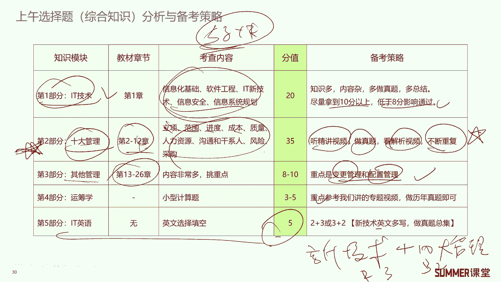

备考策略，备考策略，上午选择题哈，接着下午的啊，题目啊，下午题目一案例分析，案例分析，我们在这里边统计了一下，2018年到2022年的啊，考试不知道大家发现规律没有，其中有一道题是非常固定的。

第二道题25分，这25分基本上考什么，考成本加进度，成本加进度，有些时候考考成本，有些时候考进度，那反正离不开成本加进度嘛是吧，非常重要啊非常重要，所以大家一定要多花心思思啊，这个25分选啊，不选择题。

这25分是计算题跟计算相关的啊，一定要尽量多拿分啊，为什么，因为前面考的这些，即使你不会你瞎写啊，因为他会给你一个背景嘛啊，然后让你判断他们的做法，对不对对吧，应该怎么去改进，有些有些东西即使你没学过。

你也能得一些分啊，即使没学过也能得一积分啊，所以第一题和第三题简答题相对而言，你说要得高分很难，但是你想不得分，那这这这也很难是吧，但是计算题计算题如果你前面第一步就做错了，那这25分就很悬了啊。

你想通过这50分，你拿45分是很难的，明白啊，所以后面大家要在网上多多花时间，核心的计算题啊，核心的计算题多花时间，它是决定是否通过的关键，只要你这25分拿到了个20分，那恭喜你这门考试基本上就过了。

ok啊我记得当时我就比较悲催哈，我我计算题我算错了，计算题算错了，还好不是最开始就算错了，算到后面应该算到中间的时候算错了啊，所以计算题我当时应该是只得了呃，只得了十来分啊，得了十分十分多一点吧。

多多少我也不清楚了啊，还好啊，这两个东西我还答得比较好，那最后过了啊，最后过了啊，如果你刚开始算错，你基本上这个这门考试就挂了，像这种简答题哈啊再给大家强调一下，简答题你想不拿分，那比登天还难。

你想拿满分啊，或者接近满分，那也很难啊，所以他怎么讲呢，就是就是中间程度啊，比如说这这25分啊，你拿个15分啊，应该比较常见是吧，或者有些时候拿个18分啊，你想拿25分以上啊，这有点难啊，这有点难。

ok啊，通过我们的这个总总结哈，你会发现进度加成本，这是非常重要的，另外其他的核心知识点考的比较多的，人力资源范围和质量，这几个也考的比较多，十大管理是重点对吧，十大管理当中的这五大又是重点中的重点。

ok啊，给大家的建议就是先过一遍我们的精讲，有初步的印象，接着听计算或者简和简答专题的这个直播啊，步步递进，要不断地重复听一遍，其实是不太够的，我当时我考高校的时候，我听了一遍精讲视频。

我感觉我都是蒙的，所以你们听完是蒙的，我也觉得也比较正常好吧，听第二遍你再做做题就有感觉了。

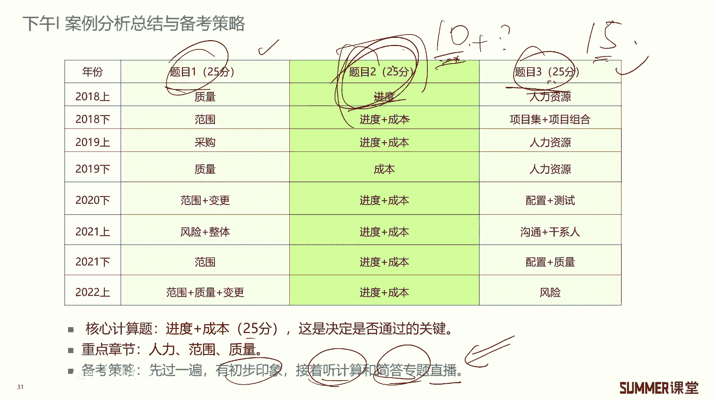

就有感觉了，然后接着论文啊，论文这些年你看前面都是考两个题目啊，只有2022年考一个题目啊，干系的啊，干系的啊，论文其实没什么可说的哈，我们后面还有论文专题啊，给大家的建议就是。

十大管理的过程肯定是要背诵的，关键的a t t o你要记忆，要理解备考的策略啊，我们专题的总结，论文专题还有会提供优质的范围啊，供大家参考。

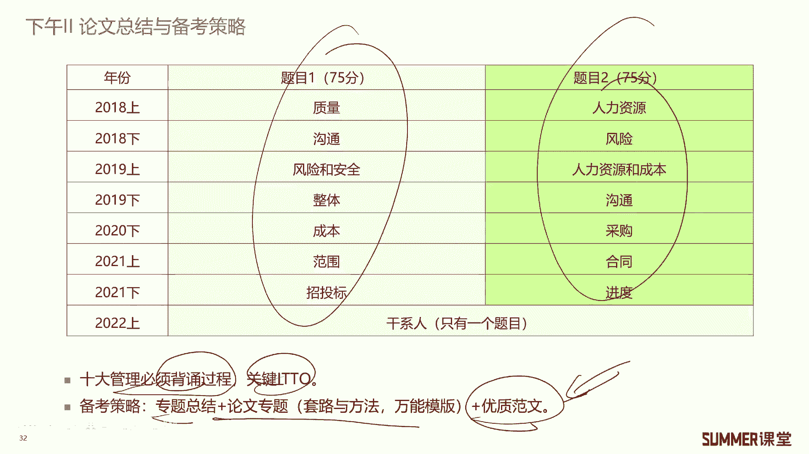

供大家参考好吧，论文我们后面再详细的去讲啊，再详细的去讲啊，刚刚大家有人提哈，就是啊怎么去复习啊，复习的时间安排，这里面给一个啊参考啊，给一个参考，啊第一个阶段啊依旧是啊通读教材啊，看一遍精讲视频。

然后做一两套题啊，做一两套题在8月份的时候就要完成了，现在离你8月底是不是还有一个多月时间，那肯定是完全够的，时间是充足的，主要的目的哈，这个阶段就是对考试的内容，有一个整体的了解啊。

你说这个阶段要你背吗，不让你背啊，不让你背啊，背也没什么意义，你到考试可能背完就忘了是吧啊，第一遍是过一下啊，有个基本的认识，第二阶段啊，第二阶段啊，从9月开始，重点是啊专题啊。

其实专题我们现在慢慢的都会给大家去讲啊，我们主要三大专题，论文专题，计算专题和案例简答专题啊，这三大专题啊，当然啊中间可能会抽空也讲一下选择题啊，重点的选择题也会给大家去讲啊。

最核心的肯定是学好十大管理啊，注意哦，有两个东西是要学透的，进度加成本啊，这个就是大计算啊，大计算专题啊非常重要，每年必考25分啊，第三个阶段啊，到10月到10月的时候。

就是把2018年以后的这些真题要好好的做，一定要好好的做，做完之后建议大家至少要看个几套真题视频，解析，理解背后的逻辑啊，理解背后的逻辑，不要做完就放了，哪怕你是做对了。

我建议你还是要看一下真题的解析视频，很重要啊，非常重要啊，最后第四阶段考前，我们在对论文进行专项突破啊，进行专项突破啊，论文如果字写得不好的，提前练字啊，我们下次课会给大家去讲论文啊。

啊所以论文我觉得大家不用怕不用怕啊，整体的按照我们的节奏走啊，应该是没什么问题的啊，应该是没什么问题的，好吧好，后续我们也会推出各种配套的电子资料啊，今天我已经把历年的真题。

2018~202的真题总结给大家发出来了，然后章节练习题的话嗯基本完成了，然后我还在优化一下啊，优化一下啊，最近也会发出来，然后后期我们的这三大专题啊，会有对应的word和ppt啊。

后面这三个就后面再放啊，后面再放好吧，结合我们的精讲的p p t，然后我们今包括这些总结的东西，你去考这个试应该是比较轻松的，只要你把这些东西都认认真真的做了，然后根据我们这个建议的步骤啊，走了啊。

考高项啊，相对而言还是不难的啊，还是不难的，好吧啊，这五个文档非常重要啊，非常重要。

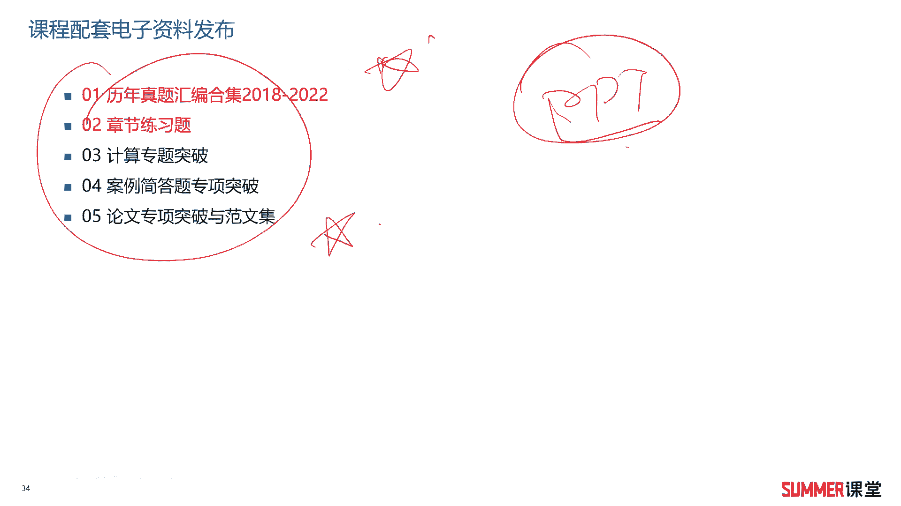

好接着来看第三块啊，备考常见的问题啊，备考常见的问题啊，几个高频问题哈，给大家去看一下软考有没有报名限制啊，没有啊，没有任何限制，对年龄专业学历都不限，高中在读的都已经拿证了。

我们刚刚的网工不是考完了吗是吧，网络里面是不是有个17岁的未成年啊，人家已经考过了啊，而且是双科考了50家呀啊双科考50家的啊，什么时候报名啊，一般考前两个月报名，11月5号考试。

预计9月初就会考试开始考，报名报名的网站都给大家了，高效啊，一般需要准备多久，高校一般需要准备三个月，如果是晚归的话，一般要建议大家四个月啊，晚归会难一点啊，当然每个人基础不一样，学习能力不一样对吧。

有些人两个月他就能考得过，有些人四个月他觉得时间都还不够，所以你要根据自己的实际情况啊，虽然夏老师也考过很多次，但是我个人觉得我的学习能力是一般的啊，或者不是那么强啊，所以我花的时间是挺多的啊。

我花的时间是挺多的啊，包括大家今天看到这个p p t，那可能就几十页啊，我就写这个p p t我都花了，花了一天一天的时间嘛，就专心的写p p t啊，其他事情基本上什么都没干啊。

所以还是还是要花挺多时间的哈，啊还是要花挺多时间的啊，根据自己的实际情况来啊，根据自己的实际情况来其他疑问啊，用不用买书啊，用不用看教材啊，这个就看个人了哈啊这个看个人，反正啊反正我们的胶片。

我们的讲义做的还是还是挺充实的，如果你不喜欢看书的，你就不买书，不买书，看我们的讲义，看我们的p p t啊，基本上能覆盖到90%以上的知识点啊，有些知识点啊如果实在没覆盖到的话，你你在哪儿解决。

在我们的真题里面是吧，前面不是会提供各种练习题吗。

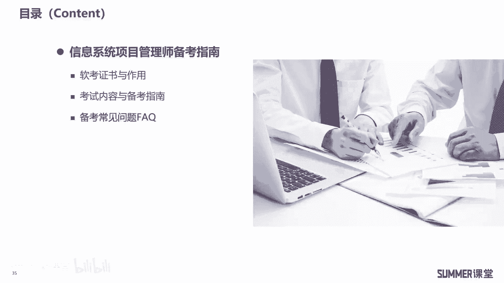

啊章节练习题，还有真题汇编啊等等，还有专题突破啊等等等等，这些这些题里面肯定是呃可以覆盖到的啊，把我们的考点都覆盖到了，所以根据个人啊啊如果喜欢看书，当然买一本看一看，翻一翻啊，也挺好的啊，也挺好。

计算量大不大，是否能带计算器呃，从最近几次考试来看的话，计算量其实还不小啊，计算量还不小，但是不能带计算器啊，所以平时就要养成口算的一个习惯，或在草稿纸上去算一下啊，部分知识点听不懂，听懂了不会做题。

一做题就会错，这是任何考试哪一门考试都会遇到的，非常非常普遍，很正常，即使是我去考试，我学完我去做题依旧很多，不会是吧啊，我靠其他事哈样的啊，一样的，哪有听一遍就会的呀。

然后前前两天看那个董董宇飞的那个视频啊，人家说的至少三遍，啊精讲啊，反正我个人建议听一遍是不够的啊，你至少整个两遍嘛，对不对啊，但是你听的时候也不是，也不是说我快速的马上1。5倍速过一遍。

然后再来一遍啊，并不是这样子的，第一遍你慢一点，然后第二遍最好是做做题，带着题，带着这个考试的一些东西再进去听，效果会好一些啊，效果会好一些，没有项目经验行不行啊，任何考得过我们这叫信息系统。

项目管理师，是不是跟项目管理相关，但是我可以说可以跟你说，这个东西其实跟项目管理啊，不能说一毛钱关系没有，只能说关系不大，就是他讲的这些思路，给你实际做项目的这个思路呃，差异还是非常大的对吧。

实际做项目你肯定要要考虑怎么送礼，怎么怎么怎么陪领导喝酒，怎么怎么样，那这些东西很重要，但是你说这个书上他会给你讲这些吗，嗯基本上不涉及是吧，给你讲的都是一些嗯怎么讲呢，偏理论的啊，当然我在讲课的时候。

我会给大家稍微的去扩展一下啊，真实项目怎么搞的，会遇到哪些问题对吧，所以这个虽然实际上是项目管理的课程啊，是项目管理的考试，但是它跟真实项目还是有差异的啊，并不要求你有项目管理的经验。

有些时候你项目管理的经验，可能跟我们考试里面的内容还是冲突的，对不对啊，像写论文，你能写写陪哪个领导喝酒吗是吧，这肯定不好写吗，要写书上的一些技术，但是实际上有些时候啊把领导陪好，这个是最重要的对吧。

项目经理就是就是一个沟通协调的嘛啊，沟通协调的事情，很多，软技能可能比比这种硬性的技术会更重要一些，因为项目管理项目经理是一个项目的负责人，他是这个项目的老大，那下面是有专门的技术负责人的呀，对不对。

所以他对技术要求不高，诶，你技术相关的找技术负责人就行了呀，对吧啊，他干的主要是沟通协调的事情。

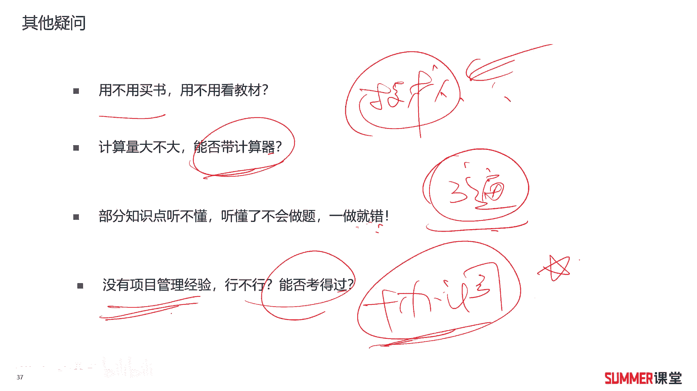

好好这个给大家几个提醒吧，第一个不要掉以轻心啊，虽然我们说高像可能是最简单的高级了啊，没有之一啦，但是整体的通过率也是不足20的，整体通过率大概在15%左右，你看一下啊，这重庆发布的一个数据哈。

2019年上半年17%，2018年下半年高项12。7%是吧，差不多15%左右啊，平均一下嘛啊所以并不简单，通过率并不高啊，当然另外一个可能会更难一点，晚归晚归通过率个位数是吧，这也不是危言耸听的。

我看了好几个省的统计啊，像浙江呃，河北河南等等，差不多都是个位数啊，啊差不多是个位数啊，所以要考高级还是要花点心思的啊，不是说稍微糊弄一下就能过的，绝对不是哈，高级是要花时间花精力的。

还是要认真学的明白啊，不要觉得我们说高校很简单啊，一考就过啊，你有些机构给你承诺什么70%，80%的通过率，那瞎扯淡的啊，我我看了一些，可能有些还是比较有良心的机构哈，啊承诺差不多50%几左右啊。

我觉得这正常啊，50%几啊正常你说百分之七八十，那瞎扯淡的啊，不可能我告诉你啊，绝对不可能好吧。

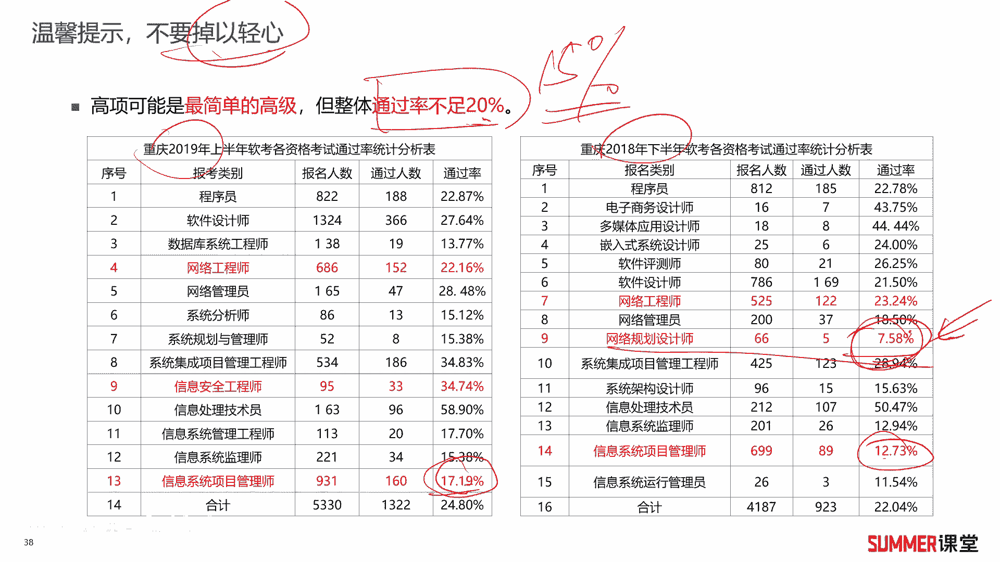

建议大家一鼓作气啊，一次就考过，千万不要啊，不要这个哥们儿这这考网工的哈，那考了四次啊，什么裸考，马马虎虎的复习一下，那稍微用心一下，然后接着刷题，这个案例我就不给大家去展开了啊。

反正告诉你就是不要想着去试试啊，或者裸考啊，这都是扯淡的，肯定过不了，也不要拼命的刷题啊，也不要今年不过看明年啊，某个同学他考考一个试哈，连续3年的考试成绩，王小二过年啊，真的是1年不如1年啊。

看到没有，第一次啊，差一点点过啊，第二次差的多一点了是吧，第三次差的更多啊，你看第一次是上午没过，第二次，第二次也是上午没过啊，差的差的多，第三次上午下午都没过，有些时候这种考试是很折磨人的哈。

啊真的是很折磨人啊，我希望大家就是要下定决心多花点时间啊，多吃一点苦，就那么几个月一下就整过了啊，那个下半年你就可以开开心心的过年是吧，那别你你这个啊这个11月没过，明年还要准备过年。

可能都有点心情不顺畅，所以建议大家哪怕是逼自己一把啊，争取一次过啊，争取一次过，如果一真的是一次过不了，我们争取第二次就过了对吧，高级一啊的确要难一点啊，有些时候也要看运气。

因为这个论文有些时候出道你会做的题，说不定马上写的就过了啊，论文如果出的偏一点啊，你不会，那有可能就挂了是吧，是要讲运气啊，我我讲的是就是八分实力，两分运气啊，8+2啊，如果你实力够强。

运气这个因素就就没那么重要了。

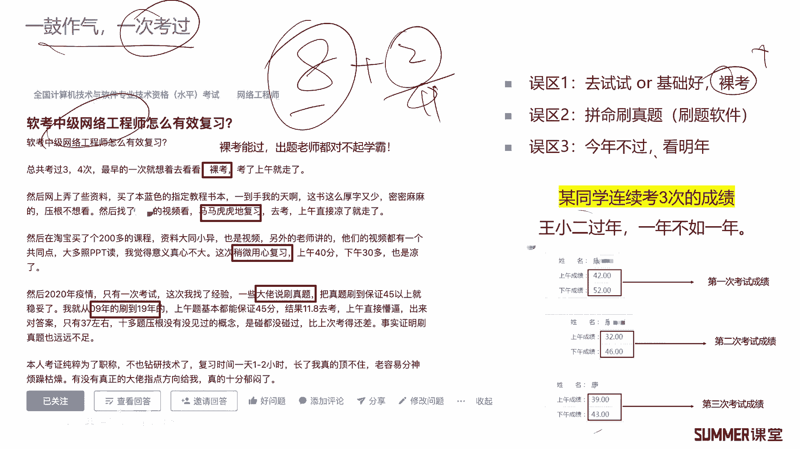

是吧啊，导向是否有用啊，我们主要看什么啊，看哪些在考，有些人说哎，反正各种各样的说法吧，高中高校没用啊，搞搞信息化的，搞搞这个基础的这些东西都没用，你搞什么编程啊，搞什么东西去。

我觉得这个其实有些说法也挺扯淡的哈，啊也挺扯淡的，最牛逼的就搞个光光刻机嘛，说这就是真钱啊，但是有多少人搞得了了，我们看一下啊，就是啊考我们软考的啊，这个人员统计，这是重庆的一个统计数据哈。

大家可以看一下，本科以上的，基本上占70%啊，所以考软考的学历不低哦，是不是啊，学历并不低啊，本科以上的70%啊，来再看一下啊，这是浙江啊，2020年软考，他们2020年软考办公布的一个数据啊。

哪现在考考高校哪些人啊，中国移动是吧，海康威视啊，中国移动啊，海康啊，厦门航空啊，什么水水水利水利局，主要这边还有还有安恒华新设计院啊，杭州银行啊，中国移动杭州地铁，是不是这些单位特别是标红的。

至少还是有头有脸的单位嘛是吧，那这些单位都还挺不错吧，是不是他们在考什么啊，在考高校，所以考这个是考这个事的人啊，整体整体还是挺不错的啊，这些人都在考啊。

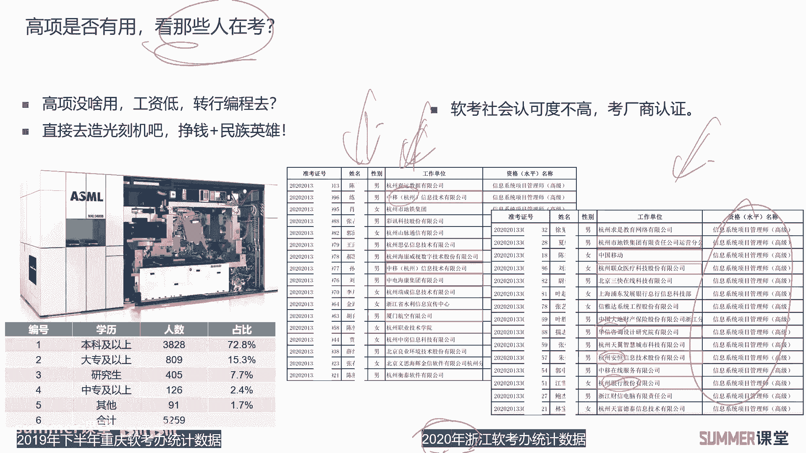

如果你还在犹豫的话，你可以参考一下嘛，可以参考一下诶啊还有一个说法哈，就是他们他们裸考都能过啊，我拼命学习也学不明白啊，有些群里面会会有各种裸考一次过的这种啊，这种炫的哈，在那炫技啊。

反正我觉得这种听听就好了啊，在知乎上都是人均百万的是吧，博士学位啊，常那个非常非常流行的一句话哈，以前就是人在美国刚下飞机，博士学位年薪百万啊，这是知乎上吹牛逼经典的套路，很经典的套路。

所以有些有些东西你听听就好了啊，真的裸考能能过的话，呃有没有这种人啊，神人啊，可能有啊，反正我觉得比中彩票的概率还低啊。

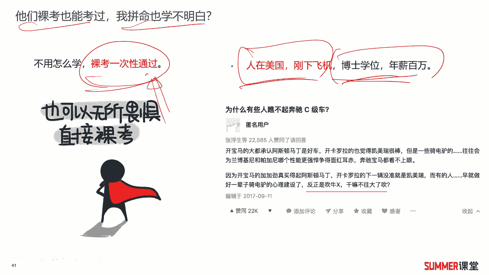

反正我是不信的啊，啊我是不信的，ok啊特别是高级这个东西，你裸考你给我整过啊，我打死我也不信啊，好接着有人问啊，直接背考点行不行啊，有时候你老师能不能把考试的重点发给我们啊，提前背啊。

包括你看有人说a老师我不学习，我被考前你总结的这个x页啊，这个问题网工哈啊，其他考试一样的啊，能不能过啊，不能啊，很明确告诉你不能，你该学的就要学呀，是吧啊，你不学，你背一下重点，你就能过啊，扯淡的。

我们给的重点，我们给的考前押题啊，这些都是锦上添花的事情啊，不是雪中送炭啊，啊我希望大家学习这个心态，还是要把那个摆正啊，该该什么阶段干什么事情啊，就要干什么事情啊，不要把我们这个最后的希望留给什么。

留给考前的一些重点啊，那么考考前的押题啊，这个心态是不对的，接着就是我们呃重可以重点参考教学的ppt哈，教练教学的ppt，你可以把它当做教材打印出来，把官方的教材啊当作字典偶尔翻一翻啊。

这是我给大家的建议，当然有些人他说我喜欢在官方教材，我我喜欢在这个教材上啊去写一些东西啊，这也可以啊，因为我们讲的东西肯定是跟官方教材是一致的，只是做了一些总结和精简啊，集中介绍精简，接着是828原则。

我们应该把80%的精力，放到重点的十大管理里面去，十大管理他占的篇幅只有20%几，就是80%的精力，都要放到这20%多的一个篇幅里面啊，把重点把握住啊，不要花很多时间去搞一些有的没的，他不怎么考的。

那就没必要嘛是吧，我觉得这本书900页哈，官方教材900页写的是有问题的啊，写的是有是有问题的，我觉得可以浓缩到什么，浓缩到呃400页应该是比较合适的，是可以浓缩的哈啊写了很多废话啊。

农村的400亿大家就压力就没那么大了嘛是吧，像晚归晚归也是它的上一版900多页，现在出了一个新版，新版，把它浓缩到了一个415页吧，就400页，我觉得这是一个趋势哈，挺好的啊，挺好的啊。

高校有可能明年就会出新教材，新教材具体长什么样，他会不会浓缩，还不清楚啊，反正我觉得这个其实现在的教材，就可以浓缩到400亿啊。

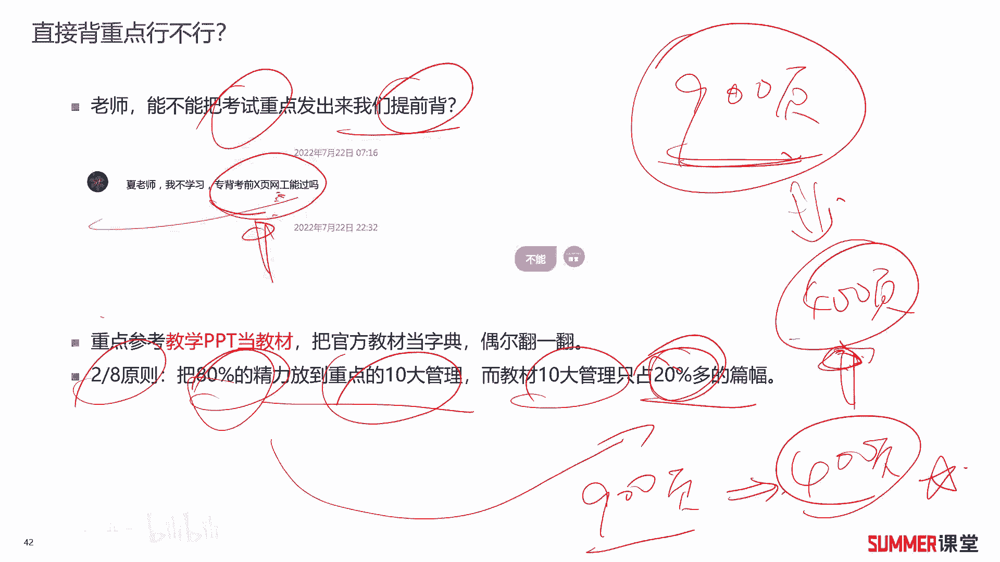

他只是给你整了很多没用的东西进去，啊最后简单说一下我们的辅导套餐哈，啊辅导套餐啊，我们现在有五门这个四门考试的辅导啊，分别是网工晚归，然后信息安全工程师和信息系统项目管理师，信息系统项目管理师。

其实今天我们讲的内容嘛，一看一共包含精讲真题解析啊，真题解析，然后还有我们专题直播，视频专题直播，包括论文啊等等，这些都会讲啊，包括论文的批改，到时候都会给大家去批改哈哈，另外配套的一些材料也很多啊。

刚刚不是给了大家几个文件吗，啊历年的真题，我们的章节练习题，然后各个专题的啊材料啊都会提供给大家，相当于我们这个课程基这个精讲和真题，这是做的录播，然后我们考前冲刺。

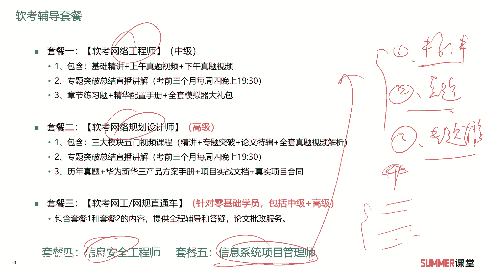

包括专题，这些是做的直播啊，是做的直播啊。

