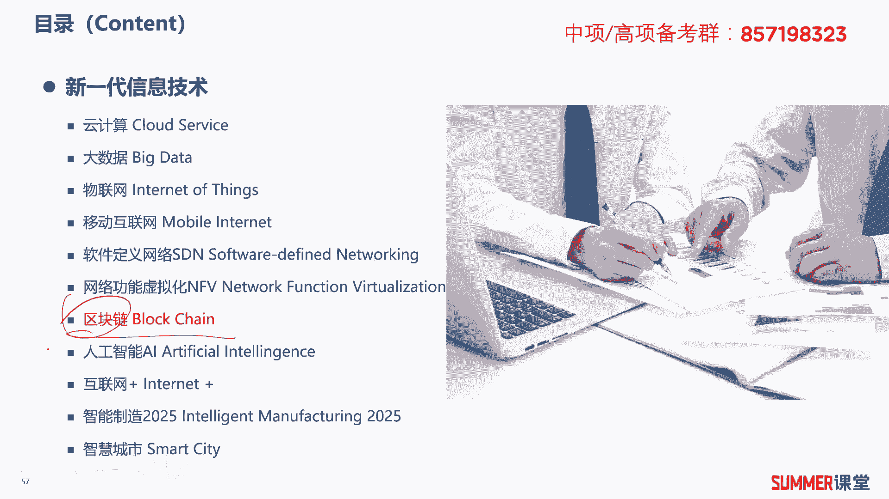
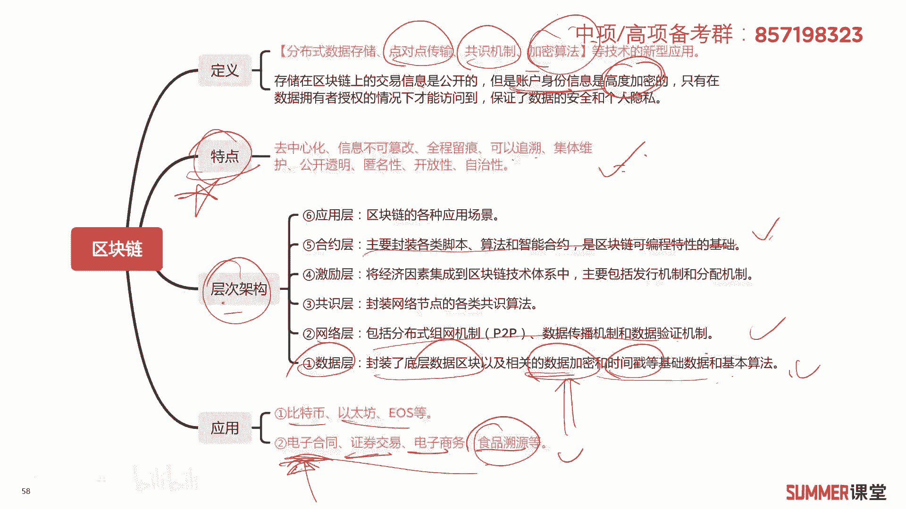
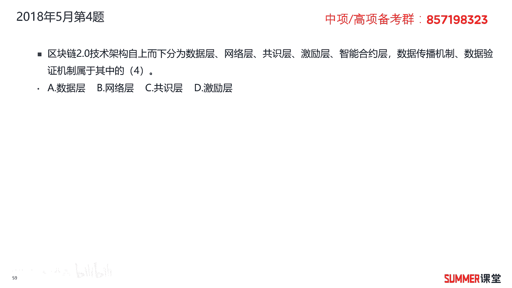
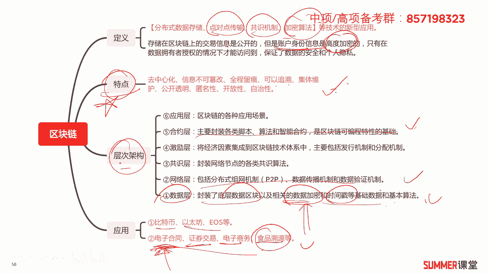
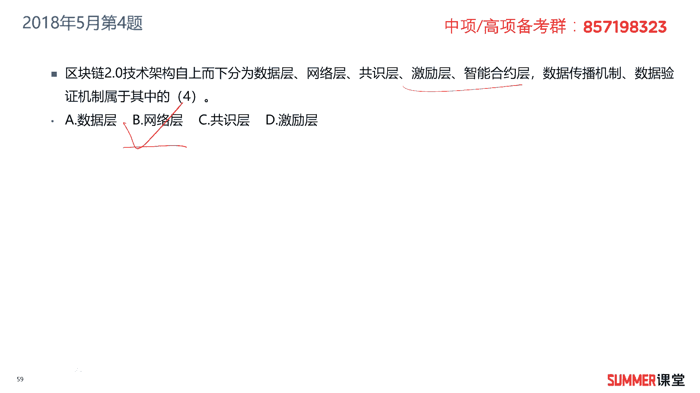
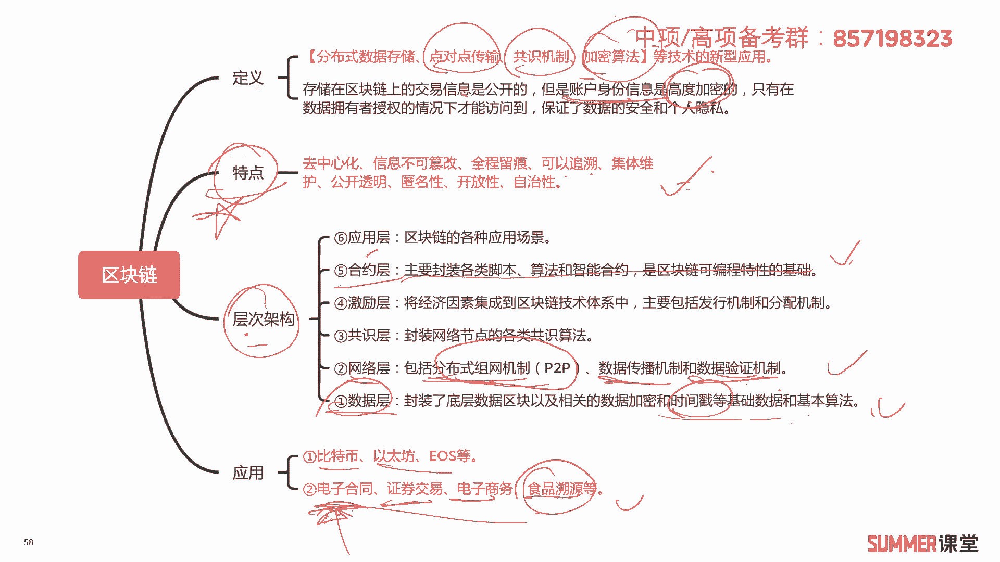
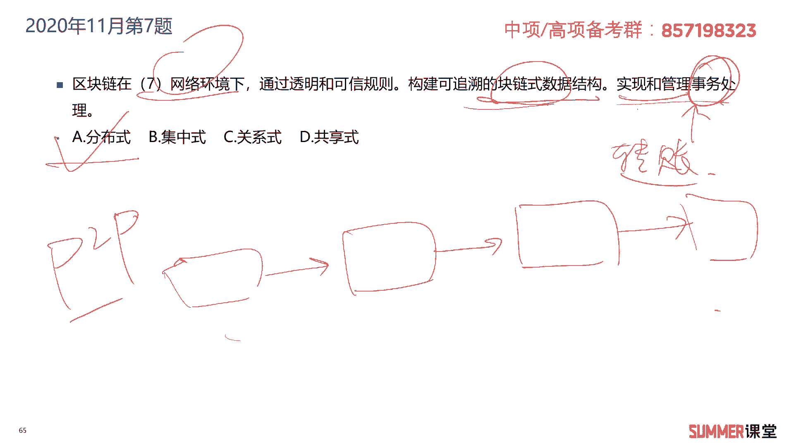
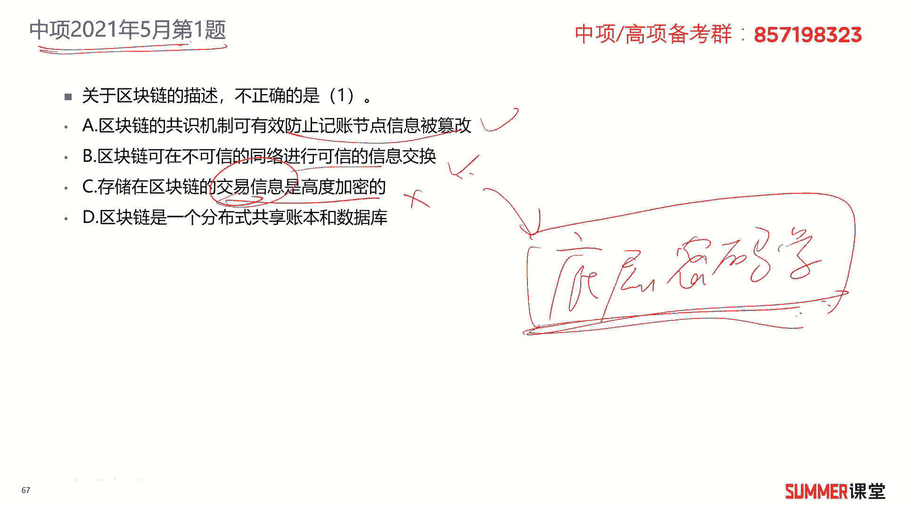
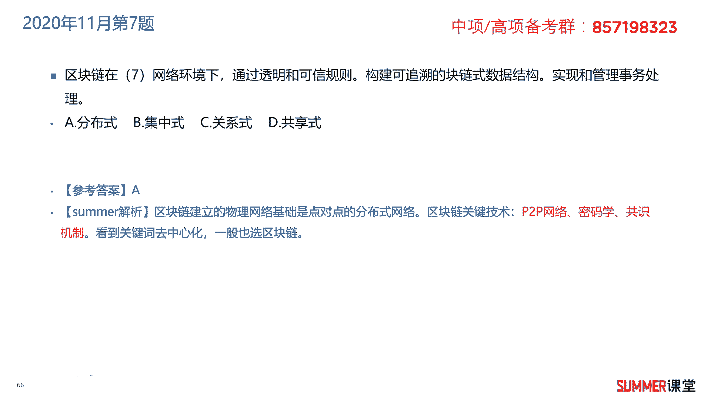
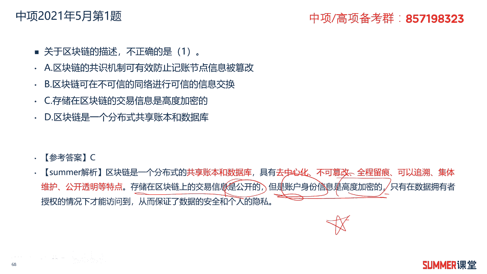

# 2023年软考信息系统项目管理师视频教程【总结到位，清晰易懂】-软考高项培训视频 - P20：1-3-6 区块链 - summer课堂 - BV1wM4y1Z7ny

我们下面接着学习区块链技术，区块链最近些年比较火，而考试也比较爱考啊，针对区块链，其实夏老师还比较熟，因为我讲过两门课程啊，第一门是区块链的应用，第二门是关于区块链的底层密码学算法啊。

为什么夏老师能讲区块链的课程啊，因为啊我以前是信息安全科班出身，所以针对加密算法，各种密码学是有比较比较深的积累的啊，讲区块链这块的话就就不存在太大问题了，ok我们首先还是来看一下区块链的定义。

区块链是分布式数据存储，点对点传输共识机制，然后加密算法等技术的新型应用啊，他应用了各种各样的技术啊，其中其实比较核心的最底层的就是密码学，各种各样的算法啊，除了加密算法之外，好像数字签名啊。

哈希啊等等啊，这些他都有应用，数据存储在区块链上，它的交易信息是公开的，但是账户的身份信息这是高度加密的啊，到底是哪个人对吧，但是这也没有确认哈，ok这就是以交易信息是公开的，但是你的身份信息是加密的。

也就是说在比特币啊，或者在这种加密货币里边是具有匿名性的，因为没有人知道你的身份是吧，只有在数据拥有者授权的情况下才能够访问到，保证了数据的安全和个人隐私，区块链的特点，这是最核心的啊。

最核心的区域中心化信息不可篡改，全程留痕可以追溯，也就可以溯源，可以溯源，那么可以用在什么地方，我们的区块链技术，食品溯源，医药的溯源，包括农业里面都可以用到它，关一切跟溯源相关的啊。

我记得以前我做过一个项目，就是食品溯源底层开发，就是用到区块链的，ok可以集体维护啊，公开透明，具有很好的匿名性，开放性，自治性这些特点，大家读一读啊，大家读一读，另外区块链的层次架构一共分成了六层啊。

一共分成了六层，但是对大家来讲，如果要把这六层吃透的话，基本上就要学一门课程了啊，我记得当时我讲的区块链底层算法当中嗯，就是围绕着这六层去讲的，每一层哪些功能全部讲完，就是一门课程十几个小时的是吧。

所以所以大家没有必要把它吃得多透，也不可能三五分钟，十几分钟，你能学多少吗，我们需要了解它有六层，这六层你简单的读一读，考试是考过网络层的，考过网络层明白，然后其他的城你简单的读一下哈啊像像数据层。

它底层主要是干什么啊，封装了底层数据区块以及相关的加密数据，加密时间出啊等等，基本的算法，数据加密在哪一层实验数据上，我建议大家把数据层，网络层这两层啊，它的这个定义和功能稍微看一下。

然后接着上面合约层啊，可以简单了解一下啊，其他的啊就稍微看一下就行了啊，稍微看一下，ok它的层次架构不作为一个重点特点，这玩意儿是重点中的重点啊，一定要啊一定要多看一下啊，熟悉一下。

接着是区块链的应用啊，早期的应用就是跟这种代币相关，比如说比特币，以太坊啊，u s等等啊，这是第一层应用，第二层应用像一些企业级的都在用电子合同啊，反正我用过电子合同啊，就是底层用用区块链的啊。

这个用过证券交易，电子商务，食品溯源，食品溯源应该是用的最多的，ok这下面一个是企业级的应用，这是关于区块链好。

我们来看练习题，2018年5月的第四题，区块链二点技术架构自上而下分层，数据层，网络层，控制层，经历层。

智能合约层，还有智能合约层，上面还有应用层是吧，嗯应该合约层上面还有应用层啊。

他没写哈，没写我们就不管它了，它数据传播机制，数据验证机制属于哪一层，属于网络层。

网络层它的功能还是给大家再读一下，网络层，包括分布式组网机制，p图p的组网，然后数据传播机制，数据验证机制，这三大机制在网络层当中的应用，ok啊这个需要记哈，数据层和网络层作为重点合约层。

你稍微看一下其他的了解一下就行了，所以这题选择必然2018年5月的第五题，区块链是什么啊，点对点传输共识机制，加密算法等计算机技术的新型应用模式，肯定不是中心化数据化区块。

区块链最典型的一个特点叫去中心化啊，区域中心化对吧啊，应该是分布式数据存储，你的数据是存在很多地方的，大家不是听过和听过一个词叫挖矿吗，嗯挖挖应该是没有用，挖怎么写的啊，挖矿挖矿的本质是什么。

本质就是你用一台显卡比较厉害的计算机，然后去存取，存取了相应的区块对吧，然后还进行相应的计算，所以这就是分布式的嘛，全国人民全世界都在挖矿，挖矿，相当于一本一本本地存了很多，很很多区块链的数据。

然后并且通过这些数据再做运算，所以是典型的分布式数据存储，分布式数据存储，选择d答案，2019年5月的第六题，区块链的特征不包括什么，不包括中心化呀，典型的去中心化是开放性的，信息不可篡改。

匿名没有问题，所以选择a答案，区块链的特征要求记忆哈，去中心化，开放性，独立性，安全性，匿名性，信息不可篡改啊，这几个特性，2022年11月的第七题，区块链在什么网络环境下。

通过透明和可信规则构建可追溯，块链式数据结构啊，什么叫块链式数据结构，就是一个块，然后一个链一个块一个链，这就是区块链它的数据结构啊，具体里面长什么，长什么样，你就不用管了哈哈。

具体里面长什么样就不用改，这就是块链式结构，它实现啊实现和事物实现和管理事务处理啊，这这什么意思啊，是构建可追溯的跨链式结构，实现和管理事务的处理，就是通过这种数据结构来实现和管理，一些事务的处理。

典型的事物有哪些啊，比如说转账嘛，比如说比特币的转账藏应该是贝壳，哈哈背背指头，对吧啊，你转比特币啊，这就是事物的处理嘛啊，通过这种块链式结构来进行的，在什么环境之下，在什么网络环境。

那肯定是分布式网络环境啊，p two p嘛是吧啊，p two p分布式网络环境之下。

所以这道题选择a，那接着来看一道中项的题，2021年5月的第一题，关于区块链的描述不正确的是哪一个，区块链的共识机制科，可以有效地防止记账节点信息被篡改，i没有问题，可以防篡改i。

b区块链可在不不可信的网络上进行，可信的信息交换，可以通过什么来实现的，通过底层密码学，通过底层密码学来实现的，它其实底层用了各种各样的密码算法，对称加密，非对称加密哈，希数字签名啊，还有还有还有什么。

我能想到就这么多哈，反正都有应用，全部都有应用，还有包包括复杂的数据结构，二叉树啊等等等等，我们只需要知道，底层用复杂的密码学，来保证他可信的信息交换就行了好吧，c存储在区块链中的交易信息是高度加密的。

存储在区块链的这个交易信息没有加密啊，没有加密，但是用户的账户信息也是加密的，是吧啊，所以c是错的，这道题考的就比较隐蔽哈，你别看它是中项，那是中级的题啊。

像这种题的话，在某种意义上来讲，比我们前面考的这种高级的题，还会更难一点是吧。

你看前面考了几个，这个高级的题都是简单粗暴的，而中级的题还给了你一个啊，判就是判断是否正确的，那这种题要稍微难一点啊，要稍微难一点，d区块链是一个分布式共享账本和数据库，没有问题啊。

分布式的共享账本和数据库，所以这道题选择c答案稍微记一下，就是存储在区块链上的交易信息，这是公公开的，但是账户的身份信息是高度加密的，哪个加密，哪个公开，一定要注意。

