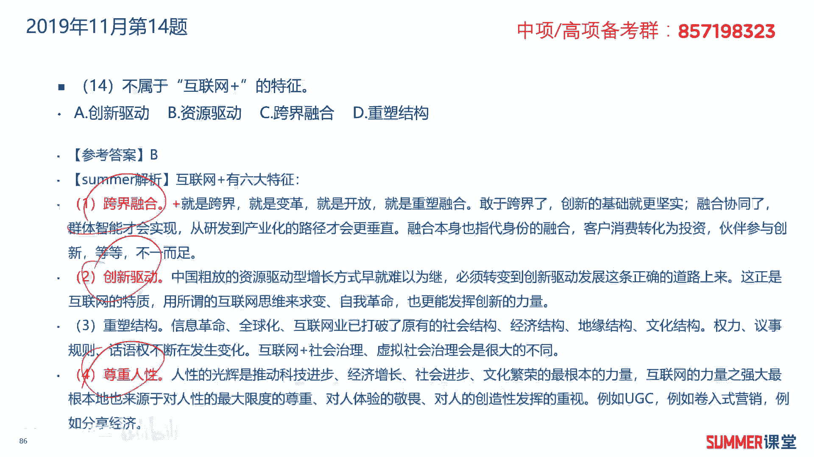

# 2023年软考信息系统项目管理师视频教程【总结到位，清晰易懂】-软考高项培训视频 - P22：1-3-8 互联网plus - summer课堂 - BV1wM4y1Z7ny

我们接着学习互联网加，什么是互联网加呢，互联网加它定义其实就是我们的互联网，然后加上各个传统行业啊，当然并不是简单的两者相加，而是利用信息通信技术以及互联网平台，让互联网与传统行业进行深度融合。

创造新的发展生态，最典型的外卖行业，就是互联网加的一个应用是吧，其实外卖以前都有，但是现在我们可以通过手机点外卖，是不是就方便了很多，手机加上a p p加上平台，这是典型的互联网。

然后外卖又是传统的行业啊，所以一两者一叠加，你发现现在就一个外卖解决了多少人的就业嗯，你送餐嘛上百万人啊，这毫不夸张的，所以他是不是诞生了一个新的发展生态啊，啊诞生了一个新的发展生态。

就是我们的互联网去赋能，去数字化了我们的传统行业，这叫互联网加互联网加行动啊，可以助推传统产业的转型升级，提升制造数字化，网络化，智能化的水平，主要是理解什么是互联网加。

它的核心定义就是互联网加上传统行业，通过互联网为传统行业赋能，互联网加的方向啊，包括智能制造，大规模个性化的定制，网络网络化协同制造，服务型制造，了解一下了解一下啊，六大特征，跨界融合，创新驱动。

重塑结构，尊重人性，开放生态，连接一切，考过的多读一下，多读一下，另外还有工业互联网，它是通过系统构建网络平，台，安全三大功能体系，打造人机物全面互联的新型网络基础设施，工业互联网啊。

有些地方也说公共网络是吧，形成智能化发展的新兴业态和应用模式，多读一读哈啊，这种不让你背，但是你要多读一下六大特征，这是要稍微记一下，考试考过啊，考试考过，然后方向的话标红的你也记一下。

好我们下面来看一下练习题，2018年11月的第20题，实现互联网和传统产业的联合啊，后面你都不需要看了，互联网加传统产业，是不是互联网加了，那直接选择就走了啊，选择d答案。

2019年5月的第20题，什么不属于互联网加的应用，滴滴打车，很明显属于，它是属于互联网跟传统打车行业的一个融合，外卖属不属于外卖，以前也有嘛是吧，但是现在我们用app来点外卖啊，共享单车啊。

其实单车共享汽车以前很多地方都有，只是一直没有用起来，但是诶你把这个玩意儿给你整到什么，给你整到手机app里面就很好用了，因为以前很多城市有这样的共享自行车，但是你还要去相关部门办一下什么卡。

多少人去那儿办吧，太麻烦了对吧，而且还让你提供什么居住证之类的，有些人可能没有没有居住证也没法办啊，所以很明显共享单车也是互联网加的应用，阿尔法go呢它是人工智能的应用，那就是一个机器人下围棋很牛逼。

这是典型的人工智能嘛对吧，阿尔法go谷歌开发的一款啊下围棋的机器人，什么不属于互联网加的特征，创新驱动，资源驱动，跨界融合，重塑结构，没有资源驱动是吧。

互联网加的特征，跨界融合，创新驱动，尊重人性啊。

真正人性啊这么几个哈，互联网加是2020年11月的第14题，互联网加是利用信息，通信技术以及互联网平台与什么深度融合，与我们传统行业深度融合。

