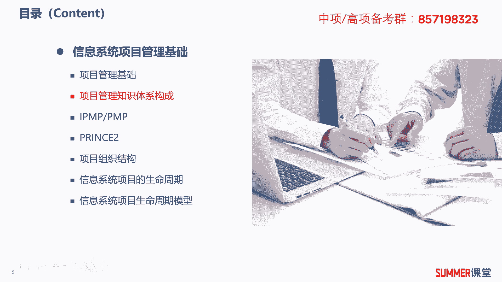
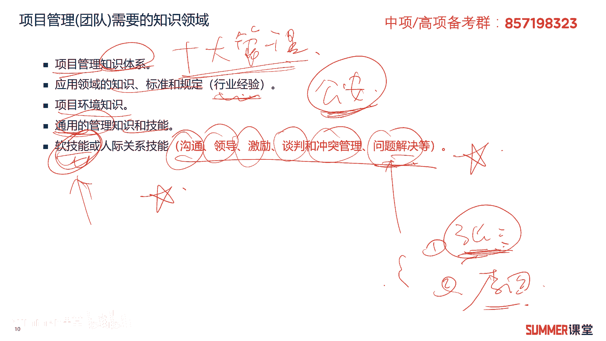

# 2023年软考信息系统项目管理师视频教程【总结到位，清晰易懂】-软考高项培训视频 - P24：2-2 项目管理知识体系构成 - summer课堂 - BV1wM4y1Z7ny

我们接着来看项目管理知识体系的构成，首先项目管理团队需要掌握的一些知识领域，第一个是项目管理的知识体系，那这个我们在高校啊，后面会讲重要的就是十大管理嘛是吧，那重点的就十大管理啊。

每个章节会给大家讲到的，另外就是应用领域的知识标准以及规定，说白了就是行业经验，比如说你重点是做公安的项目，你对公安这个行业了不了解，对公安的业务系统知道多少，里面有哪些标准和规定。

最近些年又出了哪些政策啊，其实中国有句老话叫做隔行如隔山，你做项目经理，如果你是在政府或者公安某个行业深耕的，那么35年之后，你有几个大型的项目经验，可以说你找工作还是比较好找的对吧。

当然你说教育做医疗也是一样的啊，虽然说我们十大管理的这些东西是通用的，但是要想拿到高薪，我建议大家还是要在某一个行业里面深耕，这个东西是比较比较深的，壁垒不是那么容易学的。

而十大管理这个你叫一个应届应届生来，他也能学对吧，但他的他的问题在哪，就是他的行业经验不足你吗啊，所以可能他刚毕业拿5000块钱一个月，而你工作35年之后，你能拿一两万，两三万都可能是吧。

那接着就是项目环境，知识环境有宏观环境，有微观环境就不同，客户内部环境都不一样是吧，这也是需要大家掌握的，另外就是通用的管理技术和技能，跟我们第一点有什么区别啊，第一点主要是项目管理的对吧。

这是通用的一些管理，那通用管理比项目管理还要更泛一点吧，管理学嘛啊有兴趣，一般你做项目经理之后啊，老板都会送你一两本管理上的一些书籍是吧，各种各样的一些小故事啊，你都可以去看一下啊。

肯定是作为知识扩展的，最后一个是软技能或人际关系技能，你看我标红了，这东西是很重要的，说实话，项目经理对你的技术要求其实不是那么高，你只要会和稀泥，你知道这个问题找谁去解决就行了。

相对而言对软技能要求比较高是吧，沟通领导，激励谈判冲突，管理问题解决这些能力问题解决，不是说这个问题你要亲力亲为自己去解决，而是出了这个问题，你知道找找张三是吧，出了另外一个问题。

你知道李四是这方面的专家，协调他来干，这就是问题解决嘛对吧，而且你还能把张三和李四要过来，因为张三和李四可能在其他的项目上，也有可能，职能经理给他安排了一些比较忙的事情，怎么把他叫过来。

是不是就要跟相应的人去沟通啊，跟谁沟通啊，有可能是直接跟张三沟通，你跟他关系比较好，那ok也有可能是找你找领导去沟通，还有可能是跟张三的领导去沟通是吧，这就牵涉到很多软技能了啊。

比如说一这这这怎么怎么把他要过来，跟张三跟张三这个喝一顿酒，说这个就是书上不会讲，但是但是这是在实际项目当中经常会遇到的哈，啊，或者承诺诶这个项目完了之后，我给你给你搞一个什么什么荣誉是吧。

将来对你升职有用啊，或者我直接给你发多少钱的奖金，这些都是都是什么，都是软技能啊，有些东西甚至不不能放到台面上来说，但是很重要，这是实际管理，那项实际做项目管理肯定需要的，ok这先了解一下啊。

啊特别是软件能，这是历年考试的一个重点选择题，考过好几次了。

软技能包含哪些东西，包含这些，接着项目经理啊，什么是项目经理呢，那项目经理是由执行组织委派的领导团队，实现项目目标的啊，这么一个人啊，这里面需要注意是由谁委派，就一般由你们公司领导委派嘛是吧。

然后他是他是个人个人问你一个问题，他是一个人还是两个人啊，大家不要笑哈啊，我记得我我去年还是什么时候评一个标啊，评一个标，他的招标文件要求，这个项目经理有p n p证书得一分，然后有高校证书得两分。

然后如果同时有的话，那就得三分嘛是吧，就得三分，然后有一家公司，他他没有一个人同时有这两个证书，那就他就委任了两个项目经理，一个有偏僻，一个有高校证书，问你，最后他能不能得三分，能不能很明显不能嘛。

项目经理是一个人，那不能这样凑数的是吧，那就跟我本来要一个项目经理，我要他是研究生加上高校证书，我要这样的一个项目经理，但是你给我一个小小学生，这个小学生他有高校证书，再给该再给我研究生。

这个研究生他啥都没有，刚刚毕业，两个人组成一个项目项目经理团队，然后来领导我这个项目行不行，很明显不行啊，项目经理是一个人，那不然到底有谁说了算呢是吧，有人说哎主主项目经理和副项目经理啊，瞎扯淡哈啊。

没有这种说法，ok这需要注意哈，另外它是实现项目目标的，项目后期的运营跟项目经理有没有关系，没关系啊，项目后期的运营，这项目已经交付了，跟项目经理没一毛钱关系了，这需要注意，因为项目经理的责任和能力。

需要了解一下项目经理的责任三三块哈，第一个要完成组织安排的任务，要满足团队的一些需求啊，就我的项目团队可能我要想挣什么荣誉啊，你要尽量去帮人家去争取，还有一些个人需求，在团队里面。

有些人是可能是想要荣誉的，有些人可能是想挣钱的啊，所以该要荣誉的，你就颁颁发点什么奖章啊，奖状啊啊想要钱的年终奖给大家多发一点，是不是啊，这是他的一个责任哈，然后能力第一个知识能力，这不用说嘛。

学高校啊肯定要学一些知识的，实践能力就经验了，还有就是个人的能力偏向于软技能，哪些软技能前面已经讲了啊，什么沟通啊，交流啊，问题解决啊等等，这个是比较重要的哈，啊比较重要的。

另外针对如何做好一个项目经理啊，这个给了一些文字哈，就自己读一读啊，什么奖罚分明啊啊有计划呀，然后注重用户的参与呀，都是一些屁话是吧，最后一句话比较重要，项目经理必须承担起，管理者和领导者的双重角色。

这是考试考过多次的选项啊，给你一个项目经理是领导者啊，不是管理者或者项目经理，是是管理者，不是领导者，都是错的啊，都是错的，项目经理既是管理者，也是领导者，那么还有一个问题。

就是管理者和领导者有什么区别啊，有什么区别啊，这个我就不放在这儿给大家去讲了，后面还会给大家去讲好吧，先把这句话给我记住。

