# 2023年软考信息系统项目管理师视频教程【总结到位，清晰易懂】-软考高项培训视频 - P26：2-4 项目组织结构 - summer课堂 - BV1wM4y1Z7ny

好我们接着来看项目的组织结构，你可以把它看作这个小节是必考的，知识点非常重要，所以大家一定要理解。

按照分类，我们可以把项目的组织结构分成如下的四种，职能型组织，项目型组织和矩阵型组织，以及还有一个复合型组织，当然考试来讲，第四个复合型组织了解一下就行了啊，基本上没怎么考过考试。

考的最多的肯定是前面三组，那前面三种，所以我们首先来看一下第一种，项目的组织结构啊，职能型组织，职能型组织，是把组织分成一个一个的职能部门啊，然后每个部门都有职能经理是吧，比如说诶我们常见的这是开发部。

这是测试部，这是财务部，就是有一个一个的部门，每个部门有他的部门经理，然后下面有很多的员工对吧啊，这种组织架构里边，每个员工他都有一个明确的上级，也就是每个这个部门的部门经理会叫职能经理。

按照专业可以分成很多职能部门吗，啊什么开发部，设计部，运维部，测试部，财务部等等，这个应该很好理解是吧，它的特点是如果是这种组织架构的，如果我们的项目采用这种组织架构的话，一般是没有全职项目经理的。

项目经理是兼职的，一般来讲我们把它叫做联络员，比如说这里面标黑的这几个员工，我们构成一个小的，构成一个小的这个项目组织，然后是一个小小的项目组织，没有专职的项目经理，那如果a要跟c去沟通去联系的话。

他们能不能直接沟通联系，能不能由于跨部门呢，是吧啊，不能直接沟通，怎么沟通的，一般一般是由a去把问题反馈给a的部门经理，a的部门经理去找到b的部门经理，然后b的部门经理再去找到c这个员工。

所以他们的协调路径或者叫沟通路径，一般是这样子的，这是考试考过的哟，好问你这样的一个沟通路径，我们的项目的组织结构是采用的哪种组织，肯定是智能型是吧啊，它还有一个特点就是职业路径比较清晰。

横向联系偏弱啊，就是这个员工在我的a部门里面，比如说a部门就是开发部，那就开发部，他知道以后怎么一步一步的去发展对吧，我先做在开发部做个2323年啊，积累经验，积累经验之后。

慢慢的我可能要做一个资深的开发工程师啊，在在网上我可能需要做到部门的副经理，那最后做到部门经理职业规划是比较清晰的，横向联系比较弱，这个就很好理解了，刚刚不是解释了嘛对吧，比如说a和c，b和c要联系。

他们不能直接联系，因为他们跨部门要通过职能经理去转一下，ok这就是职能型组织它的特点。

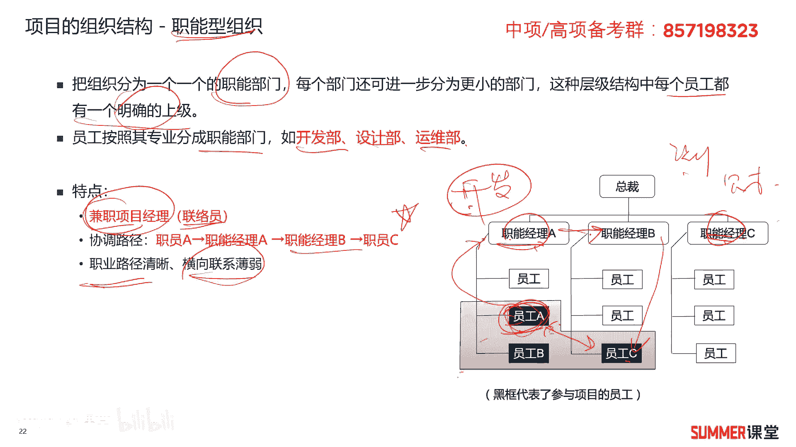

然后我们再来看一下啊，就是职能型组织的优缺点，希望大家能够理解哈啊，能够理解他的优点是便于知识技能，然后经验的交流。

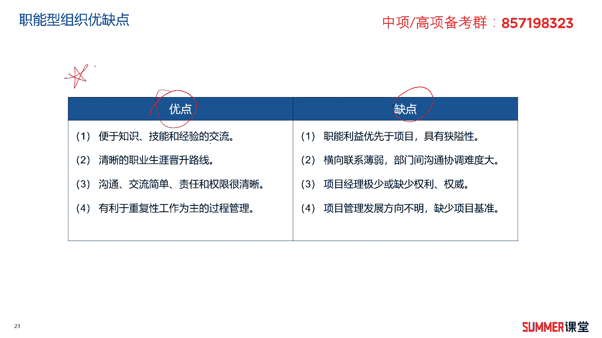

什么意思啊，啊不是因为我是在职能组织里面，比如说我是在开发部里面，我开发部有很多人，而且有些人可能是大神，遇到问题，我是不是可以向他们请教对吧，他交流经验是在我的职能部门内交流。

不是我标黑框的这个里面交流明白是吧。

刚刚已经讲过了啊，我们怎么一步一步从小白变到资深的工程师，最后做副经理，最后做到经理的岗位，然后沟通交流简单，责任和权限比较清晰啊，第四个有利于重复性工作为主的过程管理，比如说你在一个职能性组织里面。

你就是开发工程师，你干的都是软件开发的事情是吧，这块基本上都是重复性的嘛，这是他的优点啊，缺点的话也有几个啊，第一个就职能利益优先于项目具有狭隘性。

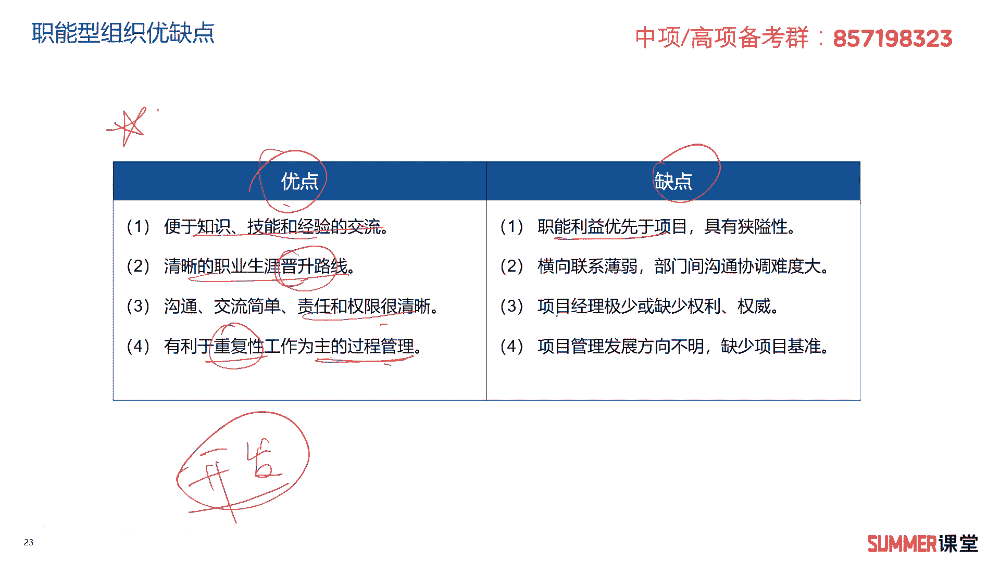

比如说我们刚刚讲的，就是这三个员工构成一个项目的组织，他肯定以部门经理发的信号为主是吧，肯定以我本职工作为主，相当于你这个项目组织的话怎么讲呢，就是我有空的时候可以可以干一下你的事情啊，没空的时候。

那么我肯定是干我本职职能类的一个事情对吧。

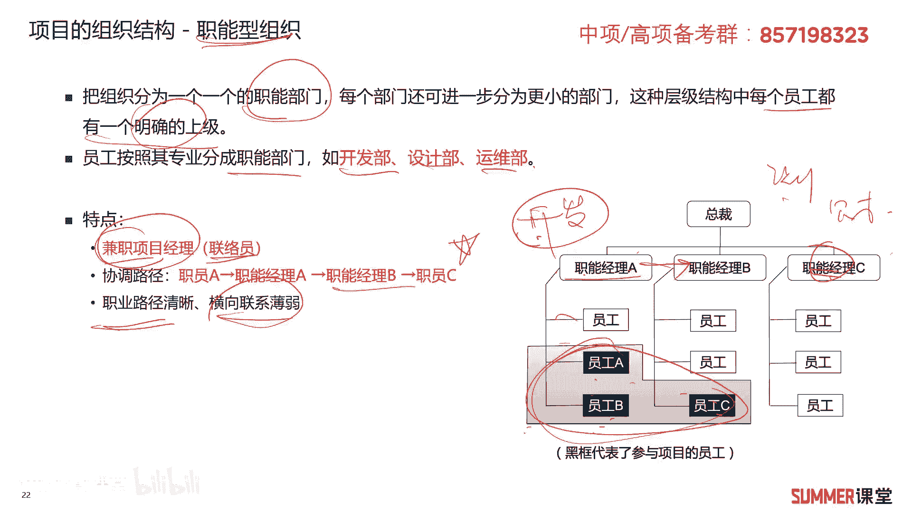

所以对项目来讲是不太友好的，好横向联系比较弱，部门之间沟通协调难度比较大，沟通渠道是不是挺长的呀，刚刚已经讲过哈，这是一个重点的一个考点，第三是项目经理极少或者缺少权力和权威，项目经理都不是全职的。

是一个兼职的联络员，他权利肯定是比较小的，第四项目发展方向不明，缺少项目的基准啊，这就有点类似于你们公司准备在某一个节日啊，主持一个合唱啊，组织一个和尚，然后这时候你们公司可能就推荐两个。

唱歌比较ok的啊，这种啊这种女同学，然后让他带领大家进行一个合唱，这其实是不是就是一个临时的一个项目啊，对这个合唱来讲，未来这未来向未来发展没有明确，有没有很好的项目基准，那可能就完成一下任务对吧。

至于能合唱达到什么程度，这个东西没有没有那么权威是吧，这就是职能型组织啊，这两个女同学相当于就是兼职的项目经理，对吧啊。

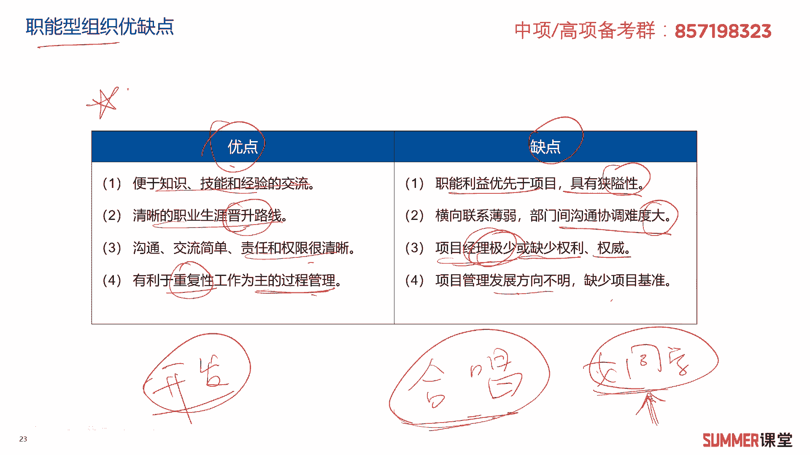

职能型组织的优缺点，希望大家能够理解，那第二种项目的组织结构叫项目型组织啊，组织被分成一个一个的项目经理部，看到没有，就一个一个的项目经理部，然后由项目经理管下面很多的员工，这个员工有各种各样的啊。

有各种各样职能的对吧，有些可能是搞ui的，还有一些可能是搞设计的，那当然也有财务等等，项目团队的成员直接隶属于某个项目，而不是某个部门啊，比如说这个里面的搞ui的这个人，他直接就是项目经理管对吧。

而不是属于ui这个部门的啊，根本就没有ui这个部门明白啊，绝大部分的组织资源直接配置到项目工作当中，项目经理拥有相当大的独立性和权限，就是你你的你的工资由谁决定，由项目经理决定。

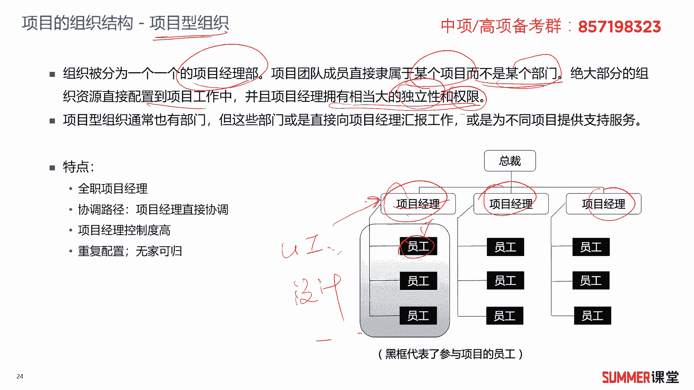

由他全权来管，而前面的职能部门啊，职能部门员工的工资由谁决定。

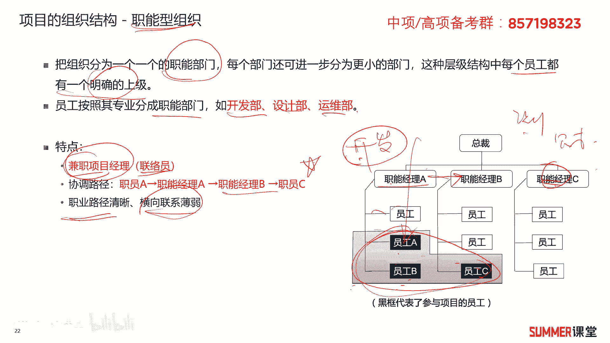

涨薪由职能经理说了，算是吧，这两种其实就是比较极端的哈。

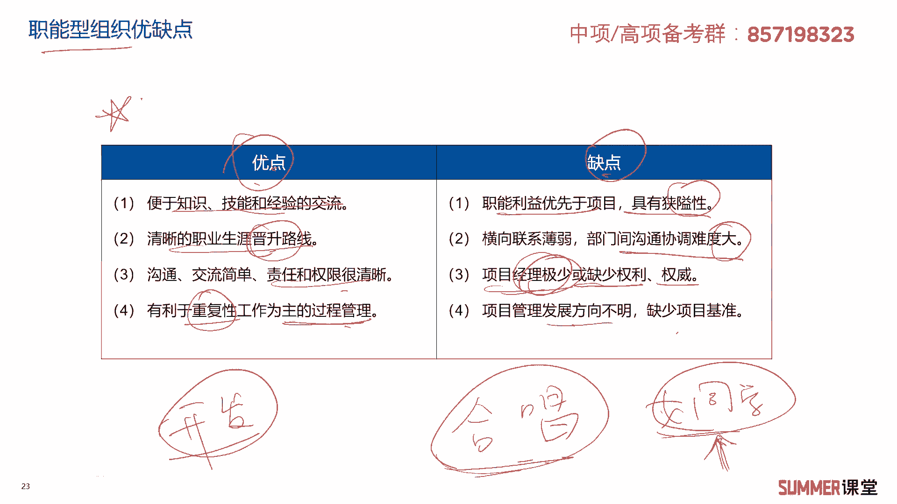

比较极端的一个架构，项目型组织通常也有部门，如果你很大哈，他可能啊可能这个项目型组织里面，比如说我的这个项目，项目经理下面管着100人呢，那不可能100人全部由项目经理一个人管嘛。

它里面也有可能有一些部门是吧，但这些部门都是向项目经理汇报的，是不是啊，都是向项目经理汇报的，相当于这个项目经理，就有点像分公司老总这种感觉，对吧啊，或者是他也可以为不同的项目提供一些支持，服务。

怎么讲呢，其实严格来讲项目型组织架构，它下面的这些人只能为一个项目去提供服务，严格意义上来讲哈，但是他这里面既然提到了，就是比如说这个项目项目经理，有个部门专门搞ui设计的。

ui就是图形界面的设计嘛对吧，可能有些时候诶这个项目做的差不多了，他们也比较闲，可以把它抽掉过去给其他的项目展示的服务，但是这些人是归谁管的呀，还是归我项目经理，这个这个项目经理管的是吧啊。

这种项目型组织它的特点是有全职的项目经理，不仅有全职的项目经理，而且项目经理的权限非常非常大，下面的下面的人的工资，这些都是归他管的，管钱是最牛逼的是吧，那我们做项目就知道哈，就是钱是由哪个部门出的。

哪个部门的话语权一般都比较大，然后协调路径比较方便，下面所有的人都可以由项目经理直接协调嘛，对吧，你都是他下面的小弟啊，他给你发工资啊，那你的年终奖也有他决定啊，他发什么指令，你能能不听吗是吧。

所以他的权限很大，项目经理控制程度比较高，但是也可能会出现问题啊，什么问题，重复配置无家可归，什么叫重复配置呢，比如说我只是一个小项目哈，这项目经理下面就管着三五个人啊，三五个人。

其中有一个ui搞搞图形化界面设计的是吧，这样的一个工程师啊，小王，比如说我这个项目项目1年12个月，但是我ui设计可能前三个月比较多，后面四到12月的话就是一些打酱油的工作了，基本上就比较闲。

你这个小王，你这个ui设计师，你还得还得在这个项目上待1年对吧，然后然后你你这其他的这几个月，该打酱油还是得打酱油，比如说另外一个项目啊，这项目a另外一个项目b，同样的他也是这么大的规模。

也跟这个项目比较类似，它也要单独配一个ui工程师是吧，你要单独配一个ui工程师啊，其他项目也是一样的，这是不存在重复配置啊，啊存在重复配置，如果是职能性架构的话，可能就需要小王一个人就够了。

那前三个月跟他服务，然后后面跟他服务，在后面给他服务啊，责任先锋组织，就可以把这个人调给不同的人去用嘛，但项目型组织，你小王就是我项目经理a的一般情况，正常情况或绝大部分情况。

你就是专门为我的项目a去服务，你是不会调给其他人去用的，但这里面有提议主哈，就是它可以为不同项目提供一些支持服务，但是主要的还是为他服务，存在重复的配置是吧，项目结束之后。

是不是你要可能就会卷铺盖走人了，跟农民工一样，这个经理这个工地做完了，那么你自己去找工地，找不到工地的话，就就回家啊，呆呆着去，后面有工地之后再出来，所以这种项目型组织架构，就跟农民工就比较类似啊。

这个项目做完了，那有可能就不需要你了，你你就撤了，你就被开掉了对吧。

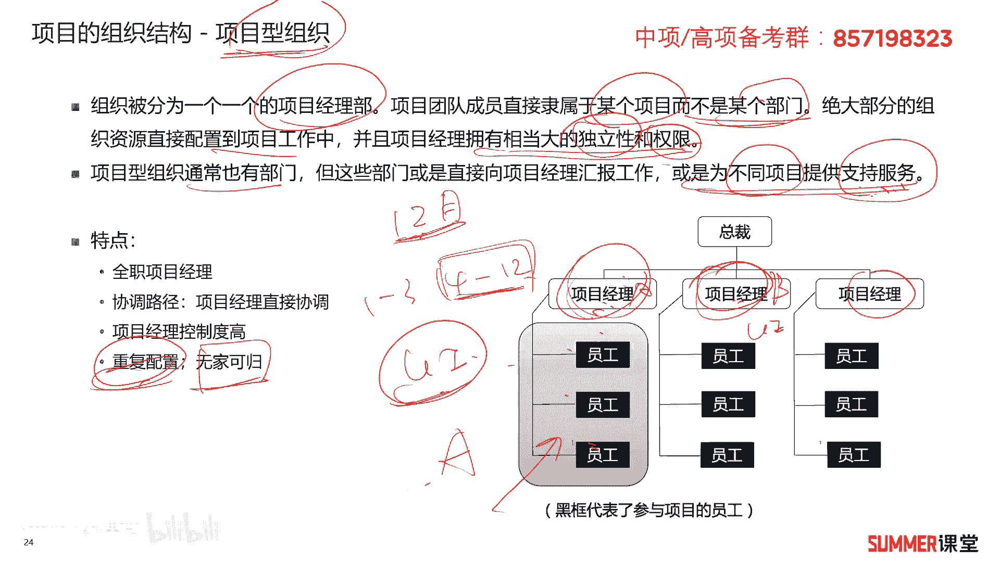

那它的优点和缺点，我们再给大家去总结一下啊，优点责权分明，利于统一指挥，项目经理统一指挥吗，有明确的目标啊，沟通比较简洁，比较方便啊，决策比较快，项目经理职业决策是吧，缺点机构啊重复啊。

资源可能会存在一些闲置，不利于员工专业技术水平的提高，什么意思啊，好特别是一些小的项目哈啊，一些小的项目可能里边搞设计的，就你一个人，你遇到问题之后，你问谁都不知道对吧。

前面的职能性组织就不存在这个问题，我一个职能部门里面搞设计的，就是一个设计部嘛，设计部里面不可能只有一个人的呀，但是我的项目部里面搞设计的，可能就只有一个人是吧，那相当于我一个人独自为战。

然后我怎么进行专业水平的提升啊，遇到问题问谁呀，我不知道啊是吧，所以一般刚毕业的，其实不太建议大家进行这种项目型组织啊，因为你的专业能力提升会有个很大的一个瓶颈，第三员工缺乏事业上的连续性。

连续性和保障，刚刚不是说了吗，项目完了，卷铺盖走人，ok这是关于项目型组织的优缺点啊。

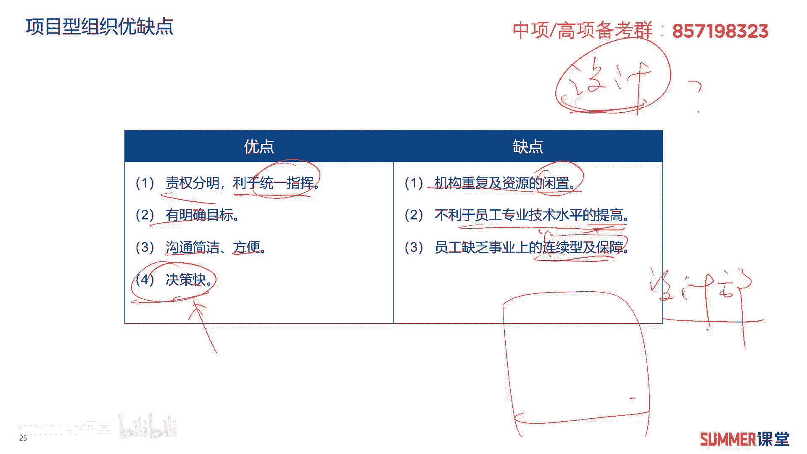

主要是理解，不需要大家死记硬背，接着另外一种比较重要的表情，哈哈非常重要，考试考的很多的矩阵型组织，矩阵型组织，他的项目团队成员来自于相关部门，可以来自于很多部门，你看比如说这就是我的项目团队对吧。

有项目经理，项目经理是专职的，我项目的成员可以来自于不同的职能组织部门，你是搞开发的，你是搞设计的，你是搞测试的等等对吧，然后有不同部门的人来拼凑起，我的这个项目团队成员，o，我项目团队成员。

同时接受部门经理和项目经理的领导，你这个员工既是我这个部门的，也是我这个项目组的是吧，双重领导，双重领导，矩阵型组织兼有职能型和项目型的特征，他举证的嘛对吧啊，依据项目经理对资源。

包括人力资源的影响程度，矩阵型可以分成弱矩阵，平衡矩阵和强矩阵，什么意思啊，就这个这个员工他主要听听我部门经理的，还是听项目经理的，如果主要听项目经理的，那么就是强取人性架构，如果是主要听职能经理的。

那这就是这就是弱矩阵架构对吧，如果他们两边听的差不多啊，都听这是平衡型矩阵啊，平衡型数据平衡矩阵型组织，ok啊，这么三种啊，三种矩阵哈。

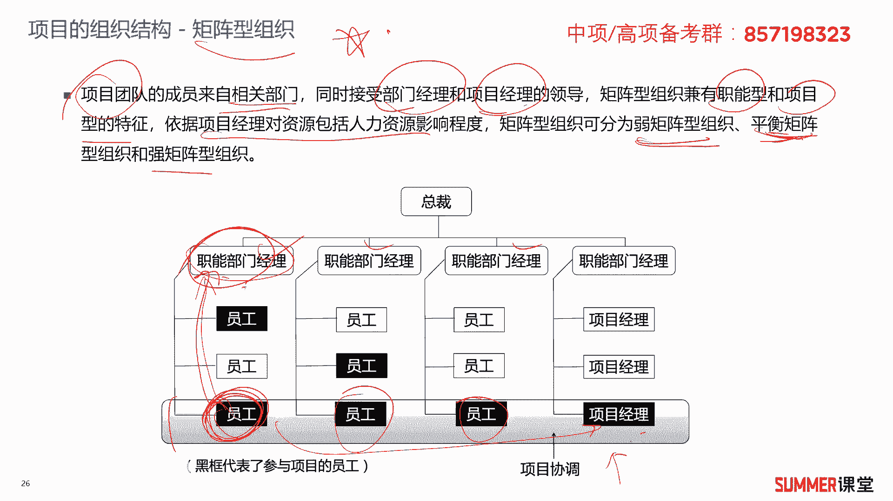

另外矩阵型组织啊，优缺点优缺点特别是优点你看比较多哈，比较多，给大家简单看一下，第一个项目经理负责制，有明确的项目目标，它是有专职的项目经理的对吧，能够及时的响应啊，有项目经理同意的去做协调。

第四个能获得职能组织更多的支持啊，因为项目组织不是单独的项目部嘛，你跟职能经理是有有关系的对吧，特别是人力资源这块，你要向职能组织去提一些啊，提一些人力的要求啊，第五个最大限度地利用公司的稀缺资源啊。

怎么理解啊，比如说开发部有一个大神啊，开发部一个大神，他其实就属于开发部的嘛是吧，他属于开发部，但是我有ab c3 个项目，我都想用这个大神啊，都想用这个大神，可能a去去去跟那个开发部的职能经理。

协商一下诶，我用1~3个月啊，b我用4~6个月，c我用8月这一个月是吧，是不是大家都能够获得这个大臣的支持啊，那如果是项目型组织啊，项目进组织，然后发现a这个项目啊比较大，然后项目经理也财大气粗。

给这个大神开的工资高，然后好他就去项目a了啊，他基本上就是为项目a提供服务的对吧，你bc想用这个大神用不了，对不起啊，其实虽然我们前面有提一嘴哈，他可以为其他项目提供服务，但实际操作的时候。

这种项目型组织，基本上他就专职为一个项目服务了，你想为其他项目服务，这个很难啊，真的很难，但是矩阵型是不是就不存在这个问题了呀，可以利用器械资源，改善了跨职能部门间的协调合作。

你看这些人都来自不同的职职能部门。

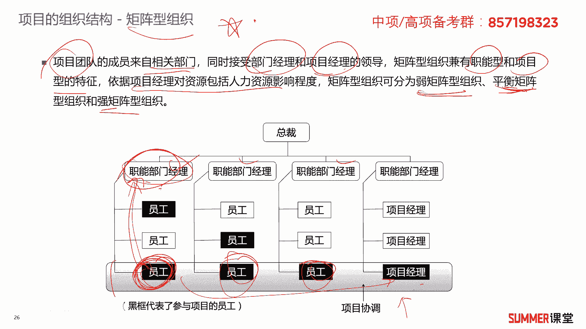

最后由项目经理统一的去沟通协调嘛是吧，所以能改善跨职能部门间的协调和合作，使质量成本，时间等制约因素得到比较好的平衡，团队成员有归属感，那什么叫有归属感，因为团队成员你还是属于职能部门的嘛对吧。

我项目结束后我能回来呀，啊项目结束后，我还有有有地方可以去，士气比较高啊，相对而言问题会比较少，出现冲突出的概率比较少啊，能够比较容易的解决掉，有问题找领导吗，是吧啊，有问题找领导。

而且有两个领导可以帮你解决问题，一个是项目经理，一个另外一个是职能经理，当然也有缺点，管理成本会增加啊。

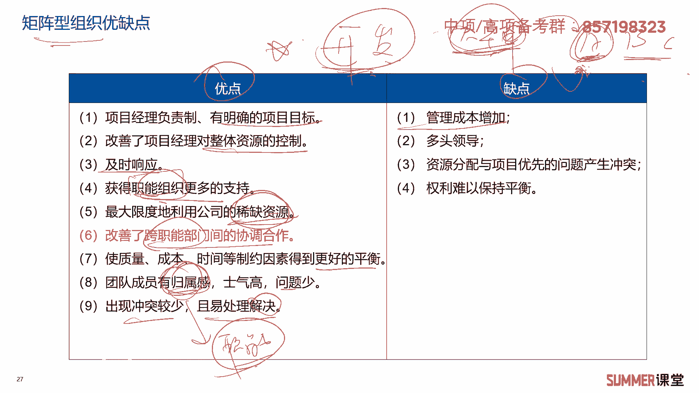

主要是有多头领导啊，什么叫多头领导，你看这个员工接受指责人经理的管理，也是项目经理管理，有些时候指令是会冲突的，冲突之后我听谁的呀。

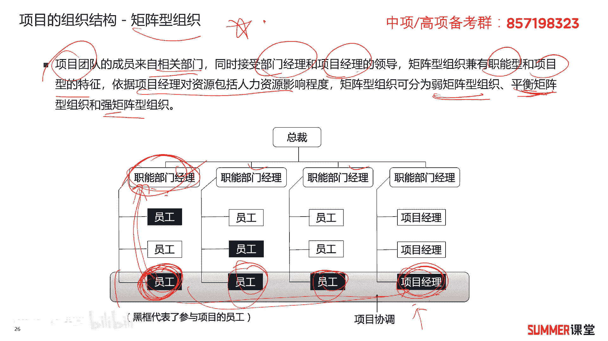

那就要看你是弱矩阵，平衡矩阵还是强矩阵是吧啊，资源分配与项目优先的问题产生冲突啊，就我刚刚举的这个问题，就只有一个大神，三个项目都都都想用啊，怎么去分配啊，也是可能产生冲突的对吧，权利难以保持平衡。

主要就是多头领导嘛啊特别有些时候，如果职能经理跟我的项目经理，他们是关系比较好，那其实还好，那如果这两个东西这两个死不对付，那就有问题啊，是不是权力就难以平衡的呀，ok这是矩阵型组织的优缺点。

希望大家能够理解好，我们下面总结一下这三种组织架构，他们的这个图职能型组织长什么样，只有各个各个职能部门，然后下面的员工组成一个项目团队，没有项目经理是吧，这里面项目经理叫联络员或者协调员啊。

比如说a他就是一个联络员对吧，因为他负责跟项目团队成员进行沟通，如果说本本部门的，我直接可以沟通，如果是跨部门的，我要经过职能经理这样传过来，再跟c沟通是吧，是职能型组织，它的特点。

另外项目型组织就是由一个一个的项目经理部，或者项目部啊构成，项目经理是老大，项目经理，他的权力非常之大，另外还有一种综合职能，项目型和智能型啊，这两种特点的就是举重型，橘子群有专职的项目经理。

但项目成员来自不同的职能部门，项目成员是受项目经理和职能经理，他的双重领导，双重领导，那根据领导的权利，我们可以分成分成强矩阵，弱矩阵和平衡矩阵是吧。

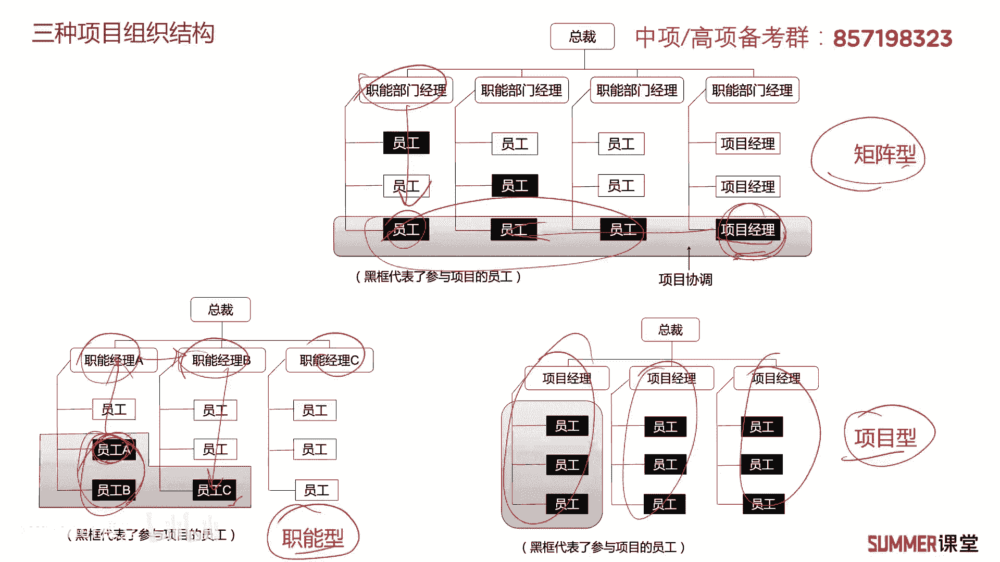

就主要听谁的嘛，不是双重领导嘛，我主要听谁的，ok，这里面我们再用一个表格来给大家去对比一下，这三种组织架构，这个表格是重点，历年考过多次，历年考过多次哈，怎么考，待会我给大家去讲啊。

首先啊这三种职能举证和项目型组织，他的项目经理权限谁的最大啊，所以是谁的权限最大，肯定项目型的这个权限，他的这个项目经理的权限是最大的嘛对吧，这个其实不用说啊，很好理解，然后需要注意的是。

我标红的就是项目全职员工的比例，如果是责任型是没有全职员工的，如果是矩阵型，全职员工的比例从0%到95%，然后弱矩阵，平衡矩阵和强行矩阵它的比例是不一样的，这个比例你需要注意一下啊，不需要你把它背下来。

但是你要有一定的感觉啊，你要把这个这个叫什么边界的一些临界值，要稍微的注意一下啊，比如说弱矩阵，你看少于一半的员工吗，是全职的，然后平衡矩阵有15%到60%，就是有一半以上的，也有一半以下的对吧。

如果是强矩阵，肯定一半以上的都是全职员工啊，项目型项目型，他的全职员工比例基本上是80%到100，这就更更多了更多了啊，另外还需要注意啊，还需要处理项目经理的兼职和全职，如果是职能职能型组织。

这是兼职的，如果是矩阵型平衡矩阵和强矩阵，项目经理是全职，然后弱矩阵项目经理是兼职项目行，这肯定是全职了对吧，另外还需要注意一个，就是项目的行政管理人员是兼职还是全职，前面这几个都是兼职强取证。

行政管理人员是全职，比如说哪些是行政管理人员，我们考试常考的话就配置管理员，配置管理员，他问你，他给你一个条件哈，这是我们的项目经理，他是全职的，但是配置管理员他是兼职的，问你这是什么。

请组织架构肯定是平衡矩阵是吧啊，另外他又说我的项目经理是全职的，然后配置管理员也是全职的，那肯定就是强矩阵的对吧，标红的，标红的，这几行作为重点，那其他的稍微看一下啊，优缺点这个不用说了。

下面这做了一个精简，前面我们已经非常详细的给大家去介绍过，不同组织架构它的优缺点了对吧，这一页是考点，你基本上把这一页掌握了，你最后去做题的时候，你就会发现这一页基本上是很多题的解析是吧。

哎遇到这些题怎么做，把这一页拉出来也就就很清晰，很迷人好了啊，所以非常重要哦，希望大家注意一下。

另外还有一种组织叫复合型组织，复合型组织不怎么考啊，了解一下，了解一下，他根据工作需要，一个组织内部在运作项目的时候，或多或少的同时包含上面的三种组织形式，这样就构成了复合型组织啊。

比如说在一个公司里面，他有两个项目在同时开展项目，是不是一个矩阵型的呀，啊项目b这又是一个啊，这又是一个职能型的是吧，一个是一个智能型的组织，那么它一混合是不是就形成了一个复合型，形成了一个复合型。

ok了解一下啊，了解一下就ok了。

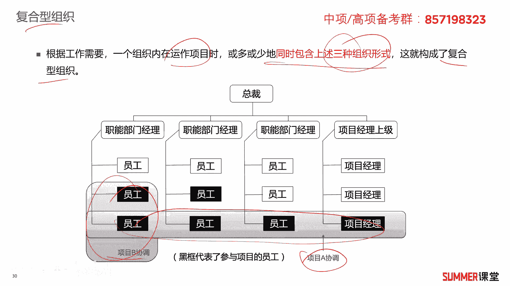

另外还有一个概念哈，叫p o p o，什么叫po呢，po的中文名字叫项目管理办公室，它是所辖范围内，集中协调管理项目的一个职能机构，有时候也被称作项目办公室或者项目管理部，pmo有三种类型，知识型。

控制型和指令型，知识型主要为项目经理提供一些支持性的服务，对项目的控制程度比较低，控制型是提供支持，并且要求项目经理做一定的服从对吧，对项目控制程程度它是中等，还有一种就是指令型，对项目直接发指令的。

它能够直接管理和控制项目，对项目控制程度就比较高啊，这三种类型大家简单了解一下啊，简单了解一下，然后po在组织结构当中的作用啊，几个作用哈，四个啊，第一个提供管理功能，第二个提供监督功能。

监督我们的项目经理干活是吧，还有一个就是提供指导和培训，为下面的这个员工，新招的员工提供一些入职培训啊，还有就是协调功能，它能够实现跨项目的一些沟通，比如说刚刚我不是说了吗，你可能需要一个大神对吧啊。

需要这个大神由谁去沟通呢，可以由项目经理直接去沟通，但也可以有po项目管理办公室啊，他去跟别的项目啊去做一些协调，把这个大省协调过来啊，跟我用一个月是吧，ok针对po啊，作为一个了解的知识点。

我们最核心最重要的还是那几种架构。

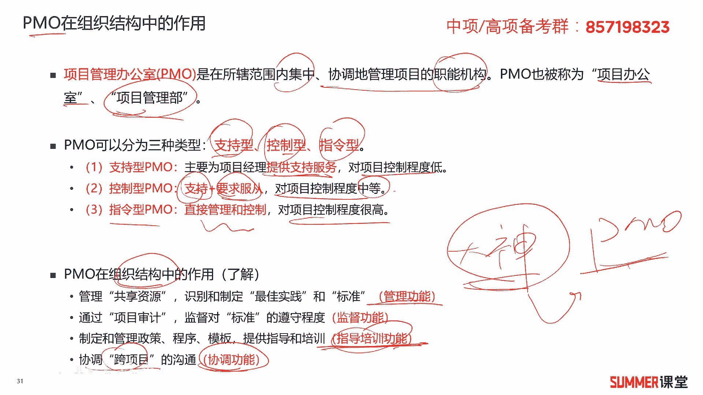

那几种啊，组织架构哈，好那几种组织架构，职能型，矩阵型和项目型。

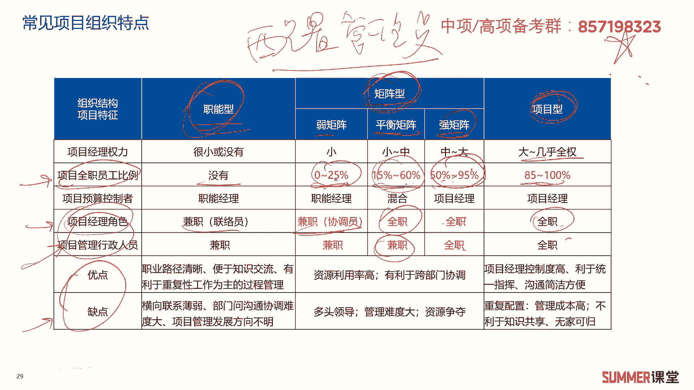