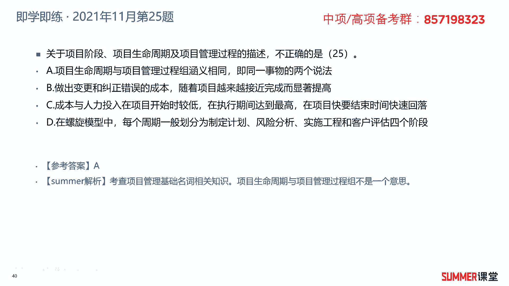

# 2023年软考信息系统项目管理师视频教程【总结到位，清晰易懂】-软考高项培训视频 - P27：2-5 信息系统项目生命周期 - summer课堂 - BV1wM4y1Z7ny

我们接着来看信息系统项目的生命周期，首先是项目的生命周期，它定义了从项目开始直至结束的项目阶段，通常按照顺序排列，有些时候也会交流阶段的名称和数量，是具体的项目而定，这个是可以裁剪，可多可少的。

可以从两个层面来划分，第一个是技术上，第二个是管理活动上，技术上来划分，我们一般大的阶段是划成需求分析系统，设计系统，实现运行维护，这是大的阶段，当然落实到具体的项目当中，可以有差异是吧。

这个阶段的名称和数量都是可以变化的，这里面我举了两个例子，比如说在建筑领域，建筑的项目一般前期要做科研，要做出色，那后面要做详细的设计是吧，这个应该是详细设计，然后施工啊移交，如果是软件类的项目。

一般会有需求分析框架的设计，详细的设计，编程测试部署移交，包括后续的运维啊，后续的运维有些时候把运维踢出去啊，有些时候把运维放到放到这个里面来啊，短期的运维嘛对吧，那从管理层面来讲。

我们项目的活动分成启动计划，执行收尾这么四个典型的阶段，还有一个概念叫产品的生命周期，它是从项目开始到项目结束，再到项目是再到这个项目产生，产品的生命周期终止或者退出市场啊为止，说简单一点项目啊。

比如说我修一栋楼，我从最早的开始搞科研，然后到我的大楼移交，这个过程可能3年就把我大楼修好了对吧，修好之后我是不是要用70年啊，一般的住宅要用70年，所以项目的生命周期就是这3年，从开始做这个项目。

然后到移交我们项目的成果啊，就是这栋大楼，我这个项目就结束了对吧，但是产品的生命周期，是要等到70年之后才结束，甚至还不止70年，如果你学学过啊，学过一建或者类似的这种课程，你就会知道哈。

他设计年限是70年，也不就也不是说到了70年，一定要把它推翻重建，那不一定的，不是有很多百年老宅吗，对吧，现在有些地方清朝那些建筑现在都还保留着呢，因为到了70年之后，你要重新评估，重新评估。

然后可能要做一些加固安全的措施，它是还可以继续用的呀，啊比如说你重新评估加固之后，它还可以用30年啊，所以它的生命周期是到到了70年之后，再加30年，然后过了30年之后又重新评估嘛，又又做了一些加固啊。

做一些风险的处理，说不定还可以用是吧，简单来讲哈，为了方便大家理解，我们就说70年，就是它的一个正常的生命周期嘛对吧，这是产品的生命周期，所以从这个角度来讲啊，产品的生命周期。

一般来讲是要大过项目的生命周期的是吧啊，一般情况好，这是项目生命周期哈，那项目生命生命周期有哪些共同的特征呢，这是一个重点，历年考试选择题高频考点一定要理解，理解了之后就非常简单，不需要你死记硬背的好。

我们来看第一个啊，就是成本与人力的投入，刚开始投入比较缓慢缓慢增加，在执行过程中间达到高峰，最后是快速回落，成本和人力都是这样子的啊，怎么理解呢，就是项目刚开始做一些可研做设计，没几个人嘛对吧。

人比较少，所以你的投入的钱也不是那么多，到了中期这个项目开始搞了，然后高比如也我们也以修楼为例哈，所以最好理解到，前前期可能就是一些设计人员参与啊，那个三五个人小项目。

好像五个人那大点的项目可能稍微多一点，但是也不会太多，到了中期就开始盖楼了，会有各种各样的功能入场，什么水泥工，钢筋，钢筋工，水电工啊等等，这些工人肯定都是要开支，要要花钱的呀对吧。

所以你的这个投入肯定是大量增加，到了后期我项目要移交了，可能留一波小波人啊，看看工地，那准备给客户去做移交，大部分工人就撤场了嘛，所以到最后是不是快速回落了，这第一个哈理解理解了之后很简单啊。

然后第二点风险和不确定性，干性能的影响，变更的数量，项目开始时最大，后续逐渐降低，刚开始是不是风险最高的呀，因为刚开始有很多不确定性嘛啊具体怎么搞，哪些人说了算，这个都都不好说，干到最后之后。

你把我这个成果都快交付出来了，那风险是不是就慢慢降低了呀，啊风险和不确定性，而感性人的影响刚开始也是最大的，什么叫干系人，我们后面有个章节叫干系人管理，说白了就是跟我们这个项目相关的所有人啊。

跟我们这个项目相关的所有人，可能包含甲方，乙方，还有附，你如果是搞建筑的话，可能有附近附近的居民，他都可以算作干系人，因为你施工可能影响到人家平时的一个休息嘛，对吧啊，干性能的影响刚开始是最大的。

因为干性的影响是不是存在一定的不确定性嘛，对吧，你可以把这两个联系起来去记哈，变更的数量啊，刚开始比较多，到后续有项目逐渐逐渐都完成90%了啊，一般来讲变更就不是那么多了，ok从项目开始最大。

然后后续逐渐降低变更的代价，这也是经常考的高频考点，项目开始时最小，后续显著增高啊，后续显著增高，为什么会显著增高啊，你想我软件还没有开始开发的时候，你给我提个需求，给我提个变更，我很好处理嘛。

因为我还没开始做是吧，那重新规划设计一下，应该就没什么问题，但是我软件都已经完工90%了，你说某个功能模块要变，我以前做的事情是不是要推倒重来啊，你说代价大不大嘛，肯定很大是吧，那这两张图哈。

理解性记忆非常重要，选择题经常考，经常考，这是项目的生命周期以及项目生命周期，它的特征，下面再给大家介绍一个概念，叫项目管理的生命周期，跟项目的生命周期有点不一样哦，项目管理的生命周期。

我们一般也把它叫做五大过程组，这是整本书的核心，整本书的核心就是五大过程组，十大知识领域也叫十大管理，把它分成启动规划，执行监控收尾，从管理层面，我们项目可以分成这么五大过程组，你先把它给记住。

我觉得其实从这几个词，大家也能够感觉出来它到底是个什么意思对吧，也不需要过多的解释，不需要过多的解释，所有的项目都是一样的，都是按照这么五大过程组去去做管理的啊，去做管理的五大过程组可以在每个项目上啊。

每个项目阶段执行或者是重复制和重复执行，也可以在整体项目层面执行和重复执行，什么意思啊啊什么意思啊，单纯从字面意思好像不太好理解，我们给大家去画了一个图，通过这个图我相信大家就非常有感觉了。

刚刚我们讲的是项目的阶段，或者项目的生命周期，一般项目由科研设计施工，后面有移交等等，我这里面就画了三个哈，画多了我不太不太好看啊，也画画不太出来，就给他画画了三个，能理解就行，这项目的生命周期对吧。

然后我们项目管理的生命周期，或者叫项目管理的这个过程组，它是怎样的，五个过程组启动规划，执行监控和收尾，是在项目的每一个阶段，我都可以都可以执行他呀对吧，关于项目的阶段。

或者项目生命周期与项目管理的生命周期，它的区别，我相信通过这个图大家应该能够区分开来哈，项目的阶段是由前往后这么去推的，在每个阶段里面，我都可以执行我项目管理的动作吗，项目管理的动作来来几个啊。

五个嘛是吧，就这五个动作每个阶段都可以这么去执行，ok所以如果考试考到，你问你项目的管理阶段和项目阶段，它是一个意思，对不对，很明显不对嘛是吧，项目阶段是这玩意儿，项目管理生命周期和项目管理的阶段。

是这个东西它是不一样的啊，啊是不一样的，明白这次考过好几次的，o这句话通过下面的那个图应该理解了哈，然后项目管理生命周期和项目生命周期，它有相同的起点和终点啊，相同的起点和终点啊，没问题吧。

最你项目管理是从最最最早项目启动的时候，你就要启动嘛对吧，最后项目结束的时候，你你在项目管理再结束吗，啊这是没有问题的哈，有相同的起点和终点是没有问题，但是他但是说他们两个是同一个东西，那就有问题了啊。

那就有问题了，我们五大过程组对应着戴明环啊，pd c这个规划是不是对应着p啊啊plan是吧，那执行对应着d到监控，对应着c和a，我记得以前考试是考过这这块儿的，他说我们的监控过程组对应着代名环的哪一个。

哪一个过程监控对应着check是吧，切割完之后还要还要action嘛，是吧啊，这次考过了哟啊注意啊，需要注意好吧，下面标绿的啊，我们待会儿再来啊，再待会儿再来看啊，因为后面有一张图来理解。

这个过程组里面的一些动作可能更方便一些，因为这些阶段我们都还没讲，这是后面那些一些章节的核心内容，先看一下啊，先看一下，然后其实刚刚已经提了哈，就是项目阶段与项目管理过程中，它们之间的关系。

这里面再给大家说一下，那就是不同类型的项目，它有不同的项目，生命周期的划分可能有些区别啊，每一个阶段都可以看成一个单独的项目，或者是子项目啊，你看一个项目他很多阶段嘛啊，有可言，有设计，有施工。

一般软件的项目啊，软件的项目，中小型项目，可能前期的科研设计施工都一家单位在干啊，等一下这单位在干小型项目哈，但是大型项目大型项目啊，几千万上亿的这种，一般前期的可研设计和施工是是分是分开的哈。

施工的话在在软件领域的话，就是就是就是偏向于实施嘛，就开发了测试了是吧，但是在在土木工程，在建筑领域一般设计施工肯定是分开的，设计有专门的设计院施工，有专门的施工单位对吧。

他他是不是可以看作看作一个单独的子项目，单独的子项目单独指项目，针对这些子项目，是不是我们可以进行完整的项目，管理的一个过程，进行完整的项目管理的一个过程，然后阶段与阶段之间啊。

有顺序关系或者交流关系啊，就是不同的项目阶段，它可以是一个阶段，完了再干另外一个阶段的事情，当然也可能他们有一些是重复的，就是你设计的时候设计一些东西出来，我就开始开始施工了对吧，有可能有这种交点。

这个交点在我们后面讲进度的时候啊，我们会给大家去讲啊，它是进度压缩的一个技术叫快速跟进，快速跟进，说白了就是并行嘛对吧，有并行啊，这先了解一下，还没抢到啊，没抢到。

每个阶段都可能会执行全部项目管理的过程，很清晰吧是吧，每个阶段都可能会执行全部项目管理的过程，阶段结束，以可交付成果的转移和移交作为标志啊，了解一下啊，这些这句话啊你多读两遍。

反正到时候考试如果出个选项要比较熟悉，能够选择出来好，接着来看五大过程组啊，就是项目管理这个生命周期，五大过程组它们之间的相互作用，过程组之间是极少，那极少是孤立或者一次性的事件，在整个项目当中。

它是相互重叠的过程组，你看启动过程组，规划执行监控收尾，他们是不是重叠的呀，啊相互重叠的，在多阶段项目上，这些过程会在每个阶段内重复的执行，直至符合阶段完成的目标，什么意思啊，在每个阶段内。

你你的管理过程是启动规划执行监控收尾对吧，但是收尾之后啊，不是收尾之后哈，就是就就是这个过程他有可能不止执行一次啊，不行不只执行一次，就是它它是一个循环的可言，它可能前期启动一次收尾，最后结束一次。

但是中间这几个，特别是中间这几个规划执行和监控，它是要不断的重复的，因为第一次规划不是那么准确的对吧，那前面我们应该呃应该给大家去提过啊，规划的过程肯定是要不断的不断的重复的啊。

包括监控整个项目要不断的监控，监控有问题，是不是可能要重新规划啊，重新执行或者优化你的规划，优化你的执行对吧，所以在每一个过程里边，这个管项目管理的过程中，它也是不断重复的啊，不断重复的监控过程。

通常不能在时间段上单独的独立存在，你监控你要监控什么东西啊是吧，它是贯穿其他所有的过程的，看到没有，五大过程组启动规划执行收尾，这里面有个监控监控，是不是贯穿我们五大过程组的呀，ok这是五大过程组。

希望大家理解它是我们项目管理的五个阶段，项目管理的五个阶段，那接着给大家去看一张图啊，这张图很重要啊，非常重要啊，叫15至尊图，就是它横向是十大管理，纵向五大过程组，就项目管理的五个过程组。

中间47个子过程，就项目管理的子过程，这张图很重要，但现在不要求你记，你也记不住是吧，那这里边的40大管理，我们后面是会重点去讲的，先先把它拿出来，让大家有个基本的认识，你上考场之前，这张图不说。

你要背下来，至少里面百分之八九十的内容，你要非常熟悉，或者你直接就能背，ok那具体怎么背还是有些技巧的哈，啊当然现在没讲，现在还没讲到里面的内容，现在死记硬背肯定不好背嘛是吧，但是到时候讲了之后。

你就会有感觉了哈啊比如说像启动过程组，它里面就有两只，有两个嘛是吧，然后收尾过程组就只有两个，这种就好记了啊，中间的啊，到时候我们再给大家讲一些啊方法啊，这张图很重要，这是考试会考的啊，考试会考的。

这是我们整本教材，项目管理部分最核心的知识点，最核心的知识点先给他抛出来，给让大家有一个基本的印象和认识，好我们下面来看一道题啊，他说关于项目阶段，项目生命周期以及项目管理过程的描述，不正确的是哪一个。

a项目生命周期和项目管理过程组含义相同，即同一个事物的两个说法，像不像同先前给大家重点强调过，这肯定是两个东西啊，不相同的哪张图，这张图这是项目的生命周期，这是项目项目管理的生命周期。

或者叫项目管理过程组对吧，肯定不是一个东西啊，肯定不是一个东西，所以a很明显的错误，不正确的就选a啊，当然我们也看一下后续的几个答案哈，b他说做出变更和纠正错误的成本，随着项目越来越接近完成而显著提高。

我项目都快做，做完了，做到90%了，你要变一个大的功能，肯定成本很高，没有问题，c成本与人力投入在项目开始时，最低执行期间达到最高，项目快要结束的时候快速回落，我给大家举个这个功能的例子，没有问题吧。

d在模螺旋模型当中，每个周期一般分成制定计划，风险分析，实施工程，客户评估这么四个阶段啊，也没有问题，螺旋模型我们还没讲到，下一节当中就会给大家去讲各种各样的模型。

所以这道题选择a答案非常经典的一道题哈。

