# 2023年软考信息系统项目管理师视频教程【总结到位，清晰易懂】-软考高项培训视频 - P28：2-6 信息系统项目生命周期模型 - summer课堂 - BV1wM4y1Z7ny

好我们接着来看最后一个小节，信息系统项目生命周期的模型。

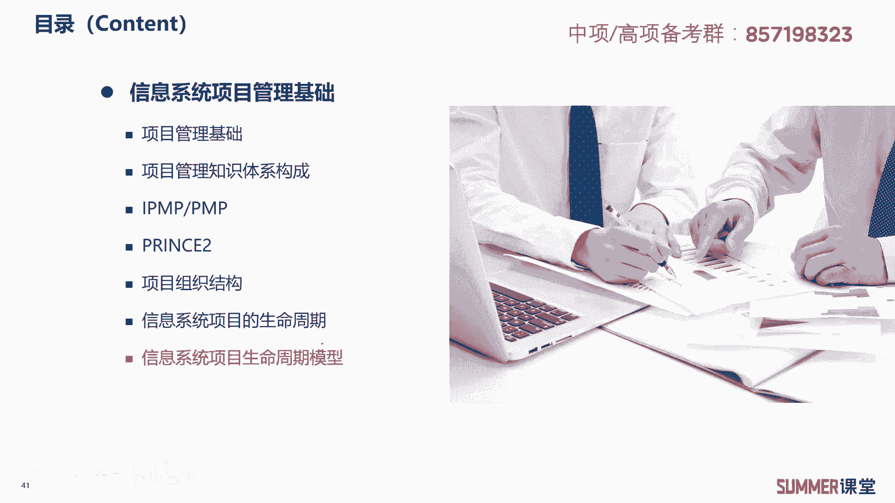

这里面一共会给大家去介绍六种模型啊，分别是瀑布模型，螺旋模型，迭代模型，v模型，原型化模型和敏捷方法，这六种啊偶尔会考选择题啊，也不是说每年都考，但是啊说不定哪1年就会有啊，具体考哪一个啊。

这个不太好说，从历年考试来看啊，比较爱考的像敏捷方法啊，瀑布模型，螺旋模型，它包括原型化模型，这几个是比较爱考的好吧，我们还是都给大家去分析一下，首先瀑布模型是一个经典的软件生命周期模型。

它一般将软件开发分成可行性分析，这是做计划，然后需求分析，软件设计，编码测试运行维护等这么几个阶段，它是从上到下，像什么像瀑布一样流下来的，瀑布有一个特点，就是只能从高处流到低处。

他还能不能由低处再流回去啊，啊能不能不能是吧啊，所以这就是瀑布模型它的一个最核心的特点，上一活动的输出作为当前活动的输入，然后完成当前活动之后进行评审，通过评审之后进入下一项啊，比如说举个例子。

我们这个设计设计，它是作为编码的一个输入，我们必须要把设计做完了之后，我们才能做编码，设计，没完编码不开始，这就是瀑布模型典型的特点阶段，一个阶段一个阶段的，只有把上一个阶段完成了。

才能够进入到下一个阶段，这是结构化的方法当中最常用的开发方法，本质就是一次过一次过啊，就是设计完了接受验收评估，那下一步下一步搞编码，编码完了才进入测试，而不是一边编码一边测试的明白，这是瀑布模型。

它适用于需求明确或者很少有变更的项目，开发团队比较弱的情况，有厚实的行业实践经验，有利于干系人，你最后测试完，然后把下把整个软件都搞好了，之后移交给客户啊。

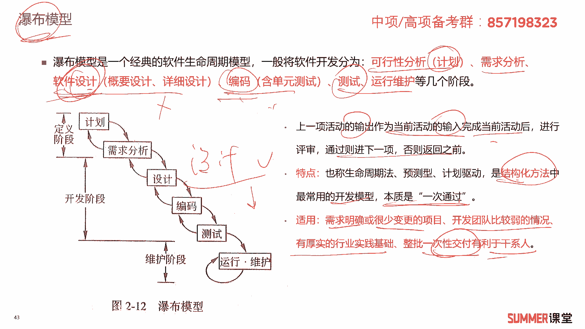

ok然后瀑布模型优缺点啊，大家需要理解啊，优点啊为项目提供了按阶段划划分的检查点，你项目不是画画很多阶段吗，每个阶段完了之后是不是有相应的输出物啊，我们检查你的输出不就行了嘛。

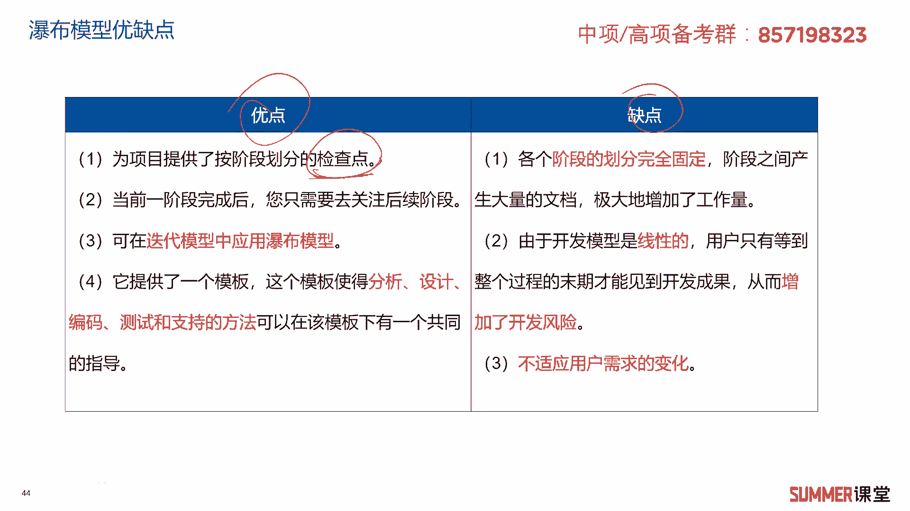

啊比如说你的设计是不是有设计文档啊，你的编码最后是有效输出相应的代码。

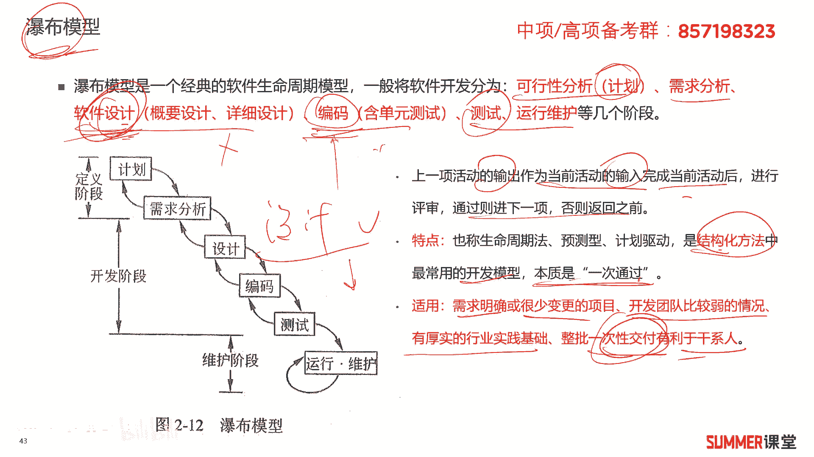

源代码嘛是吧，检查每一个阶段的这个输出啊，这每个阶段目设置检查点，第二个，当一个阶段完成之后，您只需要去关注后续的阶段，一个阶段完了之后就结束了呗，对吧，这个事情就跟我没什么关系了啊。

第三在迭代模型当中啊，经常应用瀑布模型啊，这个了解一下，第四它提供了一个模板，这个模板使得分析设计编码测试和支持的方法，在同一个模板下有一个共同的指导，由于它比较规范，比较标准。

所以你可以用一些项目的文档，项目的模板来支撑你的分析设计工作啊，像我们写方案一样，是不是经常找一些模板，因为它比较固定嘛对吧，所以模板比较适用，缺点啊，缺点也比较明显，第一个各个阶段的划分是完全固定的。

阶段之间产生大量的文档，极大的增加了工作量，你阶段完成，最终我们需要要检查你的可交付物了，可交付物很多时候像软件的项目，就是文档嘛对吧，无论是你的需求，文档设计文档还是你编码的代码。

是不是都是文档形式啊，第二由于开发模型是线性的啊，用户只能等到整个过程末期才能够见见到，真正的开发成果，一步一步进行嘛，可能一个项目12个月前面八个月都没有代码，都都看不到软件功能都在搞什么需求啊。

然后设计啊对吧，然后到了11个月才能看到初步的这个代码啊，所以这也是会增加我们项目风险的啊，会增加项目风险，第三它是不适用于用户需求的变化啊，不适用于用户需求的变化，作为一个重点，这是一个核心的考点。

希望大家注意好。

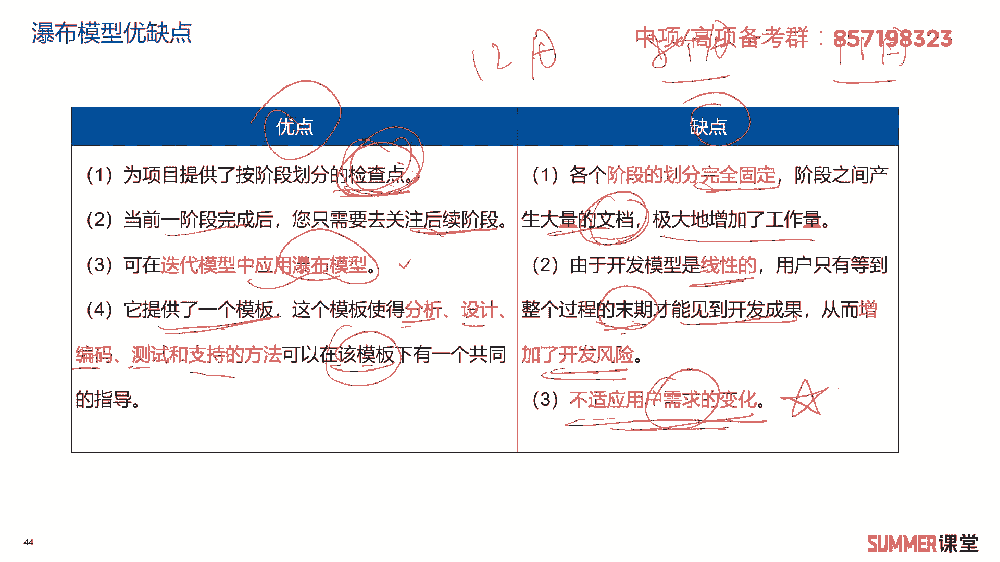

我们来看一道题，他说什么不属于瀑布式开发模型的特点啊，a严格区分工作阶段，每个阶段有明确的任务和取得的成果，取得成果很多时候都是文档啊，没有问题，b强调系统开发的整体性和全局性啊。

全局分成很多个阶段也ok，基于客户需求的推进，快速迭代开发，他能基于西需求进行推进或者叫演技吗。

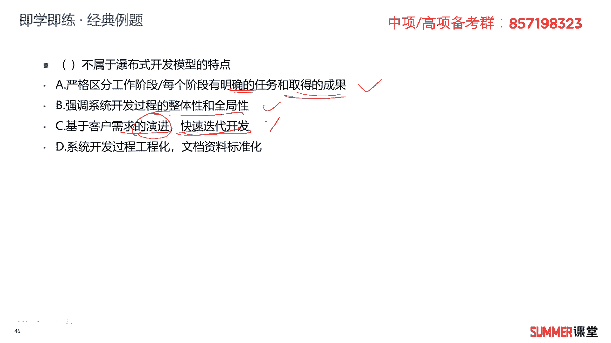

能不能不能，刚刚我不是说了吗。

不适用于需求的变化吗，d系统开发过程，系统开发过程，工程化文档资料标准化没问题是吧。

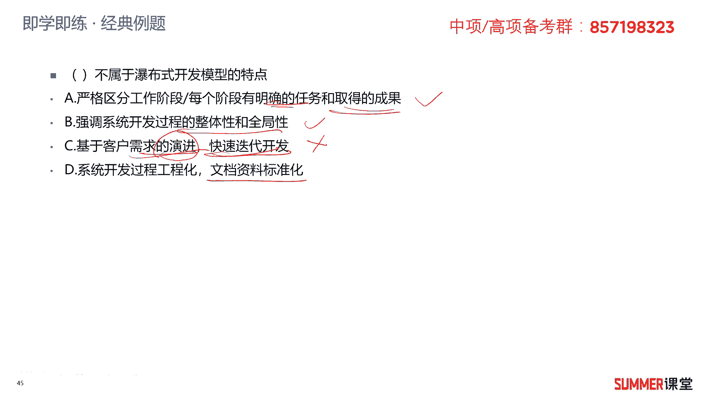

文档资料是比较比较标准的。

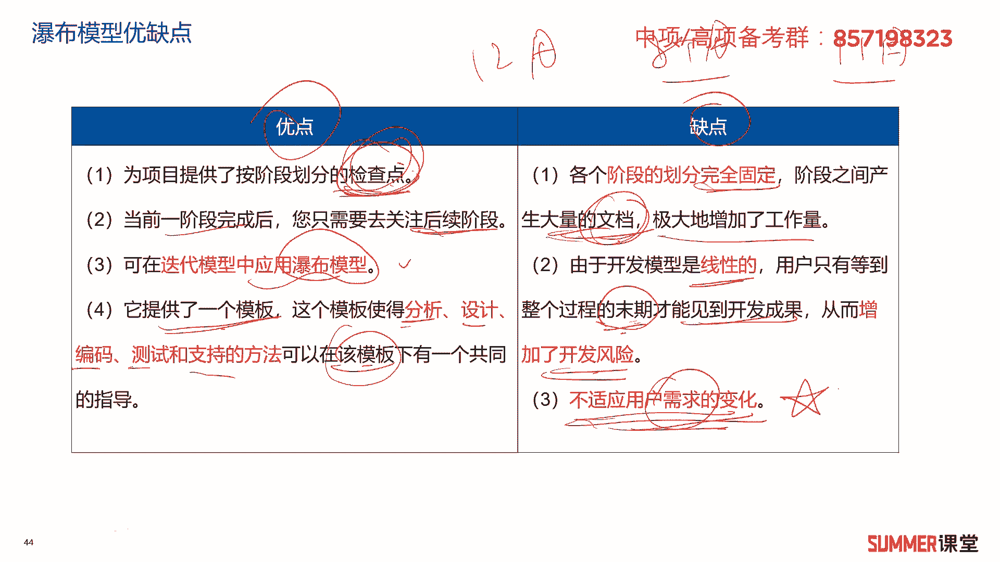

才能大量的文档，而且这些文档啊它能够形成模板啊，所以这道题很明显选择c答案好，我们接着来看螺旋模型，螺旋模型是一个演化软件过程模型，它是在瀑布模型和原型化模型的基础上，演进而来的，记一下。

每次迭代都包含四个步骤，制定计划，风险分析，实施过程和客户评估啊，这也是记忆的知识点啊，我们来看一下哈，螺旋模型就长这样啊，它是一个圈是吧，但这个圈不断不断的在扩大啊，比如说我们刚开始先搞一个圆形出来。

给客户看一下，怎么搞原型呢啊高原型有四个步骤对吧，是不是结合瀑布模型了啊，四个步骤制定计划，风险分析实施过程，然后把原型搞出来之后交给客户评估嘛对吧，然后扣评估之后觉得你这不行，那不行，然后就改呗。

我们就搞第二个圆形出来，怎么搞，第二个圆形出来，也是通过这四个步骤不断的重复吗，第二个原型再不行，再搞第三个圆形，第四个原型是吧啊，这就是螺旋模型，它不断的结合瀑布模型和圆形化的模型。

去做迭代嘛啊去做迭代，在螺旋模型中，软件开发是一系列的增量发布，每次增加一点点，螺旋模型在每一次迭代中增加了风险分析，增加了风险分析，标红的都是考点，希望大家注意一下，我们来看一道考题。

软件开发螺旋模型是经常用的一种模型，它它是什么的，结合它是瀑布模型和快速原型模型的结合，强调软软件开发过程中的风险分析，这个空其实也是可以出来考你的，也是可以出来考你的。

特别适合于大型复杂的系统螺旋模型，沿着螺旋线进行若干次迭代，每次迭代中的活动依次是什么，制定计划，风险分析，实施工程客户评估，所以这道题选择a和d好。

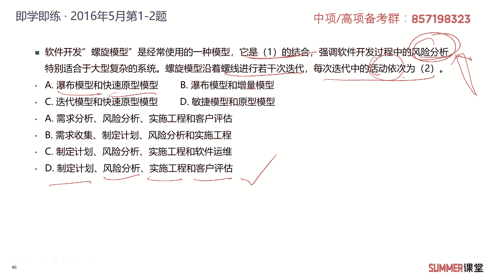

接下来看迭代模型，迭代模型中，每个阶段都执行一次传统的完整的串行过程，执行一次过程串啊，就是一次迭代啊，每次迭代设计的过程，包含不同比例的所有活动啊，他是多次交互交互啊，这个文字可能有点绕哈。

我们通过一个图来让大家看什么是迭代模型，迭代模型他也把项目分成了很多个阶段是吧，比如这里面分成了四个阶段啊，初始细化构造和移交，它跟瀑布模型就有区别了，瀑布模型是你第一个阶段完了。

才能干第二个阶段的事情，但是迭代模型，你看它的这些阶段是不是并行的呀，它是不是并行的对吧，然后每个阶段他都包括所有的工作，你看初始化阶段是不是都有下面的所有的工作，只是不同阶段他这个工作多少有差别。

比如初始化阶段，主要就是干建模和需求获取的工作，然后细化阶段主要就干这三个工作是吧，然后移交阶段主要就看后面的两个，它是不同阶段，他关注的重点不一样，ok这是迭代模型。

迭代模型当中有一个典型的叫r u p啊，软件统一过程，它就是一个典型的迭代模型，你看到r u p你就要选迭代模型，他把项目分成四个阶段，初始化阶段，细化阶段，构造阶段和交互阶段。

这四个阶段需要大家注意一下啊。

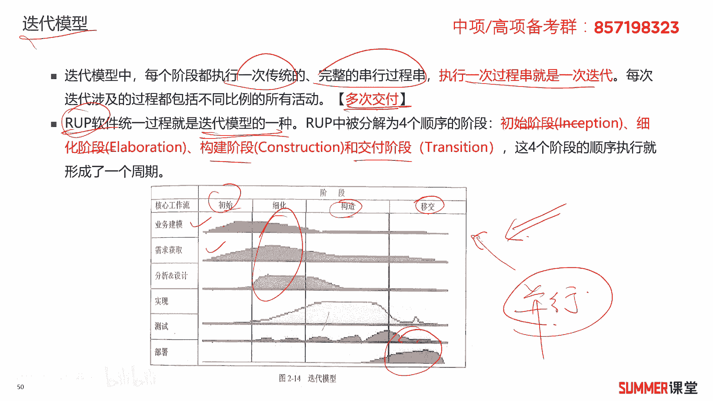

注意一下好，接着是v模型，v模型从整体上来看就是一个v字形的结构啊，分成左右两边v模型有两种说法，第一种说法是长这样的，上面这个图，还有一种说法是下面这个图，我们教材上是下面这个图。

所以重点还是参考下面这个图哈，啊虽然有两种说法，但是我们重点参考下面这个图，他左边是表示用户需求需求分析，概要设计和详细设计是吧，这么几个，然后右边是跟测试相关的单元测试，集成测试系统，测试和验收测试。

左左右有没有一个对应关系啊，有就是用户的需求，你你验收测试的时候，你重点参考的是用户的需求，你单元测试的时候，重点参考的是详细设计的文档，左右的关系就是这样去对应的啊，左边是跟需求设计相关。

右边是跟测试相关，所以微模型它就是典型的把需求设计，和我们最终的这个测试给它紧密地联系起来了，它的特点是细化了瀑布模型当中的测试部分，开发开发阶段清楚，便于控制开发过程，适用于需求明确。

需求变化不频繁的这种项目啊，微模型的特点，那单元测试主要目的主要是测什么啊，测测编码当中可能存在的各种错误，集成测试主要是主要目的是针对详细啊，详细设计，诶不对啊，我看一下哈。

集成测试主要针对详细设计中，可能存在的一些问题啊，如果按照下面这个来哈啊，按照下面这个来集成测试，集成测试应该对应着什么，对应着盖也要设计是吧，如果按照上面这个模型来集成测试，就对应着详细设计。

所以这两个模型怎么讲呢，它它有区别有差异，这两个模型在不同的书上都可以找到，具体以哪个为准，这玩意儿哎呀怎么讲，反正是一个挺纠结的事情，对吧啊，挺纠结的一个事情，所以集成测试我们参考的文档是详细设计。

还是还是概要设计来一个啊，我个人其实更偏向于下面一个啊，我个人更偏向于下面一个哈啊，所以这里面就不是详细设计了，应该就是概要设计对吧，系统测试主要针对概要设计，主要针对概要设计。

检查系统作为一个整体是否得到有效的运行，所以系统测试主要针对的是需求分析，系统测试的资料来源，是来自于需求分析的一些文档，一眼是不是测试啊，这这里面需要注意哈，验收测试它是由业务专家或者用户进行的。

有用户参与的就是验收测试啊，这是以前网络工程师考试考过的，问你有最，最终到了他前面啰嗦了很多话，给你写了一大段话，最后关键词就是用户参加，问你这是什么测试阶段啊，这是验收测试对吧。

验收测试肯定是跟用户需求息息相关的啊，跟用户需求息息相关，那确保我们的产品，能够符合用户业务上的需要吗，啊v模型适合用于需求明确变更不平凡啊，这里面已经说了哈，这是微模型典型的特点，希望大家注意啊。

我们以下面这个图为主，上面这个图暂时就不看了啊，反正你知道它不同的书上他写的不一样，所以你就不要去纠结哈，你纠结没什么用是吧，秋田没什么用，这种不同书上写的不一样的，我们就啊就以我们兰考官方教材啊。

这本书上他画的这个图为准好吧。

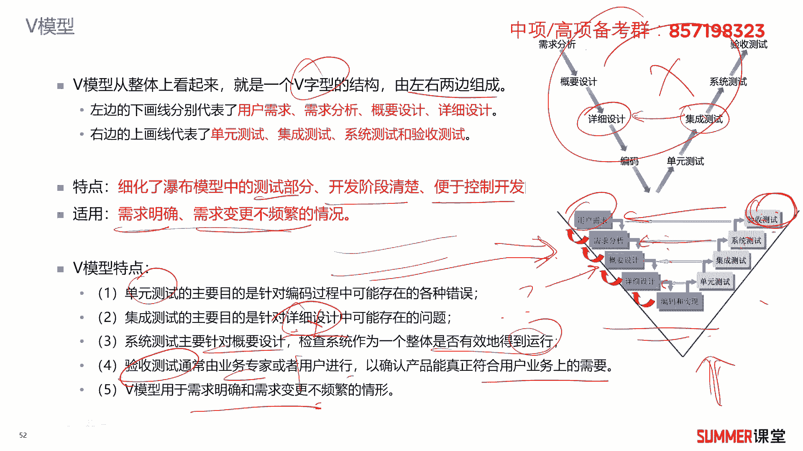

接着圆形化模型啊，这是一个重点，当然原型化模型是最好理解的啊，最好理解的啊，他第一步就是搞一个快速的圆形出来嘛对吧，搞一个简单的功能产品出来让客户看一看诶，你觉得有什么需要优化的呀。

然后我就根据你的要求进行改进嘛，是吧啊，根据客户的要求进行改进啊，搞一个原型出来，跟客户进行相应的讨论和分析，最终弄清楚客户他的真正需求是什么，然后充分了解之后，在原型的基础上开发出令客户满意的产品。

它特点实际可行，具有最终系统的一些基本特性啊，刚开始原型有一些基本特性，然后你想增加了一些功能，我在在做演化嘛啊，第三构造方便啊，快速啊，造价比较离圆形的分类啊，抛弃原型和进化原型也叫演化原型。

抛弃抛弃原型是是我们这个原型，在系统实现真正的功能之后，他就不用了，我先搞一个demo出来，然后通过这demo收集你的需求，收集了之后，我后面正式的去做开发，最后交付你的是正式的这个东西。

demo就丢弃不用了，进化行原型就先搞一个demo出来，然后好，这demo叫v0。1，然后我在v0。1的基础上进行演化，来给开发出v0。2，最后v一点零正式版本是吧，演化成最终的系统。

这叫进化原型应该是比较好理解的啊，所有的模型当中，圆形化模型应该不需要我们怎么想，大家都能够get到它里面的含义。

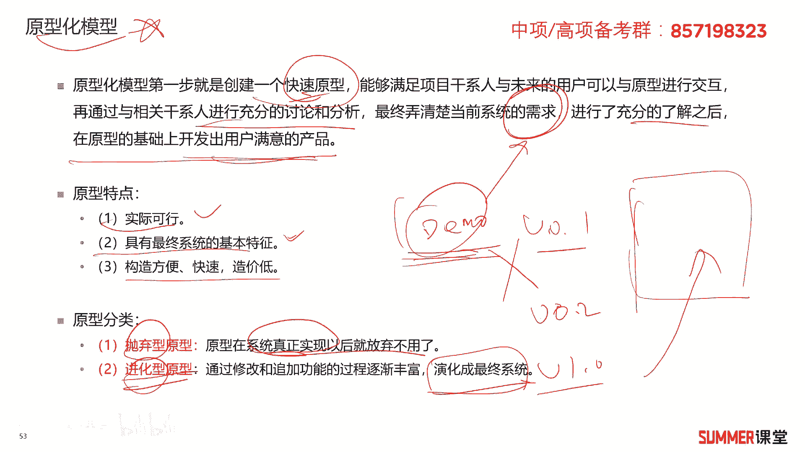

接着是敏捷开发模型啊，敏捷开发是一种以人为本啊，以人为核心迭代循序渐进的一种开发方法，相对于传统的软件开发的非敏捷，他更强调程序员团队与业务专家之间的紧密协，作，面对面的沟通。

认为面对面的沟通会比书面的沟通更加直接，有效，频繁的交付新的软件版本，周而自我组织的诶，这个叫这个应该写错了哈啊，进而自我组织行这个团队，就这个团队应该是自我组织型的，这个团队人不一定很多啊。

可能4~6个人对吧，一个小的项目组啊，这这想的项目组的话是自我组织的，没有一个特别强力的一个领导啊，反正我们按照既定的计划啊，干事情能够很好的适应需求变化的，代码编写和团队组织的方法啊。

也更注重软件开发中人的作用，敏捷开发注重人的作用，scream是一种迭代式增量的软件开发过程，非常适合用于敏捷开发，scream，这是以前其他考试考过的哈，他问你下面哪一种是敏捷开发方法啊。

screen screen，它特点较小的增量，我经常迭代嘛，每次增加一点点啊，快速迭代2~4周就会发发一个新版本，然后变更驱动，每次交付最有价值的成果，而适用于小型或者中型软件开发团队。

并且客户的需求模糊或者多变的，客户需求模糊或者多变，是不是可以用敏捷扣需求不清，是不是也可以用圆形啊，啊通过圆形画的方法去探寻客户的需求，常见的敏捷开发方法有极限编程，scream啊，其他的就了解一下。

这两个应该是最爱考的啊，最爱考的其他考试啊，我记得网络工程师是考过scream啊，考过scream，ok这是敏捷化的开发模型啊，了解一下，了解一下，把我标红的。

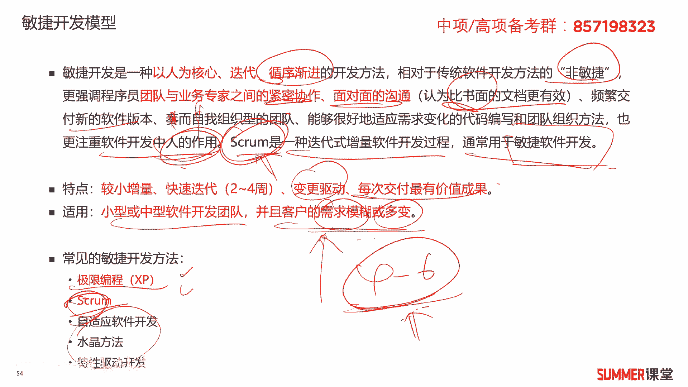

你要多看一下，多看一下好，我们下面做了一个不同周期模型，优缺点的一个对比啊，首先来看一下瀑布模型啊，瀑布模型它强调各个阶段的先后顺序，螺旋模型强调的是风险，它是瀑布加圆形的一个结合。

迭代模型是把我们的项目分成多个阶段，每个阶段都包含啊，都包含我们要做的一些工作，但是这只是哈只是不同的阶段做的比例不同，不同阶段啊倾向性不同，敏捷开发强调以人为核心，原型开发强调以用户为核心。

用户为核心和以人为核心，有没有区别，有区别，一人这个人不一定是用户啊对吧，他关注关注我的内部团队啊，关注软件开发中，人的作用就是我内部的程序员和业务专家，这也是要重点关注的是吧。

微模型它强调的是测试和开发同等重要，测试阶段，测试的每一个阶段，都对应着，我开发在开发阶段里面的每一个过程是吧，它的优缺点啊，这个就大家自己看哈啊，大家看内容比较多啊，不一个也给他去练了。

然后适用的情况啊，适用的情况，我相信只要这张表格也总结的比较清晰了啊，总结的比较清晰，把这张表格掌握了，然后你做题应该问题不大，ok这是信息系统项目生命周期的几个模型。

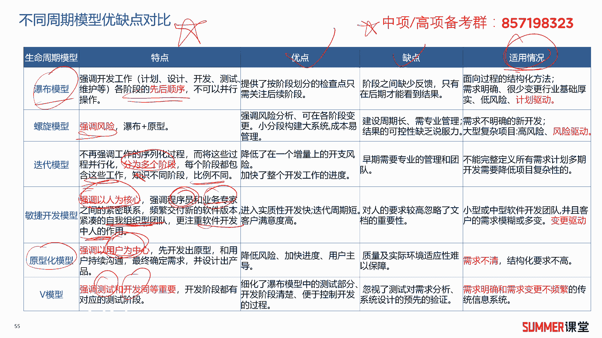

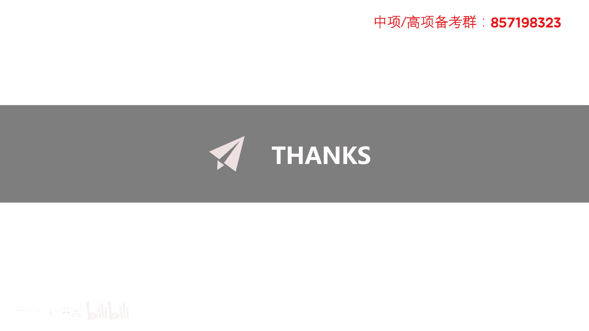