# 2023年软考信息系统项目管理师视频教程【总结到位，清晰易懂】-软考高项培训视频 - P29：3-1 立项管理基础 - summer课堂 - BV1wM4y1Z7ny

大家好，我是你们的夏老师，我们下面学习第三章项目立项管理啊，说实话，如果你平时一直从事的是售后工作，项目的立项这块可能你不太清楚对吧，因为项目立项主要是甲方客户干的事情，如果你从事是售前工作。

那么或者你直接是甲方，那么这块儿你应该是比较熟悉的，因为甲方主要就是干这块的事情嘛，然后售前有些时候也会帮助甲方，去做一些项目立项的事情，ok那相当于这块我们的项目还没有正式，还没有还没有正式开始。

项目经理还没有入场，我们只是项目前期的一些工作好吧。

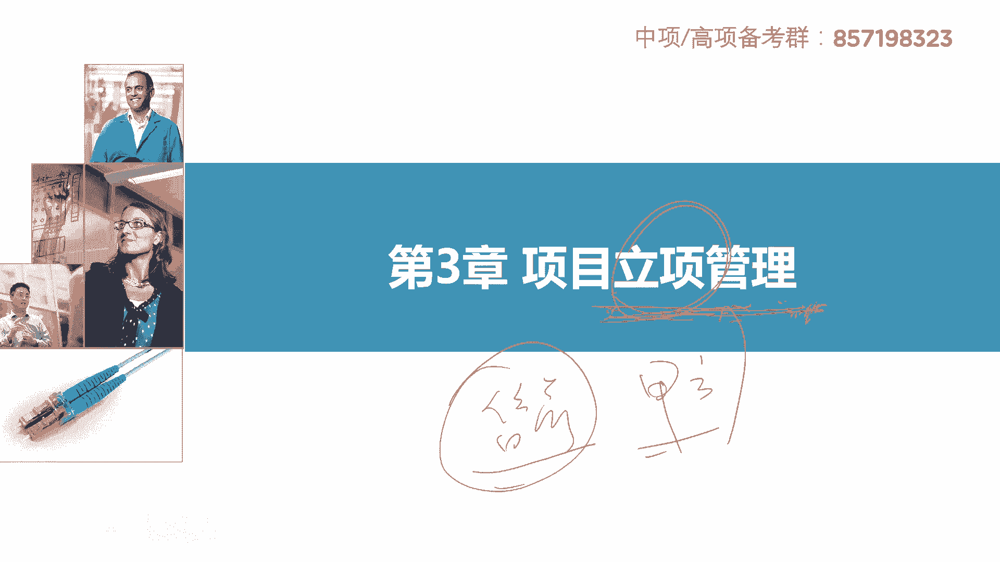

那第一部分啊，项目立项管理的基础。

首先我们要了解项目的流程，这个这个流程图啊，我画的我觉得很重要哈啊书上没有书上讲的，说实话这个章节他讲的乱七八糟的，然后各个地方到处去抄一点，最后毫无章法，通过我的这个流程图，我希望能让大家明白。

我们项目到底是怎么一步一步进行的，第一步首先要做项目的论证，这个项目做不做对吧，投资有没有收益，所以你先要做论证论证它分成机会，研究初步可言和详细可言这么三个步骤啊，分成这三个步骤。

其中机会研究和初步可言，之间有一个提交项目建议书，项目建议书也叫逆向申请啊，也叫逆向申请，ok这是项目的论证，论证完之后交给第三方去评估，评估完觉得这个ok可以做决策，决策之后甲方就开始组织招标了啊。

乙方就来投标嘛是吧，然后评标委员会诶进行评标嘛，一般就是专家，我们考完这个证，我们也可以去申请进入专家库做评标专家的，他呃评完标之后由甲方选定中标候选人，有些时候是甲方要授权我们的评标专家。

评标员会由他直接选选谁中标啊，这个也可以是吧，中标之后我们的甲方乙方签订合同，签完合同之后才进入项目的十大管理，我们这个项目管理部分才正式启动，项目经理入场，开始做管理啊，开始做我们的项目管理明白。

所以这就是整个项目的流程，我们书上的项目管理是在什么地方才进入的，在这个地方啊，十大管理是签订合同以后才才进入到这个阶段，所以有些时候我见过一个选择题哈，他说我们的项目经理应该尽早的参与项目啊。

比如前期的机会研究，可行性研究什么详细可言，需要有项目经理的参与，对不对，肯定不对啊，这个地方有项目经理吗，签订合同之后，项目经理才进场，所以项目经理本质上在我们书上哈，他干的是售后的活。

干的是售后的活儿，签订合同之后，这个项目交付，项目经理入场，明白o，这张图我觉得比较好地梳理了整个项目的过程，非常重要，希望大家能够理解，你不用死记硬背，但是你要把这个过程好好的梳理一下。

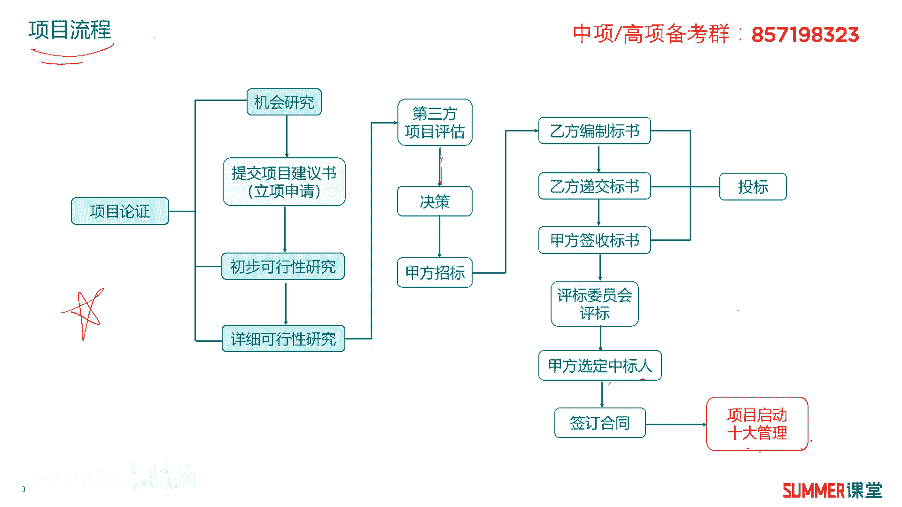

好好理解一下好，我们下面具体来看一下这个过程里边，一些详细的内容啊，首先是项目论证，什么是项目论证呢，适用性，经济上的合理性，盈利性，然后实质上的可能性，风险性进行科学的综合分析。

说白了就是对我们项目进行综合分析嘛对吧，那为项目决策提供客观的依据的一种技术，经济研究活动，说白了对我们项目进行分析，这项目能不能搞对吧，我们我们要进行多轮的分析，怎么进行多轮出机会研究。

初步可言和详细可言吗，然后项目论证应该围绕着市场需求，开发技术，财务经济三个方面展开调查和分析，市场是前提，技术是手段，财务是核心，标红的稍微注意一下，稍微注意一下。

先论证后决策是现代项目管理的基本准则，这句话在历年考试里面出现过无数次，你要知道这是正确的啊，这是正确的，先论证后决策，然后项目论证的作用，这是重点，重点选择题里面经常出差作为选项，那读一下哈。

项目论证是确定项目是否实施的依据，我论证完我要投入一个亿，我最后最后我的回报可能只有1000万，那我这项目还干吗，干不干不干啊，这亏的亏的什么亏得很啊，对吧，亏9000万啊，所以是不是先要论证一下啊。

刚刚我说的论证是什么什么，像从哪个方面去论证的，是不是从经济上嘛对吧，钱经济上就钱嘛，钱合不合理，然后还还可以从技术上嘛，这个技术你比如说我以前给大家去提的，我要造一艘光速的飞船啊。

它速度等于光速的飞船，这合不合理吗，现在有这个技术吗，没有吗，这技术上就实现不了是吧，或者我要干一个项目，我要需要1亿人参与，合不合理不合理，是不是，这意思是技术上或者叫人力资源上。

而项目的论证是筹措资金向银行贷款的依据，以向银行贷款，要有你项目的这个详细的一些论证报告啊，这个是一个重点哈，这句话也是考过无数次的，项目论证是编制计划设计，采购施工资源配置的依据啊。

不用怎么解释吧对吧，不用怎么解释，然后项目论证是防范风险，提高项目效率的重要保障，反正前两句考的最多啊，前两句考的最多，后面两句你也需要注意一下啊，也需要注意一下这项目论证的作用，重点核心知识点啊。

如果考项目论证，绝对会考它好吧。

接着往下啊，项目论证的阶段分成三个阶段，机会研究初步可言，然后详细可言也就是前面的这三块，我已经给你标注了对吧，项目论证就包含这么三块啊，这需要注意哦，考试考过无数次的啊，他说b项目论证包括啊。

包括什么经济经济可行性分析，然后初步可行性分析，详细可行性分析，对不对不对啊，或者项目论证包含这三个也不对啊，需要注意啊，项目论证包含的是这三个东西。

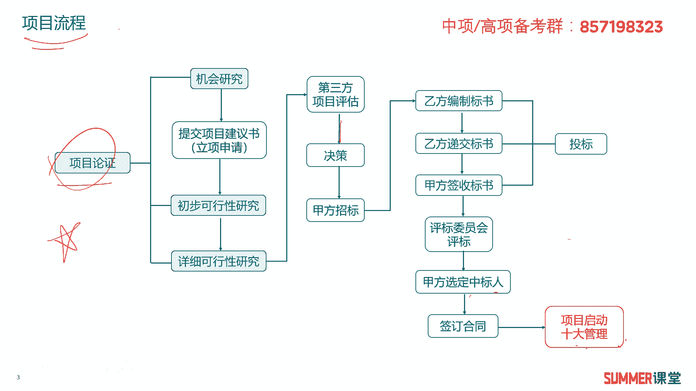

作为记忆的知识点，考试考过的，像这种考试考过一次。

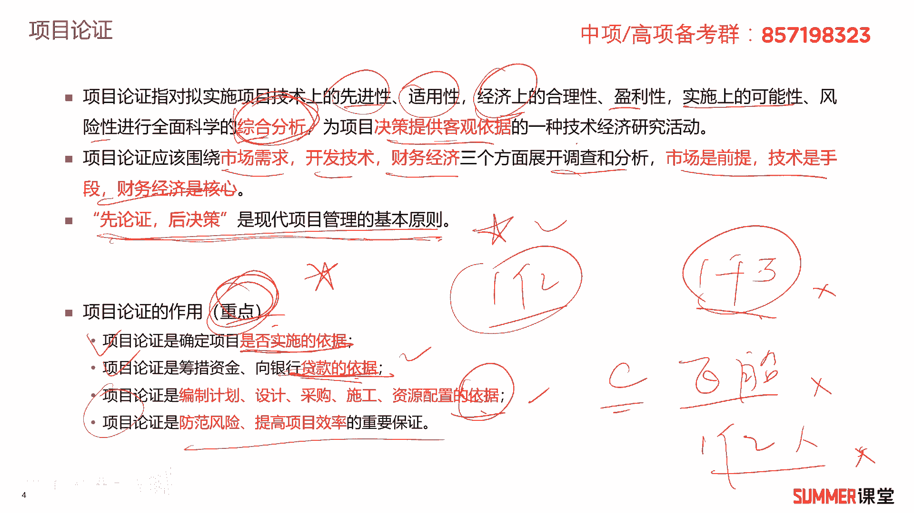

下次他稍微给你变一下，又拿出来考，你是非常常见的哈，然后前两个是可选的，详细可言是必选的啊，说实话他的这个呃关于论证和可言这块，我反正觉得他写的怎么讲呢，不是特别好，他是借鉴工程项目。

工程项目是这么搞的，但是我们这个信息化项目，信息化项目一般来讲不会整特别复杂，特别是这除非是特别大的，这种偏向于工程类的信息化项目啊，什么叫工程类的信息化项目啊，比如说智能交通啊。

智能交通他这个跟工程非常类似，因为你要立电杆，要买交换机，要后退后端有数据数据中心对吧，像这种大型的智慧城市类的项目，它偏向于工程，那他可能他要搞搞的比较全，什么机会研究出不可言，详细可言。

因为他投资十个亿，不是十个亿有点多哈，一般智能交通大型的投资一两个亿，是比较正常的是吧，像这种他会搞得比较比较详细一点。

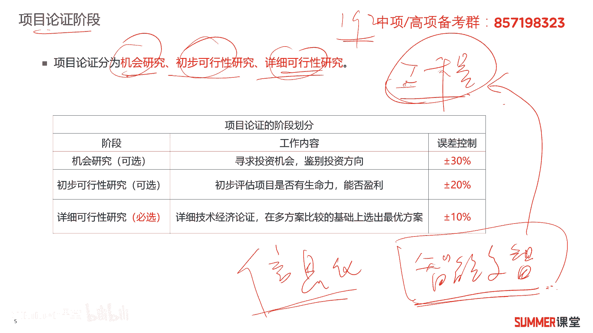

但是一般的三五百万一两千万的i t项目。

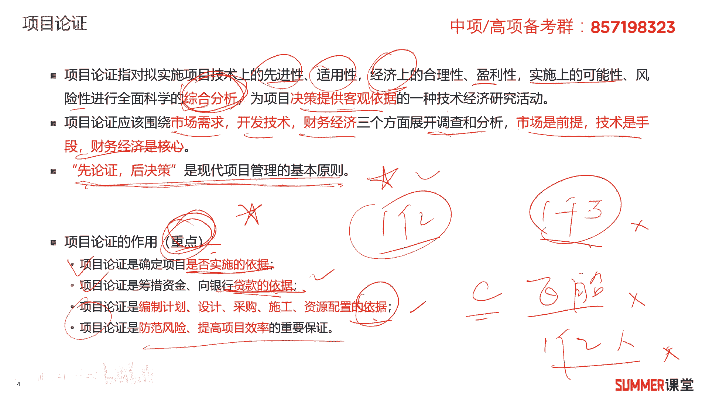

没有他说的这么复杂啊，没有他说的这么复杂，一般很多东西我们都可以省略，常见的啊，一般项目哈就是你提交立项申请啊，比如说嗯你给领导打个报告对吧，我是一所学校啊，我是一所学校，然后由于什么网速卡，网速慢。

然后什么国家的什么政策对吧，我们要干一个事情啊，啊干什么事情，我要进行校园网的升级啊，进行校园网的升级，然后怎么升升级，简单的说一下大概需要多少钱啊，500万，然后把这个报告提交给谁，然后审批是吧。

审批完之后，他可能就把这个东西提交给财政局了啊，财政局批钱嘛，有钱了之后就可以干了是吧，有钱的时候这个项目就可以干了，所以实际的我们的it项目一般中小型项目哈，就是我刚刚说的这个节奏啊，提逆向申请。

提一个，你把它发给你的上级单位，上级单位他向财政局申去申请是吧，收到十个学校的身体，他发现有两个学校，你这个网络才建3年，还可以接着用啊，有有有有五个学校，八个学校。

他这个网络已经搞了差不多八到10年了啊，这个是该升级的，所以他向上面财政去提交的，他是就就没有那么多嘛对吧，这就把你打回来了，然后财政批钱批钱了之后，你项目就可以搞了呗是吧，中小型项目。

有些也不是不是不需要这种第三方的，非常非常正式的评估哈啊这是实际项目啊，当然我们书上写的他就是参考工程类项目啊，工程立项去搞的工程类项目，第一个金额比较大啊，第二个工程类项目如果出大问题会死很多人的。

你想你修一栋楼，修一栋楼，这玩意儿是不是很严重啊，啊所以你要经过层层的可行性研究，然后要第三方来评估，最后来做决策，他流程一定要走完啊，中小型项目，你说335百万的这个i t项目，有多大的风险吗。

即使出问题，至少至少不像修一栋楼，那么不太不太可能有，这种不太可能接受的风险是吧，好ok啊，这里面给大家去说一下，我们书上写的跟实际项目的一个区别哈。

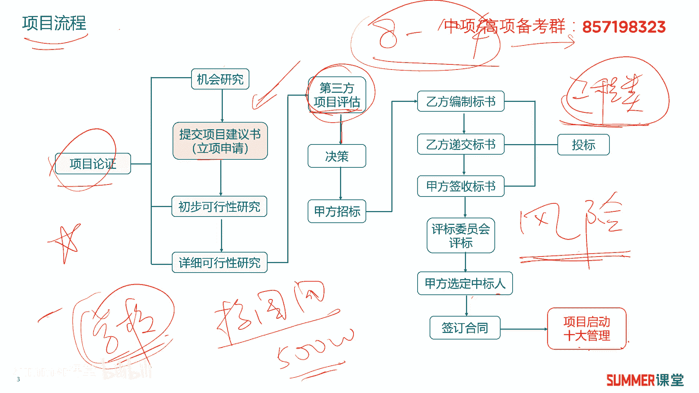

它跟实际上的一个差异啊，大家了解了解。

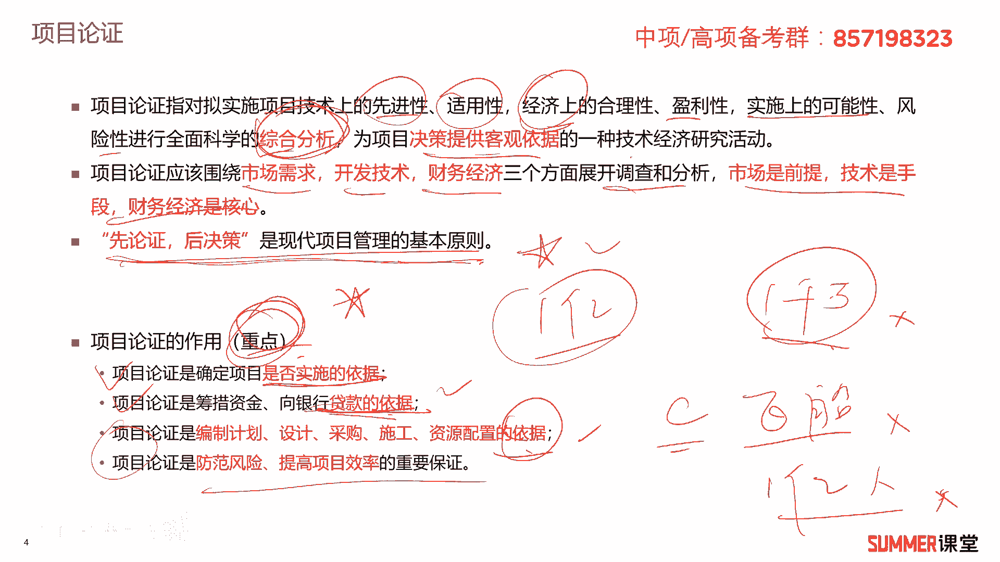

我说的这个他不会作为什么考试来考你啊，但是你要知道啊，你要知道好吧，而项目论证的这三个阶段啊，他们工作的内容啊，大家了解机会研究主要是寻找投资机会，鉴别我们投资的方向，它的误差是比较大的。

正-30%出不可言，它是评估项目是否有生命力，能否盈利，误差就减少了百分正-20%，然后详细可言，这个东西是必选的，它是详细的进行技术经济的论证，在多方案的比较基础上选出最优的方案。

它的误差控制控制到10%，所以我们项目论证的过程一步一步从粗到细，它的误差是越来越小的，越来越小。

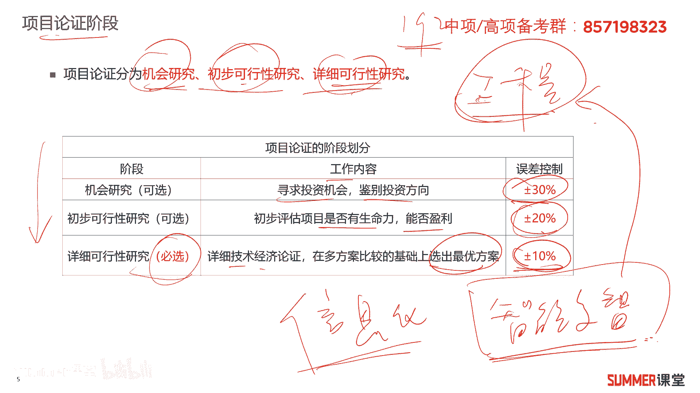

ok标红的这句话是考点啊，考过很多次的，接着项目论证的程序七部曲，第一步明确项目的范围以及雇主的目标，明确范围和目标，第二步收集并分析相关的资料，收集相关的资料，收集资料的渠道也特别多，你可以网上查。

你可以查你们公司历年来做的一些项目对吧，那收集资料吧，然后第三个拟定多种可行的技术方案，比如说我从成都，我要去北京，我可以怎么去啊，开车去我也可以，飞机，我还可以什么高铁是吧，都可以。

最后你就分析对比各个方案嘛，开车比较费时间，然后飞机节省时间，但比较贵啊，高铁他可能就综合了飞机和开车，它属于它们中间吗，是不是那时间比飞机要长一点，但是呃但是费用呢啊也还好啊，也还好。

所以要对多个方案进行比较和分析，最终选一个最优的方案进行全面的论论证，就发现这三种方案当中啊，可能我还是要坐飞机啊，因为坐飞机最节省我的时间，相对而言综合成本加上时间成本啊，综合成本是最低的啊。

所以我选择从成都到北京坐飞机是吧，接着你要编制你的论证报告，为什么我要坐飞机呢啊，你要就是把你刚刚分析的这个过程，要写成论证的报告，然后接着第七部，编制资金的筹措计划和项目实施进度的计划啊。

当然我们搞项目哈，有些时候是你自己的钱，但是有些时候你是需要跟银行贷款，有些时候你需要融资的对吧，你怎么比如这个项目需要一个亿，你怎么把这一个亿给搞到，你要有资金的操作计划，项目的实施进度。

计划大概的一个进度可能初步的不是那么准确，但是你要有这个东西，这项目论证的七部曲，这七部曲大家理解就行啊，考试如果考到你，大概率是让你排一个序，我相信即使大家不怎么学啊，或者这块不不学。

你大概率也是能够排队的，是吧啊，当然我们给大家去讲了，你稍微看一下，如果出道排序能排队就行了，是吧啊，这块不是经常考，但是大家需要看一下。

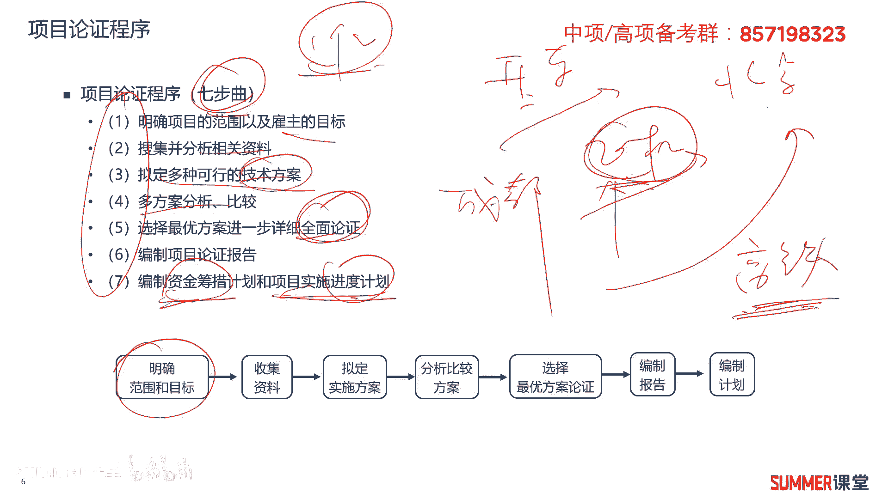

看一下，接着那项目立项，项目立项啊，一般包括什么啊，包括这几个过程啊，书上写的提议，交项目建议书，项目的可行性研究，项目的招标投标等内容，反正我觉得他写的不是很好，项目立项。

这玩意儿怎么怎么怎么涉及到招式标了呀，呃逆向应该是项目前期早期的工作，你说提交这个逆向申请也叫项目建议书，这个没问题是吧，做可行性研究也没有问题，但是项目招投标这个这跟立项有毛关系啊。

反正我不知道他有啥关系，严格意义上来讲，他跟逆向肯定是分开的，逆向是前期的工作，招投标是进入到象棋项目的这个中中后期了，是不是啊啊项目的一个中期了，但他这么写我们也没办法对吧，反正你知道书上是这么写的。

如果他考到项目立项，包含这些东西，它是对的啊，他是对的，然后项目建议书也叫逆向申请，是建设单位向上级主管部门提交的，提交项目申请时所必需的文件，然后是对你建项目提出的框架性的总体设想。

在项目建议书批准后方可对外开始工作啊，这里面这段话很重要，非常重要，项目建议书首先它叫逆向申请，它是建建设单位向上级部门提交的，建设单位是谁，甲方啊，比如说我是一个学校的建网络啊。

那立项申请应该是学校啊，学校自己提交的，而不是我们的什么集成商厂商提交的对吧，那注意哦，它是建设方，建设单位，不是承建单位，但是我夏老师以前是做过很长时间的，售前工程师和授权的这个管理哈。

啊其实你做这个工作，你就会发现有些甲方他就不会写，不会写怎么办，那就那要么集成三就集成，就做这个项目的单位或者一些设备厂商，比如他主要就买个交换机，那华为可能就帮他写了，那主主要是买的呃。

服务器可能浪潮就帮他写这个立项申请了是吧，所以现在那国内其实很卷哈，就是为了拿项目，我们会帮甲方做很多事情，所以甲方有些时候就大爷了啊，只要我相信我听我听我课程的，也有不少是甲方啊，我给大家一个建议。

就是有些时候你有项目，但是有些工作你不会做怎么办，我们要利用资源啊，啊我们要利用资源，哪些资源厂商啊，比如说你要建网络，把华为叫过来嘛，只要你有项目，这些事情他都愿意帮你干是吧，因为他帮你干的时候。

他往往想往里面去夹点私货啊，什么叫私货呢，就只有我华为才能满足，但这是最最私的货了，他可能加一些对华为有点倾向性的，一些方案进去，当然也无可厚非啊，人家帮你干活是吧，你还是要体谅一下人家知道吗。

所以有些时候不会哈，充分调动资源，充分发那个发挥你的主观能动性啊，找人帮忙吗是吧，虽然是建设单位干的，但是但是你可以找其他建设单位，你可以找其他人帮你改啊，然后由你自己递交上去就行了嘛是吧。

而且他是一个必须的文件哦，啊项目的立项申请是必须的文件啊，说到这儿的话，我再给大家强调一下啊，反正你夏老师以前是做过不少的，这种逆向申请哈，啊有些单位啊，他这个写的逆向申请跟什么大妈的脚一样。

这个怎么又长又臭，就是写了很多，但是关键他不突出，一般懂行的啊，这种甲方的人员哈，他写立项申请的时候不会写特别多啊，一般实验到20页就能说明问题了，理想申请主要说什么，我要干什么事。

为什么要干这个事情是吧，干的事情干了这个事情有什么好处，最后需要多少钱，把这几个东西说明白就行了嘛，不要把什么各种厂商的方案往里面堆，整个一两百页啊，真没必要哈，真没必要啊，一般的项目啊。

一般的这个建设项目，信息化的建设项目，10月20页的逆向申请就足够了，我们给大家去看一下，这就是一个项目的呃，一个呃逆向啊，逆向的报告或者项目建议书嘛，啊逆向申请他有立项的背景，为什么要做这个项目啊。

然后做完这个项目有什么好处啊对吧，最后核心的需要多少钱，其实中间的这部分可有可无，你你把我标红的这几个部分写写到了，那就ok了啊，中间这个部分这个是厂商写的写的，这个理想申请嘛是吧。

所以他肯定会把自己的一些方案诶，可以稍微的往里面去写一下，但这个对甲方来讲都不是最重要的，因为这个东西你是要提交给谁，提交给甲方的上级部门啊，领导如果你是一个学校的话，他关注你毛毛的方案。

他只关注你为什么要做这个项目，你这个项目急不急切是吧，刚刚我讲了，你网络都建了10年了啊，学生老是反反映上网比较慢，那你这个网络大概率还是有，改改造的一个需求的，那再看一下a多少钱啊。

可能你申请了500万，那甲方一刀给你砍了200万啊，我没这么多钱是吧，呵呵不是甲方哈，就你上级部门或者直接财政直接给你砍，砍成200万，这很现实的哈，所以我们做逆向申请的时候，往往你还是要多申请点钱。

大概率你的立项的这个申请的资金，不会是你想的这么多，不会是你申请的那么多，你申请500万可能就给你200万，你申请200万就给你50万，这很常见的啊，有经验的这个甲方人员应该都有感觉啊，应该都有感觉。

他是对已建项目提出的一个，框架性的总体设想啊，总体的嘛是吧啊，就是我总体要建成什么样啊，建完之后啊，具体有什么效果对吧，就价值分析嘛啊有什么效果，ok这段话很重要哈，大家多读两遍啊。

特别是我给大家去讲了几个关键字，建设单位必须的总体构，想要批准后才可以对外工作，那接着项目建议书也就逆向申请，它的核心内容啊，项目的必要性，市场的预测啊，当然有些项目可能是要面向市场的。

但有些项目比如像事业单位啊，哪些公这叫公职部门啊，比如说像公安啊，法院啊等等，这些项目他就没有什么市场预测嘛对吧，所以看具体项目，第三个是产品方案或者服务的这个市场预测，这也是市场预测。

第四个项目建设是必须要的条件，必须要的条件，最重要的是什么乾啊，搞项目没钱，你搞毛线啊，是不是这四个，然后第五个没有的风险因素及对策，项目的逆向逆向申请里面没有风险因素及对策，只是考过了哟。

选择题里面考过的啊，注意啊，我给大家罗列出来了啊，说给我们把它说的更简单一点啊，我们逆向只要你这个立项的申请，你主要写什么，目前有什么问题啊，为什么要做这个项目，我做这个项目能达到什么效果。

大概花多少钱啊，其领导上级部门他就关注这些问题嘛对吧，因为你的立项报告是写给写给上级看的呀，就把这几个东西给我写清楚就行了，其他的东西可以有，但不建议写太多，你给我写这几个东西写个三页。

其他的写个200页，是不是就有点喧宾夺主了呀，那就有点喧宾夺主。

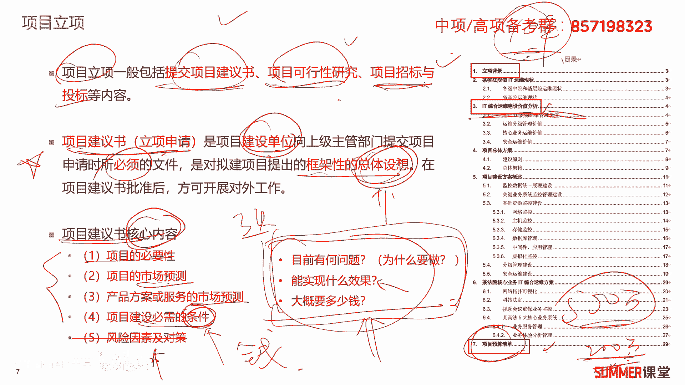

甚至立项报告我真见过，就这么两三页的，他把这个事情，就把这三个问题说明白就行了是吧，ok这关于项目立项啊，我相信大家应该是能够理解的，接着就到了后期了哈，招投标，说实话项目的立项管理。

他为什么把招投标放进来，让我有点费解哈，因为招投标后面不是有采购管理吗，你放到采购管理里面讲多合适啊对吧，采购一般都是通过招投标来来来进行的吗，所以我们也把招投标放到采购里面去细讲啊，这里面简单过一下。

让大家有个基本的认识，那为了防止投标人啊，首先大家知道什么是招投标吗，啊招投标我相信绝大部分应该是知道的哈，就我要买一个东西吗，如果是买个100块钱的东西，我直接去市场上买，货，比三家就买了嘛。

如果是我买一个100万的东西，那你说你能随便买吗，这个就不太好了，我就要组织招投标对吧，我就发一个招标文件，然后我要买一个100万的交换机路由器，还记得有有十家就买了我的这个招标文件。

到最后可能有八家研究之后，哎我要去投标是吧，最后我们就从这八家当中选出最优的一家嘛，从价格技术等等方面综合对比，选出最优的一家，这就是招投标嘛是吧，甲方招标啊，乙方来进行投标。

招投标里面需要注意的两个点啊，这里面先给大家说一下哈，为了防止投标人在投标之后撤标，或者是中标之后拒不签订签订合同，招标人通常要求投标人提供一定比例的，或者一定金额的投标保证金，要有投标保证金。

为了主要是为了限制，不是为了限制，主要是为了约束我们的投标人嘛，万一你中标之后，你你不跟我合作了是吧，不给我签合同了啊，这个应该很好理解，招标人决定中标人后，未中标的投标人已经缴纳的保证金予以退还。

没中标的把保证金退还给你，那工程项目的保证金，一般是不超过投标总价的2%，最高不超过80万，政府采购项目的投标保证金，一般不超过预算的2%，也就是200万的项目，你最多收4万的投标保证你啊。

这是一般要求啊，如果以邮寄方式送达你的投标文件，投标人必须留出邮寄的时间，保证投标文件能够在截止日期之前，送达到投标人指定的地点啊，比如说我是1月10号啊，1月10号早上八点，早上八点有点有点早哈。

早上十点吧，截止收投标文件，那么你既因为是寄出的投标文件，那么必须要在这个时间节点到达，我的投标的那个地方啊，你不能以邮戳时间为准，那你说我是1月9号晚上晚上18点，记得你不能以这个时间为准。

你要以到达的时间为准是吧啊，在截止时间后送达的投标文件啊，已经过了招标有效期的招标人应该原封退回，不得进入开标程序，就是你你投标文件就无效了啊，我我就不收了是吧，所以这里面大家投投标的都知道哈。

啊其实啊其实在真实的项目当中，有很多错过投标时间的啊，人家在这个时间就截止投标了，有些人可能早上堵个车，早上走的早，走的晚了，早上可能八点八点半出发，你看十点投标嘛，还有一个半小时呢，但是中间堵车。

最后10年零一分到达投票现场，那么对不起，晚了一分钟，你你这个项目你就错过了，你没办法参与是吧，这这是非常严格的啊，这种小问题虽然说不要犯，但是经常也有也有人犯啊，低级错误是吧，所以要投标。

早上五点六点就得起来，提前一个小时，两个小时到达投标现场啊，不要赶时间啊，不要赶时间好吧，这是招投标啊。

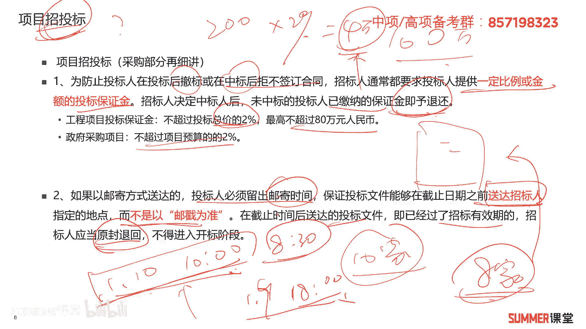

简单的给大家去做一下。