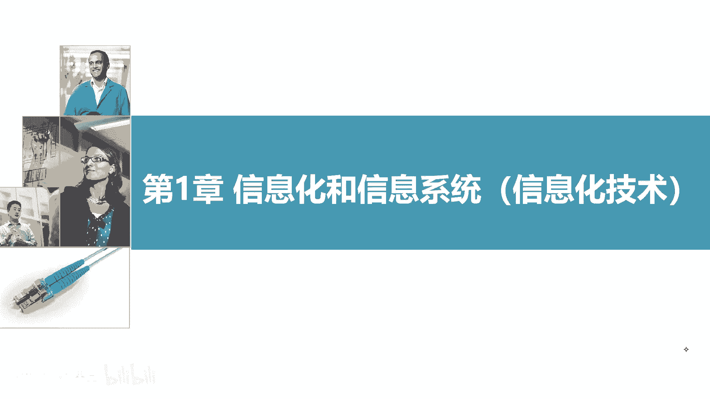
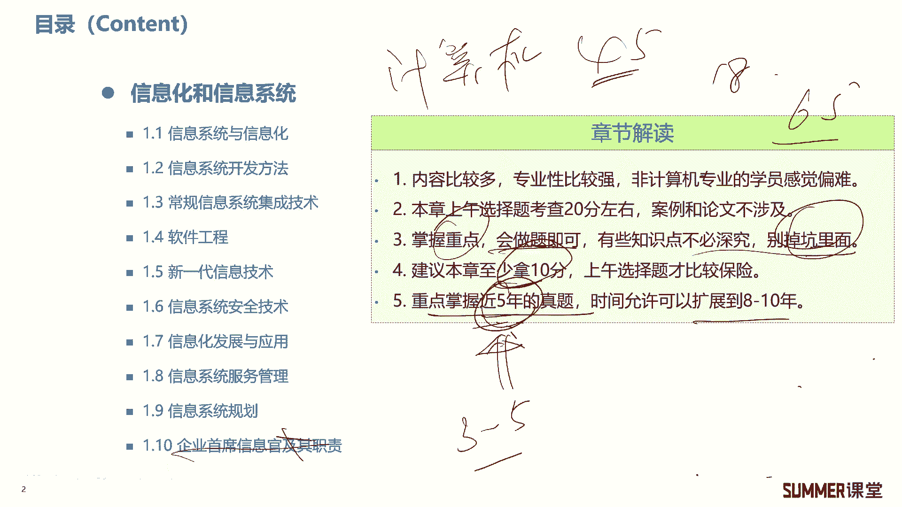
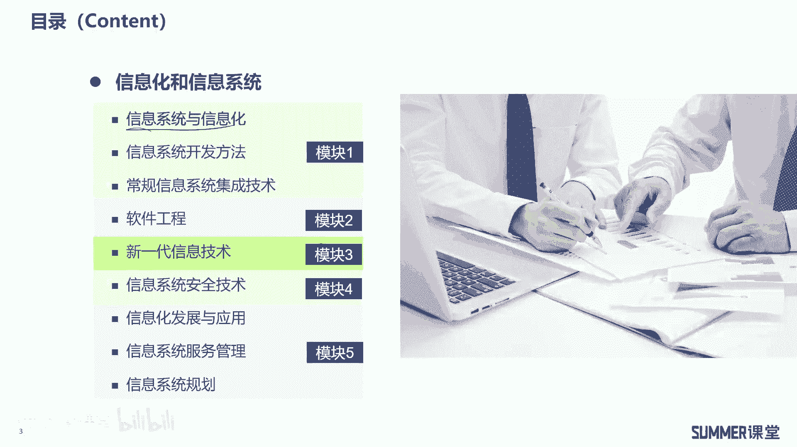
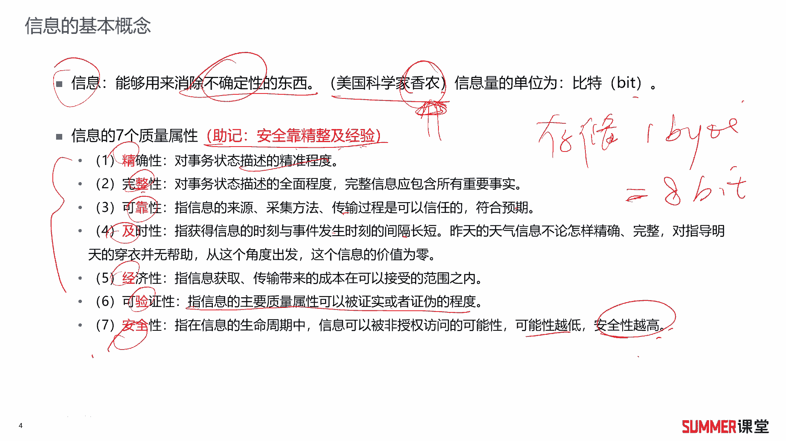
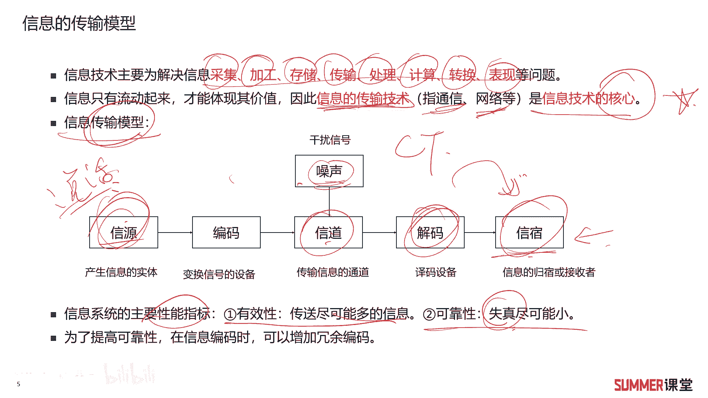
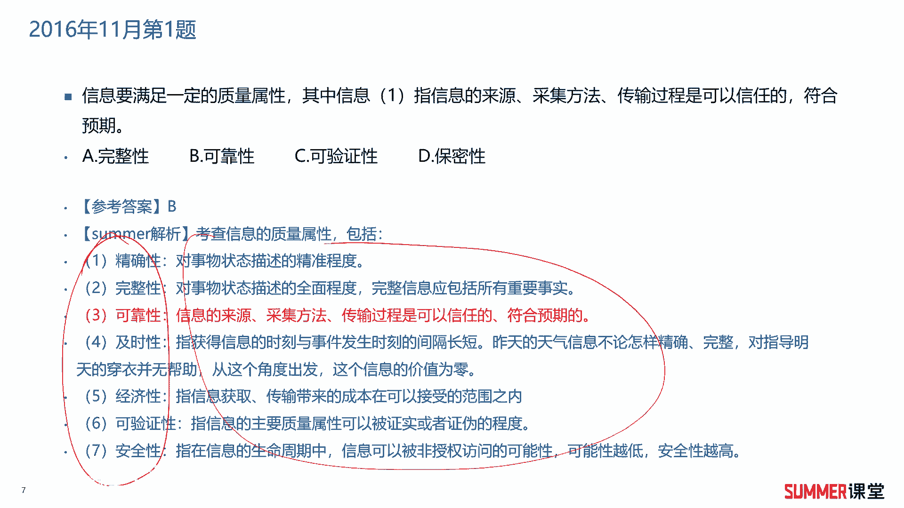
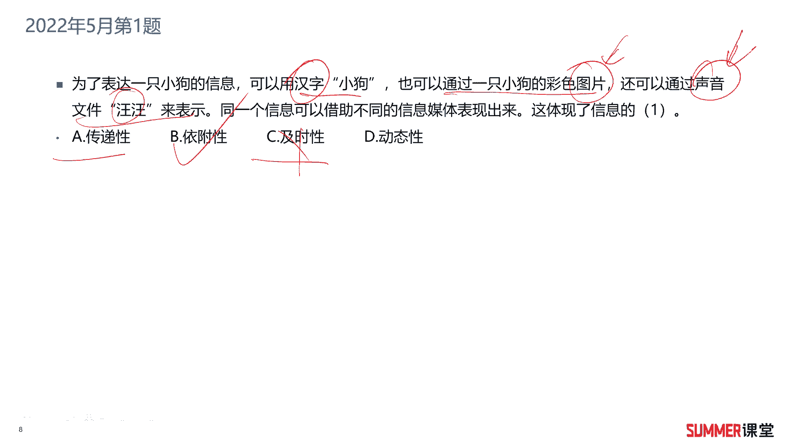
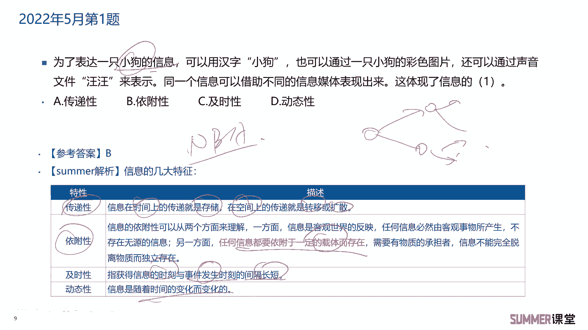

# 2023年软考信息系统项目管理师视频教程【总结到位，清晰易懂】-软考高项培训视频 - P2：1-1-1 信息基本属性 - summer课堂 - BV1wM4y1Z7ny

大家好，我是你们的夏老师，我们下面来学习第一章信息化和信息系统。

首先来看一下章节解读啊，这一章说实话哈内容比较多，书上一共写了十个小节，然后这些内容都是计算机相关，都是偏专业性的啊，偏专业性的，如果是非计算机专业的学员，可能学起来会有点累啊。

即使你是学计算机或者通信相关专业的啊，你也不可能对这些章节里面的内容全部精通，为什么，因为这十个小节里面，它涉及到的技术非常非常多，有基础的这个通信理论啊，还有软件开发的方法，软件工程以及网络工程。

计算机网络，还有信息安全，网络安全的技术，另外甚至包括新一代的什么区块链啊，物联网啊等等啊等等啊，这里面的内容非常非常广，如果你要把它讲透，它至少是浓缩了十本书啊，至少是浓缩的十本书。

要你要全部学透的话，至少要看十本书，而且那十本书的话，你至少加起来2000页不少嘛，2000也不少，而我们这本书第一章他只写了120页，120页，相当于他是把2000页的内容给你，浓缩到了120页里面。

给你做一个简单的扫盲啊，所以里面的很多知识点，你不可能学的很透的是吧，那即使你是搞计算机的，那你只可能对里面某一两个领域比较熟啊，比如夏老师可能对，对我们的网络安全和计算机网络这块，我是比较熟的。

新一代信息技术，这个也还好像软件工程啊，这些东西我大学学完了之后，后面我也用的很少啊，我也用的很少对吧，如果你是搞软件的，可能你对这块很熟，对软件开发方法很熟，那其他的计算机网络你能够讲的特别明白吗。

啊不一定是吧啊，所以我我希望给大家打个预防作用，就是第一章你基本上不可能把所有的领域，所有的模块学的特别透啊，但是考试一般不会考很难啊，你会做题就行了是吧啊，没有必要纠结哈。

如果你在哪方面学起来感觉比较难，那也是很正常的，不仅你难，全国人民都难啊啊好好在什么地方好，在第一章他只考选择题啊，大概上午会有20分的选择题，也就十个小节考20分的选择题，那最后一个小节还可以忽略。

那九个小节考考20分，那平均每个小节考个两分嘛对吧，平均每个小节考两分，案例和论文都不会涉及啊，都不会涉及，我给大家的建议就是掌握重点，会做题就行了，有些知识点你没有必要去深究。

你深究的话就容易掉坑里去是吧，我们更多的时间是要花到后面的十大管理，里面的十大管理是会考选择，会考案例，还会考论文，而这里边就只考选择选择题挂，然后下午两门过的人其实是比较少的，很多人挂要么挂论文。

要么挂案例分析啊，反正我见过的人当中很少有下午两门都过了，然后上午的选择题挂了的，明白啊，所以我也给大家打个预防针，就是不要掉到坑里去了，你花太多时间去搞第一章，第一章搞完了，最后20分，你拿个18分。

上午考个65，下午考个44，这这个何必呢，没必要哈，真没必要，那就20分，你能拿个十分啊，十分多一点，那就差不多了，考你最后上午考45分啊，没有问题的啊，没有问题，你们把更多的时间。

我希望大家还是要花到十大管理里面去，不要本末倒置，ok啊，第一章的话，你主要就是把我们讲的这些东西给掌握了，然后做一下真题啊，真题啊，真题建议大家至少要做啊，最近最近5年吧，大概5年。

有些可能做个3~5年也行啊，基础好一点的，可能做3~5年，技术差一点的，你适当的扩展一下啊，多做2年啊，多做2年，希望大家还要注意一个点，就是做真题的过程当中，你不你一定不要只做一遍哈。

做完之后你回过头来要去看错题，然后过段时间再拿出来再做一遍啊，再做一遍，不一定要打印一个新的去做，你就在以前的基础上再把一些呃一些高频考点，或者是你做错了一些题啊，再拿出来做一下。

ok这是关于第一章给大家的一些学习建议。

给大家的学习建议好吧，我们首先来看一下啊，我们对第一章的模块划分啊，第一章一共十个小节，我们是把它分成了五个模块，那前三个小节啊会到一个模块里面去讲，然后软件工程里面内容会比较多啊。

放到了单独的一个模块，新一代信息技术啊，包含什么区块链，物联网啊等等啊，这里面其实内容也不少啊，放到单独模块去讲，网络安全，信息安全技术啊，在模块四啊，最后信息系统啊和规划啊放到模块五。

所以第一章我们是放到五个模块去讲的啊，首先来看一下模块一里面的第一小节，信息系统与信息化啊。

这相当于是扫盲的啊，基础啊，首先来给大家去说信息的基本概念啊，什么是信息呢，信息是用来消除不确定性的东西，这是谁提出来的啊，一个美国人啊，每个科学家香农，香农这个人如果你是学过通信啊。

学过计算机网络相关的这种课程的，应该对他都比较熟对吧，他提了相文定理啊，香文公式，这是这是信息化的一哥啊，一谈到信息都会提到他啊，o然后信息量的单位是比特啊，信息量的单位是比特。

这里面顺便给大家去扩展一下，在存储里面单位是什么，有知道的吗，存储里面单位是bg字节是吧，一个字节等于八个比特，了解一下，了解一下，考试可能不会考你，但是这是基础啊，这是基础，接着信息有七个质量属性。

这七个质量属性希望大家把它作为重点，要多看两遍，要多看两遍啊，第一个精确性，对事物状态的精准程度啊，对事物状态描述的精准程度啊，看你描述的准不准确嘛啊，第二个完整性，对事物状态描述的全面程度。

完整信息包含应包含事物所有的重要事实啊，是否描述完整，然后可靠性指信息的来源，采集方法，传输过程都是可以信任的，符合预期的啊，比如说诶有一个很可靠的一个人，靠谱的人告诉了你一个消息。

然后你把你他这个消息是加密传送给你的啊，所以传送过程应该也是可靠的是吧，那这个人来源是可靠的，那么他给的这个消息大概率就是靠谱的啊，这叫可靠性嘛，第四及时性指信息的是啊。

只获得信息的时刻与性与事件发生的时刻，他们之间间隔的长短啊，间隔的长短啊，比如说你今天告诉我一个去年的新闻，你说及不及时不及时啊，今天早上你告诉我一个，我一个昨天晚上发生的一个事件，一个新闻。

那就比较及时了是吧，应该是很好理解的啊，五经济性，经济性就有便宜嘛，简单理解就便宜是吧，花的成本，花的钱在可接受的范围之内，可验证性质，信息的主要质量属性，可以被证实或者被证伪的一个程度啊。

是是否可以被证实，安全性是指在信息的生命周期当中，信息可以被非授权访问的可能性啊，如果可以被非授权访问的可能性越小越低，那安全性肯定就越高啊，这几个特性啊，大家多读一下啊，多看一下，那考试怎么考。

就是给一个出来啊，给一个他的解释出来，比如信息的主要质量属性，是可以被证实或者被证伪的，问你这是描述的信息哪一个质量属性很明显，可验证性是吧，那考试就这么考啊，当然也有可能他给你写几个出来问你诶。

哪些是或者哪些不是信息的质量属性，你把这几个稍微的还是要记一下啊，注意的话就是安全靠精准及经验啊，就是取一个词嘛是吧，安全可靠，精确性，这精准啊，完整性，及时性，经验就是经济性和可验证性这几个属性。

它总结了一下，ok这信息的七个主质量属性啊，相当于是第一个需要大家稍微要读一读。

记一记的知识点好，接着来看信息的传输模型啊，信息技术主要是为解决信息的采集加工存储，传输处理，计算转换表现啊等等这些问题啊，稍微看一下啊，不必记忆，信息只有流动起来才能体现其价值。

因此信息的传输技术是信息技术的核心，记忆的知识点，信息的传输技术就是不是我们常说的c t啊，通信嘛是吧，传输c t常说的就是c通信或者网络，然后接着是信息的传输模型。

这个模型应该是在很多书上都能见得到啊，在很多书上都能见得到，就我们把一个信息从信源它产生这个消息，然后传传到目的端吗，传到目的端中间会经过编码解码，以及在信道里面传，那信道里面可能就会有噪声，噪声。

说白了就是干扰信号啊，就是干扰信号，我举个例子，比如说你这边啊信源你通过电话产生了啊，不电话哈啊你是通过就是与说话嘛，打电话嘛，对吧啊，就是你你嘴巴就是信源啊，产生了一个消息啊。

最后通过电话这个线传传到对端啊，传到对端，它会经过怎么样的一个过程呢，肯定在你电话机这会进行一个编码啊，其实除了编码以外，它还有魔术转换，会把你说话的这个模拟信号转换成数字信号，转换成数字信号。

然后进行相应的编码，编码有两层意思，第一个是在信息编码时加入一些冗余的，加入冗余的编码，就即使在中间传错了一些，他可以做适当的纠正或者检查出错误嘛，加入冗余编码，第二个还是信道编码。

就是把你的这个啊消息，转换成适合我们电话线传送的这种信号，那比如说一中间电话线可能就有些啊，有些可能甚至是光纤的对吧啊，转换成光，比如说它就如果中间有些是光纤，它可能就转转换成光纤号去传了对吧。

转换成光信号去转，然后到对端进行相应的解码，解码出来发给对方吗，发给对方，ok这就是我们整个信息传送的模型啊，信息传送的模型，信息系统主要的性能指标有两个，第一个是有效性，表示尽可能多的传送信息。

然后可靠性也是尽可能小的，失真失真要小船的信息要多，这是它的两个性能指标。

两个性能指标好，我们下面来看两个真题啊，2016年11月的第一题，信息要满足一定的质量属性，其中什么其信息的什么特性指信息的来源，采集方法，传输过程是可以信任的，符合预期，很明显可靠性是吧。

告诉你这个消息的人啊，其实来源它是靠谱的啊，你采集的方法啊，你采集比如说你是通过啊，通过呃录录录录音机去采啊，采集一出来没有失声是吧，然后传送过程比如你是加密的，那整个过程就是可信可信任的嘛。

那很明显是表述的可靠性，可靠性啊，这七个属性啊，希望大家把他们的地理要好好的看一下。

好接着看另外一道题，2022年5月的第一题，为了表达一只小狗的信息，可以用汉字，还可以通过声音汪汪来表示，同一个信息，可以借助于不同的信息媒体表现出来，这体现了信息的什么特性，这块好像没给大家去说。

但是你通过提议是不是很好分析出来啊，它有没有表表现及时性啊，没有提到什么时间的概念对吧，有没有提到传递啊，没有很明显嘛，就是相当于我们这个小狗的信息，它可以依附于汉字或者图片或者我们的声音。

这是典型的依附性啊，你稍微分析一下，这种题肯定是能够选择出来的。

对吧啊，这里面顺便给大家说一下啊，信息的几大特征，第一个传立性，它是指信息在时间上的一个传，它又分两方面哈，第一方面信息在时间上的传递就存储嘛，我们把信息存下来，在不同的时间都可以去阅读。

在空间上的传递性，就是转移或者扩散啊，比如说我的一个消息，从一个人扩散扩散到很多人，这是不是空间上的一个传递，第二个依附性，就任何信息都要依附一定的载体而存在，那这道题里面。

小狗这个信息它是不是就依赖了啊，依附了三个载体啊，他依附了三个载体，然后及时性啊，前面讲过吗，就是获得信息的时刻与发生的时刻，它中间的间隔，动态性是指信息随着时间的变化而变化啊，比如说你看球赛啊。

n b a啊，nba某场比赛，他的得分是不是随着时间的变化而变化。

