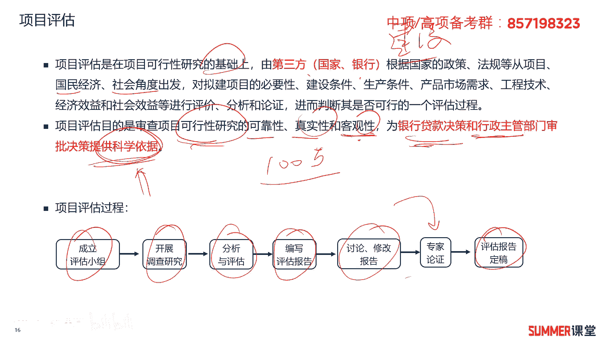
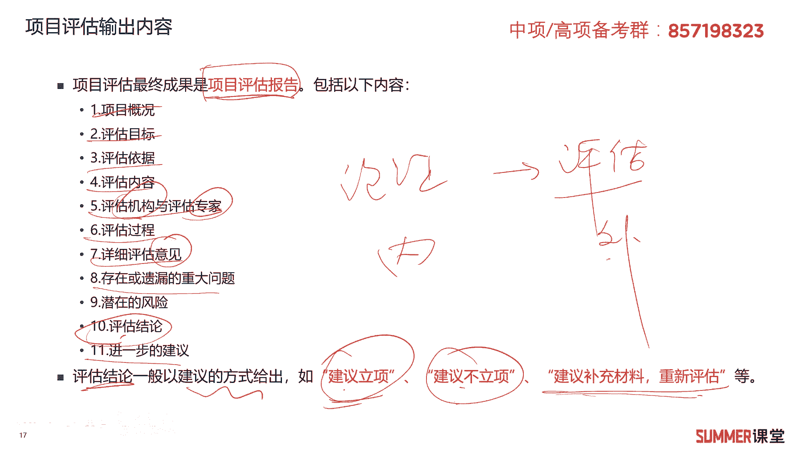
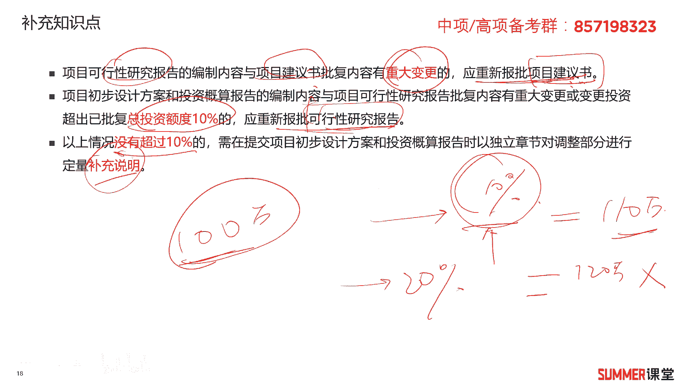
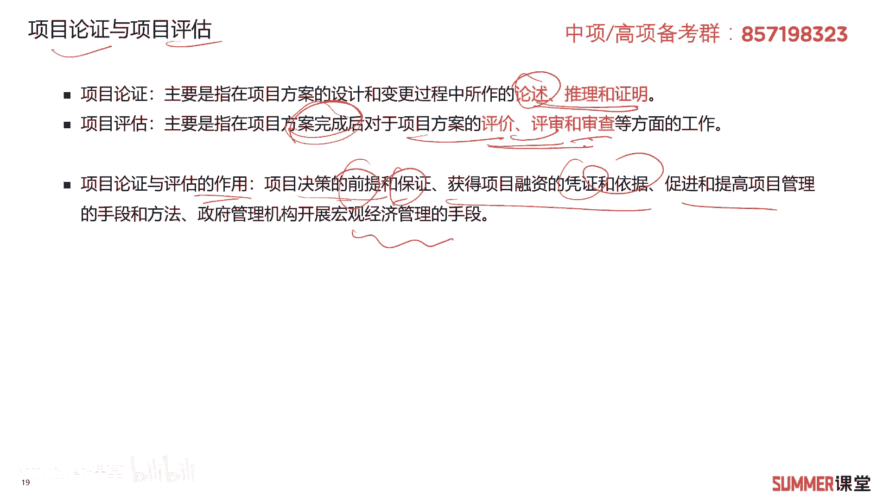
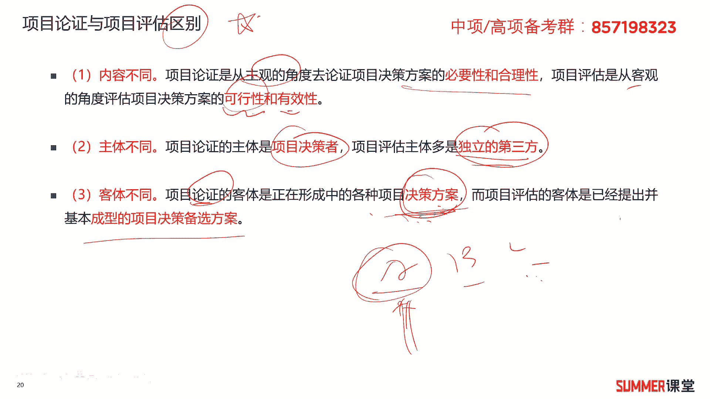
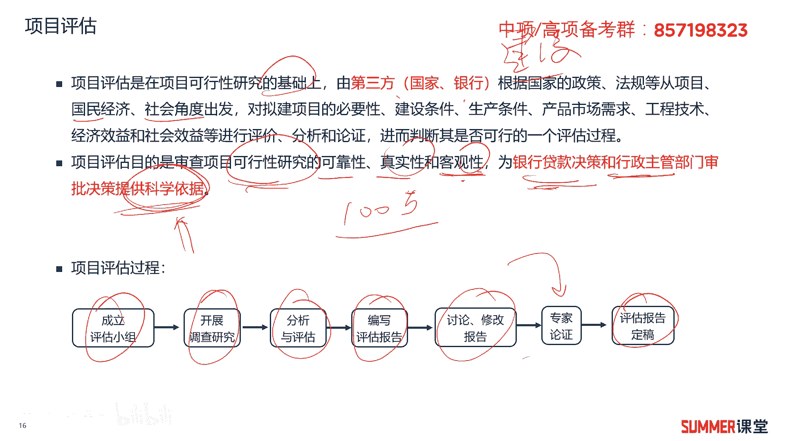
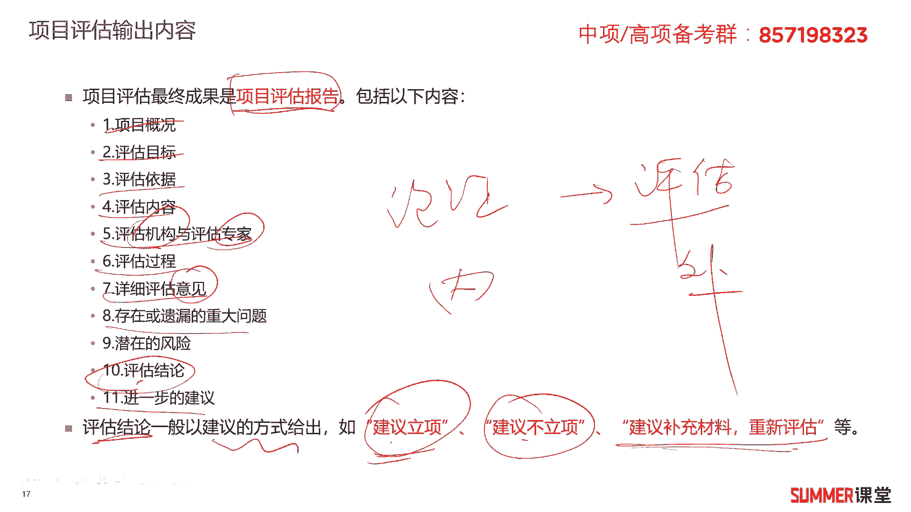
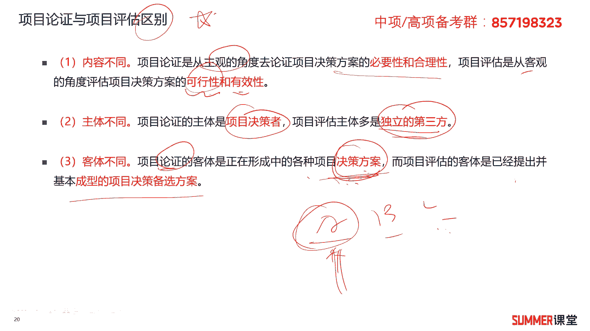

# 2023年软考信息系统项目管理师视频教程【总结到位，清晰易懂】-软考高项培训视频 - P31：3-3 项目论证与评估 - summer课堂 - BV1wM4y1Z7ny

我们前面给大家去讲解了项目的论证啊，以及可行性研究，这里面我们再给大家去说一下啊，评估，最后我们对比一下项目的评估和项目的论证。

他们有什么区别，有什么差异，首先项目的评估，它是指在项目可行性研究的基础上，由第三方根据国家的政策法规，从项目狗，从项目国民经济社会角度出发，对拟建项目的必要性，建设条件。

生产条件等等进行一个综合的评估是吧，这里面需要注意我标红的评估是由谁进行的，是由谁是由第三方关键词，第三方可以是国家的一些机关部门或者是银行，它肯定不是建设方，肯定不是我们甲方。

建设单位对我们项目进行评估啊，不然你既当运动员又当裁判，那肯定不合适呗对吧，项目评估的目的是审查项目的可行性，研究的可靠性，真实性和客观性啊，比如说你搞科研，本来一个项目需要100万的。

当你搞科研最后最后需要一个亿，这肯定不真实，不客观嘛对吧，大家都想做大项目，做大项目对吧，有些有些不好说哈啊，做大项目的话，这个这个有有些东西就就有水是吧，所以他能够为贷款决策和行政主管部门审批。

提供科学的依据，提供科学依据，标红的哟，需要注意，这是考试的考点，项目评估的过程，首先成立评估小组，开展调查研究，分析与评估，编写评估报告，最后讨论修改报告可能会经过专家论证啊。

几个专家签一下字a证明这个评估没有问题，最后评估报告定稿，这过程了解一下啊。

了解一下，那接着评估它的输出内容，就是项目评估报告，项目评估报告包含如下的一些内容啊，一共11点，不需要你记住，但是你要熟悉一下第一个项目的概况啊，评估目标，然后评估的依据，评估的内容。

评估机构由谁评估的，然后评估专家的姓名，然后接着是评估的过程，评估的意见存在或者遗漏的一些重大问题，潜在风险评估的结论，进一步的建议啊，一般评估的建议或者结论啊，一般是建议你想不建议你想。

或者建议你补充材料进行重新评估，就是结论一般是以这种建议的方式给出来的，o这是项目的评估，刚刚是不是讲了，一般像现代项目管理当中，这是先论证在评估吗，论证是不是内部的呀，评估是由外部第三方进行评估。

这需要注意的哈，这里面再给大家稍微补充一下，项目可行性研究报告编制的内容，与项目建议书批复内容有重大变更的，应该重新重新提交我们的项目建议书啊，这是需要注意的哈，就是你可言里面的内容。

跟你提交的立项报告的内容有重大变更，需要重新提交立项报告啊，因为立项报告也叫项目建议书，接着项目初步设计方案啊，与投资概算有重大差异的啊，如果超过已批复金额的10%，需要重新报批可研报告啊。

一般情况下我们做项目，比如说一个100万的项目啊，最后啊有一些增加减少啊，比如说增加了百分之9%或者10%吧，这边极限啊，增加增加了10%的金额，你不需要重新去报批了，就相当于走变更。

你最后可能得到的是110 10万的付款，这是可以的啊，这也是有10%的灵活操作空间对吧，如果你的项目100万啊，最后你说变更要增加20%，你说给我交付120万行不行，行不行，这就不合规啊，超过10%。

没有超过10%的，直接补充说明就行了，超过10%，那你要重新去走招投标，重新去走报批的流程，这个过程就很长了，所以一般我们做项目要做变更的话，那绝大部分情况都不会超过10%。

你可以按照10%这个顶点去做，但是不要超过10%啊，这是一个常识啊。

这是一个常识，接着给大家去对比一下项目的论证和评估，那项目的论证主要是指在项目方案设计和变更，过程中去做的一些论述，推理和证明，一般是内部进行的，项目评估是在方案完成之后，对项目方案的评价评审或者审查。

这是项目方案完成之后，论证和评估的作用也是不一样的啊，他们作用不一样哈，项目决策前那项目决策的前提和保证呃，它们的相同作用哈，是项目，我看项目决策的前提和保证，获得融资的凭证和依据。

促进和提高项目管理的手段和方法，政府管理机构开展宏观经济管理的手段。

这是论证和评估它们相同的作用啊，这么几点啊，大家读预估，接着区别来了啊，区别作为一个重点，做一个重点标红的第一个，他们的内容不同对吧，论证是从主观的角度去分析这个项目能不能建，有没有必要性，合不合理。

评估是从客观的角度去评估我们这个方案的，有效性和可行性，另外主体不同，论证我们内部项目决策是自己搞的，评估都是独立的，第三方课题不同论证，我们是论证的多个多个方案是吧啊，多多多多个决策方案。

就a b c d我们论证一下哪个最好，而评估是可能你已经决定要用a了，我们对a再进行一个啊，再进行一个深入的剖析嘛，这就是项目论证和评估的一个区别啊，我觉得这儿可以再把它优化一下啊。

争取写的更通俗易懂一点啊，就是项目的论证啊，是论证多个可备选方案的好坏是吧，然后评估是评估的，我们已经选出来的这个方案的可行不可行性，叫也可以说可行性是吧，那就有效性嘛啊是是否是否公正客观嘛对吧。

前面已经说过哈啊是否客观。

是否真实，是否可靠啊，这是项目评估的啊一个作用啊。

针对评估和论证，希望大家要能够区分，那怎么区分，不是说你要把这些背下来，背下来没必要啊，该让你背的时候，我会让你背的啊，有些东西你使劲背，你也给我备注，但是这一块的话啊。

怎么讲呢，还是偏理解为主是吧，理解了啊，到时候会做题就行了好吧，这是我们的第三章项目立项管理，这一块是我们在在在做项目之前，就要去做的一些事情啊。

