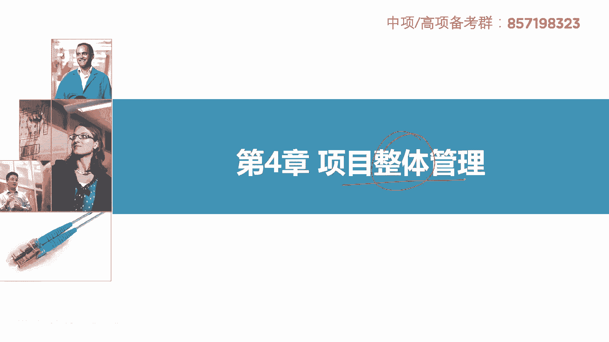
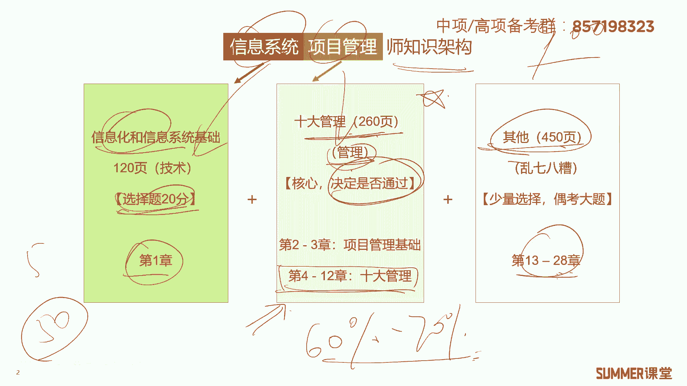
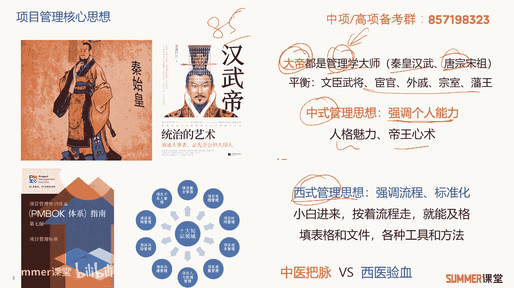
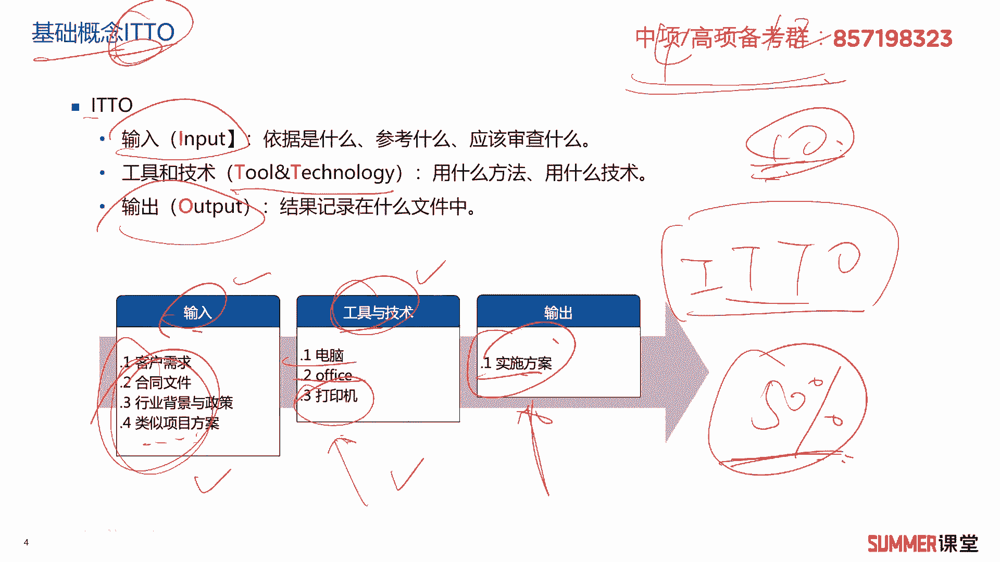

# 2023年软考信息系统项目管理师视频教程【总结到位，清晰易懂】-软考高项培训视频 - P32：4-0 项目管理核心思想（中式和西式） - summer课堂 - BV1wM4y1Z7ny

大家好，我是你们的夏老师，我们下面学习第四章项目整体管理，有些地方也把它叫做项目整合管理啊，一个意思在正式开始之前。

我们还是给大家去梳理一下教材的架构，以及信息系统，项目管理师，我们要学习的一些知识架构，主要分成三块，信息化和信息系统的基础，十大管理，还有其他的内容啊，其中信息化和信息系统啊。

这个就是i t的一些技术，对应着我们教材的第一章，他只考上五上五选择题，而且考20分啊，上午选择题的分布就是20分的技术，加上加上五分的英语啊，其他50分就是后面这两块的内容啊。

第二块是最核心的十大管理，十大管理上午选择题考，下午案例分析考，最后论文还会考你，所以它是最核心最重要的，不仅考，而且占的分值和比例非常非常高，就拿案例分析来讲，什么进度。

十大管理当中的进度管理成本给管理每年必考，然后论文一般来讲，论文每年都有两个题目，其中至少一个是十大管理的啊，当然2022年5月份论文就只有一个题目，干系人管理，干性人管理肯定是十大管理内容之一啊是吧。

所以教材最重要的就是十大管理的内容，它对应着我们的第四章到第12章，一共是260页，整本教材900页，最核心的内容260页，发现没有，如果你掌握重点的话，哪些是你需要多花时间的呀。

就这东西他站的在教材上占的篇幅其实不多，但是它很重要，别看他只有不到1/3的篇幅，他考试的分值是到达到百分之六十七十之间的，所以我们是不是要把握重点啊，是不是啊，是不是要把握重点，它很重要。

它直接决定了你能否通过这个考试，这就是管理的内容，对吧啊，其实信息系统项目管理师，那就分成两个部分，第一章是信息系统，然后最核心的就是偏向于管理，后面还有一些其他的管理哈啊乱七八糟的。

我觉得写的也不够惊艳，后面的这些章节，你别看他写了，从第13章写了28章，其实很多章节都是在废话，并没有太多实质性的内容啊，当然有些章节还是需要还是需要学哈啊，我们到时候会给大家去去讲啊，会给大家去讲。

所以我希望大家学习的过程还是要有有重点，就是中间这部分肯定是你学习的一个，那学习的一个重点嘛是吧，ok这是关于教材，关于我们这个考试的知识体系和架构，让大家有一个基本的认识。

我们接着来看一下啊，分享一下项目管理的核心思想，我把它分成了中式管理思想和西式的管理思想，那先来看一下中式的管理思想，就是我们历史上啊经常学到的啊，秦皇汉武，唐宗宋祖，其实把他们放在管理学上。

他们都是管理学的大师啊，都是管理学的大师，我记得前段时间我看了一个电视剧，讲唐太宗的85集啊，特别长哈，但是看起来也挺有意思哈，看起来挺有意思，就是你就会发现哈，唐太宗李世民这个人真的很牛逼。

至少在人力资源管理这块，绝对算得上是算得上是一流的啊，太厉害了，他能够很好的去平衡文臣，武将宦官外戚宗室藩王，然后各种城下之间的一个关系，而且把他们拿捏的死死的啊，把他们拿捏的死死的。

这就体现了强烈的体现了这种人的人格魅力啊，帝王心术嘛啊真的是很很厉害哈，啊我其其实以前还看过其他其他名人，其他名字，比如说像秦始皇啊，怎么去统一六国，汉武帝他的这些汉武帝，他这些电视剧啊。

我觉得都很经典哈，反正这些大地的电视剧纪录片这些，我觉得如果你从事项目管理，你是可以好好看一下，好好研究一下的，因为里面牵涉到很多管理的东西对吧，这就是中式管理的思想，他比较强调个人的能力。

能成为这些大地的，他的能力，至少某方面的能力真的是特别强啊，大帝嘛它主要是它其实就是管理者嘛，管理天下是吧，治理天下算不算管理，那肯定算啊啊，中式管理就强调个人的能力。

你看中国历史上一共出了差不多500位皇帝，能算得上大帝，能具有特别强管理艺术或者技术的这种人，很少能称得上大帝的，不足20位，你可以去研究一下哈，优秀的皇帝也不少，但是能能跟他们去比，签的不超过20位。

对吧啊，这是中式的管理思想，比较强调个人的能力，然后西式的管理思想呢，他会比较强调流程和标准化，这什么意思呢啊，就是小白，你进来你啥都不会啊，没关系，按照我这个流程走，你就能及格啊，用我们四川话来讲。

就是ps 4都有提成，啥意思啊，就是你按照我的标准来啊，第一步干啥，第二步干啥，第三步干啥，那最后你可能达不到90分啊，100分你达不到这种大地的水平，但是你做一个普通的项目管理者，达到个60分。

70分是没有问题的，这就是西式思想啊，所以西式的这种项目管理思想，它有一个好处，就是能够批量的复制对吧，小白进来之后诶，我就能够让你做项目经理，然后去做一些管理吗，当然不是说小白今年马上就做项目经理哈。

啊经过我的培训嘛，跟着我的流程去走嘛，是吧啊，你主要干什么，你就填表格填文件，然后按照我的这个工具和方法啊去走啊，这个可能还不是特别好理解，我给大家举个例子啊，不知道大家有没有小孩哈啊。

我记得在我们家小孩小的时候就经常生病嘛啊，经常去医院啊，去医院的话，基本上他就是按照流程化，标准化的这个形式去走，小孩去医院看病嗯，他整个流程大家有印象吗，第一步去挂号是挂号，排队。

排完队看找医生看嘛啊找医生看也特别标准啊，第一步看一下你的这个舌头啊，然后喉咙有没有有没有发炎是吧，第二步啊，然后听一下你的这个什么肺啊，有没有得肺炎啊之类的，然后第三步小孩感冒哈，还第三步干啥。

第三步验血，它可以通过你血的指标，判断你这个感冒是病毒性感冒还是细菌性感冒，是不是还是还是细菌原因造成的啊，所以从而对症下药嘛，是不是这样标准的流程啊，啊这这就是典型的西医嘛。

啊标准标准的这个流程都按照这个步骤再走啊，反正小孩生病啊，基本上百分之八九十都要验血，他都去抽抽，那个也不是抽血啊，就指子母血嘛，那叫末梢血啊，一点点啊一点点，但是这个东西还验出来还是比较精确的对吧。

但是中医小孩生命有去看中医了吗，有没有有多少人敢给小孩喝中药啊，这不太现实嘛对吧，中医一般来讲就是把脉把脉啊，其实我以前啊也也也看过比较多哈，十个中医拔出来的脉象有八种，这很典型的就不太标准化了。

当然我这里面不是要去对比中医和西医哈，我只是为了说明一个问题，就是中式的管理思想就跟中医就比较类似，他强调个人能力，那中医里面100个人可能有一个神医，然后90个普通的。

然后剩下的可能还有还有还有还有几个庸医，是吧啊，庸医可能都还不止啊，不止这么多哈，这个神医特别厉害啊，像什么扁鹊呀，然后像李时珍啊，这种绝对算得上是神医这个层面，但是西式的啊。

这个西医可能100个医生里边有有有一个神医，这里差不多可能一个神医他都没有，因为他主要什么，他主要按按照标准化流程去走啊，不容易出神医，但是他的大部分人都能得达到60分到70分，这个水平。

而中医可能大部分人只有20分，30分这个水平是吧啊，这就是中式和西式的一个区别，我们的项目管理，我们这本书，我们的这门课程学的是中式还是西式的思想，西式的他学的还是西式的思想，就是按照标准流程去走。

这个流程非常固定，套路就给你写，书上给你写的清清楚楚的啊，高像这本教材，它项目管理部分是基本上是照搬美国的，这个偏不可啊，第五版现在已经出到第七版了哈，但具体的内容没有太大的变化。

最核心的就是十大管理啊，怎么去管，怎么去改一个项目，主要从十个领域啊，项目整合管理，然后管进管成本，管质量，管人管沟通，管进度等等，反正就从这十个方面去管，具体怎么管，第一步干什么，第二步干什么。

人家给你写的清清楚楚的啊，所以所以我们学的这个项目管理，这个课程其实虽然是管理，但是看起来还是挺机机械化的，第一步干什么，第二步干什么哈，有点机械化是吧啊，所以所以怎么讲呢，你说你学完这个课程。

项目管理能力就要有多大的提升啊，我告诉你不太现实，就是他学的这些东西，你说有用没有啊，还是有用的，但你说学完立马有这个立竿见影的效果，不太可能，你还是要去项目里面去历练啊，去经验经历。

因为有些项目当中用到的啊，这个课程里面也不会完全讲到啊，当然我还是会稍微的给大家去扩展一下对吧啊，ok这是中式和西式的项目管理思想，项目管理思想啊，注意我们学的主要就是流程和标准化。

那具体怎样的流程和标准化，其中有你里面有一个非常重要的概念，叫i t t o，i t t o是从教材的这个第12章到第呃，第二章不是第二章，第四章到第12章，这这九章吧应该是我看看是不是九章。

第四章到第12章，第九章，九张十大管理啊，有人说为九章，为什么是十大管理，因为有一张他是两大管理，人力那个沟通和人干性的管理，他把他放到一起了，因为他觉得这都是跟人相关的对吧，把它放在一起啊。

所以也是十大管理啊，这十大管理里面重点会用到的一个概念，叫i t t o，什么叫i t t i叫input，输入o叫output，输出中间的tt是工具和技术，这两个单词的一个缩写，什么意思呢。

它是一个什么样的理念呢，那举个例子，比如说啊，你是一个项目经理，你要做一个实施方案，要输出一个实施方案，你以前没有做过实施方案，那怎么办呢，你想你写方案以前又没写过，那最容易想到的。

是不是以前以前的这个类似方案的模板，拿出来用一下呀，对吧，是不是可以参考它，还可以参考什么，写方案嘛，肯定要看客户的需求，由于是实施方案，这项目肯定已经到了到了签订签完合同，开始实施这个阶段了。

那是不是需要项目的合同文件，把合同文件找出来看一下嘛，啊合同里面有什么要求是吧，里面是会要求的，然后诶我做的这个项目它是什么行业的呀，啊公安教育医疗政府，军工能源啊，什么行业。

每个行业都有自己的行业背景政策，自我还要参考一下行业里边的一些内容啊，对吧啊，当然你的输入可能还有其他很多，我这里面只是随便举的这几个例子就写，为了写这个方案，我要参考哪些东西，我要依据哪些东西。

这叫输入啊，这叫输入，然后输出的话就是我的实施方案哦，啊怎么输出，怎么通过输入来达到输出，是不是还有一些工具和技术啊，啊我写方案，我现在写方案是用手写吗，很少吧，现在写方案大部分人都用电脑是吧。

电脑是不是你的工具啊，是还可能会用office wps这一类的办公类软件，最后你把方案写完之后，你要递交给客户，是需要打印机打印成纸质的，给客户提交过去，这就是这就是i t t，为了得到这个方案。

我需要相应的一些输入，需要相应的一些工具和技术，我们整个项目管理的总体思路就是参考i t t，那每一步你要得到一个东西，为了得到这个东西，我要参考什么，我要用什么工具和技术。

i t t o贯穿于整个项目管理的核心内容，嗯希望大家能够理解啊，我记得当时我学高校这门课程的时候，听那个老师讲的快50%的课程以上了哈，整本书都快讲完，讲讲了五六十了啊，讲的差不多了。

反正我一直没有明白啊，什么i t t o啊，什么十大管理意，所以我从来就没曾明白过，我希望我讲到这儿的时候，你对i t t有一定的感觉，待会儿我们讲真正的管理管理当中，i t t o的时候。

你能够联想起来，就能够能够从深处去理解，它是个什么样的一个理念是吧，说白了就是一个流程嘛，标准化的一个流程是吧，ok这是我们项目管理的一个基础概念。

