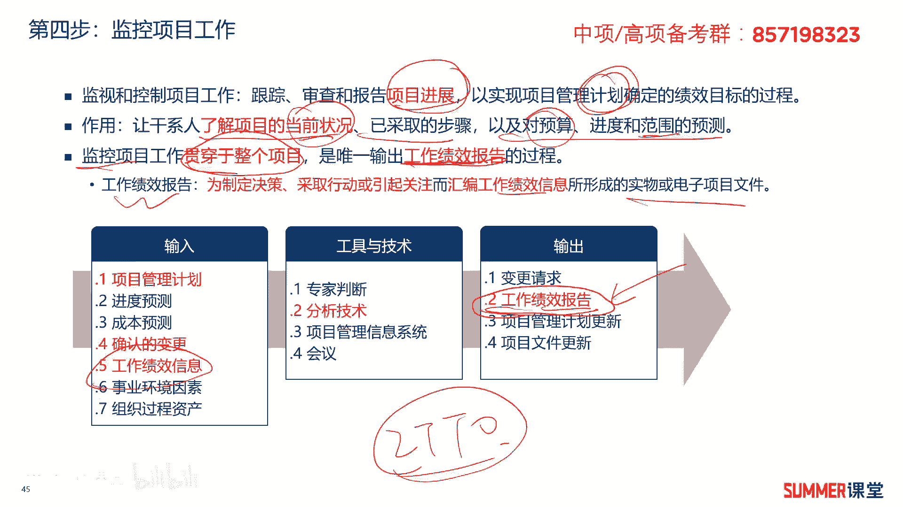

# 2023年软考信息系统项目管理师视频教程【总结到位，清晰易懂】-软考高项培训视频 - P37：4-5 监控项目工作 - summer课堂 - BV1wM4y1Z7ny

好我们接着来看项目整体管理的第四步，叫监控项目工作，你做好了计划，而且开始执行了，下一步是不是要监控，你的执行有没有偏离我们的计划吗，应该几个过程的逻辑还是很清晰的对吧，一步一步往下。

ok我们首先来看一下啊，监控项目工作啊，他是监视和控制项目工作的一个缩写，主要就是跟踪审查和报告项目的进展，你的进度有没有落后，然后钱有没有花多是吧，这就是这个过程要干的事情。

以实现项目管理计划确定的绩效目标的过程啊，主要就是让我们跟着计划走嘛，不要偏离计划对吧，作用是让干细则了解项目的当前状况，已采取的步骤以及对预算进度范围的预测，就是按照我们这个计划走嗯，预算超不超标啊。

超标多少钱啊，或者预算还会节省多少钱，进度能不能如期完成，还是要推迟十天20天啊，范围控制的这个怎么怎么样是吧啊，这些都是这个过程的一个作用啊，这里面顺便问大家一个问题，刚刚应该也给大家去讲了。

就是让干系人，其实最主要的，就是让领导了解我们当前项目的状况，怎么让他了解是通过哪个风险工作，绩效报告给您家导打个报告嘛是吧，而且先前还梳理了工作绩效数据，工作绩效信息和工作绩效报告它们的区别。

这是重点啊，这是重点，然后需要注意的是，监控项目工作，它是贯穿于整个项目的，我们时时刻刻都要去监控，是唯一输出工作绩效报告的这个过程，只有监控项目工作，他的输出。

有工作绩效报告作为一个记忆的至少知识点啊，作为记忆的知识点，然后什么是工作绩效报告呢，他是为制定决策，采取行动，或引起关注而汇编的工作绩效信息，所形成的实物或者电子项目文件，说白了它是一个文件对吧。

那这个文件它汇编了各种绩效信息，而且对绩效信息做了一定的解读，这就叫工作绩效报告，方便领导看是吧，这个构成的i t t o啊，这是我们这是我们的一个重点哈啊，无论哪个过程都要学。

i t t i t t l里面，它的输入输出相对而言也比较多，但是我们重点关注我标红的哈，啊重点关注标红的啊，输出最重要的就是工作绩效报告，然后输入基本上所有的过程，你看输入都是有项目管理计划的是吧啊。

计划嘛，我们要监控，是不是要监控实际的和计划的一个差距啊，差距啊啊所以肯定有计划啊，还会有确认的变更工作绩效信息需要注意哦，这里面有个工作绩效信息输出，是工作绩效报告，相当于把绩效信息整合一下。

梳理一下，最后输出给领导看了一个东西，ok好。

我们还是一个一个的来来来看哈，啊重点我们就看这个它的工具技术哈，重点就看工具技术，因为这个东西前面都讲过是吧啊，前面都讲过啊，重点来看一下他的这个工具技术，工具技术里边只有一个特殊的叫分析技术。

分析技术，它在项目管理中，可以根据可能的项目或者环境的变化，以及他们之它们，以及它们与其他变量之间的关系，采用分析技术来预测潜在的后果啊，什么意思啊，就运用分析技术分析。

按照我目前的进度可能要超标30万对吧，这这些分析技术分析出来的吗，或者是可能要延期30天，对不对，这就是预测潜在的后果嘛，啊当然可用于项目分析的技术很多啊，非常多，我们标红的，你重点注意一下啊。

因果分析根本原因分析，像这个是用在质量管理里面的啊，模拟用在风险管理里面，而且还会给大家去讲蒙蒙特蒙特卡洛分析啊，蒙特卡洛模拟它其实就是一个定量啊，风险分析的一个方法，我们现在都没有讲到啊，都没有讲到。

只是你对分析有一个基本的认识就行了啊，有个基本的认识，包括故障数，然后还有正值分析，这都是后面的重点，像正值分析法的话，那政治管理，它是进度和成本管理里面，非常重要的一个东西啊。

就分析一具体到底是不是要超标啊，多少钱或者超标多少钱对吧，这些政治分析它都是分析的方法啊，分析的方法包含这些，这个阶段你就先了解，因为都还没讲到，这是后面要讲的内容啊，你知道他分析能带来什么效果就行了。

是吧好吧，这是这个阶段的工具和技术啊，其他的这个输入输出啊，应该都还比较好理解，我们重点看标红的。

接着再给大家总结一下这几个东西，它跟我们这些过程组的一个关系啊，工作绩效数据，它是指导与管理项目执行的输出啊，他又被输入到除了整合管理以外的，所有的监控制过程啊，然后输出的东西叫工作绩效信息啊。

工作绩效信息，然后工作绩效信息作为项目整合管理，或者整体管理，监控监控项目工作或者监控项目呃，就监控项目工作哈，作为它的一个输入，输出的是工作绩效报告啊，输出的是工作绩效报告，工作绩效报告又作为管理。

沟通和实施整体变更控制的一个输入啊，这是这三个东西，它输入输出跟跟我们整个过程组的一个关系，我们现在已经学了的指导与管理项目执行，然后监控项目工作是吧，这已经学到了哈。

基本上基本上这三个东西就已经就已经学全了，除了后续的这两个东西没学，其他的都是有的啊，这里面需要注意一下哈，啊大家可以通过这种啊梳理的这个呃图啊，来记忆一下，就是这三个东西它是哪些过程的输入。

或者哪些过程的输出，这是重点考点，核心考点，希望要引起高度重视啊，理解最好啊，理解最好，如果你理解不了的话，死记硬背也得给我，也得给我备注，至少在上考场的时候，你得给我备注啊，谁是谁的输出。

谁又是谁的输入，是吧啊，比较好理解的应该就是这块干活啊，最后会输出绩效数据啊，然后这块啊你这么记吧，这块监控项目工作，是把绩效信息转化成绩效报告啊，其转化给记下，转化成绩效报告之后，这个给谁看。

给领导看是吧啊，中间这个可能有一点绕啊，有点绕，你实在不理解就算了，如果能理解，那你后面学完后面的可能就好理解一点，现在没学，所以你不好理解，你先把我画两个圈的这个地方，画两个圈的地方先给我记住。

那其他的后面学完之后，你再来看这个图就更清晰了。

