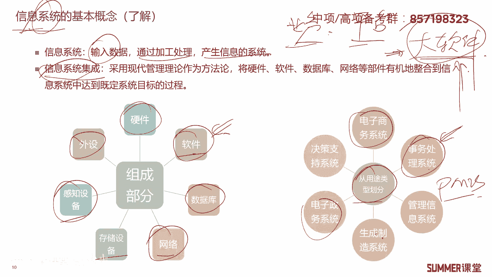
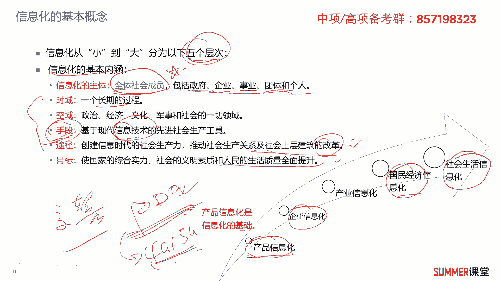
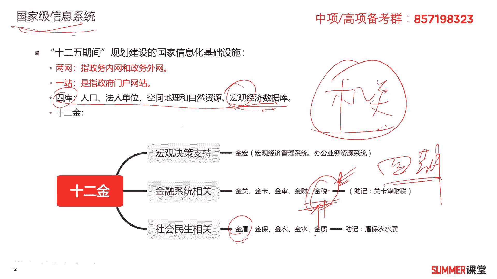
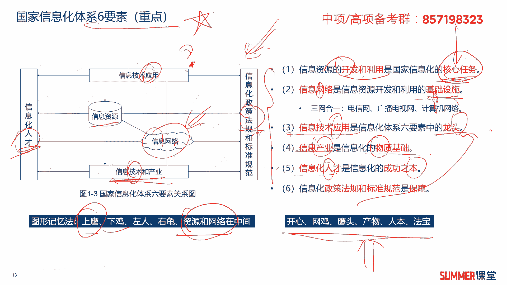
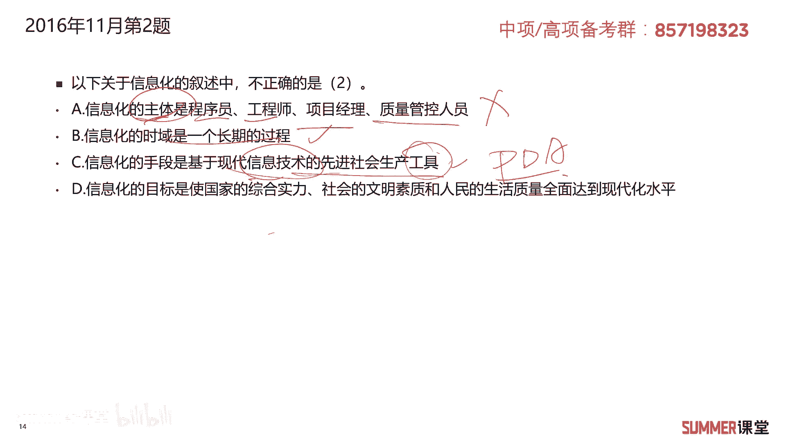
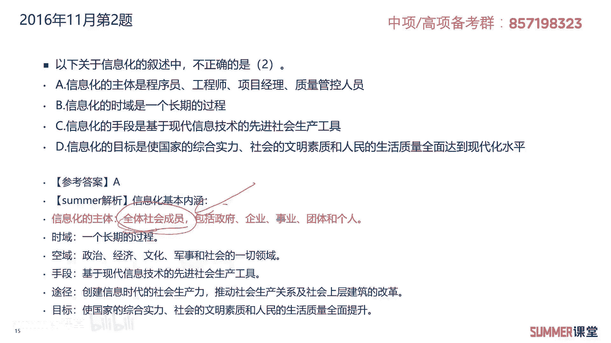
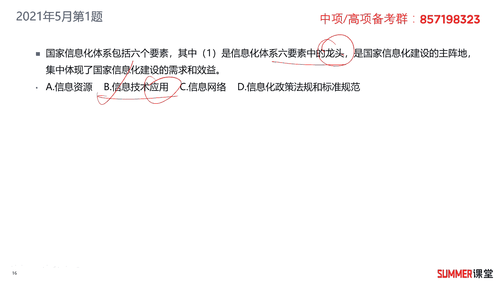
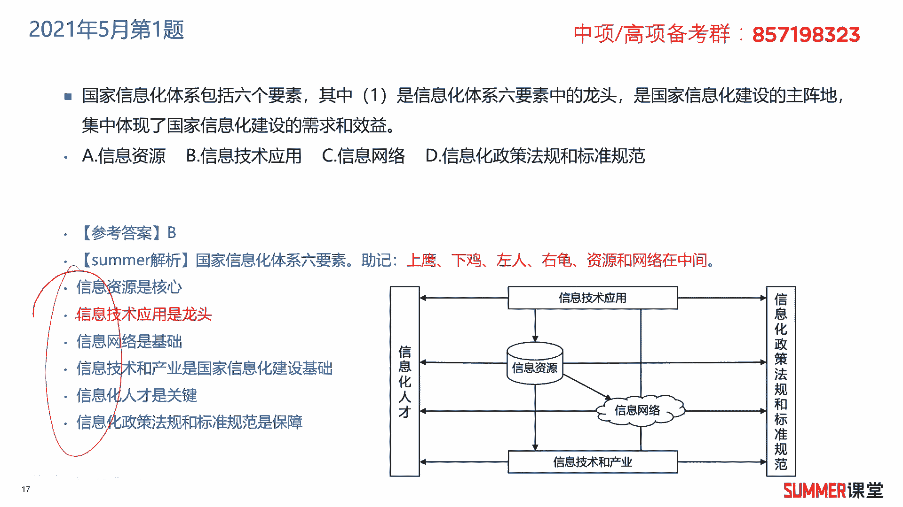

# 2023年软考信息系统项目管理师视频教程【总结到位，清晰易懂】-软考高项培训视频 - P3：1-1-2 信息化与信息系统 - summer课堂 - BV1wM4y1Z7ny

我们下面来学习信息系统，首先是信息系统的基本概念，而信息系统是输入数据，然后经过加工处理产生信息的这么一个系统，说了当没说，讲完，也不知道他到底说的是什么东西对吧，可能很多人都会有这样的疑问哈。

关于信息系统啊，有些地方甚至直接给系统，还有一些地方给业务系统，业务平台是吧，包括业务平台这种，它到底指的是什么东西啊，我给大家一个通俗易懂的解释，可能不是特别准确，但是帮助你理解肯定是没有问题的。

你把这种信息系统，业务或者平台都翻译成大软件，大软件就是它是一套比较大的软件，功能很多，模块复杂，那花的钱也比较多嗯就翻译成它就行了啊，所以什么是信息系统，就是一套大软件嘛，是吧啊。

当然啊你看信息系统这一套大软件，它由哪些部分组成呢，啊有哪些部分组成啊，你软件肯定要有各种各样的软件模块对吧，还有软件还有什么软件要跑在硬件上了啊，比如说典型的qq微信这些都是软件，没有手机电脑。

你能运行吗，运行不了对吧，那后台还有数据库啊，我们要通过网络去去发这个，微信或者qq的消息嘛是吧，后台还有存储设备啊，感知设备典型的，比如说有些地方企业级的应用，可能还有指纹识别啊，外设鼠标键盘。

那这些都是信息系统它的组成部分啊，希望大家了解，另外可以从用途上去，把信息系统分成各种各样的啊，比如电子商务类的信息系统啊，淘宝京东是吧啊，有事务处理类的啊，比如说你们公司的啊，这是什么e r p啊。

这一类的事务处理，还有信息这个管理信息系统啊，做管理用的啊，比如说我们项目管理里面的p miss啊，做项目管理的一个软件，还生产制造的啊，这个应该写错了哈，应该生产制造，比如说一些特斯拉的工厂。

他肯定有这样的系统，这样的软件嘛啊电子政务的决策支持的啊等等，根据用途可以分成各种各样的信息系统啊，各种各样的软件，这就好理解了是吧，那瞬间就知道他大概是个什么玩意儿了。

o好我们接着看信息化的基本概念啊。

这里边有两个知识点，一个知识点是信息化的五个层次，我们从小到大可以分成产品信息化，企业信息化，产业信息化，国民经济信息化以及社会生活信息化，这是一个从小到大分的一个顺序。

所以产品信息化是不是信息化的基础啊，啊是的，这个需要记一下哈，考试怎么考啊，第一个考点就是让你区分它们的排序，哪些是大，哪是一些事小，你要清楚，第二个就是如果他随便写一个东西出来问你。

这是属于哪一个信息化的啊，我觉得大家通过他的这个题干，应该是可以分析出来的啊，比如说诶我们在搞一个什么工业啊，工业化就搞整个工业工业化的一个智能制造，这是属于什么信息化，很明显是属于工业产业的信息化嘛。

对吧啊，这块我觉得就比较好分析了啊，没有罗列出来啊，大家如果考到的话，看看这个题干啊，去选，大概就能选出来啊，这是第一个知识点啊，第二个知识点信息化的基本内涵啊，信息化的主体是全体社会成员。

重点全体社会成员包括政府企业事业单位，团体组织和个人和个人啊，这是信息化的主体，信息化的时域是一个长期的过程，不是说一个软件开发好了之后，我们后面就不管了，我们后面是不是还要持续的维护啊，优化升级。

所以它是一个长期的过程啊，空域包含政治，经济文化，军事和社会一切领域，手段是基于现代信息技术的先进社会生产工具，这句话我觉得有点难理解哈，基于现代信息技术的先进社会生产工具啊。

比如说你说交警交警太搞信息化，现在交警都有这种pad吗，或者pda pda不叫判断p d a就手持终端，你在查在查你酒驾的时候，是不是他全程录音录像，这算不算一种交警信息化的啊，一个手段对吧。

他有没有运用一些先进的技术啊，有啊这个pda他首先以用用的软件技术嘛，它底层有软件系统，可以全程录音录像，而且还可以通过网络啊，4g5 g把他的这个录音录像的一些视频，传到交警的后台里面去是吧。

是不是基于现代信息技术的这个先进生产工具，工具，就是这个p d a p d a，是不是用了一系列的技术来实现交警的信息化，那这么一说应该就很好理解了对吧，途径啊是创建信息时代的生产社会生产力。

目标是国家的综合实力，社会的文明素质和人民的生活质量水平，全面提升，说实话这有点有点官化对吧，信息化的基本内涵有点官方啊，大家读一读读一读考试。

反正只考选择题嘛，ok接着啊，国家级的信息系统，国家级的信息系统，我们书上因为这本教材是2007年的啊，书上写的还比较老哈，他写的是12 五规划，现在都14 五规划了对吧，所以这些东西呃早几年会考啊。

现在反正最近来看，都是考的比较新的一些进化策略，但是他不怎么考啊，不怎么考不怎么考，但是还是得给他去讲，因为我觉得它很重要，如果你是一个搞it的，你对这些基本的东西都不知道，那就有点扯啊。

就一只要搞a t，无论搞哪方面，你搞网络啊，你是程序员啊，或者你是其他的产品经理，这些东西你你都要懂，这是国家的一些基础啊，国家的一些基础，虽然现在好像已经被已已经有点过时了。

但是在这些东西是我们现在的这个国家，政务信息系统的一个基础啊，比如说我们说两网，现在两网一就有吧对吧，他在12 五期间规划的，就我们我们国家啊，他要建政务内网和政务外网啊。

政务外网是跟互联网啊直接互通的啊，逻辑隔离啊，这个内网这就跟互联网逻辑那个物理隔离了啊，它是涉密的，是涉密的，然后一站是政府都要建门户网站，是不是，现在这些东西都是我们现在国家政府，信息化的一个基础啊。

那现在他都已经建好了，他都已经建好了啊，当然也会有一些升级和改造对吧，会有一些升级和改造，然后四库指的哪四库啊，人口法人单位，地理空间，地理和自然资源，宏观经济数据库。

这四个数据库是我们国家的信息化的一个基础，人口库在哪，人口库在公安啊，比如说你办户籍，你是不是去公安的户籍民警那办的啊，为什么，因为全国的人口库都在他那啊，都在公安和法人是指什么啊。

就是企业的一些数据库嘛，啊以前是在工商啊，就是一些企业的数据啊，一些企业的数据，然后这个偏向于偏于什么，偏向于地理和农业嘛啊它具体在哪，我也不清楚啊，有可能在在环境啊，有可能在农业，农业部门啊。

这这个我不清楚啊，像人口这个在公安，我以前做公安做了很多年，这块是很清楚的，宏观经济数据库主要是跟经济相关的啊，应该在什么地方，我们猜测一下你在哪个部门宏观经济啊，针对这四个库啊，大家了解一下。

然后12金工程，就针对我们国家的12个非常重要的机关部门，做的12个，相当于针对这些机关部门做的信息化啊，比如说金盾就公安他做的信息化叫金盾啊，金盾我记得当时做了一期二期啊，做了一期二期。

比如说我们的网上追逃，这些系统都是金融工程当时做的项目啊，金融工程做的项目，当然除了除此之外，还有一些，比如说金水是做水利的对吧，这是金融做农业的精髓，好牵涉到税务的，牵涉到税务的啊。

前段时间你看什么威亚呀，李佳琦啊，这些都被查了，偷税漏税是吧，被查了原因是什么，原因是我们国家的金税系统已经越来越强大了，现在做到了金税四期啊，金税四期很牛逼了哈，你想你想搞点这个歪脑筋不好办啊。

你看前有前有范冰冰是吧，然后有这个各大主播往以后走，我们国家的这个金税系统会做的越来越强，说白了他就是税务的一套软件呗，它能够有各种各样的功能啊，比如说它能够到网上去抓一些数据，然后分析你有没有啊。

有没有这个这个税有没有及时的交上。

ok啊，这块了解一下啊，了解一下好，接着重点来了哟，国家信息化体系的六要素核心知识点，选择题非常爱考，也就是这六点，信息资源的开发利用是国家信息化的核心任务，信息资源的开发利用是国家信息化的核心任务。

我们把它总结为开心，开发利用是核心，很简单，这么记开心，然后信息网络是基础设施，然后网机网络是基础设施，网机信息技术应用是龙头鹰啊，应用嘛就因音头音头，信息产业是物质基础产物啊，财务。

然后信息化人才是信信息化的成功资本啊，人本人本人是成功之本，信息化化法律法规标准规范是保障法宝，法宝对应这几句话啊，所以针对这几句话，希望大家下来还是要花时间，要有意识的去记忆。

不要全不一定要全部记忆下来，你按照我们总结的这个你把它念熟，到时候考试选择题会选就行了，这第一种考法直接考文字，第二种考法有可能会给你图，然后给你扣个空，问你这是什么东西啊，这是什么东西。

然后我们也总结了一个记忆的方法，记忆的方法就是上阴下基因，在天上飞，因就是技术应用嘛对吧，下面是技术啊，下面是基做人人才又规规范标准啊，左人右归，然后资源和网络在中间，资源和网络在中间。

其中网络是不是这个有云的呀，有斗云的就是网络，如果给你把这张图拎出来，你也要会填啊，这也是以前考过的啊，所以这一页很重要哦，第一个是左边的文字，你要记忆。

第二个是这张图，那考试可能会考的好吧，我们下面来看两道题，2016年11月的第二题，以下关于信息化的叙述中不正确的是哪一个，信息化的主体是程序员，工程师，项目经理，质量管控人员，对不对，全体社会人员呀。

刚刚给大家去强调的啊，b信息化的时域是一个长期的过程啊，长期的过程没问题，c信息化的手段是基于现代信息技术的，先进社会生产工具，有没有问题没问题，我跟当时给大家讲的是交警的p da吗是吧，他手持终端。

这个这个是工具嘛，他肯定是基于现代信息技术嘛，什么4g5 g软件开发啊，他都有用，第信息化的目标是使国家的综合实力，社会的文明素质和人民的生活质量，全面达到现代化水平。

有没有问题没问题，原画，所以这道题很明显，错误的选择a信息化的主体是全体社会成员啊，一定要作为一个重点把它给记住。

接着来看另外一道题，2021年5月的第一题，国家信息化体系包含六个要素，其中什么是信息化体系六要素当中的龙头啊，音头嘛对吧，应用就是龙头，ok那你选出来了，直接选择b答案。

大家需要把这六个点啊，要一定要多看一下。

另外就是刚刚提到的啊。