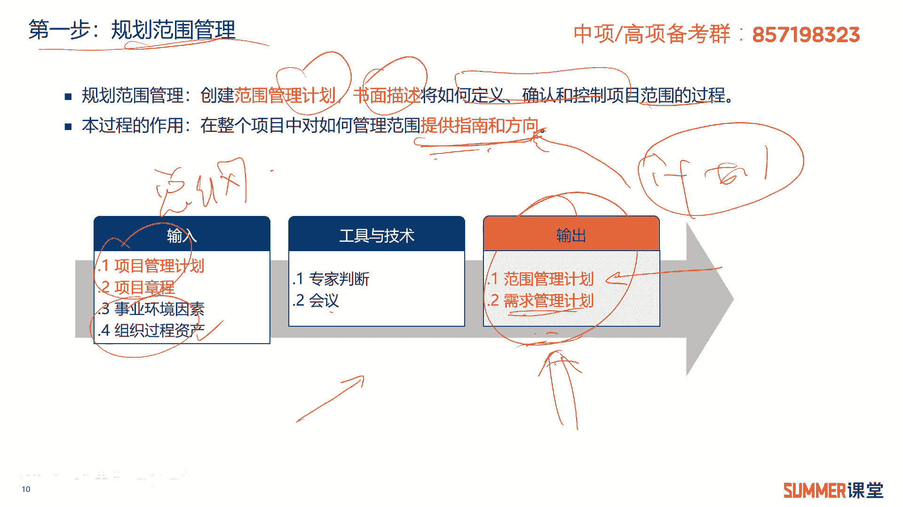
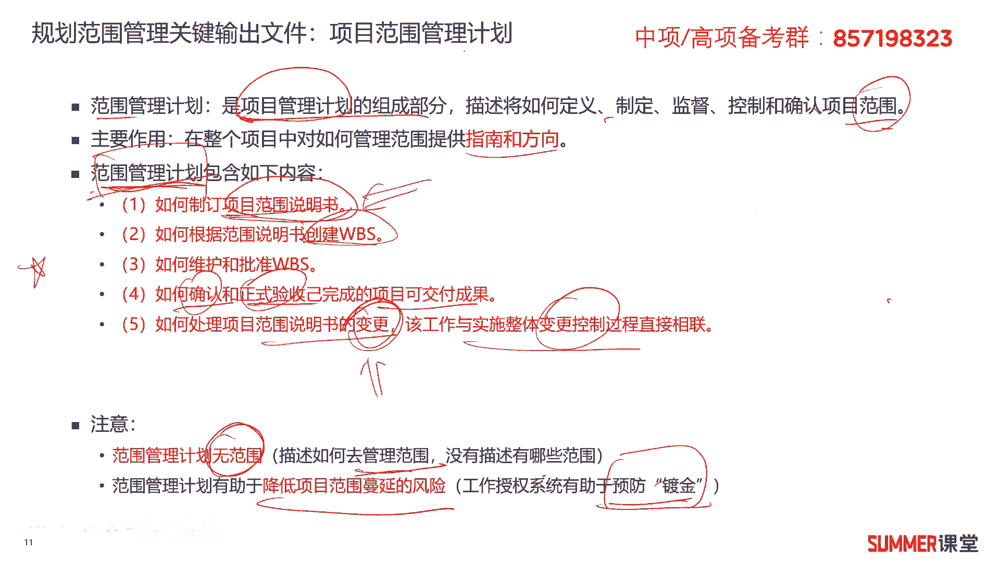
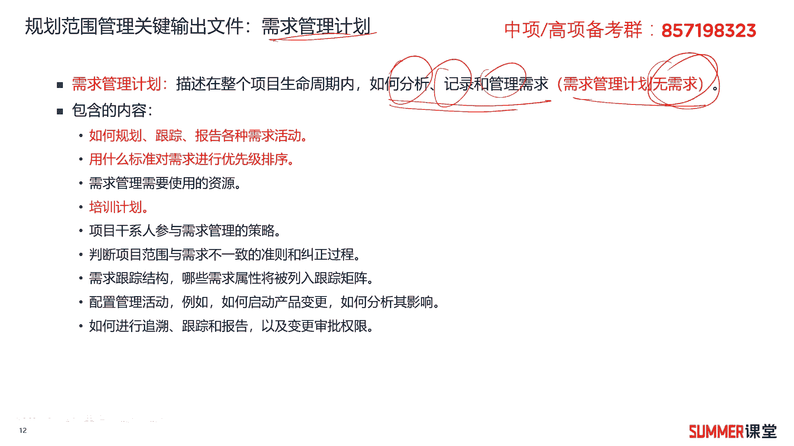
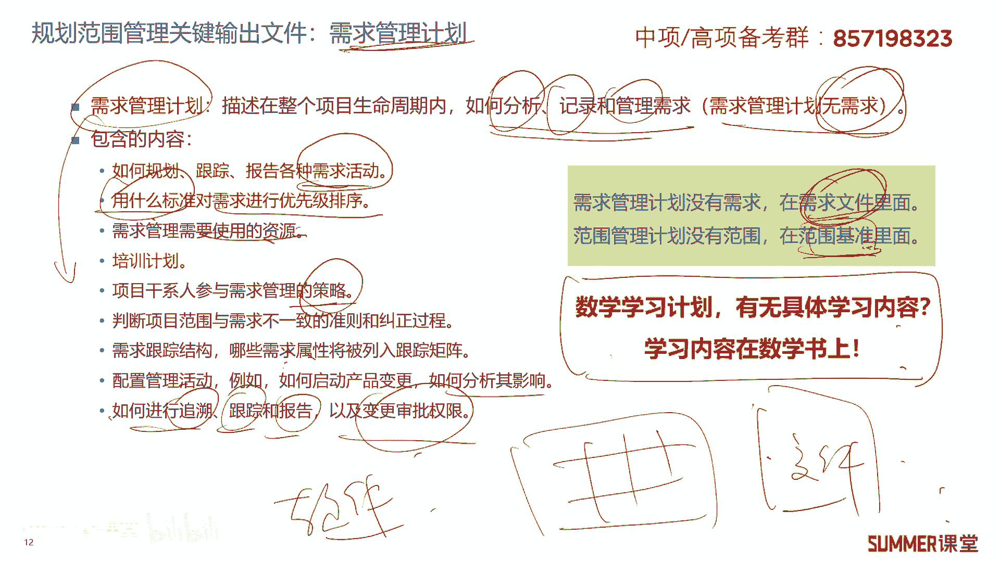
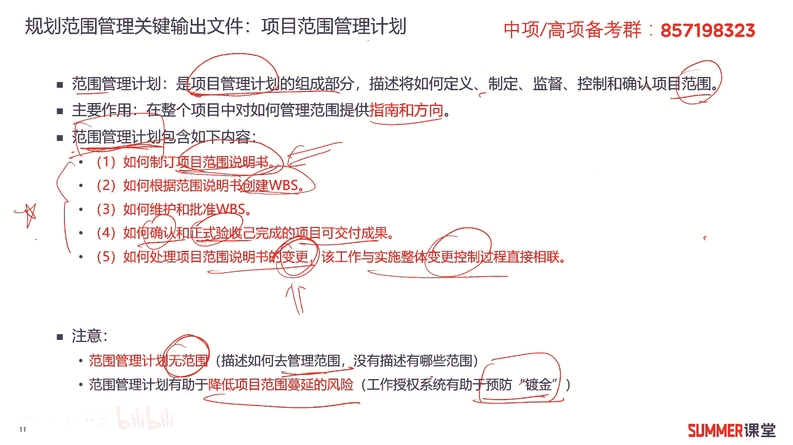
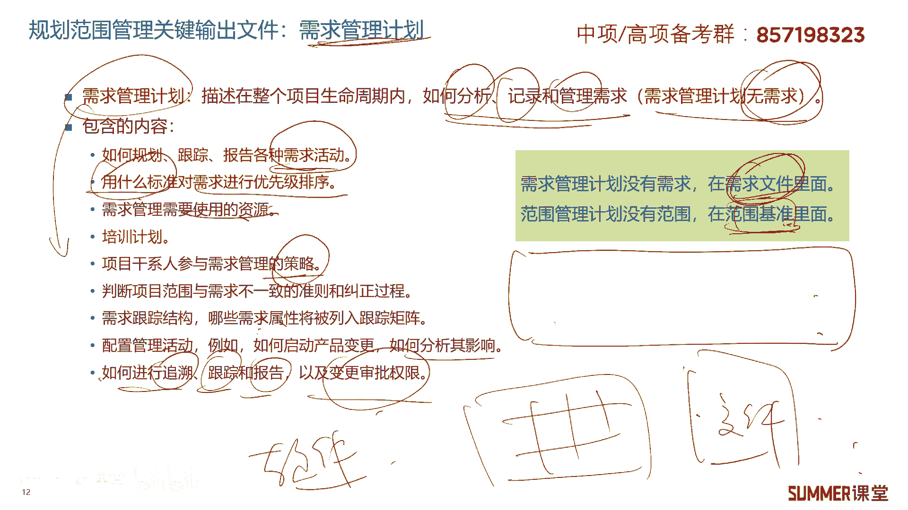

# 2023年软考信息系统项目管理师视频教程【总结到位，清晰易懂】-软考高项培训视频 - P41：5-2 规划范围管理 - summer课堂 - BV1wM4y1Z7ny

好我们下面来看项目范围管理当中的第一步，规划范围管理啊，其实我们后面学很多过程，第一步基本上都是规划，什么叫规划就做计划呗，你的范围范围怎么管，要不要有一个计划，是不是要打一个草稿。

就是一个打草稿的一个作用。

明白啊，看官方的解释哈，我们来看一下规划，范围管理是指创建换范围管理计划，书面描述将如何定义确认和控制范围的过程，说白了你就是要做个计划，然后书面的写出来，你怎么管这个范围是吧啊，看这种官方解释哈。

就背起来，你如果死记硬背的话，就有点恼火，特别累，但是你说出来就很简单啊，做个计划嘛啊然后书面写出来啊，怎么管理范围对吧啊，它的作用是整个项目当中，对如何管理范围提供指南和方向啊。

基本上所有的计划都是提供指南和方向的对吧，你你待会儿去看一下后面的那些啊，那些管理哈啊，什么成本管理，电路管理都是一样的啊，差不多啊差不多啊，第一步规划范围管理它的i t t啊，其实也比较简单。

也比较简单，我们先看一下输出，输出就两个文件范围管理计划和需求管理计划，以规划范围管理，基本上第一个文件是跑不掉的对吧，当然需要注意一下，他有两个文件哦，还有一个叫需求管理计划，管理需求的。

怎么管理需求是吧啊，ok他的输入呢项目管理计划嘛，这肯定是一个总纲嘛，是不是一个总纲，项目章程是也是一个总道啊，这两个总纲还是有区别的哈啊，就这个总纲是由谁签发的，项目章程是发起人签发的对吧。

授权项目经理的，而项目管理计划，是由项目经理带领我们团队编制的，怎么管理我们这个项目的一个总纲诶，这两个东西是要有的，然后还有事业环境因素，组织过程资产这这玩意儿就就不用多说了哈。

很多过程的输入工具与技术啊，工具已记住，专家判断会议前面都讲过的对吧，所以重点这重点是什么啊，这个过程的重点i t t那肯定是输出啊，这两个文件相当重要，好，我们来看一下规划范围管理的第一个输出文件。

叫项目管理计划，项目管理计划是项目管理机，是指向这个范围管理计划，范围管理计划，范围管理计划是项目管理计划的组成部分啊，又回到这儿来了，项目管理计划的内容，希望大家一定要把它给记住啊，一定要把它给记住。

他说范围观的一句话是是，将如何定义制定监督控制和确认描述哈，描述如何定义制定监督控制和确认项目范围啊，这这这这玩意又特别文绉绉的是吧，你不用管它啊，这时候你不用管它，理解就好了是吧。

刚刚不是呃给大家去提过吗，那这个过程大概就是干干这个用的啊，就是做计划对吧啊定义，然后呃自制定我们怎么去管范围吗，ok那主要作用提供直来和方向啊，刚刚已经说了哈啊需要注意的是，我和我下面标红的啊。

下面标红的就是项目范围管理计划，它包含的内容包含的内容啊，一共五个点，这五个点把它作为一个重点啊，你能全部记下来最好啊，至少至少你是会做选择题啊，这种有可能是会考的大题的啊，需要注意一下。

与范围管理计划还是相当重要的，包含如下五个内容给大家说一下，第一个如何制定项目范围说明书啊，什么是项目范围说明书，顾名思义，就知道我们这个项目具体哪些该干，哪些不该干对吧，后面还会有更详细的讲解。

你先把它给我记住，第二步包含如何根据范围说明书创建w bs，什么叫w b s，它叫工作分解结构，我们一般会把一个项目分成很多块儿啊，很多块方便我们后面去去去，让不同的人去负责嘛，是吧啊。

比如说啊一个啊一一栋楼嘛啊就一栋楼啊，我要建一栋楼，是不是要要打地基，要要用钢筋搞钢筋混凝土，还要什么，还要砌外墙的瓷砖，完了相当于把一栋楼分成很多块，这叫工作分解结构，也叫w b s啊，w b s。

然后第三个是如何维护和批准w bs，第四如何确认和正式验收，已完成的项目可交付成果啊，什么意思呢啊怎么确认啊，正式验收啊，比如客户确认啊，找客户签字就行了吗，还是必须找第三方的评测机构。

来出一个检测报告对吧，正式验收是客户跟我们的乙方啊一起验收，还是客户要组织一个专家团队，邀请外部的专家来一起验收，我们的最终的可降服成果，具体怎么验收的对吧，在哪哪个里面的，在范围管理计划啊。

注意注意哦，范围管理计划里面是有关于怎么验收的内容哦，这个好像跟我们平时的感觉有点不一样啊，范围管理计划不就是说哪些该做，哪些不该做吗，应该就是低一点吗是吧，如何制定啊。

如何制定我们的我们的这个范围说明书嘛，项目范围说明书啊，但是它有有这个东西啊，需要需要注意哈，第五如何处理项目范围，如何处理项目范围说明书的变更啊，有变更了怎么去处理，这个工作肯定是跟实施整体变控制啊。

去关联起来的啊，这是范围管理计划啊，它的内容啊需要注意一下啊，另外范围管理计划里边其实是没有范围的啊，里面没有范围，他只是去描述我们怎么去管理范围，没有描述有哪些具体的范围。

作为重点范围管理计划里面没有范围，包括我们后面讲的讲到的需求，管理计划里面也没有需求，这是需要大家注意的，他只是告诉你怎么去管理范围范围管理计划，有助于降低项目范围蔓延的风险啊，怎么降低呢。

因为它里面有工作授权系统吗，有有助于防止啊，有助有助于预防镀金是吧啊，因为你要要变更啊，要改动的话，是不是要走变更控制流程，那边有走变更控制流程就有人审批，你就不可能随意的去镀金嘛，随意的画质添足是吧。

ok这是规划范围管理的第一个关键的输出文件。

叫范围管理计划，那第二个叫需求管理计划，需求管理计划是描述在整个项目生命周期内，如何分析记录和管理需求，怎么管理需求的对吧，但是需求管理计划里面没有具体的需求啊，啊没有12345k啊，这个怎么理解啊。

范围管理计划里面没有范围，需求管理计划里面没有需求。

我给大家举个例子啊，我给大家举个例子啊，就是比如说放暑假啊，你还是个学生啊，啊你还是个学生，老师让你制定一个数学学习计划，问你数学学习计划里面有没有具体学习内容，没有啊。

数学学习计划可能我就这么制定的啊，第一到十天我要看书对吧，然后第暑假60天吧，第20天到40天我要做题，41天啊，反正大概就这样哈，呃这11哈11~40，第41天到第60天，我是怎么我我要做一些考试啊。

参加考试啊，这是我的数学学习计划里面有没有学习的内容，有没有没有没有，你学习的内容在哪啊，你学习内容在你的数学书上，是不是有这种感觉哈啊有没有这种感觉啊，我们的这两个计划。

就跟刚刚举的这个例子就比较啊比较类似啊，比较类似我们的范呃，具体的需求是在需求文件里面的，到具体的范围是在范围基准里面啊，范围基准后面我们会讲啊，他也是相信过程的一个输出，把它给记住哈啊把它给记住。

然后需求管理计划里面包含哪些内容呢，啊它包含如何规划跟踪报告各种需求活动啊，比如说哎我每周周例会报告一次，需求的变化是吧，然后用什么标准对需求进行优先级的排序啊，提到很多需求，哪些优先级高。

哪些优先级低啊，标准比如说哎领导提的，他有优先级最高啊，这在很多地方应该是默认的啊，比如说我看这个需求，对我的这个项目进度或者成本的影响，哪个花钱多一点，或者哪个影响进度一点，它优先级就高啊。

这都是我们在需求管理计划里面啊去定义的啊，它还包括需要使用的资源啊，比如我们要记录需求，是不是有一个专业的专门的人呢，需要一个人，还需要几个笔记本，这是不是使用的资源啊，举个例子比较简单。

那接着是培训计划，也就说需求跟培训有什么关系啊，好我们的需求管理计划的这些内容，是不是要把它同步给我们的全员啊，好让他大家都知道收集了需求之后，你反馈到谁应该走什么样的流程吗。

接着是项目干系人参与需求管理的策略，哪些人能参与，哪些人不能参与，还有就是怎么参与啊，我们在qq群，微信群里面反馈吗，还是那还是我们要啊开开开会来讨论对吧啊，所以有具体的策略啊。

接着判断项目范围与需求不一致的准则，还有纠正的过程啊，需求跟踪的结构，哪些需求需要被列入跟踪矩阵啊，比如说领导反馈的就很重要，我们要列入跟踪矩阵啊，就是每每周或者隔一段时间。

我们要看它其实这个需求解决的怎么样了对吧，哪些要要列入这个有一定的标准，那你等这里是吧啊，这个配置管理活动，例如如何启动产品面包，如何分析其影响配置管理，后面有个专门的章节。

简单来说就是对我们的版本怎么进行管理，对我们的开发软件，对我们开发的一些文档怎么进行管理，配置管理啊，有一个单独的章节哈啊，后面会讲好，接着是如何追溯跟踪报告以及变更审批，对需求如何追溯啊，如何跟踪。

如何有报告啊，是通过通过这个excel表格吗，还是通过一个这样的什么文件，还是我直接有一个软件系统，直接在软件上面跟踪对吧，是在需求管理计划里边，它包含了这些内容，这些内容不要求大家全部把它背下来。

你稍微看一下啊，出道选择题你会选就行了，那相对而言上面的这个范围管理计划。

这五点会更重要一些。

需求管理计划啊，相对而言没有那么重要。

