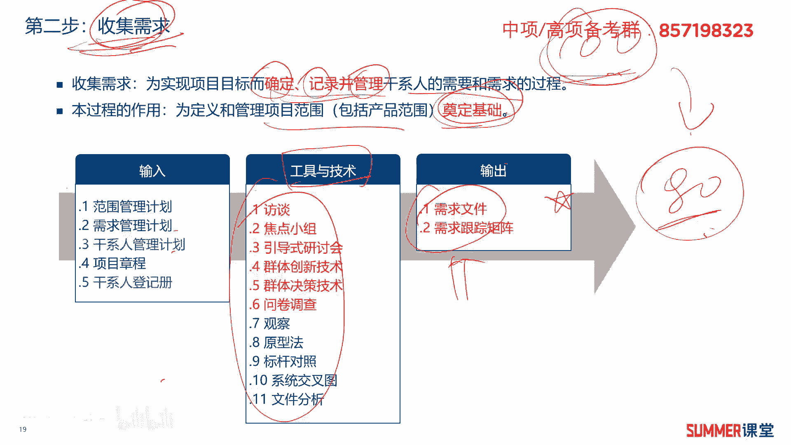
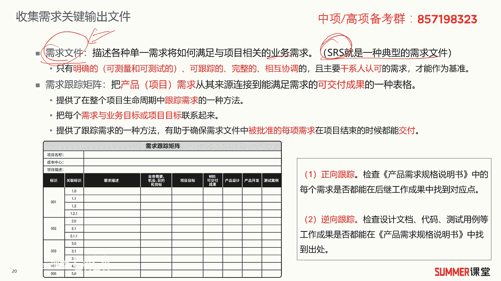
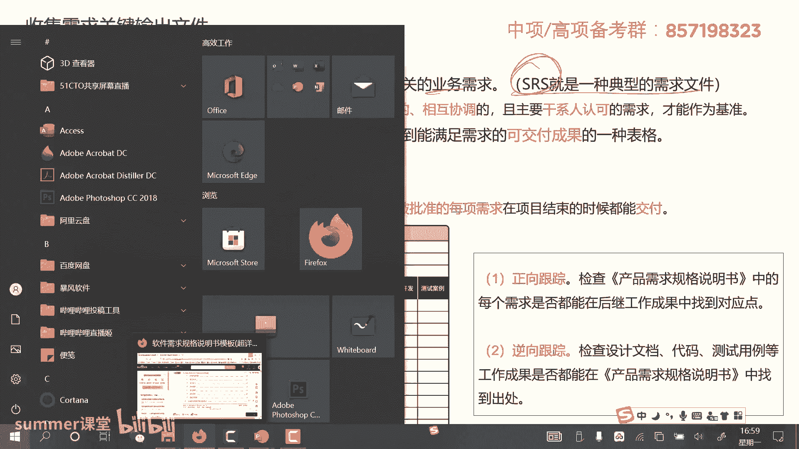
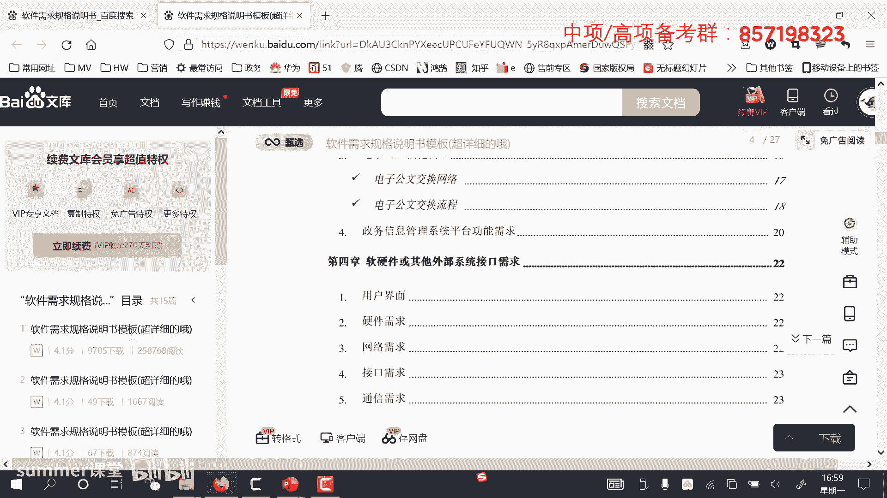
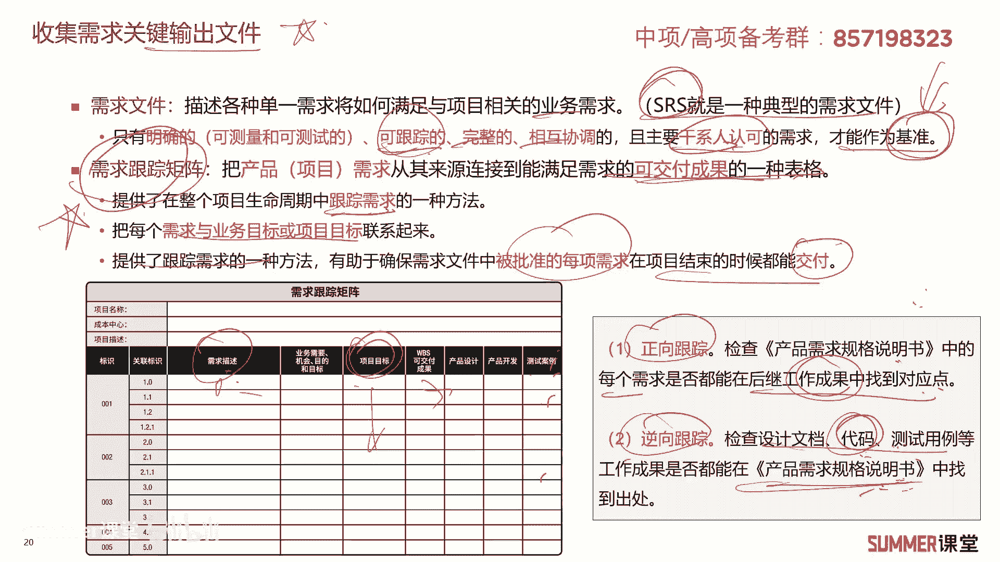
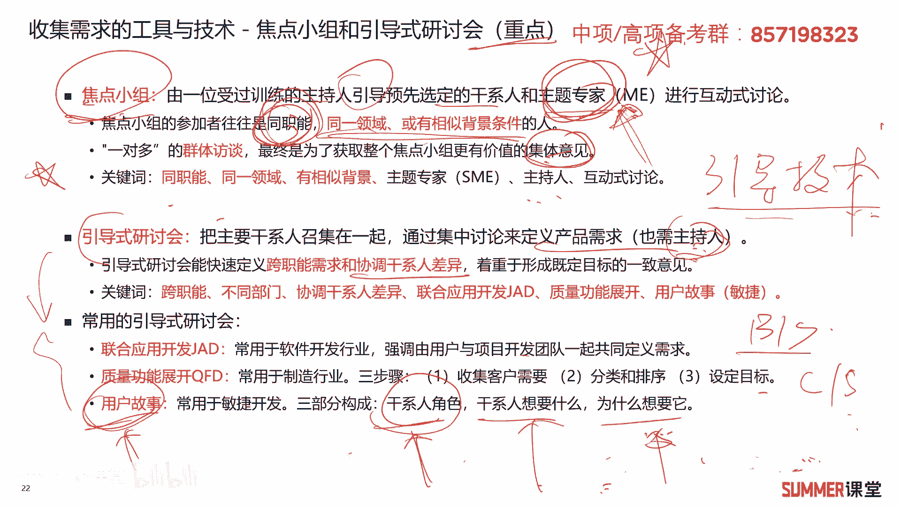
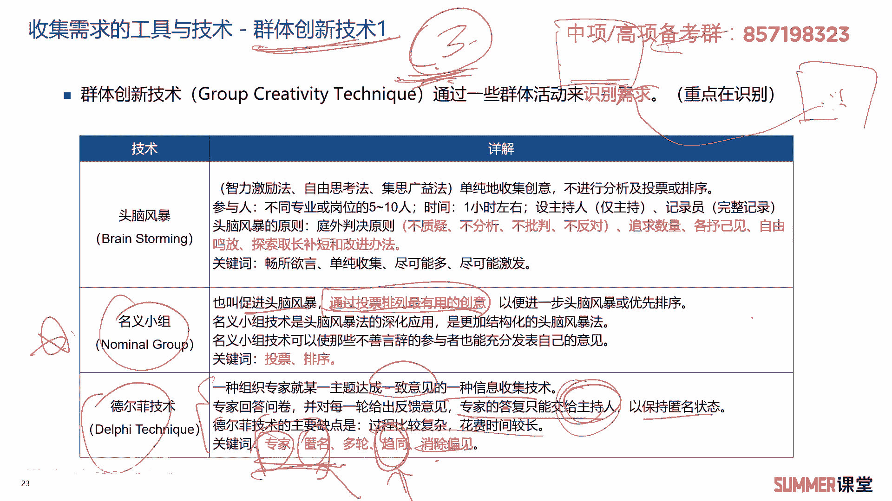
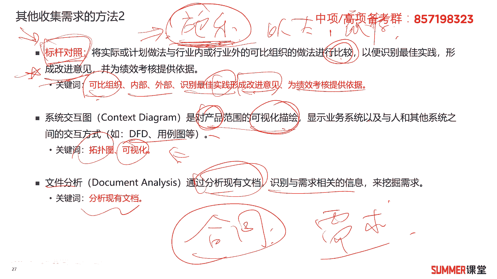

# 2023年软考信息系统项目管理师视频教程【总结到位，清晰易懂】-软考高项培训视频 - P42：5-3 收集需求 - summer课堂 - BV1wM4y1Z7ny

好，我们接着来看项目范围管理的第二步，是收集需求啊，首先不知道大家有没有疑问，就是需求跟范围到底有什么关系，我们前面讲过需求管理计划，这里面又来讲收集需求，这个章节不是讲范围管理吗，对吧。

为什么花这么多时间这么多篇幅来讲需求，它跟我们要讲的项目范围管理，到底有什么关系啊，其实大家可以明显的感觉到肯定是有关系的，但是让你说出个123啊，大部分人应该说不出来啊，我们用一句话来做总结。

就是需求是客户想要的范围，是我们要做的这两个能划等号吗，能不能肯定不能划等号，客户想要的他可能是100分，而我们能做的可能是90分，最后我们真正要做的可能是80分啊，因为不是说你能做，我们最后都要做。

因为我们这个项目会有各种各样的限制，比如说时间，比如说成本对吧，如果你按照客户想要的100分做，可能这个项目做下来，你亏的裤衩都不剩，而且你还做不到100分，那原因很简单嘛，客户是千奇百怪的是吧。

客户不能说千奇百怪，客户是各种各样的，然后他提的需求是千奇百怪的，有些需求是合理的，有些需求压根儿就不合理，比如说我们前面讲的客户，如果想搞一个光速的飞船，它速度等于光速的飞船，你觉得这个可行吗。

不可行啊，这种技术上就不能实现，但你说这是不是客户的需求，那他的确是客户的需求，所以这种需求肯定我们在后期的沟通当中，我们就要把它给pass掉啊，不然你这个项目没法完成是吧啊，所以这一步叫收集需求。

我们先把客户各种各样的需求，管你奇葩不奇葩，先把你收集到，收集到之后，我们后面再针对这个需求去定义范围啊，它的下一步就是定义范围，明白啊，定义范围的过程，是不是就相当于对需求进行裁剪啊。

对需求进行一些沟通和交流，最终把你的这个需求给你做一定的限制嘛是吧，还有人会说哎呀老师客户想要的是100分，我最后给他，我们能做的，或者我们要做的是80分，客户能满意吗，能不能啊。

这个就要看具体的项目了哈，绝大部分情况啊，经过我们反复的沟通和交流，客户是可以接受的啊，比如说刚刚我我提这个例子，我想搞一个光速飞船，这技术上就不行嘛对吧，你就你就你就扣给客户，直接说明白。

然后找购房去验证了他嗯，最后一般通情达理的还是可以说的明白的，是吧啊，所以啊，所以所以我们项目管理，肯定是一个平衡的一个过程啊，多方面去协调嘛，对吧啊，这个也就需要我们的项目经理。

跟客户不断的去去核对这个事情啊，达到双方都能够接受的一个程度好吧，这就是需求和范围，希望大家能够明白好，我们看一下需求的分类啊，其实第一章里面我们讲过啊几个需求啊，这里面又又讲收集需求。

我们把收集把需求再进行一个分类啊，书上分类它分的呃其实挺细哈，分了各种各样的分类，我们来看一下，第一个是业务需求，业务需求是整个组织高层的需要啊，比如说解决业务问题或抓住业务机会实现呃。

以及实施项目的这个原因啊，业务机会主要是高层次的需求对吧，比如说我的董事长啊，我的这个项目发起人啊，比较高比较高，然后接着是干系人的需求啊，他是干相关群体的，这个需要，常对应着我们第一章讲的。

就是相关用户的需求吗对吧，用户需求啊，接着解决方案需求，解决方案需求里面生成功能需求，然后非功能需求解决方案需求，对应着我们第一章讲的系统需求是吧啊，系统需求啊，系统需求我们当时是怎么给大家去讲的啊。

它分为功能需求，非功能需求，还有设计约束，那这三个跟第一章基本上是吻合的，只是他把他换了一个名字啊，我们给大家去看一下第一章讲的哈，第一章讲讲软件工程的时候提了需求，分为业务需求，用户需求和系统需求。

这几个需求是重点哦，考试经常是选择题的，业务需求是高层次的目标，需要对吧，一般来自于投资人，然后客户啊，包括单位的管理人员啊，各种营销部门等等啊，这叫业务需求，然后用户需求啊。

用户需求就具体使用我们这个软件的，轮胎的一个需求啊，接着是系统需求分为功能需求，非功能，还有设计，耶稣啊，第一章讲的这三个需求，是不是跟我们这一章里面提到的业务需求，干性能需求和解决方案需求。

它是吻合的，对吧啊，其实是一样的哈啊，特别是考试最爱考的就是业务需求啊，业务需求，高层次的需要啊，这几个词希望大家一定要把它给背过，一定要记住啊，接着我们这个章节里面还提了其他的需求啊。

比如说过度的需求，就从当前状态过渡到将来状态所需要的一个，临时能力啊，比如说我的数据库，可能我现在用sql server对吧，将来我要升级到oracle啊，你这个数据的格式要能够平滑的过渡和升级好。

接着是项目的需求，他是满足这个项目需要满足的，行动过程或者其他条件，项目当中的一些需求和条件啊，质量需求啊，质量需求就是我们做出来这个产品，要满足相应的标准和规范对吧，比如说一个国标啊。

你要满足这个国标吧，是吧啊，需求的分类，大家了解一下，我觉得重点还是前面三个啊，因为前面三个跟第一第一章里面是完全吻合的，对吧，只是这里面他换了一个名字，为什么会换这个名字，原因是因为写这两张是两个人。

他们没有做好很好的统一，如果让夏老师一个人去写，写出来肯定是第一章和这一章，这块肯定完全一样嘛是吧，那肯定是完全一样的好吧，了解一下哈，好我们下面来看一道题，2018年11月的真题。

他说软件需求是多层次的，包括业务需求，用户需求和系统需求，其中业务需求啊是指什么，a反映企业或客户对系统高层次的目标需求，对不对，关键词高层次业务肯定没问题，这句话已经考过无数次了哈，经常考啊。

所以你一定要把这句话给我念个三五十遍，把给我记住，把它给我记住，好吧啊，b描述用户具体目标，或者用户要求系统必须完成的任务，描述用户的那肯定是用户需求啊，是不是啊，用户需求。

c从系统角度来说明软件的需求，包括功能需求，非功能需求和设计约束，这是什么系统需求是吧，系统需求就包含这三个啊，也不也不是业务需求，d描述了用户任务系统应该具备的功能和性能，功能是功能需求啊。

性能是不是非功能需求啊，所以他也是指的系统需求，所以这道题很明显选择a答案，非常经典的一道题啊，这种题考过很多次了，特别是a答案a答案，这个选项在历年出过无数次的，一定要给我记住，好吧好。

我们进入正题哈，刚开始先给大家去说了一下需求，让大家知道我们在讲范围的时候，为什么要讲需求，下面进入正题，项目范围管理的第二步，我们要收集需求啊，收集需求，收集需求什么意思呢。

只是为了实现项目标而确定记录并管理干系人，需要和需求的过程，说白了你就是要确定需求嘛，管理需求，把需求记录下来是吧啊，这个过程的作用，为定义和管理项目的范围奠定基础，为管理范围奠定基础，刚刚说了嘛。

用户的需求可能是100分，最后我们要做的啊是80分，要做的是80分，你要你要你要做这80分，你是不是要先知道客户这100分，他具体想要什么，然后我们再相当于再减20分嘛，做一定的裁剪是吧。

把我们做实在做不到的，或者是把这种超出了我们的这个成本，或者是进度的，这种对成本和进度有特别大影响的，这种给他做一定的裁剪是吧，就是这个过程它的作用啊，为后续的项目范围管理奠定基础啊。

当然最重要的还是i d t o咯是吧，输入输出与工具技术啊，其中啊其中输出就两个文件啊，这两个文件很重要，非常重要，需求文件还有一个叫需求跟踪矩阵，首先我们的需求，用户的需求是不是在需求文件里面。

这个要记得哈，用户的需求不在需求管理计划里面，而在需求文件里面，而需求文件又是收集需求，这个过程它的输出只要记住哦，啊这个要记住，因为还有一个重要的输出叫需求跟踪矩阵。

这两个文件我们后面还会单独专门的去讲啊，专门的去讲啊，另外啊输入啊输入有哪些啊，肯定有啊，范围管理计划对吧，需求管理计划，这两个是不是上一个过程的输出啊，啊是规划范围管理它的输出。

上一个过程的输出是下一个过程的输入，这个在在我们整个项目管理里面都是通用的哈，啊接着还有干系人管理计划，还有干系人登记册，这个是后面的干系人管理啊，它的里面的一些输出啊，因为你涉及到需求。

需求是不是要有人呐啊人啊，说白了干系人管理就是管人啊，管人在我们这个项目管理的书里面，把它叫做干系人啊，干系的啊，就跟我们项目相关的人嘛，对吧啊，还有项目的章程，还有项目章程，这是他的输输入。

那输入相对而言比较简单，了解一下啊，重点工具与技术，这也是我们后面要花大大力气，花大量的时间去讲的，你看工具技术很多吧，是啊后面慢慢来看哈，好我们还是按照我们老规矩先来讲输出啊，先来讲输出。

明白我们这个过程最重要的，最核心的是要得到这两个东西，这两个东西它具体又是什么什么玩意儿是吧啊。

ok来看收集需求这个过程过程的关键输出啊，两个文件哈，需求文件，需求文件它是描述各种单一需求啊，将如何满足与项目相关的业务需求啊，说白了就是把我们客户的需求，给你收集到需求文件里面吗，是吧啊。

典型的软件规格说明书就是一种需求文件嘛，对吧，比如我们软件要实现哪些功能，12345678，把每个功能写的很详细啊。

写的很详细，这里面给大家去看一下，看一下软件规格说明书啊。

它的模板你随便在网上去找一下，都会有看到没有，这就是一个典型的软件需求规格说明书，也就是一个需求文件啊，首先有一个总体的需求的一个概述对吧，然后系统功能的需求啊，有很多需求是吧啊，一个大点。

然后里面有很多功能，然后第二个啊，这个车辆管理模块里面又是一些需求，写的很清楚啊，写的很详细，然后包括一些接口啊等等啊。

这个大家自己去网上随便翻一下，肯定能找到的，说白了这就是一个word文件，里面记录了我们的这个项目的需求啊，而且记录的会比较详细，需要注意的是，他说只有明确的明确就是可测量可测试的。

然后可坑中的完整的相互协调的，还有干系人认可的这些需求才能作为基准基准，是不是被被干系人认可确认的这种需求啊，对吧啊，我们好的需求就应该具备这些特性，是比较明确的啊，可以跟踪啊，什么叫可以跟踪啊。

就是你需求提出来了之后，最后我能对应着相应的产品设计，产品开发的代码，这个测试的用例它能够一对应起来，我们能对这个需求进行持续的跟踪啊，怎么跟踪，后面来了，是不是需求跟踪矩阵啊。

这也是收集需求的一个非常重要的一个，输出文件啊，什么是需求跟踪矩阵啊，就是下面这个图诶，我收集到了，比如说a一点零一个需求开发某一个模块是吧，那后面有相应的这个呃，相相应的这个项目对应的项目的目标啊。

对应的我的设计开发的代码，然后测试的案例，这叫需求跟踪矩的，那最后这个需求做完之后，应该应该是设计做完了，然后开发也做完了，这前面所有的过程做完了，最后测试也做完了是吧，那这个需求相当于就实现了嘛对吧。

我们就通过这样的一个需求跟踪矩阵，去跟踪我们用户的每一个需求啊，比如说他这里面提了20个需求，那最后a这个这个表格填完了之后，全部填满之后，证明20个需求都已经被实现了啊，所以需求跟踪它也有两种方式。

第一个就是正向跟踪啊，正向跟踪就检查需求规格，说明书当中的每一个需求，是否在后续的工作成果，比如在你的代码里面都有对应的，在你的这个测试用例里面，都有对应的叫正向跟踪，还有一个叫逆向跟踪。

就检查我们的比如说文档啊，检查代码啊，检查代码里边，他这些成果是否都包含在了产品的这个需求，规格说明书当中啊，代码写出来有20个模块啊，最后发现啊发现你的这个我印象跟踪回去哈啊，一向跟踪回去。

发现只有19个在我的这个规格说明书当中，那证明证明有一个你就多了，多余了呀，你就镀金了是吧，人家只要求19个，你给我搞20个出来，是不是啊，所以这是需求跟踪矩阵哈，两种跟踪，正向跟踪和逆向跟踪啊。

了解一下啊，了解一下，我们来看一下需需求跟踪举证啊，他的这个官方解释哈，还是给大家读一下啊，因为考试有可能会考到这种原话，读一下的话，你还是印象深刻一些，然后他是把产品需求。

从其来源链接到可交付成果的一种表格，产品的需求来源是需求描述，就需求来源嘛，那最终你的设计开发，然后测试的案例，这些都是可交付成果是吧，把它连接起来这样的一个表格，这样的一个文档。

它提供了在整个项目生命周期当中，跟踪需求的一种方法，它是跟踪需求用的啊，可以把每个需求与业务目标或者项目目标，联系起来对吧，这这里面是不是有项目标业务秒把它联系起来，提供了跟踪需求的一种方法啊。

这已经说了哈啊，有助于确保需求中的呃，需求需求文件中被批准的每项需求，在项目结束的时候都可以交付，这是需求跟踪矩阵，很重要非常重要，一定要理解啊，一定要理解。

ok好，我们接着来看另外一个重点，就是收集需求的工具与技术啊，里面有好多哈，第一个是访谈，那访谈就比较简单了嘛，我们要了解这个项目的需求啊，找客户找相关的人聊一聊对吧哈，聊一聊啊。

当然访谈他这里面提了哈，就分成结构化的，非结构化的，结构化就是就是事先准备好一系列的问题，有针对的进行，比如我就提15个问题，20个问题都提前准备好啊，非结构化就前有一个简单的这个设想。

然后找客户具体的去聊，现场自由发挥，明白访谈这个东西我觉得是最简单的啊，不用怎么说哈，啊，这里边啊，告诉大家一个麦肯锡访谈的一个方法论，那就怎么去做好一个访谈，这这玩意儿有什么用，写论文写论文啊。

就是如果出到范围管理的论文啊，里面有一部是收集需求啊，你怎么收集需求啊，那怎么扯怎么吹牛逼啊是吧，这里面就是很好的思路啊，那就是在开始前我们要做好准备，123456，你给我写清楚对吧，有可能你是需要。

如果你是一个小白的话，那你可能是需要在稿纸上把它稍微写一下，如果你是个老鸟，那么直接在脑子里想一下就行了，也不一定要完全写出来对吧，第二步就在记我们在访谈进行的过程中当中，要注意聆听和引导。

不要自己一个劲的在那瞎喷，特别是有些做销售的哈啊，不知道在座的各位有做销售的吗，啊可能比较少啊，反正我以前是销售部门啊，我以前销售部门干了很长时间，我以前从事有相当相当长的时间做售前哈啊。

就跟销售一起配合嘛对吧，有些销售真的是在那一个劲的瞎喷啊，客户可能都不敢不太感冒，他也在那喷，这是不太好的啊，这不太好的，一定要注意聆听，适当的引导对吧，另外还有一些细节啊，大家可以看一下。

就让放让被访者的上司安排，有些时候我们去见一个客户，这客户他可能对对你问他的一些问题，他就很敷衍，他也不想怎么真正的跟你去聊啊，如果你建30个客户啊，至少有那么三五个是这样子的对吧，所以这时候怎么办。

让他让他领导安排我们去见他啊，领导安排过来的人，他会稍微重视一点啊，另外就两个人去访谈啊，或者有些时候啊，2~3个3~5个都可以看这个项目的大小，看这个我们被访谈人的这个重要程度对吧。

一般建议不要一个人去，因为一个人去，有些时候你跟他的风格不对味儿啊，两个人聊起来有些时候就会很尴尬啊，两个人的话至少还有个备份呢是吧，或者有些时候聊不下去了，还有一个人出来打个圆场对吧啊。

需要注意就是要聆听啊，不要指导，不要指导，不要一个劲的瞎喷啊，要互动嘛，就是另外就是要多复述对方的话，跟对方去反复反复的确认啊，要以侧敲旁击的方式去打探，一些比较敏感的东西，不要问的太直接。

也不要问的太多，ok这是访谈你需要注意的啊，需要注意的一些点，最后结束之后，按照麦肯锡这个方法，麦肯锡是美国的一家比较牛逼的啊咨询公司哈，比较牛逼的咨询公司结束之后要写感谢信啊，另外就是你最好是要邮件。

有收集了一些需求，要邮件跟对方确认一下，就是你的理解有没有问题，有没有误差是吧，这是通过访谈啊去收集需求啊，其他工具啊，这也是重点哦，啊也是重点，焦点小组引导式研讨会，这两个东西是经常考的啊。

经常考的啊，什么是焦点小组呢，他说是由一位受过训练的主持人，引导预先选定的干系人和主题专家来喽，主题专家进行互动式讨论，就是就是有一个主持人啊，他做引导，然后把我们项目相关的一些甲方乙方。

然后加上加上专家专家，就是对对我们要讨论的内容，这块比较熟的一些是吧，可以是外部邀请的这种专家库里面的专家，也可以是我们内部的一些人啊，这个前面讲过吗，专家不一定不一定是某些特定的。

只要只要你对我们这个业务足够了解，你就都可以当专家是吧啊，邀请邀请他们来进行什么啊，进行讨论，焦点小组的参加者往往是同职能的，而且相同部门的同一领域的具有相似背景的人，这才叫主题专家哈啊，同职能啊。

相似领域啊，相似领域，这是它的关键词，一般是一对多的群体访谈，有一个引导者吧，教练教练小组是不是也有引导技术啊，就是有一个人做引导，不要跑偏了，是不是啊，我当时怎么给大家举个例子啊。

不要从吃饭讨论到外星人去了，我们讨论吃饭就讨论吃饭，讨论到外星人讨论，讨论到这个什么银河系，各种各样的，越讨论越远，最后就走偏了啊，所以要引导啊，要有人引导啊，最终是为了获取有价值的一些集体意见啊。

关键词同职能，同职能部门，同一领域的人有相似背景的人啊，主题专家，然后有有主持人啊，去引导大家讨论，这叫焦点小组，焦点小组还有一个叫引导式研讨会啊，引导式样谈会啊，主要是把干系人召集到一起。

通过集中讨论来定义产品需求，他也是需要主持人的是吧，那主持人就是来引导大家嘛，哎来引导大家，引导师研讨会能够快速定义跨职能需求和协调，干系人之间的差异，着重于形成统一的目标，一致的意见啊，注意啊。

这里面需要注意哈，引导师研讨会他是跨职能，这里面是同职能，区别来了啊，考试考这两个的区别，你选教练小组还是选引导师，研讨会就看他是同职论还是跨部门是吧，就看这两个哟啊需要注意哈，这是高频考点啊。

常见的引导时间到位，比如说联合应用开发，有些时候我们搞软件开发的时候，就会成立一个那叫战术小组，或者叫什么战术讨论物，然后把各种各样的人把他搂在一起，然后我们来讨论来定义用户的需求，有哪些人呢。

可能有用户有设计，有开我们项目团队，项目团队可能就有设计，开发测试全部弄在一起，我们就来讨论啊，定义用户的需求吧是吧，当然还有质量功能展开这个东西了解一下哈，用在制造业的主要是收集客户的需求。

把客户的需求进行分类和排序，最后设定相应的质量目标啊，最后一个是用户故事啊，用户故事也可以收集用户的需求，主要是用了用于敏捷开发啊，什么是用户故事，这个东西我非常熟啊。

因为以前我做行业解决方案经理的时候啊，经常干这个事情啊，啊就是我们站在用户的角度来分析他，目前它的场景下，它面临什么问题，我举个最简单的例子，比如说现在很多地方客户都在提国产化。

是都在提这个信创这个事情啊，然后如果你是客户，你面临什么问题了啊，第一个要合规啊，什么叫合规啊，特别是一些政府单位，国家就让你们买xc的电脑，新装的电脑是吧，必须买国产化的，非国产化了，我不给你钱。

你买不了是吧啊，这是第一个要满足合规，第二个要满足业务能用啊，你买个国产化电脑来，只能跑他这个我国产化的系统，而我现在的业务系统全是基于windows开发的，你能一天两天333天五天把它迁过去吗。

所以你买了国产化的电脑，绝大部分特别是早期哈，绝大部分单位用不了啊，用不了，因为它有很多业务系统，有些可能是基于b s，基于网页的还好一点，有些是客户端啊，c s架构的这种业务啊。

你买国产化电脑跑不起来，所以客户就面临一个两难的选择啊，第一要满足合规，第二个要能用合规的就不能用啊，你要买能用的买，买这个现在的什么戴尔惠普啊，这些你就不合规是吧，面临一个两难的选择啊。

所以这时候啊这时候怎么解决啊，所以当时我们推了一个方案，就是就是叫双系统吗是吧，双系统，首先我们机器硬件是是国产化的，也也取得了相应的什么国家的认证，入了这个就不方便说了哈，反正是合规吗，合规啊。

大家了解哈，多的这个东西就有点敏感，可能不太好说啊，第一个合规啊，第二个啊，我们这个双系统，而且能够一键切换啊，如果来检查的时候好好，你搞个什么u o s系统对吧，应对上面的检查呃，实际能使用的时候。

你里面就跑windows吗，那相当于就是国产化的电脑里面装了windows，那这样呢就是不是就能够平滑的过渡啊，既满足合规又能用，但有人说哎老师，你说这玩意儿是不是不太合规啊。

严格意义上来讲是要跑国产化系统的，是不是啊，的确是这样子的，但是但是这两个压根儿，就没有办法很好的去调和，那这个世界上其实不是只有黑的和白的，有些是灰的这种，你说他合规，他就合规，你说它不合规。

他也不合规，明白，但是实际上很多人就是这么搞的啊，为了能用呢啊为了能用是吧，我相信很多在听我课程的这个学员，也有不少是政府型单位的，好多人都面临这样的问题，好吧好吧。

这些用户故事在用户的角度他有什么问题对吧，他主要就关注这两个，那最后诶我们怎么来解决这个问题啊，那这就叫用户故事啊，但有些时候也会说场景故事，场景故事它经常被用于敏捷开发开发。

它有三个部分构成我们盖新的角色，这个人是谁，他想要什么，他为什么想要这个东西，是吧啊，不要这个东西会没有这个东西，它的问题，它的困难在哪，就是通过这样的一个故事，站在用户的角度把这个事情说明白。

ok啊引导师研讨会啊，被经常应用在这些地方啊，大家了解一下，重点是区分这两个东西它的差异。

它的差异好吧，接着收集需求的工具与技术啊，里面有一个分类叫纯群体创新技术，就大家一拨人一起来做创新对吧，通过一般人通过一些群体活动来识别需求，来识别需求啊，常见的有头脑风暴啊，什么是头脑风暴啊。

啊举个例子，今天晚上吃什么啊，大家都都各自发表各自的意见吗，是不是啊，吃火锅吃烧烤，然后吃中餐，吃西餐啊，这个随便啊，随便说啊，随便说原则是不至于不分析，不批判啊，你说的所有人都对啊，畅所欲言。

这叫头脑风暴，头脑风暴应该是比较简单的考试，经常考的应该是下面两个，下面两个要难一点啊，要你来一点啊，名义小组叫促进促进头脑，促进式的头脑通报啊，通过投票他要排列最有用的一些创意和想法啊。

就是大家尽管说啊，但是我们最后来投票来考一波续啊，这叫民意小组名义小组，然后德尔菲技术呢它是一种专家啊，一种叫什么专家判断的一种技术，专家判断的基础，但是这个专家判断它有个特点，它是匿名的啊。

匿名进行收集的一个基础啊，什么意思啊啊什么意思啊，我给大家举个例子，那我给大家举个例子啊，有可能啊我们要要找一个呃，还是先给大家先先把这个概念读一下，再给大家举个例子，德尔菲技术很重要哈。

名义小组和德尔菲这两个是经常考的啊，经常考虑，因为他两个要难一点啊，先看德尔菲的概念哈，这是一种组织专家就某一主题达成一致意见，的一种新信息收集技术，专家问卷回答回答，并对每一轮给出反馈，专家回答。

专家回答只能交给主持人，保持匿名的状态，它的主要缺点是过程比较复杂，时间比较长，关键词它的关键词，这些的时候你就要选德尔菲了哈啊，这个只是初选择题，就专家，而且匿名，最后是趋同消除意见专家和匿名。

真这两个是最最大的关键字啊，一看到专家匿名，基本上要选德尔费啊，怎么实现的啊，怎么实现的，我给大家举个例子，比如说我们一个项目啊，要请五个专家来对我们这个项目啊，进行一个需求的一个识别吧，对吧啊。

第一轮相当于给每个专家给他发一个纸条，让你们去舔啊，这个项目需求啊有哪些，你们你们给我写一下啊，第一个专家啊写了三个啊，第二个专家写了五个，第三个专家写了20个啊，后面我就不说哈，继续三个专家吧。

简单一点，三个专家就写了这么多个，这差异是不是很大呀，对吧好，这次我们主持人就说哎，你们这个线的差异还是很大，你们这三个人这三个人啊讨论一下，讨论一下，最后的目的是消除偏见嘛，让大家给出趋同的意见。

就你们意见差不多啊，你三个你四个你五你五个或者三个都是三个啊，不要差的，一个搞20个，一个搞三个，这差异太大了，对吧啊，所以怎么办，你们讨论啊，讨论讨论完之后，我再发一个纸条，那就第二轮了哈。

再发一个指标啊，三个专家你们再写一下，第一个专家可能写个三个，三个需需求，第二个专家写个四个，第三个专家写了个六个，是不是比第一轮这差异就变小了呀，大家就至少在数量上是接近了对吧。

有可能里面内容还有些差异，那这时候再讨论呗，再讨论一下好再来讨论，相当于进入第三轮了，套三三轮讨论完再发一个纸条，你们一名写啊，你也没写啊，比如说第一个专家就写了三个需求，第二个专家啊写了三个。

第三个专家写了四个诶，差不多了啊，差不多了，那这个到底是全部要写成三个才中止，还是这个呀，这样都可以终终止，就有主持人去确定，其实绝大部分情况下这已经趋同了是吧啊，写了三个，这三个可能都差不多。

因为他们都讨论过嘛对吧，这就是德尔菲技术专关键词专家匿名，最后趋同，大家差不多提这个意见差不多啊，有一个问题哈，我不知道大家有没有呃，有没有疑问，就是这个德尔菲技术为什么要搞专家匿名啊，啊为什么要匿名。

为什么不带家这个实名实名过，自选各自的需求啊，问题是什么，因为有些专家可能他是资深的，他提的问题会会有参考性，其他的，比如你就是个小白，你提的问题是一看这资深的这么搞，你就参考人家的对吧。

那这样的话就不是特别公正，会有一定的影响，所以要搞专家匿名啊，专家匿名就是德尔菲这个过程，希望大家能够理解哦，主要是理解那这玩意儿不会让你去写出来，背出来的那选择题你能他给你描述一通。

你能够把它给选出来就行了是吧好吧，群体创新技术啊，前三个那边头脑风暴是最简单的，名义小组和德尔菲，这两个东西要稍微理解一下啊。

经常爱考的啊，经常爱考的好，接着啊，群体创新技术呢呃当中还有几个啊，思维导图，思维导图这个应该还比较熟嘛，是吧，那我们就用这种塑形导图的方式，把很多需求给它给它写出来嘛，它梳理出来啊，这个不用说了哈。

啊记得清河图，清河图这个东西最近一两次考试是考过的啊，在质量管理里面，它还有还有这个工具，所以需要注意，他是首先进行头脑风暴，然后从头脑风暴中获取了这些创意，我们根据相似性对你进行分组。

以便进一步的审查和分析，这就是清河图，你看餐厅管理啊，可能涉及到很多因素，特别特别多，大家头脑风暴出来了这么多，最后我们按照一定的规则，按照一定的相似性对你进行分组，比如怎么管好餐厅。

可能跟人员素质有关，跟我们食品有关是吧，跟我们的处理问题，服务态度这些都有关对吧，相当于对我们头脑风暴收集的东西进行分组，最后就长长这样啊，长这样，这是清河图啊，清河图一定要注意一下哈啊什么是清河图。

它的概念，还有它长长什么样啊，要知道，那接着多标准决策分析，这名字听起来有点绕，但是跟你讲你肯定懂啊，比如说我们项目招投标，最后是不是多标准分析，最后选一个最佳的供应商嘛，就最最佳的一家公司去中标。

好从哪些标准呢，常见的比如说这是一个评分规则啊，常见的我们价格占35分，技术占37分，商务占28分，价格很好理解，技术也很好理解，商务是什么啊，比如说你这个公司的规模呀，这个公司的类似项目的业绩啊等等。

这些都算商务啊，通过这三三项三个标准啊，去综合判断哪一家最后中标吗，这是不是多标准决策分析，肯定是啊对吧，那肯定是啊，比如说还有一个比较常见的例子，多标准决策分析里面优先矩阵好，优先举证。

我也给大家举了个例子啊，举这个例子啊，比如说我要买个手机，我重点看三个标准啊，颜值功能价格，那就看这三个标准啊，最后这三个标准价格占50分，颜值30，功能20啊，我的可选可选项有有苹果，有华为，有小米。

那最后综合对比下来就选得分最高的小米，那可能我就如果我关注价格的话，重点关注价格是不是我就买小米了呀对吧，这就是多标准决策分析里面的一个比较特殊的，叫优先矩阵，就是列成这样的矩阵方式嘛。

是不是应该比较比较好理解哈啊，借助决策矩阵啊，采用系统分析，建立多种多种标准，我建立了这三个标准吧，啊可用于识别关键事项和合适的备选方案，哪个备选方案方案好一点，那我这是不是给了三个备选方案。

并通过一系列决策啊，对众多备选方案进行评估和排序，我这排序出来，那如果我重点看价格的话，那么小米就第一华为，第二苹果，第三是吧，关键词多种标准啊，全有不同的权重，看这是他们的权重综合去评估，去排序啊。

多标准决策分析，通过我讲的例子，我相信绝大部分人应该都是能够理解的啊，比较简单啊，比较简单啊，当然现在理解了，你后面还是要回过头来看的啊，这些东西说实话啊，学得快啊，忘得也快，还是要复习还是要复习。

ok那接着来看群体决策技术，他是为了达到某种期望的结果啊，对未对多个未来行动方案进行评估啊，重点它是决策，决策有几种方案，决策有几种方案，大家投票呗啊如果所有人都同意，就表示一致性同意就最好啊。

但是很难不可能众口一词的是吧，大家都有自己的看法啊，大家都是都有自己的看法，一个人不可能让所有人都喜欢啊，因为你不是人民币啊，即使你是人民币，有些人还喜欢美元呢，所以一次性同意这个很难按啊。

有一种另外一种第二种哈，就大多数同意有50%的人啊，同意，那么那么我们就就就可以决策了呗是吧，大于50%的这个就是最佳的方案吗，当然这里面有个有个建议，就是决策组的人数一般都要为基数啊，为了防止平局。

为了防止频率，第三个是相对多数原则啊，比如大所有的方案当中，都没有超过50%的，那么最多的一个就就获胜呗是吧，那最后一个啊就获胜啊，比如说有三个方案，这个选选总统一样啊，有一个有一个人30%的得票率啊。

其他两个人28%，15%，那属于当选吗，那肯定是他当选了，那是不是这就是相对多数原则，那决策的时候就会用到的，常见的就是你一个人做出决策了是吧，比如说我们国家东北角的那个有一个国家是吧。

他就偏向于这种这种方式，这叫群体决策决技术里面有四种不同的情况，很好理解啊，很好理解好，接着来看其他收集需求的方法啊，还还有好几个哈，收集需求的工具与技术这块儿挺多啊，挺多也很重要啊，希望大家能够理解。

还有就是问卷调查很熟悉吧啊大家很熟悉，也不少人应该都填过问卷对吧啊，它的关键词关键词我觉得这些都不需要看了嘛，啊什么多样化，快速完成成本低啊，它的缺点需要注意一下，就缺乏灵活性。

无法了解细节以及一些隐藏信息，有可能你发给人家的问卷，人家就扔垃圾桶了是吧，真实性也比较差啊，随便填嘛，这这问卷调查他的问题，它比较适合用在这个受众比较多啊，受众比较多的情况，受众多。

你就不可能一个一个对他进行访谈嘛，可能填个问卷是吧，当然问卷你就有可能不太准确，另外还有一个方法叫观察法啊，了解我们这个需求，有些时候你去访谈或者问卷访谈，他说不清楚，或者他不愿意说啊，问卷又不太准。

我们怎么办啊，去你的实际环境里面看你怎么干的对吧，那直接看你怎么干，观察几天，在这一点我特别深有体会啊，啊特别深有体会，我记得我刚毕业没多久，我当时做一个医院的项目，做一个医院的项目，然后我的导师啊。

我的领导他就直接跟我说啊，你要了解这个医院，你要了解他的业务，最简单的方法，你就是到他医院去工作，工作个两三周，我当时我去了常驻医院就一周，就整天盯在信息科，看他们今天在干啥，明天干啥。

你慢慢的对医院的业务就理解了，这就是观察嘛对吧，就直接深入客户的实地环境啊，有些是客户难以表达，或者他就不愿意说的，或者这些这些话就是他的一些隐藏需求嘛对吧，你就可以通过自己的观察把它总结出来。

明白这是很重要的啊，如果一个人没有真正跑过现场，没有去干过项目，那怎么讲呢，你是很难成为一个优秀的项目经理的，很多东西是在现场去学出来的啊，从现场去自己总结去学啊，不是不是哪个老师很牛逼。

就能够给你讲的讲的完整的明白，还是要实力啊去实践啊，这个圆形法原型法，是不是也是收集需求的一个方法啊，我们讲过吧，第一章里面讲过软件开发里面的原型法啊，有些时候客户描述不清楚他的需求，哎我们先搞个原型。

你用着对吧啊用的，然后你在原型的基础上不断的给我提需求，不断给我提反馈嘛，让我们改进原型啊，原形法的步骤啊，然后反馈需求进行原型的一个修改，关键词，它能够减轻风险，能够渐进明细，而且有有敏捷性啊。

有这种故事吧，好吧啊，原型法啊，大家了解啊了解，接着还有一些需求收集的方法啊，标杆对照，标杆对照最近考过的哈，最近是考过的，所以需要注意哦，非常重要，好来看一下定义，将实际或技法计划的做法。

与行业内或者行业外可比组织的做法进行比较，以便识别最佳实践，形成改进意见，并为绩效考核提供依据啊，又是废话对吧，讲了很多，但是很多人一听完啊，一看完懵了，讲什么鬼啊，这里面我给大家举个例子。

标杆对照来自一家公司，他叫施乐，施乐，施乐是美国公司，他是干什么的，其实这家公司很牛逼哈，他发明了以太网，还发明了鼠标，鼠标就是这家公司发明出来的啊，只是大家啊不这么熟对吧，另外他还做什么做打印机。

早期他做打印机特别牛逼，但是二战以后，日本的打印机崛起，最终日本的打印机抢占了大量的它的市场，把它干成了一个二流的啊，最后他怎么办呢，他就采用标杆对照的方法，买了日本各大厂商的打印机，把它拆开。

所有的零件拆开，然后对比它的打印机，跟日本这些公司的打印机有什么区别，然后进行相对学习，进行逆向研究，有区别进行比较嘛是吧，然后形成改进意见啊，所以后来他的打印机还是挺不错的。

这就是施乐发明的一家一种方法，收集需求的一种方法叫标杆对照啊，对比吧是吧啊，对比关键词就是有可比，组织做内部和外部的一个对比识别，最佳识别最佳实践来形成改进的意见啊，为绩效考核要提供依据啊。

反正你理解就行了，那什么是对比，那什么是标杆对照啊，是不是标杆对照，好吧啊，这个系统交互图，它是对传产品的范围进行可视化的描绘，常见的比如说我们第一章讲的啊，什么用例图啊等等，这些就比如拓扑图可视化啊。

它是可视化的方法啊，可以从我们产品的一些啊，从产产品画的一些图来推出用户的需求嘛，啊这个文件分析可以通过文分析现在的文档，识别相关的一些需求，比如说你分析合同，合同里面有没有需求，肯定有需求啊是吧。

然后项目章程里边也有一些粗略的需求啊，当然分析的文档文档很多哈，你看具体的项目啊，具体去分析就行了好吧，这是收集需求，收集需求与两个非常重要的文件，需求，文件和需求跟踪你的其他的，就是他的工具和技术。

希望大家能够理解啊。