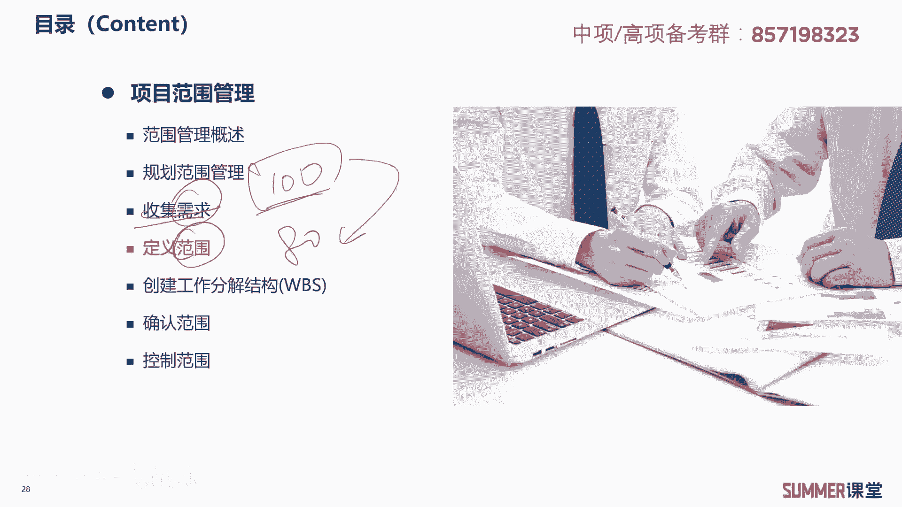
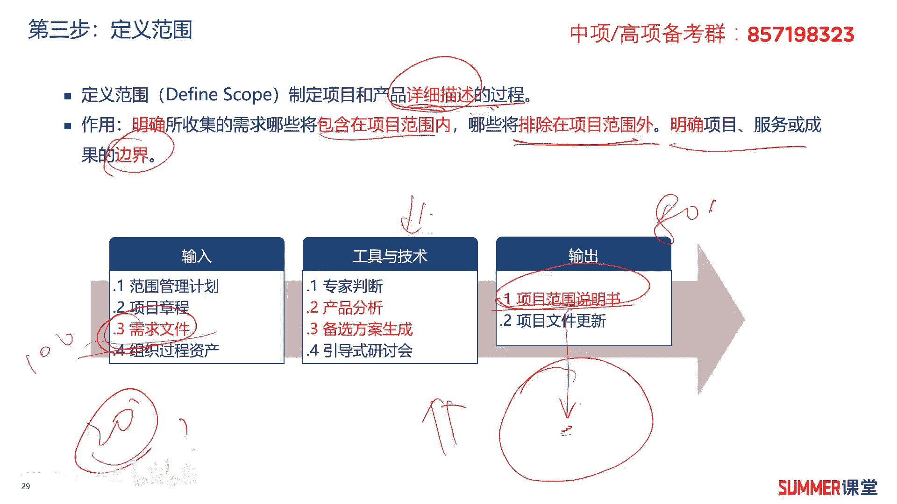
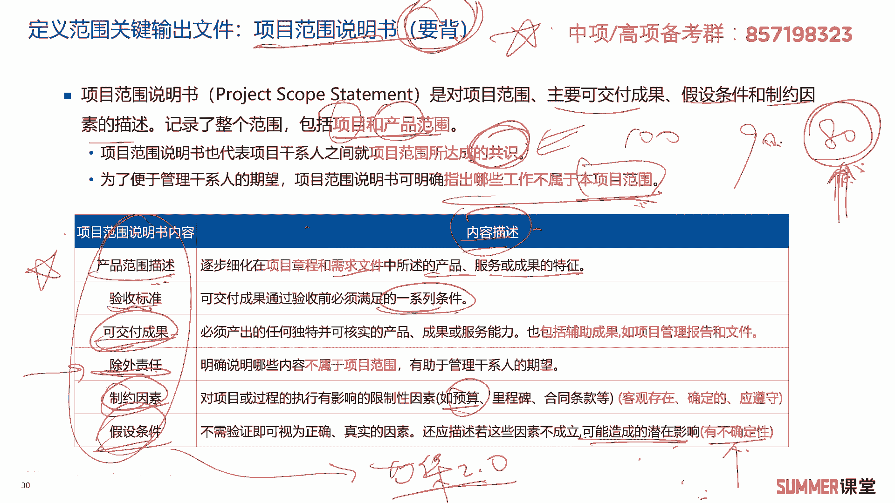
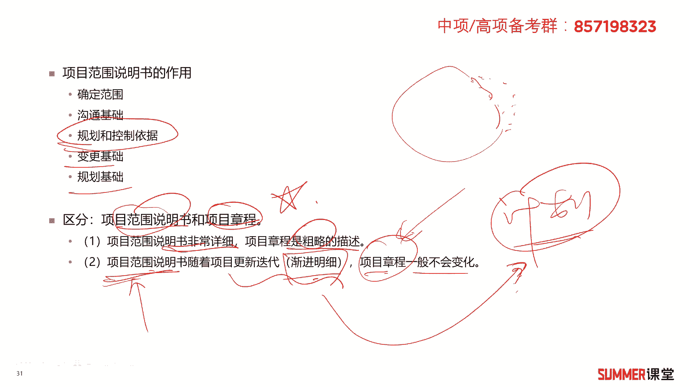
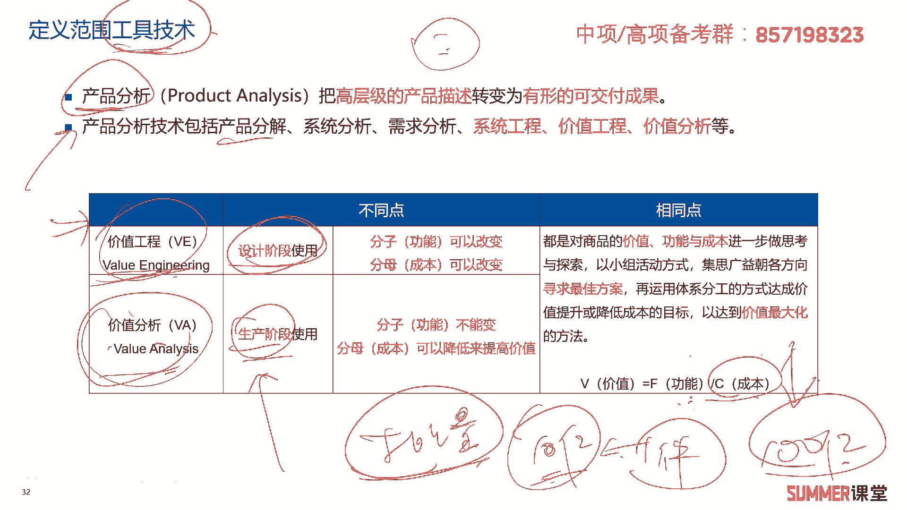
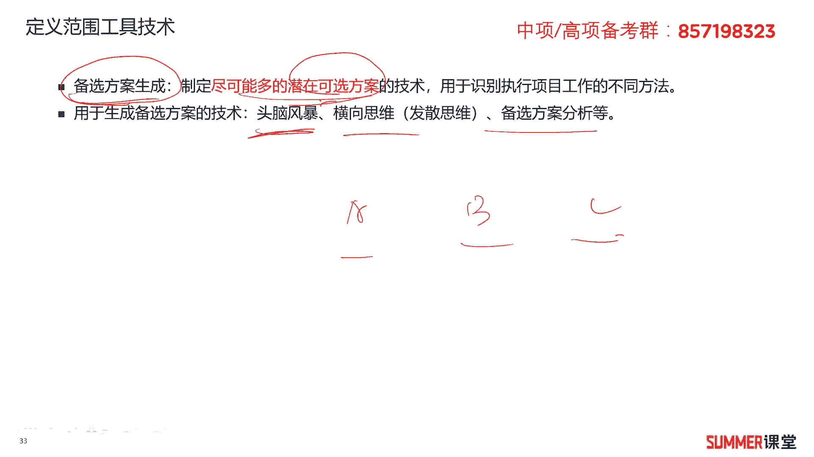

# 2023年软考信息系统项目管理师视频教程【总结到位，清晰易懂】-软考高项培训视频 - P43：5-4 定义范围 - summer课堂 - BV1wM4y1Z7ny

好，我们前面给大家去梳理过需求跟范围的区别啊，需求是客户想要的100分范围，是我们最后实际做的80分对吧啊，所以收集完需求之后，我们就要把需求进行裁剪和优化，跟客户进行沟通。

最后输出我们实际要做的这80分的范围，ok收集完需求啊。

那么我们进入下一步，也就是范围管理的第三步，定义范围，那定义范围这个过程，你看一下他i t t l都知道啊，输入有用户的需求文件，也就是100分输出项目范围的说明书，就是我们实际做的80分。

这两个文件很重要哦，要记住啊，要记住好吧，我们还是先给大家梳理一下啊，定义范围它的啊这个概念啊，定义范围啊，是制定项目和产品的详细描述的过程啊，详细描述作用是明确所收集到的需求。

哪些是要包含到项目范围当中，哪些是要排除的，排除的20分是哪些对吧，明确项目服务或成果的边界，明确边界，相当于我们在第三部当中就把范围划出来了，在范围说明书里面的，这是我们真正的项目的范围，明白啊。

输入和输出应该是梳理清楚了哈啊，然后工具和技术我们放到后面啊，慢慢来讲好，这里面我们首先来看一下定义范围。

关键的输出文件，项目范围说明书，后面我给大家背出了两个字，要背啊，要背很重要，历年考试高频考点，上午下午都考，下午案例分析题出现过的，就让你写项目范围说明书里面包含哪些东西，好吧。

项目目范围说明书不是对项目范围，主要可交付成果，假设条件和制约因素的描述，记录了整个范围，包括项目和产品的范围，这两个范围都包括项目范围，说明书，也代表了项目干系人之间，就项目范围所达成的共识啊。

什么叫共识，你他想要100，你最后你能做的是90，但是最后你实际做的可能是80，这80就是你的范围，就是你的你们之间的共识吗，对吧啊，你们这样的共识，当然达成这个共识的过程可能是要来回的沟通，去确认。

去协调的，明白这个过程还是挺复杂的，为了便于管理干系人的期望，项目范围说明书可明确指出，哪些工作不属于本项目的范围，哪些工作不属于你，要明确指出他给你想想，让你搞一个光速的规飞船啊。

你最后再指出这个搞不了对吧，在范围说明书里面明确指出是吧，ok项目范围说明书它里面的包含的内容六条，123456，把它给我备注，要考的啊，其实夏老师让大家背的东西好像不是特别多，但是我说要背的。

你绝对要背，那肯定考啊，不不一定说肯定考，就是这个东西出题的概率极高的是吧，考过很多次的啊，项目范围说明书包含的内容被前面的就行了，后面内容描述大家理解好吧，我们还是给大家解释一下。

第一个是产品范围的描述，产品范围的描述，就描述我们这个产品需要需要开发哪些东西吗，对吧，它是逐步细化在项目章程和需求文件当中，所述的产品服务或者成果的一个特性，项目章程里面其实有有大概大概的一个目标。

但是产品范围详细的，这个描述，肯定在范围说明书里面就很就很详细了啊，比这两个都详细很多，ok啊接着验收的标准啊，我们做到什么程度能够啊，验收是吧，要满足的，你验收前要满足的一系一系列条件，这很好理解。

可交付成果，那最后你交付哪些东西啊，啊交付软件源代码啊，有文档啊，你开发的工具用不用交互是吧啊，有交互哪些文件，所以这是可交付成果，你要说清楚，就是除外责任啊，把哪些不就明确说明。

哪些内容不属于这个项目是吧，比如说我给你开发个软件，我最后给你交付的是源代码，有相应的配套文件，但我开发的工具，我这个是不给你的，开发工具也是我买的是吧，这个东西就不给你了啊，你要说清楚啊，要说清楚啊。

就跟你买车一样啊，旁边站了一个车模啊，最后我交付给你的是这辆车，这车模，那这是不卖的是吧，另外就是制约因素，制约因素当然制约因素就很多了哟，啊比如说我们项目的预算，工期等等都是制约因素嘛啊假设条件。

假设条件是什么意思啊，它是指不需要验证即可，即可被视为正确或者真实的因素，还应描述，若这些因素不成立，可能给项目造成的潜在影响，就有有不确定性啊，举个例子，那比如说我们现在的标准算到等保二点。

这个标准去做的是吧，但是我们做做完这个项目，或者这个项目还没做完，标准马上就升级到了等三点了，那我是不是要把假设条件说清楚，我是以这个标准来做的啊，如果吹真的出现，等到三点，我要有一定的除外责任。

这就不是我的因素了，是国家是啊，国家相应的一些政策嘛啊这叫假设条件哈，这几个先给我备注，然后再来理解，非常重要啊。

非常重要，好项目范围说明书它的作用是确定范围啊，是我们跟用户啊，跟客户沟通的一个基础，是我们做规划和控制的基础，变更的基础，规划的基础是吧，理解哈啊理解啊，项目范围说明书跟项目章程它的一个区别啊。

作为一个重点啊，看一下项目范围说明书，它是非常详细的，项目章程是比较粗略的，项目范围说明书是随着我们项目迭代更新，它是渐进明细的，而项目章程这东西一般第一次颁发，颁布之后是不不会发生变化的，我说一般哈。

那你一定要给我较真，他说发起人他一定要变项目商城可不可以，那可以，在正常情况下，项目章程一般不会有太大的变化，好吧啊，但是项目范围说明书，刚开始可能你对这个范围边界不是特别模糊。

比如这块你都不知道是啥是吧，但是随着项目的推进，你渐渐把它补全，渐渐补全，渐渐补全对渐进明细嘛，其实项目里面很多文件都是渐进明细的，计划跟计划有关的，是不是都是渐进明细啊，对吧啊，这个应该理解哈。

计划我们是一步一步做的，不可能一口吃成一个大胖子的啊。

接着啊接着讲了定义范围的输出之后啊，讲工具和技术啊，工具和技术，工具和技术里面有一个东西叫产品分析，产品分析，产品分析是把高层级的产品，产品描述转化为有形的可交付成果啊，把把产品描述转换成可交付成果啊。

里边会涉及到两个东西，一个是价值工程，还有一个是价值分析，产产品分析技术里面很多哈，包含什么产品分解，系统分析，需求分析系统，工程价值分析等等啊，我们需要注意的重点，需要看的是价值工程和价值分析。

什么意思啊，啊这两个东西又是比较陌生的概念了啊，那又是比较陌生的概念啊，我们给大家举个例子，可能你就稍微好理解一点，就是最后的价值是等于功能除以成本的啊，比如说我开发十个功能出来，最后能卖十块钱。

那么我的价值是不是就等于一啊，价值等于一，如果我开发20个功能出来，最后能卖15 15块钱啊，不还是把它整成整数哈，开发30个功能出来，最后我能卖20块钱，那么它的价值是不是就1。5啊。

啊这两个应该很好计算哈，就是功能和和和成本他们做一个比值啊，做一个比值肯定是这个值越大越好，也就是说我们产品开发的时候，不是说你功能越越多就越好，也不是说功能越少就越好，要要它的价值达到最大。

那这个才好是吧，我们在设计的时候，我们就要考虑产品的功能，产品的成本啊，综合去考虑，那综合去考虑，我给大家再举个更形象的一个例子哈，就是我前段时间看了一个新闻，关于药企的新药开发，啊新药开发。

大家应该都听过那个抗癌的一个针，应该是以100多万每增是吧啊，100多万每升啊，我看过一个一个专家哈，他就说的比较可悲的或者比较难的，就是不是说没有这方面的技术，而且是这，而是这方面的技术真正开发出来。

你用不起啊，其实抗癌呃还是有些技术突破了，但是唯一的问题是什么啊，唯一的问题就是成本太高了，一般人扛扛不住，承受不了，但如果真的有一个抗癌的药物出来了，那一针。

当然这个110楼100多万是已经市场化的哈，还有一些真的没市场化的技术，一增1000万你能接受得了吗啊接受不了对吧，就就是它的成本太高了，那最后造成它的价值很低，一般人接受不了啊。

有些人说你这一针1000万，而且药药到病除，这不是抢钱吗啊真不是抢钱啊，真不是抢钱，为什么，因为关于新药研发，这个是需要投入极大的成本的呀，这是需要钱的呀，人你要找好好多博士，然后设备是吧。

你要买最新的各种各样的设备，还有什么，包括你实验的，我前段时间看那个做实验的猴子，都是20万的一只啊，专门拿去做人做，比如说人体实验，做猴体实验的这种猴子，所以研发一个新药的成本是极高的啊。

真的是极高啊，为什么他会收这么贵，如果不收这么贵，他收不回成本啊，收不回成本，他干这个事情有什么意义啊，这些医药公司人家都是要挣钱的呀对吧，那都是要挣钱的，人家又不是做公益的啊，所以跟这个扯上关系。

他是不是是不是就就跟价值分析有关了，如果我们一个要最后它它的功能，当然如果是一个抗癌的药，功能还是很牛逼的，但如果它成本高到无天气，他这个价值就很低，是不是这个价值就很低，价值很低的话。

他可能经过价值工程一分析，那这个药我就不该不做了啊，虽然他对这个社会很有用，但是他做了我这么点钱啊，我还亏对吧，说不定我公司就倒闭了对吧，因为抗癌药这种他又不是每个人必须要吃的啊。

不是每个人都都都都会得癌症嘛对吧，他这个群体也不是特别特别多，所以他必须要把单只要的这个成本啊，不是叫成本，单只药的费用给他升上去，明白那价值工程就是用来分析啊，分析我们我们这个事情做不做的啊。

大概就这个意思啊，他主要在设计阶段使用，设计阶段我们设计出来，我们肯定是要尽量的让它的价值变得最大啊，如果它的功能呃不不太好变大的话，那我就把它成本给它降低，最后它就变大。

但如果我能把它功能降得更深的更高对吧，比如我开发一只抑制抗癌药，它不仅能抗抗什么肺癌啊，其他的什么他都能抗，那就很牛逼了，这是不是把这功能给提提高了，ok这叫价值分析哈啊这叫价值工程。

还有一个叫价值分析，价值分析价值分析的话，主要是在生产阶段用价值分分析，主要就是它功能已经确定了啊，分子功能已经不不能变了，那你是决定生产了吗，这功能肯定都已经在前发的。

前期的这个研发设计当中都已经确定了，那我怎么办，那我就只有把成本降到最低，怎么降低成本啊，最最好的方法就是批量生产嘛，就大批量对吧，因为头一条一条生产线可能十个亿，我生产一件。

这十个亿固定成本也是投进去的，我生产110件，是不是也是也是一个生产线，这样的话就能降低我的成本对吧，一般用在生产阶段啊，一般用在生产阶段啊，价值工程和价值分析啊，通过我讲的这个例子哈。

希望大家大概能够感觉到他说的是什么啊，如果实在不明白，那就算了，那你就把它应用到哪个阶段，稍微记一下就行了啊，你知道诶，这是定义范围里面的工具是吧啊，它是产品分析者当中的一种啊，就行了啊。

也没有必要深究这种不会考大题啊，有可能会出现选择而考，选择考的也不多啊。

反正考的也不多，但是这里面设计，我顺便给大家去做了一下扩展啊，做了一下扩展好吧，接着定义范围，还有一些工具和技术啊，就是备选方案的生成就尽量的尽可能的啊，你制定多的这种呃可选方案嘛，是吧啊。

你有a有b有c啊，这几种啊可以供你选择吗，是不是啊，用于识别项目，识别执行项目工作的啊，这种不同的方法啊，生成备选方案啊，生成备胎有几种啊，有有又有些技术哈哈，又有一些技术就是头脑风暴啊。

