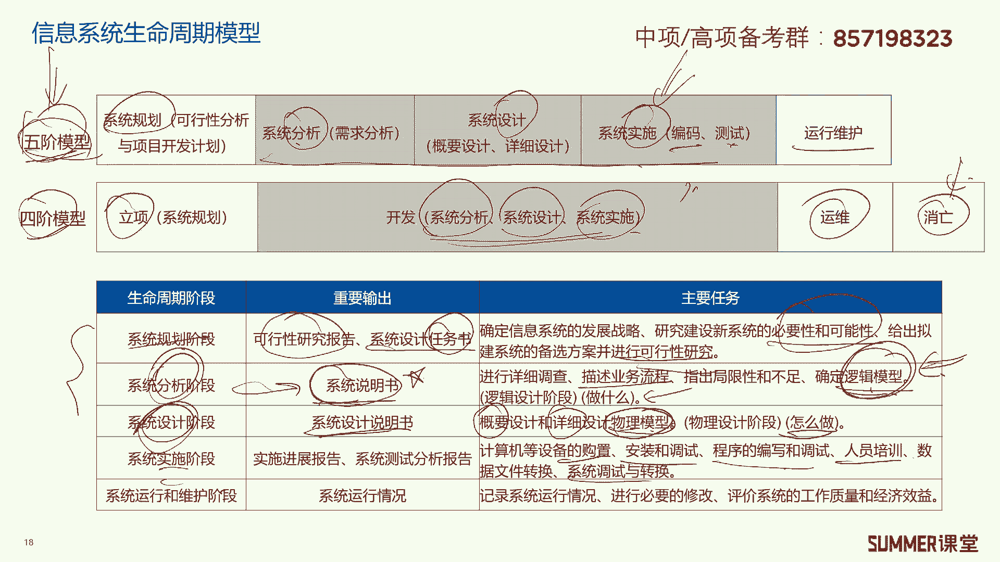
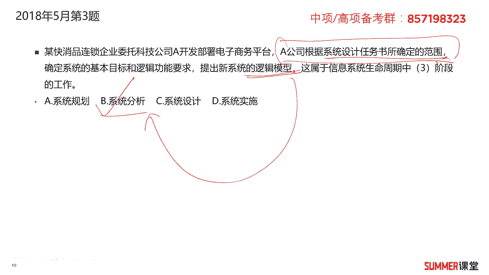
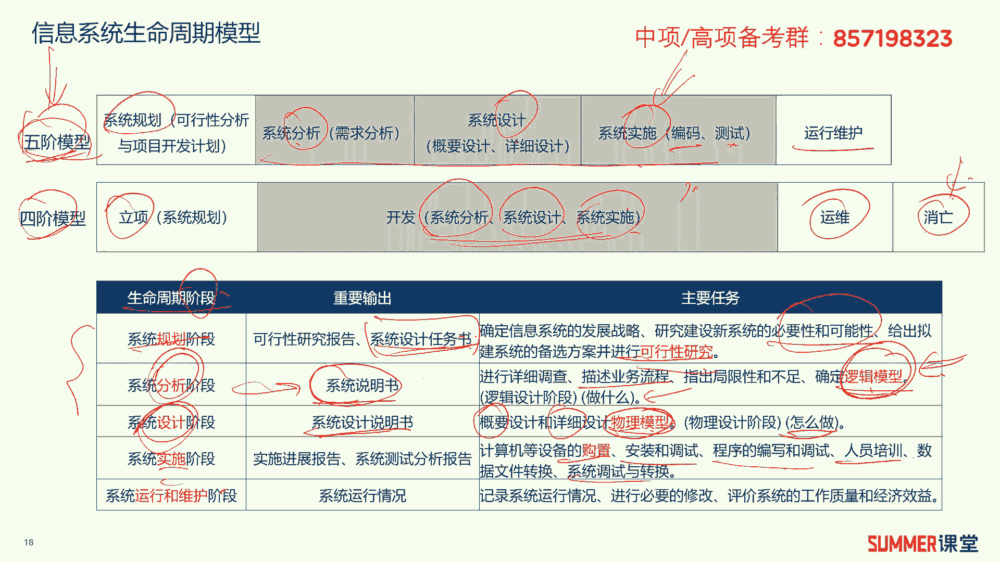
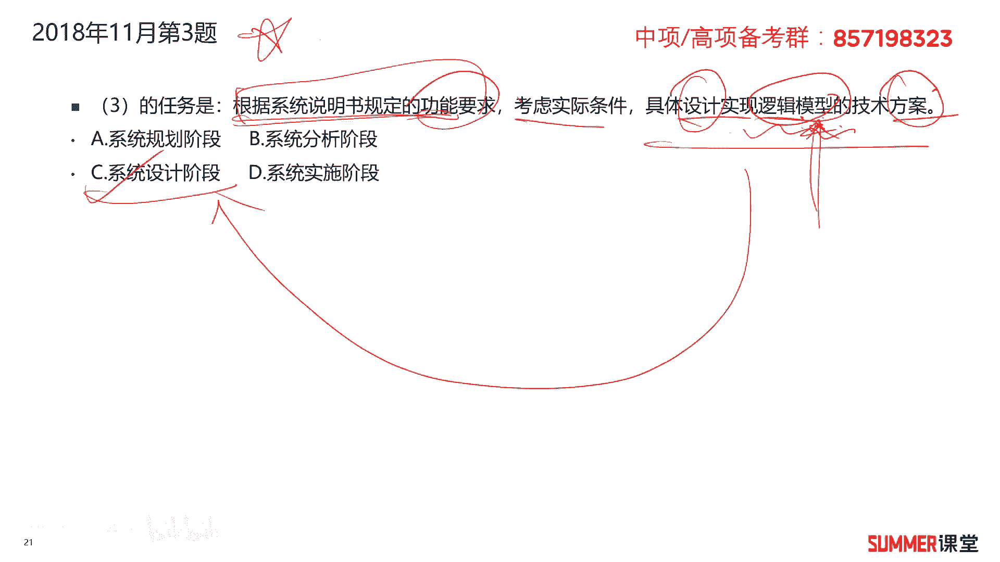
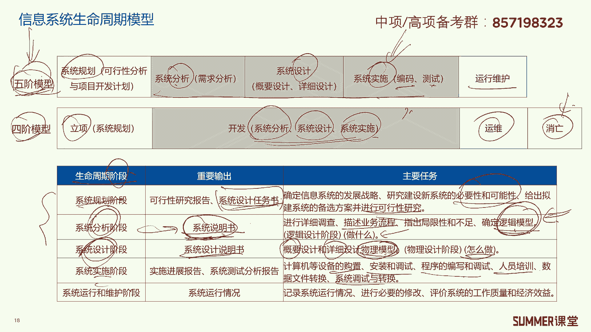
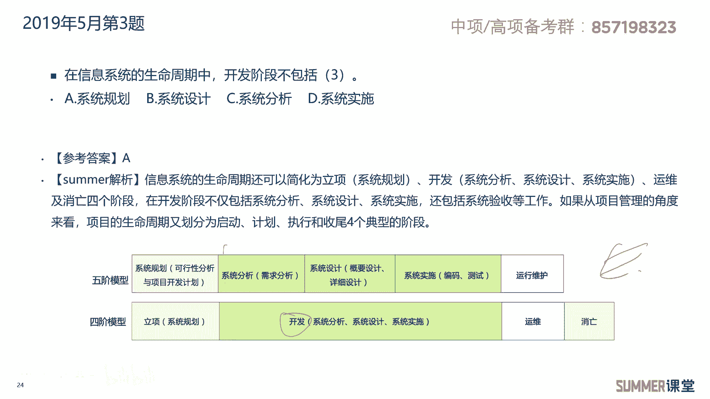

# 2023年软考信息系统项目管理师视频教程【总结到位，清晰易懂】-软考高项培训视频 - P4：1-1-3 信息系统生命周期模型 - summer课堂 - BV1wM4y1Z7ny

我们下面来看信息系统生命周期模型，一共可以分成两种模型，五阶段模型和四阶段模型，其中五阶段模型它是分为系统规划，分析设计，实施和运行维护这么五个阶段，四阶段模型分成逆向开发，运维和消亡，其中四阶段模型。

他把五阶段模型当中的这三个，相当于给你做了一下整合对吧，分析设计和实施给你整合到了开发里面去，这里面需要注意哦，跟我们平时理解的开发不一样，我们平时理解的开发就是软件开发吗。

软件开发应该是属于实施阶段的，编码和测试是不是都属于系统实施阶段，但是这里面的开发，它是包含了分析设计和实施的，这是跟我们平时一般的认知有区别的，一个点是吧，另外五阶段模型它是没有消亡的。

四阶段模型有一个消亡，ok啊这两个模型希望大家要注意啊，考试会考，另外还需要重点掌握下面的这张表格，考试也经常考五阶段模型啊，这应该考的比较多，其实五阶段和四阶段没有本质的差异。

就是相当于把各个阶段给你做了一下整合嘛，对吧，我们重点来看五阶段模型啊，五阶段模型，第一阶段是系统的规划阶段，这个阶段主要干什么啊，主要确定信息系统的发展战略，研究建设新系统的必要性和可能性。

说白了就搞可言吗是吧，有没有必要搞这个项目啊，如果这个项目一搞，可能1年亏亏好几千万，然后还常常没有长时间没有收益的啊，一直亏下去，那肯定就没有没有必要搞了是吧，然后给出你建系统的备选方案。

并进行可行性研究，简单理解就是做可言，最后会输出可行性研究报告，系统设计任务书啊，输出一个任务书，然后接着是分析阶段，分析阶段进行详细的调查，描述业务的流程，指出局限性和不足物，确定关键词，逻辑模型。

分析阶段确定逻辑模型，逻辑模型是什么，就是你要描述具体我们要干什么事情对吧，那干什么事情在什么地方描述啊，在系统说明书里面作为一个重量系统分析阶段，它输出的是系统说明书，接着进入设计阶段。

设计阶段主要会进行概要设计和详细设计，它设计出来的是物理模型，而分析阶段他得出的是逻辑模型，这两个是需要区分和注意的啊，一定要需要区分和注意啊，其实分析阶段你分析的是你要做什么。

设计阶段你要确定的是怎么做，怎么做，在什么文件里面，在系统设计说明书里边啊，一步一步设计好了，具体怎么做嘛是吧，ok这是分析和设计，那下一步实施实施就包含包含哪些啊，包含了软件编码啊。

什么硬件设备的购置，安装调试，然后呃呃程序编写，调试人员培训培训，数据转换啊，什么系统调试转换等等，其实四阶段比较好理解，不跟你讲，你大概知道怎么回事啊，就运行维护嘛对吧，所以这么五个阶段。

如果考试考基本上都是考前三个阶段，后面两个阶段四个人基本上都知道啊，因为你不需要学我们这个东西，大概也能感觉到实施和运维具体是什么是吧，所以考试的出题老师也很经营。

那考的话肯定不会考这个全国人民都会的呀，那就没有意义了，那肯定最喜欢考的就是分析和设计，这两个阶段是比较容易混淆的，哪一个是确定逻辑模型，哪一个是确定物理模型，他们的输出文件是什么，需要注意啊。

另外就是规划阶段主要是针对可行性研究的啊，后两个阶段简单看一下就行了，好吧，我们来看两道题。

2018年5月第三题，某快消品连锁企业委托科技公司a开发，部署电子商务平台，a公司根据系统设计任务书所确定的范围，确定系统的基本目标和逻辑功能要求，提出新系统的逻辑模型。

这属于信息系统生命周期当中的哪个阶段，逻确定逻辑模型是不是属于我们的分析阶段，从它可以选出出来，另外你还可以从前面，a公司是根据系统设计任务书所确定的范围。

来工作的，系统设计任务书属于哪个阶段的输出啊，系统设计任务书是不是属于规划阶段的输出啊，这需要注意哦，下一次我就直接考一个系统设计任务书，属于哪一个周期的输出，哪一个哪一个阶段的输出。

我我肯定有不少人会选错啊，这是属于规划的规划阶段，有两个东西啊，输出第一个是可研报告，第二个是系统设计任务书对吧，根据它来进行下一步，他下一步就分析了呗。

是吧啊，所以通过这儿也可以选出系统分析阶段啊，这道题选择b啊，然后针对每个阶段有详细的解释哈哈，如果你还不清楚的，可以去看一下，接着2018年11月的第三题什么的，任务是根据系统说明书的规定呃。

根据系统说明书规定的功能要求，考虑实际的条件，具体设计实现逻辑模型的技术方案，而且一看到逻辑模型啊，直接系统分析阶段，对不对不对啊，为什么不对，这道题你要认真读了呀，你看后面这句话。

具体设计实现逻辑模型的技术方案，它的关键词是设计方案，设计方案，你说在哪个阶段嘛，肯定是设计阶段啊，中间的这些都是修饰词，专门用来干扰你的，不要不要被逻辑模型四个字干扰了哈。

如果只看只看题目一些关键字就走了，这道题是很容易选错的啊，我觉得它很经典，大家可以好好的研究一下，好好的研究一下，我们可以通过这判断选择设计阶段，还可以通过什么。

还可以通过前面根据系统说明书做后面的工作，系统说明书是哪个阶段的输出啊。

你看一下系统说明书是不是分析阶段，分析阶段已经完了呀。

系统说明书都已经输出来了，所以下一个阶段应该干什么，应该应该是设计工作，应该是设计工作，所以这道题选择c答案，2019年5月，第三题，在信息系统的生命周期中，开发阶段不包括什么开发阶段。

是不是我们说的四阶段模型啊，四阶段包括设计分析和实施，不包括系统的规划。

还记得吗啊这样的一个图啊。

