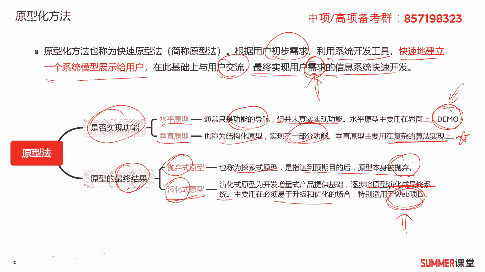

# 2023年软考信息系统项目管理师视频教程【总结到位，清晰易懂】-软考高项培训视频 - P5：1-1-4 信息系统开发方法 - summer课堂 - BV1wM4y1Z7ny

我们下面学习系统开发方法啊，书上主要给我们讲了四种开发方法，分别是结构化方法，面向对象的方法，圆形法和面向服务的方法，我们首先来看一下第一种结构化方法，结构化方法由结构化的分析，结构化的设计。

结构化程序设计三个部分组成，它的精髓是自顶向下一步一步的推进，比如说诶我们的一个开发主要就分成1234，12345这么五步，12345这么五步，它是从第一步开始，把第一步完成了，再做第二步啊。

最后做第五步，一步一步进行的啊，我们一个大的系统，它可以采用模块化的设计，然后逐步求精，逐步求精，这是它的精髓，结构化方法，它的主要特点有四个，第一开发的目标非常清晰啊，就是我最终要实现什么效果。

这个很清晰的，包括它的步骤也很清晰，我去具体要经过几步是吧，然后开发工作阶段化啊，这五步吗，或者六部七部八部都行，看具体的项目来定开发文档规范化啊，这一点我们后面讲瀑布模型的时候，应该还会给大家去说到。

瀑布模型跟它是比较类似的，就是我们完成每一个阶段之后，比如说你分成五步，你第一个阶段完了之后，是不是要有相应的输出啊，啊比如说你的编码啊，比如说你的设计文档，开发文档你就要输出。

所以它的文档是比较规范化的啊，因为每一个阶段完了之后，我们对这个阶段的检查主要就是检查文档嘛，啊因为你前期你的程序什么的都还没做出来，能检查的，比如你分析啊，你分析出来的结果就是只有文档了对吧。

只有文档，第四设计方法，结构化，结构化方法它的缺点一共有三点，第一个开发周期比较长，你要一步一步按照标准啊去走啊，要走完这个流程，所以它的周期是很长的，第二难以适应需求的变化，比如说我已经做到第四步了。

还有一步就完了，但是你突然需求给我变了，那我就要从第一步重新开始，要重新开始分析，重新设计是吧，所以他对需求的一个变化不是特别灵活，第三很少考虑数据结构，它主要考虑的是过程，主要考虑的是过程。

结构化方法，特别适用于数据处理领域的问题，主要数据处理领域需要大家记一下，但不适用于规模较大，比较复杂系统的开发，特别是不适用于需求变化频繁的这种项目，因为它对需求不太友好，难以适应需求的变化。

ok这是第一种信息系统的开发方法，结构化等方法。

接着我们来看第二种方法，面向对象的开发方法啊，当然啊我们在讲他之前，首先给大家去做一些扫盲啊，就是面向对象的一些概念啊，书上没有，但是有些时候考试会涉及啊，考试会设计。

我们通过一个表格给大家去做了一个总结啊，首先是对象和类，这是面向对象的基础啊，首先什么是对象呢，啊系统中用来描述客观事物的一个实体，它就是对象，它是构成系统的一个基本单位啊，相当于没说还是不明白啊。

接着往下，客观存在的事物其实都是对象，比如我们所说的电脑，手机，汽车人飞机大炮坦克等等，你能想到的一切事物它都是对象，ok然后类是对象的抽象定义，对象拥有的一些特征或者行为。

我们就可以把它整合到类里面啊，比如说人是一个类是吧，人是一个类类，它有哪些特征呢，人都有两只眼睛，然后两只手嘛是吧啊，这是静态的一些特征，然后动态的一些行为呢啊动态的一些行为，比如说人都都要吃饭。

是不是人都要吃饭嘛啊，然后都要喝水，这相当于就是动态的一些行为了，这是人的一些特征啊，人就是一个类，它是由我们对象拥有的一些特征和行为的集合，ok类是对象的抽象描述，对象是类的具体实力啊，怎么理解啊。

比如张三这个人他是一个对象，他是具体存在的，然后人类是具体存在的吗，有人类这个东西吗，没有他他只是一个抽象对吧，我们都属于人类，但是你说人类是个什么东西，它不是一个具体的存在，它是抽象的定义。

应该能理解哈啊，一个类是不是可以定义出很多对象啊，全球这么多人啊，人都是对象，然后啊它都属于人类人类这个大类的，好吧啊，需要大家要好好的琢磨一下，好的琢磨一下啊，接着啊是封装。

封装是将相关的概念组成一个单元，然后通过一个名称来引用它，面向对象，封装是将我们的数据和基于数据的一些操作啊，什么是数据啊，比如说两只眼睛，两只手这些基本的特征啊，属性它就是数据嘛。

然后吃饭喝水，这是不是基于数据的操作了啊，这就是操作，它是动态的，把它封装成一个整体对象，对数据的访问或者修改，只能通过对象对外的接口来进行看封装，就是我们把它把一些东西封装在一起。

然后我们要用它只能通过接口来进行，我给大家举个例子，可能就很形象了，比如说充电宝大家都用过吧，你关注充电宝里面是用什么电池，它电路怎么走的吗，关不关注不关注，我只关注有一个接口出来插到我手机上。

能给我充电，这就是典型的封装嘛，对吧，是典型的封装吗，应该是很好理解的啊，然后继承继承是子类，继承父类的一些属性特征，不需要在子类进行重复的定义和说明，比如说人类啊，它有一些基本的特征。

人你可以分成两个子类，男人女人是吧，男人和女人，是不是都继承了人类的一些基本特征啊，啊你不能说女人她就有有有四只眼睛啊，有三三只手啊，这肯定不是嘛，他继承人类的一些基本特征啊，他有两只眼睛，两只手。

那女人和男人，你你都要吃饭喝水呀，这叫继承继承的反方向，相反的一个概念，我们把它叫做泛化，男人和女神，我们可以把它进行一个泛化，就幻化成人类吗，他们都有一些共同的基本特征啊，继承是从上往下。

然后泛化是从下往上，ok这两个概念需要注意一下，接着多肽多肽，多肽是使得在多个类中，可以定义一个操作或者属性名，并且在每个类中可以有不同的实现，同一个操作或者属性名，在不同的类中有不同的实现。

举了一个例子，比如说猫和鱼都要呼吸，我们可以定一个呼吸的函数，但是要实现它们的方法肯定是不一样的，猫是用鼻子呼吸，而鱼是不是用鳃呼吸啊，虽然都是呼吸这个函数，但是他们实现方法不一样啊，不一样。

这就叫多肽啊，同一个东西，然后不同的实现方法，或者再举个简单例子啊，比如说你的电脑都有usb接口后，我们插一个鼠标上去和插一个键盘上去，它实现的功能是不是不一样的呀，啊这这就叫多肽啊，理解一下哈。

它的定义，接着消息，好消息是体现对象间的交互啊，通过他向目标对象发送操作请求，我们对象之间要交互是通过消息来进行的，然后模式模式这个东西又比较难理解啊，没有基础或者没搞搞过程序开发的。

反正对这个玩意儿会有点陌生，我们还是先看一下概念，再来给大家去举例，子模式描述了一个不不断重复发生的问题，以及该问题的解决方案啊，它包括了特定的环境问题解决方案三个部分。

应用设计模式可以更简单和方便的去复用，成功的软件和软件设计和架构，帮助设计者更好更快地完成系统的设计啊，模式主要是用在设计里面的，我们把它说简单一点，就是先被程序员针对。

开发中和设计当中遇到的一些问题啊，提出来的，大家公认且行之有效的一些解决方案，相当于简单理解模板虽然不准确啊，啊模板模模式是不是跟模板就非常类似的，一些成功的比较好的模板，我们可以借鉴，可以引用。

这就是模式啊，复用复用大家应该都能够理解了，就是以前已经有了一些软件和它的一些成分啊，我们可以把它用在新的软件里面，模式是偏向架构的复用，而我们下面的复用是偏向于代码的复用。

好了解哈啊了解这是面向对象的一些概念，可能第一次接触这些概念会显得比较陌生啊，有点难啊，没关系啊，全国人民都觉得难，然后你根据我们举的例子啊，稍微的去理解一下，也不用大家理解的多么深刻，多么透彻。

待会我们给大家去看一下题啊，这些题具体怎么做啊，会做题就行了，好吧好，我们下面正式介入面向对象的开发方法，面向对象的方法也叫oo啊，面向对象就是这两个呃，就是它是两个单词的一个缩写啊。

这两个单词正好缩写下来就是o o o，他认为客观世界是由各种对象组成的啊，很多很多对象嘛是吧，人啊，什么动物啊，花草啊，这些都是对象，任何事物都是对象，与结构化方法比较类似，面向对象的方法。

它也是要画阶段的，但是系统分析，系统设计和系统实现，三个阶段之间已经没有了缝隙，也就是说这三个阶段的界限变得不明确了啊，变得不明确了啊，需要注意一下这句话啊，读一读物，然后有意识的去熟悉啊。

不用死记硬背，面向对象的方法构建在类和对象之上，什么是类，什么是对象，我们前面已经给大家去说过了，对吧啊，随后发展起来的建模技术，将相关对象按照业务功能进行分组，就形成了构建啊，什么是构建。

就是把我们的对象按业务功能进行分组啊，形成的一个东西啊，就叫构建大型信息系统的开发啊，通常是将面向结构的方法和面向对象的方法，我们把它结合起来用啊，怎么用的啊，先使用面向结构的方法。

进行自顶向下的整体划分，然后用面向对象的方法自底向上进行开发，一个是从上往下，一个是从下往上，结构化方法，我们把它用在从上往下，然后面向对象的方法是从下往上啊，你刚是不是说反了哈，结构化方法是从上往下。

然后面向对象的方法是从下往上，别别别绕晕了啊，这两个东西下来啊，需要记一下面向对象方法啊，它的优点啊，这是考过的哟，啊需要注意具有更好的复用性，有利于用户和开发人员沟通，能够缩短开发的时间。

而面向结构的这个方法，它开发时间是比较长的是吧，还有就是面向对象的三大特征，三大特征，封装性，继承性，多态性，是不是刚刚都讲过了呀，啊刚刚都给那些说了，继承封装，在这继承封装多态这三大特征，它的解释啊。

最好能够理解啊，最好能够理解，这也是考过的。

这也是考过的，ok我们问大家一个问题，就是面向对象和面向过程他们有什么区别啊，这这个区别可以说很多东西，但是说出来大家不理解也没什么用，我给大家举个例子，有个基本的认识就行了。

怎么把冰大象放入冰箱里面去，如果是面向过程的方法，一般分三步，第一步打开冰箱，第二步放入大象，第三步关闭冰箱，如果是面向对象的方法，一般来讲我们会创建两个对象先啊，第一个对象就是大象，第二个对象是冰箱。

然后我们再通过接口把相应的对象连接起来，所以他是从宏观上去考虑问题，而面向过程它是从细节考虑问题啊，这样做面向对象有什么好处啊，像冰箱这个类啊，你把它写成两个对象哈，这个对象啊，比如你就用一个类去实现。

先写完一个类，然后创建一个冰箱，这个对象是吧啊，相当于这个东西以后就可以复用啊，比如说以后你要放放放什么猪啊，牛啊这些东西把它放入冰箱啊，冰箱这个东西就不需要重新去写了，明白啊。

你只需要写你新放的一个东西就可以了啊，所以它的复用性会比较强啊。

复用性比较强好接着还有两种方法啊，圆形化的方法好，圆形法方法也叫快速圆形法啊，简称圆形法，它是根据用户的初步需求，利用系统开发工具，快速的建立一个系统模型给用户展示，然后在此基础上跟用户去交流。

最终实现用户需求的信息系统快速开发方法，先搞一个基础的东西给用户看啊，然后你在这个基础的东西上啊，给我提意见，然后我基于你的意见去修改是吧，这叫圆形法，圆形法有两种分类，第一种分类是按照是否实现功能。

可以分成水平圆形和垂直圆形，所以冰原型通常是给一个功能的导航，然后并没有实现真正的功能，我给你的这个圆形上面有些按钮，但你按这个按钮按不动按不动是吧，主要就是一些功能界面，典型的就是demo嘛。

给你演示一个demo里面具体功能是没有实现的啊，一天具体功能没有实现，还有一种叫垂直圆形，也叫结构化原型，它实现了一部分的功能，你按这个按钮是可以按动的啊，是可以按动的啊，基础的功能啊，有垂直圆形。

主要用在复杂的算法实现上，它的应用领域啊，注意一下啊，第二种圆形法的话划分方法啊，我们把按照最终的结果来画，可以画成抛弃式原型和演化式原型，抛弃式原型也叫做探索式，圆形是指达到预期的目的之后。

原型本身就被抛弃了啊，我不用了，我开发这个原型的目的主要是跟用户沟通，探索它的需求嘛，让他提需求对吧，他把需求给我提出来了，我原来的原型就不用我重新对你进行开发，第二种叫演化式原型。

演化式原型我就先开发出一个东西，来让用户提意见提意见，我在用户的意见基础上对我的原型进行修改，然后逐渐的把我的圆圆形演化成最终的产品啊，银行成最终的产品，它主要用在用在啊。

必须易于升级和优化的一些场合啊，比如说典型的web啊，web网页开发我们一般用演化式原型啊，一般用演化式原型原型法的分类啊，希望大家注意一下啊。

这也是考点啊，这是考点圆形化的特点以及它的优缺点啊，这一页啊大家其实读一读就行了，应该比较好理解啊，圆心法应该是所有的开发方法当中，最好理解的一种是吧，最好理解的一种，好，看一下圆形码的特点。

第一原型法可以使系统开发的周期缩短，按成本和风险都降低，你都是给客户看过的，然后客户提的意见是吧，所以风险相对而言会低一些，开发速度加快，获得较高的综合开发效益。

第二原型法是以用户为中心来进行系统开发的，用户的参与度是大大提高了，然后开发的系统符合用户的需求，因而增加了用户的满意度，提高了系统开发的成功率，很好理解，三由于用户参与了系统开发的全过程。

对系统的功能和结构容易理解和接受，有助于系统的移交啊，也就最后的验收啊，客户容易满意嘛啊，有助于系统的运行和维护，原型法的不足两点，第一个对开发的环境要求比较高，第二个对我们管理水平要求比较高啊。

为什么啊，因为客户会在原型的基础上啊，提各种各样的要求，而且刚开始一些需求是不明确的啊，你要根据客户的这个场景，自己去把原型给搞出来，当然原型法也有一些优点哈，它能够有效的确认客户的需求，从直观上来看。

言行法适用于那些需求不明确，这个需求不明确，跟我们前面的面向面向对结构化的方法啊，是不是相差很大啊，啊正好是相反的，那对于分析层面难度较大，技术啊层面难度不大的这种系统啊，适合用圆形法。

而对于那些技术层面的困难，远大于分析层面困难的系统，不宜采用圆形法，ok这是原型法的一些优缺点总结。

最后还有一种面向服务的方法啊，面向服务的方法说实话有点难理解，我们对大家的要求也不高，你把我这一页总结的一些特点给，好好的看一下就行了，考试基本上就考到这个程度，没有必要做深入的研究了哈。

面向服务的方法是，对于他对于跨构件的功能调用啊，采用接口的形式进行暴露出来啊，这句话啊稍微注意一下，进一步将接口的定义啊与实现进行解耦，解耦催生了服务和面向服务的开发方法啊。

这里面我给大家总结了两个关键字，就是面向服务的方法，它是松耦合，解耦嘛啊，松耦合，然后出力度的啊，什么是力度，你不用管，把这两个词给我记住，因为这是2022年啊，什么考试啊。

我记得是网网络工程师考试里面，选择题出现过的啊，你说我们高项考试可不可能出现，当然可能呀是吧，这书上都没有，但是它也会考它，如何使信息系统快速响应需求与环境的变化，提高系统可用可复用性啊。

信息资源共享和系统之间的互操作性，成为影响信息化建设的关键问题，影响信息化建设的关键问题是什么，就前面提到这几点，而面向服务的这种思维方式，恰好满足了这种需求，哪种需求再把它读一遍哈啊。

哪种需求就是快速响应需求与环境变化，提高系统的可复用性，信息资源共享和系统之间的互操作性，这是现在影响很多信息系统的一个关键问题，对吧啊，这里面有提到了可复用性，我们前面提到提到的面向对象里面。

是不是也提到了他有一个优点，面向对象它的复用性也是比较好的，ok面向服务的方法，它关注的是业务，以业务驱动技术，强调it与业务的对齐，以开放标准封装业务流程和已有的应用系统，实现应用系统之间的相互访问。

关键词，面向服务的方法，关注的是业务，关注的是业务，这是重点好吧，把这一页总结了几句话，你给我好好的读一下，如果出现哪一句，你知道诶，这是描述的面向服务的方法，那就ok了，目的就达到了，那效果就实现了。

好吧，我们下面来看来来来看一下总结啊。

来看一下总结，我们讲的这么四种方法，结构化方法，面向对象，圆形法圆形，这应该是法哈，圆形法啊，面向服务的方法，他们的优缺点以及适用范围啊，一个一个来看，相当于这一页就是一个总结很重要，结构化的方法。

主要优点是体现了逐渐分层啊，逐步求精的原则，一步一步来对吧啊，强调完整和顺序啊，避免过程的混混乱，它的主要缺点，开发周期比较长，难以适应需求的变化，很少考虑数据结构适用的范围，适用在数据处理领域。

不适用于大型复杂的系统，这是第一种结构化的方法啊，方法第二种面向对象的方法，它有更好的复用性能，缩短开发周期，利于跟用，利于用户和程序员之间的交流和沟通，因为它比较符合人类的一个思维习惯嘛是吧。

比较符合人类的一个思维习惯，它的主要缺点，必须依靠一定的面向对象的技术支持啊，是紧耦合的，无法涉足系统分析以前的开发环节，所以他也是要有一定的需提前，要知道一定的需求嘛，是吧啊。

才可以进行面向对象的方法，适用的范围普遍适用于各类系统，普遍适用于各类系统啊，圆形法原型法这个写错了啊，主要优点是开发周期短，综合开发效益比较高啊，用户满意度能够得到增加，有利于移交和维护啊。

缺点开发开发的这个环境要求比较高，对我们开发的管理水平要求高啊，适用范围需求不明确的，分析难度大的啊，这种分析难度大，但是我们的这个实现起来又比较简单的，这种系统面向服务的方法，松耦合有更好。

有更高的这种重用度，更高的重用度，你看面向对象也是有更高的复用性的，这两个有一个共同的特点啊，主要的缺点它是这种方法处在概念导入的，尾气相关的标准尚未统一，应用的案例比较少啊，用的案例比较少啊。

适用的范围需要快速响应需求和环境的变化，需要高复用度，高互操作性的这种场景会用面向服务的方法，你只要记这种关键字啊，记关键字好吧，这四种方法没事的时候拿出来看一下啊。

考试考到的话，一般考一分考一分好，我们来看一下啊，你一些题啊，历年的真题，2018年5月第25题，在面向对象的基本概念当中，什么体现对象间的交互，通过它向目标对象发送操作请求，是不是消息啊。

消息我们给大家前面那个表格给大家去讲过的，是吧啊，消息啊，注意这道题不要选成了接口，那接口是什么，接口是对一个对象的这个操作，而消息是两个对象间的交互啊。

一个是操作，一个是交互，两个东西是不一样的啊，2018年11月第28题，什么的设计方法，满足了信息系统快速响应需求与环境的变化，组织内部，组织之间各种应用系统的相互通信要求，提高了系统的可复用性。

系统呃，系统呃，这个信息系统共享和系统间的互操作性，这句话啊，有些人一看到一看到复可复用性啊，就想到了什么面向对象，不对哈，你完完整整的读一下这句话，跟我们前面讲的面向服务，面向服务的方法是比较类似的。

是吧啊，不是比较类似，就是从那句话里面摘摘过来的嘛，他说的这个理念说的这个理念就是面向服务，面向服务的这种思维，面向服务，有些时候我们写o s o有地方写s o a哈，面向服务的架构嘛对吧。

所以这道题是面向服务，不要看到复用性，就是面向对象哈，前面给大家去强调过，就是复用性，面向对象和面向服务。

它都能够比较好地实现，所以这道题选择d，蓝2018年11月的第26题，关于面向对象方法的描述，不正确的是哪一个，a相对于面向过程的设计方法，面向对象的方法更符合人类的思维习惯，没问题，b封装性，继承性。

模块性是面向对象的三大特征，讲过吧，有模块性吗，没有封装继承和多态，而且它们的含义你还要理解啊，所以不正确的选b好，那我们再看一下c和d哈，面向对象的设计中应把握高内聚低耦合的原则，没问题。

你把它作为一个记忆的知识点啊，面向对象的设计当中是高内聚低耦合的，然后d练使用面向对象方法构造的系统，具有很更好的复用性啊，面向对象和面向服务都有很好的复用性，所以d也没有问题，这道题选择b答案。

2019年11月第一题，对象和类是面向对象中的两个非常重要的概念，对于对象和类不正确的是哪一个，a对象是类的实例，没问题吧，啊对象是类的实例，然后类是对象的一个抽象嘛，啊这两句话你要稍微记一下。

而且要理解啊，要理解，比如说我举的给大家举个例子，人类这是一个类是吧，人类里面有很多人啊，张三是一个人类是吧，李四他也是一个人类，张三李四他是什么，他是对象，然后人类这是一个大的类啊，类是抽象的。

对不对，然后一个类只能产生一个对象，很明显错的嘛，啊人类你看那全球这么多人类60 60多页，他都是都是人类啊，是啊，都是类人类这个类的对象类中包含方法和属性，没问题吧，属性就是一些静态的特征嘛。

然后方法啊是一些动态的啊，比如吃饭喝水，这一般是叫方法，然后属性两只眼睛，两只啊，两只耳朵这种四算属性。

所以这道题不正确的选择c答案。

2020年11月第一题啊，什么是系统的描述及信息模型的表示，与客观实体相对应，符合人们的思维习惯，有利于系统开发过程中，用户和开发人员的交流和沟通，是面向对象的方法啊，这是作为记忆的知识点。

2022年5月第二题，面向对象的方法构建在类和对象之上，通过建模技术将相关对象按什么进行分组，按业务进行分组形成构建，形成构建，这道题考了考了构建的一个呃，相当于一个原理对吧，我们前面给大家去总结过啊。

那句话啊，所以啊你如果把我们总结的这些语言给读熟了，不需要明白底层的含义，你也能够选出来啊，也够选出来，接着看另外一道题哈，这是2022年5月网络工程师考的一道题，他说面向服务的架构是一种啊。

什么服务架构，粗颗粒度对吧，粗粒度，然后然后是松耦合啊，松耦合啊，所以选择b，告诉大家一个记忆的小技巧啊，就是服务做的粗略松散，就是服务不好，服务做的很粗是吧，然后服务人员又显得很叫比较松散。

这是suv哈面向服务的方法啊。

