# 2023年软考信息系统项目管理师视频教程【总结到位，清晰易懂】-软考高项培训视频 - P9：1-2-2 UML - summer课堂 - BV1wM4y1Z7ny

我们接着来看第二个知识点，u mo u ml放在前几年基本上是必考的内容，但是从最近几次考试来看，考的稍微少了一点，但是这个大家也得会啊，说实话u ml如果往深了去讲，真的特别难，它涉及的知识点非常多。

如果你不是搞程序设计，程序开开发的，可能真的是学不太懂啊，没关系哈，我们只讲考试能考到的深度啊，讲考试能考到的深度，到时候你会做题就ok了，万事大吉对吧。

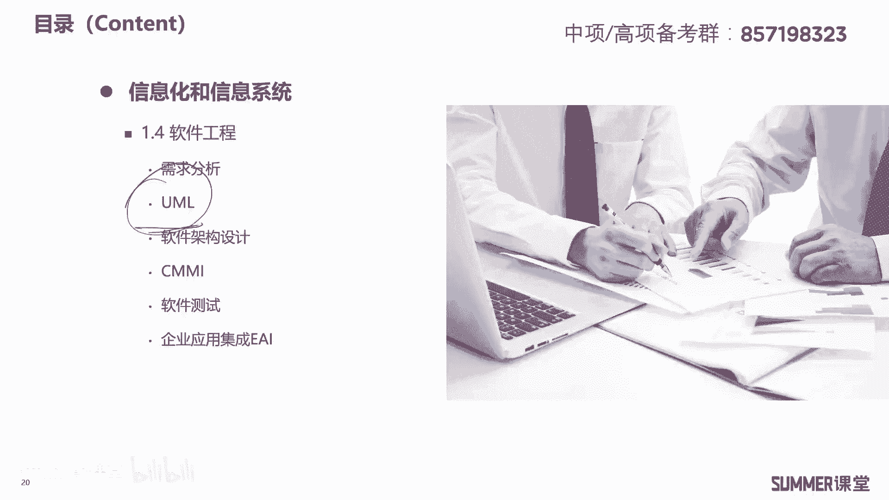

u ml它的中文翻译叫统一建模，语言建模大家都搞过吗啊，比如说像我们大学的时候会有数学建模是吧，数学建模会用一个工具叫什么matlab，而我们程序开发里面用来建模的就是u ml啊。

这是一个支持模型化和软件系统开发的，图形化语言，图形化语言为软件开发的所有阶段，提供模型化和可视化的支持，是一种标准的建模方法，它是一种图形化的建模语言，而不是编程语言。

它跟我们的c加加java区别很大啊，用u m l l你最后建模出来的是一些图形拓扑，但是用java c加加写出来的都是代码，它们的产物是不一样的，区别很大，所以你一定要区分开来。

uml它肯定不是编程语言啊，比较适合用在迭代式开发的过程当中，需要注意迭代式开发常用u m l o然，u ml的结构包括三个东西啊，哪三个东西构造块规则和公共机制，这三个把它作为记忆的知识点。

三个或者四个的是非常容易考到选择题的，u ml具有如下的几个特点，第一统一的标准啊，已经被o m g这个组织接受为标准建模语言，它有统一的标准，面向对象啊，支持面向对象的开发可视化啊。

它的表示能力比较强，是图形化的，我们待会儿会给大家去看几个u m，u m l的图啊，它是图形化的，独立于开发过程，可以适用于不同的软件过程，概念明确表示简洁，结构清晰，易于学习掌握啊。

说实话反正我觉得他不太易于学习掌握，我记得当时我考试之前，反正u ml的14种图，我是从来就没把它给整明白过啊，我们也不要求大家把它整得多明白，会做题就行是吧，也不是会做百分之百的题。

至少百分之六七十七八十的题，你会做，那效果就已经达到了啊，这种这种题，这种知识点对大家的要求绝对不是百分之百啊。

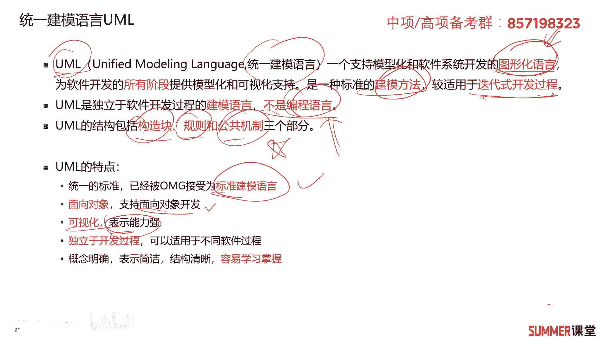

不然性价比就太低了是吧，ok我们来看u ml的四种关系啊，哪四种关系呢，依赖关联泛化和实现啊，u m m l有四种关系啊，这四种关系来给大家去解读一下，第一个是依赖，比如说有两个类。

如果b的变化可能会引起a的变化，那么就称la依赖于内壁啊，他们是依赖关系啊，简单的一个案例，人要过河需要借用一条船，此时人与船之间的关系就是依赖关系，人依赖于船去过河嘛，对吧啊，这就是依赖关系啊。

关联关系呢啊关联关系啊，其实里面有两两类关系哈，第一个是聚合，第二类是组合，聚合是整体与部分的关系，它是可以分割的啊，举个例子，比如说燕群和大雁之间，他们有关联，但是他们是可以分割的。

而关联关系里面还有一类特殊的叫组合关系，组合关系是整体与部分不可分割，比如说大雁和大雁的翅膀和翅膀，他们就是组合关系不能分割，分割的话就意味着生命周期的结束啊，把大雁的翅膀给拆了，那肯定就挂了呗是吧。

这是关联关系，需要注意，需要注意的就是里面的这两类特殊的关系，泛化泛化我们前面讲过吧啊，讲什么的时候讲过，讲继承的时候讲过对吧，我的父子类继承父类的一些特性，然后我多个子类是不是可以泛化出互那个父类。

啊，啊你理解了继承肯定就能够理解泛化，一个是从上往下，一个是从下往上，正好是相反的关系，所以这里面我们就不多讲了，实现关系啊，实现关系是一种类与接口的关系，表示类是接口所有特性和行为的实现接口。

我们要访问这个类是通过接口来访问的是吧，然后这个类啊就是接口它所有功能的实现啊，也也是充电宝的例子嘛，是吧啊，充电宝的例子，然后你要使用充电宝，你通过一个接口就行了，然后里面的一些功能。

是不是都是由充电宝本身这个本体来实现的呀，了解一下就行了啊，了解还有一个案例，比如说我们的iphone x，iphone叉s都是智能手机的实现好吧，关于u ml的四种关系，首先你要知道有哪四种啊。

有哪四种，第二这四种关系它里面的含义简单了解啊，能理解最好，如果实在不理解，那就算了啊，你就把这四个给我记住啊，这就是对大家基本的要求，而且你还要知道有两个特殊的聚合和组合啊，一个是可分割。

一个是不可分割，好吧啊。

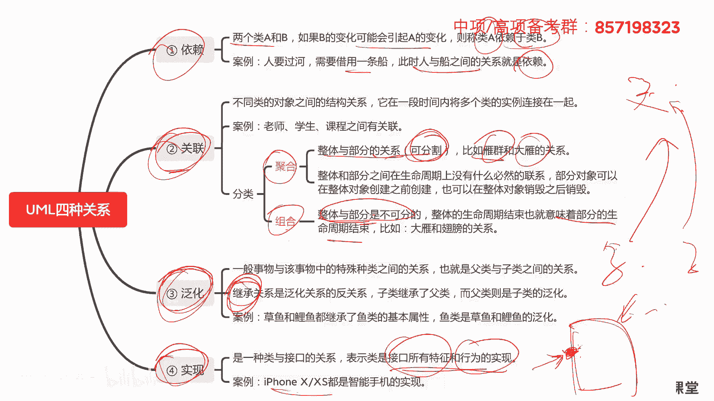

就是这样最基本的一个要求，接着啊，我们为了让大家更方便的，更好的理解这几种关系啊，下面给了一个示例哈啊比如说动物这个类，它是不是依赖水和空气的呀，没有水和空气，动物就活不了嘛对吧。

然后动物你可以分出鸟这个类来，相当于鸟是不是动物，它它可以继承动物这个类啊，我们往反方向来说，就是鸟类是不是可以泛化出动物啊，鸟类可以泛化出动物，鸟类继承了动物的特性，然后大雁鸭子。

企鹅它都继承了鸟的一些特性，那我们往反方向回去，是不是就是泛化了呀啊就是大雁鸭子，然后企鹅它都可以泛化出鸟类啊，泛化出鸟类，也就说诶鸭子怎么是鸟啊，嗯你就别去纠结了哈。

你就你换一个也行吗哈换一个天鹅是吧，企鹅好像也不是鸟，但是它是一个大的类嘛，跟鸟其实差不多对吧，基因你说是不是鸟啊，还还跟还是跟鸟差不多啊，至少一些基本特性，鸟的基本特性它都有我们下面的这些子类。

它可以继承鸟父类的很多特性，然后返回去就是泛化了啊，下面的子类可以泛化出，上面的互那个父类来对吧，然后大燕跟燕青的关系是聚合的关系，然后大雁跟跟翅膀的关系应该是组合的关系，这跟翅膀是组合的关系。

鸟跟翅膀也是组合的关系吗，是你要没有没有了翅膀，那就挂了o啊，接着还有什么企鹅跟气候有关联关系啊，有关联关系，然后大雁跟飞翔，这是实现的关系啊，这是实现的关系，针对这些关系啊，了解一下啊。

如果你实在不理解，那就算了啊，当然理解能理解最好啊。

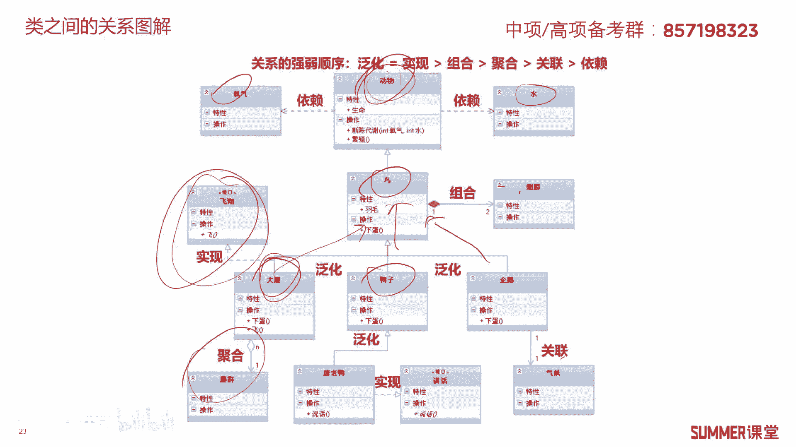

能理解最好，ok接着啊，u ml的14种图啊，14种图啊，这又是非常不好整的一个知识点，是要让你们全部理解啊，不现实，我很明显很明确告诉大家，如果你不是搞软件开发的，你想把这14种图整明白。

你需要花特别多的时间，而且可能你还整不明白，我对大家的要求也不高啊，对大家的要求也不高，你需要掌握到什么程度。

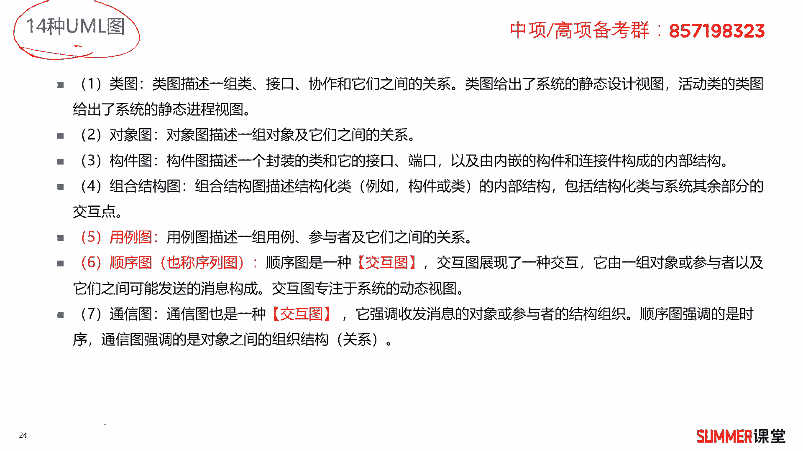

第一你把这14种图你给我好好的读一遍啊，读几遍吧对吧。

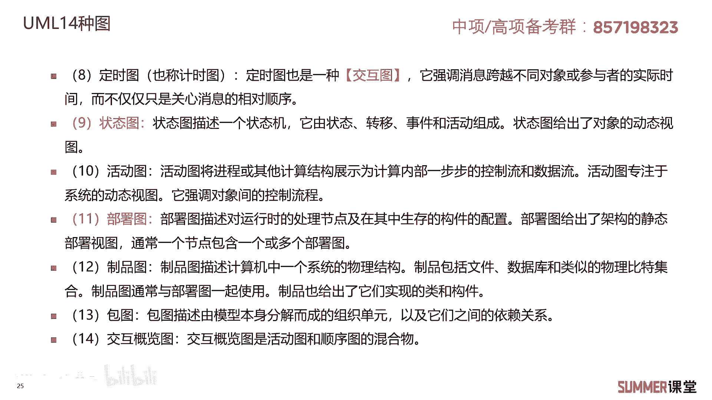

有哪些图啊，比如我还是给大家读一下，而类图对象图，构建图。

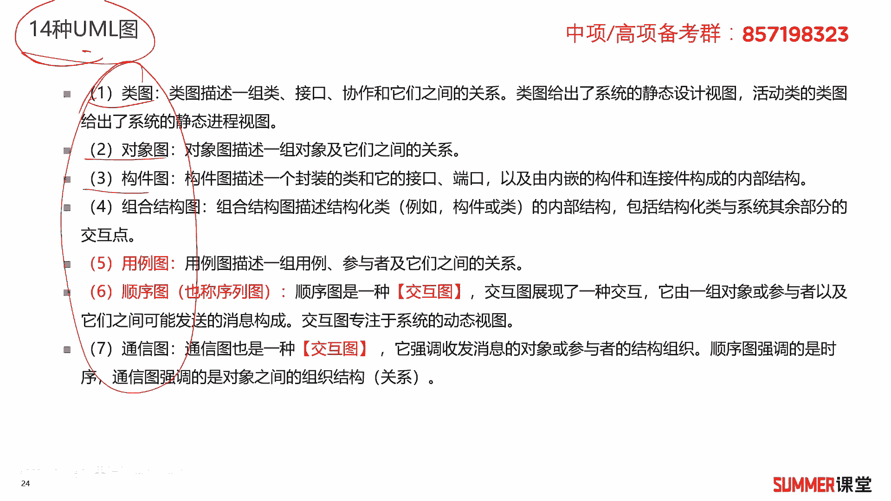

组合结构图，用例图，顺序图，通信图，定时图，状态图，活动图，部署图，制品图包图，还有交互概览图啊，这14种图你给我好好的读一下，比较熟啊，比较熟啊，也不用背下来，也不用背下来好吧。

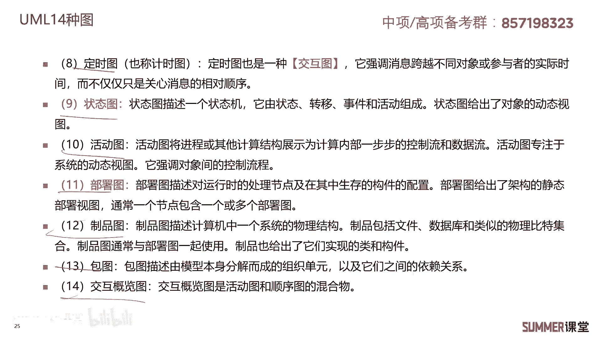

这是第一个要求，第二个要求就是哪些图是交互图啊，有三个顺序图。

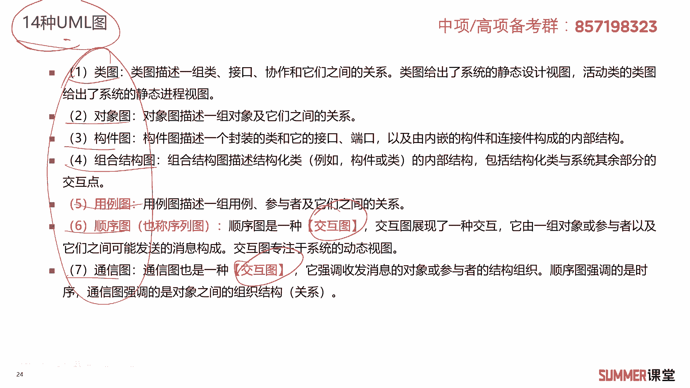

通信图还有定时图，它们是交互图，考试有些时候就问你诶，哪些图是交互图啊，你要知道啊，或者他问你哪一个不是交互图啊，这是第二个第二种考法啊。

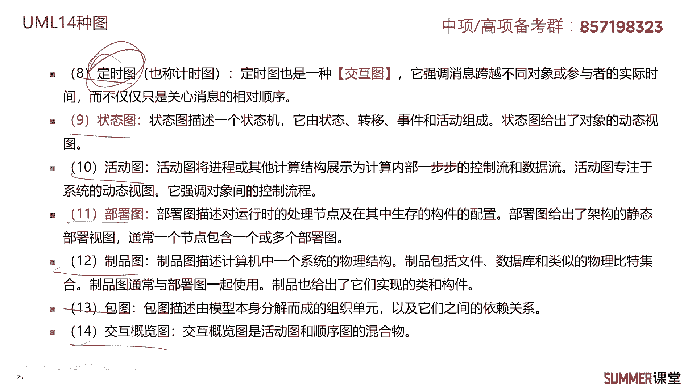

第二种考法，第三种考法可能要难一点了啊，就是他给你写出后面的它的描述定义，问你诶，这是说的什么图啊，这一块儿就要稍微难一些是吧啊，不做要求，建议大家下来把它的定义你看一下，能理解就理解，理解不了。

那就算了，看一下熟悉一下就行了，如果真的考到你，那实在不会点名点将啊，25%的正确率是吧啊，因为这个东西的确不太好啊，不太好弄啊。

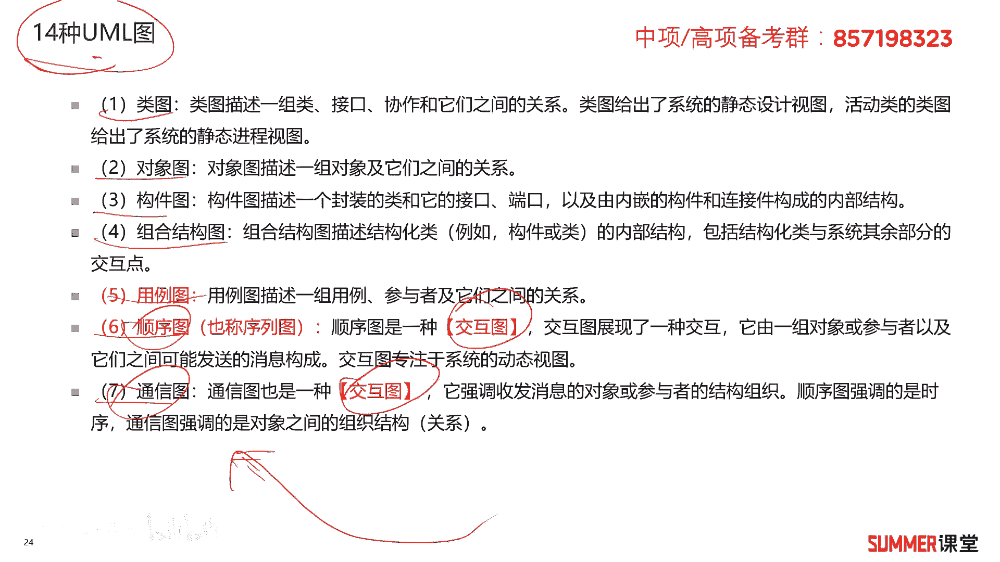

不太好弄好吧，这第三种考法，第四种考法就给你画个图出来，问你这是什么图啊，如果如果让你掌握14种图可能头大，但是我把比较常考的四种给大家画出来了，你掌握四种就行了啊，其他的也不是说不考。

那考到了算一道没是吧啊，因为这块的知识点我觉得性价比不高啊，没有必要把这14种全部掌握，而且从最近几年的考试来看啊，反正最近几次都没有考ua ua ml是吧啊，掌握到这种程度就够了哈啊，第一个状态图。

它显示的是各个状态之间的一个转换啊，比如说上面给的例子是一个图书馆管理系统啊，它的一个状态图，你看一可能他状态是未注册，你注册图书的状态是不可僭越，可借越，未还未欠未欠款。

然后一欠款不同状态之间它有一个转换关系，ok状状态图，第二个是部署图，是不是跟我们平时说的网络拓扑图比较类似啊，啊这边是正外网啊，这边是互联网，然后有各种各样的服务器，有交换机，这些怎么把它互联起来了。

这叫部署图，给你一张网络拓扑图，其它也是部署图，下面一个有小人的啊，有这个圆框框的，它是用力图啊，右边顺序图有小人，然后有这种横线，有竖线有横线有竖线的，就是顺序图，掌握这四种图就差不多了啊。

其他的图啊，暂时先不用不用管啊。

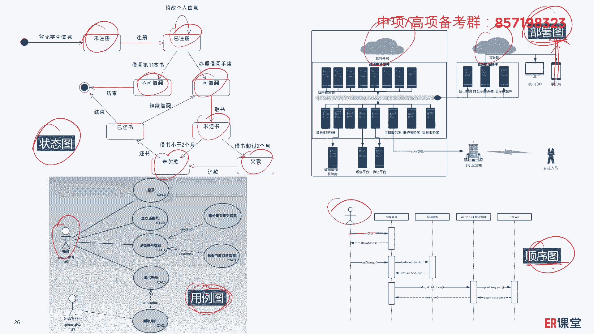

先不用管好吧，我们下面来看几道题，2018年5月第26题，关于u ml的描述不正确的是哪一个，a u ml是一种可视化的编程语言，一看的编程语言，那肯定错的呀是吧，那直接选a，那不用看了。

他不是编程语言，它是建模语言，好接着2018年5月的第27题，u m l的图不包括哪一个啊，有用例图，序列图，组件图，没有继承图，选择d答案，2018年11月第21题，u ml的什么图。

描述了一个特定对象的所有可能的状态，以及由于各种事件的发生而引起，状态之间的转移，是不是状态图，我给大家讲的是哪个例子啊，图书馆管理系统的那个例子是吧，不同的状态他们之间怎么转换的，肯定是状态图。

2019年5月第25题，执行者与用力之间的关系是什么啊，这道题可能要稍微偏一点啊，这道题要偏一点，是关联关系啊，来自于哪儿呢啊，来自于哪u ml它的四种关系啊，这四种关系需要注意一下啊，就在用例图当中。

有一句话叫执行者与用力之间进行交互，相互之间的关系是用一根直线来表示，称为关联关系啊，称为关联关系，这块了解就行了，我觉得考的太细了。

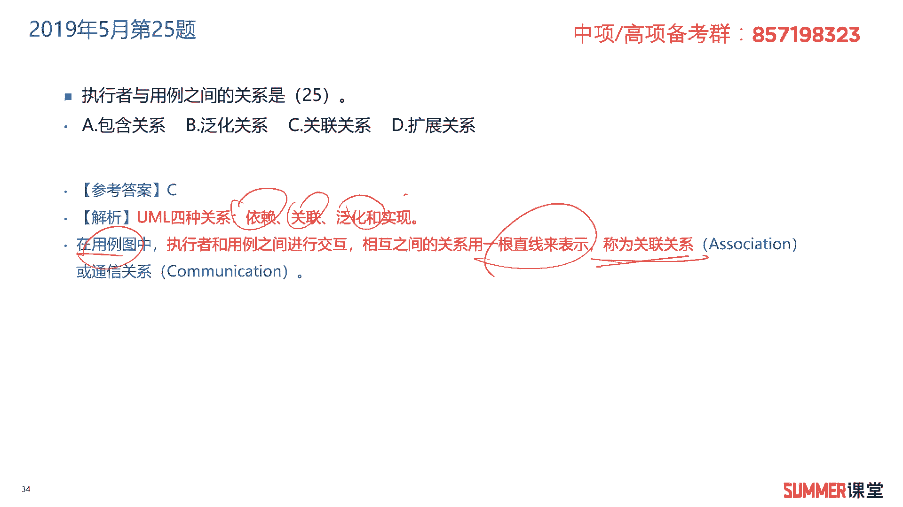

一般人肯定是不会的啊，肯定是不会的啊，另外刚刚给大家说的u ml的这四种关系。

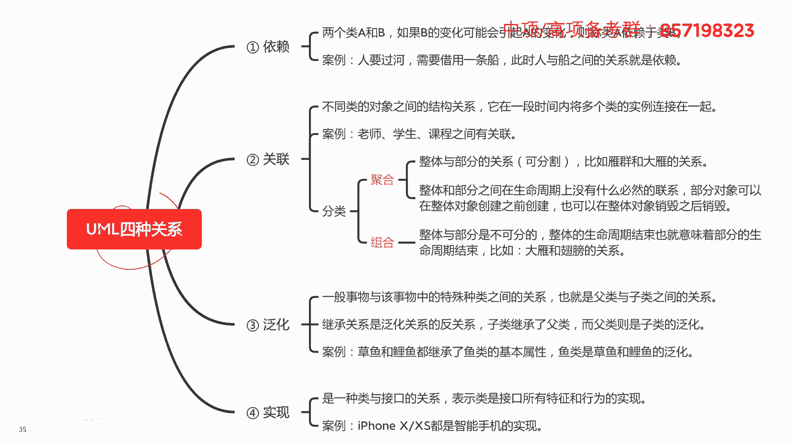

需要注意一下啊。