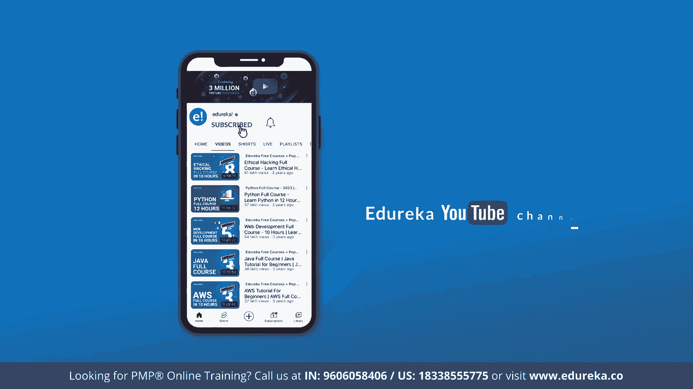
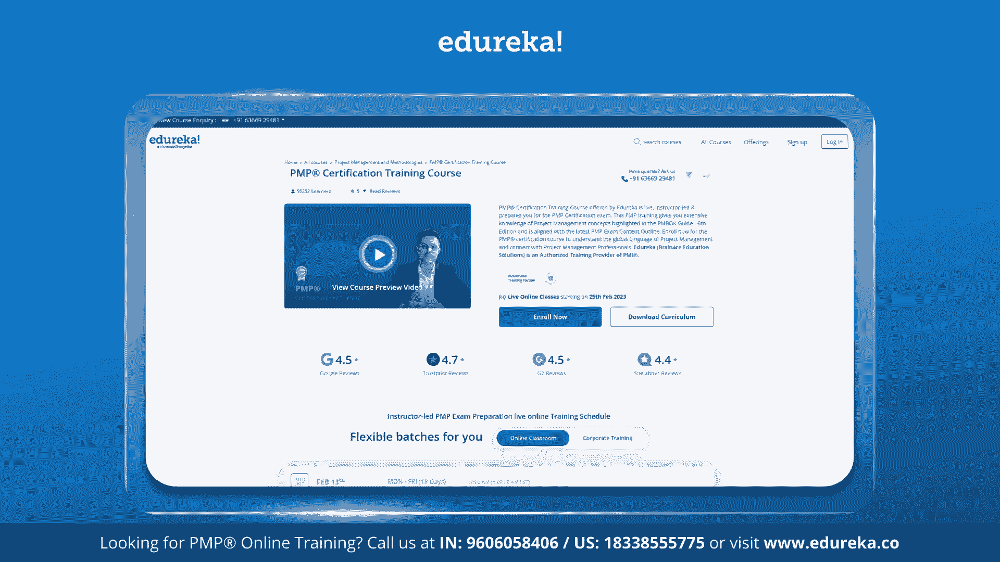
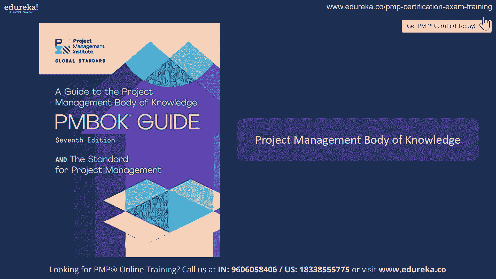
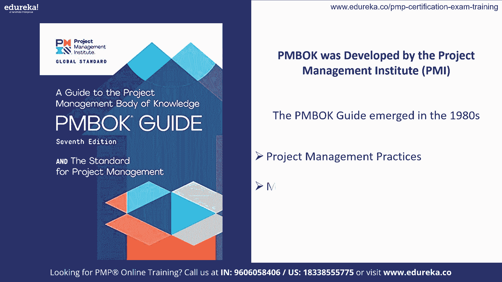
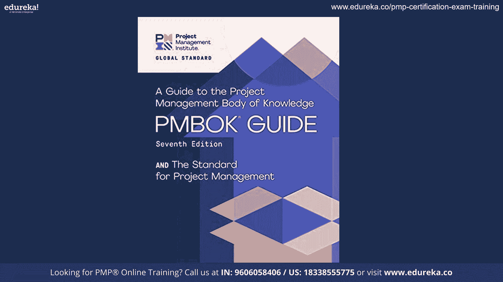
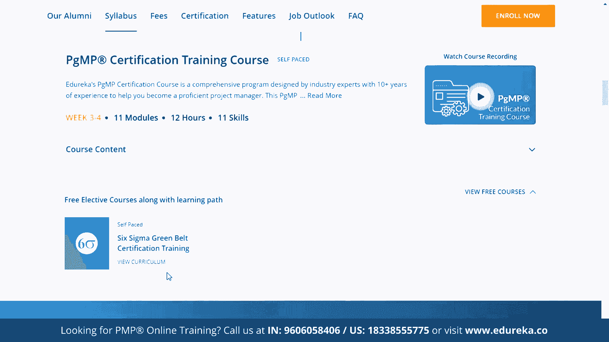
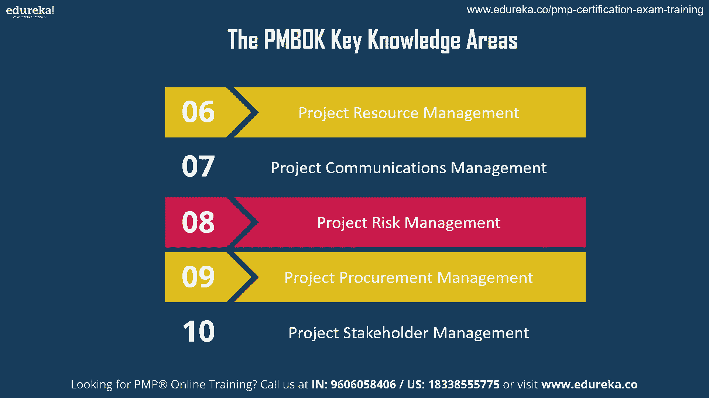
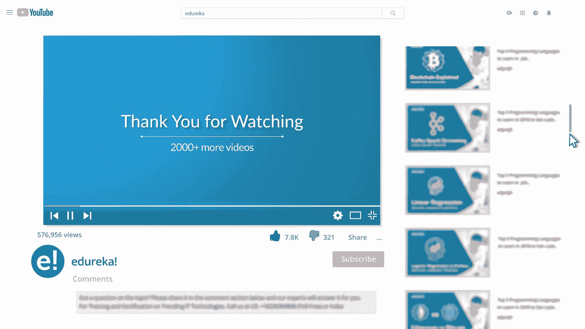
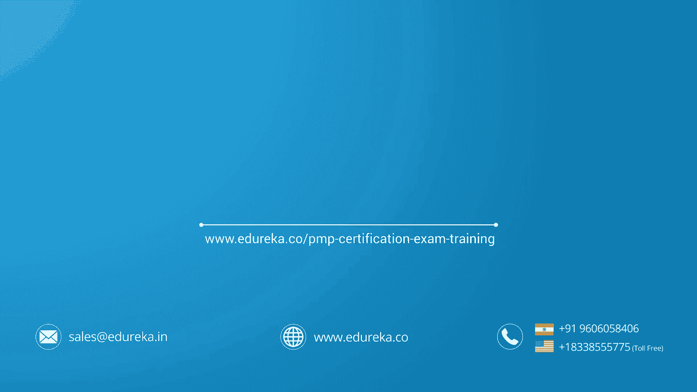

# 2024.01.11 【edureka!】PMBOK第7版教程｜PMBOK第7版讲解｜PMP认证培训｜Edureka - P1：edureka!@20240111 - 我叫阿搬 - BV1zx4y1Z7Fg

首相没事，它代表项目管理知识体系，至关重要，因为它为有效的项目管理提供了标准化框架和最佳实践，它的意义在于提供一个全面的指南，促进有效的规划，项目的执行和控制，最终导致成功的结果，嘿。

欢迎来到下午图书第七版的会议，在本届会议上，我们将探索PM书中涵盖的关键知识领域，紧随其后的是第七版中引入的主要更新和变化，并突出PM书第七版中的关键区别，但在我们开始之前。

请考虑订阅我们的YouTube频道，点击Bell图标以保持Edureka最新内容的更新。

也看看Edureka的PMP认证培训课程，在项目管理方面得到全球认可，我们的石灰教练领导的培训封面，项目管理指南第七版中的关键项目管理概念，与最新的PMP考试内容大纲保持一致。

并跑出去学习项目管理的通用语言。

项目管理知识体系，是一个全面的指南，概述了项目管理的基本实践和原则，它是项目经理的基本参考，世界各地的从业人员和组织，提供一个有效管理跨行业和部门项目的框架。

PM书是由项目管理研究所开发的，随着时间的推移，PO指南最初出现在20世纪80年代，它经历了几次修订和更新，反映项目管理实践不断变化的情况。

PM图书标准的演变可以通过它的各种版本来追溯，每一版都融入了新的见解，全球项目管理专业人员的方法和反馈，因为项目管理本身，PM BOK已经扩展到包括更广泛的项目管理知识，工具和技术。

这个现代版本结合了项目管理标准和PM图书指南，提出项目管理的两个原则和对成功的项目结果至关重要的八个绩效领域。

也可以查看由工业出口设计的Edureka项目管理硕士程序，提供完整的项目管理教育，一系列课程让你赚60多英镑，保持PMI认证活跃，同时在你的学习旅程中给你灵活性，这个项目帮助您获得跨领域的专业知识。

成为一个认证的项目管理专业人员，现在就加入我们的项目管理培训，提高你的技能。

让我们通过PM图书指南涵盖的关键知识领域，PM图书指南通常涵盖成功项目管理所必需的关键知识领域，包括项目集成管理，它协调和整合了各种项目要素，项目范围管理，它有助于定义，管理和控制项目。

然后是项目进度管理，它有助于规划，计划和控制项目时间表，之后我们有项目成本管理，它有助于估计预算和控制项目成本，然后我们有工程质量管理，有助于确保项目交付符合质量标准，下一个关键领域是项目资源管理。

它有助于管理项目的人力和物力资源，项目沟通管理，它有助于有效地处理项目沟通，下一个关键领域是项目风险管理，它有助于识别，分析和降低项目风险，然后是项目采购管理，为项目采购货物和服务，最后。

我们有项目利益相关者管理，它有助于管理与项目涉众的关系，现在让我们继续理解什么是PO指南PM图书指南。

第七版与前一版相比，在方法上有了重大转变，与以前的版本不同，以前的版本侧重于处理器和知识领域，第七版强调原则性项目管理，它旨在提供一个灵活的框架，适应各种项目类型，方法和方针。

现在让我们来讨论第七版中的主要更新和变化，第一次更新是以主体为中心的方法，第七版介绍了构成成功项目管理基础的两个原则，这一原则指导从业者决策，并在整个项目生命周期中导航复杂性，与以前的版本不同。

以前的版本遵循了更多的视角连根拔起，第七版强调讲述项目管理实践的重要性，基于项目的独特性，背景和需要，它承认，在项目管理中不能一刀切，然后我们有领域而不是知识领域。

以前版本中的知识领域已被性能领域所取代，他们是利益相关者，团队和资源管理，生命周期管理，项目规划，交付和控制，测量，性能和价值，然后治理，最后是复杂性和不确定性，下一个更新是包含敏捷和混合方法。

第七版更明确地集成了敏捷和混合方法，它，更多地关注迭代和适应性方法在现代项目管理实践中的重要性，注重价值交付，强调在整个项目生命周期中交付价值，与组织目标保持一致，确保项目有助于战略目标。

然后我们更新了内容和术语，语言和术语已经修订和更新，以符合当前的行业做法，并提高清晰度和对数字化转型和技术的理解，第七版承认技术和数字化转型在现代项目中的作用，它讨论了技术如何影响项目管理实践和结果。

强调领导才能，强调了项目经理领导能力和人际交往能力的重要性，认识到他们在推动项目成功方面的作用，PM图书标准是由各种因素和原则形成的，确保项目管理有一个全面和有效的框架，几个关键组成部分及主要影响。

PO指南中提供的指南包括行业最佳实践，应付标准以既定的行业最佳做法为依据，它们结合了从各部门和行业成功的项目管理方法中吸取的见解和教训，全球投入和专门知识。

这些电路是在各种项目管理专业人员的投入下开发的，从业人员，来自世界各地的学者和专家，这种合作确保准则考虑到项目管理方面的不同观点和经验，PBook标准不断改进和更新，以反映新出现的趋势。

项目管理领域的技术进步和涉及实践，这一原则确保了准则的相关性和最新性，然后我们有灵活性和适应性，同行书籍研究认识到项目管理需要灵活性和适应性，它们提供了一个可以定制并应用于各种项目类型的框架，尺寸。

复杂性和行业，这种适应性允许实践者定制方法以适应特定的项目需求，与组织目标保持一致，准则强调统一项目管理做法的重要性，具有组织战略目标和目的，这种协调确保项目有助于各组织的总体成功和目标。

基于原则的方法，首相，图书标准以一套原则为指导，作为有效项目管理的基本价值，这些原则包括问责制等方面，廉正，透明度，利益攸关方的参与和持续改进，知识领域的整合，PM书籍开始整合各种知识领域，包括范围。

时间，成本，他们强调这些领域的相互联系，以及它们如何对整个项目的成功做出贡献，最后我们强调职业道德，准则强调项目管理中道德行为和专业行为的重要性，他们强调坚持道德标准，项目管理中的廉正和责任。

与利益相关者互动，这些组成部分和原则共同塑造了PO指南，为项目经理和实践者提供一个全面和标准的框架，以有效地规划，执行，监视器，控制和关闭项目，同时遵守业界公认的标准和最佳实践。

现在让我们先了解一下PM书第七版中的关键区别，基于方法，第六版，它强调基于过程的方法，而在第七版中，它转向了基于原则的方法，第六版围绕十个知识领域展开，范围，时间和成本，而第七版被组织成一个表演领域。

关注更广泛的方面，如利益相关者管理，下一个治理和价值交付，基于灵活性和剪裁，第六版有一个更有视角的方法，鉴于，在第七版中，ATS为基于项目上下文的项目管理方法提供了更大的灵活性。

需要第六版简要介绍敏捷方法，而第七版更明确地集成了敏捷和混合方法论，认识到它们在现代项目管理中的重要性，第六版侧重于项目交付成果和过程，第七版非常强调在整个项目生命周期中交付价值。

使项目与战略目标保持一致，我们就这样结束了本届会议，我希望你喜欢这个视频，如果你真的喜欢并订阅了我们的YouTube频道。

感谢观看不断学习，我希望你喜欢听这个视频。

请给我点个赞，你可以评论你的任何疑问和疑问，我们会尽快回复他们的，请注意我们播放列表中的更多视频。

