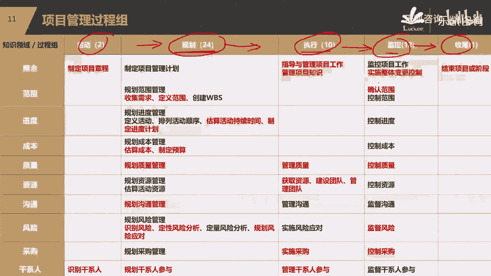
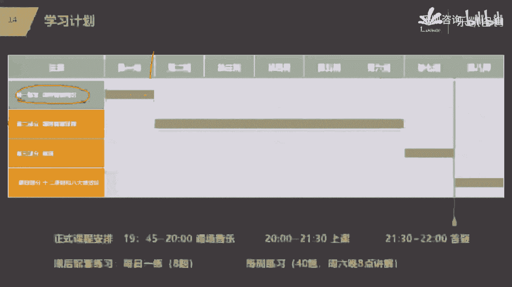
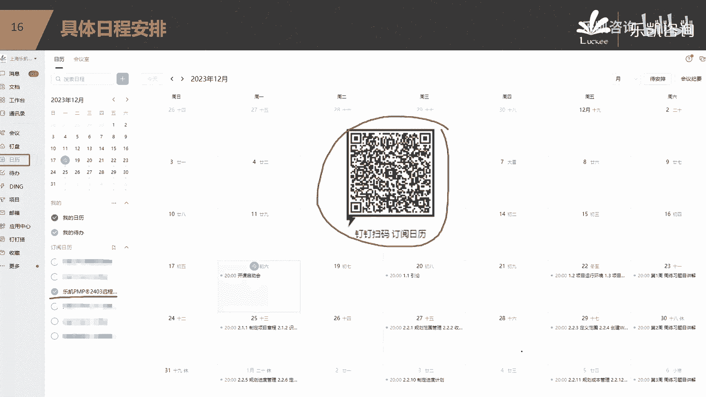
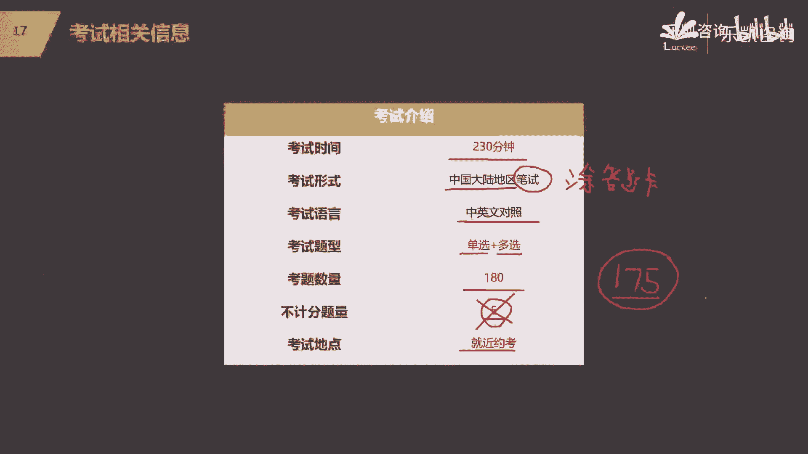
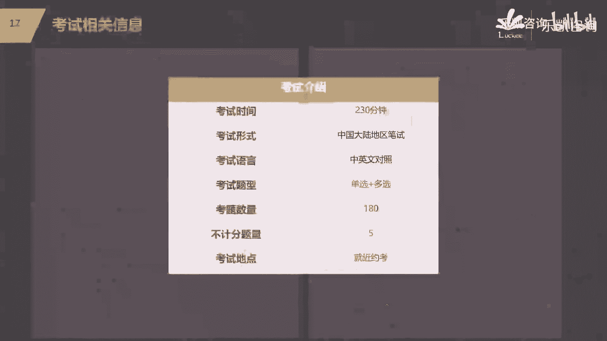
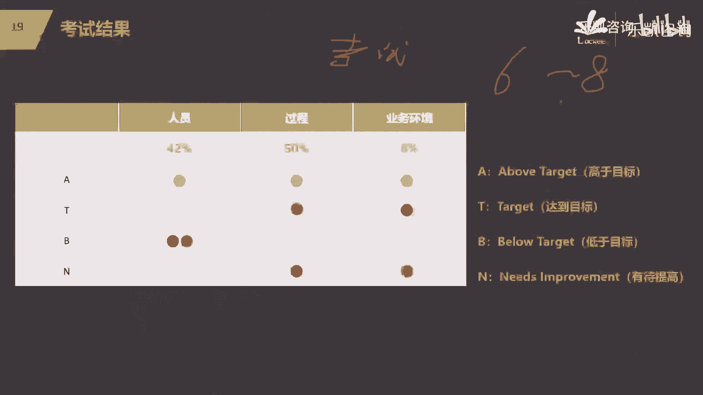
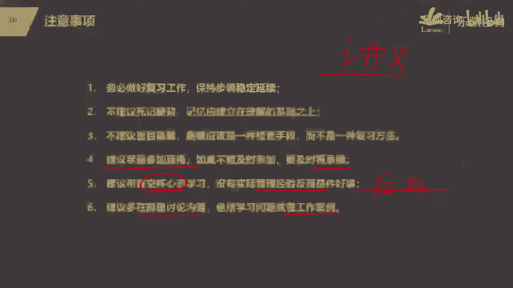

# 2024PMP不再难懂：一站式解决所有PMP问题，学习PMP的终极指南！ - P1 - 乐凯咨询 - BV1gK4y1z7pd

好各位同学大家好，欢迎大家来参加，我们这个2004年3月份班的启动课，好吧，那么我是乐凯的讲师，我是J，那么今天晚上呢跟大家来举行一个启动课，其实有两个目的，第一个目的是让大家去熟悉这个钉钉的使用啊。

因为我刚刚在钉钉群里面看到，有很多同学不知道直播是什么形式啊，什么地方看直播对吧，所以我们需要一个启动课，来帮助大家来过渡一下，那么这是第一个目的，那么第二个目的呢，今天呢其实不讲什么啊。

正式的课程的内容，那么第二个目的是跟大家介绍一下PMP，然后跟大家说一下，在接下来的这段时间里面，我们的一个学习的计划是什么啊，包括我们通过这次培训，我们应该能够达到什么样的一个目标。

以及我们最后要参加考试，那么在整个过程当中对吧，学习和考试的过程当中，我们需要注意哪些地方好吧，所以我们今天跟大家启动课要聊的内容，大致是包括这么几点，关于PMP以及我们的培训内容，然后我们的学习计划。

学习目标，最后还得注意事项，那么首先我们聊第一个关于pp，那么大家来报名学习p mp，那么应该对PMP这门课程多多少少有一些理解，那么什么叫偏僻的，它其实是一个缩写。

它是一个缩写叫project management professional，项目管理专业人士资格认证，这个认证呢是由项目管理协会，那么我们一般简称叫PY，是由这个协会。

在全球的200多个国家和地区去推广的，也是我们目前项目管理领域里面，含金量最高的一个证书，那么大家可以到招聘网站上去搜一搜，那么一般来说招聘项目经理的，基本上都会提到这样一个政府对吧。

当然我们有同学苏慧萍提到了叫拍马屁对吧，简称拍马屁啊，这个呢也不能说完全没有道理，在我们后续学的过程当中，你会发现，其实这里面也要求项目经理具有很高的情商，很高的人际交往技能对吧。

那么也就是说这里面确实会涉及到这样一部分，好吧，那么这个证书呢，它不仅能够提升项目经理的项目管理水平，也能够体现项目经理的个人竞争力啊，那么这个证书呢大致就是这么一个情况，那么为什么这个证书。

能够在全球这么多的国家得到推广，那么很简单，因为这个证书他把项目管理里面，一些具有共性的地方把它抽出来了，所以说它面向很多的行业，那么接下来我们可以用一些数据来给大家，稍微的去看一看。

那么首先在近10年，也就是2014年到今年2023年，它的有效持证人数，每年以9。65%的速度在增加，那么一直到今年，全球持证人数已经超过了145万，那么这是全球的一个持证人数，越来越多越来越多。

现在全球已经超过了145万，那么在我们中国，大家会发现我们中国发展得很快，对吧，那么在近10年我们确实发展的速度比较快，那么很多地方他很多的项目做的也比较多，所以在很多地区，很多公司。

很多企业他们都了解到项目管理的重要性，那么我们中国的有效的执政人数，在145万里面有多少呢，截止到2023年有56万，有56万啊，这是PMI给我们的数据，那么我们可以去看一看。

那么这56万的持证人员它分布在什么地方，我们会发现它主要分布在华北的北京天津对吧，然后华华东地区的，比如说江浙沪这一带，上海啊，杭州啊，苏州啊，南京等等对吧，那么华南地区的深圳，广州。

华中地区的武汉对吧，西南地区的成都，那么你们会发现这些地方都是什么地方，其实都是发展的比较快，项目比较多的一些地方对吧，那么这些持证人员他又属于哪些行业呢，啊我们可以去通过PMI的数据去了解一下。

那么现在偏僻执政人员的top10的行业，最大的一块当然是it行业啊，就是我以前所在的行业，那么除了it行业以外，其实你会发现现在我们有一个情况啊，比如说我在讲面授班的时候啊。

以前我们说我们面授班大家是来自什么行业，你会发现IG行业的人特别多，但是现在你会发现，其他行业的人也逐渐的多了起来，比如说制造业的让我印象很深刻的，比如说制造业，比如说汽车相关行业。

现在我发觉来听我们平时课程的汽车行业很多，然后还有医疗健康行业的也比较多，逐渐在增加对吧，那么为什么这么多行业的人都会来学习PMP，那为什么PMP能够涉及到各行各业，那么我们去了解一下。

我们接下来要学习的PP的培训内容，他为什么能够涉及到各行各业，好吧，那么接下来我们看一下我们在随后呢这几个月，我们PP培训会涉及到哪些内容，那么整个PMP培训我们分为了这几部分。

那么第一部分呢实际上比较简单，是项目管理的一些概论的一些定义，那么第二部分呢我们着重讲项目管理的过程中，第三部分我们会涉及到敏捷的内容，那么第四部分会涉及到原则和机效率对吧。

那么这几部分分别对应的不同的书，比如说第一部分我们引用的是PMBOK第六版，那么第二部分呢是即将推出的过程组的那本书，那么第三部分会涉及到敏捷，实践指南以及ram指南。

那么第四部分会涉及到PMBOK第七版，那么大家先了解一下这四个部分，当然不需要看那么多书，那么我们要改提供了一个讲义，以及把这几部分都整合在一起了对吧，那么在这四个部分里面比较重要的，比较重要的啊。

或者说对大家今后的工作有帮助的，大家要着重注意第二部分和第三部分，这也是我们pp培训的一个重要的内容，好吧，有同学说不是已经到第七版了吗，你要注意啊，第七版它并没有取代第六版，明白吗。

第七版和第六版是共存的，是共存的好吧，那么比较重要的是第二部分和第三部分，这也是我们培训的一个核心的内容，那么接下来我给大家介绍一下，那么这两部分分别在讲什么，好吧好，那么第二部分。

我们主要讲的是预测的项目是怎么管的，我们会讲到五大过程中，那么我会说一个项目我们要去管理，会经历哪几个过程组呢，比如说首先我们要启动这个项目，那么启动这个项目接下来干什么呢，啊我们启动了立项了之后。

我们要做很多的计划，要做计划，那么做完了计划之后，接下来我们要根据计划去执行，那么在这里我想问大家一个问题，在执行的时候，我们会得到一些实际的情况对吧，那么计划是计划，我们真正做的是实际。

那么实际跟计划去比较，我们就会发现什么问题，这个我们做过项目的同学应该有这个感觉对吧，而我们定了一个计划，按这个计划去执行，结果当我们真正做了之后，我把实际的情况跟计划去比，你就会发现有什么问题。

可能会发现我们的进度慢了，可能会发现我们的成本超了对了，也就是我们有同学说的会出现偏差对吧，那么这样一个过程实际上是什么，也就是说我们要不断的去监控，我们有没有偏离计划对吧，那么如果有偏离。

我们可能要交偏，甚至有可能有同学说我会遇到一些变化对吧，那么说到这里，我想问一下大家，既然有同学说到变化，我们有一句俗话叫计划赶不上变化对吧，那么遇到变化应该怎么办呢，好我们在里面讲的时候会说。

如果遇到变化，我们要根据变化可能要去调整我们的计划对吧，然后再按照新的计划去执行，去监控，那么一直到什么时候，一直到整个项目做完，我们要收尾，把这个项目收尾收掉。

那么这是我们第二部分的过程组着重讲的内容，也叫五大过程组，那个五大过程组里面涉及的这些过程呢，我们从另外一个维度来说，也可以把它从另外一个维度分成十大知识领域，那么十大知识领域他会说什么，他会说到。

比如说范围范围这些过程他会讲什么呢，我们这个项目要做什么，我这个项目究竟要做什么，对吧好，那么做什么，明确了之后，接下来我就可以大致的去估一估，那么做这些东西要做多久呢，这就是我们很多项目经理会遇到的。

我们要干什么，要排工期对吧，因为你做的东西知道了，那么接下来就要排广西，我就知道这个项目要做多久，那么进度就出来了对吧，那么工期排好了，安排了人员之后，那么接下来我就能估出来，这个项目大概要花多少。

花多少，什么花多少成本，那么这就是我们在项目中比较核心的，或者说啊比较重要的叫范围进度成本，简称也叫放进程好，那么我问一下大家，不管是第一次学的，还是有项目管理经验的。

大家知道为什么我们一般在做项目的时候，会说范进成这样一个顺序吗，虽然说范围再说进度，再说成本，为什么，因为从我刚刚的描述，大家应该会体会到，你只有知道了做什么，你才能够估出来要做多久。

才能够算出来要花多少对吧，也就是说范围它决定了进度，而通过进度又可以进一步估出成本对吧好，那么范进程接下来是什么，接下来PP里面还讲了，要关注质量，那么质量很明显，要防缺陷，质量重不重要，当然重要。

质量做的不好，会给我们公司带来很多负面的影响对吧，那么说到质量大家要注意，有一个地方可能跟大家想的不一样，因为说到这点呢，大家永远会想到那些比较常见的，比如说什么手段呢，检查测试对吧，那么大家要注意。

我们的质量是真的通过检查和测试得到的吗，好那么PMP里面有一个非常重要的观点，我们在讲质量的时候会说，质量永远不是靠检查和测试得到的，检查和测试他是在干什么呢，他是在查结果。

哎我们有同学这个可能做过一些项目，了解到这个东西叫控制质量，查结果叫QC，而质量更重要的是什么，是要重视过程，也就是我们说的QA管理质量对吧，那么这个是我们在讲质量的时候会着重去强调，会着重强调的。

你只要有一个好的过程，而且你按照这个过程遵守过程的流程，政策和程序，那么你做出来的质量就不会有太大的问题对吧，那么比较典型的一个例子，大家应该会发现，包括我以前去企业里面去讲，也会说到这个例子。

你会发现肯德基麦当劳在全国有这么多家门店，为什么他们每一家店做出来的东西，味道都差不多对吧，那质量都差不多，为什么，因为它有标准化的流程，是这个道理吧，那么我们在后续讲质量的时候，会着重的去强调。

大家一定要重视过程对吧，有一个好的过程才有一个好的结果，那么当然还包括资源，那么在我们项目管理里面，资源还包括人力资源和实物资源，那么当然资源这一块我们着重强调什么呢，跟人有关的，也就是人力资源的管理。

也就是我们怎么去带团队，那我们怎么去获取一些资源，怎么去把他们建设成一个团队，如果团队出现一些冲突，我们怎么去管理团队是吧，那么随着我们现在团队的年轻化，我们很多项目经理会发现团队不好管呐。

管人永远是很难的，那么这里面就涉及到很多的技巧，涉及到很多的一些工具，那么大家可以去深入的去了解啊，大致我们应该用什么手段去获取资源，怎么样去建设团队对吧，那么当然还包括沟通。

沟通就是指在整个做项目的过程中，我们怎么去传信息，哎我们怎么去开会，怎么去写报告对吧，包括风险，那么我们做项目都会有很多的风险，那么风险它是什么，它是很多的不确定的事情，他是不确定的啊。

我们俗话说有钱难买，早知道你要管风险，那怎么办，那么我们要有风险的，一条一条一条管理的这个路子，去好好的去管理它，对吧好，那么另外还有采购，我们在做项目的时候，有些东西我们是不生产的。

那么我们可能要去找供应商去采购，那么这里面在整个采购过程中，就会涉及到招投标，那么这里面就会给我们介绍，我们作为甲方怎么去写招标文件对吧，怎么去评标，怎么去选定供应商，怎么去管理供应商对吧。

那么最后还有干系人，那么什么叫干系人呢，干系人就是跟我们项目有关的任何人对吧，那么我们为什么要去管理干系人，因为项目是给人做的，最后也是给别人去用的对吧，所以人是非常重要的。

那么什么样的项目是一个比较好的项目，你搞定了所有的人，这就是一个好的项目，明白吧，那么从另外一个维度来说，它又分为这几个知识领域去讲，那么当然还有一个叫整合知识领域，就是把这些东西要整合在一起去管理好。

我问大家一个问题啊，我们刚刚介绍了其他的几个方面，那么为什么最终要把它整合在一起去管理呢，因为很简单，他们相互之间是有影响的，是有制约的，比如说你范围要做的多，必然就会影响什么，必然就会影响进度。

影响成本对吧，你进度要做的快，那么你的范围就不能够多，你的投入的成本可能就比较高，你要投入大量的人力是吧，所以说这几方面之间它一定是相互制约，相互影响的，我们需要去干什么，我们需要去平衡管理是吧。

所以他最终还需要整合，那么这是我们第二部分比较重要的啊，固存储的这一块，那么当然我们在正式讲课的时候，是按照启动规划，执行监控收尾，这样的一个顺序来给大家做一个讲解好吧。

那么你会发现第二部分它的核心是什么呢，它的核心是我们做项目首先要有计划，然后根据计划去执行，去监控，最终把这个项目做完，所以第二部分的管理过程组好，刚刚武警同学说。

怎么好像跟我之前学的一门课程叫系统集成，项目管理师里面的差不多啊，不是差不多，基本上一模一样，为什么呢，这里我给你说一下，因为你学的软考。

我们中国的软考，软考里面的五大过程组是哪来的，是照抄的pp的，明白了，所以五大过程组这一块，实际上就是你们当时一门课程里面的，五大过程组一模一样的，因为他把p mp的这一块翻过去了，好吧。

那么你会发现第二部比较重要的是，我们要有计划，然后按照计划去驱动，所以我们把第二部叫计划驱动型的项目管理，计划驱动平台，那么我问一下大家，我们在平时做项目，或者我们在平时看别人做项目的时候。

有没有一些项目是没有办法做出计划的，那也就是说，这个如果叫我们一些事情是可以预测的，是可以做计划的，那么有没有项目是没有办法做计划的呢，也有的，比如说什么项目创新的项目对吧，哎这个项目从来没搞过。

这个市场上没有，我们是第一家对吧，那么这个东西怎么用计划去驱动呢，谁也没做过呀，所以第三部分会讲另外一种管理的方式，叫敏捷的方法，敏捷的方法，那么怎么去理解敏捷和我们刚刚讲的预测，也就是计划驱动的区别。

其实很简单啊，我在上一期呢给我们的同学举过一个例子，我们大家都遇到过的，比如说我们随便举一个例子，我最近想结婚举办一场婚礼啊，为什么我想举办婚礼呢，因为当初我跟我老婆结婚的时候，没有几个朋友吧。

一直到现在搞培训这么多年了啊，我的学员太多了，好几万呢，那么这个时候我想补办一场婚礼，简单的说想收红包，那么补办一场婚礼，那肯定要找酒店啊，好那么你会发现很多人举办一场婚礼，他找酒店是怎么安排的。

很典型的计划去，它是怎么用计划驱动的，比如说我们要定好时间对吧，几月几号，然后接下来我们要定什么呢，要订婚宴对吧，一桌菜什么标准，几个凉菜，几个热菜对吧，大致多少钱的标准，酒水喝什么，抽什么烟。

喝什么饮料对吧，这些东西都是要计划定好的，什么地方，什么酒店对吧，什么标准，几个凉菜，几个热菜，然后接下来好多少人，多少桌对吧好，然后接下来时间到了之后，大家就开始参加了，那么你们来吃饭。

你是按照计划来的，不是说你想吃什么就吃什么的对吧，你要看酒店，酒店先上什么菜，再上什么菜对吧，最后上什么菜对吧，整个婚礼的流程怎么走好，到最后这个项目做完，所以他是典型的用计划来驱动。

那么我刚刚说有一些事情是没有计划的，比如说举个例子，在我们公司附近开了一家新开的家，这个东西自助餐，那么一家新开的自助餐，我要去吃，从来没去过，我肯定要摸索呀，那么你说我去掉之后怎么吃，有计划吗。

哪有什么计划呀，最多有一个粗略的计划，大致哪一天对吧，我带几个兄弟啊，我们去吃一下，那么吃自助餐怎么吃，你第一次来新开了一家自助餐，你进去了之后怎么吃呢，完全没有计划，从来没来过。

怎么你看李彦军同学跟我的习惯是一样的，他说先嗯先什么呢，先吃海鲜，对吧，先吃海鲜，为什么海鲜不贵呀，平时舍不得吃啊对吧，那在这里呢我补充说一句啊，其实先吃海鲜的海鲜还不是你要先要先要点的，先干什么呢。

按照我的经验啊，要先吃这个东西，限量的，一般限量的这个东西你先吃，他总不会错对吧，然后接下来你再再再再看，接下来还有什么，比如说海鲜啊对吧，比如说什么什么东西啊等等等等，好，然后到后面你实在吃不下了。

那么就算了对吧，米饭要吃吗，吃个毛线啊，吃什么米饭啊，好那么我问一下，请问你吃这顿饭没有计划，那么你是按照什么来驱动的，按照什么来驱动，敏捷最大的特点按照这个来驱动，按照价值来驱动，明白吗。

它是按照价值来驱动的，也就是说我们在做项目的时候，一定要做什么，先做价值最高的对吧，他没有一个计划，我们按照价值来驱动，什么东西能够给我们带来最大的价值，我们就先做什么。

那么你说有一个什么完整的一个范围吗，他没有那么做到什么时候，我们已经达成我们的目标，那么我们就不做了对吧，没有说什么东西必须要做，所以他跟我们的第二部分完全是不一样的，完全是不一样的，他是用价值来驱动。

那么王永嘉同学说，那么怎么样去衡量价值呢对吧，吃自助窗口，大家知道吗，我要给老板上一课，我当然要吃最贵的，那么实际做项目怎么来衡量这个价值，好没关系，在我们学敏捷的时候，我们会介绍很多的工具。

比如说卡农模型，比如说用莫斯科法等等方法，我们去排优先级，敏捷到非常重视优先级，所以第三部分我们会着重讲敏捷，那么敏捷我们会先学习敏捷的一些宣言，12原则，然后我们会着重去强调敏捷，实践其中的矿。

因为他是考试的重点，那么rap里面比较重要的就是3355，三个角色，三个弓箭，五个世界五大价值观，当然除了SRAM以外，我们也会提一提看板系统啊，集训编程啊等等等等对吧，那么这是敏捷的这一套好吧。

那么第二部分跟第三部分它同等重要，同等重要好吧，我们刚刚讲的重点就在第二部分，第三部分他们是一样的，在考试当中他们的比例是各占比50%，几乎是各占50%，但是敏捷呢相对来说，内容知识点没有那么多好吧。

那么这是我们的接下来培训的两个重点，那么square是敏捷里面的一个实践啊，我们在加敏捷的时候会详细的去讲，大家先不要着急好，那么接下来针对pp，我们应该用什么样的计划去学习。

给大家说一下接下来的学习计划，那么我们从这周开始，今天是星期一对吧，那么正式的课是星期三，然后星期五，那么我们每周呢一般有三天的正式的课，周一周三周五，然后周六我们会讲题好吧，那么第一周就是这一周。

我们会把第一部分讲掉，然后接下来第二部分项目管理过程，它的内容特别多，我们会放在第二周到第六周把它剪掉好吧。

然后敏捷的知识点呢它其实不多了，那么我们会在第七周把它剪掉，明白吗，很多同学会说，为什么敏捷就这么一点点啊，好你要知道啊，我们专门的敏捷的培训，你们可以去了解一下，比如说我们刚才讲的敏捷的实践RM对吧。

或者呢我们p p l p p mi也有一个认证，叫ACP，一般可以去了解一下，像这些认证单独的讲敏捷的，你知道他培训是培训多少多少时间吗，敏捷单纯的敏捷培训也就是培训的两天时间。

特别像rap这种就是两天明白吗，所以敏捷的试点并不多，他的题目很多明白吗，所以敏捷的内容它不多的，那么第七章我们会讲敏捷，那么七周讲完了之后呢，年前的任务就结束了，那么年后就是后面的第四部分。

以及我们的冲刺模拟好吧，那么我们正式的课程的安排，那么从星期三开始，那么大家要习惯，我们一般是19。45到20点，这个时间我们会放音乐，那么放音乐的目的是什么，是让大家能够调试设备啊。

比如说有没有声音啊，怎么怎么看不到PPT啊等等等等，这些在八点钟之前要把它解决掉好吧，然后接下来正式的上课，我们每一天每次上课就一个半小时，一个半小时好吧，八点到09：30，然后讲完课结束之后。

如果有什么疑问的，听不懂的，那么我会留半个小时的时间答疑，大家可以在旁边打字幕好吧，那么课程讲完了之后，课程讲完了之后啊，那么第二天会有配套的每日一练八道题，那么每周会有周练习40道题。

那么周练习我们在周六的晚上八点钟，我们会去讲解的好吧，那么我们在2月3号讲到这个位置，然后大家开始准备，过年年后我们会讲剩下来的第四部分，以及我们的冲刺模拟，那么冲刺模拟。

我们会帮大家把第二部分和第三部分进行复习，然后接下来还有几套模拟，包括解题思路对吧，那么一直到3月，一般你们3月份的考试应该是在3月下旬，上月下旬对吧，那么经过这几次模拟之后。

那么你们在3月下旬就可以顺利的去参加，偏僻的考试了，那么一般来说你按照这个节奏往下走的话，考试是不会有什么问题的好吧，那么至于具体的什么时候上什么课，那么我建议大家啊，如果现在有时间。

你就现在把手机拿出来，用钉钉去扫这个二维码，你用钉钉去扫这个二维码之后，那么你就会订阅到我们24年3月份，班的课程表的日历，那么接下来在丁丁的日历里面，就会显示所有的课程安排，而且在上课之前。

彬彬会提示你的好吧，那么就不用大家去找班主任，要那个什么PDF文档去看课表，没有那么简单对吧，现在社会已经发展到这个地步了，直接用钉钉去扫就可以了好吧，如果说这个我们有同学今天没有听到。

明天是听这个主播的，那么你也可以去扫一扫这个东西好吧，那么有同学在问考试的这个问题，比如说考试是什么形式，多久可以拿证等等等等，好，那么接下来我给大家说一下考试的相关的内容，好吧。

那么我们偏僻的考试，最终是230分钟的时间，那么具体3月份是几号考试呢，现在还没有公布对吧，那么不管怎么说，他应该是一般周六考试230分钟，那么在我们中国的大陆地区，注意不是机考，不是机考啊，是笔试。

也就是要干什么，要涂答题卡，要涂答题卡，那么如果不是在大陆地区，比如说在港澳台，在国外的我们的一些学员，那么他们是极好的，但在我们中国大陆地区，对于我们现在的大部分同学来说，要注意。

你要到考场要投答题卡的好吧，那么考试的语言它是中英文对照，有中文，有英文，明白吗，中文对照，那么考试的题型都是选择题，都是选择题，当然它分为单选题和多选题，那么一共有180道题，明白吗，有180道题。

不要你写字的都是选择题好吧，那么在180道题里面，按照考纲里面的描述呢，五道题不计分，那么也就是说只有175道题是计分的，有五道题不记分，不记分是什么意思呢，你做对了，你不拿分，做错了呢也不扣分。

那么这五道题是干什么的，那么一般我们认为这五道题是用来扩充题库的，好吧，那么整个考试什么地方考，他会让你去约考的，那么月考呢在我们全国的很多城市都有考点，那么你就就近月考，比如说我是成都的。

那么就成都考对吧，你是苏州的，就是苏州考上海的，就上海考对吧，一个省里面很多城市都有考场，而且不止一个考场，现在基本上考位是充足的，不会有什么太大的问题的好吧，那么至于月考，到时候听我们的通知。

那么到时间了，那么该约考就去约考好吧，那么接下来我们着重要说考试它是怎么评判的，怎么样决定你通过还是不通过，好吧好，175道题哎，有人说有五道题不计分，知不知道哪五道题不计分，不知道它没有特殊的标记。

那么怎么样去保证通过呢，好我们以175道题来算，按照以往的规律来说，我们通过的标准是正确率要达到60%。

也就是105要做对105道，但是这里面有一个问题啊，如果你真的做到105道做对了，有没有可能这里面有的题目对的是不计分的呢，是有可能的，所以为了保险，再加上五道，我希望大家不管是什么时候。

最起码要达到110分以上对吧，最起码要达到110分以上，那么给大家看一下，比如说那么多选和单选有没有区别，好给大家看一个例子，大家就明白了，每一道题目它是中英文对照的对吧。

那么多选和单选它有没有区别，有区别，你看左边的是单选，上面是英文，下面是中文，那么对于我们大部分同学来说，直接看中文就得了对吧，因为看中文比较舒服一点，说实话英文呢我觉得没有什么必要说，一定要去看英文。

那么右边的是多选，注意TT考试的多选有特点，第一你会明确知道这道题是多选，因为一般选项会超过四个，第二他会明确告诉你这道多选题，请你选几个，这个他是告诉你的，明白吗，在题目上他会告诉你，这是一道多选题。

而且请你选四个还是选三个，还是选两个，明白吗，他叫你选几个，你就选几个，你说我就是头铁，我就他娘的不选四个，我选三个行不行，很明显不行吗，是不是说人家都已经说到这份上了是吧，所以从这个角度来说。

它多选的难度就降低了，那么我们的正上方同学不放心，不多选，有多少道题啊，好那么一般来说多旋律基本上在五道题左右，一开始考纲改版的时候多选很多，大概有十几道题，但是从去年的年底的考试。

一直到今年的这几次考试，他多选题的题量降低了，大概是五六道题不多了好吧，那么大部分都是单选，所以说光从考试的形式来说，它的难度不大的好吧，那么接下来有同学说，那么我听说有3A啊，什么2A啊。

这个又是什么意思呢，好那么关于这个问题我再说一下好吧，这180道题它把它分为三大类，有一类呢是跟人员有关的题目，那么这一类题目占180道题的，42%，有一类呢跟过程有关的，占50%，也就是90道题。

还有盈利呢是跟业务环境有关的，占8%，它把它分成了三类好吧，那么这三类你取得不同的分数，他会给你不同的等级，等级也会有四个，那么第一个等级叫A，也就是above，他给的你做的很牛逼。

超越了大部分人高于目标对吧，那么就是A，那么第二档叫t target，你做到达到了目标还不错，第三档呢别露台给你做的不咋地，低于目标，那么最后一档呢就是做的很差，有待提高对吧。

那么比如说我们现在有一个同学，做完180道题，我发现这三类题目他人员做的很好，过程做的也很好，业务环境做的也很好，三块都拿到了A这个等级，那么他就是所谓的3A明白吗。

那么有同学说我们每一次3A的占比是多少呢，有高有低，我们一般低的时候会有多少同学拿到3A，大概有30%，30%，高的时候有多少同学拿到3A呢，我们最高的一次有60%不到，大概是53%还是57的。

我忘记了好吧，那么有同学说之前不是5A吗，对的，之前他是把它分成了五大过程组来划分题目，所以呢他有5A，现在是按照这三块来划分题目的，所以现在最好的成绩是3A，明白吧。

但是呢我希望大家不要沉迷于这个等级，因为你的成绩究竟是3A啊，还是3T啊，这只是一个等级，他其实没有实际的意义，比如说我们注意看这个同学，他最终考了1TEDEN好，还有一个同学也是考的1T1B零。

你会发现啊，绿色的这个同学我们把它称之为小绿，小绿同学通过了考试，小红同学呢挂了，知道为什么吗，成绩单掏出来都是1T1D一，为什么小绿通过了考试，有证书，小红没有通过考试。

好马上有同学发现了小红同学虽然也是一个T，但是他T在什么地方，他T在业务环境，业务环境本身题目就少，虽然你这一块做得好，但是你做正确的题目不多，他只有8%嘛对吧，而题目多的。

你看这一块他做的是B这一块做的也不好，这个字是N这块做的也不好，是B是不是，但是小绿同学呢，他T在什么地方，他T在过程说明他做对的题目比较多，所以同样的等级会有不同的结果，也就是说我强调一下啊。

最终决定你通过还是不通过的，还是看什么呢，还是看你的正确率，而不是看等级，所以等级呢其实意义不是很大好吧，那么在考完了之后，大家要注意，在考试结束之后的6~8周会出结果，PY会给你发邮件，明白吗。

那么发邮件会发你两个东西。

一个叫成绩单，一个就是你通过的就有证书，好吧好，有人说证书上会有成绩吗，你看这个证书上有成绩吗，没有成绩，只要你通过了，你就有整数，明白吗，那么另外的成绩单这里面他会有你有没有通过。

然后接下来你具体的成绩是多少，那么这里面会显示你究竟是几个A，3A还是2A对吧，还是什么什么情况，也就是说证书跟成绩当然是分开的，明白吗，那么我想说的是什么，我觉得大家呢不要沉迷于等级。

也不要沉迷于证书，这些想法都是不对的，那么接下来我想跟大家说一下啊，我每一期我都会跟大家对吧，好好的说这一点，但是每一期我估计呢听进去的人不多，后来学习骗替我们的目标是什么，大家一定要搞懂。

所以接下来我着重要讲一讲我们的学习目标，好吧，那么我们学习的目标究竟是什么，大家要注意，我们要正确的去看待证书，我们往往有同学会问我这样一个问题，进步老师，你觉得偏僻的证书有含金量吗。

我今天明确告诉大家，偏僻的证书没有含金量，我明确告诉你啊，那有人说我靠，那你还让我来学个毛啊，因为有含金，有含金量的从来就不是正数，大家一定要记住这句话，有含金量的从来就不是证书，明白吗。

你想一想一个PP培训对吧，一个通过率这么多，这么高的一个考试的培训，你一定要说它有什么含金量，是不是，我问一下，你当初读大学拿着这个证书，学士学位证书总比他有含金量吗，是不是，这是国家认可的学历证书。

学士学位，硕士学位证书，它绝对比PMP有含金量吧，是不是，但是你会发现我们这么多人有证书，大家过的日子一样吗，一样吗，你会发现大家都有很多的证书，有人有学士学位证书，有人有硕士学位证书一样，有人住高楼。

有人在深沟，有人光芒万丈，有人一身锈，兄弟们过的日子他们是不一样的，所以有含金量的是什么，它不是证书，而是在你获得证书的过程中，你真正掌握的这套东西，你将来能够用在你的工作中的这套东西。

这个才是有含金量的，明白吧，所以我很反感，当然我承认我每一期，包括我们刚刚结束的11月份班在一起，我们有些同学很愉快，为什么很愉快呢，他说你看啊，我平时都没有跟直播课，甚至我课都没有学完。

就我考试之前我突击了一下，刷了刷模拟题对吧，哎我感觉我这次考的也不错对吧，言下之意好像我赚到了，我赚了很多，你看你们那些傻叉，谁都要认真对吧，我考前突击一下，我最终不也通过考试吗，那你也拿出了证书吗。

我告诉大家啊，这些同学现在有多得意，将来骂偏僻就骂得有多狠，往往有很多人骂偏僻的说哎呀，这个就是我也考过，考完之后他们没什么用对吧，其实没什么意思，为什么你怎么考的，你这么考的有啥用啊。

躺在证书上躺平的时代已经一去不复返了，明白吗，所以大家一定要知道，我们来学习最重要的是什么，它不是这么说，那么我接下来跟大家说，你们在接下来的这几个月，你们要达到什么样的一个目标，好吧，好第一个目标。

我们目前在做技术的同学，我们一定要在这个过程中通过学习来促进转型，要促进转型，我们有很多同学目前在干什么，你会发现我们来学习的同学啊，有很多他不是做项目经理的，他是做技术的，那么做技术你一定会遇到瓶颈。

你看你的年龄会到啊，那技术在不断的更新，你你可能有很多的其他的事情，你没有办法去一直走技术这条路了，那么接下来很多人就会想什么呢，想转管理，前段时间我们乐坛有一个学员把简历发给我说，季老师。

你能不能帮我看一下我的简历，我想去面试一下项目经理，我一看，我说你面试项目经理，你他娘的简历里面都写的，你是做技术岗位的，这怎么行呢，是不是这是一个常识啊，你要去面试项目经理。

你的简历里面写的都是你做的技术工作，人家要招一个司机，你说你的前几年都在做厨师，别人为什么会给你面试机会呢，那么他说那我以前都是做技术的呀，我不知道这个简历要怎么弄啊，那么很简单，你不是学过pp吗。

对不对，那么你把偏僻的东西套上去，自己去弄啊，去帮助你转型的对吧，所以我给他提供一个什么建议，就是说那我们特别是做技术的同学，如果将来要转管理，你缺的是什么，缺的是管理经验，那么你学到p mp。

你不要去害怕，你没有带过项目，但是你一定参与过项目对吧，你就做一件事，你去复盘一下你的项目，这个项目我跟pp学的东西去对比一下，这个项目他是怎么做的对吧，那么我当初在做这个项目过程中。

什么地方是做的比较规范的，做的比较好的，什么地方是做的不好的，那么不好的地方我本应该怎么去做对吧，这些东西都是什么，都是你将来面试的时候跟面试官聊的内容，你面试的时候别人必然会要问呢。

所以这些东西你自己可以通过学习TMT，来促进你的转型了，你这样不就有的说吗，那么根本来说我我一点都不说假话的啊，实不相瞒，我当初从技术转项目经理，我也是这么做的，我也是这么做的，明白吧。

我那时候也是做技术出身，那么我要去面试项目经理，那么我就找了一家公司投了我的简历对吧，然后我找了一个我参与过的项目，自己去复盘一下啊，也加深一下对项目管理的理解，然后去面试的时候，别人也会问我，哎呀。

你这个项目从头到尾你是怎么管的呀，然后接下来好遇到什么问题，怎么解决的，什么地方做得好，什么地方做的不好，是不是，那么这能够极大地提高我们转型的成功率，是不是，所以这个对于我们目前打算转型的同学来说。

可以促进转型，这是第一个好处，明白了，有人说不看离职证明吗，曾玉贤同学，我现在跟你说一下啊，假如你要看我的离职证明，我有1万种理由跟你解释，比如说我会这么跟你说，领导是这样的。

我入职的时候是以技术岗位入职的，但是在我公司这么多年，我从几几年开始，我就已经内部的开始转型了，公司就让我去承担一些项目，去带项目了对吧，所以这几年我一直在带项目，我问一下我这个方法有毛病吗。

我原来是做技术的对吧，那么公司认可我的能力，给我机会，也让我去带了一些项目，一直带到现在，有毛病吗，没毛病吗，是不是我有1万种理由明白吗，你首先要想办法干什么，想办法要进去，还有人说，那不一定怎么办。

首先注意一下背调啊，不是一般的公司愿意搞的明白吧，当然你要如果要去大厂，那么你背调要做好背调的准备啊，如果大家有兴趣的，我后面开一节课，专门给大家讲一讲，我之前讲过的一节课。

就是如何去准备你的简历和面试，好吧，你一定要注意啊，你实打实的说，我以前全部都是做技术的，我希望你给我一个机会，让我到你公司来做项目经理，别人会给你机会吧，我告诉你，别人大部分都不会给你机会。

他凭什么凭什么给你机会，人家需要的一个需要的人是什么人，他需要一个来了之后直接能用有经验的人，但是你没有经验对吧，你想不想来，你想来你就必须要做一些什么，做一些包装，我认为这是一个包装。

因为没有办法没有办法明白吧，先进去再说，我当时也是这么进去的对吧，那么有同学说你进去了之后，你怕不怕，我怕个毛啊，我问你，我怕什么，进去有三个月试用期对吧，三个月试用期让你带项目，你能不能带。

为什么不能带，你就带就行就行了嘛对吧，我告诉大家，大部分人都能够逐渐的去适应它，那么如果有极少数的同学不适应，最终试用期没有过，那怎么办好，被干掉了，再找下一家公司，哥们恭喜你，这个时候你真的就他娘的。

有三个月的项目管理经验了，懂了吗，是不是这个就是实打实的呀，对不对好，然后你跟下一家公司去面的时候，你能收到东西就更多了，那转型不就是这样吗，是不是，所以我当时想的很清楚，对于一个我做技术的人来说。

我怎么办，我只能从这边入手，先有理论的底子，明白吧，转型是很难的，你你必然要面对这些这些事情啊，好吧，所以对于我们那些想转型的同学来说，我觉得你首先要做的是什么，你首先要做的就是理论的学习。

理论的学习好吧，那么如果说你已经是项目经理了，那么你通过学习PMP，你要达到什么目标，那么对于我们已经做过项目管理的，我们要提升自己的管理水平，要提升管理水平，怎么去提升。

我们有很多同学虽然做过项目管理对吧，但是有很多的不足，比如说对于整个管理的知识体系，他不理解，他理解的东西是很散的，是很散的，明白吗，他没有能够串起来，甚至连一些标准的术语他都不知道。

比如说我们在讲课的时候，我们很多同学会有些感慨啊，原来这个就叫原型法啊，原来这个东西就叫范围蔓延啊，原来这个东西就叫赶工，叫进度压缩，叫快速跟进是吧，你不知道这些专业术语，其实这些东西你可能都接触过。

那么我希望通过这个学习，能够梳理一下自己的管理的体系，能够了解一些专业的一些说法对吧，那么这样做可以干什么，可以提升自己的管理水平，可以提升自己的专业形象，那么为什么要这么做，因为你提升了管理水平。

提升了专业形象之后，就很容易能够更客户跟其他的各方，能够尽快的建立信任，你的项目就会做得很顺利，我们项目经理要跟客户打交道对吧，那么还要跟比如说像我以前做政府项目，要跟监理方，要跟待检方。

要跟专家去打交道对吧，那么跟他们打交道的时候，如果让他们感觉到你很专业，那么他们就容易把你放在平等的位置去对话，对吧，哎比如说你对客户说，我们这个项目目前整体情况还是比较好的对吧。

我们的SPI是一点一进度呢略有提前，对我们的CPI是102，我们全部有一些节约客户，一听什么SPI什么CPI，客户也不知道啊，那么客户不知道他会怎么办，他会问你吗，你放心，他绝对不会问他心想什么。

哎呦这哥们挺专业的，什么SPI我都没听说过，我回头得查一查百度对吧，要不然太丢人了，这是他心里在这么想对吧，那么他会怎么做呢，他只会笑着点点头嗯，吴经理，吴恒宇经理，您说的很对，不就这样吗，是不是。

所以说你能够体现你的专业性，那么就容易赢得别人的信任对吧，这个可不是大家说的什么互联网黑话对吧，这个是什么，这个是专业的一些名词，因为互联网黑化是互联网黑化呀对吧，什么抓手啊，什么乱七八糟的。

这没有什么来源的，但是我们这个东西是专业的，我们是科学呀，明白了，这不是互联网黑话呀，我们是专业的，所以我们可以提升自己的专业形象对吧，树立自己的个人品牌，那么别人就会怎么样，那别人就会信任你。

但是话又说回来，如果你说的东西比较业余，比如说我印象非常深刻的一个项目啊，我在成都做过一个项目，当时我那个项目有13个分包，因为我是总包，我下面有13个风暴，13个红包就对应了13家公司。

你会发现这些封包里面有一些项目经理，就非常的不专业，我说到病根他都不知道是什么东西，那么这个时候你就会发现，别人就不会把你和他放在同等的位置对吧，他就会用上级和下级的这种方式来跟你去交谈，明白吗。

所以大家如果能够体现自己的专业形象，是非常有好处的好吧，那么这是第三个目标，那么第四个目标，我希望大家在学习的过程当中啊，要能够形成社区，我刚刚在讲课之前，我看到大家在旁边打字对吧。

有很多同学说哎有没有深圳的啊，有没有什么什么什么什么南京的，成都的等等等等是吧，不要着急，大家以后在群里面多沟通，多交流明白吧，我们趁这个机会可以认识更多的同行，我告诉大家几个案例啊，很巧的啊。

我们有同学通过乐凯的学员内推了一些工作，这个在我们的海是很常见的，就是同一个地区的学员和学员之间，内推了一些工作，明白吗，然后呢，我上一家公司有一个项目经理去做项目的时候。

发现甲方的项目经理居然是我的学生啊对吧，就这个世界有的时候真的很小，真的很小，明白吗，那么我希望大家在群里面要多交流，多去跟别人交流，那么大家要记住一点啊，我一定要提一提的。

就是我们有很多来学项目管理的同学，有一个很大的毛病是什么，性格偏内向，性格偏内向，因为有很多同学可能是做技术的好吧，那么我在这里要跟我们很多性格偏内向的同学，说一句，你如果打算以后做管理类的工作。

你一定要改变你的性格，明白了，我不要求大家做社牛对吧，但是至少你要能够跟别人主动的去沟通，那么你怎么弄呢，你就从在乐凯学习开始，在群里面多跟别人聊，不管是聊学习的内容还是聊工作的案例，都可以明白吗。

在直播的时候，有的时候问问题在旁边打字，有一句回答，反正你也不认识我，我也不认识你，你怕什么，是不是说错了，很丢人嘛，也不丢人啊，我本来就是来学习的，说错了又怎么了，是不是，所以这个呢大家一定要去转变。

因为将来你要面对很多的人好吧，性格是可以改变的啊，我偷偷告诉大家，在很多年前我第一次讲课的时候，我记得当时有一个朋友叫我去讲一些课，当时还在一个叫什么软件，叫朝夕日历，还是叫什么对吧，我第一次讲的时候。

我差点尿裤子，太紧张了是吧，但是后来不也就好了吗，明白吗，所以大家一定要去去改变自己好吧好，那么为了帮助大家达成这些目标，所以呢，我们每一个星期有一个可以说叫选修的课，好吧，我把它称之为选修课。

那么这个课呢我把它定在了周六，周六的下午，当然这周没有，这周没有啊，从下周开始会有的，周六下午我会安排课，会讲什么，会讲对应的这一周的内容，在我以前的项目上，我们是怎么做的。

我会把以前项目中的对应的文档拿出来，给大家看明白吗，然后在这做到这些过程当中，偏僻里面是怎么说的，那么我们实际是怎么做的对吧，那么他们之间理论跟实际必然是有一些区别的，所以在周六的下午我们会讲实战课。

实战课好吧，那么刷题是晚上啊，晚上是讲题，下午会讲实战课，那么实战课我跟大家说一下，第一个我们的法学院是免费的，第二个它不是考试内容，不是考试内容，那么也就是说大家有时间可以听一听，明白吧。

如果实在没有时间，你不听的也不影响你考试的好吧，那么一般我们是周六下午一点钟一边走，那么也是每周分享一个半小时好吧，那么我希望如果你有时间的话，尽量来听一听，当然我们往期也有很多学员在考试之前他不听。

考试之后呢，他去听，那么这也是可以的，好吧，这也是可以的，因为他跟考试没有什么太大关系，那么所有的课程都是有录播的，所有课程都是有录播的，有回放的，大家不要不要不要去担心，那么我希望大家。

最起码在年前这段时间还没有到冲刺复习，在平时上课的这段时间，大家要多去把我们讲的东西，当你的实际工作多去结合对吧，包括你工作中遇到的一些问题，在群里面可以分享去讨论，我希望大家真的能够学到一些东西。

能够用在你的工作中，能够解决你工作中的一些问题好吧，那么最后我再强调一下，我们这段时间学习的注意事项，那么这些注意事项大家一定要好好的去听好吗，好第一个，我们有很多同学现在斗志昂扬。

往往刚开课就是这样的吧，比如回复哎呀，老师我要不要预习啊对吧，我怎么怎么样啊，我明确跟大家说啊，你预习还是不预习，我不关心，我以前说不要预习吧，后来班主任跟我说，这个说法不好，那我改个说法运行呢。

我不要求啊，有人说要不要过一遍书，不要不要浪费时间，你相信我这本书啊，如果我不讲，你自己去看，你看不出个什么花出来，而且很枯燥，明白吧，我对预期没有要求，但是我对这个东西有要求，就是大家要复习。

那么为什么要复习呢，是不是这个东西很难呢，不是这个意思对吧，这个东西不难啊，如果我讲课讲完了之后说你听不懂，这不是你的问题，这是我讲的不好，明白吧，我相信大多数同学都能够听得懂，都不会有问题的。

那么为什么要复习呢，这个大家要注意啊，听懂跟你记住是两码事，我们有很多同学上课听懂了，但是你不复习，你又忘了，明白吗，听懂和记住是两码事，然后你复习了之后再把题目做一做，为什么要做题呢。

因为你记住了之后和你会用会做题又是两码事，所以大家一定要做好复习，好吧好，那么有人说，那么怎么去复习呢，听回放吗，不要听回放，我给大家介绍一个方法好吧，我这么多年学习，我都是用的这个方法，叫费曼学习法。

好什么叫费曼学习法，我说一下啊，我们每周讲完课之后，我都会给大家整理一份思维导图，那么思维导图呢就是我们讲的所讲的内容的，它的一些框架性的东西对吧，那么接下来你拿着这些框架性的东西做一件事，做什么事呢。

你根据这个框架把我们这一周学的东西，把它给对了，把它讲出来讲给别人听，你身边的人，你老婆你女朋友不想听，你就讲给家里养的那条狗听，狗也不想听，你就对着镜子讲给自己听对吧。

如果你能够按照我给的这张思维导图，把我们这一周的讲的内容，或者把我们上一节课讲的内容把它给讲出来，那么基本上也就没什么问题，明白吧就能够掌握了，当然如果说你的时间比较多，而我就要听一次回放。

可不可以也可以对吧，但是呢我觉得用这种方法呢就差不多了好吧，那么说第一个大家一定要注意，一定要做好复习工作，那么第二点，我们来学习偏僻的同学都是已经工作了的对吧，我们不再是学生了。

所以不可能要求大家去死记硬背，那个偏僻学习里面要不要记得要记的，但是记绝对不是死记硬背，你一定要先去理解明白吧，在理解的基础上，然后再去做一些简单的记忆，那么这个就是水到渠成的事情，所以要不要背，要背。

但是要在理解的基础上，而且不要去对那些对吧，我上课的重点你记住就行了，那些细枝末节有时间没翻一翻就可以了，好不好，第三点我这里强调一下啊，不要刷题，不要盲目刷题，我们有很多同学比较好学。

所以他会到外面去买很多的什么书啊，买一些题目啊，自己去刷，不要刷好吧，我跟大家说一下，我们洛克的学员不要到外面搞题目，外面的题目有的已经过时了，有的答案不对好吧，无法保证的，我们的题目已经足够了。

另外做题的时候要搞清楚这道题，它对应的知识点，而不是盲目的去刷题，更加不要用刷题的方法来复习，明白吗，我强调一下啊，刷题它是一种检查手段，如果你用身体，你说你不复习，用刷题来复习，你往往会出问题的。

比如说我举个例子，在模拟的时候，我发现有部分同学出现了这样一个情况，我们做一道题，就是吃饭用什么啊，比如说有两个选择，A用手B用勺子好，这道题用什么，按照我们中国人的规矩，哪有他娘的吃饭用手呢，是不是。

那么在这两个选择里面，我当然选择用勺子，那么这个这些同学在做题的时候就记住了哦，吃饭用什么，用勺子对吧，后来又有一道题还是问吃饭用什么，好A勺子，筷子，这道题目给的答案是B吃饭用什么用筷子。

那么这个时候有同学就提出质疑了，金老师不对啊，之前我们做过一道题，也问吃饭用什么，不是选了勺子吗，为什么这道题目他能选筷子，唉所以啊不能去背题目，明白吗，就用这个简单的例子，大家说一下，不能这么搞。

大家要注意啊，偏僻他的题目是什么，题目是选择题，那么什么叫做选择呢，选择就是我们每一道题目要选择一个最合适的，而不是说谁一定是对的，谁一定是错的，没有这个说法明白吗，所以说大家一定要注意。

不要去盲目的去刷题，说呃我不是很看，我就刷题，这个考试不是交规啊，哪有那么简单啊，好吧好，第四点也是我要强调的，尽量参加直播，明白吗，虽然我们每一节课都有录播，但是我希望大家尽量参加直播。

我的小孩也经常上网课，我都要求我儿子上直播，我儿子经常跟我说，哎呀今天我有什么事情，我上不了直播，我到时候看录播吧，我听到这句话，我就知道这小子估计这节课又他娘的不想上了，录播其实效果对吧。

你们既然不是直播吗，为什么不听直播呢，录播跟直播最大的区别是什么，直播是大家一起学录播呢，录播是你一个人学明白吧，那么大家一起学，有这样一种氛围，你一个人学呢，一个人看恐怖，一会儿要去趟厕所。

一会儿要去倒杯水吧，一会要去挣，一会要去，那其实效果不是很好，明白吧，所以说大家一定要去参加直播，有什么不懂的，直接问嘛，直接去答疑吗，不就好了吗，好吧好，第五点我说一下，我建议大家啊。

不管你平时在公司多有经验，带了多少项目，请你带着空杯的心态去学习，我有同学说我是一个管理小白对吧，完成你说一个小白可以学吗，我告诉你太可以了，没有管理经验是好事啊，为什么，因为没有管理经验，你是什么。

你是一张白纸啊，明白吗，那你就好好去听别人是怎么怎么做的，这套体系他是怎么讲的，是不是你不要看那些说要有经验，有经验就一定好吗，我告诉大家，很多年前我在学PMP的时候。

大家要知道在我们那个年代学p mp，哪有他娘的直播课呀，只有面授对吧，所以我只能去参加面授课，那么当时我记得我参加面授课的时候，班里很多同学都是项目经理，他们在谈论项目怎么怎么，他带的项目怎么怎么样。

我听了之后，我靠我感觉跟他们差距好大呀是吧，结果呢到学学到最后，我发现这帮小子他娘的一个能打的都没有，都是菜鸟，考的分数都没我高，为什么，因为很多人他容易把他的实际带入到学习当中。

他常说的一句话就是五实际就是这么做的呀，我靠你实际就是这么做的，就一定对吗，是不是你实际这么做的，你就一定对吗，他不一定对啊，如果有很多事情认为是理所当然的，但是实际上呢是错的，明白吗，比如说前段时间。

我在开车的时候等红绿灯，我点了一根烟有错吗，我感觉我没什么错，我等红绿灯的时候，我点了一根烟，有什么错，结果呢，警察叔叔敲敲我的玻璃车窗，叫我靠边停，记三分罚200，是不是有很多事情你认为是没关系的。

认为是对的，实际上他是错的，所以说有经验不一定是好事，你没有经验也不一定是坏事好吧，那么我建议大家，你既然是来学习，你首先先干什么，首先先听这套体系，他是怎么说的对吧，那么听明白了之后，接下来再去看诶。

这个东西跟我实际的工作什么地方是一致的，什么地方是不一致的对吧，那么不一致的地方是什么原因导致的，你再去反思嘛，明白吗，所以说我这里特别说一下啊，不管你是什么情况，在学的时候都要带着空杯的心态去学习。

好吧好，那么最后一点我建议大家在群里面要多去讨论，多去讨论，当然群里面不要闲聊，不要去承担对吧，但是呢你去讨论学习的内容，或者讨论工作的案例，这个是没问题的好吧，那么我希望大家能够多交流。

在这段过程当中啊，不光是考一个证书，这个证书，其实我个人觉得没有什么很大的难度是吧，那么关键的是在这段过程当中，你一定要真的有有收获，要能够掌握一些东西，能够用到你的工作当中，好吧好。

那么今天呢我们大致就讲这些好吧，那么大家大致的了解一下我们的直播的形式，那么我们星期三上课也是这么去上课，那么特价一个半小时，那么接下来去答疑，有什么问题可以随时的去问好吧。

那么大家也可以在群里面去讨论一些问题，如果你讨论不清楚的，也可以直接去艾特我好吧，我我微信群里面都有的，那么钉钉群呢我们只用来直播，让大家能够很方便的看直播，看回放看回放好吧。

那么平时的讨论我们都在都在微信里面好吧，我也在每一个群里面，大家及时的去问我就可以了，明白这个意思吧，直播在钉钉，但是直播课结束之后，一般就会禁言了，不许大家发发一些评论了，那么我们平时讨论的。

大家都在微信群里面去讨论，那么我在微信群里面，大家可以直接艾特我的，有任何问题可以问我，好吧啊，什么参考书，什么东西不要买不要买，不要去浪费那个钱啊，就就这个玩意儿，就这么个考试。

还要去买那么多书干什么，你就根据我们的这个节奏去来好吧，就没有问题了，好那么今天我们就讲这些，那么接下来大家有没有什么问题的，如果还有什么不清楚的，现在可以吗，好吧，上课我们用的是讲义啊。

不要带那么多书，上课去看讲义就行了，对了，我在微信群里面，讲义有电子档的，我们有的同学是要了纸质讲义的，有的同学但是报名的时候对吧，因为我们现在有很多同学很聪明，考虑到性价比，所以他要电子档的奖励。

不要不要纸质版的，那么你可以找教务老师要一个电子档的，对的网络班的所有课程都是我讲面授班的，我们是另外一个老师去讲，因为我没有时间带面授班，对的不要怀疑，明白吗，有人说我只要抓住讲义。

只要及时跟课就可以了吗，可以了吗，兄弟你能做到这一点就不错了，今天我们有1000多个人来听课，我现在就放句话放在这里好吧，也就启动课有这么多人，或者第一周的第一节课，第二节课有这么多人。

你不信往后看到后面陆陆续续的，我们听直播课的人会越来越少。

贵在坚持，要稳定延续，明白吧，三个月时间不长的，好吧，啊有人关心通报率的问题，我说一下啊，那么现在不能以通过率来宣传招生，这是偏卖给我们的规定好吧，那么大家如果有兴趣可以看一下我们的公众号，通过率很高。

明白吧，我告诉大家为什么通过率很高，我这个人很坦诚的，通过率很高，不是因为我讲的有多牛逼，是因为这个课程本身就不太难，考试的形式也比较简单，明白吧，都是选择题啊，选择题有什么不会做的吗，你实在不会做。

排除排除两个二选一也行啊，是不是，所以说这个，那我觉得我们偏僻培训的各个老师讲的都很好，老师之间有什么区别，只有风格不一样，只有风格不一样，明白吗，其实这个考试本身难度就不高啊。

直播的PPT跟讲义的内容是一样的，李豪同学是一样的，明白吗，直播的PPT和讲义是一样的，那到时候我让教务老师发一份电子版的讲义，放到钉钉的网盘，大家直接去下载，考试时间一般是够的，大家不要担心这个问题。

因为我们后面有模拟，模拟就会让你们去把握时间，好有同学说这个考试考完了之后，如果要学软考的高项帮助大吗，我告诉你帮助非常大，因为我刚刚说过啊，软考的高校的重点在什么地方，知道吗。

我们有同学说偏僻是国外的证书，那么我们有很多同学，除了考一个国外的管理的证书以外，还会考国内的证书，那么比如说软考对吧，那么软考里面就是高项中项，那么我为什么说学完PMP，对软考的帮助很大呢。

你们学过高项中项的啊，我不管你有没有通过，你不能否认的一点是什么，就是你会发现软考中项高项它的核心内容，五大过程组，包括软考改版之后也有12原则，八大机效率，你知道这些内容是哪来的吗。

这些内容是从这里面抓的，就是PP里面的五大过程中，我们P的第二部分以及第四部分，也就是第七版的12原则报道及效率，对吧啊对了，这一次的论文就是有的同学抽到了绩效预，所以说帮助很大的帮助很大。

大家要好好的去学一学，好好的去学一学好吧，李浩说，今天的这个内容跟讲义不一样是吧，今天是不一样的，今天是启动课，跟大家去谈一谈我们后续的学习计划的，它不是正式的内容，正式课的内容跟讲义是一样的。

刘长飞问了一个问题，说这个考试有没有什么名额限制卡通过率对吧，我明确告诉你没有，关于这一点我说一下啊，大家要注意偏僻考试，他是什么考试，我认为他是，普及型考试，而你所谓的定分数线啊。

卡通过率啊等等那种考试叫什么呢，叫选拔型考试，能够理解这两者的区别吗，你会发现偏僻的通过率这么高啊，他就是讲专门的管理的东西，它不像我们国内的原稿，还有什么计很很复杂的计算啊，论文啊。

什么乱七八糟的对吧，他就是讲项目管理这套体系，所以他通过率高，那么这样做的好处是什么，让越来越多的人了解项目管理，所以他的目的是什么，是普及项目管理的推导体系，是普及型考试，所以他不会说定了什么分数线。

一定要卡掉，跨人没有这个说法明白吗，那么我们确实国内有很多东西呢是选拔型考试，他会有诶，我一定要去，比如说钱多少，客服多少，明白吗，他不是这种，他不是选拔性考试，所以大家不要去担心，明白吗。

只要你认真的去掌握这套东西，都不会有问题的好，有人说PMI是什么，我们刚刚说pm是项目管理协会，它的全称就是project management this studio的对吧，简称叫PMI。

就是这个证书，就是由PMI项目管理协会上推出来的，好道理，同学问了一个问题，他说PGU后续的pd怎么去积累好，关于这个问题，我说一下啊，考完了偏僻，大家要注意，偏僻的证书是有有效期的，3年有效期。

那么有效期到了之后怎么样，你要去续证续证，其中有一个条件就是要有pd，那么什么叫PDU呢，这个叫专业发展单元，你可以把它简单的理解成什么呢，理解成学风，要积累这些封锁的，那么要60个pd。

那么有人说这个直接可以买对吧，那么我就是要说这个事情啊，首先大家要注意这个PDU是由谁给你的，这个pd是由注册教育机构，简称叫REP注册教育机构给你发的，比如说我们乐开对吧。

那么接下来我既然已经说到这个份上了，你就会明白这个东西还需要买吗，还需要花钱吗，不需要要开，有很多的活动对吧，有很多线上的活动，你随便参加一下，我们就送了，就给你积累了，是不是。

现在你说这些钱你干嘛要去淘宝买呢，那这些钱留下来买点排骨吃一吃不香吗，是不是，所以大家要注意啊，这些东西不要你们操心了，我相信当时你们报名的时候，老师已经跟你们说的很清楚了，就两笔费用对吧。

一个是我们培训机构说的培训费，还有一个就是你参加考试的考试费就结束了，至于后续说什么PDU啊，什么别的东西都是免费的，明白吗，当然我说一下啊，PDU是免费的，但是PMI虚证的条件除了PDU以外。

还有一个条件就是你要交给PMI，要交150美金，150美金好吧，那么如果3年之后，你觉得这个证书确实你们公司需要，比如说你招投标啊，或者别的东西东西需要你要去去做，那么你还要交150美金对吧。

这个钱也不是交给我们的凯撒，是交给直接交给美国的PY的好吧，我帮你们算过了3年时间，平均下来就是一年啊，一天一块钱，差不多一天一块钱好吧，那么至于这个钱要不要花，那么3年之后你自己去权衡一下。

如果你很多地方确实需要这个证书，那么你就续对吧，如果说你已经学到了，你觉得你已经掌握了这些东西，那么这个证书呢，好像你们公司也项目上也不太需要这个证书，那么你就不要学都可以好吧，那么有人说。

如果我3年没有续证，后面还能续吗，好3年让你考虑要不要续证，如果你没有续，他给你一年的缓冲期，如果一年的缓冲期又过了，你还是不续整，那么理论上来说，你这个证书就是过期的，就作废了，明白吧，那么什么意思。

就是这个证书你拿出去给别人看一看是可以的，但是你这个证书要拿出去，比如说参与招投标，这个是不行的，好吧，这个事情呢我觉得现在大家不要去不要去考虑，因为太遥远了太遥远了吧，等你考完了之后，过了3年。

甚至过了4年，你再去看一看实际的情况，我还是那句话，真正有用的是你学到的这套东西，而不是一张证书对吧，证书呢只不过是什么时候呢，比如说公司有一些需要，比如说需要你这个证书来参加招投标啊。

去做一些其他的事情呢，那可能需要这个证书，今天没有其他内容了好吧，有问题的可以问，没有问题的就可以撤了好吧，我们星期三开始正式的课，对了，续一次管3年续一次管三管3年，学习的内容跟这个11月份的这一期。

跟上一期没有什么太大的区别好吧，因为考纲改版到现在一直没有变过，220考纲改版到现在没有变过，所以没有什么太大区别好吧，呃每次课之后需要复习多久才能看个人的情况，自己可以去用自己的方法去。

我觉得不需要花多少时间啊，我的建议就是每天不要超过一个小时，明白吧，注意是每天，但是也不要超过一个小时足够了好吧，你说每天搞个三个小时，四个小时，我靠我看不起你，这么简单的东西没有必要好吧。

到后面就知道了，每天最多一个小时就足够了，啊有人说每天一个小时有点难，你多多少少出点时间吧，好吧，预习不强求啊，预习不强求的，可以的，从学习的角度来说，抓住讲义就够了好吧，教材那你自己看。

如果你需要去翻一翻就来好吧，如果你不需要翻，那就不要买，哎我觉得大家把这个东西啊看的很难是吧，这个偏僻你以为是教你什么，你以为是教你什么，拉格朗日中值定理啊，哪有那么复杂。

GB就是平时的一些管理的一些私密码，但是很简单的，好王颖飞同学，我说一下啊，PMBOK第六版和第七版谈不上有什么差异，因为这两者并没有谁取代谁，第七版开始，他不是说用第七版来取代第六版，明白吧。

而是第六版和第七版并存，第六版它讲的第六版的内容，第七版讲的是12原子和八大交易，明白吗，那么我们在讲的时候是都需要掌握，都需要掌握的好吧，所以他没有什么，所以一定要有什么区别，说非此即彼，不是这样的。

你们如果有兴趣去看一下，不管是我们的基金会或者是PMI发布的声明啊，他说的非常的明确，第七版不是用来取代第六版的，而是对第六版的一个补充，明白吧，所以这一点大家要注意的，还有人说这个这个过程。

第二部这一块不是第六版的内容吗，对吧，那为什么我们重点在这一块，而不是在第七版这个部分，你到最后考试的时候你就知道了，包括我们讲到12原则和八大技巧，你就知道我为什么这么说了。

面授班面授班的同学不要着急啊，面授班的同学可以跟网络班的直播课好吧，那面授班有你们面授班自己的群，但是直播课是可以一直更的，好如果没什么没什么其他的问题，这个实战课钉钉也会有提醒的。

我到时候会把实战课进到钉钉在日历里面好吧，如果没有什么其他的问题，我们就先这样，那么我们后续的讲课也是一样的，就是我尽量会让大家学的稍微愉快一点，我这个人讲课有一个习惯，就是我不喜欢念PPT的。

你叫我说一个半小时读个PPT，我靠这个课我宁愿不讲好吧，那么大家要有信心，这段过程不会那么枯燥的，好吧好，那么我们周三我们开始正式的课程，大家一定要准时参加好吧，那么有任何问题。

可以及时的去找各位老师沟通好。