# 2024PMP考试冲刺课程 - P1：PMP考试敏捷课程 - 慧翔天地PMP课堂 - BV1iZ42147N2

预测和敏捷做个比较，让大家对这东西更有更好的认知啊，说敏捷他是一个非常轻量级的框架，对不对，他没那么啰嗦，写的很简单，为什么呢，轻装上阵才能够更好的去拥抱变化，而传统的预测性项目呢非常重，五大过程组。

十大知识的49啊，管理构成一大堆的输入输出，100几个工具技术，那他俩比较一下，看看有什么区别，传统的预测性方法也就是瀑布型生命周期，他的目的是事先确定大部分的需求，然后呢并通过变更请求控制。

并通过变更请求过程控制变更，为什么呢，需求明确，我们就可以12345去干活，做到一次交互就有了收集需求，定义范围，创建WBS，根据WPS我们开展进度管理，定义活动排序，估算资源，估算时间，估算成本。

然后做项目的进度计划，确定时间就得到了进度基准，在估算成本，制定预算，做汇总就可以得到成本基准，然后放三大基准，一期活，按照基准去干活，什么时间花多少钱，完成多少工作，就可以得到可交付成果，可交不成果。

我们在测试验收已交A它非常非常重，非常规矩，在这种多变的环境下，这个模式好像有问题，因为随着时间的推移，我们变更的成本会越来越高，变更的代价会越来越大，所以呢在传统项目中强调的是变更严格管理。

才有了实施整体变更控制，并且每个知识领域控制过程组，那个大臣干活控制，控制进度，控制范围，控制成本都要管理当前知识领域的变更，然后呢确保所有的被告请求交给项目经理，我们要综合分析，综合评估。

慎重考虑来做决策，这就是传统项目的这个工作模式，那敏捷呢说在多变的环境下呀，这个模式啊不适用了，因为需求不确定，因为技术解决方案不确定。

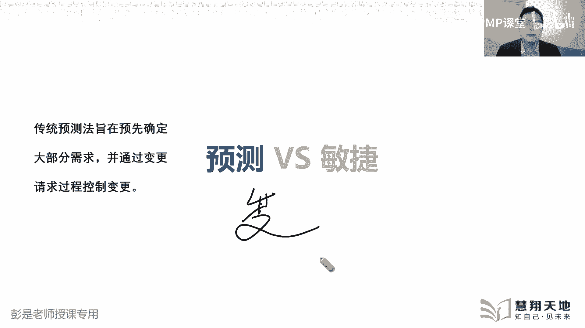

那怎么拥抱这个变化呢，所以五大过程组十大事等于二，所以这些东西我们都要考虑做裁剪，轻装上阵，轻规划，重探索，轻文档，重实践，这么多的过程，能精简的就精简，能去掉的就去掉，能简化的就简化诶，不用这么啰嗦。

与其把时间花在纸上谈兵，不如呢去实践，实践是检验真理的唯一标准，实打实的先把成果做出来，让客户来体验，获得客户的反馈，就像今天这道题啊，好多同学会纠结哈，说有一道题是说。

怎么确保这个东西满足人家的业务需要呢，还记得敏捷原则吗，我们希望业务人员和技术人员大家绑定，天天在一块才好呢，及时的让人家看一看这个东西，对不对呀，所以鞋子到底舒服不舒服，只有脚知道。

所以虽然PO可以对对这个玩意做决策，但是呢还是需要客户用户参与其中，我们要倾听客户的声音，QFD啊。

所以敏捷的方法出现，是为了在短时间内探讨可行性，因为随着时间的推移，变更的代价越来越高，那么咱缩短时间不就完了吗，周期越短，成本越低，成本越低，试错的代价就越小，然后呢根据评估和反馈快速的进行调整。

尽快的尽快的轻装上阵，把东西做出来，让人家看一看这个玩意儿是不是他需要的，对不对，如果不需要啊，我们及时调整啊，所以就有了滑板车，自行车平衡车那套东西吧，咱先做一个滑板车，您先用着用着往前秃噜着。

不好控制方向，我给您加个杆儿，说不拿脚蹬它费劲，我给您加个脚蹬子，变成自行车，以此类推啊，总之不断的根据用户的反馈，对我们的成果做改进，这就是迭代加增量，迭代加增量，迭代加增量诶，这么小步快跑。

小步快跑，避免在错误的道路上越走越远。

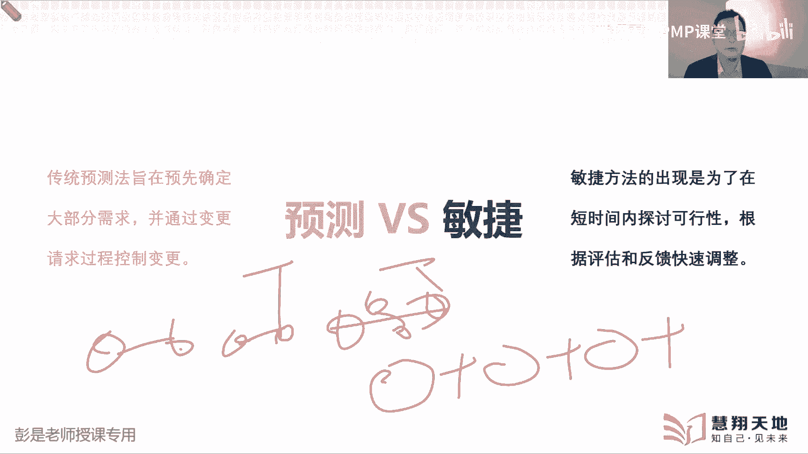

所以他的工作模式就变了，传统的项目是右边的工作模式，我们非常非常关注阶段的划分，每个阶段的工作呢要规规矩矩，追求的是文档的标准化规范化，因为涉及到成果的交接，成果的转移，所以呢这些文档啊，资料啊。

该有的都要有啊，否则下一个阶段的人怎么干活呢，所以它被称为瀑布型的生命周期，它的结构像那个流水的瀑布，而敏捷呢提倡的是短平快，对不对，小步快跑，小步快跑，不断的循环，不断的循环。

和那个pd c a这个底层逻辑是一样的吧，计划执行检查改进，计划执行检查改进，咱就不断的不断的持续改进，就这意思，所以再看PPT啊。

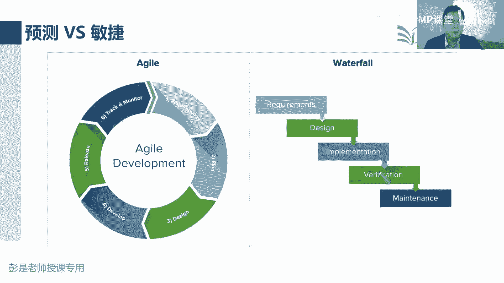

咳敏捷和预测的典型区别，左边右边掌握就可以了，中间呢就是迭代加增量预测型，我们需要在开发前确定大部分需求，这样呢我们就可以针对可交付成果，制定我们非常重的这个计划，然后呢就可以做到一次交付最终产品。

所以在过程中尽量的尽量的要限制变更，并且呢我们的关键相关方也已，关键相关方也不需要频繁的参与到项目之中，对吧，到定点看一看就行了，因为结果可预测，因为结果可预测呀，对不对，而如果需求不确定。

技术解决方案不确定，那这种方法就不适用了，所以就有了敏捷，他追求的是需求，在交付期间频繁细化，不断根据用户的反馈来对我们的需求做调整，包括排优先级，包括对需求做做修改，做删除，做增加。

总之啊什么东西有价值，我们就优先做什么，所以叫频繁的交互，对交付对客户有价值的各种子集，随便举个例子了啊，现在我们有ABC3个需求，十块钱，八块钱，七块钱先交付A因为有价值，根据客户的反馈。

可能再加一个D12块钱，那下一步我们先交付D因为有价值，这样不断不断不断实现持续的价值交付，持续的价值交互，怎么做到频繁呢对吧，怎么做到平凡，你就想想你身边的人，3分钟问你一下，2分钟问你一下，很烦呐。

唉节奏周期越短越频繁，周期越短越频繁，最理想的模式就是每天都有成果，最理想的模式了，在这种情况下，我们就可以几乎做到，在交付期间实时把变更融入项目，对不对，因为周期短，因为很烦呐，因为很烦呐。

那为什么能够把变更实施融入项目呢，为什么能拥抱变化呢，因为周期短，变更的代价小，那既然需要这么这么快的节奏，大家都别跑，所以那句话还有印象吗，业务人员，技术人员，我们要坐在一起啊。

持续地参与到项目之中啊，对不对，恨不得3分钟确认一下，3分钟确认一下，就是因为多变，就是因为复杂咳，好左边右边这个大道理，递增逻辑一定要搞定，那中间这种其实不用看了啊。

迭代和增量型它的周期啊就是大于四周。

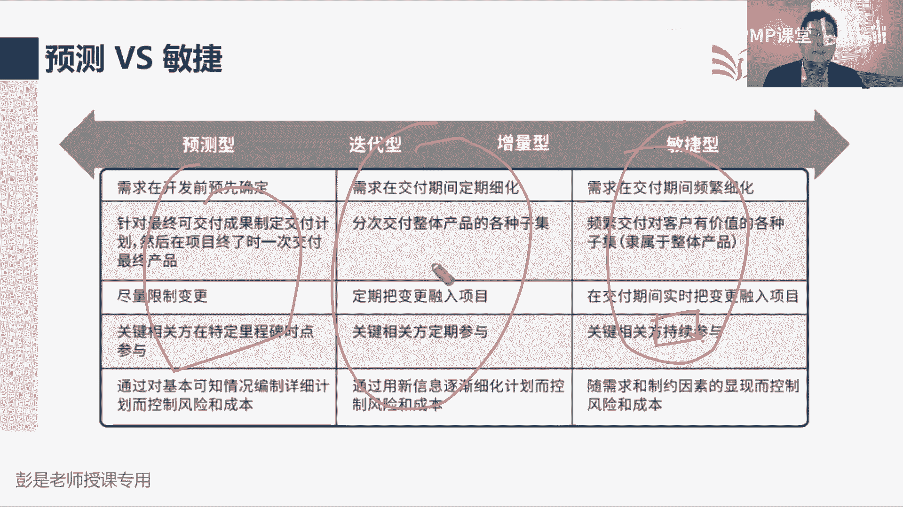

比敏捷节奏慢一些，那再往下咱就对标到十大知识领域，看看敏捷对标关于十大知识领域管理。

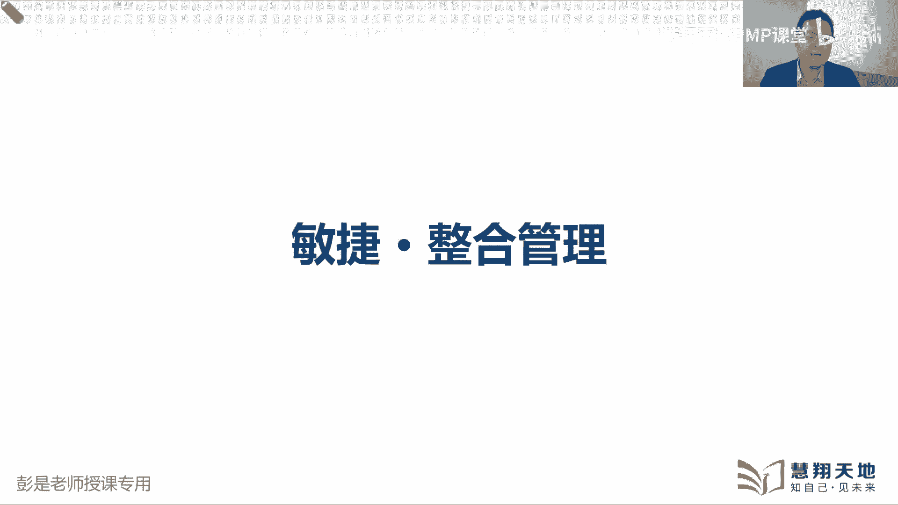

他有什么中心思想，整合管理，整合管理。

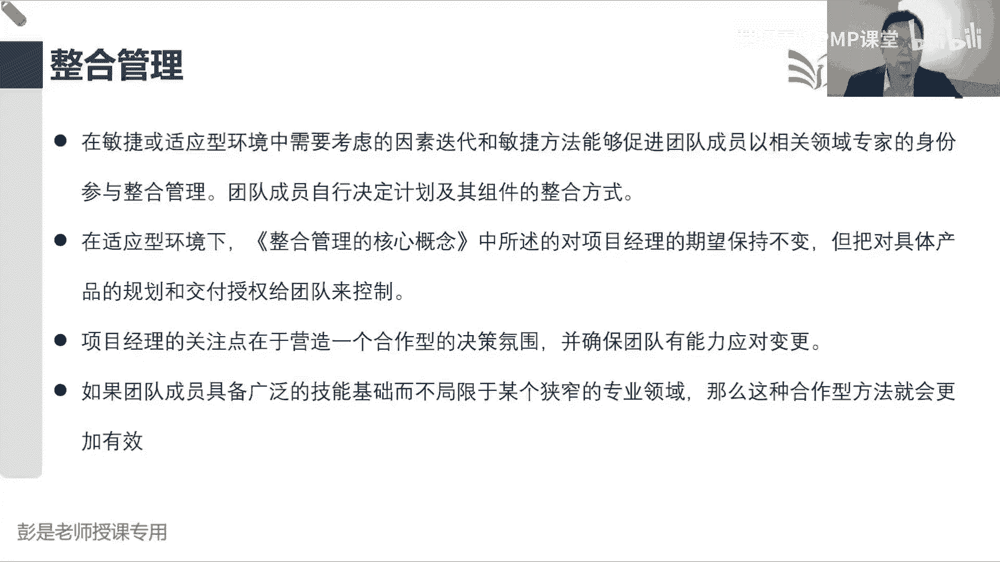

先看PPT，先回顾传统项目整合管理，我们有启动规划，执行监控，收尾启动的时候，我们需要章程得到授权，授权开始项目，对不对，说对项目经理做授权，我们有权利动用组织的资源资金，完成项目的工作。

规划过程组非常重，因为我们重规划呀，要把这个事情精打细算安排好啊，所以我们要制定项目管理计划，然后呢整合各个知识领域的子计划，范围的进度的，成本的质量呢，我们要整合三大基准对，所以93319个子计划。

三个单独的计划，三个基准，一个绩效测量基准非常重要，那执行过程组呢，项目经理啊主要是指导和管理项目，指导与管理项目工作，我们高高在上，高高在上，发号施令，就是那个传说中的什么工作授权系统。

传说中那个那个乐队的指挥棒，所以指挥呀到了监控过程组呢，我们监控项目绩效，监控项目工作，根据项目的情况，定期的出项目的工作绩效报告，另外另外呢我们还要实施整体变更控制，要严格地管理各种各样的变更。

最后呢解除项目后接待，当我们成果验收通过之后，通过解除项目活接单，总结归档，把它移交出去，这是传统的管理方法，敏捷怎么管呢，小迪同学听就可以了。

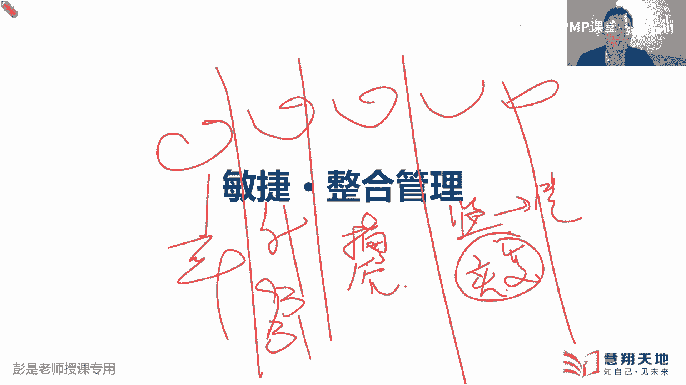

学习方法呀，马上要考试了，现在听就行了，听就行了，不要低着头看你的教材了好，那在敏捷里面是怎么讲，怎么玩啊，说在敏捷和适应环境之中，敏捷就是适应形式生命周期的一种，那我们要考虑啊，迭代和敏捷方法。

能够促进团队成员以相关领域专家的身份，参与到整合管理，团队成员自行决定计划及其组建的整合方式，这句话听完了能想什么呢，团队成员自行决定计划及其组件的整合方式，团队自己完成决策，团队自己完成工作的规划。

执行控制，所以因为因为要快，对不对，因为节奏快，因为变化多，所以呢每个人都是兄弟，每个人都是主人，每一个人都是皇帝啊，那我们就要想办法打造一个成熟的自组织团队，团队自行完成工作的规划，执行和控制。

我们就授权采用放任式的领导力风格，把权力交给团队了，那放放任之后，我们得干啥事了，我们就需要一个服务型的领导，所以SQUAM那个敏捷事件是敏捷事件，里面就提出了吧，我们需要有一个敏捷教练诶。

给大家给大家提供支持啊，提供服务啊，该指导的指导，该帮助的帮助，该指导，该辅导的辅导，该启发的启发，总之做配合，帮助团队创造良好的工作环境，工作条件好，所以再往下看，那么在这种适应型的环境下。

项目整合管理核心概念，对项目经理的期望是保持不变的，对不对，这是工作，可以那句话记得吗，整合那一章说工作可以授权，但是什么东西出不去啊，责任对我们仍然是最高行政长官啊，出了问题唯你是问的。

所以叫期望保持不变啊，但是呢我们把权利收交出去了，权利交给谁呢，把具对产对具体产品的规划和交付，授权给团队来进行控制，产品的权利交给谁了呢，我们需要有一个角色来管产品，有一个角色来管管产品。

就叫产品负责人，产品责任人，Product owner p o，这个人，那就和我们那个商业分析专业人士是一样的，他懂需求，懂产品，有经验，他全权全权负责产品的规划和设计，他来搞需求，他来设计产品。

相当于收集需求定义范围，这活儿归他了吧，收集需求，了解需求啊，定义范围，根据收集到的需求设计我们的产品，对不对，诶，这活都归他了，咱不管，另外呢车交付交给谁呢，就是我们的技术团队，开发团队哎。

或者叫交付团队都是一样的啊，我们需要有一帮人，有一帮人根据人家设计的产品，把这个产品给他做出来，这就是技术团队吧，所以技术团队就关注的是，好产品经理产product owner，产品负责人关注的就是。

嗯产品经理告诉我们这个产品到底是啥，技术团队关注的是技术方法，技术方案吧，想办法把人家要的东西给人家做出来，诶咱就不操这个心了，嗯好飞跃同学可以反思了，前面的课程应该是没听啊。

那项目经理在这种环境下我们干什么事呢，我们关注点在于营造一个合作型的决策氛围，并确保团队有能力应对，变更合作型的决策决策氛围吧，大家是干啥事不都得合作吗，无论是那个大需求池，产品待办事项。

我们要搞需求估计估，估算一下他他的工作量，估算一下他估算它的价值，考虑它的技术复杂程度，排排序都是合作呀，合作合作，合作需要我们的产品负责人和我们的开发团队，交付团队对吧，大家都是兄弟平起平坐。

合作合作合作完成这个事情，然后呢确保团队有能力应对变更，因为能力越强，能力越强，诶我们团队的适应性就越强，能力越强，适应性越强越强，参考贝爷对吧，人家这兄弟就是能力强啊，到哪都饿不死啊，到哪都能吃饭呐。

对不对，什么都能吃啊，这不能力强吗，到什么环境下都能适应，二就可以适应这种多变的复杂的环境，所以最终最后结论就是，我们要打造一个成熟的自组织，团队成熟说明他们能力强，对自组织说明不不需要管了。

好知道这个意思啊，那最后如果团队成员具备广泛的技能基础，这又带出来什么知识点呢，广泛的技能基础，贝爷啥都行啊，能开飞机，能开汽车，能吃虫子，能吃翔，什么都能能生火，我天呐通才什么都懂对。

就是传统的I字型人才，这工作有局限性，然后呢好一点的是T字型人才，对对有一定的见识，但是呢，还是只是专专注于某一个某一个专业领域啊，再好一点的拍字型人才两条腿走路，掌握了更多的技能，最好的就是破梳子。

什么都得懂，对不对，但不要求所有的技能都达到一定的水平，所以叫破数字，因为他不参差不齐，诶知道这意思啊，那如果团队成员是都是这样的人，而不局限于某个狭窄的专业领域，那么这种合作性的方法就会效果更好。

哎就这道理，通采最后一总结就是通采，通才才可以更好的去适应这种多变的环境吧，就这道理啊，六边形战士啊，这种人才比较少啊，说明你认识认识的人比较少啊，我觉得我就可以堪称一个通才了，啥都懂啊。

好这就是这就是这段文字，再告诉我们回顾一下敏捷这几个重要的知识点，重要的理念。

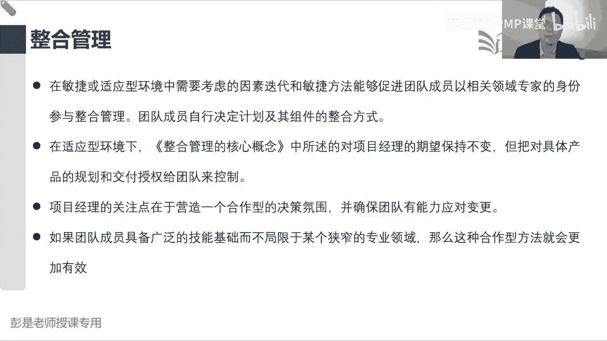

那接下来搞定，就带出来这张图，未来我们需要不断的不断的去强化记忆，这张图啊，这张图我们就说了，人人人三个人，左边这个小蓝人叫什么呢，Product owner，他来完成产品的规划和设计，对不对。

他来搞需求，他收集需求，定义范围，就这样粗暴理解呗，总之他有这个专业知识，他有经验，然后呢，这活到底怎么干，中间那三个小人就是我们的开发团队，交付团队，所以PO决定做什么，开发团队就关注的是怎么做。

那中间这个小红人，右边那个小红人就是我们的敏捷教练，敏捷教练丝瓜master敏捷教练啊，实际上在敏捷环境之中有没有项目经理呢，有对，但是不同的实践方法里面没提项目经理要干啥，但是不管项目经理是谁。

不管项目经理干啥，不管在什么样的环境下，我们都需要这样一个服务型的领导，所以就提出了敏捷教练，这个这个这个这么一个角色，他的主要工作任务就是，帮助团队创造良好的环境，确保大家成熟，确保大家自组织。

确保大家有能力，确保大家都是通才，然后剩下就是配合指导辅导，启发教育，以此类推，想办法想办法帮助团队顺利的顺利的往前走好，这就带出来三个角色，咱整合这责任和权利就分清楚了啊。

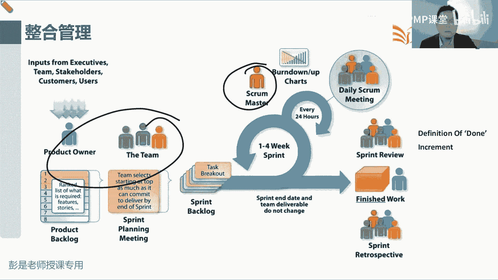

做做题，看看这道题怎么选，所以恭喜大家，正确的答案是什么呢，就是第二个呀，一个新成员应邀参加一个什么破会，然后领导注意到这个人对这个过程并不熟悉，那应该怎么做呢，像这样的知识点。

不管是在传统项目还是敏捷项目中，心思想都一样吧，对对发现员工能力不行啊，水平不行啊，缺少技能啊，怎么办呢，本着治病救人的原则，该培训的培训，该指导的指导，该启发的启发，所以呢是第二个培训，对不对。

创建一份计划，为成员培训敏捷工具和方法，记住牢牢记住这个治病救人呐，口误，这都听出来了，然后批志同学说呀，在考试过程中，对于敏捷相关的题干会指出来吗，还是88，还是自己判断考试，这是非常好的问题啊。

考试的时候怎么判断这题目是敏捷项目呢，就是看敏捷的关键词，什么产品代办事项，迭代代办事项，然后增量迭代对吧，什么发布产品责任人，敏捷教练只要看到带这样词的，这样词的就是敏捷项目或者是题目。

有可能会直接说啊，D不好吗，在面对面的德尔菲会议之中，鼓励成员提出新的问题，你选D，那还不选A呢，D哪里不合适啊，说这人这人没有这个本事，你就让他在工作中去试错吗，预防成本，评估成本，失败成本，想一想。

想一想，张三不会开车，你就让他上高速上高速啊，试试再说，李四不会爆破，来练练手，给你一堆雷管试试再说，培训好，所以相对来说比较合适的，就牢牢记住这个中心思想，治病救人，治病救人，不要让不要让人家。

你明明知道这个人技能不行，还让这个人在这个工作中去试错吗，这肯定不行啊，对不千万不要混淆啊，是说需求不确定，技术方案不确定，我们要想办法，最小的代价就是做法，而不是说这事明明你知道还让他去试错。

这可不行啊，这明显明显道德感道德感就过不去吧，好所以最合适的仍然回到知识点啊，看到人能力不行，水平不行，想先想办法，我们是不是热情的服务员啊，本着治病救人的中心思想，治病救人的中心思想，该培训的培训。

该指导的指导，该启发的启发就是B了，好10亿同学啊，10亿同学，如果你现在觉得考PMP没信心，我就建议啊不要听课了，不要听课了，直接去裸考，你现在可以飞到美国，香港日本欧洲国，海外是随时可以报名。

随时可以参加考试的，你就去频繁的频繁的频繁的考试，来获得考试的经验，如果你认可，那你我就同意你选A了，如果你不认可，那咱就踏踏实实的选B好，能听懂了吧，好了，这道题过了吧，非常重要的一个理念啊。

不管是传统项目还是预测项目。

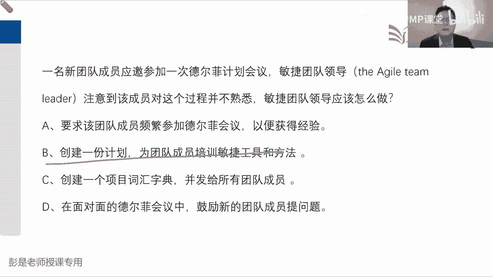

都是这个原则，好了再往下了啊，第二道题做一做没毛病吧，第二道题简单了就找啊，找一个选项显得咱热情，对不对，显得咱辅助，显得咱是一个热情的服务员，说一个新新敏捷开发团队，拥有同等数量的技术专家和非专家。

对于一次项目迭代，大部分任务都需要专家敏捷，项目经理应该怎么做呢，A确定非专家成员的培训并减少封闭技能，看起来还蛮有道理的样子啊，B鼓励鼓励成员成为通才专家，创造高绩效团队，减少封闭技能。

B和A扔一个扔哪个呢，没错就往天花板上靠啊，我们非常高大上的，能鼓励的就鼓励，能启发的就启发，能帮助的就帮助，能指导的就指导，那C让团队成员决定作为团队如何处理任务，那能鼓励的就鼓励啊。

D请专家也没什么可念的了吧，能鼓励的就鼓励啊，把把那个什么逼格拉满，就这种东西啊，如果你发现就像大家比如说小孩学走路，你不得只鼓励他嘛，对不对，能不扶就不扶，能不帮就不帮，能鼓励就鼓励啊，嘿宝贝。

你最强，坚持坚持加油，摔了没关系，继续往前走，就这道理吧，这不是热情的服务员吗，能鼓励就鼓励啊，风没技能是什么呢，就是缺了它，缺缺了它地球就不转了，缺了它地球就不转了，别人不会就这种东西。

能不培训就不培训，能鼓励就鼓励，鼓励他们自己去学不好吗，帮助员工成长，帮助员工发展，不是那种不是那种保姆级的东西啊，不是说我要帮你定计划，我要帮你定培训计划，你们自己主动，自己有主人翁意识。

自己有主观能动性，这不是更好吗，听懂吗，什么叫主人翁意识，什么叫主观能动性，这是更好的吧，我们要打造一个成熟的自组织团队，成熟的自组织团队，什么叫成熟呢，有主人翁意识，有热情，有积极性，有主观能动性。

对不对，他们会主动想办法去学习，想主动想办法去变成宗，才能不安排就不安排，所以呢建议的答案是BD啊，不一定啊，这这太具体了太具体了，所以记住啊，考试场景不同选项不同，答案就不一样，答案就不一样。

D什么情况下都不建议选，不要再问这种问题了啊，场景一变，场景一变，你就记答案，记答案就很容易错呀，再往下了，慢慢去适应这个解题思路哈，没有好的办法，前面课程如果听的不够的同学就很难做到秒懂。

那解释起来就费劲了，所以大家形成的债，形成的债一定要还好，看看这道题呢，这个简单了吧，说新发现的任务可能需要花费更长的时间，不能在迭代中完成，可能需要减少一个故事，或者是少做一个过故事。

对于这种情况需要找谁诶，只要沾到在敏捷项目之中，只要沾到这个东西，需求啊，产品啊，就是what就找PO，只要涉及到how的对吧，这个东西技术复杂不复杂呀，这个东西工作量是多少啊，就找开发团队交付团队好。

所以这道题恭喜大家答对了，就答案就是A呀，PO搞这个事，星辰同学，这学杂了，是客户是来干嘛的，客户是来干啥的，咱强调客户的什么客户的什么客户的什么，谁做主，这是两回事吧，我们更关注客户的体验。

获得客户的反馈，但谁做主，谁说了算呢，阅读是最好的最最好的最好的学习方法，好不知道了，不要再问一个一个问了，老师有发起人找谁呀，有项目基金经理找谁呀，有项目组合经理找谁呀，有PMO找谁呀，去看书吧。

听一听发起人是干啥的，再去看看书PO是干啥的，小同学不讲了啊，过了刚才解释过了，去看看教材亲，求求你们了，PO决定做什么，PO决定做什么，他有这个决策权，他有这个决策权，但是PO做做决策的时候。

你不得参考客户的意见吗，倾听客户的心声吗，所以千万不要要把题目的答案给他理解，有误解啊，这个题简单吧，其实考点在哪呢，指导与管理项目工作工具会议，指导与管理项目工作会议工那个工具。

会议里面藏了一个每日展会，对不对，说啊，这个站会干啥事呢，了解项目的进展，对不对，他的知识点啊，就是我们的开发团队，开发团队每个人都是主人的，每个人都是主持人的，所有成员开发团队都要参与的啊。

呃这个在这个会上大家聊什么主题呢，就是说通报一下完成了什么工作，再通报一下计划做什么事情，再通报一下工作过程中有没有遇到一些问题呀，障碍呀，风险呐，这些讨厌鬼诶，那通报这些信息的目的是什么呢。

同步让所有人知道，让所有人知道整个项目的情况，因为我们是平起平坐的兄弟，大家都是主人，对不对，让所有人都知道整个项目的情况，以便于以便于把问题暴露出来，以便于把问题暴露出来吧，好所以找选项了。

可以向团队提出问题，创建问题可视化，那再拐个小弯，对不对，说我们在会上提出问题，要不要去讨论这个问题咋解决呢，不一定对不对，最好的实践方法是提出问题之后，找个地方好记性不如烂笔头，先记下来。

传统项目我们记问题日志，敏捷呢没提，对不对，没敏捷，没提问题日志啊，所以我们需要一个临时存放问题，障碍风险的地方就是停车场，我们需要创建一个停车场区，就是随便画个画个在墙上，随便画个区域啊。

把这些问题小标签贴上去，贴上去贴上去，解决一个出去一个解决一个出去一个哎，所以通常建议会后会后找时间开这种问题，解决的专项，会避免浪费大家的时间，就这道理啊，A不会不会更全些。

这个会的作用不是对大家进行指导，这个会的作用不是说敏捷教练来教育大家，不是干这个干这个事的啊，所以还印象不深的同学去回顾教材，看看每日战会到底做什么事，看看每日展会到底做什么事。

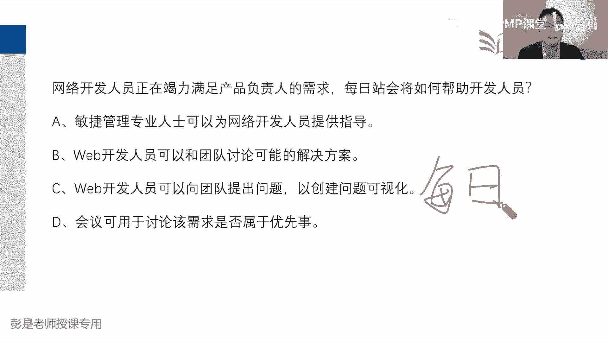

还有什么其他的知识点啊，好那到了范围管理传统项目呢，我们是收集需求，定义范围，创建WBS得到了需求文件，范围说明书和工作分解结构，未来我们根据工作分解结构，根据工作分解结构来定义活动，得到活动清单。

再去估算资源时间成本，就可以得到了整个项目的什么进度基准，成本基准这些东西啊，那敏捷项目啊不这么玩了，敏捷项目，敏捷项目说传统项目你收集到的需求，根据收集到的需求来设计产品。

来设计完成带来分析要完成什么工作，来分析要交付什么成果，然后呢再根据范围说明书创建WBS，那这种情况下，如果需求变了，我们后边什么定义活动排序，做进度计划全都全都有问题啊，那敏捷就换了个游戏规则。

换了个游戏规则，我们找个地方把需求给他记下来，然后不是一次完成所有的，不是一次完成所有的需求，比如说里边有一个ABCD有这么多需求，不是一次完成所有的，我们先选一部分，比如说选一个A先去看看这个东西。

这个这个东西怎么把它完成，怎么把它实现，然后得到我们的成果，再根据用户的反馈，再看看下一步要做什么事儿，再根据用户的反馈看看下一步做什么事，以此类推，就这样不断不断不断小步快跑。

所以它其实就相当于传统项目，传统项目的什么呢，每次迭代相当于啊一个小项目，这个项目开始的时候，我们敏捷发布规划，免迭代规划的时候，就相当于收集这个迭代小项目的需求，定义这个迭代小项目的范围。

创建这个迭代小项目的WBS，最后呢分解出这个迭代的具体的活动，然后按照这些活动12345去干活，就会得到这次迭代的成果，它底层逻辑其实是一样的，只不过把它变成了其他的术语，对不对，好知道这个意思啊。

所以在传统项目之中，咱们这个术语叫主要成果控制账户工作包活动，敏捷里面呢就变成了巨大个儿的故事，叫叫史诗，小一点的叫特征，再小点儿的叫用叫用户故事，用户故事就是一张小卡片，说作为一个角色。

我需要一个什么功能，以便于实现什么样的目的，诶咱文档就精简化了吧，一个小卡片就是个需求，说他要什么东西，然后这个东西怎么做出来，传统项目我们是活动敏捷里面就叫任务，得到了一系列。

得到了一系列一系列的任务，这些任务一完成，成果就出来了，好所以范围管理就是在说这个东西。

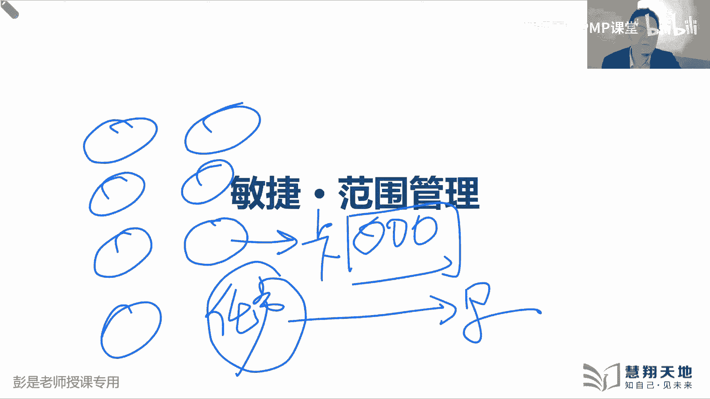

那看看这段文字啊，对于需求不断变化，风险大，不确定性高的项目，在项目开始的时候，通常无法明确项目范围，因为需求不断变化，因为需求不确定，所以我们需要在项目期间逐渐明确，那敏捷方法特意在项目早期。

缩短定义和项目范围协商的时间，轻规划重探索，轻文档中实践，对与其花时间去做规划，不如花时间去干活，谁让你需求不定呢，所以怎么省事怎么来，怎么精简怎么来，并未持续探索和明确范围，而延长相应的过程的时间。

我们花更多的时间去干活，得尽早的把东西做出来，让人家看看是不是这个东西获得客户的反馈，为什么呢，因为就后面这句话，在许多情况下不断涌现的需求，需求会不断的喷涌而出的。

往往导致真实业务和最初的需求存在着差异，所以呢我们有目的的构建和审查原型，并通过发布多个版本来明确需求，每一次迭代出个东西，每次迭代出个东西，不断的小步快跑，获得客户的反馈。

让用户看看这个东西是不是满足他的业务要求，这样一来，这样一来啊，敏捷项目之中，范围会在整个项目期间被定义和再定义，那在敏捷方法之中把需求列入未完项，所以呢这是我们有一个产品代办事项。

然后相当于每次迭代是一个小项目，我们收集这个小项目的需求，定义这个小项目的范围，创建这个小项目的任务列表，任务列表一干活就得到了成果，再根据成果，根据成根据，得到成果之后，让客户来体验一下。

获得客户的反馈，反馈是什么呢，不就是本质就是变更吗，把一些什么新的需求啊，新的想法呀，对现有需求的调整啊，放回产品待办事项，对不对，这不是又被重新定义了吗，然后我们再排排序，看看什么东西价值高。

什么东西价值低，下一次迭代再优先交付有价值的产品，服务或成果再做出来，再让客户看一看，获得客户的反馈，再根据反馈的结果再排序，就这样不断的迭代加增量，迭代加增量，所以就有了三个单词，大需求时。

所有的代办事项就叫产品代办事项，每次迭代要做的事情就是小需求时，叫迭代的待办事项，总之需求都放到放到待办事项里，然后最后创造创造出来的增肌。

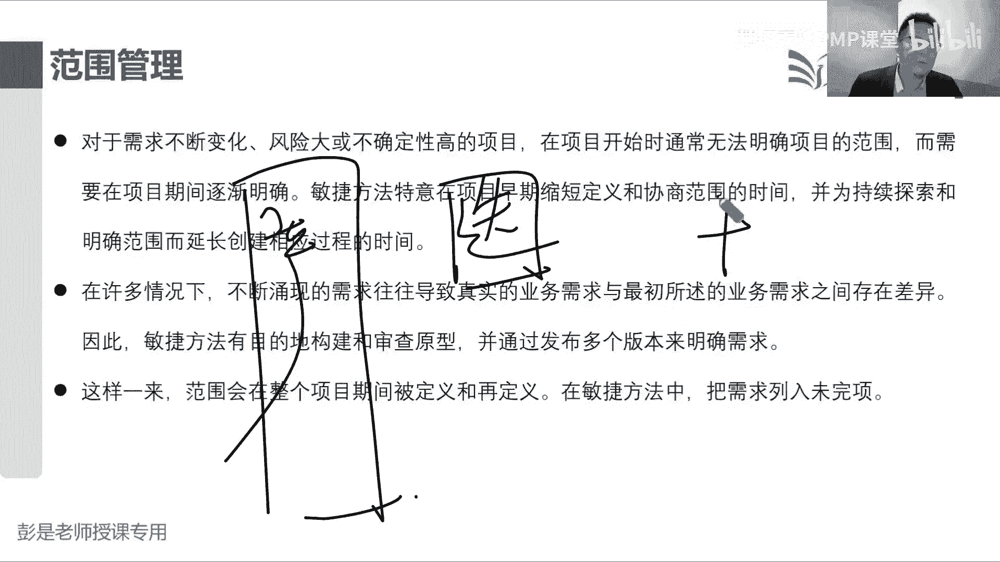

创造出来的东西就称之为增量，所以就有了这张图的这么三个结构，左下角这个product的blog pl就称为产品代办事项，然后每次迭代，每次迭代要做的事情，需要有一个小需求池，来记录这次迭代到底干啥事。

就叫迭代代办事项，迭代呢就叫冲刺，冲刺呢就是spring，所以它又称为s bl sbl迭代代办事项，然后最后呢按照迭代代办事项里的需求，我们把这些功能给他做出来，最后就得到了increment。

最后就是增量，好就有了这么三个东西。

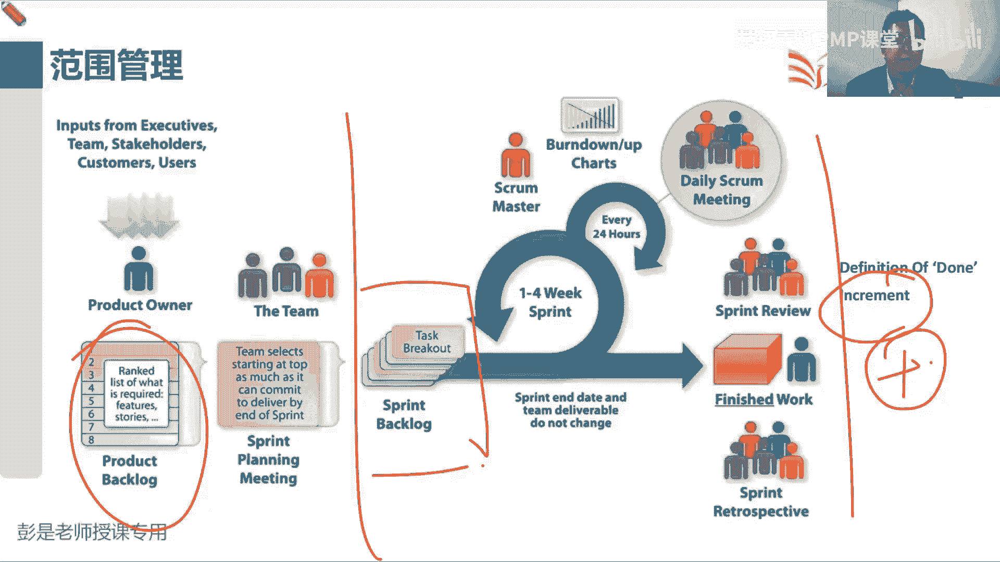

那再往下做做这一小段题，看看这道题选啥，有人把节奏带歪了啊，是选C题目里面找到重要的关键词啊，刚讲完，你们楼上好心的同学，刚把那个重要的原则打出来，叫什么轻规划重探索，对不对，轻文档重实践。

与其花在时间，花在把时间花在定一个非常详细的计划上，那不如去干活了，好所以恭喜大家，大部分同学现在修正了啊，答案是啥呢，就是B为什么呢，关键词其实就是这两个字，一个高管向团队询问项目进度计划。

想了解团队成员的时间使用情况，团队开会并创建了一个非常详细的进度计划，显示每个成员接下来六个月，每个小时将如何使用，这非常善良的出出题老师啊，对不对，那script教练应该做什么呢。

就传统项目这么详细的进度异化，咱都忍不了啊，就这个道理吧，夸张啊，主要注意啊，初级导师非常善良，线索很多呀，好那此gram教练应该做什么呢，A是用服务型领导，确认团队成员确实完成了工作。

B创让团队创建一个不那么详细的进度计划，就是B了，还记得这个词吗，该选就选啊，他不懂敏捷，咱就教教他呀，就指导他呀，就帮助他呀，就启发他呀，B是不是中心思想还是治病救人呢，计划定好了怎么办，发给高管。

把计划发给高管，说明你认可敏捷，需要制定详细的进度计划，说明你不懂敏捷，这一分没有了，让团队在在团队空间创建一个大家都可地的，在一个大家都可见的地方贴出这个进度计划，说明你作为考试的考生。

你认可敏捷需要制定详细的进度计划，说明你不知道这个知识点，这一分丢了，使用服务型领导，确认团队成员确实完成了工作，敏捷项目并详细的介入计划，还只关注大家该干的活都干了，说明你不懂敏捷，这一分没有，嗯好。

所以答案就是B该教育的教育，该指导的指导，该启发的启发，该帮助的帮助，该鼓励的鼓励，但是呢如果通过通过阅读题目，发现人家不懂敏捷怎么办呢，你一定要找一个懂敏捷的选项嘛，对不对。

一定要找一个懂敏捷的选项啊，连你都认可，连你都认可这个项目。

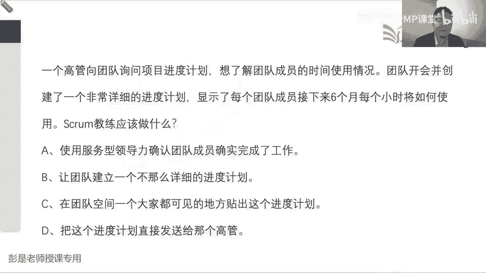

你怎么考试啊，所以这道题答案是B啊啊再往下看看这道题呢，实际工作中也是B啊，实际工作中也是B啊，如果实际工作中你认可了其他的选项，这个敏捷教练，你赶快把你公司让你公司老板给他开了，他屁也不懂。

好这道题选啥呢，这就是不得不提到什么叫回顾会啊，其实回顾会和这道题解答案没关系啊，回顾会回顾会是反思过程的，看看什么地方做得好，什么地方做的不好，那好说，团队识别到发布版本中遗漏了一项非功能需求。

这不是what吗，what往哪放啊，那我们应该放到最安全的做法，就是这个产品待办事项，所有要完成的事情全都放到大池子里，无论是什么需求啊，功能要求啊对吧，非功能要求啊，纠正措施。

预防措施变更全都往里放码，问题解决方案，风险应对措施，它既然叫待办事项，既然叫未完项，不都是等着我们干的活吗，唉所有要干的事情全都放进去，这是最踏实的做法，所以就是C将该需求放入产品待办事项列表。

就是那个最大的需求池，先放进去，先放进去，发现啥发现啥，记录啥，好记性不如烂笔头，好记性不如烂笔头，A什么时候干A呀，什么时候开迭迭代，什么时候开迭代规划会啊，现在还没到呢吧。

下一次每一次迭代开始的时候开迭代规划会啊，对不对，所以A呀每到那那B肯定是不能选的吧，在下一次迭代中就包含该非功能需求，这肯定不能选，下一次迭代开始的时候，规划一下下一次迭代做什么事。

现在不确定这个事情，要不要放到下一个迭代之中，对不对，好那D肯定不能选啊，为该给在该迭代增加时间，哎咱们咱们有固定的时间和time box，我们迭代周期是固定的固定的啊，在迭代中。

在迭代中不能说活没干完，就把这个迭代周期迭代周期变长，这肯定不行，所以D也不能选，咳没错，PO确定优先级，好这种题啊，改成变态的题，改成变态的题啊，大需求持叫产品待办事项，假设我们现在在第一次迭代之中。

有了迭代代办事项，然后呢开回顾会的时候发现啊需求有遗漏，那最安全的做法是把它放回产品待办事项，那我们现在可不可以，可不可以，把它放到下一个迭代的迭代代办事项里呢，可以吧，不犯法。

可以把它先放到下一个迭代的待办事项里，但不代表着说下一次迭代就肯定包含它，因为下一次迭代一开始我们还要规划的，万一有优先级更高的事情，你得把它弄出来啊，每次迭迭代一开始的时候。

要规划一下这次迭代到底干啥，这是两回事啊，但最安全的做最安全的做法还是放回大需求，是产品代办事项好。

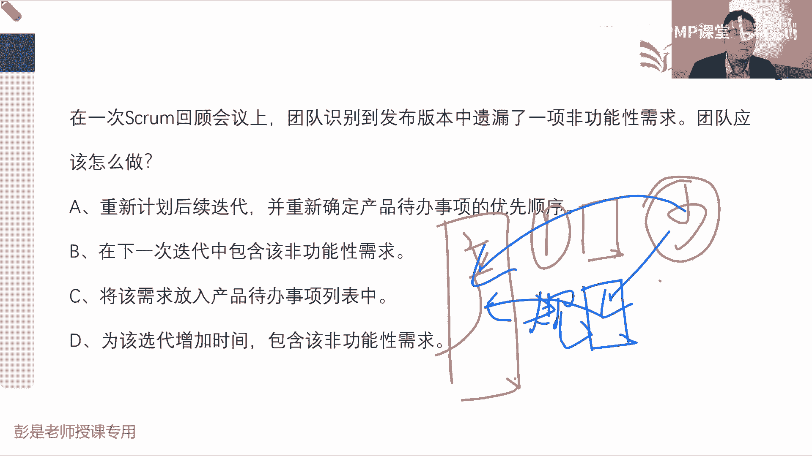

大概知道这个意思啊，小细节听一听，那再看看进度管理，传统项目进度管理怎么办呢，我们有了范围基准之后，定义活动，得到活动清单，活动属性里程碑清单，然后呢可以兵分两路，一路一路人马去排列活动顺序。

分析先干啥后干啥，然后逻辑关系，依赖关系，提前量之后量，画那个破网络图，这是排列活动顺序，还有一路人一路人马干啥，那估算活动所需要的资源，根据资源需求估算活动持续时间，接下来万事俱备。

我们就制定一个非常详细的进度计划，就是那个念就是听过的那个甘特图，告诉我们什么时间做什么事，什么时间做什么事，这个进度计划一旦敲定了，所有具体的日期，我们就得到了进度基准，那敏捷项目。

敏捷项目没那么啰嗦，敏捷项目啊，我们是迭代一开始做一个迭代规划，会规划一下这次迭代做什么事，就是PDCA的那个P呀，定这次迭代的目标，定这次迭代的工作计划，进工作计划是什么呢。

大需求池里的需求搬到小需求池，对不对，然后呢，搬过来的需求再分析这些需求怎么把它做出来，就会得到一系列的任务，就会得到一系列一系列的任务，这些任务啊去干活，就会得到我们的成果。

但是它道理和传统项目看起来差不多，但是它很轻，对不对，他没有什么估算或定义活动，然后什么估算活动资源，估算活动持续时间，没有什么类比估算参数估算这些东西啊，很轻很轻很轻，就是把需求搬过来。

分析一下这需求对应的功能怎么把它做出来，形成了一系列的任务，这是第一个区别，第二个区别是什么呢，传统项目，传统项目我们要画那个责任分配矩阵的，化责任分配矩阵码，我们是有人来分配任务，对这事儿归张三。

这事儿归李四，这事张三负责，李四执行通知，王五咨询赵六，诶，我们要做分工，是分配任务，传统项目咱是分配任务吧，这叫什么呢，这叫推动式进度计划，咱把任务安排下去，敏捷是啥呢，成员自行完成工作的规划。

执行控制，所以没有人分配任务了，那怎么办呢，对吧，这场热情的服务员，有眼力见的服务员，看哪脏了，桌子擦一擦，看哪菜少了，给人盛一盛，以此类推吧，诶就是这样成熟的自组织团队，没有人分配任务了。

大家都是兄弟平起平坐，所以他是拉动式进度计划。

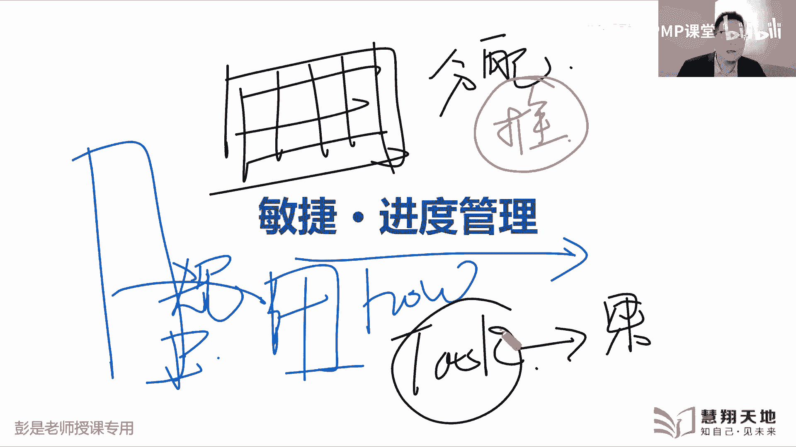

有人主动去领取任务，这是第二个区别，适应性方法，采用短周期来开展工作，周期越短，成本越低，对不对，然后根据我们的成果来看看要不要改，根据我们的成果要不要改，以此类推，那这些周期可针对八八进行快速反馈。

因为周期短，因为大家持续参与就能做到快速反馈，就可以基本上做到实时，那通常表现为迭代型进度计划和拉动式，按需进度计划，拉动是按需进度计划，那他怎么干呢。

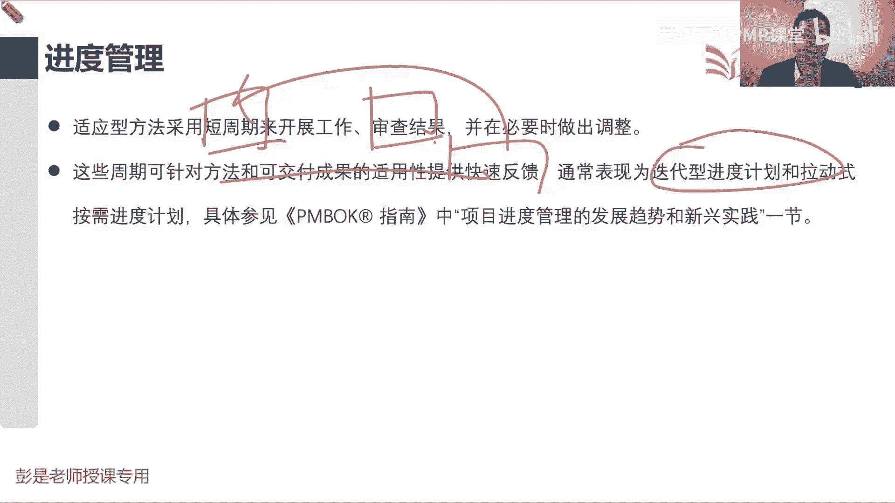

所以就是每次迭代开始的时候，每一次迭代开始的时候都要开迭代规划会，来规划一下这次迭代到底做什么事，就这句话没那么复杂吧，所以需要开就需要开这个会，就是现在画黑圈的左下角，这个会叫迭代规划，会。

规划一下这次迭代我们到底干啥，那说白了就是从大需求池里把需求，搬到小需求池，从产品待办事项中选取优先级最高的，最有价值的东西搬到小需求池，需求搬过来啊，接下来我们的开发团队就思考了，这活儿怎么干诶。

就会得到一系列的任务列表，这些任务列表大家去各自领取各自的工作，然后该干啥干啥，按照计划去干活，就会得到我们的增量，就这么简单了。

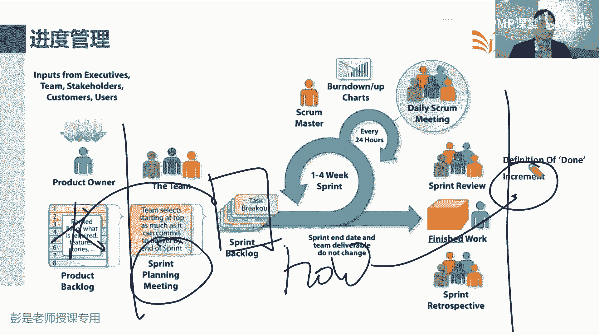

说一个敏捷从业人员需要得到反馈，来确定当前进行的工作和为将来迭代的工作，是否需要修正，要做到这一点，最好的方法是啥呢，就是C了吧，在每个迭代结束的时候，和利益相关者检查成果，利益相关者就是干系人。

就是相关方，对不对，所以就还记得那个滑板车吗，滑板车做出来让人家来体验一下，获得人家的反馈，根据反馈去思考下一步做啥，如果他需要需要提高操作性，可操控性，那咱就给它加个方向杆，如果他想偷懒想省事。

我们就给您加个发动机，让它变成脱落了，自动的自动的车，如果您想提高安全性，我给您加个壳，总之啊不断的根据用户的反馈去思考，下一步到底往哪个方向去发展，下一步到底做什么事情，不断的对我们产品待办事项。

这个大需求池去做细化，去做精化，去做梳理，细化精化梳理干什么呢，就是排序对不对，需求做调整好，所以呢答案就是C了，在每个迭代结束的时候，我们要和利益相关者检查成果，kc同学。

我现在判断你应该是敏捷的课还没听吧，如果没听呢，今天的课就不建议听了，不建议听了啊，不然咱俩没法沟通啊，活儿干完了，让人家相当于传统项目的什么呢，干完活儿缺人范围做验收啊，只不过在敏捷环境之中。

谁来做做做这个做这个做这个最终的决策呢，PO在评审会上，评审会上PO有这个决策权，这就是大家今天纠结的那道题啊，虽然PO有决策权，但是需不需要客户来确认，这个东西是否满足业务需要呢，肯定啊。

因为鞋子舒服不舒服，只有客户只有脚知道，所以一定要关注客户的体验，获得客户真实的反馈，那PO怎么做决策呢，他也要倾听客户的声音啊。

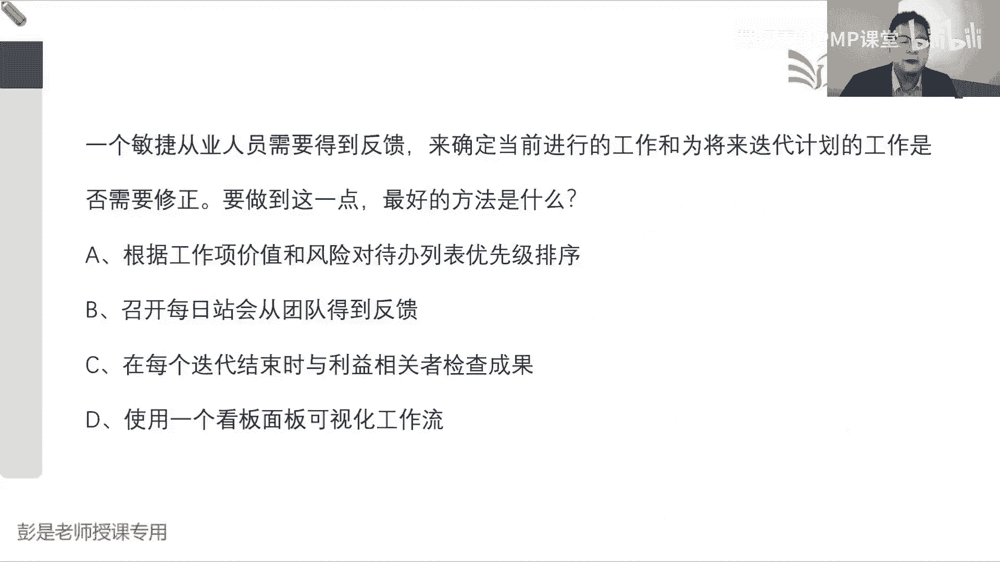

一个道理啊，再往下了，所以迭代接触时就带出来咱们这张图，这张图叫什么呢，review这个单词就搞定了，我们迭代结束最后两个会，最后两个会，一个叫review，review是看结果。

相当于传统项目确认范围，做验收这个事情对不对，我们把成果给客户看一看，让人家用一用，您看看好吃不好吃，您看看鞋子舒服不舒服，从而获得客户的反馈，所以他叫评审会，它是迭代评审会。

那评审会开完迭代的最后一个事情叫什么呢，就是右下角这个retro，Spective rachel，这个retro就是对应到回顾，我们不仅仅关注成果的质量，我们还要关注过程的质量，回顾就是分析复盘反思。

看看我们这个过程什么地方做得好，什么地方不做得不好，然后呢改进过程就搞定两个单词啊，一个叫review，评审会看结果，让客户来体验，获得客户的反馈，RTL回顾会看过程，分析过程是不是需要改进。

是不是需要优化，第一个会也搞定了吧，第一个会迭代一开始开规划会planning，对不对，规划一下这次迭代做什么事，然后第四个会就是右上角这个DELEGRAM，刚才也说了，做什么事情，对不对。

看看完成了什么工作计划做什么事情，工作中有没有遇到问题，同步信息每天都要开的会嗯，最后呢画个圈圈，画个圈圈啊，把这些东西都给它包进去，这就是一次迭代，所以呢迭代也是最后一个事件，它叫容器性事件码。

它包括了这四个会，这就是敏捷里边那个五，现在我们知道了335敏捷就学完了，3335次学完了吧，三个角色，Product owner，开发团队，交付团队SCREMASTER，对不对，我们需要一个搞需求的。

一个搞技术的一个服务员，三个角色搞定，我们还有三个工件，就是大需求时记录所有的待办事项，记录所有的需求，小需求池记录这次迭代我们要做的事情，相当于这一次迭代的计划对，然后呢。

最后第三个弓箭就是我们最后得到的增量，increment产出的成果得到的增量，哎，这是第二个333，那第最后一个五是什么呢，就是迭代本身在包括四个会规划会，哎，这就是SQUAM最核心的33511个单词。

这11个单词可以帮你解决大部分的问题。

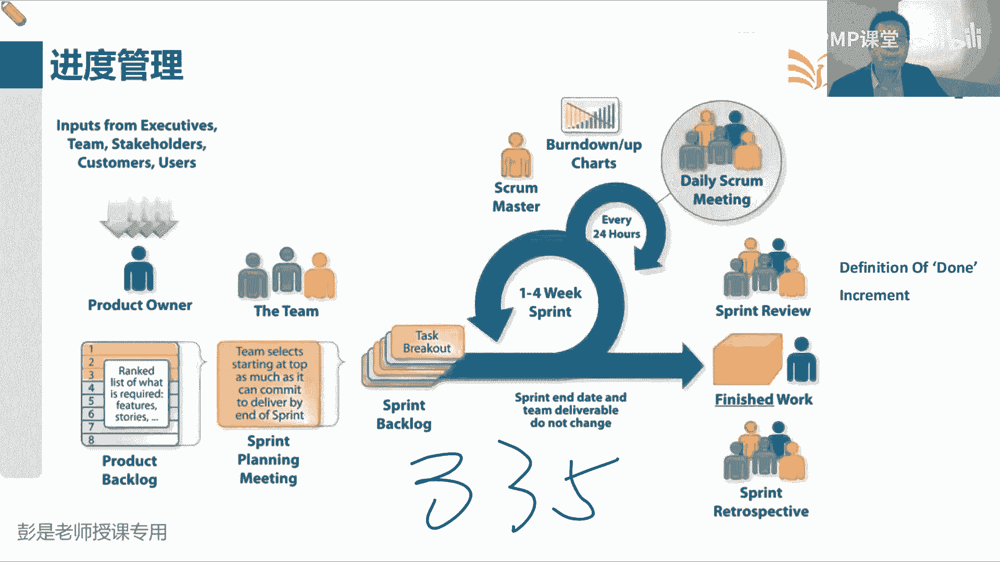

好继续了啊，那看看后半部分，后半部部分是说呀，说具有未完善的迭代型进度计划，这是一种基于适应型生命周期的滚动式规划，例如敏捷的产品开发方法，这种方法将需求记录在用户故事之中，用户故事就是个小卡片。

说明说清楚用户需要什么功能，对不对，然后在建造之前按优先级排序并优化用户故事，因为产品代办事项里的东西很多呀，到底先做什么更有意义，先做什么更有价值呢，就需要不断的不断的持续的开展，持续的去细化。

持续的去梳理这里边的东西，所以就有了那个京话会细化会梳理会，这是隐藏会议哈，精化细化梳理研讨都是一个意思，总之这个会的主要作用就是，看看里边的需求都是啥，把它说清楚，分析他的工作量，分析它的价值。

从而便于我们排优先级好，最后在规定的时间和之内开发产品功能，就是迭代周期，我们有固定的时间，迭代周期长短，有固定的时长，固定的时长，通离通常小于四周，就叫基于迭代的敏捷time box。

那这个方法通常用于向客户交付增量价值，因为所有的产品待办事项我们都在不断的评，不断的分析和评估它的价值，优先把最有价值的东西进行交互吧，诶这样持续的价值交付，或者由多个团队并行开发。

大量内部关联较小的功能，多团队敏捷，这现在咱基本上也不考了解就可以啊，多特点敏捷，还记得那个什么SOSSOSOS诶，Scum of scm，这了解就可以，后面再说了好。

那适应型生命周期在在产品开发的应用中，越来越普遍，很多项目都采用这种进度计划方法，那这种方法的好处是什么呢，变更拥抱变化，适应变化，搞定。

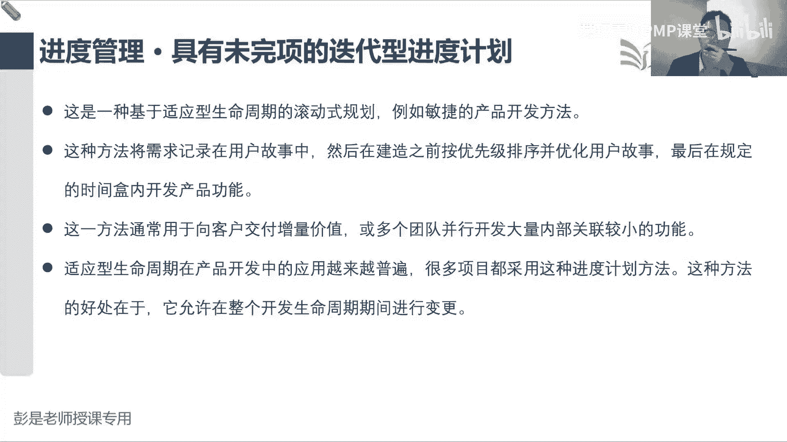

好335不讲了啊，那做做题，好开始同学，你的问题就在这道题上了，活没干完，我写这儿了，就这意思吧，说这次迭代啊，活没干完怎么办呢，敏捷团队在当前迭代中落后于进度计划怎么办，A同意延长工作时间和周末工作。

弥补当前迭代中的时间滞后量，A排除排除掉，嗯在迭代的过程中，这个周期这个周期不要去改它，不要去改它，不要去延长迭代周期，这这这个知识点一定一定要脱离实际工作了，大家在实际工作中一定是A对不对，周末上班。

晚上上班加班呗，这老板都是这样的啊，考试一定要这个这个知识点，考试一定要脱离实际情况了，那B选项说完成任何可能的范围，并召开回顾会，获得经验教训，能干多少干多少，对不对，能干多少干多少。

因为在敏捷这种多变的环境下，干的多，干的多不一定是好事，还记得吗，在这种需求不确定的环境下，干得多不一定是好事儿对吧，就像回家吃饭，我我家小孩问他吃啥，他说不知道，咔咔咔咔咔做了100个菜哇，速度快呀。

干的多呀，但是呢这也不吃，那也不吃，浪费浪费对，所以咱不追求大而全不追，不追求速度的不断提升，我们追求稳定的速度，对固定的节奏最好的，最好的就是持续的稳定的输出速度，速度快不一定是好事啊。

好所以嗯再往下了，那B完成任何任何可能的范围，能干多少干多少，然后反思吧，反思为什么呢，改进过程啊，为什么会落后进度计划呀，什么原因啊，定义问题，分析原因，制定方案，选择方案，执行执行方案诶。

定改进定改进改进，我们的过程挺好了，C请求额外的资源，排除掉敏捷，我们的团队规模是固定的，九个人左右对吧，不要加人，不要加人，因为一家人塔克曼一家人好不一，增加资源不就是家人吗。

一家人好不容易成熟的团队呀，又开始形成震荡，万劫不复啊，死亡死走逃亡伤啊会严重的，很有可能会严重的影响团队的事情和绩效，所以呢这个团队稳定，团队稳定就够了，不要轻易的加人，不要轻易的辞退人。

最后减少当前迭代的范围，这不行不行啊，如果真的是干不完，需要减少当前迭代的范围，这找谁呀，找PO，但通常这个选项不建议选，先，能干多少干多少，实在干不完怎么办呢，看右下角实在干不完，放回产品待办事项了。

对不对，下一次迭代开始的时候，再对剩下的事情排排序，看看什么东西价值高，什么东西价值低，这么做是最安全的做法吧，就这个道理啊好所以答案是B，那话又说回来，现在两道题我们都见过了啊，两道题都见都见过了。

60112同学说可以不开评审会，直接开回顾会吗，不行啊，不行啊，但是没有更合适的选项了，他不可能一个选项，把敏捷实践都给你全都写出来吧，对不不可能，一个选项把把敏捷事件全都给你写出来吧，咱不是写论文啊。

亲永远找一个相对来说最合适的选项，仅此而已，好话又说回来两道题了，在迭代的过程中，我们不能轻易的改变这个time box时间和对吧，说这次迭代五天，现在活没干完，能不能改成六天，不建议啊。

但是我们可不可以在回顾的时候，调整这个迭代周期呢，思考，可不可以在回顾的时候，去调整这个迭代周期的长短呢，很可以吧，这不也是一种改进吗，对不对，我们反馈啊，现在两周一迭代需求现在不确定啊。

需求喷涌而出啊，迭代周期太长了，试错的成本有点高啊，咱可不可以考虑改进一下，把这个迭代周期缩短一点呢，完全可以啊，不犯法，对不对，改进改进改进PDCA咱不拦着啊，好但迭代过程中不能这么玩啊。

迭代过程中能不改就不改，好再往下了，那看看这道题，看看这道题，范围就是用户故事，用户故事就是需求，需求就是人家需要啥，就是功能都是差不多的意思啊，就D了吧，为啥不选A，有有一部分同学选A啊。

其他同学你们反驳他一下，他错哪儿了，没完成的半成品不能展示，没办法让客户来体验，半成品不能展示啊，不能让客户体验的，我打算给你烤羊肉串，现在刚腌好啊，还没烤呢，你尝尝好吃不好吃啊，你吃吗，对不对。

就这意思吧，没完成的，没完成的不能去展示，它不属于增量，不算增量啊，不算增量，不能展示，因为没完成半成品，你怎么客观的获得人家的体验感呢，他说不清啊，没法吃啊，就这道理啊，所以就是D了，好这道题呢。

以下哪一项在评审会中不会发生，做完这道题，咱就可以重大利考休息一下了啊，没卡呀，等着你们做题呢，等着你们做题呢，刚才就牢牢记住这两个会敏捷，倒数两个会最后倒数，第二个叫review，反馈对吧。

然后一个叫RACHEO，反思双儿带双反，双R那双反啊r e AI e w review，它主要是为了获得客户的反馈，看看我们的结果，看看我们的成果对不对，好使不好使。

所以review对成果我们不仅仅关注成果，还要关注过程，所以rher e t r o retro spective，它是反思反思的是什么呢，就是过程做过程的改进，所以最确定的选项是什么呢，就是D了吧。

评审会上怎么会回顾迭代呢，不会的啊，评审会上怎么会改进呢，不会的，所以答案是D，先开完评审会再开回顾会，这是最后两个事件，其他的选项就是评委会上要做的事了，A怎么不对呀，A哪儿错了。

用户说加几个需求放进去呗，接下来做方向杆还是做脚蹬子，是不是B啊，是不是B呢，客户说做完滑板车下下一步啊，我们需要一个壳儿增加安全性，以此类推吧，好所以最确定的就是D了，答案是第四个啊。

那接下来咱重大利好一下，现在是21。06，咱休息7分钟，休息到21。13，今天预计下课时间几点呢，十点左右，十点左右加减十56789十十一十二十三，不确定不确定啊，变异性风险，变异性风险。

它在某些方面存在着变数，我朋友只看了一遍书，开考前十天看的过了，我还有朋友，还有朋友没听课，没看书，没做题就过了呢，我还有朋友考试前打一晚上通宵麻将，然后喝一顿大酒，晕晕乎乎，一考试就过了。

好如果想提高通过考试的可能性，就要认真对待这个东西啊，专心听，专心学，专心学，专心听，专心学，想办法提高这个东西成功的可能性，咱为什么要学项目管理呢，不就是去思考我项目上涉及到什么样的场景。

可以用什么过程，用什么工具，用什么方法来提高项目成功的可能性，考虑周全，对不对，一个意思啊，好接下来继续往后往后继续往后讲了啊，那看看这道题，这道题就是传说中的那最第五个会对吧，大圈，这是我们的迭代。

迭代里面包括四个会，迭代一开始我们要规划一下这次迭代做什么事，便于及时的发现问题，让大家了解整个项目的情况，迭代倒数第二个事情，就是我们那个双R带双反吧，我们需要开评审会来进行反馈，看结果开完了评审会。

我们再开回顾会来反思我们的过程，进行过程的改进，然后隐藏的那个东西叫什么呢，就是要持续不断的可能持续不断开展的，会叫产品代办事项的细化会精化会梳理会，研讨会，产品代办事项就是大需求持就是大需求持啊。

这个细化会精华会研讨会做什么事呢，就是看看这个需求明确不明确，看看他准备好了没有，估算一下这个东西的什么工作量啊，价值啊，技术技术复杂程度啊，风险呐，来，从而从而最终的目的是对需求排优先级。

排优先级排序好，所以他可能根据项目的情况持续开展，所以这道题说，我们注意到产品代办事项一个新故事啊，很模糊啊，缺少验收标准呐，那我们应该什么时候去把它搞清楚呢，就是梳理会什么时候梳理它呢。

就是A了这道题呢，这是我们的产品代办事项里边有需求小卡片，我们要排序，怎么排序呢，大概知道他多少钱，大概知道大概知道他的工作量，大概知道他多少钱，大概知道他多少工作量吧，因为一天赚十块钱和一天赚五块钱。

明显前者优先级更高，所以通常我们通过工作量和价值来排优先级，那现在说啊针对某一个故事进行估算的时候，如何才是合理的呢，就找那个最小的选项呗，开发人员什么专家啊，高级设计师唉，大家合作合作合作对不对。

合作完成这个东西的估算，所以呢就是D想办法大家达成共识，想办法让大家达成共识，什么情况下才考虑第二个选项，什么情况下才考虑第二个选项呢，难以达成共识的时候，谁的意见为主的，难以达成共识的时候。

谁干活谁清楚啊，我们才考虑以开发人员的估算结果为准为主，就这意思吧，所以最好的最好的最理想的模式永远是合作，对不对，达成共识，达成共识，但如果大家观点实在难以难以达成共识，实在难以一致的话。

我们才参考参考，干活谁干活谁清楚啊，他们给出的观点意见会可行性更高，这是两个两个考点啊，好那再往下说，除了使用故事点来估算用户故事的规模之外，还可以如何估算用户故事规模，故事点又是什么玩意儿呢。

是我们产品待办事项里面有很多小卡片儿，刚才说我们用价值和工作量来估算，来对它做排序，价值就是粗暴理解多少钱，工作量是什么呢，我们的计量单位叫故事点，故事点数，故事点数通过这个故事点数来体现它的大小。

哎这是估算结果，那除了用除了用公式点，还可以用什么东西啊，这是大家第一次做这种题，可能做做的不对啊，直接出答案了啊，除了用故事点，还可以用什么呢，叫理想时间，这个单词需要有印象，理想时间。

纯粹的字面意思就是理想的情况下，没有受到任何的干扰影响，没有各种挫折，他需要多久，对不对，从家我现在出差，从从从从出差的地方回到回到家，理想情况下开车需要一个小时，这就是理想时间呐，对不对，不考虑堵车。

不考虑什么什么安检，不考虑什么检查，不考虑各种各样的各种各样的复杂因素哈，就最理想的最理想的为什么不是理想速度呢，因为这是人家给出的专业术语，没有其他的，没有理想速度，这个专业用词用词啊。

这个专业术语就叫就叫理想时间，为什么叫项目章程呢，因为是专业术语，因为是专业术语好，没有精确时间和这个数的这个单词，这个单词就叫B，这个单词就叫B，不理解就记住他，人家就这么约定的啊。

他为什么叫time box呢，不知道人家就这么定的，以此类推了。

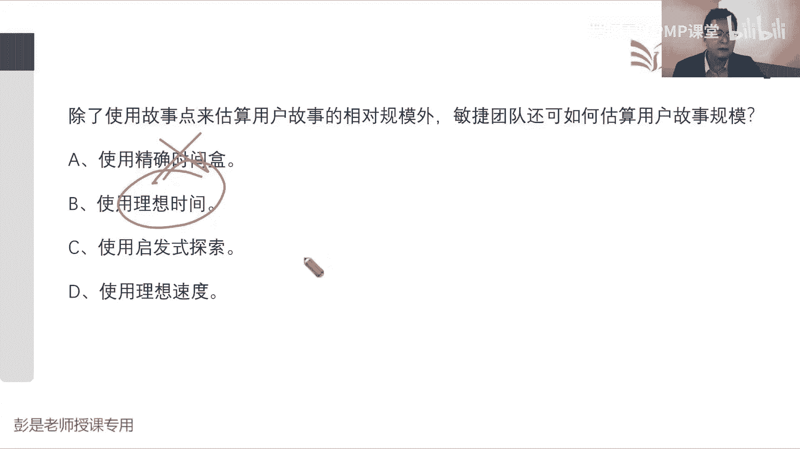

没有那么多，为什么啊，好那再往下说这种按需进度计划，这种方法通常用于看板体系，基于制约理论和来自精益生生产的，拉动式进度计划，根据团队的交互能力限制团队正在开展的工作，这能想到什么了。

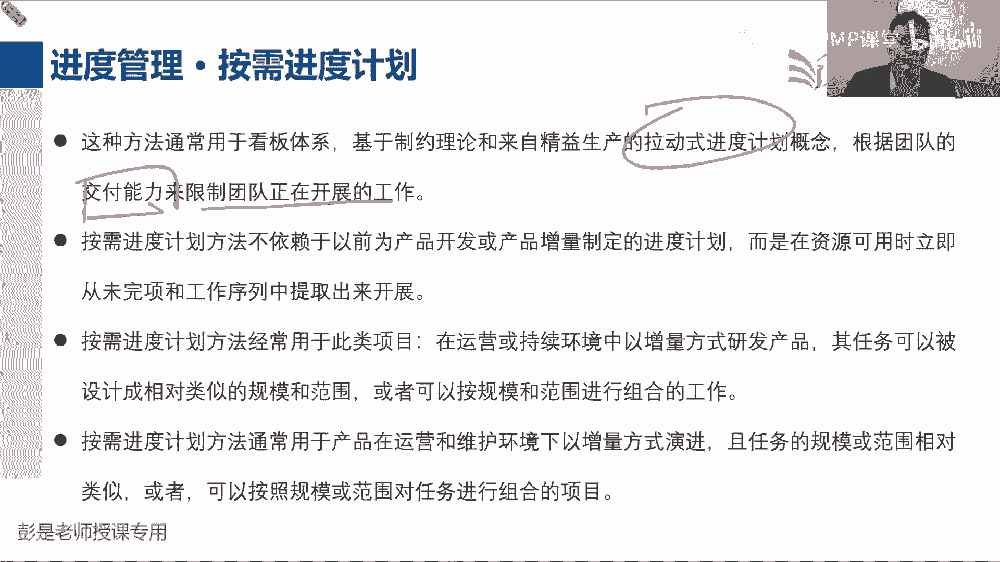

想到场景，想到场景，为什么要根据团队的交互能力，限制团队正在开展的工作呢，因为呀要干的事这么多大需求，持我们的迭代周期又是固定的，比如说是两周，我们约定两周迭代一次，那两周能干多少活呢，诶原则就来了吧。

贪多嚼不烂的，对不对，如果两周我们能够完成100个故事点的工作，那我们网过班需求的时候就不要超过100点，对对这两周我能种100棵树，那搬需求的时候就不要让它大于100，因为干的多，第一不一定是好事。

第2万1万1工作完不成呢，诶产了一个半成品，这也不好啊，第三实际工作中，大家或多或少都有一些非生产时间，非生产时间是什么，是什么呢，你开会沟通交流什么，本部门的其他事项，什么报销，以此类推啊。

通常会有一些时间不再干活儿，所以就宁缺毋滥，能干多少干多少，宁可少也不要多，这是迭代规划，迭代规划我们要考虑的事情，就避免贪多嚼不烂这样的现象啊。

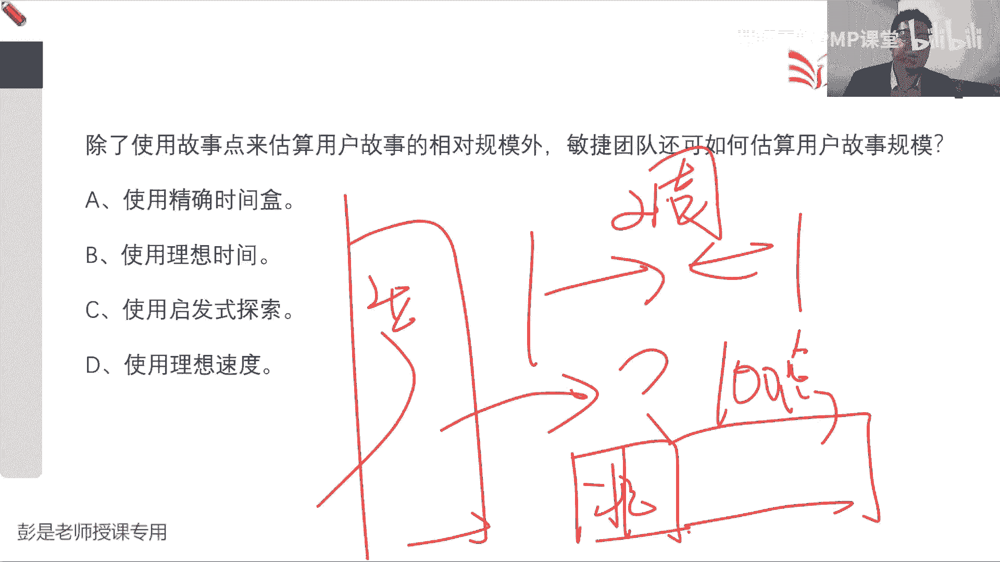

好所以就是根据我们的交付能力，限制团队正在开展的工作，按需进度计划，方法不依赖于以前什么什么制定的进度计划，而是在资源可用时，立即从未完项和工作序列中提取出来开展。

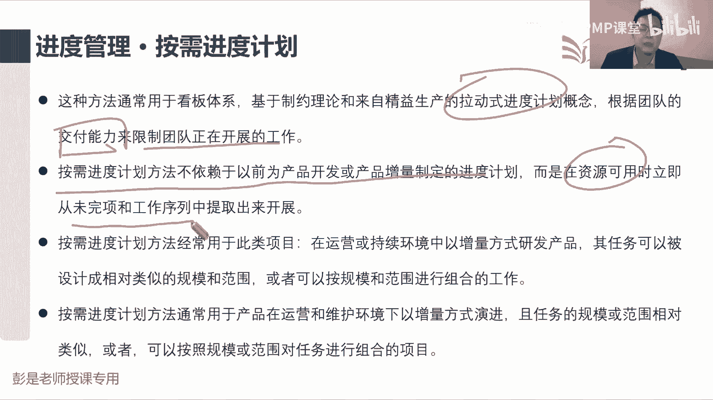

刚才也说过了吧，我们敏捷环境之中，敏捷环境之中最后迭代待办事项，迭代待办事项，就是小需丢时会得到一系列的任务，会得到一大堆的任务，这些任务啊没有人去分配的，是大家主动主动，有主动性啊，眼里有活啊。

对张三现在在开展任务A任务A完成之后，张三去看看，去看看列表里边从里边主动领取任务，就这东西吧，所以叫资源资源资源没事干的时候，去主动找任务，找活干，嘿就刚才这句话。

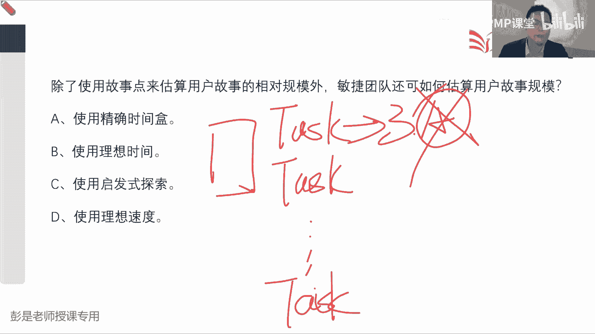

所以资源可用时，立即从未完项和工作序列中提取出来开展，这就叫拉动式进度计划，说我们在运营持续过程中增量式的研发产品，它任务啊可以设计成相对类似的规模和范围，或者是可以按照规模范围进行组合的工作。

说任务可以被设计成相似，相对类似的规模和范围，是什么意思呢。

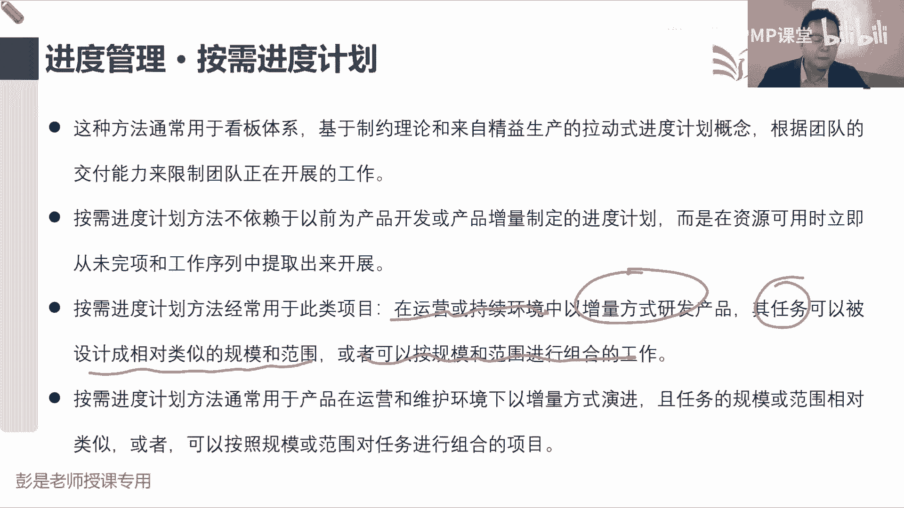

最理想的模式啊，就是每天都有成果产出，这是最理想的模式了，因为我们追求的是像流水线一样，持续的稳定的输出，所以这些任务啊，包括我们的用户故事，它的规模，它的颗粒度要保持保持，最好的就是大小是一样的。

对大小一样的吧，就像生产线，生产线生产矿泉水，每瓶水的容量都差不多，不要一会儿生前一瓶是一升的，第二瓶是什么，100ml的，第三瓶是5L的哇，这生产线就疯了就疯了啊，最最好的就是持续的稳定的产出。

相同品质的产品服务或成果，所以我们的这些故事就是功能用户故事，他要保持保持最好的就是颗粒度都差不多，对齐颗粒度流行的话啊，好又搞定了。

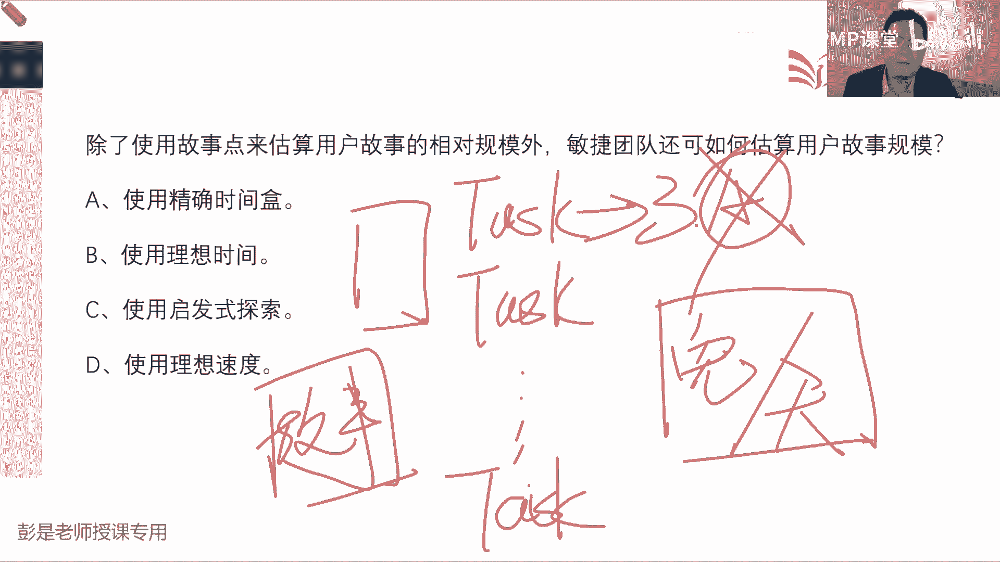

那我们这种方法通常在产品和运营维护下，以增量的方式演进，只要任务规模和范围相对类似，巴拉不点好好。

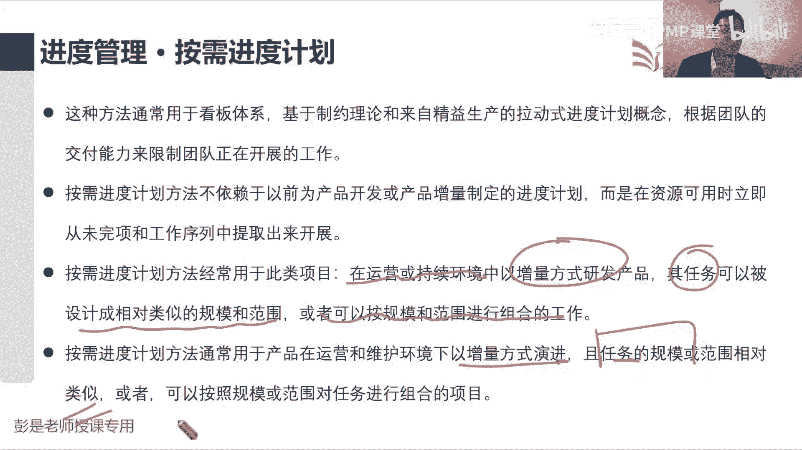

所以带到看板里面，带带到这张图已经看不出什么东西了吧。

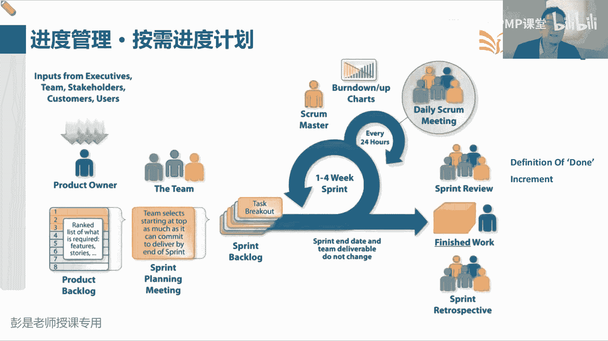

所以需要加一个小小的知识点，就是看板，看板是什么东西呢，叫过程流程可视化，因为我们得到一系列的任务，左边就是我们的任务列表，这些任务里边准备好之后，大家主动领取任务，张三把这些任务拉走。

然后完成之后放到开发完成这一列里，张三现在闲着再去领下一个任务，完成一个扔一个，完成一个扔一个，就是流水线，制造业流水线源源不断，源源不断的，所以大家有没有看过那种刷抖音，刷快手刷视频。

看到那种流水线流水线上工人怎么干活啊，上面有源源不断的产品在传送带上传送，我们旁边是我们的员工，大家主动领取任务，完成一个再领一个，完成一个领一个就借鉴了这个工作模式，就有了看板。

他能够看到所有任务的流动情况，哪些任务在开发中，哪些任务开发完成，哪些任务在测试中，哪些任务测试完成就叫过程可视化，以便于及时的发现问题，障碍阻碍对吧，比如说咱上课举个例子啊，这活儿原计划三天应该完成。

现在呢根据监测四天了，还在这还在开发中，这不就是发现它堵了吗，对不对，发现它堵了吧，诶那我们要想办法想办法排除这个阻碍，让我们的流水线能够顺畅的持续的继续，继续持续的稳定的输出好，这就是看板。

它的主要考点就是第一第一过程可视化，便于及时的发现障碍，那第二我们刚才本着贪多嚼不烂的原则，就需要设置再制品限制WIP，我们现在开发开发这边有三个人，那我就设置开在这边限制就是三，当三达到。

当我们正在进行中的任务达到饱和以后，达到WIPWIP这个限制之后啊，就左边的东西呀不要再过来了，因为已经塞满了，就像地铁公交车不都这意思吗，对不飞机一共就100个人，塞满了以后就不要再上人了。

不然有风险呐，诶贪多嚼不烂啊，所以以此类推，系统测试里边我们的再制品限制上限是二，达到二之后，左边的东西就不要再进来了，不要领取任务了，等右边出去一个再进来，一个出去一个再进来一个以此类推。

这就是再制品限制，让大家知道，大家知道我们每一列每一列上限是多少，那么达到在制品限制之后，我们就不能把工作从左边提取到下一列，这是第一个考点，第二个考点，第一个考点是过程可视化，它的主要作主要功能啊。

主要作用作用好，那第二个考点是什么呢，如果我们发现这个任务啊，原计划应该三天就跑到右边去了，结果现在发现哪四天还没动，说明什么呢，说明堵了，怎么办，说明卡住了，遇到障碍了，遇到了阻塞了怎么办。

哎就带出来一个单词蜂拥模式，对不，此时团队就要从最右边利军列中提取工作，并提出问题，作为一个团队，我们是一条线上的蚂蚱，对不对咳，作为一个团队，我们应该怎样做，才能把这个玩意儿尽快的往右边挪呢。

哎就采用这样一个单词，一个术语叫蜂拥模式，一拥而上就参考了蜜蜂这个特点啊，对不对，蜜蜂有分工，但实际上蜜蜂受到攻击之后，蜜蜂受到攻击之后就没有分工了，大家都是兄弟并肩的上啊，一起群殴啊，就这道理吧。

好那我们是一个成熟的自组织团队，还希望大家都是跨时能的通才，那我们就希望大家发挥你的经验诀窍技巧，帮助他尽快的让这个任务流动下去，所以提倡的是蜂拥模式，尽快的尽快的解决这个问题。

这也是制造业给给出来的最佳时间，制造业我们在源源不断的生产新能源汽车，发现这个车唉，现在有问题怎么办呢，生产线停，它实际上是停的吧，它有根红色红灯吧，安登那种东西一停，然后大家蜂拥而上。

想办法尽快的把这个问题解决掉，让我们的任务能够及时的流动下去，好这就是这个知识点啊，看板看板实践就这么三个知识点，过程可视化，便于及时发现问题，发现问题蜂拥而上群殴。

然后呢还有一个在制品限制贪多嚼不烂搞定，好我也不知道他们为什么知道这么多，但是呢他们应该是要想人前显贵，就得背后受罪，对不对，应该是不少同学花了大量的时间去看书，去听课。

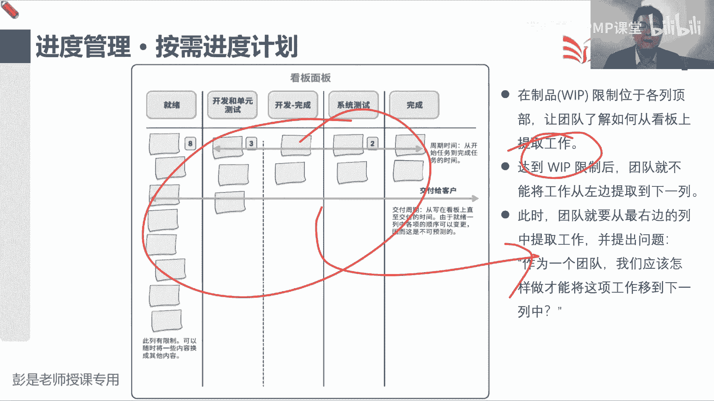

去看书去听课，好那看看这道题没学到的同学，马上这个债呀，赶赶快还呐，这道题选啥抄简单了吧，说会顾问，有人说我们活儿太重了，有太多正在进行中的工作了，最好怎么做呢，就C了吧，尝试设置再次品限制。

避免贪多嚼不烂，对不对，所以想疫情期间做核酸不也有在制品吗，采样的护士一次只能给一个人采样，对不对，不要一心多用啊，同时来五个人风险高，对不对，一心多用干不好，还有扩散扩散的可能性诶。

咱就专心致志的采样，完一个下一个采样完一个下一个，这道理都一样哈，提倡的就是专注，尽量的减少多任务之间的这种切换，切换也是浪费。

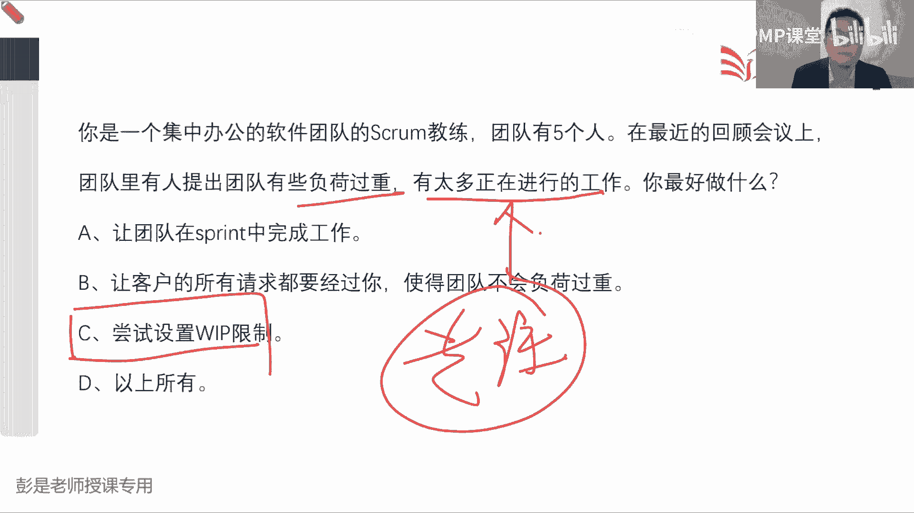

好这道题呢，剧透了，刚刚才讲完了，54321快速给答案啦，亲刚讲完的一个关键资源，在项目之间轮换来获得更多，来获得更多的什么知名欲啊，赞誉啊，那么随着工作越来越多，这已经是个负担了嗯。

团队领导应该怎么做呢，还记得上课写那个红色蓝色，红色蓝色来回切换吗，这浪费浪费，对不对诶，专注专注专注，所以专注这个知识点最粗暴理理解的场景啊，你就想想你最最讨厌的那种人，什么海王渣男。

脚踏脚脚踩八条船，这是垃圾，我们要尽量的减少这样的行为，专心致志，一心一意，对不对，精益求精啊，不浪费呀好，所以要求管理层，确保这个人一次只能在一个项目中可用，就是A就是B了。

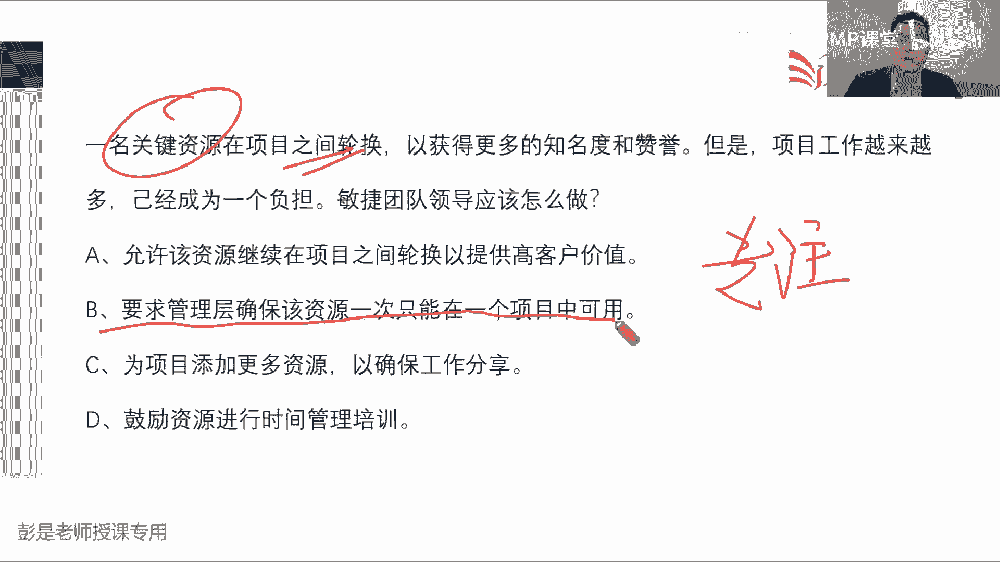

那再往下就是前两天有道题吧，说短视，什么叫短视呢，刚才我们讲的都是短视，都是思考这活到底怎么干，对不对，这是短视，鼠目寸光，那咱干活不能短视啊，不能鼠目寸光啊，还要高屋建立，对不对，还要知道方向。

就带出来敏捷发布规划这个知识点，他要告诉我们产品的愿景是啥，这是滑板车，摩托车小汽车，然后他可以帮助我们设定产品路线图，滑板车摩托车小汽车，对每个每个版本的产品有什么样的功能。

这是滑板车第一版发布滑板车，第二版发布自行车，第三版发布摩托车诶，这是产品路线图，确定了产品路线图就可以敲定时间了，多长时间滑板车做出来多长时间完成自行车，多长时间造出一个摩托车。

时间一出来就叫发布计划，什么时间发布第一版，什么时间发布第二版，什么时间发布第三版，他就为我们指明了工作方向，让大家知道未来我们这个产品是个什么鸟样好，这就是高屋建领对，这就是敏捷发布规划。

制定进度计划的工具，敏捷发布规划放到那儿去了啊。

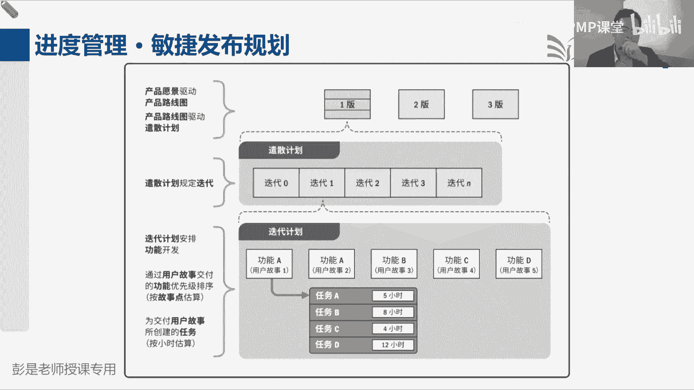

好那再往下看看还有啥吗，这个是干啥的，这个这个是干啥的呢，燃尽图，燃尽图跟踪余量吧。

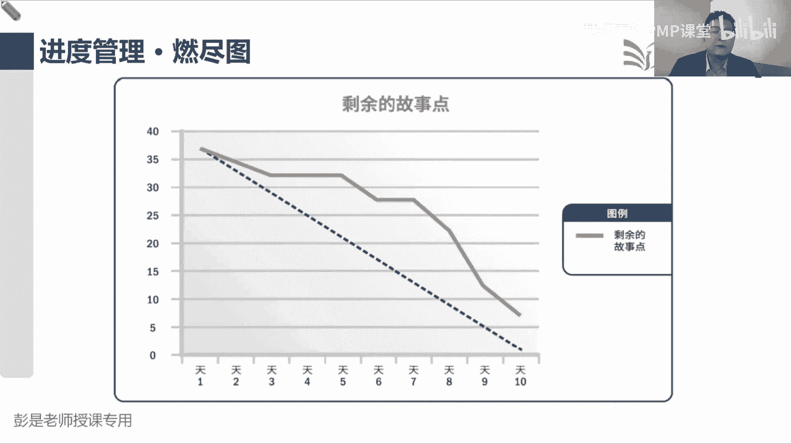

我们去想一想啊，等我换一个空白的地方啊。

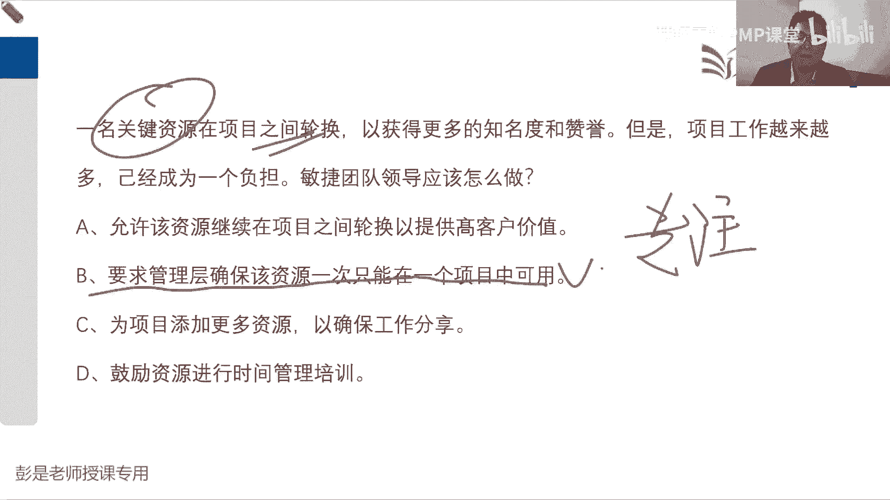

就就就就在这写了啊，每次迭代的周期一旦确定，我们又知道这次迭代能干多少活，就是工作量吧，能干多少活儿，然后把需求搬过来，分解成一大堆的任务，理想模式下，理想模式下这些东西，它的规模应该都是差不多的。

那我们知道了这些任务的工作量就知道了，这次迭代要干多少活，就可以看看持续的跟踪，持续的跟踪哪些活儿完成了，哪些活没完成，就可以用燃尽图跟踪这种剩余的东西，对不对，想减肥可不可以用燃尽图呢，可以啊。

这个月这个月我打算减肥十斤，每天减它个三斤五斤的，以此类推，就可以画一个燃尽图，所以只要是跟踪余量，都可以用这样的工具技术，对不对，这个月的生活费十块钱，我看看每天花五毛钱，看看计划和实际情况是什么样。

是什么事实，有没有出入，有没有偏差，所以中间这条虚线就是我们的计划，实心的线呢就是实际情况，这个和正值分析那个S曲线是不是异曲同工，S曲线我们跟踪的是钱，对不对，随着时间的推移。

我们用钱来去评价完成了多少工作，应该完成多少工作，实际完成了多少，现在我们把它换一个计量单位，换成故事点，对不对，仅此而已啊，那通过这张图我们就可以发现了，哎中间这条横线是什么意思呢。

中间那条横线是什么意思呢，这两天啊剩下的工作应该变少才对，但是呢现在没少，对不对，说明卡住了，这样我们通过这张图就可以及时的发现，任务流动出问题了，所以它的本质就是跟踪看板，就是跟跟踪看板吧。

看看我们这些任务，这些任务诶哪些顺利，哪些不顺利，另外它还可以做第二个事情，做趋势分析，因为根据目前这张图形的预测，对不对，就可以预测一下这次迭代啊，好像干不完，做趋势分析，所以实际情况如果在右边。

可能意味着活儿干不完，如果实际情况在左边说明什么呢，可能会提前完成哎，说明我们估算的时候比较保守，这就是燃尽图。

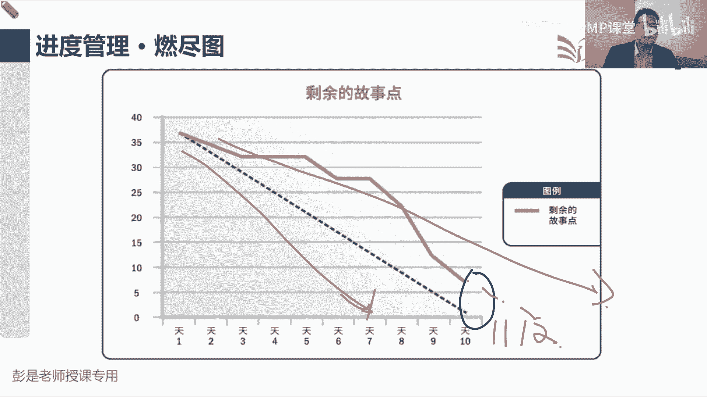

燃尽图换个方向就变成燃气图，对不对，算增量算增量对吧，我想每天捡矿泉水瓶，每天赚他十块钱，画一条线，然后十天以后应该赚100块钱，接下来画实线，看看实际情况，一个道理吧，这三天没赚钱，钱没增加。

卡住了一个道理啊，所以他俩的用法实际上是一样的好。

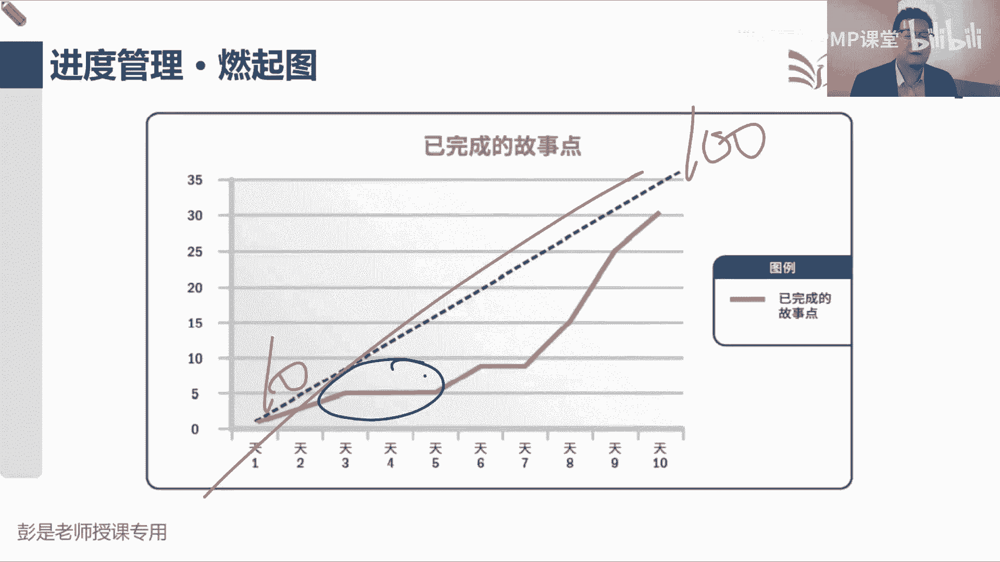

再往下我们就可以画各种各样的燃尽图，燃体图，故事点是用来估算工作量的，对不对，一个功能需要多少个故事点，一个功能需要多少个故事点，微信聊天需要十个故事点，微信发表情包约需要50个故事点。

体现体现它的规模，那我们还可以跟踪功能的数量，就有了功能，燃定图功能燃气图都可以用啊，想怎么用就怎么用，好之后的话可以用刚才前面那道题，这么快就忘了，这么快就忘了赶工不赶工啊，咱不提倡加班。

不不能不提倡加资源，能干多少事多少啊。

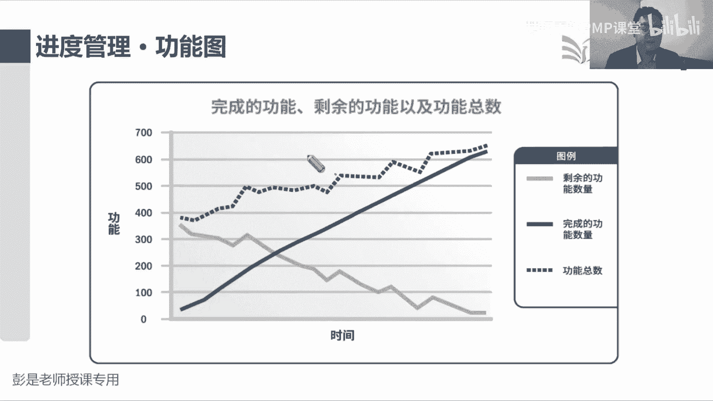

干不完再说，对不对好，那再往下到了，成本管理敏捷有什么有代表性的知识点吗，成本管理敏捷有什么知识点，快速回顾了，嘶好像没啥没讲到吧，传统项目我们是规划成本管理，估算活动成本，制定项目预算，然后控制成本。

然后用政治分析监督项目的成本成成本，绩效进度，绩效敏捷好像没有提到，对不对，所以呢这一章在敏捷实践之中，他轻规划啊，他就不写了，记住啊，我们提倡提供的是一个轻量级的框架，对不对，他不写了不写了不写了。

他就告诉我们，在敏捷里边也可以用政治分析，应该完成十个故事点，实际上完成了八个故事点，说明比原计划完成的工作少，这不就是EV和PV吗，一样的，对不对，就是计量单位的变化，仅此而已啊，应该种十棵树。

实际上种了八棵树，少种了两棵树，就是计量单位的变化，所以该怎么用还怎么用，它成本管理就不写了，所以约等于没啥，约等于没啥好，那质量管理传统项目说我们关注过程的质量，关注结果的质量。

敏捷12个原则是不是也说了，我们不仅仅关注结果，我们也关注过程了，对因为我们精益求精嘛，我们一定要打造出可以使用的产品服务或成果，Nice，接下来敏捷敏捷敏捷看啊，看它的结构。

产品代办事项迭代待办事项和最后的增量迭代，然后呢迭代最后两个会，一个是评审结果，一个是回顾过程，诶我们有了过程，对不对，回顾过程相当于PDCA的那个A，相当于我们传统项目管理质量进行过程的改进。

过程的优化，评审呢是看结果，相当于传统项目的确认范围做验收，那他相当于确认范围做验收，测试去哪儿了，指控去哪儿了，刚讲完测试在哪呢，这么快就把看板给忘了，这么快就把看板忘了，看板是干啥呢。

哪些东西在开发中，哪些东西开发完成，哪些东西测试中，哪些东西测试完成，贯穿始终，对不对，测试在过程中干完就测，干完就测试，干完就测试，他把指控放到了放到了看板里，是说我们每天完成工作，每天完成对吧。

完成工作就要测试，完成工作就要测试，他是放到了任务，放到了任务里，测试是我们的任务之一，要做一个滑板车，坐完了滑板车，你不得测一测这个东西好使不好使吗，唉然后就可以根据可以使用看板，监控我们的开发任务。

测试任务，他的执行执行情况，所以其实我们也关注过程的质量和结果的质量，对不对，它和传统项目那个五种水平道理是一样的，质量的五种水平记得吧，好所以看看啊。

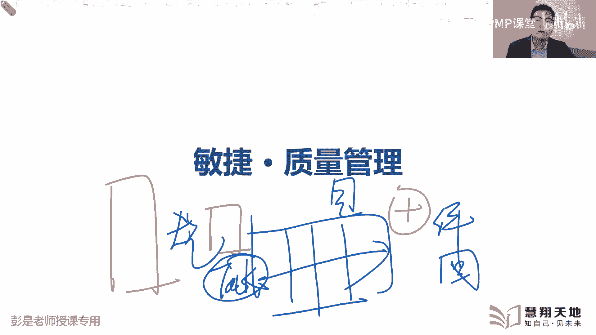

就这么几句话了，我们需要在项目期间频繁的开展质量和审核，步骤，怎么频繁呢，完成一个测试，一个完成一个测试，一个哎贯穿始终了，另外我们还要不断的不断的看结果，做评审，对不对，还要不断的改过程做回顾。

而不是在项目结束时才进行这个东西，持续开展，持续开展，所以我们需要循环回顾定期检查过程的效果，就是在带出来那个回顾会了吧，然后进行过程的改进，那为了促进频繁的增量交付，我们关注小批量工作。

纳入尽可能多的项目，可这和交付成本的要素，小批量的目的是什么呢，就是因为，尽早早发现有没有问题。

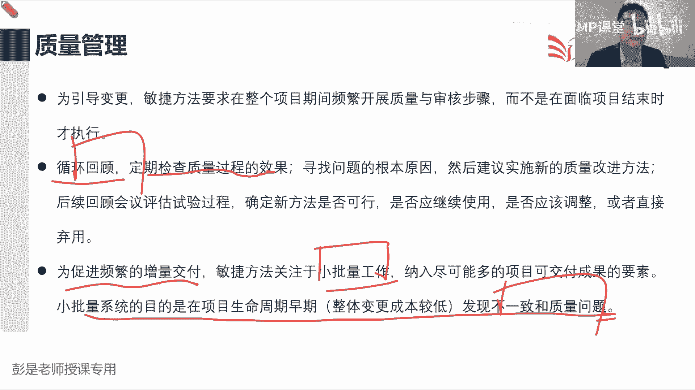

早发现早治疗，早康复好，他其实没什么东西啊，前面都讲过了。

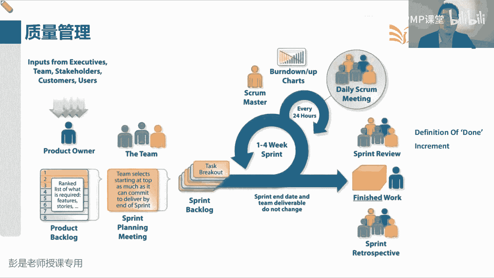

那看看这道题，看板上能看到指控任务的执行情况，指控是任务是任务啊，这个简单吧，这是没得商量没得商量，最低要求是一定要可以使用，我们追求精益求精，对不啊，解决方案技术精益求精，精益求精。

这个东西质量最好不要出问题，一定要保证可用性，以便于真实的获得客户的反馈啊，所以呢答案就是B没错啊，质量没得商量，没得商量，没什么好说的。

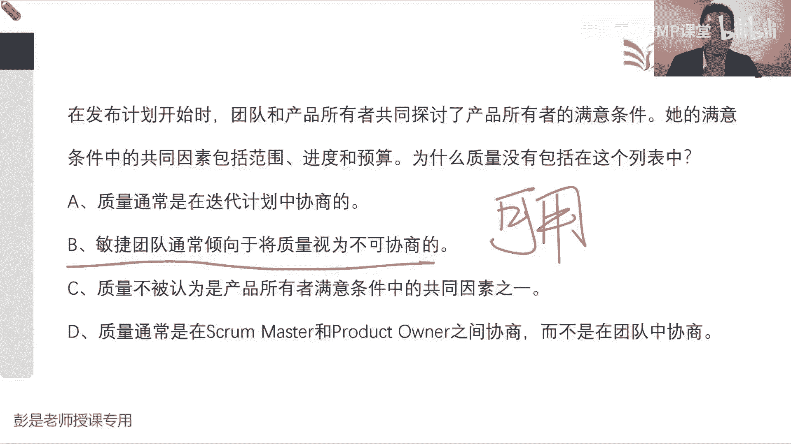

那资源管理敏捷里面想一想提到了啥，传统项目咱是规划资源管理业，画组织架构，责任分配矩阵文本型，然后想一想这些人怎么配备啊，招聘啊，培训啊，遣散啊，奖励啊，表彰啊，以此类推，比里吧啦一大堆。

再想一想物资怎么管，接下来我们估算资源，然后建获取资源，建设团队，管理团队，最后呢管物资敏捷里面资源没怎么提吧，就说了三个人，对不对，就告诉我们三个角色，我们要想办法打造一个成熟的自组织的。

通才的跨职能的团队，这样呢我们就授权你们自己玩去吧，PO负责做啥，开发团队负责怎么做，我们需要一个热情的服务员，就说了这么多吧，具体怎么管，没说没说啊，怎么管搞。

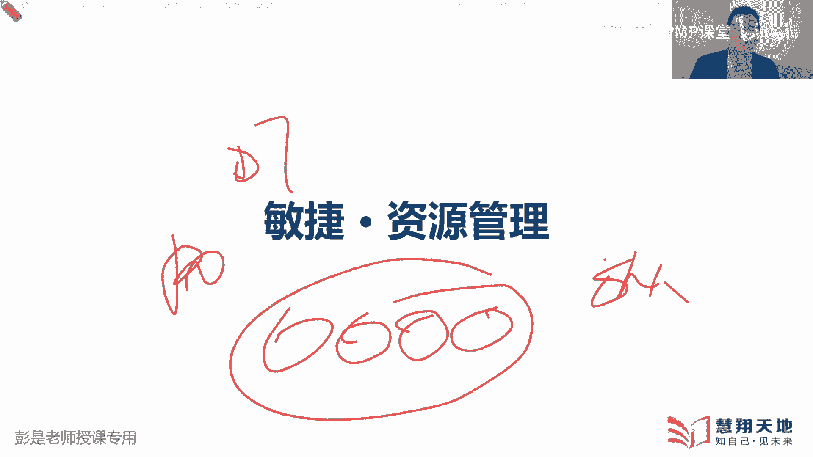

怎么搞团建呐，怎么培训呢，不说了，好轻量级啊，所以就这么几句话了，随着敏捷方法在it项目中应用越来越普遍，自组织团队不需要集中管控越来越多，那么对于这组织团队，可能就没提到项目经理这个角色，对不对。

可能叫项目经理，也可能是敏捷教练，也可能叫团队促进者，也可能叫什么什么团队领导，总之啊需要这么一个人，就是决策，他的主要工作任务就是为团队创造环境，提供支持，并信任团队，可以完成工作，他服务员啊。

那成熟的自主自组织团队通常由通用的专才，不垫了吧，通才那异变性高的项目，得益于最大限度的集中和协作的团队结构，这是什么呢，最好集中办公，大家都是兄弟平起平坐，没有什么上下级呀。

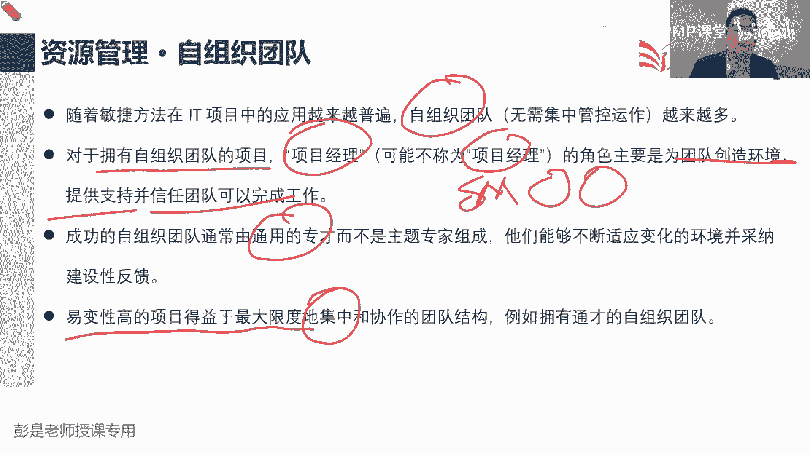

好就这么几个知识点啊，所以资源管理约等于没啥。

那做做题，好简单了吧，所以恭喜大家答对了，答案就是B斯通过允许他们自己达成解决方案，在项目的自组织框架内工作，自组织框架框架是什么意思，就是权力交给你们了，你们自己做主啊，就是B了啊。

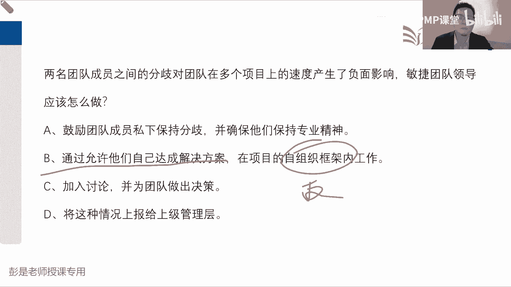

好那敏捷沟通说了什么东西呢，传统项目我们规划沟通管理，我们要考虑什么沟通需求，沟通风格，沟通渠道，然后定沟通计划，考虑沟通的复杂性，我们需要提前把沟通的方方面面给他说清楚，什么时间发周报，怎么发。

发给谁写什么，用什么文字，用什么语言，用什么格式，以此类推啊，然后接下来按照沟通计划去落实去执行，最后呢看看沟通好不好，对T可解决沟通的问题，改进沟通，改进沟通，那敏捷里面关于沟通提到了什么东西呢。

诶有一个东西叫信息发射源，还有印象吗，信息发射源，信息发射源我们要透明啊，我们要透明沟通啊，对不对，信息发射源就包括了你所有认知的，有的那些单词啊，产品代办事项，迭代代办事项，看板燃尽图，燃体图。

停车场去，它们共同构成了信息发射源，对这样呢，别人一看这个项目，这些东西就可以及时的了解项目的情况，并且呢信息发射源我们用的是什么沟通方法呢，咱们有互动式，有推式，有拉式，我们信息发射源就是一堵墙。

就是一堵墙啊，这叫拉式沟通吧，大家随时随时随时看看这面墙上，整个项目的情况，就可以了解目前项目的状态了诶，透明沟通，拉式沟通就这些东西啊。

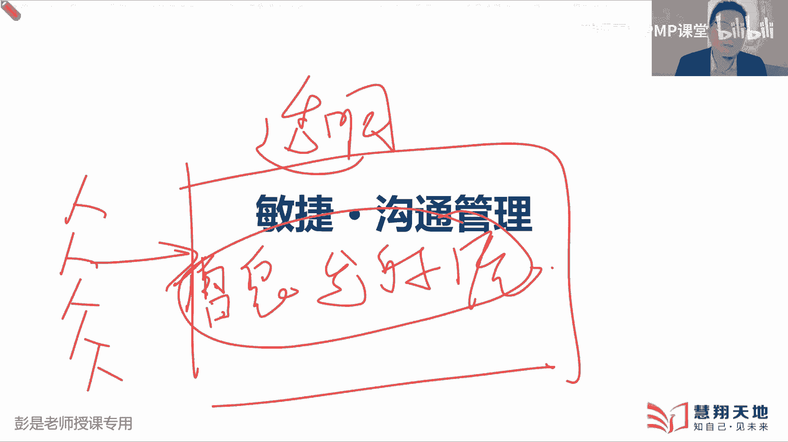

所以就这么几个东西，在模糊不定的项目环境之中，必然需要对不断演变和出现的细节情况，进行更频繁和更快速的沟通，那怎么频繁怎么快呢，第一在一起在一起，第二简化成员获取信息的通道，因为沟通渠道越多。

可能导致信息失真，那我们要简化渠道，简化渠道，所有内容都在这面墙上了，就这么一个渠道，想看自己看对不，所以就像好多企业什么好多政府网站做官宣，做官宣对吧，你不要一会抖音啊，微信啊，快手啊，到处去看呐。

看官网啊，以官方官方网站的正式通知为准，这不是简化沟通渠道吗，防止有人什么唉常事，有人什么添油加醋对吧，歪曲事实，以偏概全，就这意思吧，好然后再往下就是说，那为了促进和各个各个人各个人的沟通。

我们要以透明的方式发布项目空间，并进行邀请大家评审项目，供电就是透明沟通，所有的东西都在这了，产品代办事项，现在迭代的计划，迭代过程中，看板包括干得到了什么成果，包括目前燃尽图燃气图项目的状态。

包括我我们一些什么问题呀，重大风险啊，停车场区都在这了。

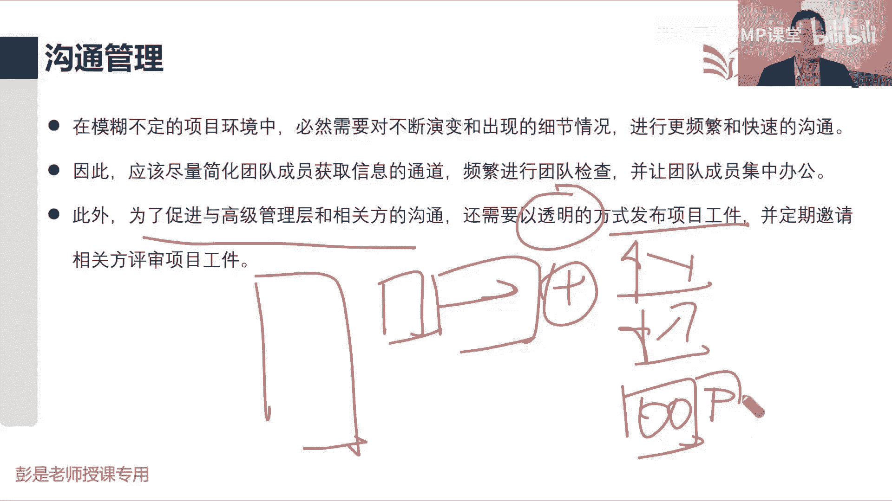

哎就这么几个单词啊，好好再往下。

这是信息发射源燃尽图，燃体图，迭代代办事项，产品代办事项，包括我们的看板，所有的东西都在这一目了然。

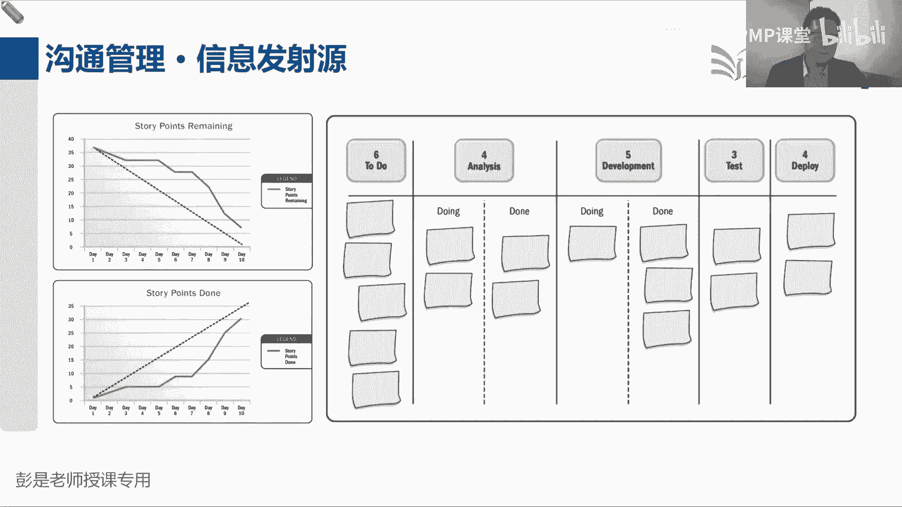

那做多题，嗯哼，D上来就排了，都不用考虑啊，都不用考虑啊，一定要用啊，所以呢答案是A，答案是A呀，敏捷的题不一定只考信息发射源，它考核的知识点和沟通那一章一模一样，那我们在地理上分散在世界各地。

这是一个分布式团队呀，这是一个分布式团队呀，对不对，虚拟团队呀，有人在欧洲，有人在美洲，有人在亚洲，哎，那你不得考虑时差嘛，语言文化差异这种东西吧，所以就是A，都不用考虑是否要使用信息发射源啊。

只不过这话怎么说才对呢，怎么说才对啊，你要考虑这个信息发射源是用物理的，还是用电子的，对吧，物理的是什么呢，就真的是一面墙，还记得那个低科技高触感吗，就真的是一面墙啊，把我们所有的东西贴墙上了。

大家随时可以看呐，那这是适用于集中办公这样的场景，那如果大家不在同一个地方怎么办呢，实在不行，用用软件呗，对不对，好多好多团队都好多企业实际实际工作中啊，实际工程中也不用软件，用个摄像头。

还记得一个鱼缸窗口吗，用个摄像头对吧，实在不行，弄几个高清摄像头，随时照着这面墙啊，大家可以及时的看到，及时的看到这面墙，以此类推了好，总之方法总比问题多，方法总比困难多，都不要考虑是不是要用啊。

肯定用啊，好所以建议的答案就是A了。

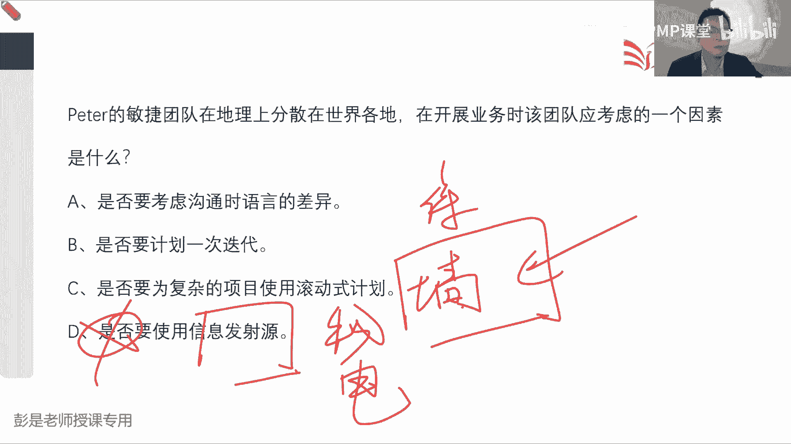

对不用考虑啊，一定要用啊，好下列哪一个选项是对信息发射源的定义，这简单哈，说明项目状态相关数据的直观表示就是D了，所以再唠唠一句啊，传统项目我们定期的监控项目工作，除项目的工作绩效报告。

定期定期时效性差，不及时，在这种敏捷多变的环境下，它效率不行，还记得那个西瓜项目，所以我们需要及时的实时的发现，发现项目的情况，对了解项目的情况，及时的发现问题，及时的发现阻碍，早早发现，早治疗。

早康复，早解决好，所以就是燃地图，燃体图，包括看板，他们都可以提高这个时效性及时，那这种东西直接直接让人家能够直观的看到，这不是更好吗，这叫透明沟通信息发射源好。

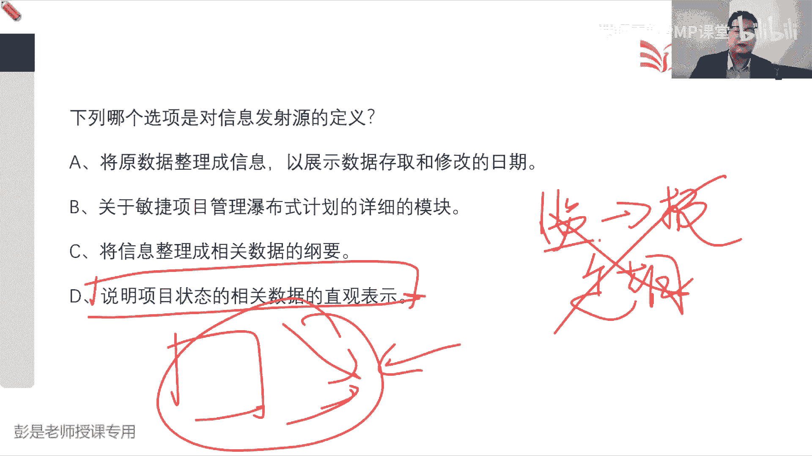

这个题呢，这也送分题吧，可以过了吧，墙上展示是敏捷中常用的方法，包括燃气图，燃体图。

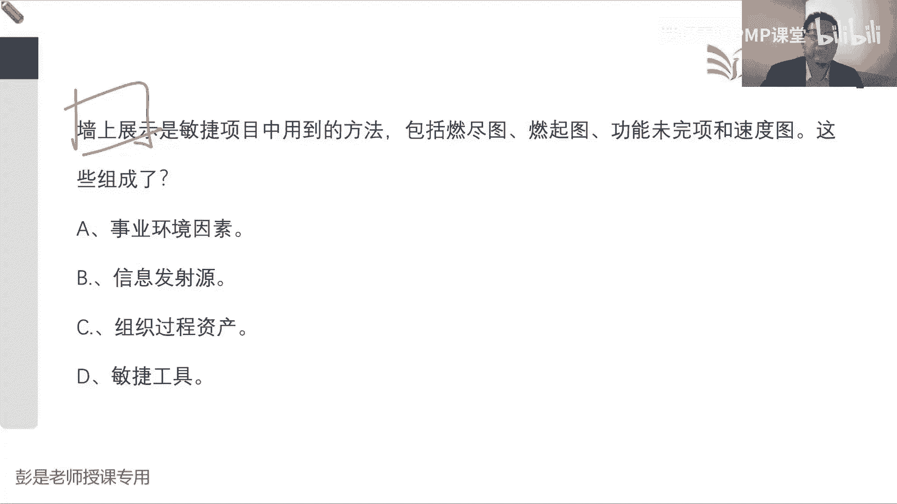

巴拉拉，这是信息发热，看这是B了，所以没啥可说的啊，好封建管理敏捷里面说什么了吗，传统项目规划，风险识别，风险定性分析，定量分析，规划应对，实施应对和最后的监督，风险敏捷里边没咋说，为什么呢。

他就是来解决这种高风险对吧，什么创新项目，高风险项目不确定的项目，以此类推啊，它存在的目的就是想办法尽量的帮，尽可能的帮我们降低风险，所以他风险那段没有没说什么识别风险，定性分析啊。

那实际在敏捷环境之中，要不要开展这些管理过程呢。

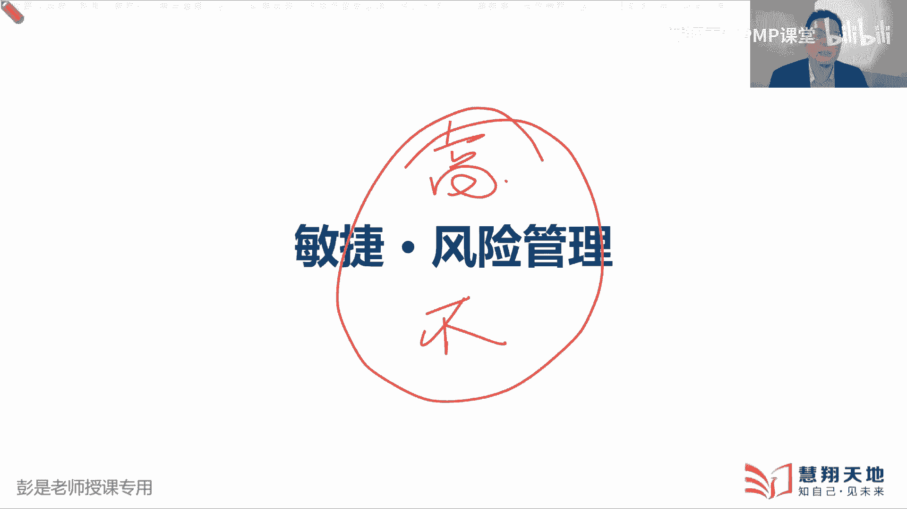

需要需要啊，该干啥干啥，所以约等于没啥，这段文字我也不念了吧，什么风险不确定，什么，加快知识分享，888不念了啊，该咋管咋管，该咋管咋管，该咋管咋管。

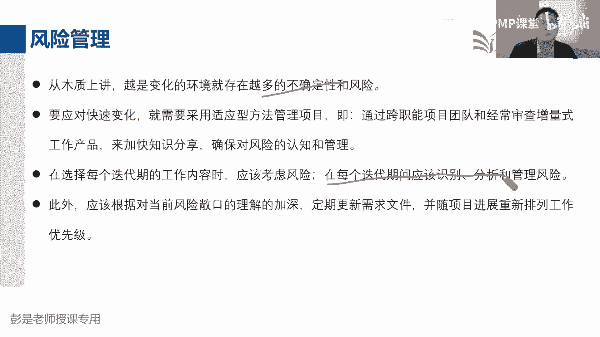

每个迭代期间，我们要识别分析和管理风险，以此类推了，没东西啊。

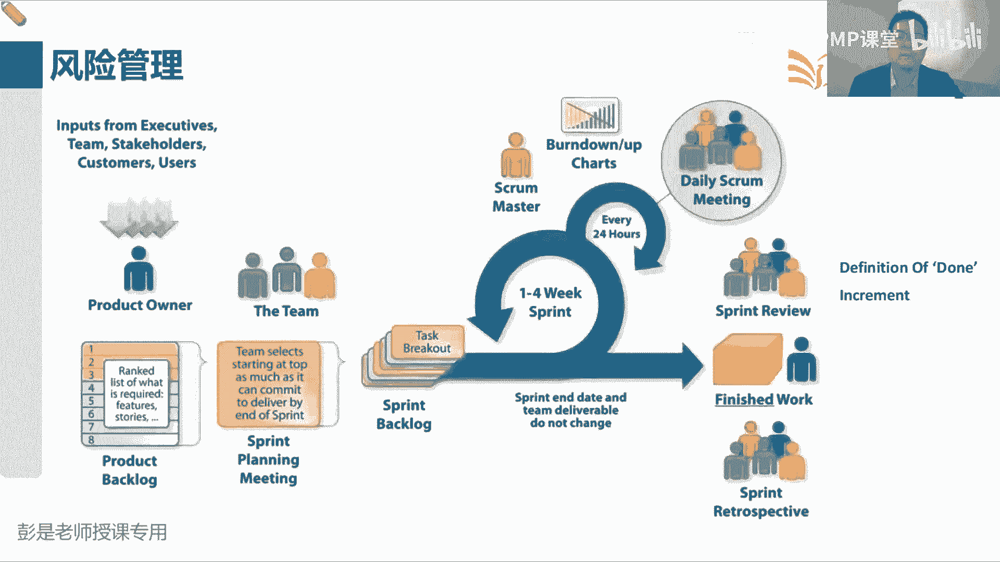

看看这道题，那个SPG还没讲到呢，还没讲到呢啊，又A了吧，说一个敏捷团队，认识到两个发布层面的风险，和四个迭代层面的风险，如果要让相关方清楚了解这些情况，清楚了解这些情况，这是哪个知识领域呢。

其实是沟通，对不对，那怎么做呢，哎我们主打一个透明，主打一个透明，然后有一个信息发射源，需要大家及时的看到这些玩意儿，所以就是A在一个可见的看板上，记录风险和问题，让全体成员通过相关方都能够看到。

就是A了，是让相关方清楚地了解风险的情况吗，是让相关方清楚的了解问题的情况吗，不是吧，所以D不对。

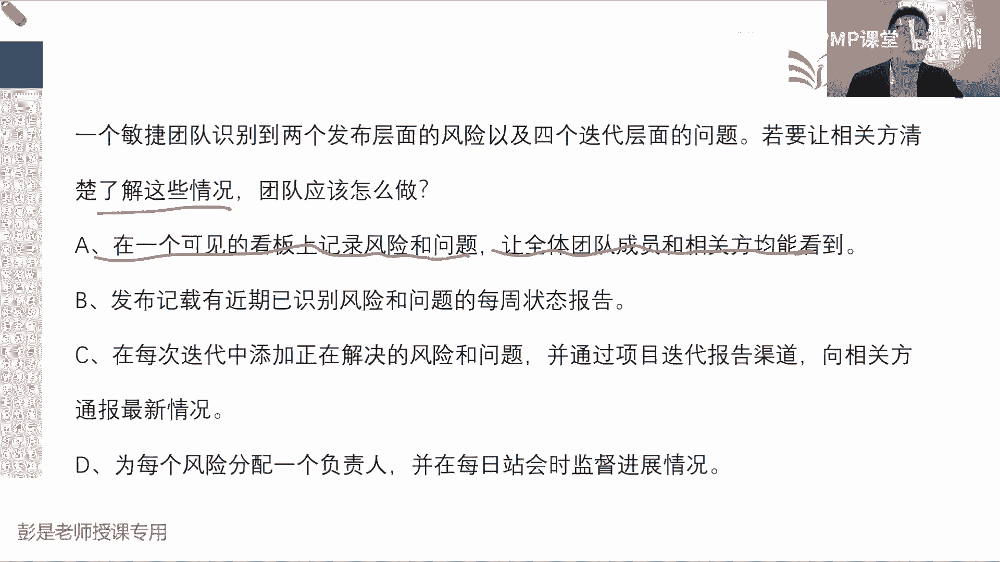

说我们会尝试创建一些特殊的任务，让团队研究一研究一些方法，来解决高风险的技术设计问题，这种特殊的任务是什么呢，牢牢的记住这个单词代表的意思啊，像spike刺探，有的时候呢也可能会被翻译成探针，就想场景。

古代人想看看，请看看菜里有没有毒，拿根银针试一试，试一试，就这意思啊，当我们的一些工作存在着不确定的时候，存在着不确定因素的时候怎么做呢，我们允许团队在迭代中，在迭代的过程中去创建一些探索性的工作。

就是进行刺探知识有没有毒，对不对，就这意思啊，所以答案就是D，为什么不选A呢，这个专业术语就是D啊，需要我们记住这个专业术语，哎模拟康同学说的很棒啊，咱上课也说了吧，输液输液对吧，去医院看病。

人家输液之前为什么要做皮试呢，这不是基于风险的spec吗，对我们允许团队去做皮试啊，做皮试哈，看看有没有风险，没风险了，再确定最终的解决方案，那可不可以创建多个SPECT的，当然可以啦，左手打一种药。

右手打一种药，哪个没哪个反应小，就用哪个药，对不对，多任务swag都可以的啊，总之这么做，这么做仍然是考虑最小的代价去探索，最小的代价去试错，对不对，稍稍打一丢丢就可以了，没必要打一管，就这意思啊。

没有D选会选A吗，没有D也不会出了，这道题没有D也不会出，就不会这么出。

考的就是这个专业术语实在没得选，也可以选A呀，好那再回顾敏捷里面采购说了什么呢，传统项目咱规划采购看看有啥可买的，然后写一大堆东西吧，找不了文件，SOOW必须公开选购标准，预算发给第二个同事。

招标投标评标中标签约选卖方签合同，然后呢看看合同的执行情况，控制采购敏捷里边这买东西该咋买咋买，对不对，没有什么特殊的啊，所以约等于没啥nothing，没有什么没有什么单独的东西，没提这些东西吧。

那相关方管理有什么东西吗，单传统项目识别干系人规划，干事人参与管理，干系人参与监督干人人干型人参与识别是分析，打标签，排除分组排序，规划干型去分析他们的参与度，管理参与管理，参与持续开展，持续开展诶。

他就提到了一个持续开展吧，就是因为在这种多变的环境下，大家都是一条线上的蚂蚱，你们需要持续地参与到项目之中，不要当甩手掌柜啊，要不然我们可能在错误的道路上就越走越远了，而且鞋子舒服不舒服，需要客户参与。

客户参与，对不对，就以此类推了，他就在强调参与的重要性，加了个持续好，所以他其实没啥。

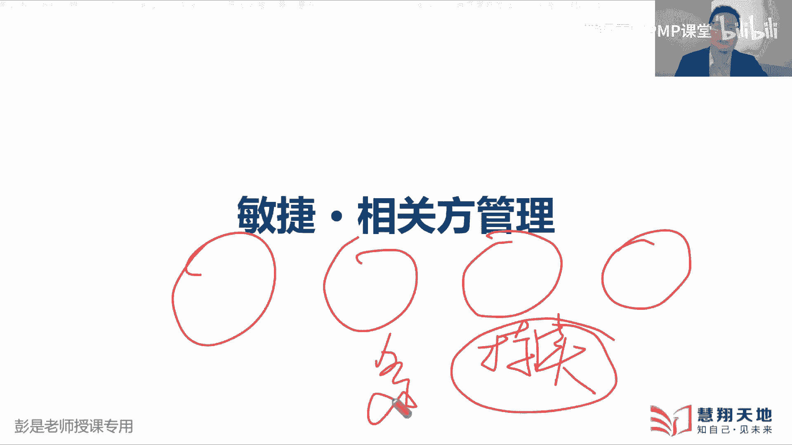

其实没啥啊，说我们需要有效的参与互动，然后主打一个时效性，时效性，因为变化多，对不对，一定要及时及时及时沟通，最理想的模式就是每一天都能产出成果，让客户来体验，从而获得客户的反馈。

避免在错误的路上越走越远，这是最理想的模式了，好其他的就没什么东西了，什么透明沟通，刚才都见过了啊，不念了。

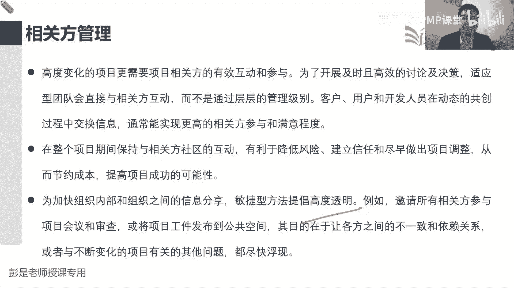

那做做题，好这就是上课说的那个场景吧，说张三和李四在热火朝天的讨论个问题，我正在这踏踏实实干我的活，结果呢不小心不小心听到了他俩讨论的问题，对不对，然后呢我就可以及时的指出给出给给他们。

提出我的一些建议和见解，表达我的观点和主张，对帮助他们，帮助他们更好的完成这个工作，这叫什么呢，这就叫渗透式沟通，这叫无意识的信息交换，他俩原本啊没打算打扰我呀，不想跟我聊这个话题呀，怕我说。

怕我骂他呀，无意识的信息交换诶，渗透式沟通，知道这个意思啊，所以那带出来的知识点我们集中办公，集中办公需要打造一个什么样的办公区呢，才能做到做到做到渗透式沟通呢，如果说张三李四他俩在一个小房间。

王五赵六他俩在一个小房间渗透不过去呀对吧，没有人天天上班的时候趴在墙上听别人说啥呀，对不对，声音传不了那么远啊，所以我们希望是打破这种隔阂，弄一个开放式的办公区，开放式的办公区。

嘿大家坐一起才能更好的交流，更好的建立信任，更好的互动，实效性强，那话又说回来，开放式的办公区啊，它有它的缺点，对不对，说你要说涉及到一些隐私的问题呀，私密的问题呀，比如说约招待客户啊，跟领导聊聊天啊。

以此类推，不方便呀，怎么办呢，旁边有这种处理隐私的什么个人工作区吧，就是小房间小隔断诶，洞穴当你需要处理隐私问题的时候，爬到洞穴里爬进去，处理完之后再爬出来不就完了吗，就是打造这样一个办公环境。

办公场所有公共区也有个人隐私区。

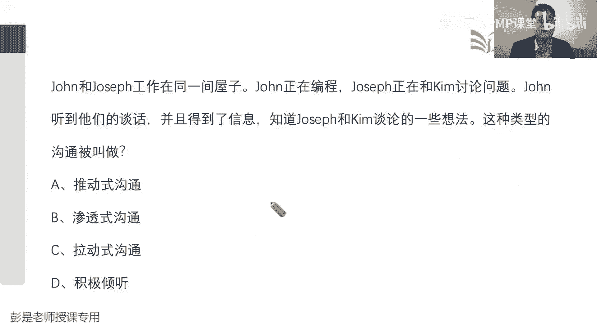