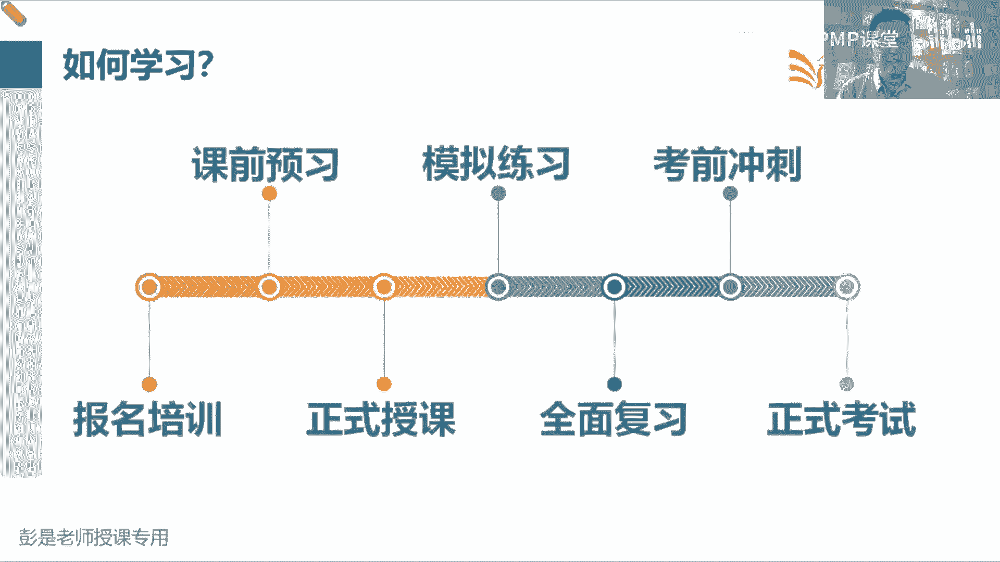
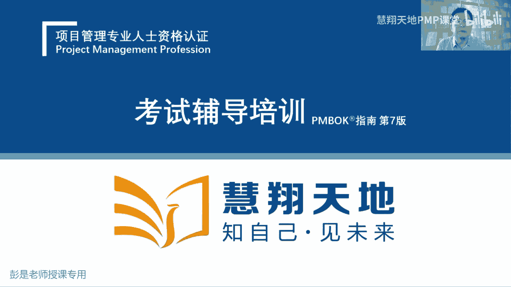
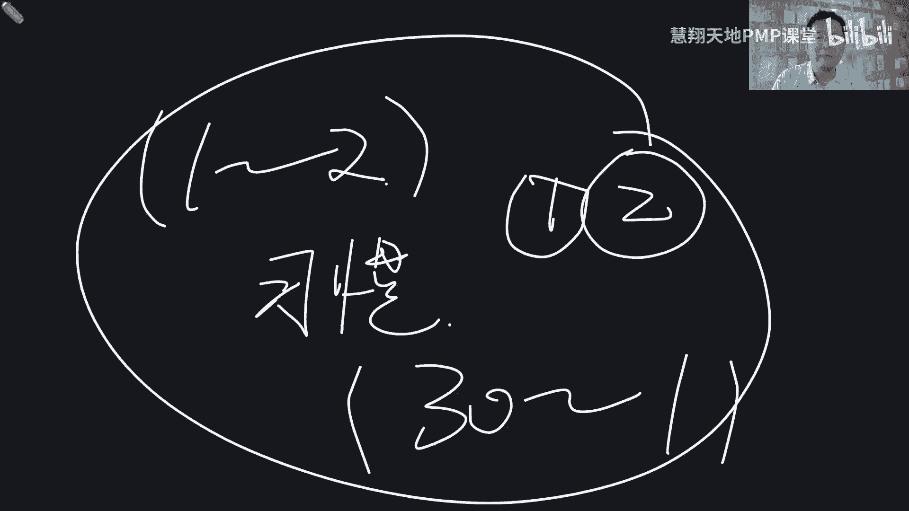
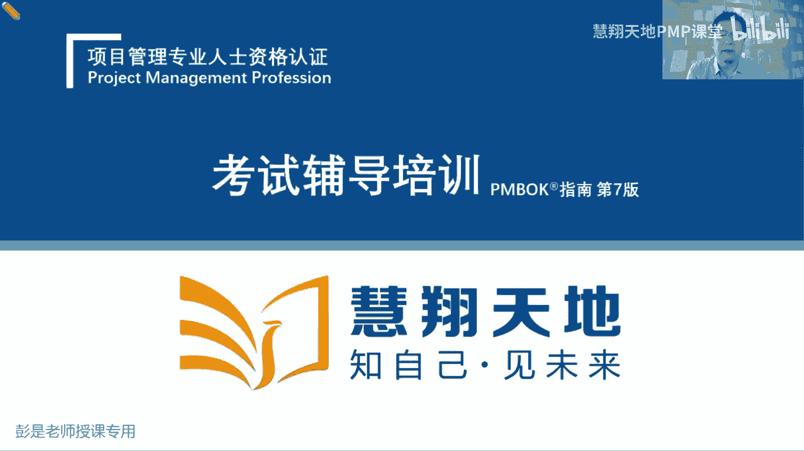
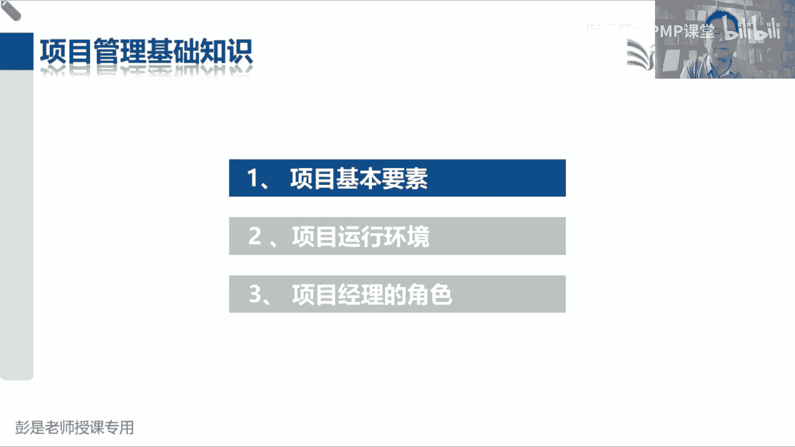

# 2024PMP认证考试课程（第六版+敏捷+第七版） - P1：前言：PMP如何备考 - 慧翔天地PMP课堂 - BV1By411b7qM

给大家介绍一下，咱们这个考试到底是个什么玩意儿，来龙去脉，给大家捯饬捯饬啊，让大家知道咱这个考试的目标，考试的形式，然后呢做好充分的心理准备，未来指导我们怎么去学，知道学习的方向。

学习的方法正式开始了啊，欢迎大家参加PMP项目管理专业人士。

资格认证考试辅导培训好，那什么叫PMP呢，好多人说啊PMP学什么呢，学拍马屁，正好这三个拼音的首字母啊，拍马屁，我说作为项目的管理者，作为项目经理啊，我们要拍马屁啊，拍甲方的，拍客户的，拍领导的。

派员工的哎呀太难伺候了，那实际上PMP的全称呢，叫项目管理专业人士资格认证，项目管理专业人员资格认证，他是什么意思呢，就是说呀一旦我们通过考试拿到证书，就说明我们具备了项目管理专业人员资格诶。

它是一种能力的评价，那这个证书呢是美国项目管理协会PMI，简称PMI，美国项目管理协会，现在他把美国两个字去了啊，就叫项目管理协会，他颁发的这个这个证书，能力测评测评的是什么能力呢。

这大家首先要有第一个充分的心理准备，不是不是考大家的记忆能力，不是考大家的背诵能力，说老师啊这么多概念，这么多题，我把它背一背，是不是就过了，这和那个交通考试，咱考那个驾照科目一完全不是一回事啊。

嗯有没学过科目一的，我先给你科普一下啊，科科目一交通法规的考试，他考试特点是什么呢，就那么点题，你刷一刷题，那个培训视频啊，想看就看，不想看可以不看了，刷一刷题，说超速了扣几分，然后超速多少扣几分。

以此类推吧，闯红灯扣几分，你都去背吧，唉把这些东西背下来，背下来，这些做过的题答案是啥，背下来这个考试基本上问题都不大，至少90分起，很轻松的，一共就那么点题啊，那PMP考试可不是考大家的背诵能力。

记忆能力呀，它主要侧重于考综合能力，就包括了阅读，包括了理解，包括了推理，包括了思维能力方方面面方方面面综合的评估，我们作为项目管理，项目经理是不是达到了人家的专业水平的要求，哎这是这样一个考试好。

所以大家需要做好充分的心理准备啊，这个大家可能有的同学有所耳闻呐，说你身边有亲戚啊，同事啊，朋友啊，同事啊说啊，诶这考试简单看看书刷刷刷刷题就过了，没那么简单啊，每个人的情况不一样，每个人的条件不一样。

对我来说，这考试确实简单，没啥我的，我也不用听课，不用看书，考试之前打一晚上麻将，第二天照样能过，但是呢换到各位同学身上就不一定了，因为大家的背景啊，大家的经验呐，大家的履历呀，大家的能力啊不一样的诶。

所以它没有可借鉴的意义，还是从我们自身叙述法去分析去评估啊，看看我们自己的记忆能力怎么样，理解能力怎么样，工作经验丰富不丰富，以此类推，一定是这样的啊，所以别人的话呢只是仅供参考仅供参考。

如果只觉得觉得没有把握的同学，那就踏踏实实跟着我们学习学习的进展，跟着咱的学习的进度，千万不要掉队，让干啥就干啥，该听课听课，该看书看书，只要不掉队，相对来说，通过考试的可能性就会就会比较比较有把握了。

所以就坚持坚持学习这种反人类的事情，是一种反人类的事情，没有好的办法啊，坚持坚持，大家在学习的路上一定是历经坎坷，不爽不爽肯定是不爽的，这么多东西记不住啊，焦虑啊担忧啊惶恐啊，不要担心，坚持跟着进度。

跟着进度往前走，千万不要掉队，好啊，拐弯拐回来啊，那这家机构为什么这么厉害，为什么我们要考这个证书呢，PMI成立于上世纪60年代，到现在到现在已经已经八快80年了吧，我数学不好啊，70年了吧。

成立了这么多年，他不断的积累，不断的沉淀，不断的积累，不断的沉淀，积累什么呢，就是关于项目管理领域的方方面面的专业知识，他就推出了项目PMI的全家桶，咱学的叫左上角那个，项目管理专业人士资格认证。

还有进度管理专业人士，风险管理，商业分析，然后敏捷项目及项目组合，还有助理助理，这个相对来说就档次低一点，项目集呢就是在项目经理之上的管一堆项目的，项目组合呢在项目及经理之上，更管更更大的一堆项目的诶。

他总之在不断的沉淀，项目管理这个领域的方法的最佳实践，然后呢通过这样考试的形式分享到全球，分享到全世界，所以在项目管理这个领域，目前咱们大家学的这个PMP认证啊，相对来说是最火的，也是接受度最高的。

都是大家比较认可的一个权威的认证，那这个东西火这个东西大家普遍接受，所以这个东西考试难度又好，话又说回来，考试难度还是有一定的有一定的难度的啊，没有想象中那么容易，所以大家做好充分充分充分的心理准备。

坚持学，基本上问题都不大，那PMI为什么这么火呢，看看它在目前全球的一个布布局啊，它在全球200多个国家和地区，已经开通了考试认证机构，基本上无死角，除了一些极度的极度的偏远的，不发达的国家和地区。

基本上螺丝桥覆盖，那目前PMI在全球有300万会员，全球持有PMP证书的人，已经超过了120万人，这个数据我懒得更新啊，实际上现在应该是接近150万了，那就越越来越受到大家的追捧。

然后75%的企业在招聘项目经理，项目管理这个岗位的时候，会优先考虑持有PMP证书的人士，所以这个东西火这个东西权威，这个东西考试有难度，洗脑好听一听就完事了，那他在国内的情况是，99年。

现在叫中国国际人才交流基金会，他被并入到了中国国际人才交流基金会，基金会主要负责干啥呢，就是人才的引进，人才的培养，所以大家耳熟能详的一些像PMP认证，ACP认证，NPDP认证这种海外比较权威的认证。

一定是要经过基金会的，基金会的管理好，99年引入到国内，到今年为止已经25年了，然后2018年年度，参加认证考试的人数已经超过了10万人，到了2022年，咱国内，目前持有证书的人数已经超过了50万人。

全球来看，持有证书最多的国家是美国，美利坚漂亮国，以前是日本，咱们后来反超了唉所以这东西在全球来看，在欧洲，在美洲，在亚洲，在澳洲相对来说呢认可度会比较高，非洲咱不解释啊，好听一听，那国内国内这里说。

国内大家知道拥有PMP证书，最多的企业是哪一家吗，思考国内拥有最多的PMP证书的企业呀，什么头条，腾讯百度诶，没错，华为那再换位思考啊，华为华为华为为什么拥有这么多PMP证书呢，华为傻吗，人傻钱多吗。

不是吧，对对对，人家建议他的管理者要学这个，掌握这个PMP培训，这个通过这个PMP考试拿到PMP证书，说明什么呢，说明哎华为是认可这个事情的，说明这个事情还是比较权威的，所以他才愿意投入真金白银啊。

让他的员工去学这个东西，所以不管各个角度看啊，这个东西值得大家拥有，那值得拥有呢，就需要大家付出一定的努力，没有那么简单，换位思考，我给大家出一个证书啊，叫四则运算小能手，加减乘除小能手。

相信大家第一反应，这证书啊白给都不要，神经病，对不对，根本不值得花时间去考这个东西，学都不想学，听都不想听了，因为没价值，那如果说我们下台包括考试费，培训费，我们的成本花了这么多钱去弄这个证书。

为什么大家都追捧这个东西呢，说明他有价值，有含金量，在项目管理这个领域，相对来说，基本上目前来看，这是最权威的一个证书了，既然权威，既然火，既然有难度，所以坚持坚持坚持好，但手熟尔啊。

那知道了PMI在全球和在PMP考试，在全球和中国国内的一个情况之后呢，看看咱那个官方教材，PMBO官方教材简称叫pm扑，它叫全称啊，叫，项目管理，知识体系指南，它的主要作用是什么呢。

是面对着不管是哪个行业，哪个领域的项目啊，当项目经理管项目的时候，我们去参考诶，工作中有哪些知识可以适用于我当前这个项目，在整个知识体系之中，教材里边把当前全球大家普遍认可的，这些这些新兴趋势。

这些核心的知和核心的知识，核心的知知识点就整理整理整理成册，在我们工作中给我们进行指导，这个是相遇，但这是咱这个教材大概这样一个解释啊，软考它有行业的属性啊，行业的局限性，对不对。

只在it行业可能就认可度比较高，那咱们现在学的这个呢项目管理知识体系指南，刚才特意说了啊，他是跨行业跨领域的，它叫通用的项目管理方法，这种通用的项目管理方法，它适用于任何一个行业，任何一个领域。

无论是你搞工程啊，搞制造啊，搞医药啊，搞搞环境啊，搞软件呐，搞游戏啊，都可以用得上的，所以它是一个通用的项目管理知识体系的指南，把当前这个时代大家普遍认可的，普遍诶接受度比较高的这些最佳实践。

涉及到的知识点整理成册，就变成了我们的官方教材，那这个官方教材的演演化史，给大家大概解释一下啊，咱项目管理这个知识体系啊，大概分分成这三个阶段，第一个阶段呢叫古代，咳这个阶段的工作有什么特点呢。

他叫咱叫经验式的项目管理阶段，说我们在这个阶段实施的目标啊，主要任务就是主要目标就是完成任务，比如建金字塔，盖长城，对盖长城，盖金字塔没办法对吧，皇帝下了命令，那咱就想方设法的完成任务，你让盖多长。

咱就盖多长，能让盖多高，咱就盖多高，那想方设法的完成任务，于是呢不断的吃一堑长一智，吃一堑长一智，就积累了一定盖长城的经验，嘿但是这个经验他有什么问题呢，这个经验他有什么问题呢，它不一定有很宽的适用性。

它有局限性，修长城的人不一定知道怎么修金字塔，修金字塔的人不一定知道怎么修长城，对不对，他有局限性啊，那咱刚才特意说了啊，咱现在学的是通用的管理技能啊，他不管是修长城，盖金字塔，开发软件，盖住宅小区。

搞什么药品研发，它是通用的知识体系，所以就随着时代的发展，科技的进步到了非常关键的一个阶段，叫近代，近代有两个非常著名的事件，有看过奥本海默同学的那个应该知道，左边是曼哈顿计划。

就是造那个原子弹炸小日本，右边那叫阿波罗登月计划，他当时的时代背景基本上差不多，时代背景是啥呢，时间紧，任务重，对，说打仗打的哎呀，眼看眼看这个战争局势难以难以控制啊，我们希望弄一个有大杀器，对不对。

一招制敌出大招啊，所以当时一大堆科学家想尽了各种各样，各种各样的方法，在时间成本质量这三大目标的约束之下，限制之下，想办法尽快的把这东西造出来，还不能呢，成本超支，还要达到一定的质量标准和要求。

这个原子弹造出来不能不响啊，不能不炸呀，对不对，要一招制敌啊，不能扔了半天，扔十个全都不抢，这质量不合规呀，嘿于是科学家，当时一大堆科学家这题思考了这个项目啊，咱用什么先进的先进的管理方法。

可以帮助我们更好地实现这些目标呢，诶就总结出了咱们未来要掌握的关键路径法呀，这些这些非常非常著名，非常经典的科学方法，帮助这些人更好地完成任务，实现目标，得到我们期望的成果，诶实践紧，任务重。

那右边呢阿波罗登月计划呀，也是这个大背景，当时啊美国和前苏联太空争霸对吧，今天你发射个火箭，绕地球绕两圈，那明天呢我就载人，你载人呢我就出舱，让宇航员太空漫步，太空行走，你出舱我就登陆登月哎。

当时双方就比着比着看，谁尽快的尽快的把这个目标完成，在时间成本质量的约束下，尽好的尽早的实现目标，完成任务，于是科学家又把又把这些方法又用到了，阿波罗登月计划里面，发现啊，好使诶。

那不管是造原子弹还是登月诶，发现这些方法它有通用性，无论是造原子弹呐，盖房子啊，还是开发还是还是登月啊，这些方法是有通用性的，所以一大堆先贤就帮我们总结出，未来我们整个知识体系的一个雏形。

它就逐渐逐渐演化了叫学科，咳一大堆科学家呀，一总结管项目啊，有方法有技巧，有套路，对，有方法有技巧有套路诶，他就逐渐逐渐成熟了，变成了一个知识体系，就演化成了一个学科，这个学科呢就和咱们那个数学高数。

对不对，什么语文英语，物理化学一样的，他作为一个单独的学科，一大堆科学家去研究这个东西，它涉及到了一套成熟的章法体系套路，以此类推啊，这就是近代非常著名的两个事件，然后再往下到了现代。

大家实际在每天在工作中啊，都是这些最讨厌的东西啊，现在就是随着工作的开展，我们工作中遇到的各种不顺利的东西越来越多，这是问题，什么成员离职啊，需求变呐，大家没有凝聚力啊，什么进度延误啊，成本超支啊。

质量下降啊，这些问题越来越多越来越多，那咱通常呢就是四处救火吧，作为团队的领导，看看你们公司的领导是不是干这个事啊，救火队长，今天这边出问题了，马上扑过去去去解决一下，后天这边有人要离职。

马上扑过去去解决一下，那边进度又延误了，扑过去去解决一下，遇到问题解决，遇到问题解决诶解决，那怎么有效地防止问题的复发呢，如何尽可能的让这些问题尽量的少发生，不发生呢。

哎所以呢就总结出一大堆一大堆的注意事项，这些注意事项可以帮助我们，有效地减少这些问题的复发发生情况，那各种各样的注意事项，注意事项，注意事项太多了太多了，根本记不住啊，怎么办呢，太乱了。

所以事情一多就需要去梳理的，这是大家日常工作中，可能有些同学可能会用啊，思维导图啊，很好用啊，帮助我们去梳理这些东西的逻辑呀，层级呀，诶那我们也梳理梳理它，所以呢把这些各种各样的注意事项说。

我们在制定计划的时候，这个计划的什么完正确性，完整性，合理性，什么资源，计划是否合理，沟通是否合理，进度是不是能能可行，成本会不会不超支，以此类推啊，注意事项多了，一总结就变成了。

非常非常非常经典的十大知识领域，这十个知识领域，就是说我们在管项目范围的时候，需要关注哪些东西，管进度的时候需要关注什么东西，管成本的时候有什么注意事项，管质量的时候以此类推，哎有了十大知识领域啊。

发现啊注意事项仍然很多呀，那不是所有的注意事项，我们随时随时都要去关注的，因为它底层逻辑有一个什么非常著名的东西呢，叫PDCA戴明环，戴明环是说我们定目标，定计划，这就有了P定了目标，定了计划之后啊。

按照这个计划，我们要落实执行，就有了D按照计划落实执行的过程中，可能会遇到一些问题，那我们要看看哎现在和我们的计划有没有出入，有没有偏差对，所以就有了C来监督控制我们这个这个事情。

最后呢发现缺陷差距不足怎么办呢，下次改进啊，所以就有了非常经典的代名环，生活中把这套方法这套理论应用一下，可以帮助我们做到持续改进对吧，就像我端午节打算出去玩玩，定目标，定计划，然后呢按照计划去落实。

去执行，该订酒店，订酒店，该订机票，订机票，发现啊订的酒店很差劲呐，和我想象的不一样啊，诶通过监督检查发现有差距，最后呢持续改进怎么办，下次订酒店的时候看看评价对不对，考虑周全唉，再改进一下。

下次类似的事情，所以就是一个pd c a接着一个pd c a，不让我们不断的改进诶，科学家一想，那我们管范围的时候也是这个道理啊，我们做计划的时候有什么注意事项，我们执行的时候有哪些注意事项。

我们监控的时候需要做什么事情，以此类推，就总结出非常非常经典的五大过程组，叫启动规划，执行监控收尾，所以整个项目管理的框架就出来了啊，唉告诉我们启动的时候，这十个知识领域有什么注意事项，规划的时候。

这十个知识领域要做什么事情，执行的时候以此类推，那有了非常经典的这个框架之后啊，就把注意事项往里塞呗，就变成了最后最后的我们需要掌握的，五大过程组，十大知识领域，49个管理过程，管理过程是我们怎么做。

怎么完成这个事情的管理工作，它需要一个过程诶，有了49管理过程，再一想啊，那这个管理过程，比如说我收集需求，有这么一个非常非常好理解的过程啊，我要去收集需求，那我需要什么文档资料作为参考呢，就有了输入。

对不对，需要什么文档参考文档资料作为参考，就有了收入，那我收集到需求之后啊，我会得到一个什么成果呢，劳动成果呀就有了输出，那咱在收集需求的过程中涉及到哪些工具技术，有什么好方法呢，唉就带出来工具技术。

所以就变成了非常经典的管理过程，输入输出和工具技术，以及这些管理过程之间的逻辑关系，收集完需求，我们得到这个需求文档，这玩意儿要交给谁呀，下一个同事拿着这个需求文档要做什么事啊。

就变成了非常非常非常繁杂的五大过程组，十大知识领域，49个管理过程，以及这些管理过程之间，各种各样的千丝万缕的管理关系，诶他就衍生衍生出了叫知识体系，知识体系，这是咱这个教材发展史来龙去脉，经验主义。

这记不住没关系啊，第一节课听就行了，咳好知道咱这个教材这个来龙去脉啊，然后啊接下来科学家干什么事呢，这个知识体系呀，随着时代的发展，随着科技的进步，我们要与时俱进，我们要与时俱进的。

有一些不适用于当前这个时代的知识，旧的知识我们要把它淘汰掉，新的知识呢我们要引入进来，对不对，所以不断的完善，不断的完善，不断的积累，pi就干了这么一门生意啊，人家就做一个事，沉淀沉淀沉淀，不断的总结。

推陈出新，所以咱们的教材从1996年，人家沉淀了将近30年，才正儿八经的推出了第一版，叫项目管理知识体系指南，有了第一版之后呢，我们这教材官方教材实际上分两部分，全称叫项目管理知识体系指南。

它细分的话两部分内容啊，教材里面有一部分内容叫项目管理的标准，第二部分呢叫项目管理知识体系指南，那标准化标准化诶，就不得不提到IISO国际标准化组织，国际标准化组织说啊，你出的这个教材呀。

你要想作为项目管理领域的标准，那你必须做到与时俱进，推陈出新，所以按照ISO国际标准化组织制要求，4年一更新，4年一，4年一更新，4年迭代一次，所以就从1996年的第一版到二两千年，出了第二版，第三版。

第四版，第五版，第六版，到现在我们需要掌握的第七版诶，他就不断不断不断的去完善这个体系，然后旧的知识淘汰掉，新的知识，知识加进来，做到了与时俱进，随着时代的发展，不断的不断的不断的去让大家去思考。

我们有哪些方法，哪些知识可以适用于当前这个时代，帮助我们更好地完成项目的管理好，这就是人家这个发展史，那刚才说了古代近代和现代，那到了现在呀，大家发现啊这个知识体系呀到了第六版之后啊，不好写了。

为什么呢，因为现在这个时代有什么特点呢，大家天天天天你看在网上看吧，各种各样的瓜吧，2017年为什么是第5年啊，为什么是5年呢，因为出版发行遇到了一些小小障碍，那为什么2023年才正式启用第七版呢。

因为疫情啊，对不对好，那发展到了现在，大家发现这个项目这个项目有什么特点吗，有啥特点呢，嗯不好管说，今天报个独角兽，明天出个黑天鹅，几万亿的集团，说挂就挂了，说嘎就嘎了，对不对，然后突然冒出个小公司。

哇天呐大家追一追捧市值，咔一炒几十个亿，就像这两天那个PPT甲，大家不知道有没有关注过这方面的新闻啊，PPT讲人家股市股市蹭蹭涨啊，哇翻了好几十倍啊，39倍吧，这你根本就压根儿想不到，对不对。

压根儿想不到啊，这东西说不准就是变化快，节奏快，对不对，不确定，所以就带出来这么一个单词，说随着新冠疫情，什么气候危机，民权运动，全球态势，人工智能的出现，诶就导致我们现代项目啊越来越复杂，越来越多变。

越来越难以把握，越来越难以驾驭，那怎么整，我们刚才说五大过程组，十大知识领域，这种传统的思维方式啊，需要稍稍做一些调整，来适应当前这个多变的时代，所以就提出来一个乌卡时代，把这个单词又捡回来。

这乌卡这个单词一点都不腥啊，他这也七八十岁了，它主要是用来形容战场局势，战争局势的说，在战场上第一异变，第二不确定谁也说不准呐，第三复杂呀，牵一发动全身呐，对不对，就像二次世界大战，大家学过历史吧对吧。

一个人拿着枪把一个公爵干了，结果呢就导致引起了连锁反应，蝴蝶效应了复杂，最后呢模糊性说对当前这个多变的时代，我们对未来会发生什么，完全没有认知，鬼知道那个股票这几天能翻30几倍啊，想不到啊，没有人知啊。

好这是在当期用这个单词来形容，目前我们大多数大多数比较复杂的，有规模的一些这些项目的主要特点难以驾驭，不好管理，那怎么办呢，于是2021年正儿八经的发行了第七版，但是呢咱国内启用是2023年。

去年才正式开始启用，因为受到疫情的影响嗯，他未来一定是按照按照4年这个频率啊，去更新啊，所以我们现在在写第八版，第八版其实对知识体系没有太多的调整啊，做了些微调，第八版主要写什么内容呢，增加了人工智能。

就是大数据在项目管理领域的应用实践，好知道这个意思啊，那第七版，现在现在咱备考的这一版本书啊，就把我们刚原来的五大过程组，十大知识领域，49个管理过程，以及每个管理过程所涉及到的输入，输出工具技术。

就把这些知识点全都打散，全都给他拆，把原来的体系拆成一大堆零件对吧，把搭好的乐高拆成一大堆零件，重新分组，重新分组，最后一总结就变成了第七版教材的知识的框架，结构两部分，一部分叫基于原则。

一部分叫价值交互，基于原则，主要呢就是把原来的五大过程组，改成了12个原则，他是给领导看的说作为项目领项目的管理者，作为团队的领导，作为团队的管理者，我们管项目的时候需要掌握哪些原则。

原则是我们管理工作的指针对吧，就像一个灯塔一样方向啊，指指南针的告诉我们怎么有效的管理团队，怎么有效的管理干系人，怎么有效的驾驭这种复杂性，怎么来适应这种多变的项目环境。

怎么来管理项目的这种不确定性的风险，以此类推，有了12个原则，那原则是非常非常抽象的，比较高大上的这种指南针呢，那到底怎么干活呢，所以呢把原来的五大过程组，十个知识领域再打散，变成了八个绩效域。

告诉我们到底管干系人怎么管，到底团队应该如何管理，怎么打造一个成熟的成熟的团队，然后呢怎么来管理项目的工业化工作，执行工作，执行工作，监督控制，监控工作到底怎么干，到底怎么管理这种风险不确定性。

如何有效地做到价值交付，诶，就变成了非常经典的八个绩效玉，所以大家目前在学的第七版，第七版实际上根是什么呢，就是传统的五大过程组，十大知识领域，49个管理过程，以及在这种多变的环境下。

在这种复杂的环境下，一些项目管理的方法主要就是敏捷，他就是把传统的方法和敏捷的方法，对应的知识点啊，重新做了分组，在此基础之上加了一些新的知识点，嘿仅此而已啊，这就是咱目前学的这个版本。

它大概的这个一个来龙去脉，听一听就可以，后面就会一个一个单独讲好，了解了这个教材的来龙去脉之后啊，接下来那就不得不提到项目经理，大家第一反应啊，你脑海里关于项目经理的认知是一个什么，什么特点呢。

有什么关键词啊，项目经理的主要工作是做什么呢，开会开会沟通，当牛马事儿多，操碎了心，救火队长，打杂的啥都管，啥都管啊，对拍马屁呀，拍领导，拍客户，拍员工全都得管吧，嘿保姆对交付会多就是操碎了心吧。

因为我们就是那个背锅侠呀，啥事都得管，那啥事都跑跑不了吧，嘿所以项目经理，项目经理，那我们看看啊，全球目前来说，这些项目管理者，这些项目经理有什么特点，咱得立标杆啊，咱得立一标杆吧，对不对。

别人家的孩子，咱看看别人家的项目经理，别人家的项目经理都有什么特点，人家的主要卓越点体现在哪儿，他哪些方面的能力比较强，所以我们做了这样一组调研，我们先看看目前全球项目的发展趋势，说亚总之啊。

最后一得出结论啊，全都是越来越好，大多数项目能够更好的在符合最初目标，能够更好的在预算内完成，能够更好的按时完成这个比例，逐年上升的PMI一直在持续跟踪，持续跟踪持续调研，持续收集相关的数据。

就会发现全球全球项目管理，这些项目成功的可能性越来越高，失败的比率呢在逐年下降，哎知道这个大结论说，那也就是这些项目经理确实越来越厉害，水平越来越好，那这些人有什么特点，这些人有什么特点。

我们要分析企业，所以看看全球目前啊，从欧洲啊，美洲啊，亚洲啊，大家这些项目的成功的比率啊，失败的比率啊，有什么显著的差异吗，欧洲的项目和美洲的项目，和咱亚洲的项目有什么较大的出入吗。

最后统计完了分析发现了没有，大家水平基本上差不多，无论是北美啊，什么欧拉丁美洲啊，欧洲啊，亚洲啊，包括中国呀，南南亚呀，大家项目成功的概率，实现目标，完成任务，按时间和按预算完成。

这个比率没有特别大的出入，没有特别大的出入啊，那没有典型的偏差，接下来再去分析行业说，看看搞政府项目，搞it的项目，金融项目，什么能源啊，制造啊，建筑工程啊，统计下来分析发现呐也没有特别大的出入。

基本上差不多也就是几个点，对不对，一个点两个点哎，浮动一下，基本上差不多没有较大的出入，那也就是这些这些项目没有典型的区别，那咱再看看企业的情况，企业的情况，最后一统计一调研就会发现啊，不一样了。

蓝色的叫进取型企业，就是有上进心的这种企业，橘色的呢是传统企业，这是墨守成规对吧，比较保守的这种企业啊，那发现蓝色企业这种有上进心的企业，它以更关注什么呢，什么以交付客户价值为中心。

然后要保持步调的一致，采用数字化的解决方案，他们什么工作更灵活，什么公平，以此类推啊，嘿他们这种上进心，上进心明显比传统企业高得多，那他们项目成功的可能性就比传统企业高得多。

按照这个预测最后一统计再分析啊，它们在工作方法上有什么区别呢，说一下这种现在换了换颜色了啊，橘色的是有上进心的企业，他们呢更关注混合型，就是灵活，这是灵活，根据项目的实际情况，采用合适的项目管理方法。

该传统的就传统，该灵活的就灵活，该该迎合变化就迎合变化，诶，主打一个灵活，那这些企业这些企业有上进心的企业啊，嗯现在讲的内容都是听一遍就完事了，考试不考，让大家大概了解一下，咱这个学习学习的来龙去脉。

听就行了，听就行了啊，好那这些有上进心的企业，他们的领导是怎么带人的呢，所以就得出来这张非常非常经典的数据，说，他们将发展协作型的领导，视为人才培养中的重点，有上进心的企业更关注人才的培养。

那人才培养他关注这些人什么，哪些方面的技能呢，再往下一统计就发现了，那这些企业他们的管理者，他们的领导者在这四方面的技能非常非常卓越，第一个就是沟通，刚才大家也说了吧，作为项目经理啊，咱操碎了心啊。

啥事都得找咱呐，四处救火呀，我们对客户，对甲方，对政府，对员工对对对，供应商，以此类推啊，哎我们是沟通的那个桥梁，我们是沟通的核心，所以呢这些领导者沟通能力普遍会非常强，第二个关键技能是什么呢。

叫问题解决，问题解决，问题解决，人生十有八九不如意，项目也如此，怎么可能顺风顺水，对不对，每天大事小情啊，各种各样的问题啊，进度的质量的事儿的问题，人的问题，客户的问题，供应商的问题，环境的问题太多了。

所以我们要不断的，不断的根据这些问题的重要性，优先级能够做到快速的快速的解决问题，并且呢有效的防止问题的再次出现，再次发生诶，这是问题解决的能力，就是那种叫逆商，对不对，面对阻碍，面对障碍，面对阻挠。

百折不屈，然后第三个技能是什么呢，领导力，因为我们主要就是管好事儿，带好人，大家愿不愿意跟着你往前冲啊，有没有卓越的领导力啊，大家愿不愿意听从你的指挥啊，服从你的命令啊，嘿这个技能非常重要。

对对将军往前一冲，回头一回头，士兵都在后面悠闲的抽烟喝茶聊天，这不行，希望大家保持保持这种干劲儿，能够跟在我们的带领下，愿意跟着你往前冲，实现目标，完成任务，那最后一个呢就是咱也不能闭门造车。

还要有战略思想，有大局观，有全局观，有系统化思维，哎这就是战略思想这种东西啊，了不了解蛤蟆咳国际形势啊，了不了了，不了解国家国家国家的政策呀，了不了解行业的趋势啊，知不知道自己企业目前在行业的地位啊。

地位置啊，以此类这样有格局哎，最后一总结发现，这些人这在这在这四方面能力，非常非常非常卓越，非常非常突出啊，那就带出来说这些东西总结出来有啥用呢，这是咱考试的核心内容就来了，所以看看啊。

第一能够给我们带来更好的工作机会，通过考试拿到证书，说明我们有了这样的能力，能够担任起担任起一个项目经理的职责，那第一就是工作机会，因为目前来看，全球全球大多数企业对大多数企业来说呀。

主要是在靠着项目的形式在帮助企业创造价值，主要是通过项目的形式在帮助企业创造价值，叫那个造汽车PPT甲，对对不，这不是项目吗，今天弄个车，明天弄个车，哎呦一顿忽悠啊，管他量产不量产呢。

反正就是持续的给大家画大饼诶，只要你信，我们就能创造价值，就这思路，那大家大多数，大多数企业通过项目的形式在创造价值，那项目经理的岗位机会，工作机会就会非常非常非常多，好知道这个意思啊。

第二个呢也就是大家最最关心的就是钱待遇，这个待遇啊，听一听就完事了，不要仔细看啊，越看越虐心啊，总之啊年头越长，赚的越多，年头越长，赚赚的越多啊，因为管理靠的是沉淀，靠的是积累，越了解你所在的行业。

越了解你所在的公司的产品服务成果，越了解你项目的专业知识，越了解这些管理经验，就是两手抓嘛，又懂业务，又懂管理，又懂技术对，那么就越吃香，能够更好的驾驭这个项目，那薪资待遇。

下面这段这段话听一听听一遍啊，说在接受调查的40个国家和地区之中，具有PMP认证的调查对象的中位数更高，他比没有PMP证书的人，平均高16%左右，就是说呀通过考试有有偏僻征收的项目经理。

普遍来说他的工资比没有证书要高，因为说明你拿到证书，说明企业A会对你形成一个基本的信任吧，至少能证明这个人在一定程度上有一定的能力，对不对，至少至少能证明你的学习能力，这不用解释了吧。

好听一听就完事了啊，不要去对比，纵向对比没意思啊，这一对比咱心基本上就凉了，咱们待遇好像不太好啊，跟人家没法比，咳，有声音啊，好接下来说PMP认证对个人的价值，第一希望通过咱们的课程呢帮助大家提升能力。

领导能力，创新能力，执行能力，竞争能力，总之要让你掌握知识，把知识变成你的技能，然后呢顺便提高你的阅读能力，分析能力，推理能力，批判性思维思考能力，那第二个呢就是收入的提升，认证后工资。

这现在也不一定啊，现在经济形势大家想一想，想一想就完事了，不解释不一定能够提高收入了啊，第三呢就是效率提升，一旦大家的能力得到了提升，不管是你工作生活甚至是谈恋爱，都能帮助我们有效地提高这个事情。

这个事情的效率，对不对，因为你考虑到事情，考虑到更周全，给安排更合理了，最后呢就是认可通过考试拿到证书啊，发个朋友圈，人家给你点赞呐，这不是认可吗，嘿真牛真牛，弄了一个看不懂的证书，上面都是英文水平高。

你有本事，所以我们76。7%的人认为，取得PMP证书之后会得到领导和同事的认可，嗯好那最后就说到重点了，也是第一小段课程，第一小段课程啊，前面给大家做了大量的铺垫，第一呢这个考试火这个PMP证书火。

它有权威性，第二个呢既然火它就有难度，没有那么简单，不是唾手可得的，千万千万不要听信一些坊间的传言呐，因为每个人情况不一样，有的人确实是说真的没没怎么看书，没怎么做题，就刷刷视频就过了。

但是呢人家可能有自身一定的积累，对不对，所以呢，千万千万不要参考这种这种这种错误的案例啊，也不能说错误啊，总之心里如果没把握，就踏踏实实的坚持学坚持学坚持学，只要坚持下去学习，刚才说了啊。

但手熟尔只要坚持，没有搞不定的，对不对，好考试难，然后第三呢需要我们掌握大量的知识，因为这些知识会不断的推陈出新，与时俱进，那作为项目的管理者，刚才说四个核心技能对吧，说什么战略思考啊，领导力啊。

管好事啊，所以接下来就考试，那考试的时候，咱们考试大纲是从这三个维度评价我们的能力，一个叫人员，一个叫过程，第三个就叫业务环境，人员呢主要是看看啊，你知不知道怎么有效的管理团队，知不知道怎么带队伍。

第二个呢就是干系人，除了队伍啊，你还要面面临着客户啊，领导啊，供应商啊，政府机构啊，这都是和项目相关的人员和群体，那我们知不知道怎么和这些人打交道，怎么有效的去管理管理。

管理这些干系人之间的什么参与度啊，干系啊，怎么有效的管理团队，让团队尽快走向成熟，这是第一块，考试比重比较大，占42%左右，然后第二块评价我们的能力，那就是过程管好人，管好事，对不对，过程就是事情。

他去分析啊，评价我们知不知道如何如何，根据现在的项目的实际情况，去有效的驾驭这个设计，能不能灵活的灵活的去思考，用什么样的方法帮助我们完成这个事情，王涛同学，这些都不重要不重要不重要啊。

干细人就等于相关方，相关方就等于干细人，你看到干细人就认识他，就是相关方一样的，这些词都是一样的，同一个意思，英文都叫stakeholder，不用纠结这种东西啊，不用纠结细节，对不对。

大家未来非常重要的一个话哈，学习学习先抓大放小，先听大道理，先听大的框架结构，然后呢，再去慢慢的慢慢的，不断的不断的在上面去掌握这些小细节吧，一个类以以此类推啊，好专心听，专心听，专心听。

学习方法很重要，学习方法很重要啊，好第二块就主要是过程，看看我们知不知道这事儿怎么管，知不知道传统的项目应该怎么管，知不知道这种多变的项目应该怎么处理，就是敏捷和预测性，他考试占比占到50%。

其实就是刚才我们听过的十大知识领域范围，怎么管进度，怎么管，成本怎么管，质量怎么管，采购怎么管，沟通怎么管，以此类推，这是管事，那除了管人管事啊，除了管人管事，我们还要干啥呢，不能闭门造车呀。

还有大局观，还有全局全局思维，嘿，所以第三块是业务环境，就是看看我们知不知道和项目相关的整个环境，包括未来我们需要掌握的项目集，项目组合，组织过程，资产事业环境因素，包括项目管理办公室，上到公司战略。

下到项目目标这些事情，我们有没有这样的认知，有没有这样的意识啊，好就是从这三个维度，从这三个维度去评价我们的能力水平，一共一共四十二五十8%，最后权重就是百分之百，那从这三个维度评价我们的。

关于知识的掌握水平啊，接下来那考试考试到底怎么考，它又分成两部分说，看看这句加黑的话，加粗的话说，在考试过程中的一半内容，50%的内容，将体现在项目管理中的预测法，也就是传统的经典的方法啊，五大过程组。

十大知识领域，49个管理过程，这预测法的考点，另一半呢将体现敏捷或者是混合方法，敏捷和混合方法呢就是在这种多变的环境下，我们怎么去驾驭这个事情，五大过程组，十大知识领域，49个管理过程已经不适用了。

他是另外一套非常轻量级的，非常粗略的，非常精简的一套管理方法的框架，也就是敏捷好，所以50%的考50%的题，考预测型，传统的方法，50%的题考敏捷，这种多变的项目怎么去驾驭它的方法。

这就是整个考试的大纲这部分内容，所以大家如果手里边预习过通关宝典的同学，你就知道整本书啊有这么四块内容，第一部分呢叫项目管理基础，也是咱今天课程的主要内容，给大家打好打好底儿。

先了解了解和项目相关的这些基本概念，第二部分内容呢，就是叫基于过程的项目管理方法，那就是五大过程组，十大知识领域，49个管理过程诶，这就是预测型方法，教材的第三部分内容呢。

是多变的项目环境下的项目管理方法，也就是敏捷说，在这种复杂的多变的创新的环境下，那这项目啊49个过程好像不太适用了，这事儿应该怎么处理呢，他是讲这部分内容，最后教材的第四第四部分内容叫什么呢。

就是第七版12个原则，八个绩效域，第七版和第七版的教材的内容，项目管理标准，项目管理知识体系指南，这是咱通关宝典，大概这四部分结构，咱就按照这个顺序，1234从今天今天开始就往后讲了啊，好那考考试通过。

考试通过就会看到这张成绩单，直播亲，现在是2024年5月18号，5月18号，你看看最近的热搜，就会发现PPT甲的股票还翻了39倍，咔咔咔咔，现在好哇塞，值钱了，看看热搜就知道了啊，好了还有庆余年二。

庆余年二，哎呀比到火呀，大家疯狂疯狂追剧啊，好了，这是直播现场，直播录播的话不可能预知这些这些这些消息啊，我要有这个预测能力，还讲啥课呢，好接下来话说回来啊，通过通过三个维度过程，人员商商业环境。

商业环境评价我们的水平，所以成绩单成绩单最下面就是人员过程，商业环境诶，这是这三个领域我们的成绩，成绩呢又分成四档，就分成四档啊，叫NBT，如果是N呢，就说明啊不太好就不太好，需要改进，说的比较婉转啊。

实际上呢就是不行就是不行，B呢叫低于目标，低于预期，就是不符合要求，T呢叫符合目标，达到目标，符合预期，哎这说明合格了，A呢叫高于目标，高于目标，高于目标是什么呢，这是水平掌握的比较好，对不对。

好它每个领域都有NBTA这么一个评价结果，所以呢成绩最好的同学最后呢就是三个A，成绩最烂的同学呢就是三个N，这是三个N啊，三个N其实挺难的，我们要巧妙的避过每一个正确答案，不容易的啊，好这是。

从这三个维度去评价我们的水平，不代表着3A就过，不代表哎3A肯定过了啊，从这三个维度评价我们的水平啊，最后还要看什么呢，看综合实力，所以呢成绩单的上半部分啊，就是综合水平。

综合水平在中间就可以画一条线了，中间这条线就是及格线，如果最后你的成绩在右边，就说明通过考试了，通过考试了就会拿到证书，他的工期就叫pass pass，不是被淘汰啊，是说通过认证，通过考试了。

通过测评了，那如果说thank you，很遗憾，感谢你参加PMP考试，这就说明成绩没过，他最后以综合成绩综合评分为准，所以大家朝着这个目标去努力啊，好那再往下，什么电子单，哪问班主任呐，没有电子版的。

好说是按照是常模参考还是标准考试参考的，他没有没有考试成绩啊，没有没有考试成绩，他不会公开，不会公开你的考试的最后多少分，他没有分数的评价，只有一个定性的定性分析的结果。

他这个成绩啊到底多少分及格也不告诉你，不告诉你啊，你马上会收到的，一旦通过考试，一旦在右边，接下来我们干什么呢，接下来就会达到PMP证书的电子版和纸质版，证书的电子版，上面是你的姓名，下面是证书的名称。

下面是PMI领领导签字，最后呢证书编号有效期哎，通过考试之后就会得到成绩单，就会得到证书证书，如果成绩比较好，你发朋友圈就有两个素材，对不对，看看兄弟多牛啊，3A啊，然后电子版的证书看起来非常高大上。

成绩不好不太好的同学呢，可能就发一一张一张图片吧，就发个证书就完事了，嘿会会得到亲戚朋友同事的认可，知道这意思啊，那最后的考试主要考试形式，专心听吧，专心听吧，不要问稀奇古怪的小问题了啊。

电子版问班主任哪，我没有啊，三题也是通过了吗，不确定不确定啊，他的评价评价评分的模型实际上是不公开的，PMI也不会公开的，然后他的评价模型就是，最后最后以最后的结论为主，那我们考试啊。

全程一共180道题，230分钟，两种题型，一种呢叫单选题，从四个选项里找出一个，相对来说比较合适的选项，第二种呢叫多选题，多选题呀，从6~7个选项里让你选两到三个，一定会明确的告诉你选几个的。

让选几个就选几个，让选两个就选两个，让选三个就选三个，以此类推啊，那单选题呢基本上就是170道题左右，多选题呢基本上就是十道题左右，不会特别多，国外已经升级了，人家有填空题，连线题，热点题。

咱国内目前考试啊还没有这么复杂的题型啊，咱就是单选和多选，还一共180道题，那咱大陆地区呢又是纸质的考试，大陆地区是纸质的考试，我们会线下考试，拿纸质的，我们叫试卷书，一本一本试卷书。

用纸质的试卷去答题，用纸质的试卷去答题的话，就需要和咱中考高考一样，图那个答题卡，第一道题给你四个选项，需要我们用铅笔去读答题卡，把你认为正确的答案涂在那个小圈里，小小方块里，那对大部分同学来说。

我们涂卡的时间，基本上需要20到30分钟左右，基本上正常人啊20到30分钟去涂这个卡，所以真正有效的答题时间只有200分钟左右，所以其实就是要求大家一分钟一道题，一分钟一道题啊，时间紧，任务重啊。

我们要尽快的把这个题干在说啥啥，在说啥事，看清楚，还要把ABCD这些选项再说什么意思看明白，还要结合我们掌握的知识点去分析，去判断哪一个选项相对来说最合适，这其实是蛮有挑战的啊，没那么简单。

一分钟一道题，把把题目100多字的项目情况看清楚，现在主要就是场景题，场景题是什么呢，给你描述一个项目的情况，说张三管一个信息化项目，李四管一个工程项目，现在项目中遇到了什么问题呀，障碍呀，阻碍呀。

问问你接下来应该怎么做，那要把这个题说什么，说什么意思看明白，把四个选项说什么意思看明白，还要根据我们掌握的知识去分析，去判断，去推理，去思考，找到一个最合适的选项，所以最后他考的是什么呢。

就是作为管理者，你的快速决策能力到底怎么样，那快速决策能力来源于什么呢，所以举个小例子，比如说拳击手在赛场上打比赛，打拳击，他有时间想吗，没有时间想对对，对方全都过来了，等我想一想，我是白鹤亮翅。

黑虎掏心还是怎么着，没时间思考啊，他需要快速的做出响应，快速的做出反应，那这种快速反应能力来源于什么呢，对吧，日常不训练，上去一拳就被人干死了，对不对，日常大量的训练，大量的积累，天天不是被打就是打人。

对不对，大量的训练，大量的积累变成什么呢，肌肉记忆，程序化记忆，把这种东西存在你的肌肉里，存在你的脑子里，存在你的小脑里，来源于大肠，大量日常的训练，刻苦的训练啊，只有是这样的吧，对不对，拳头来了。

下意识的一躲哎就来下意识下意识，这不是快速响应吗，所以他其实考的就是，作为，你，要想证明自己是一个合格的专业的项目管理者，那我们需要有一定的沉淀和积累，才能够快速的形成这种正确的反应。

才能够快速的做出相对来说比较合适的，这种正确的决策，那这东西偷不了懒，说交规交规考试刚才说过了吧，不一样，校规考试考快速决策吗，不考考的就是个记性，记性越好，成绩越高，对不对，就是背。

那现在PMP考试背可不行啊，说老师啊，我把教材里面那些概念全都给他背下来，去考试行吗，不行，他考的什么呢，应用啊，结合到这些知识，能不能去思考，推理呀，梳理呀，判断呐，分析呀，总结呀，归纳呀。

甚至包括阅读能力，他是考综合能力，这东西这东西没有有效的方法能够速成的，咱们备考周期两到三个月，就需要各位同学配合了，坚持坚持坚持，该干啥该干啥该干啥干啥啊，咱每个阶段有每个阶段的学习任务。

每个阶段有每个阶段的能力提升的重心，所以现在在精讲课，精讲课，现在阶段呢大家的学习任务就是打基础，牢牢地打好基础，把这些概念尽可能的熟悉，到了第二个阶段，模拟考试综合训练，帮助大家去综合提升决策能力呀。

分析能力呀，推理能力啊，思维能力呀，诶这是两个阶段的最重要的，最重要最重要的工作任务啊，所以还是那句话，坚持按照我们的学习计划，坚持学，基本上问题都不大，好拐弯拐回来，所以坚持学，坚持学，别无他法。

但手熟尔奥，那最后给大家拐个小弯啊，PMP的形式是什么呢，现在告诉你告诉你这叫微信，这条微信考试的时候啊，就问哪个是微信啊，不知道啊，蒙了吧，所以很多同学啊如果不细心的话，没细心观察过的话，确实不知道。

所以大家第一反应啊，就是个考试啊，特别特别像什么呢，打开书马冬梅合上书什么冬梅，打开书，马冬梅合上书，马什么梅，打开书，马冬梅合上书，马什么马什么诶，完全就不知道了，就懵了就懵了啊。

他搞的是我们对知识的应用，所以没有背景，没有背景，每天花多少时间复习，是花花多少时间复习，笔的好，马上就会收到，不要不要着急啊，干扰项这么接近吗，这还是比较善良的，这还是比较善良的。

实际考试的场景会更干扰，干扰因素更多呀，PMI非常非常喜欢在题目里面加很多烟雾弹，加很多干扰因素来，来阻碍我们对这个事情的分析和判断，阻碍我们对我们的对这个事情的推理好，所以最后结论是什么呢，概念越熟。

判断起来就越准，概念越熟，判断起来就越快，一定是这样的，对每个答案都是对的啊，那这东西到底怎么学，这个考试难，这个考试火，这个考试需要我们快速响应，快速响应，那怎么学呢，嘿PMI推推中的官方教材。

官方指导教材是十本书，就是啊建议考生啊看这十本书，从而呢全面地掌握整个项目管理知识体系，包括了左上角第七版，咱的官方教材，项目管理知识体系指南第七版，然后呢左上角第二个呢叫敏捷实践指南。

就是在这种多变的复杂的创新的环境下，项目怎么管，包括什么项目管理过程啊，工具箱啊，我就不一个一个念了啊，总之官方教材十本这十本书，这十本书说老师啊备考周期两到三个月，看得完吗，看不完看不完啊。

所以不要求大家去看，咱通关宝典已经帮你总结好了，包括咱的模拟考试题，综合练习题，哎，我们针对这些这些考试的特性，已经帮大家总结到位了，所以呢让干啥就干啥，让看啥就看啥，不解释了啊。

最后马上第一小段课程结束了啊，吹牛的就跳过啊，吹牛跳过啊，总之就是各位同学，你要相信自己，相信自己还不行，你还要相信我，咱们互相信任，互相信任啊，互相帮助，互相互相互相往前走好。

那最后一小段说这个考试的课程的目标，第一希望大家能够通过学习，掌握项目管理相关的知识，第二呢，我的主要工作是，帮助大家减少学习的复杂性和困惑，所以在未来的课程中会结合大量的接地气的。

不能不能再接接接地气的案例，帮助大家更好的去理解这种知识的来龙去脉，主要就是掌握这个道，道生一一生二二生三三生万物，只要掌握了这个道，只要听懂了他的底层逻辑，他的思维方式，他的价值观，他的原则。

他的主张诶，大部分知识点学到最后他到底是啥，根本就不重要，对不对，听道理，听道理，然后听完了道理之后呢，希望大家能够提升所学知识的应用能力，所以在整个上课的过程中，会结合大量的大量的。

非常能非常容易理解的案例，帮助大家更好地理解这些知识，我们在工作中，在生活中，在实践中去怎么运用，希望大家听课的时候能够掌握了道之后呢，活学活用，举一反三，从而不断的不断的把这些知识用到工作中，生活中。

提高我们的竞争力，就这目的啊，那最后呢肯定是希望能够大家一次通过考试，顺利上岸的啊，好那就接下来最后一小段课程几分钟搞定，怎么学习这小杯子什么意思啊，嗯如何学如何学红酒杯微醺，喝点小酒，醉意朦胧。

一考试就过了，是这意思吗，不是不是啊，嘿没错，预习过的同学应该知道空杯心态，为什么要保持空杯心态呢，当时有个梗啊，就是啊有一个和尚佛法非常厉害，然后有个施主，有个施主啊去向这个和尚请教佛法。

施主来到了和尚面前，就开始不停的叨叨叨叨叨叨叨叨叨，诉说着自己对这个世界的理解，然后施主在这叨叨叨，和尚没事干了，和尚干嘛呢，哎施主，我给你倒茶，我听你说，结果这个倒茶呀就往这个杯子里倒，倒满了之后呢。

和尚没有停继续倒，唉这施主就好奇了，说大和尚茶水已经满了，为什么还要继续倒呢，大和尚就说了，施主啊，您来向我请教佛法，你来向我请教道理，结果呢我发现您内心里面充满了充满了想法，充满了观点，充满了主张啊。

嘿你现在听不进去，我说什么东西了，你在那叨叨叨啊，就这个道理吧，你想听我说，听我说诶，就像这些同学说好，Stay hungry，你要你要先把自己自己对这个世界的理解，这些东西啊给他扔出去啊，抛开呀。

你先听听我怎么说，然后呢再去消化吸收理解，再结合你自身的实际情况，去变成你自己的知识储备，所以咱学习过程中就要保持空杯心态，非常非常重要的一个道理，为什么呢，因为刚才说过啊，咱们现在学的叫通用的方法。

它通用的方法以前我们还比较含蓄啊，说适用于全球大多数项目，现在不羞涩了，现在说我们这些方法适用于全球所有项目，任何一个项目，你参考的这些知识都可以去思考，唉这些东西我在工作中能不能用得上。

它叫通用的项目管理方法，无论是你来自于哪一个行业，哪一个领域，不管是那个搞建筑的，搞工程的还是搞软件开发的，还是搞什么药品啊，搞金融的，搞证券的都用得上啊，所以要空杯，因为咱现在学到最下面这一行。

它是一个通用的职业标准，对对咱教材里边两部分内容，项目管理标准和项目管理知识体系指南，它是一个通用的全球的标准，然后咱实际工作中是怎么干的呢，第一我们要考虑行业的特点，搞软件开发的和盖房子的诶。

这两个行业有行业的特性，我们根据行业的特性要进行相应的调整啊，这还能跟得上吧，我们要根据不同行业的特点做出相应的调整，这个调整叫什么呢，量体裁衣哎，这叫裁剪，那我们考虑到行业的特点。

第二呢还要考虑企业的特点，同样是搞软件的对吧，我在腾讯啊，在百度啊，工作方法呀不太一样不太一样的啊，因为每个企业有每个企业的政策流程制度标准，程序规范，每个企业有每个企业的个性，企业干活诶。

方法方式也不太相同，那我们考虑到企业的特点，第三个呢每个项目又有每个项目的特点，同样是修高速公路对吧，在北北方修和在南方修诶，你环境啊，政策呀，对不对，不太一样吧，那我们还要考虑每个项目的特点。

最后呢每个人又不一样，咱们还要结合自己的经验呐，教育背景啊，对不对，诶，结合我们自己的这些背景知识，每个人的个性就有了我们自己的工作方法嗯，那咱们这种自己的工作方法，它的适用性就会越来越窄。

一定是这样的啊，适用性越来越窄，换一个项目，这些方法可能就不好使了，跳槽换一家公司，过去的方法可能不太不太不太好用吧，有过跳槽经验的同学应该能够能够理解吧，你过去在这家企业如鱼得水，换了一家新企业。

可能过去的这些方法不一定能够适用，还要去适应这个新的环境，对不对，做出相应的调整，那跨行业就难度更大了，我是搞软件开发的，现在我去搞工程，搞土方不一定能行得通了，嘿所以我们自己自己说难听点啊。

每个人都叫井底之蛙，每天一个萝卜一个坑，我们能够接触的事物就这么点，对不对，坐井观天，坐井观天，能看到东西比较窄，比较窄啊，会受到限制的，所以考试的过程中，包括学习的过程中，就要空杯心态了。

要忘掉我们自己的这些事情，忘掉我们自己项目的特点，忘掉我们企业的这些方法，政策流程制度标准程序规范，忘掉我们行业的特性，去抱着空杯空杯的心态去听一听，去看一看诶，全球通用的项目管理知识都是啥。

这考试的时候尤为重要，千万千万千万不要结合我们自身的工作经验，去分析去判断，用自己的经验一判断，通常就容易出错，说老师啊，我公司就是这么干的，你公司这么干，其他公司不一定这么干的，对不对。

所以抱着空杯的心态去学习，去考试去学习，去考试，先听先听先听我再怎么讲，听完了听懂了之后呢，再去课后去复习，去消化，去吸收，去理解，这是非常非常重要的一个因素啊，嗯好请问11章所有的方法都要掌握吗。

这就是后面课程主要的要为什么要说要听课呢，为什么要听课呢，唉讲到每一章会说每一章的学习重重点，需要大家掌握到什么程度，什么水平的好，接下来最后呢一分钟咱就下课了，第一小段课程结束，那怎么学，课前预习。

预习有没有价值，有没有好处，这不用多说了吧，大家从小学到大呀，预习预习带着问题去听课，效率会高很多对吧，老师我在预习的时候，这个知识点没吃透，没理解诶，听老师一讲秒懂了，达达到这个效果是非常非常棒的啊。

所以呢每天每次每次下课之后，会给大家留作业的，告诉大家下一次上课我们讲什么，然后需要大家在上课之前去预习什么内容，预习完了之后呢，再去正式听课，听完课呢再再看书，再听课，再看书再听课。

咱前一阶段就这样不断的循环，不断的循环看书听听课，看书做课后练习题，听课看书做课后练习题，这是咱整个备考第一阶段的主要工作，就是打好基础，第一阶段的主要学习任务就是打好基础，把这些基本的概念呐定义呀。

尽快再尽快的把它熟悉起来，说老师啊，我是小白，关于项目管理啊，完全没有认知啊，没关系没关系啊，大家起步，大家的那个起跑线基本上差不多，有经验的不一定是好事，没经验呢不一定是坏事，对不对。

事物都有两面性啊，所以主要就是不断地不断地跟着咱学习的进度，看书听课听课看书，做章节练习题，打好基础，第二阶段呢，我们模拟考试主要的任务是全面复习，通过通过模拟考试的讲解，帮助大家去训练推理能力啊。

思维能力啊，诶这种东西在打好基础的知识基础之上，去关于我们的知识做全面的综合的运用，这是第二阶段，第三阶段呢就是考前冲刺，主要的呢就是查缺补漏，看看有什么东西掌握的不太到位的，质量不太到位啊。

范围不太到位啊，有重点的有重点的，把这些漏洞一个一个给他堵上，这是大概这么三个阶段，所以这是咱的作战计划就出来了啊，打好基础，全面综合训练，第三步呢考前查缺补漏，所以需要各位同学配合的是什么呢。

就是该听课听课，该看书看书，你们之前的学长说过呀，说过这是啥嗯，不管不管水平怎么样，只要坚定不移地按照我们的学习计划往前走，基本上通过考试问题都不大，他当时原话就是，不管多笨，只要坚持。

只要坚持都可以做到的啊，没那么没有什么好的技巧。

没有什么好的方法，没有捷径没有捷径啊，这是第一小段课程，给大家大概说一下咱那个考试啊，教材啊这个来龙去脉。

那接下来第二小段课程，第二小段课程我们主要讲知识点，讲知识点之前呢就需要各位同学做一些准备了。

等我换黑板啊，看看你们有啥时空性的问题，第二小段课程就开始讲知识了，讲知识之前呢需要各位同学，各位同学准备好教材，就是那个通关宝典，就这一本书就够了，就是那个通关宝典，就这一本书就够了哈。

知识点记不住啊，记不住就就一会会单独说了，没收到教材的同学呢也不用担心，不用担心，先听课，先听明白，听完了再去复习再去复习啊，因为咱的课你听一遍肯定是不够的，听一遍肯定不高不高的啊，然后除了考试之外。

课堂会培训项目管理实用性技能吗，这这这怎么可能来得及呢，来不及啊，咱不是实战，不是实战课吧，所以咱的课程会结合大家比较容易理解的案例，就是生活化的案例去讲解，不会讲那种带专业知识的案例。

否则其他同学听不懂，讲了搞软件的，搞工程的，搞医药的，搞制造的，说老师啊听不懂啊，那如果讲建筑的案例，工程的案例呢，其他行业的同学听不懂，所以大部分的案例呢都是耳熟能详的，非常非常粗鄙的案例。

帮助大家更好的去理解，理解才是王道，理解到位了，举一反三，活学活用啊，嗯嗯所以咱第一小段课程就先上到这，然后呢各位同学准备好教材，准备好教材，咱准备第二小段课程，那准备教材的时候，咱就来好，各位同学。

俺回来了没错，免贵免贵，姓彭土豆丝，彭土豆丝好，这个教材呀，咱那个教材老生常谈的问题，咱的官方教材叫项目管理知识体系指南，简称的pm BO，但是它的内容啊太多了，晦涩难懂，现在的第七版啊，然后呢。

咱那个现在听课的过程中呢，给大家总结了叫通关宝典，通关宝典呢相对来说呀，把一些把一些不太重要的东西给他做了精简，做了调整，帮助大家更好的去学习，那那那大家未来学习之路上，学习之路上啊。

第一大障碍大家知道是啥吗，最阻碍我们通过通过考试的，通过考试的第一个第一大障碍是啥呢，上班啊，阅读打瞌睡了啊，阅读阅读阅读阅读能力，阅读能力啊，刚才说过，我们一分钟一道题。

能不能在一分钟之内把题目的场景再说，什么意思看明白，把四个选项在说什么东西搞清楚，然后呢结合我们掌握的知识点去分析，去判断，去梳理，去推导出找到一个相对来说比较合适的选项，那第一大障碍就是阅读。

那咱那个通关宝典预习过的同学应该知道啊，他最大的作用就官方教材最大的作用是什么呢，官方教材最大的作用啊，焦虑呀，催眠效果奇佳，真的是效果奇佳呀，各位睡眠障碍的同学啊，有睡眠障碍的同学。

晚上睡觉前就打开咱们的官方教材，你就翻一翻翻一翻啊，基本上7878张纸，看完以后啊，昏昏欲睡，效果奇佳，第一大作用就是催眠，第二大作用是什么呢，是防身，经常上夜班走夜路的同学啊。

你都在你的包包里放着咱这个通关宝典，这通关宝典才500多页吧，已经很薄了啊，防身又厚又重啊，这扔出去非死即伤啊，这是它的主要作用啊，所以呢接下来接下来就着这个话题说，那怎么解决阅读这个困扰。

重啊确实很重啊，那怎么解决阅读这个困扰呢，如何有效的提升阅读的速度，阅读的效率，阅读的质量，哎咱要想有方法了吧，这用什么方法可以训练阅读能力呢，没有好办法没有好办法啊，就像咱小上学的时候学那个文言文。

学那个文言文不好懂啊，那怎么训练呢，看得多了不就看明白了吗，对书读百遍，其义自现呐，嘿多看多看多听，多理解，就这道理啊，所以这种东西确实确实是没有好有效的办法啊，那咱考试备考PMP怎么训练阅读能力呢。

就看教材，就看这种不说人话的书，就看不说人话的书啊，书里面大量的概念晦涩呀，抽象啊，枯燥啊，无聊啊，咬着牙看书读百遍，其义自见，那咬着牙老师啊，看实在看不进去呀，怎么办呢，听课呀。

这就是我的主要工作任务了吧，帮助大家在课上，在课上通过大量的好理解的案例，帮助你去梳理它里面这个思维方式啊，帮助你帮助你理解他这句话是想表达什么意思，听课看书，听课看书，只有不断的这样的反反复循环。

反复循环，才能够更好的更好的去能够做得好这种阅读，阅读方面能力的训练好，所以这两个东这两个环节缺一不可的啊，只听课听的时候都明白，听的时候都明白，大家一通常就是这样的啊，只听课不看书不行的，跟你说啊。

听的时候都明白，一做题就懵了，为什么呢，说明概念不熟悉，一做题就慢了，一道题35分钟搞不清楚在说什么意思，阅读能力，阅读能力有诶面临着困扰，遇到了挑战，对不对，所以只听课不看书不行，只看书不听课也不行。

一定是相辅相成，咱上学的时候都说学过这个道理的吧，生产力和生产关系它俩相辅相成，互相作用，互相影响啊，好所以没有好的办法，该听课听课，该看书看书，一点懒都偷不了啊，一点懒都偷不了，这个道理。

随便给你举个例子，我看人家玩游戏啊，很简单的看，用眼睛看啊，我看人家玩游戏很简单的，看人家直播比赛就那么一点一划拉哎呀就赢了，对不对，一听就会一看就会自己一上手就废了，一上就会落地成盒了对吧。

人菜人菜就是菜，那怎么办呢，厉害看一看练一练，看一看练一练诶，相辅相成相辅相成，要参与进去，要有行动，一定是这样的啊，要有行动啊，对不对，所以还是该看书看书不阅不看书不看书。

阅读能力确实是很难难以快速提升，不看书阅读能力很难快速提升的，因为因为什么呢，大家现在普遍普遍阅读能力是在下降的，啊大多大多数人大多数人，现在现代人的阅读能力普遍是下降的，想一想你多久没看过。

看过没多久没看过书了，看小说不算啊，那破玩意儿一目十行的，多久没有踏踏实实阅读过了，现在人都懒得节奏快呀，碎片化呀，对不对，以前还看看看看比文字比较多的文章，对不对，几千字，几万字还咬牙看一看。

现在呢不看了，看微博，100个字，200个字，100个字，200个字，懒得看了，看图片，现在图片都不看了对吧，看视频3分钟带你看完红楼梦，2分钟带你看完水浒传，一分钟带你看完小美和小就，这种东西吧。

诶它实际上实际上是对，对我们这种阅读能力是没一点帮助都没有的啊，所以呢还是需要训练的，还是需要训练的，没有好的办法，该听课听课，该看书看书，这个环节是不可或缺的，千万不要偷懒啊，踏踏实实踏踏实实。

跟着咱课上给大家的讲解，去把这些概念给它消化吸收理解好，这是第一个障碍，第二个障碍是什么呢，大家在整个学习的过程中，第二大障碍是啥呢，这个能力也是现代人的普遍普遍欠缺的东西，共性的东西啊，注意力不集中。

难以保持长时间的注意力的高度集中，就是不专注，因为吸引我们诱惑我们的东西太多了，碎片化的东东西太多了啊，微信对不对，什么钉钉，什么陌陌内什么热搜，微博抖音，有没有人给我发消息呀。

发到朋友圈有没有人点赞呐，诶刚才那个视频好有意思啊，我要继续看小姐姐跳舞啊，一步以此类推吧，注意力很难保持长时间的高度集中，那咱考试体力毅力，注意力，这也是我们考核的考核的点啊，为啥呢。

四个小时你要踏踏实实坐那四个小时了，然后做完180道题，对230分钟，180道题啊，那如果难以保持长时间的注意力的高度集中，你答题的效率，答题的质量就容易出问题吧，做两道题就烦了，做做两道题就困了。

做两道题就累了，做两道题就疲倦了，疲劳了诶，包括听课的时候能不能听45分钟，能不能听50分钟诶，能不能跟得上进度啊，大脑能不能保持同步啊，这个事情这个事情怎么训练呢，没有好的办法啊，还是看书。

因为大脑实际上工作的原理啊，它是不受咱控制的，不是你想你想他就他就服从的啊，大脑实际上是我们的主人吧，咱肉身只是个只是个寄宿的技术的肉体，怎么让大脑重视起来这个事情，为什么有些同学会犯困呢。

说听着听着就犯困了，看着看着就犯困了，说明大脑不重视，说明习惯习惯懒了，唉怎么让大脑重视起来呢，坚持坚持，通常两种情况下，你大脑才会真正的发挥它的效能啊，第一个呢就是紧急情况。

比如说大家听过一些一些故事啊，有些人在紧急情况下，面对着什么一些一些生命危，生命受到威胁的时候，诶这个时候可能会展现出一些不一样的能力，对不对，超常发挥大脑，他要活下去。

他会想办法想办法让你的肉身发挥最大的效能，那第二个呢就是坚持学说，学个10分钟到15分钟，你大脑啊根本就不重视，根本不重视啊，学看书看了10分钟，然后去玩玩抖音，去看看快手去看看朋友圈。

那你都不重视你的大脑，就觉得这个事儿记得住，记不住无所谓，理解了不理解不重要，你再坚持个20到30分钟，大脑才开始真正的意识到诶，这个东西呀对我的主人来说好像挺重要的，主人已经看了这么长时间了。

那主人认为这个东西很重要，那我也开始干活了诶，所以这种情况下，你的大脑才会意识到这个事情对你人，对你这个人来说，相对来相对来说它的重要性还是有一定程度的，它才会真正真正开始发挥它的效能。

所以后面大家给刚才有同学问啊，说老师啊，我们学学多长时间了，建议大家目前目前起步阶段啊，每天学习一到两个小时，每天学习一到两个小时，养成一个良好的学习习惯，让你的大脑重视起来。

这个事情让你大脑能够啊你一打开教材，一打开一打开课程，就快速的快速的达到最高的绩效，从而专心致志地把这些东西消化吸收理解，然后保持一个长时间的，长时间的尽量的把它记住它，嘿这就是学习的过程。

所以建议大家在整个备考的过程中，咱听完了课，给大家留了作业之后啊，每天保持坚持坚持坚持，每天呢至少花30分钟到一个小时，至少了，这是底线啊，二三十分钟你大脑才能重视起来，这个事情。

建议呢每天至少花三十三十分钟到一个小时，咱讲过的内容啊，划过的重点，那该看的看的，第一可以训练阅读能力，第二呢不断的巩固基本概念，打好基础，这就是整个咱现在备考阶段的主要策略。

好那拐弯拐回来说是不是要穿纸尿裤啊，考试过程中可以去卫生间吗。

当然可以啦，PNP考试比其他考试难，他更灵活，主打于过，主打于主打，考什么呢，考你对这些东西的理解，看看能不能举一反三，活学活用，C s p m3，其实相对来说考试难度没有那么高，软考呢更侧重于什么呢。

更侧重于背啊，像案例呀，论文呐，选择题呀，更侧重于记忆能力，那个论文呢只要做好充分的准备，也就差不多了，考试的侧重点不一样好，那拐弯快来，接下来我们开始正式正儿八经的讲知识点，刚才给大家说了学习方法。

每天呢建议大家在整个备考的过程中啊，花30分钟到60分钟左右，如果学了心理没把握，可以适当的延长啊，去坚持坚持，该听课听课，该看书看书，该做题做题这三个环节，最后缺一不可，听完课呢再看教材。

巩固这些基本概念，巩固知识点，做完看完教材呢再做做习题来掌握，来评测一下我们对知识的掌握情况，在整个目前模拟考试之前，咱就不断不断不断这样的循环，嗯好那开始讲课了啊，刚才说这本书啊又厚又重，又厚又重。

这事儿怎么破呢，不好携带，确实是啊，天天大家上下班已经不容易了，挤地铁呀，坐公交车呀，骑共享单车呀，带着这么厚的教材跑来跑去确实不容易，所以呢给大家提出一个建议，仅供参考，想听就听，不想听无所谓啊。

叫什么呢，拆书，就按照咱教材的目录把它拆成四个小册子，第一部分呢叫项目管理基础知识，第二部分呢叫基于过程的项目管理方法，第三部分呢就是那个敏捷多变的环境下，怎么管项目，最后呢就是我们那些12个原则呀。

八嘎提效率呀，第七版的这部分内容，大家可以考虑把它拆成四个小册子，然后呢便于携带，便于翻阅，这就是好处啊，分解后面讲到范围管理最重要的理念之一，可以有效的降低事物的复杂程度，拆。

那这个书啊也不建议大家用手撕啊，你们有的学长真的是力气蛮大的，手撕拿手硬撕的话容易把书撕坏啊，如果觉得觉得还还想拆的好看一点的话，给专业的事找专业的人，有一些什么打印店呐。

这种这种店会提供这样的服务的啊，花不了几个钱，十块八块的，好像是用美工刀的同学，注意安全啊，千万不要把手给把，不要把手给划破啊，找这种打印店，他一般都会提供这样的服务，帮你把它拆成四个小册子。

还能钉钉钉钉装订一下封面，看起来比较好看好听，一听就完事儿了，那正儿八经的不不啰嗦了，开始讲知识点了，知识题串讲怎么用呢，知识题串讲是大家听课之前，听课之前做预习用的，听一听那些基本的概念。

熟悉熟悉我们未来要掌握的哪些知识点。

