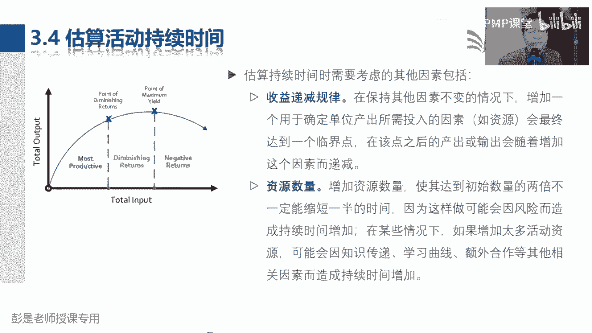
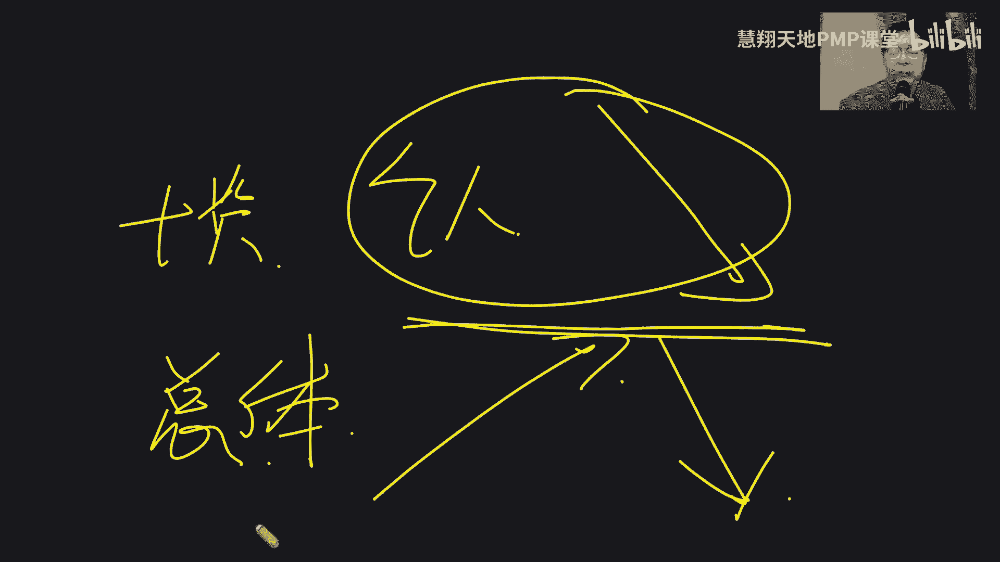
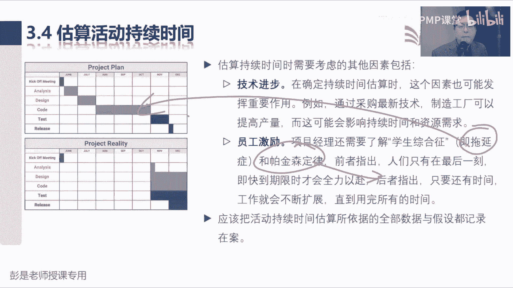
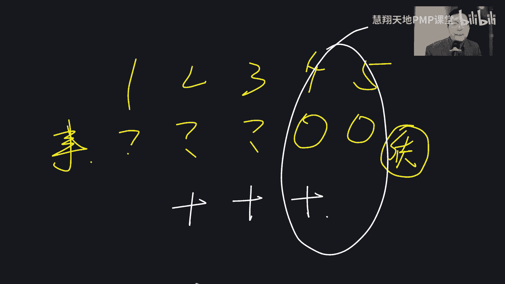

# 2024PMP认证考试课程（第六版+敏捷+第七版） - P10：3.1-3.6 项目管理进度、排列活动顺序 - 慧翔天地PMP课堂 - BV1By411b7qM

那进度这章怎么干活呢，我们刚才有了范围说明书，有了WB，有了WBS词典，我们去分析什么时间能干多少活儿，什么时间能干多少活儿，所以我们要找到最底层的，现在需要完成的东西，就称之为工作包，找到这个东西。

然后去分析了这个工作包，这活到底怎么干呢，就得到了一系列的操作步骤，就称之为活动，所以定义活动，这个管理过程是根据我们的范围基准去分解，继续分解分解成一系列的活动，看看这些活动完成诶。

这个工作包对应的工作就完成了，这个工作包对应的成果就得到了，这就是定义活动这个管理过程，那定义活动得到了一个活动清单，活动列表之后啊，这个活动肯定有先后顺序，有的工作是串行，有的工作是并行。

所以排列活动顺序，这个管理过程，它重点就是分析这些活动的逻辑关系，先后顺序，并且呢还要以图形化的方式把它呈现出来，所以这个管理过程主要工作是分析逻辑关系，画图画成网络图，告诉我们先干啥后干啥。

所以快速快速脑补一下上一课见过的这张图啊，这不就是最低配的网络图吗，第一步规划进度管理，第二步定义活动，第三步排列活动顺序，以此类推，这就是这个管理过程存在的意义，画了图之后啊，画了图之后。

下一个管理过程叫估算活动的持续时间，纯粹的字面意思，但是一定要注意的是，它强调的是我们需要先去估算所需要的资源，因为三个人，五个人导会导致活动的持续时间，活动的工期不一样，所以需要先跳到资源这一章。

估算活动资源，得到资源需求，告诉我们现在有几个人可以用，这些人的水平等级分别是什么，最后根据这个估算结果再来估算活动持续时间，所以估算活动持续时间，这个管理过程的输出根本就不用去记啊，纯粹的字面意思。

最后呢制定进度计划，制定进度计划，还记得上节课那个说我们要做一个进度表，那个过程怎么弄啊，先选方法，选工具，比如说我打打开一个excel，然后做一个五一的行程表，那五一的行程表你往里录什么东西呢。

哎什么时间起飞，什么时间到哪，什么时间去哪玩，什么时间，什么时间住哪儿，以此类推广，就把你所有的事项全都列进去，然后呢把所有事项涉及到的时间点给他写清楚，这样呢我们就得到了。

得到了上节课依稀见过的那张图，他精准的告诉我们什么时间做什么事情，并且能够看出来这些事情是串行啊还是并行啊，这就是制定监督计划这个管理过程的主要作用，选工具，选方法，把我们和进度相关的。

各种各样的数据录入到工具里，创建进度模型，进度模型，进度模型一旦确定了所有的具体的时间和日期，就得到了进度基准，告诉我们今天要干什么事情，明天要干什么事情，经过了审批，那么这个具体日期。

具体时间就是我们的进度基准，3。5就下班了，所以3。23。3，3。4，3。5是这一章最核心的四个管理过程，在此基础之上，我们再加上一头一尾，你不得想一想这一大堆事怎么管，所以就有了规划进度管理。

比如说最基本的计量单位取什么呀，是小时分钟，天年月诶，他要把这个规则说清楚，告诉我们3。2到3。6怎么干活，那有头必有尾，控制进度关注的是什么呢，就是那三个东西啊，绩效数据，绩效信息，绩效报告。

这个还记得吗，唉倒车，倒到这张表，我们指导与管理项目工作，会得到原始的工作绩效数据，还没有经过任何的分析和加工，把这个玩意儿交给九个大臣监控过程组，这一大堆管理过程，所以变成场景就是负责控制进度的同事。

拿到和进度有关的原始的工作绩效数据，然后呢经过我们的分析，把它变成和进度相关的工作绩效信息，就是张张三今天早上几点到的公司，李四今天早上几点到的公司，原始的工作提交数据，什么叫绩效信息呢，张三迟到了。

第四没迟到，王五迟到了以色列，以色列推就得到了进度的相关的技效信息，然后呢，我们再把所有的绩效信息，这一大堆产出的绩效信息全都交给项目经理，由项目经理通过监控项目工作，那一大堆分析方法总结分析评估。

该规划归纳概括变成整个项目的工作绩效报告，哎，控制进度下班了，这就是大概这一章好，所以看看这几个这几这几个单词啊，规划进度管理，一出进度的管理，计划定义活动，我们会得到活动清单，活动清单配上他的好朋友。

活动属性WPS对词典，那么清单就有解释，清单的文档就称之为活动属性，这都是一对的，然后排列活动顺序是看看先先做啥，后做啥画图，所以它的输出就叫进度网络图，估算活动持续时间的输出根本就不用去记。

就叫持续时间估算，再配上一个估算依据，那制定进度计划会得到两个重要的输出，一个是进度表，这是schedule项目进度计划，进度计划一旦得到了关键干型的批准，确定了所有的时间点。

那就得到了第二个输出进度基准，最后呢控制进度数据信息变更请求，再加上一个单独的进度的预测，这打开这一章输入输出，不太需要刻意的去记了啊，好搞定，那咱们接下来看上节课讲到了规划进度管理。

这个管理过程听一遍就差不多了，他没什么考点，规划进度管理，就是想一想我们进度这一章，这些管理过程到底怎么管，所以呢它的输入没啥东西，输输出也没啥东西，工具也没什么需要去记的，3121。

进度管理计划的内容啊，都是听一遍，知道怎么回事就可以了啊，进度模型到底怎么定啊，用什么excel project，用项目管理信息系统建模的方法是不太一样的，然后准确度，准确度定义了需要规定活动持续时间。

估算的可接受区间以及允许的应急储备数量，嗯嗯什么叫可接受区间呢，公司规定九点钟上班，老板说呀，迟到3分钟不叫事儿，唉，我能接受3分钟之内的指导，这是准准时准时准时，他这个要求对不对，还知道意思可以了啊。

然后计量单位纯粹的字面意思没啥需要去记的，组织连接程序，这理解不理解根本就不重要啊，什么叫组织连接程序，大概说一下啊，就是想想一个道理啊，项目中的事情，有没有可能和你公司的事情是脱节的，这不可能吧。

因为你项目请假呀，请款啊，付款呢，盖章啊，你项目中的这些事情，肯定和公司会有千丝万缕的关联关系啊，唉组织程序连接就干这个事情，了解就可以了，不考，然后进入模型维护，不考，这纯粹是什么意思啊，控制临界值。

这是需要记住的非常重要的一个知识点，控制零临界值就是可能需要规定偏差，临界值用来监督进度绩效，它是需要采取某种措施，之前允许出现的最大差异，和刚才那个准确度一样的，公司规定九点钟上班，13分钟以内。

直到不需要采取措施，不扣钱，不扣绩效诶，所以迟到时间如果小于3分钟，那么在临界值之内是不需要采取措施的，超出临界值意味着说这个东西不可以接受了，才需要采取措施，这个需要了解，然后报告格式字面意思啊。

那绩效测量规则以前会给大家讲的非常细，现在呢这么多年，最近56年这玩意儿基本上不考太细了，所以呢咱就不讲了，后面讲政治分析的时候，再稍微提一句就完事了，然后3。2定义活动，那么看看这个管理过程。

找到范围基准返回基本里面有发霉说明书，WBS和WBS的词典，我们实际上是找到WBS最底层的工作包，然后分析怎么把这个工作包给它搞定，所以就会得到活动清单，活动属性，这一对好朋友，除了活动清单，活动属性。

第三个输出根本就不用去记，就叫里程碑清单，纯粹的字面意思啊，我们要把所有的里程碑弄一个列表，那接下来还记得什么叫里程碑吗，什么是里程碑啊，这节点吧，就像各位同学最近在干在干啥，报名对不对。

班主任发通知报名开始，班主任发通知报名结束，班主任发通知开始交钱，哎就这东西啊，体现他是一个这是重大节点，就知道意思就够了，中间工具专家判断没啥说的，分解和创建WBS的分解是一模一样。

滚动式规划的中心思想还记得吗，唉这一远一近呐，近期的咋整，远期的可以咋整，下次再做，体现项目渐进明细的特点，近期要完成的事情，近期要完成的事情，这个计划最好定的详细一点，远期的事情啊。

这个计划可以粗略一点，到时候再细化，这是滚动式规划技术，所以带出来WBS有一个单，有三个单词啊，说等我换到一个有空白的地方，这是我们的WPS，这是主要可交付成果，往下分解分解分解第一个包。

第二个包近期要完成，那咱就把它继续往下分解，分解到足够的合适的颗粒度，分解到工作包这个层级，这就是近期要完成的工作，详细规划，远期要完成的工作呀，到时候以后再分解，那可以把它标记为什么来着。

归好以后再分解，现在先不分解诶，知道这意思啊，所以滚进滚动式规划，在整个我们这些管理过程里面都可以用嗯，说里程碑，关键节点关口三个概念是一个意思吗，关口也是也是一个关口，是要做决策的这么一个事件。

他不代表的状态呀，不代表着状态啊，但里程碑呢主要体现的就是状态，关键节点就是状态，上课下课上班下班开始考试，考试结束，嗯好，所以定义活动这个管理过程其实也是，后面复习的时候基本上看一遍就可以了。

没什么复杂的东西啊，那这个管理过程输入没啥东西了，输出活动清单，活动清单这三段文字听一遍就完事了，清单包括进度活动，然后呢活动要有标识对吧，1。1买飞机票，1。2，买火车票，1。3，订酒店1。4。

什么什么什么东西，以此类推，只要有标识，需要有名称，需要去描述它，然后3222活动属性，活动属性看起来内容多，实际上不需要去记得，为什么呢，在思考啊，定义活动会得到活动的清单，然后接下来排列活动顺序。

他要分析什么呢，活动，活动之间的先后顺序逻辑关系吧，分析这些活动的先后顺序，逻辑关系串行并行啊，分析完成之后呢，再用图形化的方式把它呈现出来，那排列活动顺序，有没有有没有必要去更新活动属性呢。

有没有可能会更新这玩意呢，需要吧，因为这是活动的属性啊，这是活动的特点呢，对不对，这是活动的特点，应当以此类推了，估算活动资源要不要更新一下它呢，估算活动持续时间，要不要更新一下它呢，制定进度计划。

还有可能调整活动的资源啊，属性啊，先后顺序啊，所以未来随着后边这些管理过程的开展，都有可能会不断地不断地不断地更新，活动属性这个东西，那他更新的内容是什么呢，就是这个管理过程做了什么事。

就更新什么内容进来就可以了，知道这个中心思想，知道这个这个逻辑就可以了，所以它里面就包括，现在我们有的可能是活动描述，活动id，活动名称，然后随着排列活动顺序的开展。

我们可能需要更新的什么紧前紧后逻辑关系，提前量之后量估算资源，我们会得得到资源需求更新进去，然后呢像估算时间啊，制定进度计划呀，可能更新一大堆什么强制日期呀，制约因素啊，以此类推。

总之就是随着后续管理过程的开展，我们随时可能会更新，它做了什么事儿就更新什么内容进去，所以它的具体内容不要求现在，不要求大家去记啊，也不会考说活动属性有什么内容，哪个管理过程可能会更新。

它这种这种基本的概念题不会考啊，好知道这个意思可以了，所以他的文字不要求大家去记，但是道理要能听懂，那里程碑也没啥解释的了，什么重要时点，重要时点或事件，历史上所有的里程碑对吧，签约这是里程碑。

客户打款了，这是里程碑给客户发币发票了，这都是里程碑标志着一个当时的一个状态，所以里程碑的持续时间等于零，因为他们代表着一个重要的时间点或事件，上课下课，这也是里程碑，以此类推了啊。

这东西也没什么复杂的东西好，然后3。3排列活动顺序，这个管理过程看ITTO的话，输入不需要去记，就是刚才我们准备好的这些材料输出，一定要记住这个单词，因为看名字不太容易猜对啊，项目进度网络图。

项目进度网络图这个名字，为了方便大家更好的记忆，再抬头看看课件，咱先看图，记住啊，学习小窍门，这个管理过程如果不太好理解，先看输出，书上都有图形化的事例，那现在3321就是画出来一张进度网络图。

它来体现这些活动的逻辑关系，然后呢这个网络图里边肯定有两个方块，是一个叫开始，一个叫结束，这是项目的开始和项目的结束，中间呢就是我们具体的活动，那中间具体的活动就会发现啊。

这是活动A这叫活动B这叫活动C，这叫活动D，这叫活动E每个方块就是个活动，那箭头表现的是什么呢，下箭头表示的是啥呀，前后这是先后顺序吧，你看看活动A和活动B这俩的，他俩的关系是什么呢。

能解读出来就到位了啊，A的箭头是从尾巴出来的吧，那就是A之后对不对，然后B呢这个箭头顶到B的脑袋上，就代表着B之前呢，所以他就是前一项工作完成，后一项工作开始，所以活动A和活动B就叫完成到开始。

那以此类推，活动B到活动C人家给咱标出来了，开始到开始活动B1开始活动C就可以开始了，就像咱现在给大家上课，对活动必是老师在讲课，我一开始讲课，各位同学就开始听课了，那各位同学听课之前。

可能你的手机还没打开呢，可能你的电脑还没开开呢，所以活动C要想开始，它有两个紧贴条件，第一个条件是老师开始上课了，第二个条件是你的电脑已经准备启动完成了，对不对，能够把这张表哎。

这个释义的逻辑关系能给他读明白就可以啊，这就是排列活动顺序需要画出来的这张图，网络图，那以此类推了，活动必完成活动一开始，活动一开始啊，只有一个条件不够的，还有第二个条件，第二个条件是活动地也要完成。

两个条件都具备才能够开始活动，一以此类推，就画这张图，好知道这个意思啊，倒车倒车，所以这个管理过程最重要的作用，就是拿到我们的活动清单，然后去分析这些活动到底什么是串行啊，哪些活动是并行呢。

谁先做啥后做啥，画出来那张图，那画图方法，这三个工具就没得商量，需要记住的第一个叫紧前关系绘图法PDM，就写缩写就可以了啊，它也称为AON，就像线上同学有姚晨同学说的啊。

Active active on node，这活动节点法介绍，第一个工具紧前关系绘图法，PDM又称为AON活动节点法，用节点也就是刚才见过的那个大方块，用节点来表示活动，用箭头表示活动之间的逻辑关系。

好第二个确定和整合依赖关系，那刚才紧前关系绘图法分析的是逻辑关系，逻辑关系都有什么呢，刚才我们听说过啊，一个叫完成到开始，然后呢我们看依稀看到那张图啊，还有一个东西叫开始到开始。

那有没有可能完成到完成呢，有没有可能完成到完成啊，我一下课，各位同学就听完课了，那有没有可能最后一个叫开始到完成呢，开始到完成，这种这种逻辑关系通常适用于什么场景，只要能想明白这个工具就学完了。

完成到开始好理解，开始到开始我一讲课，你们就开始听课，好理解，我一下课，各位同学就听完课也好理解，那最后一个开始到完成是什么东西呢，它主要就适用于交接这种场景，比如有没有见过4×100米啊。

张三开始跑了，李四就可以停了吧，对张三拿到拿到那个接力棒，开始跑，开始跑了，哎李四就可以结束跑步了，就这东西吧，所以它适用于交接这场景啊，大家听听，这就是颈前关系绘图法，两个单词排列组合，一个叫开始。

一个叫完成，他来分析啊，什么东西是先完成A完成B开始，什么东西是同时开始，什么时候什么东西，什么活动是同时完成，然后呢，什么是开始到完成，以此类推，分析各种各样的逻辑关系，把它画成图。

那确定和整合依赖关系分析的是什么呢，也是四个单词，这后面工具技术还会再讲的啊，各位同学现在只是听一听，能听懂最好听不懂不着急啊，工具技术后面单独讲，现在工具记住再说最后一遍了。

现在很多很多的工具技术不会考这么细了，不要求这么高了，因为太细了太琐碎了，更考的是格局，考的是你对这个东西的理解，所以工具咱们放到最后统一讲，各位同学做章节练习题的时候，发现工具技术啊，老师上课没讲呢。

不着急，你看看咱教材的目录，就会知道第11章全是工具啊，所以这不着急不着急，现在给大家先提一提，提一提啊，好确定和整合依赖关系分析的是什么呢，那除了完成和开始这种逻辑关系，还有四个东西，一个叫强制的。

对选择的什么叫强制的依赖关系啊，什么叫强制的依赖关系的，电脑不开机能上课吗，不行不行，对不对，这是没得商量的，它来源于客观限制，咱电脑没联网能上课吗，不行不行，没有网怎么能上课呢，对不对。

这就是强制的逻辑关系，他去分析什么东西，必须是这种这种先后顺序，所以他关注的就是哪些东西啊，可能必须是串行，那选择性依赖关系是什么意思呢，就和他刚好相反，有的选呢随便哪无所谓啊，不重要啊。

他更关注的是看看什么事情可以并行，所以像选择性依赖关系，就像各位同学，今天早上你起床的时候先洗脸还是先刷牙呀，是先吃饭还是先刷牙呀，随便哪，可以先洗脸后刷牙，可以先刷牙后洗脸，可以先吃饭后刷牙。

可以先刷牙后吃饭，也可以不吃饭不刷牙，随便随便随便，这就是选择性依赖关系，他去分析是哪些没必要的活动可以去掉，然后什么东西是可以并行的，这是一对好朋友，强制的和选择的，那除了强制的和选择的。

还可以再分成两部分，一个叫内部，一个叫外部，内部呢关注的就是咱项目组成员自己干的事情，外部呢就取决于项目组在项目团队之外，需要别人做的事情，比如说供应商，政府公司领导审批这种事情。

好所以确定和整合依赖关系，就是继续在分析啊，分析我们这张网络图啊，什么事能串行，什么事能并行，什么事是我们自己把握的，什么事情呢，是需要外部的，外部的人员去开展的事情，比如说这客户给你审批。

供应商给你送货，依赖关系，依赖关系，不要和那个环境因素混了，依赖关系是什么呢，这个事儿依赖于别人，这个事情依赖于别人，这不是外部依赖关系吗，他可能做三天，五天八天，重新做，以此类推，这个事情。

这个活动是由是由5万人，项目团队之外的人干的事情，这东西啊好，那第三个单词，第三个工具叫提前量和滞后量，这个好猜吗，什么叫提前量啊，什么叫T减量啊，咱九点钟上课，各位同学是到了九点才开始打开电脑。

然后登录微信找到课程直播链接，然后呢进入直播间，还是说这些事情最好最好最好提前把它做完呢，避免影响上课吧，就这东西啊，嘿就是去思考我们这些工作，这些活动什么事情是可以提前的，就像各位同学。

你打车也是这个逻辑，司机跟你说，九点钟到你家门口，那你是到九点再下去比较合适呢，还是为了节省时间，提前几分钟下去呢，就这道理吧，就是我们要去思考这些活动，这些活动他受到的各种各样的限制条件。

哎哟能不能可不可以把它提前提前开展，就这个意思啊，纯粹的什么意思，那什么是滞后量，什么是滞后量，crystal同学说等待的时间就是滞后量，那为什么要等呢，它通常也来源于客观限制，通常也来源于客观限制啊。

就像比如说咱家门口修马路，不管人家浇沥青啊，浇水泥啊，交完了之后马上就能上去踩了吗，不行需要等一段时间，对不对，需要等它风干的水烧开了，马上就能喝吗，不行需要等一段时间，因为比较烫啊。

诶所以这就是提前量和滞后量，它关注的点他要去分析一下我们这一大堆活动，有的事情啊，看看能不能提前开展，也可以帮助我们有效的缩短工期，那有些事情可能不能提前开展，反而需要推迟一段时间。

他去分析这些合作活动的各种各样的客观限制，总之最后学完了之后，就会发现123这三个工具就是分析啊，活动的各种各样的属性特点，来得到一个最靠谱的网络图，好知道这三个东西啊。

所以这个管理过程掌握到这个程度OK了，那3。3综述，这段文字说，除了首尾两项，每项活动都至少有一项紧前活动和紧扣活动，并且逻辑关系恰当，首尾两项是什么呢，就是刚才我们见过的项目开始和项目结束，这样的。

哪怕我网络图里面只有一个活动，它仍然有一个颈前一个紧扣，搞定后面文字没啥可解释的了啊，输入没啥解释的了啊，输出就看看刚才这张这一大段文字了，说项目进度，网络图是表示项目活动之间逻辑关系的图形。

然后给书上给了这个例子，刚才解释过了，活动A完成可以开始活动，B活动B1开始就可以开始活动C，活动C要想开始还有两个条件，第二个条件是活动H也要结束活动H1旦结束，我们还可以同时开始活动F。

那活动H开始以后啊，活动H开始以后，这代表什么意思啊，S加十什么鬼，等十吧，咱小学就玩过这个游戏了啊，说，小明到学校10分钟，小红到学校15分钟，小红跟小明说，小明跟小红说。

你出门5分钟以后给我打个电话，这样呢我就出门了，这样咱俩就可以同时到学校了，吃这东西吧，这不就是滞后量吗，你出门5分钟以后给我打电话哎，出门以后开始开始这项活动，一开始开始以后加5分钟，打电话告诉我。

这就是之后量，所以活动H和活动I就是开始到开始加10分钟，加十天，活动H活动H00149同学说的不对啊，活动HS是开始啊，star f是结束，S是开始，star f是finish，是结束，是完成。

所以活动H和活动是活动开始以后，活动开始以后，等十天就可以开始活动I了，就是开始到开始加十天的滞后量，活动F和活动G这才是完成到开始，活动F完成以后，需要等15天就可以开始活动G了。

我们这地方这地方浇水泥，浇完水泥，等15天风干之后，我们就可以开始下一道工序了，这就是结束，就是完成到开始加15天的时候，量好，指着这张示意图能读明白就可以，读明白就可以了啊，那看完这张图啊。

再思考一个小细节，活动K结束以后，我们可以开始活动I和开始活动了，那万一活动K1旦有了延误，就会导致一个什么后果呢，他就会对多个紧后活动产生影响，会影响到活动I会影响到活动L以此类推。

活动H1旦有了问题，他也会对多个紧扣活动产生影响，它会影响到活动I，影响到活动F影响到活动C以此类推，所以活动K这是一个什么呢，风险点，这是个风险点，那它会影响多个紧扣活动，会影响多个情报活动啊。

它就是个分支点，他就是个分支点，那按照这个思路，还能不能找到另外一种风险点呢，分支是发散对吧，有发散就有聚合这种东西吧，哎所以各位同学看看你们能找到什么东西吗，汇聚点吧，活动C啊，活动啊都一个意思吧。

活动C说活动B1旦有问题会影响到他，活动H1旦有问题也会影响到他，它会受到多个紧前活动的影响，唉这就是汇聚点，所以分支点汇聚点都意味着风险，都意味着风险啊，总之最后中心思想就是这个事儿。

只要前面有一堆事儿，它就是汇聚点，它容易受到前面一堆事儿的影响，这个事情后边有一堆事儿，它就叫分支点，它会影响到多个后面的事情，只要能反应过来，只有，只有汇聚点和分支点这两个术语，看到它就反应过来。

这玩意意味着风险就可以了好，所以再往下再往下找到刚才说的这个概念，就可以下班了，带有多个紧前活动的活动，代表着路径的汇聚点，带有多个紧后活动的活动，代表着路径的分支点。

分支点和汇聚点会受到多个活动的影响，和能够影响多个活动，因此都意味着风险，书上给的例子，活动I啊，活动K呀，这段需要记住它，L和J是怎样的过程呢，L结束以后，这才能结束啊，什么叫完成到完成就是我不下课。

各位同学就能下课了吧，不行，就这个逻辑关系啊，对不对，但是呢这个实际上在我们这个讲课的过程中啊，它是一个强制的依赖关系，还是选择性依赖关系呢，说老师不下课，我就不能下课，他是强制的还是选择的，选择的吧。

因为老师即使没下课，有的同学可能自己就下课了吧，哎咱没有强制性的要求，对不对，除非咱现场的同学，反正我不下课，你们出不去，这就变成了选择性依赖关系，知道这个意思啊，好搞定，能学到这个程度。

这这个管理过程就结束了，然后再往下输出更新没什么新的知识点，那3。4排列活动啊，估算活动持续时间，接着开始条件是什么，我，看了J的开始条件是什么呢，强同学，你来告诉我J的开始条件是什么呢。

这不是画的很清楚吗，就这么一个前置条件的活动，I结束，好搞定啊，后面有可能会遇到这样的题啊，他给你一个给你一个活动的列表，告诉你有活动ABCD，然后呢通过文字来描述这些活动的逻辑关系。

告诉你A完成之后开始，BB开始以后就可以开始C，需要我们通过这个活动列表和活动属性，文字描述不就是属性吗，然后能把这张图画出来，但是这种题啊最近两三年基本上不考，所以也不需要过多的贪心了。

这种题不容易丢分啊，那3。4估算活动持续时间，这里边相对来说信息量就又加了一点点，完成到完成是同时完成吗，不一定啊，不一定啊，刚才那张图能看到时间信息吗，刚才那张网络图里面能看到时间信息吗，看不到吧。

你不知道啊，他只是纯粹的分析逻辑关系，没有那么深奥，不要想这么复杂，HELO和J是什么关系呢，哎不解释了不解释了，能看懂，看不懂，看不懂，先跳过啊，这上面都给你五个大字，写的很清楚了。

看看这五个字什么叫完成到完成，专心听啊，各位亲好，那接下来估算活动持续时间，我觉得讲到这儿不再倒车了，这个管理过程输入虽然看起来很多，但是记住中心思想，资源资源的数量，资源的水平。

资源的等级会直接影响到活动的持续时间，因为三个人，五个人工期不一样，三个高级工程师和三个初级工程师工期不一样，有经验的人学p mp和没有经验的人学p mp，他这个股东持续时间是不同的，就这个逻辑。

所以他输入一大堆资源呢，资源呢，资源呢资源呢没什么需要去记的，然后出输出也没有什么需要去记的，纯粹的字面意思啊，持续时间估算配上一个估算依据，估算允许就是你凭什么这么说，这个玩意儿需要这么长时间。

给出我们一个估算的，估算的参考的东西，体现这个东西的客观性，这都不需要去背的东西，那中间就是需要学的，就是工具技术专家判断没什么东西，类比估算参数估算三点估算自下而上，估算2345肯定要掌握。

然后储备分析肯定要掌握，就这么五个东西，类比参数三点，自下而上加储备分析，好工具技术再说一遍，工具技术后面会统一再说的，先粗暴，有个印象，如果可听的足够足够精，应该就能学完了，类比估算和参数估算。

这一对好朋友，他俩的本质区别是什么呢，什么叫类比，什么叫参数，类比好猜啊，类比类比，找一个差不多的，然后拍脑袋吧，找一个差不多的项目，一拍脑袋就得到了一个估算结果，昨天吃了十块钱，今天我觉得差不多诶。

类比估算，那什么是参数，估算的参数就想到变量，变量，就想到咱上学的时候学的那种什么，一元一次方程，二元一次方程，它有公式，有模型，涉及到一些统计方法，所以这两个工具的典型区别，听场景啊。

说去年公司聚餐花了1万块钱，老板问今年咱聚餐花多少钱，一拍脑袋和去年差不多，给出一个估算结果，说也是1万，这就叫类比估算，参考历史信息，直接给出估算结果，参数估算是怎么算的，说去年聚餐人均消费100块。

咱数一数二，今年一共有多少人，然后呢用人均消费乘以人数，用公式，用模型，用统计方法经过计算才能够得到估算结果，这就叫参数估算，这就是他俩的本质区别，类比估算是直接得到结果。

参数估算还需要经历中间的计算这么一个步骤，所以就像各位同学，你发工资，大家知不知道什么叫工资条啊，工资条这叫类比估算，还是参数估算的参数吧，对不对，一天工资费应该罚你多少多少钱，然后出勤多少天。

什么社保公积金噼里啪啦一顿算哪才能够得到，才能得到计算结果，才能够正知道这个月应该给多少钱，这不就是参数估算吗，那是不是有的有的人上班没有工资条啊，靠老板拍脑袋呀，有这样的企业吧对吧，小企业小作坊哎。

小张这个月表现不错啊，上个月给你多少钱啊，5000这个月差不多5000，这就叫类比估算，它没有经过任何的计算，这是这两个东西的本质区别，那三点估算稍稍说起来复杂一丢丢，三点估算应用的场景是什么呢。

什么叫三点，他是找三个数字叫最乐观，等我先找一个空白的地方写啊，找三个数字，最乐观，最悲观，最可能，生活场景，工作场景，有没有用过类似的事情，最乐观，最悲观，最可能。

就是大家天天早上上班最乐观是最快的时候吧，从家到公司最快最快最快30分钟就到了，最悲观的那就是最慢的情况，对不对，有的时候堵车堵的厉害，可能需要60分钟啊，那最可能的就是大多数情况下吧。

哎大多数情况下可能是40分钟，我们需要找到这三个数字，最最最最乐观的就是最小值，最微观的就是最大值，最可能的就是中间值，然后通过算法来估算这个期望的结果，那它的算法是什么呢，再看PPT啊。

我们找到了一个最小值，一个最大值，一个中间值，最小值就是最乐观，最大值就是最悲观，中间值就是最可能，它有两种两种算法，第一个算法叫三角分布，三角分布啊就是取平均值，把这三个数字加到一起除以三。

第二种算法叫什么呢，叫贝塔分布，贝塔分布，但是啊用最小值加上四个，最可能加上最大值，然后除以，用最最小值加上四个中间值，加上一个最大值除以六，这俩算法有什么区别，一个是小中大加到一起除以三。

一个是小四个中加上最大除以六，品一品这两种算法的区别是啥，哪个更接近于实际情况呢，贝塔分布吧，因为我们给最可能这个结果分配了四倍权重，对不对，相当于他一个人说话顶四个人，同时我们还考虑了最乐观和最悲观。

这两种可能性，所以它的计算结果更接近于实际情况，同时又考虑了这种不稳定这种风险，所以未来看到类似的场景啊，默认咱潜规则默认都用贝塔分布这个公式，默认都用贝塔分布这个公式，这就是场景啊。

默认默认默认就这两个字没那么难理解吧，只要看到计算什么三点估算，看到PRT分析这样的题，默认都用贝塔分布去计算就可以了，哎这就是三点估算，它的也他的它的主要主要工作，那为什么要考虑这些什么乐观悲观呢。

其实就是因为他不稳定，因为它有风险，因为它存在着不确定性对吧，我每天上班坐地铁就很稳定了，基本上没有什么，基本上没有什么时间上的较大较大，出入较大偏差，那如果每天早上开车唉，这就不稳定了，有的时候快。

有的时候慢，有的时候堵的时间长，有的时候堵的时间少，它存在着这种风险，是存在着这种不确定，所以我们才需要需要采取选取更多的点，更多的数据来进行这样的计算，进行这样的分析，这是三点估算，这种估算方法。

那自下而上估算是干什么的呢，自下而上其实就是个大道理，再看PPT啊，咱一整个49管理过程的目的，就是一种这这个大道理，项目章程里面，有没有关于整个项目工期的总体要求，宏观要求呢，肯定有吧，对还记得吧。

目的目标成功标准，退出标准，总体要求总体要求就包括了范围进度，成本质量各个各个方面的要求，那这个工期要求你有信心有把握吗，没有，所以才需要干啥呢，收集需求，定义范围，创建WB，创建了WBS。

得到了各一大堆工作包，得到了一大堆控制账户规划包，这种情况下，我们可以基于工作包，基于控制账户，一拍脑袋仍然可以算出来一个大概的时间，这个时间是不是比这个宏观的工期更细化了，准确度是不是提升了。

但是有把握吗，不一定，所以我们又做了一个什么操作呢，定义活动，找到WBS最底层的工作包，分析完成工作包需要开展，开展到具体事情就得到了活动清单，有了活动清单，我们再去据此来估算所需要的资源时间和成本。

这种情况下给出的估算结果，是不是准确度又有所提升了，就这道理吧，就体现了体现了整个项目渐渐明晰的这个特点，宏观的东西，高层级的东西，粗略的东西不一定有信心，到了WBS这个层级诶。

虽然可能会一拍脑袋找一个差不多的东西，找一个差不多的事情，然后得出相关于资源时间和成本的估算，但是估算结果啊可能仍然没有把握，那为了得到更精准的估算结果，所以我们做了进一步的分解。

分解到活动这个细化的层级上，再去估算资源时间和成本，这种情况下给出的估算结果就越来越有信心了，它的可信度就会有所提升，那这套东西不就是自下而上，对不对，从上往下，从上往下做分解，然后从下往上估算结果。

从下往上做汇总，这样呢到了层级越低，我们给出的估算结果越可信，越可信的估算结果汇总出来，唉最后整个项目的工期呀，成本呢才才才有更好的可信度，这就是自下而上估算，能听懂这个道理。

这个怪这个工具基本上也不太好啊，就搞定了好，所以类比估算是找一个差不多的事情，一拍脑袋得到估算结果，这叫类比参数，估算呢是用公式，用模型，用统计方法，你就想到你的工资条就可以了，噼里啪啦一顿算。

就像最近各位同学报报税，报税是参数吧，对不对，你要填很多信息进去啊，然后参考，你得去参考你去年的什么什么各种东西，参考你的什么公积金，参考你的工资，参考你的什么什么房贷，噼里啪啦一顿算。

算出来给你退多少税，这不是参数，估算三点估算呢就是考虑到风险，考虑到这个活动的时间可能存在的不稳定，我们找一个最乐观，最悲观，最可能默认用贝塔分布给出一个计算结果，自下而上估算通常就用于当前的估算结果。

没信心，通常就用于对当前的估算结果没信心，认为啊他不可信，并认为他没把握再做进一步的分解，把大活动分解成更小的活动，仅此而已，把大活动分解成更小的活动，仅此而已啊，它就适用于这样的场景。

那最后一个工具呢叫储备分析，储备分析干啥的，什么叫储备呀，什么又是储备呢，再看PPT啊，从家到公司，不管你用什么估算方法，假设估算结果呀，一个小时就能到公司了，公司九点钟上班，咱就八点钟出门吗。

不少人都是这样的哈，一看导航告诉你一个小时就能到公司了，公司九点上班，八点钟准时出门，卡着点去，这里边可能会有什么问题呢，唉风险吧对吧，万一路上堵车了怎么办，万一地铁来了，挤不上去怎么办。

万一地铁到站了，挤不下去怎么办，等电梯，万一人太多，挤不进去怎么办，爬楼梯爬不动怎么办，就以此类推吧，里边有各种各样的可能不可控的因素，但是刚才说的那些东西啊，什么堵车呀，地铁慢啊，地铁故障啊。

这对我们来说都叫什么呢，你能说出来的就叫有认知的事情吧，能说出来的，这叫有认知的事情，这对我们来说就叫已知风险，那有没有可能出现一些我们没有认知的事情，这对我们来说就叫未知风险，哎那已知风险和未知风险。

我们要考虑准备一些额外的时间，这就是储备，那已知风险准备的额外的时间叫什么储备呢，叫应急储备，这是需要记住的东西啊，已知风险，已知风险准备的额外的时间就叫应急储备，天天坐地铁，这地铁到站了。

我可能挤不上去，那为了稳妥起见，我再准备10分钟时间来应付这个事情，这对我来说是一个已知风险，就叫应急储备公司楼下电梯，每次等电梯，等电梯都要等好久，大概5分钟左右，为了稳妥起见，我再准备5分钟。

这是已知风险准备的应急储备，那未知风险准备的叫什么呢，不知道路上会发生啥，但是为了保险，为了保险，为了稳妥起见，再额外准备出来什么，10分钟，15分钟，那那么它就称之为管理储备，这是一对好朋友。

两对好朋友，已知风险对应急储备，未知风险对管理储备好搞定下班，所以储备分析我们就是分析啊这些活动啊，他有没有可能面临着一些已知的风险呢，未知的风险呢，需不需要对我们的估算时间。

这个结果准备一些应急储备和管理储备，比如说像各位同学工作中这些什么，涉及到什么技术工作呀，创意工作呀，这种东西需不需要准备一些管理储备呢，需要吧，因为不确定啊，因为不确定啊，好知道这个意思啊。

这就是估算活动持续时间，大家这几个工具先指导它的主要作用，帮助我们得到一个更精准的估算结果，然后它的输入没什么需要解释的，但是有个单词我们应该是第一次看，所以大概猜一猜它是干啥的啊，资源日历。

这是我们33个文件里面，比较重要的一个玩意儿，资源日历它的作用是什么呢，资源日历来分割线同学给出了正确答案，它的主要作用体现的就是资源的可用性，体现的是每一种资源的可用性，大家比如看综艺说明星。

我们约明星来上我们这个综艺节目，这个明星啊，结果没档期，他没时间，这段时间它对我们来说不可用，唉这就是资源日历，你买火车票，买飞机票能不能看到，买电影票能不能看到明天还有没有票，这是什么东西呢。

它是不是也是一种资源日历行吧，我想看看明天我需要十张火车票诶，结果发现没有票了，明天这个资源对我来说不可用啊，你在公司里面上班，你的公司的会议室有没有这种预定管理工作呢，有没有一个排期表啊。

能够看到这间会议室，周一周二周三周四周五上午，下午没什么时间空闲，什么时间被别人订走了，它体现的都是资源的可用性，所以它有各种各样的表现形式啊，这叫资源日历，就是排期，每一种资源的排期。

告诉我们这个资源什么时间是在干什么事，什么时间是空闲的，空闲呢，对我们来说不就是可用嘛，对不对，张公下周几你有空啊，咱约个饭局啊，这不是资源日历吗，张工说我要看一下我的行程安排好。

所以它可以有各种各样的变形，这个单词需要需要熟悉啊，那接下来后边这一段这个管理过程，哎我印象中有很多的理论知识需要听一听，所以呢需要大家先缓一口气啊，这一大段文字看起来字很多。

但基本上也是听完大道理就可以了，对不会考这个概念啊，现在提醒我们什么东西呢，第一段是说估算活动持续时间依据的信息，包括这是输入，这没啥可解释的，什么工作范围啊什么的，资源类型啊，水平啊，等级啊，数量啊。

以及资源可用性，这些东西，可能会直接影响到我们的活动持续时间，因为三个人五个人攻击不一样，三个高级工程师和三个初级工程师干活的，干活的时间也不一样，要听一听，听懂就可以就不用看了。

然后第二段呢说应该由团队中，最熟悉具体活动的个人和小组提供持续时间，估算所需的各种输入，只能再告诉我们一个什么道理，非常重要的一个理念，啥意思啊，变成大白话是什么样，就谁干活谁清楚吧，就这个意思啊。

实际干过实际干活的人才了才知道，对不对，我们干这个活儿，干这个事情，完成了一个工作，完成了一个活动所需要的东西啊，对不对，专业的事找专业的人呐，谁干活谁清楚，所以前面一直在说。

我们希望成员参与计划的制定，这样的制定出来的计划具有更好的可行性，更靠谱啊，这也是听明白这个意思就够了，然后再往下说，在本过程之中，我们首先哔哩吧啦，哔哩吧啦这一大段文字在说什么呢，说我们要什么工作量。

然后资源数量，工作量就是比如说这个活儿100人天，然后算一算有多少个人，30个人，那我们可能三天就把这个东西搞定了，还要结合项目日历和资源日历，资源日历咱知道是什么东西了啊，体现这个资源的可用性。

这30个人可能有十个人没档期，那我们实际的可用资源，可能就变成了20个人诶，工期就从三天变成了五天，它会影响到估算结果，那项目日历是什么东西的，资源日历体现的是资源的可用性。

项目日历体现的就是时间的可用性，那什么叫时间的可用性呢，什么叫时间的可用性呢，再粗暴举个例子啊，啊刚过完清明节，清明放假几天，哪哪几天放假呀，清明哪天放假呀，我还真不知道456啊，好老板说，冯老师。

4月1号你干干一个事儿，然后我估算了一下这个事，这个事大概需要七天，那么4月1号，4月2号，4月3号，4月4号，4月5号，4月6号，4月7号，我这个活就可以完成了，但是呢456这三天是不上班的。

所以我最终的交付日期是几号呢，10号吧，我这个东西就7号要，那怎么办呢，456就需要加班了，诶这个就叫项目日历，告诉我们成员什么时间上班，什么时间休息，什么时间放假，体现的是时间的可用性，时间的可用性。

会直接影响到这些工作的完成时间，会影响到我们整个项目的交付日期，这个和大家工作中工作中对吧，一周上几天班啊，是五天呐，天呐七天，那以此类推，交付日期是不一样的，好这听懂就可以哈。

所以整个教材里面叫日历的，就两个东西都在这了，一个叫项目日历，体现的是时间的可用性，一个叫资源日历，体现的是每一种资源的可用性，然后后面这句话说数量等级会影响什么，什么持续时间，这很好理解。

最后呢这句话也是听一听就完事了，什么有时候因为工作的特性，无论资源分配如何，比如24小时的应力测试，都需要花预定的时间才能够完成，什么叫24小时的应力测试呢，不一定看得懂，对不对，所以粗暴换一个场景啊。

比如说怀孕这个事情，通常可能需要十个月才能把小孩生出来，两个孕妇有没有可能五个月没戏，对不对，为什么呢，客观限制客观限制就这个意思，所以因为这些工作的特性，可能取决于这些工作的客观限制，那我们投入资源。

数量水平等级和这个时间是没关系的，对不对，说我身经百战胜过十个小孩了，下次啊五个月争取生完不可能不现实，因为这是客观限制，它和资源的数量水平等级可能就没关系了，所以24小时的应应力测试。

就需要坐满24个小时，就这意思啊，这都是了解，就可以大家实际工作中工作去估算时间的时候，参考参考这些东西，参考这些道理就可以考试，考试的时候现在基本上不考细节性的东西，太多了好再往下又是个大道理。

叫收益递减和资源数量，收益递减规律和资源数量，看PPT等我换黑板哈。

这也是听听懂这个大道理就可以了啊，什么叫收益递减呢，看场景啊，比如说疫情期间做核酸，我们小区有这么多人，然后呢安排了十个护士，八小时基本上就可以把这些人完成核酸检测了，那接下来20个护士。

有没有可能四小时把这活干完，差不多吧，40个护士有没有可能两个小时，400个护士有没有可能0。2小时，400万个护士，有没有可能一秒把这个事情搞定，没戏了吧，400万个护士在小区门口扫码登记。

可能八小时都搞不定，那我们就会发现一个什么规律呢，这一堆护士总体的产能随着人数的增加，肯定是先上升，十个护士一小时能做100个人，20个护士一小时有可能做200个人诶，总体的生产总体的产能。

总体的生产率是开始先上升的，但是总能找到一个临界点，超过这个临界临界点之后啊，就开始下降，这就是收益递减这个道理，所以大家实际工作中，生活中这个道理无处不在啊，比如说啊我喜欢吃辣腿堡。

中午打算让班主任给咱给咱买两个汉堡，吃第一个的时候满足感超强，是第二个的时候差不多了，吃第三个的时候，第四个，第五个，第六个，第七个，第十个醋，只有这个道理，我得到的收益是在下降的。

随着资源的增加和得到的收益却越来越少，收益递减规律就是这个道理啊，所以他对对标到对包到实际工作场景，接下来想一想，这是我一天工作八个小时，假设我能够种100棵树，这是土豆丝，冯老师。

一天八小时我能种100棵树，现在啊公司给我安排了一个张三，说你们俩一起来干活，这种情况下，我八小时里面或多或少需要拿出一丢丢，时间来干什么事呢，玩儿玩儿不是来了新同事，你们俩工作之间要不要相互协调对。

要不要沟通交流对，甚至教他怎么种树培训呢，指导啊，诶我需要拿出一些时间来和公张三沟通，协调交流，组织干这个事情啊，就会导致我实际干活的时间变变少了吧，实际干活的时间变短了，那我的生产率实际上就是下降了。

以此类推，再安排一个李四过来唉，我再需要拿出一点点额外的时间和李四沟通，协调交流培训，那我的工作时长又变短了，生产率又下降了，最后就变成了这么一句话，不断的增加资源，就会导致每个人的生产率下降。

因为我们需要拿时间组织大家沟通交流培训，干这个事情啊，这是个体，对每个人来说生产力是下降的，但是对整个团队来说，总体上看是什么一个规律呢，先增长后下降，总能找到一个临界点，比如说400万个护士对吧。

比如说500个500万人来种树，总能找到一个临界值，就是边际效应达到这个临界值之后，我们再增加资源，反而会导致整体的产能开始下降了，因为我们大部分时间都在组织协调沟通，没人干活了。

这就是大概收益递减规律，这段文字想说这么一个大大道理。

只听懂就可以，所以其实中心思想啊就在提醒我们，不要无休止的增加资源，想一想你企业里边，比如说我们公司定了今年一个小目标一个亿，那我们配30个销售人员，那配300个销售人员有没有可能赚十个亿呢。

配300万个销售人员有没有可能赚1万个亿呢，不现实对不对，因为因为收益递减，人越多，人越多，管理成本乱七八糟的行政工作就多了，哎就会导致生产力下降，这就是收益低点啊，听懂这个道理就可以。

这段文字呢咱就不念了，说收益递减规律，我们找到一个临界值，在临界值之后，产出和输出会随着增加这个次元而开始衰减，那资源数量也在说说增加资源数量，可能因为知识传递呀，学习呀，额外合作呀，组织交流沟通。

培训哪等等等等，因为各种各样的原因会导致生产力下降，生产率下降就会导致持续时间增加，这个再转个小弯，一天工作八小时，可以种100棵树，现在需要花10分钟和张三去沟通，那我如果还想完成100个数这个目标。

那我实际上今天干活就需要八个小时，零十分钟，反而导致持续时间增加，你再安排个李四，我可能需要八个小时零十五分钟，安排个王五过来，八个小时20分钟，以此类推，生产力是下降的，这段文字就在说这个意思啊咳。

好这还在说干活的人呢，啊干着湖畔同学说这个挺好，现在还在说干活的人，我们在增加干活的人，然后呢，不要无休止的投入干活的人啊，因为人越多，人越多，可能需要额外的时间去干这件事情，组织协调沟通交流培训。

就会导致我们整个整个生产率下降，那除了干活的人，就像胡万同学说的是什么呢，对吧，一个人干活八个领导，这也是一种资源的浪费，他不是干活的人啊，好知道这意思啊，再往下技术进步。

纯粹的字面意思就是采用什么技术啊，创新啊，这没啥可解释的，最后员工激励员工激励专心听啊，这玩意儿也基本上不考，但是呢各位同学身上都有在提醒我们，备考PMP的路上，我们要注意了。

我们需要了解学生综合症和帕金森定律，学生综合症也就是拖延症，他说人们只有在最后一刻快到期限时，才会全力以赴诶，咱从小学到大学到，甚至大家目前在学PMP的过程中，目前应该不少人都是这个状态对吧。

就快考试了，快考试了，老师还有50天还不着急，50天呢，先玩一周，玩一周，马上要五一了，咱们得花点时间准备准备再去哪儿浪一浪嘛，对不对，过完五一，过完五一，5月几号上班啊，随便说了啊。

5月7号上班上班回来心情愉悦，你不得花一周时间准备进入到学习状态吗，对不对，唉就到5月中了，几号考试啊，对六一哈，5月中到六一还有大概两周哎，临阵磨枪冲刺一下，差不多了，这是学生拖延症。

不着急不着急不着急，就是杂，哎DD2DD2的时候才是最猛的时候，快嘎了的时候才拼命啊，就这个道理，所以在提醒我们大家在备考PMP的过程中，不要噗按照咱的学习计划，什么时间做什么事，该听课听课。

该看书看书，该做题做题，千万不要拖，为什么不要拖呢，因为帕金帕金森定律告诉我们啊，说后者指出，只要还有时间工作就会不断扩展，直到用完所有的时间，把它变成大白话，叫什么呢，再看黑板。

就这个超级大道理，听完听完知道怎么回事就够了啊，所以啊周一周二周三周四周五，这是下周的日历，然后呢，老板给我一个事，交代你一个工作任务，我一拍脑袋，这个事大概三天完成，周一的时候我着急吗。

周二的时候我着急吗，周三的时候我着急吗，不着急，为什么呢，周四加加班对，周四加加班啊，不着急不着急啊，前三天先浪对吧，摸鱼啊，划水啊玩啊，第四天第五天着急了对对，然后呢，糊弄糊弄，这活就干完了。

这种情况下，这个事情的质量可想而知啊，打问号啊，那实际工作中，老板有没有可能让你一周五天只有三天干活，这肯定不行吧，这老板也神经病啊，所以在工作的过程中，随时可能有新的任务进来，对不对。

工作安排要饱和呀，随时可能有新的任务进来吧，最后周四周五草嘎啦，就这个道理吧，还把活儿都拖到最后，然后呢活又会无休止的增加，以此类推，所以这段文字就在提醒我们，不管是工作还是学PMP呀。

这是赶早不赶晚，赶早不赶晚，按照计划什么时间做什么事，按照计划什么时间做什么事情，咱就尽早的把这些工作完成，不要拖不要拖，拖到最后没好果子吃啊，好咱学习的任务也是要听课看书，然后呢听完课，看完书。

做做那个课后的练习题，这是目前这个备考阶段要做的事情，这个阶段工作完成之后，未来还有很多任务等着你们呢，还有每日练习，还有敏捷专项讲解，还有综合练习，还有模拟考试，只要还有时间。

我们就会给大家安排安排安排所有的事情对，不会让你闲着的，所以赶早不赶晚啊，这大粉丝就在提醒我们这个大道理好，所以估算活动持续时间，前面这段字多，但是不慌，听懂道理就可以，然后后面复习的时候看看这个文字。

看看一遍啊，能反应过来他在说什么道理就够了，不需要去额外的去背它嗯，好再往下了啊，那接下来估算活动持续时间的收入，没有什么新的知识点，这东西都不需要去记住它，找到刚才说的两个重要的术语，标记一下。

后面复习的时候多看看，搞定了一个叫资源日历，它体现我们每一种资源何时可以用，以及可用多久，体现资源的可用性，我们公司下周项目组打算一起再找一个房间，找个会议室一起工作，一起干活。

那看看这个会议室有没有被定对对，空闲空闲几天，然后资源需求这段文字想说什么呢，就是刚才说的收益递减，说对大多数大多数活动来说，例如向某个活动新增资源，或者是分配低技能的资源，那来了新人。

我们就需要一些额外的时间和人家去沟通，协调培训，那就会导致我实际干活的时间变短，实际干活的时间变短，就会导致生产率下降，但如果我还想完成既定的工作，就需要更长的时间，所以随便举几个数字。

帮助大家实锤巩固一下这玩意儿啊，八小时种100棵树，其中需要花10分钟和人家协调，那么生产力就下降了，生产力下降，如果还想完成100棵树，就需要更长的时间，八个小时零十分钟，以此类推。

所以大家比如说有些同学在工作中，比如说你是什么什么小组长啊，主管啊，总监啊，经理啊，既需要完成管理工作，还要完成一些实质性的工作，你就会发现白天基本上没事，没时间干活。

都在组织什么协调沟通交流探讨解决问题，处理冲突，然后就需要加班完成自己本职工作，以此类推，就这个道理好，再往下它的，输出没什么需要去记的股东啊，持续时间估算就是估算结果没啥可解答。

然后估算依据呢知道大道理就够了，总之体现我们这个东西的客观性，对说我们参考了哪些历史数据，参考了哪些信息，使用了什么方法，然后呢咨询了呢，征求了哪些干活的人的意见，专家的意见。

给出的这个估算结果体现它的可信程度，想了解就够了，这就是第33。4这个管理过程，那3。5制定进度计划，这个管理过程，这个管理过程再看PPT定义活动，现在我们知道会得到活动清单，活动属性。

里程碑清单排列活动顺序，我们画了网络图，分析活动的逻辑关系，依赖关系，还有什么提前量，滞后量，总之啊就是分析活动的各种各样的属性和特征，然后估算活动持续时间，我们可能用类比估算，拍脑袋得到得到估算结果。

也可能用参数估算，用公式，用模型，用统计方法经过计算得到估算结果，再考虑风险，我们可能用三点估算，最可能最悲观，最最最乐观，然后用贝塔分布，用三角分布噼里啪啦计算特套估算结果，考虑的风险。

那估算结果如果不可信，我们再考虑用自下而上做进一步的分解，最后呢我们再考虑一些风险因素，比如说有没有已知风险，要不要准备一些应急储备，有没有未知风险，要不要准备管理储备，最后得到的估算结果。

那估算活动持续时间又取决于什么呢，经过学习，我们又知道取决于资源的数量水平和等级，但也不要无休止的投入资源，所以我们需要先去估算活动资源，得到资源需求，现在就叫啥，万事俱备了，有了活动清单，有了网络图。

有了资源需求，有了持续时间的估算结果，然后呢接下来定方法，把这些玩意儿放到我们进度计划编制的软件，编制的工具里，带到工具里，然后创建进度模型，什么叫进度模型呢，其实最终的呈现方式就是各种各样的图表。

所以这个管理过程先看输出，我们会得到一个什么样的图表吗，看PPT啊，我给它放大，这，Biu biu biu biu biu，看的不一定非常清楚，但是知道意思就够了啊，好看到现在PPT上这张图。

开始新产品Z这是个啥东西，开始新产品Z什么完成组建一，这叫啥里程碑吧，开始完成开始完成，开始上班，上班完成，开始吃饭，吃完饭，这都叫里程碑，这都是里程碑啊，哎就用菱形小方块来展示了。

那有的里程碑知道这个东西啊，再看开发和交付新产品Z，这是什么东西呢，开发和交付新产品Z，它下面有工作包一，工作包二，工作包他爹叫啥ca控制账户吧，诶他不干活啊，他负责管理控制啊，管控制进度啊，成本啊。

质量啊，他是这样一个管理控制点，就是控制账户，控制账户，再往下就是工作包一，工作包二，那设计组建一建造组件一，测试组件一，这是啥东西啊，工作包下边的这叫具体的活动了吧，唉机器活动完成。

那么工作包一对应的组件一就出来了，对不对，那这就是活动，这就是整个整个我们进度模型，就要出这个玩意儿啊，从把你的什么控制账户啊，工作包啊，活动啊，都给他在这这里面呈现出来，呈现出来，这是左边啊。

那右边能看出来什么呢，诶这个玩意儿咋移动的，右边能看出来啥，这个条叫什么呢，你看电影追剧有没有这个东西啊，对吧，看到多长时间了，就是进度条，就是进度条，我们能够看到开发和交互性价比。

Z这个控制账户目前的整体进展，还能够看到工作包的整体进展，还能够看到每个活动的进展情况，有颜色的地方说明完成了，白色的地方就说明还没干呢，诶就是进度条能够看到各个层级的进展情况，那除了进展情况啊。

这叫啥呢，什么完成到开始完成到开始完成到开始，体现的就是活动之间的逻辑关系，所以这张表要想做出来，就是把我们前面这些管理过程的输出，扔到软件里对吧，活动清单，活动属性，逻辑关系，依赖关系。

然后这些活动的资源，这些活动的持续时间对不对，比如说这个东西看出来，这是可能七天建造组件一，这个宽度可能是七天，测试组件一，这个宽度也可能是七天，372 11工作包一组建一的宽度是21天。

开发和交付新产品Z，这个宽度看起来这个比例关系可能50天，以此类推吧，所以他能够看到看到所有我们相关心的信息，活动清单，活动属性，逻辑关系，依赖关系，里程碑实际进展，然后他大概需要多长时间，以此类推。

这就是整个整个我们要打造这么一个项目，进度计划，就是那个schedule项目的进度表，所以所以拿到前面这些管理过程的输出，然后把它输入到我们项目进度计划编制的工具。

可以用project什么jr缠到TBONES很多很多工具啊，选工具把它录入到工具里，录入到工具里面，然后理清楚他们的逻辑关系，依赖关系，各种各样的时间，什么什么资源，数量水平。

等级工具就帮你把它变成这种进度表好，这就是这个管理过程要做的事情啊，所以第一个输出就是项目进度计划，那项目进度计划一旦老板跟你说呀，9月1号开始开发和交付新产品Z，9月30号要完成新产品Z的交付。

这就得到了什么东西呢，基准所有确定的具体日期和时间的，强制性的要求，就是基准的要求，这个活儿必须必须9月1号开始，9月30号结束，那这一段时间的开始结束日期一旦敲定，是不是他下面的工作包啊。

活动啊就全都确定了吗，还以此类推了好，所以这就是这个管理过程的两个重要的输出，一个叫项目进度计划，然后一个叫进度基准，记住啊，复杂的管理过程，先看输出，先看图，倒车倒车。

好所以再回到制定进度计划这个管理过程，它的收入看起来一大堆很猛啊，没什么需要去记的，牢牢记住前四个管理过程做的事情，定义活动得到活动清单，排列活动顺序，得到网络图，我们去估算活动资源，在估算活动时间。

拿到这四个管理过程的各种各样的输出，就是这一堆输入，拿到这些东西呢，然后放到软件里，噼里啪啦一顿一顿敲啊，就得到了项目进度计划，这个输出肯定要记住，就是我们的进度表，得到进度表，找领导。

我们确定所有的日期，所有的时间对关键干系人，对项目，对项目的计划经过审批之后才能得到基准，所以项目进度计划经过关键该审的审批，确定了所有的具体日期时间，就得到了进度基准，这是前两个输出，这肯定要记住啊。

好输出三其实不太要求大家去记，什么叫进度数据呢，能猜到吗，进度数据和进度有关的数据，需要敲到软件里的数据，就是这一堆收入吧，唉这东西就不需要去记了，就是输入到软件里的东西，活动清单，逻辑关系。

资源数量水平等级，持续时间诶，最后一个就是项目日历，刚才说过这个东西了啊，这个需要记住的超重要，项目日历体现的是时间的可用性，因为周末上班，周末不上班，交付日期不一样，清明节上班，清明节不上班。

五一上班，五一不上班，交付交付时间不一样，它会影响我们最终的项目结束日期，这个管理过程学到这个程度差不多了，最后后面我们再给大家讲这个复杂的工具，并且呢大部分的工具，现在基本上考得非常非常粗粗略啊。

以前啊还会要求大家去关键路径法，正推逆推超复杂的一个方法，现在呢基本上不要求太细好，所以关键路径法，关键路径法的中心思想是什么呢，看PPT其实基本上后面会听这个案例就听明白。

就咱小学时候学的这种这种这种破例子，小明从家到学校需要10分钟，小红从家到学校需要15分钟，如果他俩都是九点钟出门，请问这个项目几点结束，他俩同时出门，那么这个项目什么时候结束，9。15吧，对不对。

因为09：10分小红还没到学校呢，那谁是关键路径呢，这就是关键路径法的中心思想，小红是关键路径吧，就变成人话就是小红啊，你别迟到啊，别墨迹啊，否则我们就可能没有办法按时交付了，诶。

所以我们把这个粗鄙的东西变成高大上，一点点的东西啊，这是项目开始，然后小明出门去学校，小红出门去学校，小红和小明他俩是并行关系，对不对，同时出门啊，他俩是并行关系啊，然后呢他俩都到学校之后。

我这个项目就结束了，然后接下来我们估算活动持续时间，小明跟你一拍脑袋，用类比估算说我需要10分钟，小明呢用参数估算算一算我每小时骑共享单车，我的速度是多少，算一算从学校到从家到学校距离是多少。

那距离除以速度，给出一个估算结果，比如说16分钟，那好小红需要16分钟，小明需要10分钟，那么下面这条路我们就称之为关键路径，因为它代表着完成项目所需要的工期，这就称之为关键路径。

告诉小红千万千万不要再磨叽了，否则这个项目没有办法按期交付，这就是这就是最简单的关键路径法，复杂一点的关键路径法是什么呢，咱实际工作中，实际项目之中怎么可能只有两个活动呢，复杂一点的关键路径。

比如说我们见过的这张网络图，根据网络图，然后接下来我们估算活动资源，估算活动持续时间，比如说A活动要十天，B活动要五天，C活动七天，什么六天八天，随便写了，那接下来我们要怎么做呢，找路径。

从项目的开始作为出发点，按照箭头的方向从前往后走，走到项目结束，能走通的就称之为一条路径，所以我们可能会得到很多很多的路径吧，A和B是一条路，A b c d e，这是第二条路，AH没有啊。

HCDE以此类推，我们会列出来，列出来很多很多很多的路径，然后呢去分别计算每条路径的持续时间，找到持续时间最长的路，就意味着完成项目所需要的最短时间了，那一个项目可不可以有多个关键路径呢，就讲大道理呗。

小明说需要15分钟，小红说我也需要15分钟，现在我们有几条关键路径的两条，那两条关键路径意味着啥，这个管理的难度是提高了还是下降了，降低了复杂了吧，以前说小小红跟你说，需要16分钟，他是关键路径。

我们只要关注他一个人就可以了，现在两个人都是关键路径，那我们需要关注更多的人呐，所以管理难度实际上就是上升了，这是关键路径的中心思想啊，大概现在知道怎么回事，掌握到这个程度，其实考试够了好。

这就是工具基础，关键路径法，再倒车倒回去啊，大概听明白怎么回事就可以了，关键路径法搞定之后啊，然后进度网络分析，最后再说啊，资源优化的目的是什么呢，资源优化优化的是什么呢，为什么要优化呢。

就说明资源的安排有，问题没问题，优化它干啥，对不对，说明资源的安排有问题啊，比如说大家工作中有没有遇到过这样的场景，今天张三给你安排个活儿，李四给你安排个活儿，导师啊，最后一算，今天这活儿全干，全干完。

不可能会有吧，任务之间的冲突啊，或者是你想请假，对不对，或者是有人请假，或者是有人离职，哎就是资源使用有问题啊，那我们要对资源的使用进行优化，知道这个意思啊，我们会讲资源平衡，资源平滑。

这基本上现在考到的概率也没这么高了，那再往下假设情景分析，敢不敢猜是干啥的，什么叫假设情景分析，为什么要假设，还要假设一个情景，还有人看说了可能会出现的，这是假设出现什么情况，会不会影响我们的工作进展。

如果会咋整，这就是它的主要作用，所以大家实际工作中，生活中都在用啊，想一想有没有用过呀，假设出现什么什么情况，会不会影响这个事，假设出现什么情况，会不会影响这个事，以此类推吧对吧，明天后天要上班。

万一早上起晚了咋整对，那有没有方法，有没有方法能够避免避免早上起晚了，就这意思啊，他其实根就是基于风险去思考，未来有没有可能出现一些问题，出现问题会不会影响到我整个项目的交付日期。

那如果这样的问题有可能会出现，我有没有措施，尽量的想办法避免这个问题出现或发生，这就是假设情景分析，他的中心思想就是去思考，不要影响我的交付日期，不要影响项目的结束日期，去思考有没有可能出现的一些问题。

就是风险好，这个也是现在听一遍就可以了，然后这个模拟啊，等到定等到风险这一章再单独说提前量进货啊，这提前量之后量咱知道了啊，进度压缩的目的是什么呢，这好猜，进度压缩，进度压缩的目的就是压缩进度。

它分成两种方式，一个叫赶工，一个叫快速跟进，在后面具体再讲细节了，然后项目管理信息系统没什么东西啊，敏捷发布规划参加敏捷的时候再讲，所以实际上这个管理过程中间这堆工具，关键路径法，资源优化。

假设经济分析进度压缩，敏捷发布规划是需要大家掌握的，然后第一个其实不大好进度，网络分析是什么呢，在思考我们刚才依稀见过的一张进度表，什么完成组建一，然后什么设计组件，建造组件，测试组件，再弄一个组件二。

在设计测试建造，以此类推，这个进度表有没有可能一次就把它搞定，就像各位同学，你五一打算出去玩，这个这个这个行程安排，有没有可能一步到位，你要跟团我就不说了啊，不现实吧，可能需要不断的调整，对不对。

今天发现这个机票涨价了，那我看看能不能改一个航班对吧，甚至提前出发一下，可能需要不断的调整啊，发现这个酒店满房了，资源不可用了，看看要不要换一个酒店，换酒店可能住的地方远了，要不要租个车呀，以此类推。

我们需要根据我们的客观情况，根据我们的各种现实情况，反复反复反复去调整，去优化，才能得到最终具有可行性的进度计划，所以第一个工具进度网络分析，它的关键词就是反复调整，不太可能不太可能一步到位。

这个项目规模越大，也需要反复调整，所以变成最后的大白话，第一个工具就是综合的运用234567，反复的运用这些方法来得到一个最终满足，人家交付日期的，还有可行性的进度计划，还有可行性的进度计划。

得到关键相关方的批准，确定了所有的时间点，就得到了进度基准好，大概这个这个这个管理过程其实学到这个程度，备考差不多了啊，后边像工具技术进度压缩，还有具体的小细节，在单独等到讲工具的时候再单独说了搞定。

所以这个管理过程，后面的这段文字还是需要大家复习的时候，稍稍都多看他几眼啊，所以制定进度计划是分析这一大堆东西，创建进度模型，这堆东西就是输入，创建进度模型，那本过程的主要作用就是定这个模型。

最后得到领导的批准，得到批准，然后再往下制定可行的项目进度计划，是一个反复进行的过程，所以就用到了刚才那个进度，网络分析综合的运用一大堆的方法，该调整的调整，该优化的优化干工期，该压缩的压缩。

最终最终得到一个可行的进度表，就记住这句话就搞定，好所以它的关键步骤不念了，这个后面大家复习的时候看一看就可以了，就是刚才反复说的罗里吧嗦，这套东西拿到各种东西带到软件里，看看有没有问题。

有没有什么冲突，该优化的优化，该调整的调整，最终反复反复，好输入也没有什么新的知识点了，输出3521进度基准，进度基准是经过批准的进度模型，只有通过正式的变更控制程序才能够进行变更。

那经过相关方接受和批准，进度基准就包含基准的开始日期，和基准的结束日期，最终在监控过程中，我们用实际的时期和这个东西来做比较，看看有没有出入，嗯最后的进度基准是项目管理计划的组成部分。

项目管理计划包括九个子计划，三个单独的计划，三大基准和一个绩效测量基准，三大基准就包括了范围，进度和成本三个基准，好3522项目进度计划，进度计划文字其实就可以不看了啊。

就看看这张这些图知道是什么意思啊，所以往下翻翻到这张图，这就是横道图，也称之为甘特图，能够看到进展情况，然后书上这个释义啊，这个数据日期啊，这条竖着的虚线呢指的就是今天，因为随着时间的推移。

我们这个衡量进度的这条线，应该不断的不断的往右走，那我们已完成的工作就是这个颜色填充，也应该随着时间的推移，不断的不断的把它填充进去，代表着这个工作已完成，就可以跟踪进展，所以随便举个例子啊，比如说。

根据现在画出来这个圆圈，我们可以判断这个控制账户的工作进展，是个什么情况呢，他比原计划完成的工作少了吧，比原计划完成的工作少吧，有偏差吧，因为这一小段应该填上颜色，但是目前没有填上。

就说明这活儿还没干呢，哎就是进度落后，那如果再画一条线啊，这是截止到今天，然后咱填颜色诶，我填到这儿了，这说明什么呢，截止到今天，比原计划完成的工作多，这就是甘特图最主要的作用。

可以让让我们很直观的看到各个层级，各个层级他工作进展情况，好知道这个意思搞定，所以后面这段文字呢看一看了解就可以了，甘特图横道图也称为甘特图，然后这个东西根据我们刚才的学习，这玩意可读性比较好，对不对。

可以一目了然，看到进展情况一目了然，看到比原计划完成的工作多还是工作少，如果填充的代表着已完成的工作诶，没填满，就说明这一估计工作还没完成，如果填充的部分啊，超过了当前这个时间填过去了。

就说明比原计划完成的工作多，所以通常通常这玩意可读性比较好，可以让老板知道我们项目的情况，所以它叫这个东西相对易读，可以呢和管理层进行沟通，让领导让关键相关方一目了然，了解我们整个项目的进展情况。

然后第二个是第二第二小段后面就是里程碑图，这不需要解释了吧，什么开始完成完成完成完成集成完成，新产品都是关键节点，关键节点一个道理，已经达到的里程碑是带有填充颜色的，没有达到的里程碑它是空白的。

好知道一次就够了，然后再往下就是项目进度网络图，这刚才我们见过了，就不解释了，再往下就是最终的把这些盘全都加到一起的，然后中间这段内容啊，看看啊，项目进度网络图，说这些图形通常用活动节点法来绘制。

刚才说activity on NO，活动在节点上，所以又称为AON，那么进度网络图上面我们见过的，书上这张示意图是没有时间刻度，他纯粹显示活动之间的逻辑关系，依赖关系，所以也被称为纯逻辑主。

好后面这段文字啊，其实咱们PMP现在基本上不考，那我们可不可以，在进度网络图上加上时间刻度呢，就像现在PPT上，这张图上面看不到任何的时间刻度，时间信息可不可以加上时间信息呢，可以啊，不犯法呀。

这样看起来更直观了，那加上时间刻度，最终的结果是什么呢，这个是一样，假设我们把阶段一，阶段二这个变成周第一周，第二周，第三周，第四周，第五周，这个宽度代表着五个工作日，那能不能判断出来。

设计组件一大概的工期需要几天呢，可以吧，就是大家不管你用什么word啊，PPT呀，上面都可以打开一个叫什么功能来着，标尺打开标尺吧，这是12345，这写字功能不好用啊，好总之各位同学你打开PPT看一看。

把这个标尺功能打开，就可以很直观的评估它的工作时长到底是多少，这叫什么呢，这叫时标网络图，带时间信息的网络图，好，这单词听一听就可以了啊，总之这是纯逻辑关系图，看不到时间信息，我们可以加上刻度。

刻度这种东西可以体现它的它的市场，所以这个设计组建二建造组件二，这一小段就更清楚了，设计组件二诶，学校可能需要三天，建造组件二这么长，可能需要七天，测试组件二可能需要两天。

嘿这就是带时间刻度的进度网络图，知道意思就可以了，现在考试不会让你画这么复杂的东西，所以项目进度网络图也可以是包含时间刻度的，进度网络图，那也被称为逻辑横道图或者叫时标逻辑图，后面这两个术语。

其实这么多年考试基本上不出，基本上不错，刚才我给大家解读了好几遍了，所以不念了好，所以找到教材上最后这一段啊，总之中心思想就是这个管理过程，我们会拿到和进度相关的各种各样的数据，然后呢。

把这些数据啊放到我们进度计划编制的工具，也就是软件里，软件呢然后把这些什么活动清单，逻辑关系，依赖关系全都敲到软件里，资源需求数量水平等级，包括什么时间上班，什么时间不上班，持续时间全都放进去。

最后呢这个软件的输出呈现的形式，就可以帮助我们给出各种各样的图，你可以想看里程碑，看里程碑，想看概括新进度，提瓦看概括新进度低瓦看横道图，想看网络图，看网络图，想看实标逻辑图。

看实标逻辑图想怎么看就怎么看，它就是最终软件的呈现方式，模型的呈现方式就知道这个意思就够了好，所以接下来就是里程碑概括下一不念了啊，那3523进度数据，这段文字其实也不要求去背了。

就是这个管理过程的输入，所以他告诉你至少包括什么里程碑啊，进度活动啊，活动清单，活动属性什么各种因素，把它噼里啪啦，这些东西需要放到软件里，然后他中间藏了这么一个东西，各位同学猜一猜什么叫直方图。

听起来很高大上的样子啊，说按时段激烈的资源需求，往往以资源直方图表示，直方图是什么呢，刚才我们那个进度条其实就是直方图，就是这种柱状图条形图，那这破玩意儿有什么用呢，为什么我们要按时间段去统计资源需求。

它可以干什么呢，比如说啊，比如说随便举例子了啊，4月12日是植树节吧，我记得还是3月12，我们去种树，下周我要去种树啊，周一周二周三周四周五，周一需要十个人，周二需要20个人，周三需要三个人。

周四需要八个人，周五需要15个人，这大家能发现什么呢，这个资源使用稳定吗，不稳定吧，天上一脚地上一脚啊，嘿你这个资源需求不稳定啊，那我们到底要几个人呐，到底给你安排几个人呢，他资源使用不稳定。

那要考虑怎么怎么改进呢，怎么改进卡中心思想，能猜到吧，看看这个尖尖能不能往后挪一挪，这个尖尖能不能往这挪一挪，我们希望资源的使用够平稳，对不对，资源的使用更平稳，避免资源的闲置或浪费啊。

哎这就是资源直方图，你可以画各种各样的直方图，做类似的事情啊，这个单词基本上细节基本上也不考，知道怎么回事就可以了，就是来统计一下资源甚至资源的工作量，来看看这个工作安排稳定不稳定，稳定不稳定的。

最终的目的是为了避免浪费，避免浪费资源人数，如果按照上限去雇佣诶，大家可能会干对吧，工作不饱和，那如果按照下限去顾顾资源诶，这可能工作干干不完呢，以此类推啊，因为对企业来说，我们希望稳定，就这两个资啊。

对企业来说都希望稳定，一个叫做资金，现金流要稳定吧，你要有钱，哪不能上个月赚了十个亿，下个月好几个月不开张，这不行，资金最好是稳定的，第二个就是资源，对不对，你各部门编制你们的编制。

你们的人员配置不能说一季度需要100个人，二季度咱给他都裁掉，三季度我们再需要50个人，资源的使用也尽量的合理平稳稳定，将便于我们更精准的安排这些资源和资金，这种匹配关系，最后呢就是结合到时间信息。

因为稳定就是随着时间的推移，这个道理啊，好这都听一听就可以了，那3524这是没得商量的，100000%需要记住的，第二个日历资源日历体现资源的可用性，项目日历就体现时间的可用性。

告诉我们什么时间是工作日，资源平衡，资源平滑，不是很明白，怎么理解呢，现在不需要理解，工具技术全都放到最后讲，工具技术全都放到最后讲，看看教材目录这一部分内容，第11章就叫工具技术。

好搞定项目日历就是告诉我们什么时间上班，是什么时间休息，因为它会影响最终的交付日期，如果过年看PPT，如果过年七天是放假的，那我们可能29号交付，如果过年七天不放假，我们可能19号就能就能交付了。

就这意思啊，好变更请求，没什么新的知识点，计划更新，文件更新，没有什么新的知识点，这就是大概这一章从定义活动到制定进度计划，这是最核心的四个管理过程，听完了之后呢，就会发现。

这些管理过程需要掌握的主要是什么呢，输入，输出还是中间那一大堆工具工具吧，它输入没啥东西，输出也没啥东西，主要是需要花时间，后面复习的时候，在结合到最后第11章的攻击。

攻击地主去往里去匹配定义活动的工具，没有什么代表性，就要分解滚动式规划，排列活动顺序主要是那些逻辑关系，依赖关系，提前量出货量就要掌握，估算活动持续时间，讲究一个估算方法，类比估算参数。

估算三点估算自下而上估算还要考虑风险，做储备分析，制定进度计划呢就是关键路径法，资源优化，进度压缩，这三板斧肯定要考对吧，关键路径法找关键路径，资源优化，解决资源的问题，进行压缩压缩工期哎。

主要是学工具，所以工具呢现在先不讲，放到最后再讲，因为这些东西也不是高频考点，现在在弱化弱化工艺工具技术的考考考核啊，好知道这一章的学习中心啊，所以先把这些管理过程输入，没什么需要去记的。

输出呢比较有代表性的也不太多，清单网络图持续时间没什么东西，进度计划就是进度计划和精准，那接下来的所以啊这个这一章其实听起来啰嗦，先抓大放小啊，定义活动，找到工作包，得到活动清单，得到活动列表。

然后分析这些东西先后顺序，逻辑关系，画网络图，这样的，大家都知道什么时候做什么事，什么事先做这些事情的先后顺序，逻辑关系，串行还是并行，然后算这些活动的持续时间，然后得到持续时间的估算结果。

最后呢制定进度计划，就是反复反复把这些东西放到软件里，然后噼里啪啦得到各种各样的进度表，在确定所有的具体日期，具体时间就得到了进度基准，还规划进度就下班了，那三点要控制进度，其实没有什么新的知识点。

这是拿到原始的工作绩效数据，经过分析得到进度相关的绩效信息，什么叫进度相关的技巧信息呢，刚才我们其实已经讲过了，看PPT啊，这是我们的进度条，这是截止到今天这个时间点，看看哪些工作已经完成了。

完成了百分之多少，剩下这一估计还说明比原计划完成的工作少，进度落后，如果实际完成的工作超过了超过了预期，就说明比原计划完成的工作多，这不就是进进度级大信息吗，进度是落后了还是提前了。

那除此之外还要对进度再做一个预测，预计是会项目会提前完工啊，还是会往后顺延，这个管理过程学到这个程度搞定了，所以它的输入没有什么需要去背的，就是原始的工作绩效数据输出呢。

工作绩效信息经过我们分析评估得到的进度，相关的工作情况分析结果，然后再单独输出一个进度的预测，管理好进度的变更，所以这输入输出标准的三件套数据信息，变更请求，再加上一个进度预测搞定。

那它中间的工具政治分析，等到成本这一章涉及到的工具再会讲公到，并且政治分析放到后面再说啊，绩效审查就是查绩效趋势分析，分析趋势偏差分析看看有没有出入，假设情景分析，就是分析未来可能会出现什么样的情况。

关键路径法，资源优化，提前量滞后量，进度压缩，和刚才那个工具一模一样，它没有什么新的东西，就多了一个新的知识点，是一个新的术语，叫迭代燃尽图，并且迭代燃尽图在现在这段课程不讲，等咱讲敏捷的时候再说。

它是敏捷里面的一种图形化分析的方法，好所以后面复习到这一段内容的时候，就可以快速过了，没有什么东西啊，所以控制进度说更新进度基准，就要了解基金为止，实际绩效进度，基准的任何变更。

都需要通过实施整体变更控制过程的审批，这才知道了，那控制进度主要工作是什么呢，就是看看目前进展是提前了还是落后了，对引起进度变更的因素施加影响，张三想请假不要请假呀，不然会没有办法按期完成了，对不对。

以此类推，然后重新考虑必要的进度储备，重新考虑必要的进度储备，这就带出来储备分析这个方法，那关于储备分析这个方法，他最后最后给大家总结一下它的主要作用啊，我们在规划过程组。

规划过程组使用储备分析分析的是什么呢，规划过程中，很多管理过程都会用到储备分析，估算时间，估算成本，分析的是需要准备多少储备，有没有已知的风险，有没有可能会出现一些未知的风险。

从而分析需要准备多少应急储备和管理储备，分析的是需要多少，那等到监控过程组，还在用储备分析，现在分析的是什么呢，分析的是我们之前准备的储备还够不够，分析的是储备还够不够，变成场景，就是周一上班。

为了不迟到，周一上班，为了不迟到，我准备啊提前10分钟出门来应对堵车这个事情，这是规划过程组做储备分析，那监控过程组呢就是开车到路上了，开车到路上了，还导航提醒你前方路段拥堵通行。

可通行可能需要15分钟，那现在储备就不够了，我们要考虑增加储备，对不对，所以他去分析啊，是不是需要增加或者减少储备，因为如果储备用不上，我们也需要及时的释放掉这些东西。

这就是监控过程组做储备分析的主要作用，记住这个结论，很多管理过程的工具全都可以不看了，关于这个储备分析，然后判断项目进度是否已经发生变更，在变更实际发生时对其进行管理，五天的活儿，现在六天了还没完成。

这就对我们来说是一个已发生的变更，已发生的变更，也要通过实施整体变更控制去进行管理，以此类推，好这段听听懂就可以了啊，所以最后中心思想啊，这是第一了解进展情况，所以我们需要拿到原始的工作绩效数据。

经过我们的分析变成进度的绩效信息，第二呢管理好进度的变更，第三呢再看看储备，还够不够，做一下储备分析来分析，是不是需要增加储备或者是释放储备，这段文字读明白后面的输入输出。

具体的文字其实就可以复习的时候看一看，了解了解了解怎么回事就可以了，没有新的知识点了，好绩效信息呀，什么进度预测呀，这都不念了，变更请求，这都不念了，没有新的知识点做题了。

看看这道题以下哪一个是进度管理，规划过程的正确顺序，就这几个字吧，规划进度管理，看看进度怎么管，定一些什么计量单位，准确度控制零电池这些东西啊，定义活动得到活动清单，活动清单看看先干啥后干啥，串行并行。

就是排列活动顺序，排列完顺序之后啊，我们可以估算活动所需的资源，根据资源估算结果，就可以估算活动的持续时间了，然后呢万事俱备，把这些输出拿过来，我们做进度表，所以呢就是定义活动排序，估算资源。

活动工期估算和制定进度计划，答案是C，复杂一丢丢，这道题呢，选哪个第二个吧，这道题就是把过程变成了输出，描述了一下这个事情吧，你得提出了完整的活动清单，定义活动就会得到活动清单，创建了网络图。

说完了排列活动顺序，这个管理过程向各个活动分派了资源，估算了活动所需的资源，得到资源需求，然后呢并估算了活动的工期，估算了活动持续时间，接下来万事俱备，就是制定进度计划，把这堆东西放到我们的软件里。

得到什么时间做什么事的那个进度表，就是依稀见过的那个东西，好你在管理一个建筑项目，已经把工作包分解为活动，你的客户要你提出每个活动的工期估算，你会基于以下哪一项来提供这个东西，记录，选哪个呢，D啊。

第二个第四个唉，声音不一样了啊，现在题目需要我们完成哪一个管理过程啊，估算活动持续时间吧，然后你会基于什么东西来提供这个估算呢，基于这是收入啊，活动清单，有了活动清单才能够估算活动持续时间呢，对不对。

估算活动持续时间的输出是里程碑清单，所以他肯定不是关键，路径分析用在哪个工具呢，用哪个管理过程啊，制定进度计划，所以它和估算活动持续时间没关系，那估算活动持续时间需不需要网络图呢，换句话说。

活动之间的逻辑关系，会不会影响这个活动持续时间呢，不一定了吧，所以原则上来说，估算活动持续时间是可以和进度网络图排列，活动顺序，这两个管理构成并行的，他俩之间不一定会相互影响，你想想场景啊。

小红和小明从家到学校，谁先出门，谁后出门，和他俩的通勤时间会不会相互影响呢，不会所以它不一定作为输入，不一定作为输入法，但确定的是什么呢，我们需要活动清单，没有活动清单，怎么来估算活动持续时间呢。

所以答案是第二个排除法，考试这种题不会做啊，这道题里程碑清单式输出，请，定义活动的输出，然后估算活动持续时间，不一定需要里程碑啊，对不对，这道题呢为啥呢，输出吧，制定进度计划。

这个管理过程是拿到这堆东西，然后呢我们通过什么关键路径法呀，资源优化呀，进度压缩呀，什么进度网络分析呀，假设情景分析啊，通过这些工具反复调整，反复优化，最终得到一个具有可行性的项目进度计划。

这个项目进度计划，一旦确定了所有的关键时间点，那么它就称之为进度的基准，这个逻辑一定要记住啊，好你在管理一个软件项目，顾客通知你必须做一个进度变更，以下哪一项是最佳做法，有同学选A，有同学选C。

还不错啊，D肯定不对，B肯定不合适，那C这项工作要不要开展，说找出影响导致变更的因素，在刚才我们见过说控制进度啊，我们要找出影响进度对吧，导致进度变成的因素啊，是需要开展的，但是目前根据题目给出的场景。

需不需要去做这个操作呢，顾客通知你要对进度做调整，需不需要刨根问底，哎这就不一定了吧，什么情况下一定要去分析原因呢，这是咱自己的问题，对不对，自己工作有问题，自己工作出错了，这肯定要分析原因的。

但是这种外部的变更就不一定了，具体情一定是具体情况具体分析，因为半音刨根问底，问出来一些不好的事情，可能尴尬，对不对，好以此类推啊，所以顾客通知你必须做一个进度变更，没有体现出来。

是因为我们自己工作失误，自己工作出错导致的这种变更，那就不一定要去分析，不一定要去找出影响导致变更的因素，但确定的是什么呢，进度上有变化，这个事儿怎么处理，怎么管理，一定是参考进度的管理计划。

这是板上钉钉的，所以以此类推，顾客提了个新需求，这个需求怎么不怎么管，看一看范围的管理计划，供应商跟你说，晚晚到两天看一看，看一看采购的管理计划，以此类推啊，都是先参考当前这个知识领域的管理计划。

看看这个这个事儿，还记得这两个字吧，看看这个事如何管理，如何处理，然后再来决定具体的措施，所以B到确定的答案是A，不一定要去做C这样的操作啊，好这道题比较简单吧，这是什么东西呢，就比较简单哈。

左边列出活动对吧，什么坐飞机，然后到酒店办入住，然后出去浪，出去玩，然后晚上吃大餐，第二天出去浪，第三天出去玩儿，右边列出时间刻度，5月1号二号三号四号五号，然后画出这些活动的持续时间和进度条。

在画画出来这些活动之间的逻辑关系，什么东西串行，什么东西并行，所以呢就是甘特图又能看到活动，可以看到工作包，可以看到进展情况，可以看到逻辑关系，可以看到时间刻度，这个，选啥呢，有同学选C。

有目前一个同学选B，考试的时候有可能会面对这样的题啊，这种题很讨厌的地方是什么呢，就带这种专业知识，专业术语，什么测试计划，测试活动，记住啊，咱们不是考测试管理啊，咱们考的是管理工作呀，所以答题小技巧。

碰到这种恶心人的题啊，你都把它全都变成代号简化，它说你的一个人告诉你需要计划，让他的团队开始A活动，从而能够在B开始之前完成A活动，那么A和B之间的逻辑关系就是完成到开始，所以答案就是C，答案就是C。

这样简化呀，不需要我们去深入理解什么叫测试计划，什么叫测试，不要不要操这个心啊，好这道题呢选啥呢，一部分同学选了A，一部分同学选了BC和D没有人选啊，这肯定不行了，A和B调一调呗，哪一个更确定。

说公司以前做的和信贷管理的项目很类似，其他项目使用这个信息的最佳方法是什么，检查组织构成资产，来了解经验教训和有关的以往项目的其他信息，他说的是不是更全面的，那B呢是使用参数估算。

根据以往项目的绩效估算你项目的攻击，他是不是就说窄了，说片面了，有可能用类比估算的，还有可能用三点估算的，还有可能用自下而上估算的，另外呢以现在项目用以前项目的历史信息，不一定只是估算时间的tb哎。

所以B只是一种可能性之一，相对来说A更全面，找一个最合适的选项，好这道题呢，D肯定不能选吧，客户要求你提供各个活动的一个工期估算，客户希望你估算活动持续时间呢，嗯对不对，而不是估算资源。

那到底是A还是C呢，这个管理过程为什么要先去估算活动资源呢，资源需求一旦确定了，然后我们再结合到估算出来的工作量，才能够落实，这个活动最终需要多长时间呢，所以我们这个管理过程不叫估算活动工作量啊。

就叫估算活动持续时间，就叫估算活动持续时间和制造业的同学，你们知不知道什么叫ABC作业吧，就这东西啊，对不对，基于活动的持续时间是成本的估算嗯好，所以答案是C不是A2，没有这个管理过程啊。

没有估算工作量了，但这项这项这个管理，这个管理过程实际工作就是得到资源需求，估算一下工作量，这俩玩意一除不就算出来持续时间了吗，这个活儿需要100人天，就是一个人干活需要100天。

然后再估算一下有多少个人，这俩玩意一除就得到了持续时间，这道题呢没有人有不同意见吗，A肯定不能选了，说一个高级工作人员完成一项活动的时间，通常是初级工作人员完成时间的80%，这没有这个常量了，对嗯。

有的人干活快，有的人干活慢，到底他们的比例是多少呢，不知道具体情况具体分析，所以答案就是B，我们应该考虑人员能力的差异，因为这是水平高的人比水平低的人干活，所以可能时间更少，然后也不可能去用平均值对。

不考虑这样错答案，总之ACD都肯定做这道题，原则上来说，一分钟之内应该做出来是啥，这种艺考试现在基本上也不错啊，他就讨厌恶心人，就是事儿多，需要花时间去仔细看一看，他需要的就是耐心好。

所以以下活动按顺序安排，从活动一一直到最后那个什么什么硬件，什么玩意儿，不知道它是啥啊，然后说除活动这是几样活动八之外，所有活动都在关键路径上，那么所有活动都在关键路径上，这玩意儿我们就不看了，对不对。

然后并且活动三延迟了一天，那么完成项目的最短时间是多少，那就加法呗，五天三天五天四天六天，七天三天加到一起等于多少呢，一十二十出题老师很善良啊，33，那又说活动三延迟了一天，关键陆地上的工作延迟了一天。

就会导致完成工作所需要的时间再加一天，所以答案是A34天，这道题超善良啊，就一条路径啊，就一条关键路径啊，考试也基本上不大，考了好。

这就是关于大概进度这一章这些核心内容，那接下来咱看看成本管理。

成本管理这一章讲了啥东西的，成本成本，成本管理这一章最重要的作用是什么呢，看看能不能按预算完成项目，按预算完成项目，所以呢先低头规划成本管理，加上加上个尾巴控制成本，规划成本管理。

这个管理过程和规划进度管理基本上一模一样，进度管理关注的是什么计量单位，临界值，什么准确度，这种这种东西啊，成本也如此啊，对不对，计量单位用什么，然后呢这些值用多少，是用什么货币来估算成本，人民币啊。

美元啊，英镑啊，以此类推，这两个管理过程基本上是一样的，看一个就够了，然后控制成本和控制进度，这两个管理过程基本上一样，一个看看进度慢了还是进度进度快了，一个看看钱多了还是钱少了，花钱是少了，这叫节约。

花钱多了就叫超支诶，他俩的输入输出，包括空气技术基本上差不多，然后成本这一章，剩下两个管理过程都在规划过程组，一个叫估算活动成本，估算活动成本，这个管理过程和什么一模一样的。

估算活动持续时间基本上一模一样，类比估算参数，估算三点估算自下而上估算，然后成本要不要储备分析，那需要啊，所以他俩这两个管理过程输入输出，包括工具，工具技术基本上一模一样，唯一的小小区别就是一个小逻辑。

估算活动持续时间，我们需要先估算活动资源，因为资源的数量水平和等级，会直接影响到这项工作的持续时间，那估算成本取决于什么呢，第一个资源，这肯定是能猜到的，因为三个人，五个人成本不一样。

三个高级员工和三个初级员工成本不一样，那除了人头，除了人头还需要啥时间吧，因为同样是三个人工作三天，五天八天，成本不一样，所以我们还需要这些人在项目上到底干干活，干几天，就是刚才制定进度计划。

这个管理过程的输出项目进度计划，项目进度计划，就是告诉我们这些人在项目上干活干多久，就是那个进度表，所以这是啥，这个小逻辑记不住，其实也没关系啊，估算成本，估算活动成本和估算活动持续时间。

这两个管理过程基本上一模一样，那成本这一章最后一个硬骨头就是制定预算，并且制定预算这个管理过程啊，最后就记两个字就完事了，制定预算比定进度计划简单得多，进度计划你还需要什么关键路径法，资源优化。

进度压缩，使用很多方法反复调整，反复调整，那制定预算怎么做呢，大家就想讲道理啊，你们公司预算怎么做呀，公司预算怎么做呀，公司预算怎么做呀，汇总啊，汇总来看看各部门，你们各部门报各部门的预算。

把部门的预算再往上汇总，汇总到什么事业部，再汇总汇总到总公司，在汇总汇总到集团，还就以此类推，所以制定预算这个管理过程，看BBD2主要工作是啥呢，控制账户，控制账户再往下可以找到啥，工作包。

工作包再往下可以找到啥，这是活动了吧，好那我们估算活动所需要的资源，又估算了活动持续时间，那接下来就可以算出来活动的成本，估算活动成本就得到了活动的成本，接下来制定预算，这个管理工程做的操作就叫汇总。

把活动的成本汇总到工作包工作报道前，在网上汇总，汇总汇总，逐级汇总就会得到整个项目需要多少钱，嗯好，这样汇总的结果，我们就可以得到比较准确的资金需求，告诉老板，我们这个项目需要多少钱。

记住这个管理过程的关键词就叫汇总，那实际工作中就像湖畔同学说啊，根本不会汇总啊，汇总上去的不算数啊，然后就是上面下发一个数。

