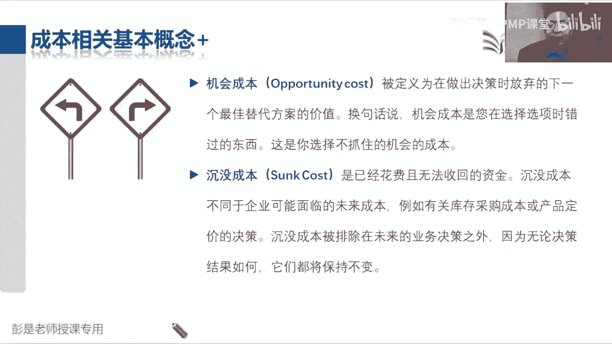
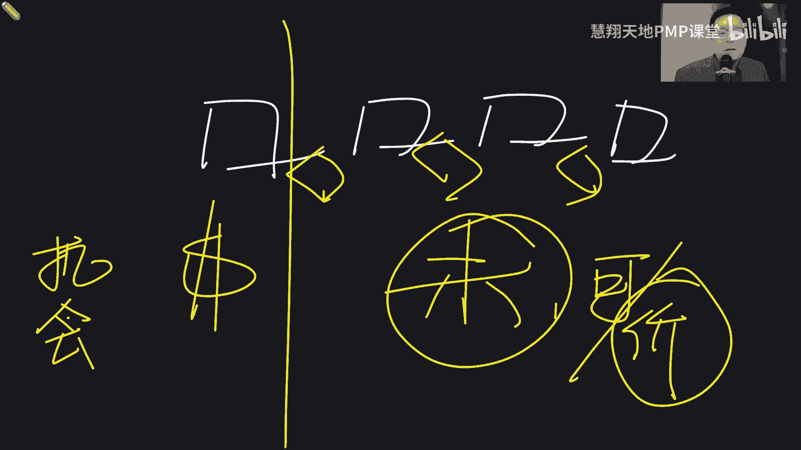
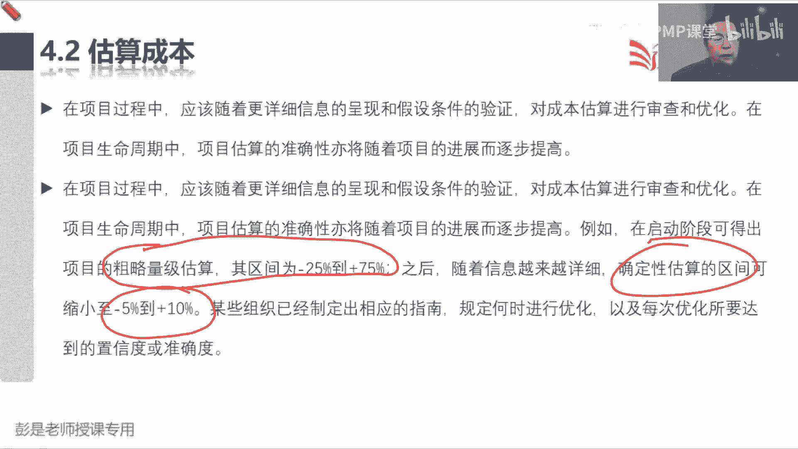
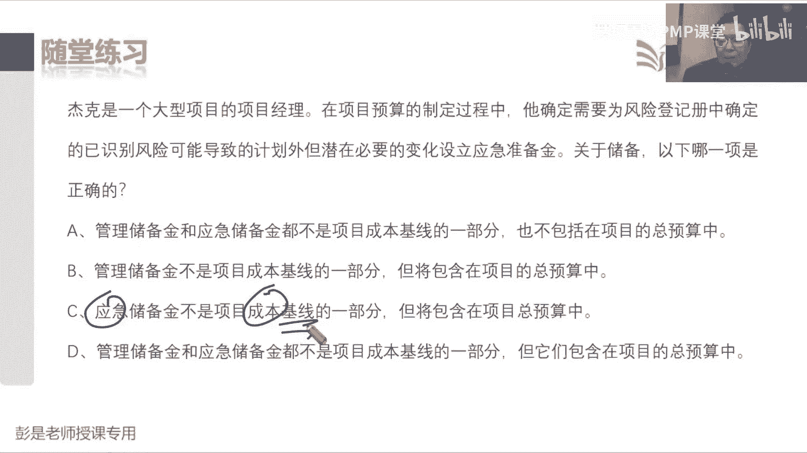
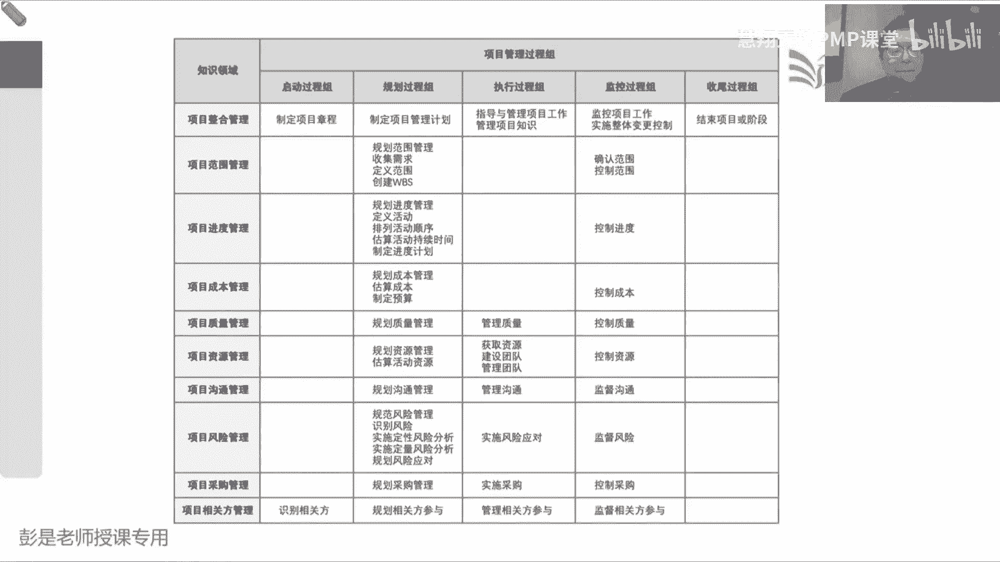

# 2024PMP认证考试课程（第六版+敏捷+第七版） - P11：4.1-4.4 项目成本管理、成本估算 - 慧翔天地PMP课堂 - BV1By411b7qM

这章看概述，基本上没啥东西了，这是一对概念，规划成本出成本管理计划可以推出来估算成本，出成本估算不用计，制定预算，出成本基准，这很好猜，成本基准就是这事儿多少钱，最后再出一个资金需求。

那这里边有一个小小的逻辑啊，小逻辑看PPT支付宝给大家先说100，我做完了这个项目啊，大概需要10万块钱，然后呢考虑到一些已知风险，我们要准备一些应急储备，假设应急储备2万块。

再考虑到可能还面临着一些未知的风险，我们要准备一些管理储备，管理储备1万，那第一个小问题，这个项目一共需要准备多少钱，13万，13万吧，这叫叫什么呢，这13万就是我的资金需求，对不对。

我需要准备出来这么多钱，其中10万块钱是干活的钱，然后呢2万块钱用来应对风险的，用来应对已知的哪些风险的，还有1万块钱不知道会不会发生啥意外，该用来应对未知风险准备的管理储备，第二个小问题啊。

一共需要13万块钱，你需要负责任的，承担责任的是多少钱，你需要承担责任的是多少，为什么是12，为什么这1万块钱我们不我们不担这个责任，就把这个道理想明白就可以了，这1万块钱是用来应对未知的风险。

既然是未知的，没有认知的事情，鬼才能承担这个责任呢，对不对，所以这1万块钱不应该影响我的绩效，我不对他负责，我能负责的是什么呢，已知的事情，第一已知的干活需要多少钱，我负我承担这个责任。

第二应用来应对已知风险需要多少钱，这个我背这个锅，所以最后最后逻辑就变成了啊，实打实算出来的成本，再加上已知风险准备的应急储备，画个圈圈，这叫基准，我对这两笔钱负责任，这是基准哎，然后我们再用基准加上。

用来应对未知风险所准备的管理储备，这两个玩意加到一起是我一共需要多少钱，就等于我的资金需求，就是项目预算，先停一停，后边文字马上会看到啊，这就是这个管理过程，大概它的输出变成了一个叫基准。

一个叫资金需求，这俩玩意儿资金需求就对标到项目预算，好控制成本，他的输入输出也没什么新的东西，绩效数据，绩效信息变更请求，接下来这一章四个管理过程，看看规划，成本管理，看看成本怎么管，估算成本。

算活动成本，制定预算就是汇总从活动啊到工作包啊，到控制账户啊，到整个项目，最后呢想办法出成本的基准，控制成本呢就是绩效变更，做成本的预测，这没有新的知识点啊，那再往下概述，嘶概述这段文字需要解释吗。

我们已经见过好几遍了，就小事情，可以把它合并，一个人一拍脑袋就完事了，中午吃饭需要多少钱，一拍脑袋几秒钟就搞定，这里到了二，接下来看PPT教材上没有的东西需要停一停，现在关于这个成本相关的这些基本概念。

基本上也不大会考，听一听，知道怎么回事就可以了啊，后面再做题，帮助大家call back，回顾一下那成本相关的概念，第一对叫固定成本和变动成本，可变成本它指的是什么呢，咱项目有明确的开始结束日期。

在这个时间区间之内，相对来说不太容易变的，就称之为固定成本，相对来说容易随着工作量变化而产生，变化的东西，就称之为可变成本，所以比如说我们这个项目工期一年，我要租一个办公室，它和我们的工作量相对来说。

变化可能没有这么多，没有这么密切的联系啊，就把它称之为相对来说叫固定成本，三个人五个人成本不一样，它会随着我们的工作量发生变化，唉这就称之为可变，停一停，了解就够了，记住啊，永远是相对的，而不是绝对的。

为什么呢，比如说给大家讲课，我们租这个会议室，这叫什么，这是固定成本还是可变成本，固定的吧，相对来说是固定的啊，那大家来听大家来听个，给大家发矿泉水，这叫什么呢，变动成本吧，因为来三个人。

来五个人发的水数量不一样，相对来说可变，那你说这个办公室的租金，有没有可能发生变化呢，有吧，来30个人，我们租个小房间，来300个人，我们需要一个大房间呐，他也会变，只不过是这个东西的变化。

频频度变化的可能性和矿泉水，相对来说没有这么高，嘿就这道理哈，所以记住所有的概念都叫相对的，相对的，不是说这玩意儿绝对不变，但换个角度，最后涉及到的需要大家掌握的知识点啊，如果你想降成本。

这俩玩意儿哪个比较容易上手呢，所以才需要估算资源的时候，我们要考虑资源的数量水平等级，因为资源资源的数量水平等级，会直接影响到最终的成本，对不对，相对来说可调的空间，可调的余地比较大，诶这是一对好朋友。

第二对好朋友叫直接成本和间接成本，这两玩意就需要记住了，并且一会看教材书上都有的啊，这敢不敢猜啊，直接成本是直接归因归因于特定项目的成本，间接成本是不能直接归因，归因于特定项目的成本，这叫什么意思呢。

啥意思呀，这间接成本能不能换成另外一个单词，就看看这四个字啊，多个项目受益，那变成一个好理解的单词是什么，分摊分摊吧，就这意思啊，哎这就是直接成本和间接成本，所以带场景说，现在我们公司有两个项目。

A项目组和B项目组，A项目组说我要买一辆车，需要10万块钱，问问B项目组，你用不用这么问的，目的是什么呢，分摊吧，唉如果B项目组话说我也用，那么这个钱这个钱咱两个人各各出一半啊，就AA制吧。

这样可以有效的帮助，A和B都来降低项目的成本，对从而避免A项目组买辆车，B项目组也买辆车，资源浪费，成本超支，还以此类推啊，就是分摊能分摊的尽量分摊出去，可以帮助我们降低项目的成本，哎。

就是多个项目之间做分摊好，A项目组说我需要一台电脑，问B项目组，我用不用，B项目组说我不用，那买电脑的钱，就作为A项目组的直接成本，就是这段这这这堆东西啊，所以还是在考虑啊。

我们怎么有效的来把项目的成本降低，书书上没有的内容先听就可以了，早晚会看到的行，早晚会看会看到的啊，如果不想看书，截个图，如果懒得截图，就先停一停，就先停一停，就先停一停就完事了，这课讲的太累了，好。

这是一对好朋友，直接成本和间接成本，我们要考虑直接成本，能不能和其他多个项目去进行分摊，从而有效的帮助项目降低成本，那它背后隐藏的考点其实是什么呢，一会儿看书上文字是有的，一会书上文字是有的。

重要的事情说八遍，现在先听明白意思啊，直接成本谁出钱，项目组出钱还是公司出钱，走项目，项目组的账还是走公司的账，走项目的账对直接记到项目的人，项目的项目头上啊，间接成本算在谁头上，谁出这个钱走谁的账。

说A项目也用车，B项目也用车，C项目也用车，是走项目账还是走公司账啊，公司先出钱吧，公司先把先出钱，出完钱之后怎么办呢，向各个项目组收管理费，向各个项目组收取管理成本，所以你企业里边的什么房租。

水电费这些行这些这些行政部门，他们的钱都分摊到各个项目之上，这些钱是公司出的，但是呢作为各个项目的管理费，作为项目的各个项目的间接成本，就做了这样的分摊，哎知道这个意思啊，好再往下一对好朋友。

一个叫机会成本，一个叫沉没成本，机会成本好理解，说，被定义为在做出决策时，放弃的下一个最佳替代方案的价值，换句话说，机会成本是您在做选择选项的时候错过的东西，还这是你选择不抓住机会的成本。

所以变成人话就是涨，A公司打算一年给你10万块钱，B公司给你开的offer，一年8万块钱，如果你选择去了A公司，机会成本是多少啊，它是我们做出决策时，放弃的下一个最佳替代方案的价值。

那我们做出这个决策时候的，机会成本就是8万好，那如果我选择去了B公司，机会成本就是10万吧，再复杂一丢丢啊，A公司年薪10万，B公司年薪12万，C公司年薪8万，如果我选择去了A公司，机会成本是多少。

12万，是您做决策时放弃的，下一个最佳替代方案的价值，最佳替代方案那就是B和C里面找一个最大的，所以如果选择去的A公司，机会成本就是12万，如果选择去了B公司，机会成本就是10万，如果选择去了C公司。

机会成本是12万，它其实就是文字游戏啊，它在提醒我们什么呢，做出任何选择都是有代价的，这个代价是大好还是小好，小好吧，代价越小越好，反向理解是什么呢，就是哪个工作挣钱越多越好，嘿，正向很好理解啊。

哪个工作给钱多，我就去哪，反向理解，那就是放弃的代价越小越好，好最后一个知识点叫沉没成本，这个也有意思啊，沉没成本是什么呢，说已经花费且无法收回的资金，他什么什么可能面临的成本，例如巴拉沉没成本。

应该排除在未来的业务决策之外，因为无论决策结果如何，沉没成本都将保持不变，啥意思呢，告诉我们做决策的时候啊，不要不要考虑沉没成本变成场景，就是比如说啊你花了100块钱买了张电影票，看了10分钟。

发现不好看，还要继续看吗，现在要做决策了，通常通常我们会怎么想，来了来都来了吧，还花了100多块钱买了张这么贵的电影票，对不对，来都来了，咬着牙一咬，把它看完，这是正常人的思路哈。

这个时候我们的思维方式就叫不理智，对钱都花了吧，这大过年的他还是个孩子，中国是四大官束啊，来都来了，那怎么做理智的决策呢，考虑下看看对方到我们项目管理的概念上来说。

给你换排版吧，正好还有12分钟啊，理智的人会怎么想这个东西呢，我们项目从开始到结束有很多个阶段的对吧，什么买电影票，然后看电影，吃爆米花，我已经花了100块钱买了张电影票，现在在看电影的过程中。

看电影的过程中发现这个玩意儿不好看呐，没意思呀，你要展望未来的时候做趋势分析吧，对不对，那剩下你还要在这煎熬100分钟呢，你有必要浪费这个时间在这儿吗，这不就是理智分析吧，没必要了。

这100块钱人家退你吗，不退，有些电影院好像可以退啊，先抛抛掉那个场景，这100块钱不退呀，你看或不看，继续看或者是不继续看，这100块钱覆水难收回不来的，所以不要考虑已经花了这么多钱这个因素。

你要去分析，剩下100分钟，看看这个无聊的电影还有没有价值，就这个意思好，这就是理智决策，再把这个事情放大，马上五一了，各位同学想这个场景说，五一出去玩，花三个小时，三四个小时走到景区门口了。

这一路上一路堵啊，要不要进去玩儿，正常人的思维还是那四个字吧，中国14大宽说啊，来都来了，花了这么长时间，老子到了门口高低要进去玩一会儿，那你到门口排嗯，嗯买票排队上厕所，排队吃饭，排队人乌嚷乌嚷的。

回家还要还要堵啊，这个时候决策就不理智了吧，理智的是什么呢，你要去分析展望未来呀，对不对，这个时间反正已经花出去了，回不去了，未来买票啊，吃饭啊，上厕所呀，回家返程啊，可能更堵啊。

那理性的人就会及时这块及时止损不干了，所以对标到项目管理里面，就是计算关口的最重要的作用，我们生命周期从开始到结束分成N个阶段，每个阶段之间我们要做理性的决策，理性的决策，不要想着我们已经花了钱。

我们要去展望未来，做趋势分析，分析项目继续做下去，还有没有可行性，对不对，咬着牙可以排队上厕所吃饭，返程拥堵，没关系，还有可行性，但是这么做有没有意义呢，还要分析项目是否还有可行性，是否还有价值。

如果你觉得这种各种拥堵我喜欢，那你继续继续搞，如果觉得不喜欢很头疼，那及时的断舍离，那这个东西，这个东西，再结合到刚才前面一个前一个知识点啊，机会成本越大越容易断舍离，还是越小越容易断舍离，越小吧。

一出门3分钟发现拥堵，算了，不去了，很容易断舍离，对不对，在路上已经堵了三个小时，好不容易看到景区门口了，花了这么多时间，就越容易纠结，越容易沉湎于过去那个沉没成本。

唉这就是这段文字带出来这么一个知识点，这段这段内容啊。

停一停，知道怎么回事就可以了，考试现在这种东西机会成本以前还会考，现在基本上考的概考到的概率也比较低啊，选择A放弃B好，这就是关于常见的一些成本，这一段常见的一些一些概念。

然后那个高频考点就是直接成本和间接成本，一会教材上会看到相关的文字，好各位同学上午听课辛苦了，那咱接下来休息，上午就先讲到这，下午上课时间是13：30，把谈恋爱当做一个项目啊，结合到刚才讲的东西啊。

想一想你们俩热恋10年，做选择的时候就容易沉湎于过去了吧，不容易断舍离啊，相亲认识个女的，认识个10分钟啊，断舍离很快的对吧，没感情啊，就这个意思，沉默成对吧，机会成本越小越容易放弃。

越容越容易理性决策好，那各位同学上午听课辛苦了，下午见，下午上课时间01：30，不要迟到，成本成本成本对吧，一个叫固定成本，一个叫相对来说可能会发生变化的成本，还有一个叫直接成本，还有一个叫间接成本。

能分摊的，尽量分摊出去，可以有效的帮助项目省省点钱，然后呢再往下就是机会成本和沉没成本，机会成本是告诉我们，选择任何一个选项都是有代价的，沉没成本就是过去的东西就让它过去了，不要影响我们的决策呀。

好那上午讲完了成本，大概这几个概念了解就够了啊，那再往下看教材里面的成本，这一章的核心内容开始了，第一段超重要的一个原则说项目成本管理，重点关注完成项目活动所需资源的成本。

但同时我们也要考虑项目决策对产品，服务成果的使用成本，维护成本和支持成本的影响，例如说限制设计审查的次数，可以降低项目成本，但由此可能带来产品运营成本的增加，超好理解吧，就背着抱着一边沉。

其实这个对标到一个术语叫生命周期成本，全生命周期成本，就是你考虑下，你在一个产品买的时候可能很便宜，但是买完了之后可能三天一大修，两天一小修，今天换个零件，明天换个什么东西。

嘿他可能表面上看这个东西买的时候很便宜，但是它的使用成本，维护成本支持成本可能相对来说比较高啊，那咱就需要有大局观，通盘考虑，考虑周全，考虑周全，把这个东西全生命周期给他考虑周全。

这个产品我买回来从生到死诶，不要仅看着眼前说，买的时候这个价格很优惠，很很吸引人，但是后面可能有很多问题啊，嗯好就这个意思啊，所以这就是项目成本，它不包括运营成本，但是我们要考虑项目对运营所产生的影响。

这是大局观的事情，运营不包括在项目范围，项目边界之内，但是呢我们要考虑啊，如果把项目成本压的很低，有没有可能给人家运营带来无穷无尽的烦恼呢，比如大家天天骑着这个小黄车，小蓝车。

我们要研发一款新的共享单车，为了降低项目的成本，我把这个GPS定位这个模块给他干了，唉不做这个东西了，项目成本词儿就下去了，但是人家运营的时候可能头疼了吧，找不到车呀，这个车的什么维护啊，保养啊。

全都是一堆事啊，就这个逻辑啊，好这段知道这个非常非常重要的理念就可以了，然后再往下后面就没什么新的知识点了，然后这堆财务管理技术那几个单词，还记得是什么吗，投资回收期意味着啥，多长时间收费成本。

但是赚钱不赚钱不知道，所以投资回收期越短越好，意味着风险小，剩下里面一大堆财务指标，有一个和别人不一样的，叫啥，BCR效益成本比他是拿拿你的收入除以支出，还收入三块钱，成本两块钱大于一，说明有钱赚。

并且呢越大越好，除了这个BCR剩下的投资回报率啊，什么什么现金流贴现啊，净现值啊，其他的财务指标都是大于零，说明有钱赚，越大越好，这这几个财务指标还是需要大家掌握的，回去参考效益外呃。

商业论证这堂课程啊，嗯那接下来就可以听的非常非常非常快了，各位同学不要低头看教材了，就看PPT就可以了，因为全都见过的东西啊，规划成本，根据章程项目计划的总体指导，想一想成本到底怎么管。

提出那个什么计量单位呀，零准确度啊，临界值啊，这些东西，这个管理过程和规划进度管理一模一样，后面复习的时候大概的快速的过一遍就可以，他唯一多了一句新的东西，就是这个精确度这个术语，并且很好理解吧。

祝大家日常工作生活四舍五入对，四舍五入是精确到小数点后一位，后两位还是个位，数百位数千位数十位数，以此类推，我们对项目的时间和成本，都应该提出这种精度上的要求啊，项目工期我们是精确到天。

有没有必要精确到小时呢，有没有必要精确到秒钟呢，有没有必要精确到毫秒呢，这取决于什么呀，还是那三个字啊，看情况取决于项目的具体情况，你要什么导弹发射对吧，什么打仗这种东西呀，什么计算机。

这要精确到毫秒啊，炒股这要精确到秒啊，以此类推，根据项目的情况，我们需要选取合适匹配的精确度的要求，然后呢准确度就是刚才我们见过的单词好，这一段没有新的东西啊，然后再往下什么估算活动成本。

这个管理工程拿眼睛扫一扫，有没有一个新的东西，没见过的东西，找到他，输入稍稍有一丢丢印象就可以了，资源需求三个人，五个人成本不一样，进度计划三天五天成本不一样，这两个稍稍有一点点印象啊。

这个管理过程的输出没有什么新鲜玩意儿，成本估算和估算依据中间的工具专家类比参数，自下而上，三点备选方案，储备分析系统决策，投票都见过了，就多了个新的单词叫质量成本，质量成本能不能call back。

前面刚才见过的一句什么话，说这玩意儿买的时候很便宜，但是用的时候三天两头出故障，出问题哎，他就是要我们要考虑周全，考虑周全和那个全生命周期是道理一样的，就在强调这个东西好。

这个单词到了质量这一章会重点说，它通常在成本这段知道那个意思就够了，所以这个管理过程可以认为它没有新的知识点，然后后边的文字啊基本上就是以看为主，说成本估算是根据资源的可能成本进行量化。

就是这个资源干几天活，所以他需要输入资源需求和我们的进度计划，那在估算成本的时候，我们需要识别和分析，可用于启动和完成项目的备选成本方案，需要权衡备选成本方案并考虑风险，比如说比较自制和外购成本。

购买和租赁成本，多种资源共享方案来优化项目成本，就是啊到底是自己做便宜还是叫外卖便宜，对买共享单车到底是买辆自行车便宜，还是租自行车更省更省更省钱，以此类推，这里边以前还会考到一些简单的计算题。

现在基本上也不会出了，因为太好算了，买一辆自行车需要100块钱，你打算骑一个月，每天骑共享单车成本是一块钱，那是买呢还是租呢，租因为更便宜，以此类推，就这么简单的计算，但实际工作中除了备选方案。

还要考虑什么东西呢，要考虑到更缜密更周全，真正真正算这个共享单车呀，买一辆自行车可能需要100块钱，一年，骑共享单车可能大于100，那你是买还是租啊，租大多数人都是ZA不会自己买共享的。

自己不会自己买自行车，为什么呢，丢了咋办对呀，丢了咋办呢，多标准决策分析法，我们还要考虑很多很多其他因素，对自己买的车还不能随便扔，还要怕怕丢，还要买锁，还要保养，还要还要维护，那骑共享单车就省事了。

骑到哪儿是哪儿啊，想扔就扔啊，对不对，考虑到其他因素，相对来说骑共享单车可能更划算，这就是多标准决策分析，考虑到很多其他重要的因素，好这个大听听懂这个意思，然后再往下，通常用某种货币单位进行成本估算。

美元日元，欧元，但也有可能用其他计量单位，比如人时数或者是人天数来消除通胀的影响，便于成本比较，什么叫通胀啊，这需要解释吗，啥是通货膨胀啊，嗯什么是通货膨胀啊，就是这个钱呐是在增值还是得贬值啊。

贬值贬值吧，唉钱越来越不值钱了，物价越来越高啊，这就是通货膨胀啊，通缩就是反过来，这听懂听懂意思就够了，前面我们学过一个东西，净现值还记得吗，净现值就是考虑了时间这个因素，为什么呢，随着时间的推移。

由于存在着通货膨胀这种类似的场景，类似的现象，就会导致钱社会不再会在不断的贬值，那如果项目周期比较长，如果项目周期比较长，10年以后的100万，等不等于今年的100万呢不等，那它大概等于今年的多少钱呢。

就需要有一种算法，这个算法以前还会考，现在基本上也不考了，基本上也不考了，假设听一听就完事了，假设通胀率是5%或者是7%，那么今天的100块钱和一年以后的多少钱等价，105吧。

一年以后的105块钱才等于今年的100，那反过来一年以后的100，约等于今天的多少钱呢，1÷1加上5%，我就随便说了，大概约等于0。9几吧，哎得出这个结论之后，一个10年期的项目老板跟你说。

10年以后给你100万，他换算到今天约等于多少钱，10年以后的100万，到了第9年，约等于第9年的90万，第8年的九八呃，998 11，对不对，第7年987 12，第6年695 17，九六十三。

796 13，第5年695 14，第4年以此类推，就折算到今天，基本上约等于没多少钱了吧，就是周期长，我们就要考虑时间和通胀这种因素，表面上看10年以后给100万诶，收入挺高的。

那我如果考虑时间这个因素，我们需要把未来所有时间的收入和支出，全都给它，折算到今天，全都折算到今天，再拿这两个玩意相减，如果减减减的结果就叫净现值检测，结果还大于零，才说明真的赚钱了，否则可能是赔钱的。

这就叫动态的投资回报率，动态的投资收益率，这种算法超复杂，现在PMP考试不考这么深的东西，好知道这个意思吧，所以这就是工作里面可能需要用得到，考虑到周期，考虑到周期，考虑到通胀变成大白话。

就是今年100万块钱存银行以后，一年以后还能变成102万左右呢，对不对，所以他俩不等价好，那再往下说，这段文字说在项目过程中，应该随着更详细信息的呈现和假设条件的验证，对成本估算进行审查和优化。

然后在整个项目生命周期中，估算的准确性将随着项目的进展而逐步提高，这里面带出来两个术语，一个叫粗略量级估算，它区间是25%到正的75%，第二个术语叫确定性估算，它的范围是负的5%到正的10%。

这两个术语还是需要记住的，为了方便大家把之前的这堆罗里吧嗦的东西。

给它记住，所以看PPT2再粗暴来一版，咱前面说过，在项目早期，我们就可以大概的估算一下需要多少钱，需要多少时间，这个大概的估啊，通常就用什么呢，类比因为没有足够的细节性的信息，就拍脑袋。

找一个差不多的项目参考一下就可以了，所以通常用类比估算，那类比估算的特点是什么呢，快因为找一个差不多的项目，一拍脑袋就出来了，缺点是什么呢，准确度有所欠缺，还那这种情况下它不准到什么程度呢。

就称之为粗略量级估算，允许偏差的范围，负的25%到正的75%，你用100万的项目来算的话，它允许浮动的区间就是75到175万，可以有较大的出入，为啥呢，因为信息少，因为信息粗略。

那随着我们规划工作的开展，随着项目渐进明细的特点，咱收集需求，定义范围，创建WBS得到了范围的基准，根据范围的基准，我们再来定义活动，得到活动的清单，根据活动清单，我们再去估算所需要的资源，时间和成本。

这种情况下诶给出的估算结果是不是应该准了，所以通常在这种情况下，我们考虑用更精准的参数估算，我们用公式，用模型，用统计方法来得到关于工期，关于成本的估算结果，所以参数估算的特点就是和类比估算刚好相反。

类比快参数就慢，因为用公式用模型需要计算，需要统计方法就需要时间，它会慢，但是它的准确度会有所提升，所以到了规划阶段，后期我们可以给出多准的一个估算，结果呢就叫确定性的估算。

它应该允许浮动的区间是负的5%，到正的10%，这个范围里仍然是100万的项目，他应该是95万到110万哎，这个区间里浮动才比较准，就这个道理，所以就像这个这个底层的逻辑啊，它适用于任何一个场景。

五一我打算出去玩儿，一拍脑袋，七天花个1万块钱左右，这个估算结果可能比较比较不准，然后等你制定完了，制定完了真真正的进度计划之后，再去估算住酒店多少钱，交通多少钱，以此类推，住几天噼里啪啦一顿统计分析。

经过计算得到了估算结果就应该准准多了，就这个道理哈，好搞定。

所以这就是刚才教材上，这两个单词还是要记住的，本来看到是看到题目的描述，看到这两个术语能反应过来他是什么意思，最后就没啥说的，就是做估算刚才说的那个那个道理啊，我们要把所有的钱都要考虑进去。

甚至包括什么通胀啊，融资啊，总之沾钱的地方全都考虑进去，啊这个管理过程输入没有新的知识点输出，基本上和那个持续时间估算结果差不多，成本估算包括对完成项目工作可能需要的成本。

以及应对已识别风险所准备的应急储备和应对，计划外工作，计划外工作对我们来说就是个未知项，以及应对未知风险所准备的管理储备啊，就这么三笔钱，这三笔钱后面大家做那个练习题的时候，就会纠结呀，就会纠结。

所以大家想一想一个道理啊，说第一笔钱是实打实算出来的成本，第二笔钱是已知风险所准备的应急储备，第三笔钱是未知风险所准备的管理储备，那么相对来说哪一个哪笔钱可能性最小，相对来说哪笔钱可能性最低呢。

管理储备吧，哎后面做章节练习题，你就会看到这样一道题，让你选一个选项，仅此而已，在众多选项之中，找一个可能性最大或者是可能性最小的选项，仅此而已啊，好然后再往下估算依据没有什么需要解释的了，那4。

3制定预算，这个管理过程关键字还记得是啥吗，标出来下班汇总，所以他的工具啊就叫汇总，这都根本就不用去记的东西，它的输入也不太需要去记，它的输出呢，输出啊，成本基准和项目资金需求。

还记得刚才说的那个逻辑吗，实打实算出来的成本10万块钱，应急储备2万，管理储备3万，那么成本基准是多少呢，12资金需求是多少呢，15哎，就把这个逻辑随便想几个数字啊，给他想明白OK了。

一共需要准备15万块钱，其中的3万块钱和我的绩效没关系，所以呢不包括在基准之中，称之为管理储备，因为是用来应对计划外的这种意外的，那成本和应急储备对我来说是已知的东西，所以这两笔钱算为基准输出。

搞定输入没啥记的工具，成本汇总过去储备分析见过了，那历史信息审核，这也小概率会考到猜，现在我们在做本项目的预算，为什么要审核历史信息，嗯好接，现在在做本项目的预算，为什么要审核历史信息，抄哎掌握到了啊。

这是以史为鉴，看看咱项目做出的预算和差不多的项目，类似的项目的预算有没有较大的出入，有没有较大的出入，然后去分析为什么会出现这样的出入，是什么原因，以此类推，所以主要工作主要目的就是以史为鉴。

参考历史类似项目，同类项目的哎，人家的预算大概是多少，看看有没有偏差，知道这意思啊，好那再往下这个能不能猜到呢，资金限制平衡又是干啥的，巫山云雨说缺钱，资金限制平衡，他完整的话术就是由于受到资金的限制。

所以可能要考虑平衡资金的支出，由于受到资金的限制，要考虑平衡资金的支出，变成最终的大白话，就是穷就是没钱，所以大家想一想自己生活中或者是工作中，有没有出现过这样的场景啊，就是打算买个东西。

发现最近没什么钱，就过一段时间再说，过一段时间再说，你改变了什么，进度唉，所以输出有可能会更新项目进度计划，这两个这么一句话就搞定了啊，就是因为穷，因为没钱，有的有的有的付款呐，有的采购啊。

可能往后推一推，或者是往前提一提，对报到工作里边，通常一经常见的场景就是财务跟你说，我们这审计，我们这封账了，所有的钱下个月再说，就这意思吧，哎没钱对不对，或者是因为各种各样的原因。

最常见的原因就是什么审计啊，封证啊，所以就要由于受到资金的限制，我们需要平衡资金的支出，这知道这个意思，看名看名字能猜出来就够了啊，融资需要解释吗，不用了吧，融资有成本吗，没有无缘无故的爱呀。

凭什么把钱给你啊，对不对不对，好歹有点利息吧，哎到底是利滚利呀，还是以此类推啊，他也可能会产生一一定的成本啊，就是找钱，这基本上也不大会考不会考的啊，好所以这一章其实工具没有什么新鲜玩意儿。

制定预算虽然有一些比较葛的单词，比如说四和五，但基本上考的的概率也很低，考试的时候看到这个名字能反应过来他是啥，历史信息整合，印象中基本上不考好这个管理过程搞定，那接下来最重要的这个逻辑。

就是下面概述这段文字，项目预算，包括用于批准执行项目的全部资金，而成本基准是经过批准且按时间段分配的，项目预算，它包括应急储备，不包括管理储备，这就是成本基准的，包括应急储备，不包括管理储备。

但是项目预算和总体的资金需求，是包括所有钱的，那输入没有新的东西了，然后呢输出输出教材上给出的示意图，不管是第六版还是第七版，如果看这张图去理解的话，容易理解错，所以个人建议啊，就不要看图，看文字为准。

不要看图啊，成本基准是经过批准的，按时间段分配的项目预算，不包括任何的管理储备，并且呢计划制定完成，经过批准，一旦变成了基准，就只能走变更，不能随便改，就还是刚才说的那个知识点，然后再往下。

再往下呀说汇总汇总汇总，这就不练了，说汇总成本，应急储备，然后什么什么巴啦啦，这就不念了啊，逐级汇总，从活动你就想到这个逻辑关系，活动他爹叫工作包，工作包的上级叫控制账户，最后呢汇总到整个项目层面。

在任何一个层级，理论上来说都可以有三笔钱，就是实打实的成本，已知风险准备的应急储备，和未知风险所准备的管理储备，最终汇总到项目层面上，画个圈圈，这两个玩意儿叫基准大圈，就叫项目预算。

然后这张S曲线图等待后面讲工具，讲成正值分析的时候再看看，知道怎么怎么回事就够了，现在可以不看了，那再往下输出项目，资金需求，说，我们根据成本基准确定，一共需要多少钱和阶段性的资金需求，它包括88。

这也没啥可念的了，就像大家上学的时候，上学的时候找找父母要生活费，一个月，第1月，第2月，第3月，第4月分别要多少钱，就这东西哈，更新也没新的知识点，那4。4控制成本输入没东西输出，没有新的知识点。

就多了一个成本预测工具，技术，政治分析，偏差，分析趋势，分析储备，分析完工尚需绩效指数这几个术语，这几个工具需要我们掌握，咱后面工具统一讲，后边再说了，后边会统一讲到啊，那再往下说更新什么。

这部电脑只监督资金的支出，不考虑这些支出所完成工作的价值，对项目没有意义，最多只能跟踪资金流，这句话呢再结合到政治管理，结合到政治管理的一个小场景，帮助大家一讲完就搞定了，看看啊，指监督资金的支出。

这周啊下周周一周二周三周四周五，我给自己做了个每天中午饭的预算，周一，十块钱，周20块钱，周30块钱，周，以此类推，我每天的预算就是十块钱，这就是我的成本基准结果呀。

周一我买汉堡的时候发现买一送15块钱，传奇尼合买一送15块钱，于是我就花了15块钱买了两个汉堡，那么第一个小问题，我超支了吗，周一按计划应该支出十块钱，现在呢实际支出了15块钱，超支了。

可以给出这个结论吗，可以给出这个结论吗，不可以，为什么呢，这叫只监督资金的支出，没有考虑支出所完成工作的价值，我今天花了15块钱买了两个汉堡，相当于我今天花了15块钱，完成了两天的活儿啊，对不对。

所以相当于我花了15块钱，完成了20块钱的工作，是省钱了，唉成本是节约了，反而是成本节约了吧，就这个意思啊，不要考虑其他因素啦，今天吃完，明天坏了，买完的汉堡被张三偷吃了，以此类推啊。

不要不要不要把场景复杂化，简单粗暴，举个例子来解释这个东西啊，如果你们考虑的很复杂，那咱们把场景变一下，12345疫情期间，我打算买口罩，口罩一块钱一个，结果呢今天优惠促销，我花了一块五买回来两个口罩。

这样明天我的口罩就有了，所以只监督资金的支出，按计划来说，今天应该支出一块钱，实际上今天支出了一块五，比原计划支出的钱多，这没有意义，还要考虑完成了多少活儿，还要考虑完成了多少活，现在我反而总体上来说。

两天应该花两块钱买两个口罩，现在我花了一块五就买了两个口罩，总体的成本反而是节约的，所以我们一定要关注完成了多少事儿，这才叫管钱又管事，那完成的多少事，实际上就是正直，看看上午说应该干这么多活。

结果只完成了50%，你按照多少钱付款呢，如果总体的价价值是100块钱的话，干多少活挣多少钱，这就叫正值干多少活挣多少钱，那得把这个场景再变一下，变成我们的横道图，每天买一个口罩，每天买一个口罩。

截止到今天，那应该只买一个口罩，这是但是呢商店给促销有有优惠，所以今天我买了两个口罩，那么我们可以得出进度的结论，是比原计划完成的工作多，并且呢我只花了区区一块五就买回来两个口罩，成本上还是节约的。

这段话能听明白这个道理，政治分析学完了，政治分析关注的就是找到完成了多少工作，然后分别去判断进度的情况和成本的情况，现在现在的工作进度，应该是原计划的200%，等我把它擦掉哈，这是我的进度条，第一天。

第二天，第三天，第四天，第五天有五个小方格，然后呢虚红色的虚线，红色的竖线是今天这个时间点，截止到今天应该买两个口罩，结果呢商店促销我实际上买了四个口罩，所以现在的工作的速度是原计划的两倍。

完成了200%，超额完成任务，比原计划完成的工作多，这就是政治分析分析的进度的情况，政治分析分析成本的情况，就是刚才那个场景什么两个口罩两块钱，结果我两个口罩只花了一块五哎，比原计划完成花的钱要少。

成本节约好，先听一听后面政治分析再给大家详细展开说啊，这就是这段文字想描述这个道理，所以最后的结论在成本控制之中，我们应该重点分析项目资金支出，支出了一块五毛钱和相应完成工作之间的关系。

一块五买了几个口罩呢，买了两个，所以每个口罩的单价是七毛五，成本节约了，变成术语就哆嗦，变成口罩，变成汉堡就简单，这为什么商店促销什么第二杯半价，不就是让你省钱吗，但前提是你需要哈在计划内的好。

所以后面这段说控制成本的关键在于管理罢了，这段文字也不念了，这段文字和进度管理那段文字差不多的对吧，什么对变更的影响加以施加影响，已发生的变更进行处理，看现在的情况，然后做什么什么预测，以此类推。

没有什么新的知识点，那这个管理过程输入没有新的啊，输出什么，这都现在看不懂，很正常哈，就这堆单词啊，现在不认识他很正常，后面讲正则分析再说了嘶，并且现在考试这么多，最近最近最近最近几次啊，三四次吧。

关于这种正值分析的复杂的计算题，基本上也不太会出，关于政治分析复杂的计算，就是计算什么EAC呀，VAC呀，什么TCPI呀，基本上也不大会出，也就考到进度偏差，成本偏差这个这个角度比较简单。

再弱化关于计算题的考点，因为一共180道题，180道题，以前的计算题多的时候啊，可能有十几道题，后来呢最近56年就会发现呐，这个数量在逐年逐年逐年下降，并且最近3年基本上180道题。

里面有一道计算题就算多的了，甚至有的试卷都没有，所以数学不好的同学不要焦虑，不要担心，计算题，基本上考得的概率会越来越低，尤其是复杂的计算，好所以后面看书的时候这段文字没讲到的。

等后面看到正值分析这个工具，再再再学会了就可以了啊，那纯看输入输出这一章，下班了，规划成本管理基本上没写什么新鲜玩意儿，什么准确度，精确度，计量单位控制零电池，把成本管理的这个游戏规则写清楚。

要精确到分，精确到原，以此类推，要然后呢，接下来我们估算活动成本，估算成活动成本，其实也没有新的知识点，类比估算参数估算，自下而上估算三点估算，考虑项目的实际情况，采用合适的估算方法得出估算结果。

只不过友情提示了一下，我们算成本的时候啊，要考虑周全的考虑周全，不能为了降低项目的成本，不管不顾，我们要考虑质量成本，考虑全生命周期成本，再考虑什么固定成本，可变成本这种东西吧，直接成本，间接成本。

总之啊能分摊的还是要分摊出去，然后呢也别瞎降低项目的成本，还要有大局观，有格局，这是估算成本说的东西，接下来就是制定预算，这个管理过程呢就是逐级汇总，就想到这个层级关系，活动工作包控制账户。

整个项目逐层网上汇总汇总出来三笔钱，实打实的成本和已知风险的应急储备，和未知风险的管理储备，然后画圈圈这俩事儿我知道，所以叫基准，然后管理储备需要准备好，所以呢算作资金需求和总体预算唉。

这个管理过程基本上就下班了，最后呢再按照时间段把它分配，对不对，什么时间花多少钱，什么时间需要多少钱，这个得到了成本基准和项目的资金需求，他的工具也没有什么葛的对吧，就有什么历史信息审核，以史为鉴。

资金限制平衡可能调整进度计划，没钱的话就融资，这基本上都不大会考，最后呢就是控制成本，数据信息变更请求，做一个成本的预测搞定，所以相对来说没有特别多新的，并且呢通过刚才那个口罩的粗暴案例理。

理论上来说就学完了，就是看看是什么时间，花了多少钱，最主要的是干了多少，我们要考虑已完成工作的价值，这才叫管钱又管事，什么时间花了多少钱，干了多少活，所以学到学完成本这一章。

我们再call back回去啊，说我们至少要在范围，进度和成本三个知识领域有基准，并且呢这三个基准还需要打包到一起，这样我们才能够综合的去分析和评价，什么时间花了多少钱，干了多少事，这才有意义。

打包到一起的基准叫什么呢，就叫记效测量基准，评价项目绩效的基准就是把范围进度，成本这三个基准打包到一起，然后利利用政治分析技术，通利用政治分析技术分析，我们什么时间花了多少钱，干了多少活，好。

这就是call back，回去那个东西了，这一章学到这个程度差不多了，说同学问呐，考什么题最多呀，都是场景题呀，给你一个项目的情况，问你怎么办，都是基本上现在场景题为主，也没有概念题。

问你制定项目章程有什么收入，制定项目章程有什么工具，这种题凤毛麟角，基本上不大会考计算题数量不会很多，并且基本上也不大会考好，那看看这一章的练习题啊，你在创建成本绩效基准，目前处在哪一个管理过程。

简单吧，C选项好像少了个字，所以答案就是A，制定预算这个管理过程不是控制成本初基准，也不是估算成本出基准，没有制定成本基准，这个管理过程这个呢就这玩意儿吧，规划成本管理，输出成本管理计划。

我们要约定精确度啊，准确度啊，计量单位啊，临界值啊，说估算成本四舍五入到接近的100美元，然后什么允许偏差的临界值10%，这玩意都写到成本管理计划里面去，把这个钱的计量单位换成时间。

就写到进度的管理计划里面，以此类推，这种东西啊，你随便带个场景，再大概想一想，巩固一下这个管理过程就不要再多看了啊，精确度准确度，我老婆对我感情管钱管的很严，你花的每花的钱呐要精确到分。

然后呢允许偏差的范围是零，多一分，少一分斩立决，这就是精确度和准确度的要求，未来根据我实际的汇报情况，看看要不要弄死我，就这个道理好，通常大多数公司里面的项目可能精确到圆，就差不多了吧对吧，几毛几分呐。

可能差不多意思啊，就算了就算了啊，但取决于具体的要求，包括那个时间单位也如此，通常大家精确到填就可以了，好这道题，会计要小数点后三位吧，对不对，好这道题选啥，有两个机会，有两个机会，项目A400000。

项目B380000，最终你的委员会选择启动项目B，那么我们放弃了项目A做出这个选择，做出这个角色时候的机会成本就是A的价值吧，哎所以就是40万，好这玩意叫啥呢，说要你提供一个成本估算要求。

只要使用产品就要包括这些这些，这叫什么呢，这是刚才说的那个术语吧，生命周期成本我们要把它考虑周全，买的时候可能很便宜，可能导致你的三天两头出问题啊，三天两头出故障啊，维护啊，安装啊，保养啊。

这种成本非常非常高，然后呢根据我们的人类的心理学呀，买的时候很便宜，然后三天两头一大修，玩了命的花钱去修修补补修修补补修修补补，最后要不要换个新的呢，六个不一定，很多人都是这样的啊。

我已经花了这么多钱去修它了，已经花了这么多钱去修它了，好让他好不容易能够正常工作了，要换新的还真舍不得呢，但继续往下沉迷进去啊，继续修，继续修恶性循环，唉所以还是那个原则吧。

这个这个成本沉没成本越低越容易断舍离对吧，你买件衣服几块钱，几十块钱坏了哎，扔就扔了，那是太贵的东西，贵重的东西啊，什么阿三买航母就这道理吧，花了十几个亿买的东西也得咬着牙修吧，修吧，没办法，不容易。

做决策的好，这就是我们考虑要有大局观，实在不行，给我们的发起人，给公司的领导，给高层提出我们合理化的建议和见解，但是要记住啊，建议和见解不是拍脑袋呀，而是要有依据，对不对，在项目内成本大概是多少。

未来运营的时候，你要考虑啊，运营10年八年还是20年呢，他匹配到效益计划，因为效益计划说清楚这个东西的长期效益，短期效益啊，对3年五年，10年八年，那你要把这种维护啊，安装啊，保养的费用全都算进去。

然后给领导一个总体的总体的总体的认知，就这意思啊，好然后这个单词什么意思啊，这以前也会考到现在呢，最近56年不考不考了，以前还会考，还会给大家讲一讲折旧的算法，现在也不就不考，咱就不讲了。

但是要知道这个单词代表着什么意思啊，折旧是啥意思啊，通常用于什么大型设备啊，设施啊，固定资产吧，就这东西是在便知道，咱不考虑这种投资的这种这种这种场景哈，这是我们公司公司买个房子作为我们的工厂。

这个工厂随着时间的推移，是越来越不值钱了吧，它会有损耗，今天这坏了，明天那坏了，哎，这是贬值，那损失掉的钱就称之为折旧额，损失掉的钱就相当于折旧额，这单词现在基本上不考啊。

那折旧折旧对企业来说是算到收入还是支出，支出支出，它是成本对不对，所以它是支出，好以前还会考什么平均法啊，什么联合法，双倍余额递减法，不同的折旧方法有不同的计算，不同的算法，有的算法是有的算法呀。

是早期早期折旧额比较多，比较大，因为折旧额越大，相当于我的成本越高，成本高就相当于什么下去了啊，利润下去了，利润低的话，什么东西都下去了呢，税唉所以小小钱没必要啊，什么1111千块钱，1万块钱。

这没必要，像一些几10万，几百万，几千万几个亿的东西，还还可以考虑在算法上搞一搞手脚，这样可以让企业账面的利润小，利润低，利润低，交税就少，所以大家后面你涉及到一些规模比较大的项目。

你需要至少这些单词能跟财务聊到一起，能够知道人家在说啥，现在考试这种细节性的东西不考折旧额的计算，然后折旧的公式代表着什么意思，三种算法常见的现在基本上不考啊，折旧需要摊到生命周期的每个月份。

或者是年份吧，对每年每个月他都既然是成本，都要都要分摊的，每个月折旧多少，每年折旧多少，第一年，第2年，第3年，他俩打算用10年，10年以后，这个设备就节约等于零报废了，那每年损失的钱都要有很多的算法。

可以进行不同的分摊，好这道题，有成员通知你，他发现一个设计缺陷，可能要求团队返工处理，这种情况的最佳做法是什么，D肯定不行吧，C肯定不行吧，那A和B挑一个，让他去问别人，还是说我们要确定这个玩意儿。

对我们项目会产生什么影响，评估吧就B了，NPV是净现值，这咋选呢，项目A净现值7万5，内部收益率1。5%，启动资金1万5，项目BNPV6000，BCR2比一，项目CNPV80000，包括机会成本3万5。

那么选哪个项目呢，第一次做这道题的同学，基本上通常就建议选对了，那实际上这道题的答案是啥，C吧，为什么呢，选C代表着我们知道第一净现值大于零，说明有钱赚，第二净现值越大越好，说明赚的多呀。

所以三个项目有很多没有可比性的指标，比如说内部收益率，启动资金，BCR机会成本，这其他项目没有这些指标啊，它没有可比性，那我们就找具指有可比性的指标，三个项目都有净现值。

那咱就选C代表着我们知道这个知识点，知识点是啥，NPV大于零说明有钱赚，并且呢越大说明赚的越多，其他指标没有可比性，咱就不参考了，并且考试过程中也不会考这种，多指标的复杂决策。

多指标不就多标准确的分析吗，不会考的，只是考简单决策呀，好粗略，量级范围是多少，这考试基本上也不大会考哈，BCR是什么呢，效益成本比粗暴理解答，收入除以成本除以支出啊，我两块钱买了个口罩，卖给张三。

卖了三块钱，大于一了，说明赚钱了，好粗略，量级估算是负的25%到正的7%，15，负的5%到正的10%，这个叫确定性的估算，这道题，这道题选啥呢，为啥选A呢，B也有道理啊，C也有道理啊。

好这道题呢正正确答案就是A呀，纯粹是跟跟各位同学玩个文字游戏啊，他说一个人提出一个变更会影响到项目的预算，以下哪一项定义了，未实现这个变更所需要遵循的过程，我们看一看哪个选项是49个管理过程。

并且这个管理过程还和成本的变更，管理有关系的，所以答案就是A吧，管绩效管变更控制成本监控过程组，这是过程组，不是管理过程，变更控制委员会，是我们在对基准变更做决策的这么一群人，对不对，它不是过程。

不是过程化，并且呢只是变更中做决策的一个干系人群体，他只是一个环节，设通常涉及到基准的变更，需要CCB来做决策，这种题目太猛了，考试也不会出啊，好看看杰克遇到了什么问题，基准这个词有的时候会。

有的时候会被翻译成机械一个意思啊，背都是BASSLINE好，所以这道题答案就考的那个知识点吧，应急储备包括在成本基准之中，所以A选项这么说不对，B选项说管理储备不是基准的一部分，这是对的。

但是呢包含在项目总体预算之中，这是对的，所以答案就是B，C说应急储备金不是基准的一部分，这话不能这么说，D他俩都不是，这也不能这么说，就考的那个逻辑，成本加上应急储备等于基准基准。

再加上管理储备等于预算好。

这就是成本。

这一章看PPT，看PPTR，等我变黑板。

49个管理过程还记不住的同学呀，需要尽快的记下来呀，不然听课的时候就跟不上，就蒙了，说项目系统之前三件事，需求评估，效益管理计划的制定，还还要写商业论证，告诉老板，我们投入人财物做的这个项目啊。

有可行性有价值，如果既有可行性又有价值，公公司才愿意任命项目经理，把资源资金的使用权交给项目经理，让你带着兄弟们完成任务，实现目标，得到期望的成果，那启动项目第一个管理过程叫制定项目章程。

因为他要说清楚我们要做什么事，目的目标成功标准，推出标准总体要求说清楚项目经理是谁，说清楚发起人是谁，项目的审批要求，审批权限诶，告诉我们前进的方向，有了章程之后，接下来项目经理就去思考了。

怎么实现这个章程呢，章程是我们项目的word，所以接下来我们制定项目管理计划，就去思考如何实现这个章程，那制定项目管理计划，首先我们要搞清楚到底要做什么，就有了范围这一章，所以有了收集需求，定义范围。

创建W收集需求，了解大家对项目的要求，各种各样的要求啊，项目要求，资源要求，功能要求，非功能要求，方方面面的要求给他了解到，了解清楚之后，我们要分析到底做什么产品，到底要完成什么工作。

到底要交付哪些成果，就有了范围说明书，有了范围说明书，接下来啊这个东西很粗略，那我们需要进一步的细化，便于更精准的估算资源时间成本，所以就有了WBS这种东西，不断的分解，不断的分解，分解到合适的颗粒度。

最底层的就称之为工作包，工作包上面的都是管理管理控制点，就称之为控制账户，然后呢再写个文档去解释WBS，就有了WBS词典这三个文件，找关键相关方一批准，我们就得到了范围基准，有了范围基准。

搞清楚要做什么事了，接下来到了进度这一章，我们去思考啊，能不能按时完成啊，需要多久啊，所以呢接下来我们找到范围基准的工作包，把它变成最底层的活动，有了活动清单，接下来我们排列活动顺序，看看先做什么事情。

后做什么事情，哪些工作可以串联，哪些工作并行开展，就画出来进度网络图，有了网络图，我们再去估算所需要的资源和时间，就是估算活动资源，估算活动持续时间，最后的噼里啪啦弄到我们的软件里，然后该调的调。

该优化的优化，该压缩的压缩，反正就是反复利用各种各样的工具，就得到了进度表，这是我们的项目进度计划，进度表，一旦敲定了，所有的具体具体的时间和日期，就得到了进度基准，规划进度的同事就下班了。

那成本的同时啊，基本上没什么干，没什么可干的活儿了，你把资源算好了，你告诉我这些资源要干多长时间了，活儿也干好了，咱就来估算活动成本，看看张三干活干几周，成本大概是多少，李四干活干多长时间。

成本大概是多少，所以它根据资源需求，根据我们的进度计划来算成本，除此之外呢，我们还要考虑很多很多其他因素对吧，能能能能分摊的分摊出去，能优化的给他优化一下，然后还要考虑全生命周期成本，总之就是估算成本。

然后呢在制定预算做汇总，在制定预算做汇总，从活动到工作报到，控制账户，到整个项目就得到了三笔钱，实打实算出来的成本，还有应急储备和管理储备，然后画圈圈成本加上应急储备，等于我们的成本基准，成本基准。

再加上最外面那个管理储备，构成了整个项目的预算，所以，规划过程组范围基准，有了进度基准，有了成本基准有了，那么理论上来说，接下来我们按照这三大基准，告诉我们什么时间花多少钱干多少事。

接着我们就按照这三大基准，指导与管理项目工作，就可以产出可交付成果，什么时间花多少钱，干多少活，明天花100块钱买张火车票，后天花200块钱种三棵树，再后天花100块钱买两个汉堡诶。

就可以按照按照这个计划，就是指导工作，得到我们的可交付成果，那接下来按照计划去干活，得到可交付成果，在思考了，按照计划去干活，得到可交付成果范围，这章还有一个管理过程叫确认范围。

确认范围是对我们的可交付成果，进行正式的验收吧，哎，那当时有没有说过这个话呢，指导与管理项目工作的成果呀，能不能直接让客户去进行验收，可以吧可以，但是这么做好不好呢不好，那为了稳妥起见。

在客户和发起人正式对成果验收之前，我们有一个环节是什么呢，质量这一章的内部控制，质量控制质量这个管理过程做了什么操作呀，这是咱项目组对我们的可交付成果，咱自己做检查做测试。

检查测试通过的就叫核实的可交付成果，核实的可交付成果，再去确认范围做验收，那么就会得到验收的可交付成果，验收的成果去了哪儿啊，结束项目或阶段，把它变成最终产品服务成果的移交。

