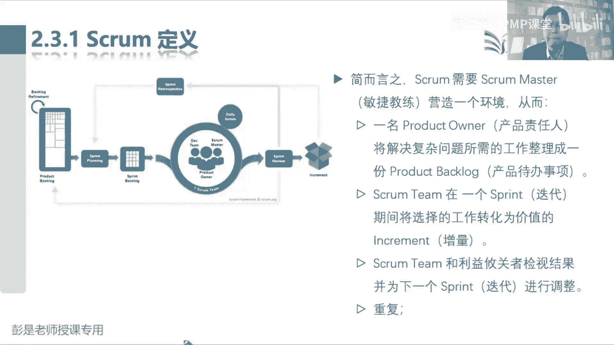
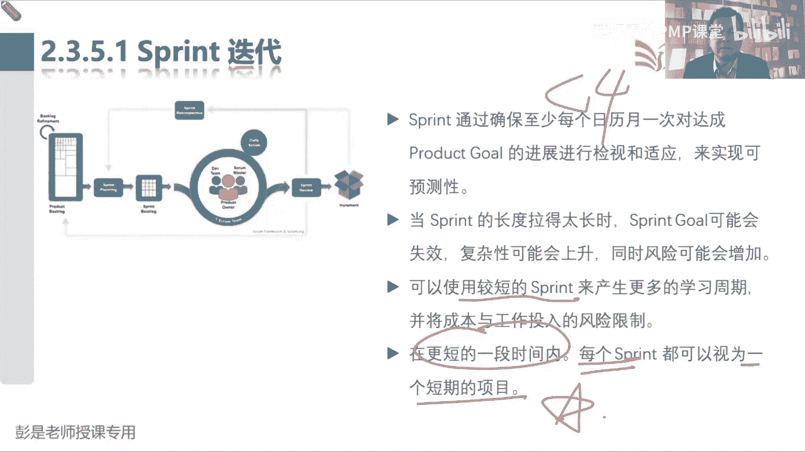
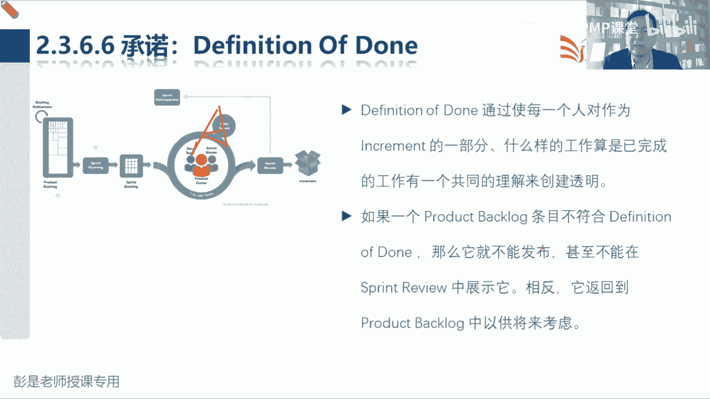
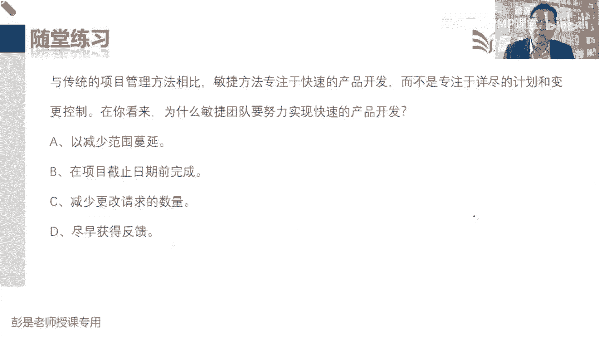
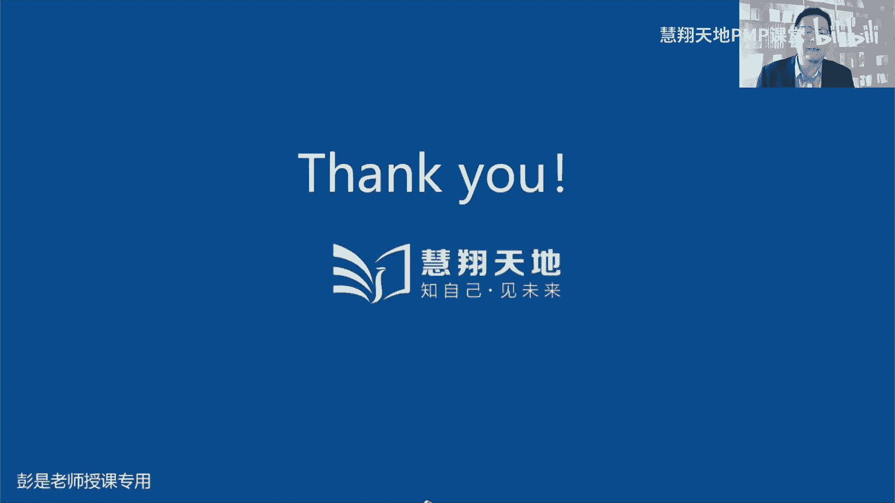
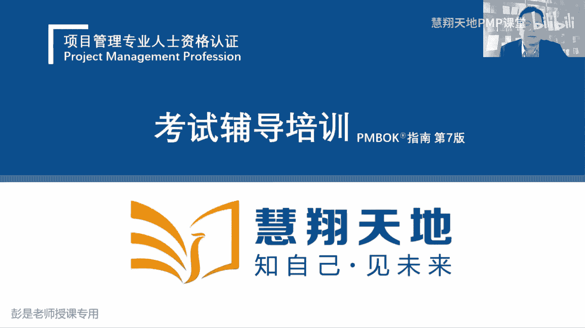
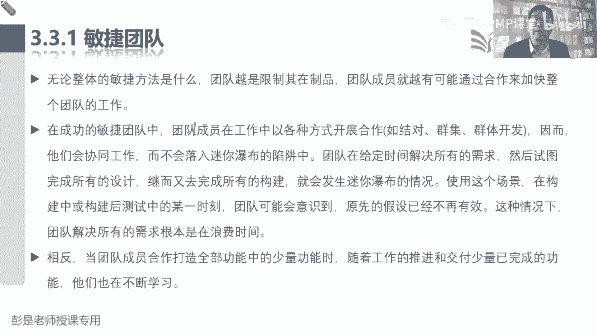

# 2024PMP认证考试课程（第六版+敏捷+第七版） - P14：2.3-3.3 Scrum - 慧翔天地PMP课堂 - BV1By411b7qM

那尼课讲到了squam前面那一段讲的什么呢？就是啊敏捷怎么玩儿，预测型项目怎么玩。预测型项目话，咱们就按照五大过程组十大知识领域49个管理过程，把项目从开始到结束分成N个阶段。

每个阶段启动规划执行监控收尾，启动规划执行监控收尾。这项目就结束了。每个阶段产出的成果再到下一个阶段以此类推，我们就可以得到一次交付。那在多变的反境下说需求也不太确定，技术也不太确定。

我们就有了两种方法，技术不确定，我们就迭代，不断的尝试不断的探索正确的解决方案。那如果需求也不太确定呢，怎么呢？咱就增量啊，做一点试一试，做一点看一看。哎，避免我们在错误的道路上越走越远。

那如果技术和需求都不太确定，我们就迭代加增量就有了敏捷，回顾一下啊敏捷的游戏规则，那2。3这段内容超级超级超级超级重要，因为就是咱敏捷这部分考题的重要考点都在这儿了。那scrame到底什么是这玩儿呢？

scrm现在这张图，大家。来学完了这段内容之后呢，一定要记住它里边的一个单词以及它代表的意思。咱逐个逐个拆解啊，记得33代俩5嘛。此化某是一个轻量级的框架，它能够提供针对解决复杂问题的自适应解决方案。

来帮助人们团结不乱创造价值。非常非常轻，它不像咱传统项目，说五大工程组十大知识，你为49个管理过程又介绍了一大堆的输入输出工具技术，那个超级重超级重啊。

ngram超轻就告诉我们啊大概的核心的游戏规则是什么。对以，再往下这段内容，大家有时间的时候复习的时候多看几遍。好，看看第一小段。说简而言之，squab需要一个squarum master敏捷教练。

营造一个环境，从而可以怎么样呢？一名POproduct owner产品负责人、产品责任人。一个产品责任人将解决复杂问题所需的工作整理成一个产品代办列表。然后呢，我们的s team呢在一个迭代。

也就是printprint冲刺迭代和冲刺是一个意思。在冲刺期间，将选择的工作转化为价值的增量。然后呢，我们和利益相关者就是干系人，就是相关方案。我们和干系人检视结果并为下一个迭代进行调整。

这两个字听完了有点懵哈，所以就回顾一下。说他到底怎么玩，到底怎么玩，看PPT。等我这找到黑板。

他这道文字实际上就是scra的最核心最核心的游戏规则了。因为传统项目啊，我们是收集需求得到需求文件，根据需求文件定义范围写的范围说明书。有了范围说明书，我们创建WBS。

基于WBS我们再去分析完成工作包需要开展的具体具体事情就得到了活动清单。有了活动清单，我们再去估算资源时间成本。哎，我们就反复调反复调，就可以得到范围基准进度基准、成本基准这些乱七八糟的东西了啊。

那敏捷游戏规则说需求文件需求文件，这里边所有的需求，我们根据这个需求去定义范围。那现在如果需求不太确定，怎么办呢？说假设啊随便说了啊，假设我们现在有好几百个好几千个需求啊。

咱一次根据这一大堆需求写了个范围说明书。过两天客户说了，我们这个需求不定啊，那我再提提一些提一些新的想法，再再对需求做出一些调整。那这种情况下，花了这么多的时间，这个范围说明书就废了，还要重新写。

对不对？以此类推。所以如果需求不定的情况下，按照传统的这种管理方法可能导致干的越多，错的越多。那为了避免在错误的道路上越走越远，还记得上一课说那几个中心思想吗？为了避免在错误的道路上越走越远。

我们不求大而全。我们追求小而美小而精啊，先造个滑板车，你先秃露着加个方向杆，根据客户的反馈，看看您下一步需要啥。不断的不断的来改进我们的产品服务和成果。以此类推了吧，再弄个什么发动机。

再弄个什么什么汽车壳。嘿，根据用户反馈，您看看我们这个东西做出来的产品啊，是不是满足您的业务需要。如果不满足呢，您再提出一些新的需求，新的想法，我们再改我们再改，我们再改，我们再改。

那我们要想办法把这个变更的代价降到最低。因为那条交叉线变更的成本随着时间的推移会越来越高，越来越大的。那怎么有效的缩短变更的代价呢？就是周期越短越好，对不？开发的东西越少越好。

这样呢可以有效的以最小的代价去试错。所以他的游戏规则就变成了这样，我们把需求文件改了个名儿，叫产品代办事项。product backlog叫产品代办，产品代办产品为什么叫代办呢？不就是还没干吗？对不对？

那也不 to do这种东西吧。好，我们把所有的需求记入到产品代办事项。进入到代办事项之后啊，我们不是一次根据需求，根据所有的需求去干活了。我们要选取一部分。Okay。小二美呀？我们要选取一部分需求啊。

根据这个需求去设计我们的产品，把这个东西做出来哎。然后呢，让客户来体验，获得客户的反馈。您看看这个东西做出来符不符合您的要求，这个反馈相当于什么呢？不就是变更吗？新的想法对需求改一改，以此类推啊。

这不是变更吗？根据用户的反馈，我们再看看选取一部分需求，然后去干活，得到成果，获得客户的反馈。您再看看需不需要改，就这样不断的不断的不断的循环。哎，就带出来三个术语三个数语啊，所有的需求。

所有要要干的事情，我们叫产品代办事项。就是大虚周持啊。产品代办事项里的东西是我们收集到的各种各样稀奇古怪的千奇百怪的需求。什么业务需求、功能需求、非功能需求，什么离此类的质量需求全都在里边了。

都叫代办的。那接下来我们选选了一部分，这一部分是什么呢？就叫迭代代办事项。当前这一次迭代中我们要完成的工作，这不是迭代的代办吗？迭代代办事项得出来之后啊，我们按照这个迭代代办事项去干活。

就会得到我们的增量。然后呢，获得客户的反馈。我们再开始下一次迭代，再从大池子选一些需求，搬到小池子，又得到了这次迭代的代办事项，我们再去干活，得到成果，获得反馈。就这样，以最短的周期不断的迭代加增量。

迭代加增量，迭代加增量。这样呢可以用最小的代价，最小的成本去试错。好，知道了这个最核心的最核心的这三个东西啊，产品代办迭代代办和增量。接下来我们要分工了。REMRDCI呀对不对？责责责任分工要明确呀。

所以在民捷环境之中，在这三个三个三个弓建的基础之上就提出了三个角色。第一，我们要打造一个成熟的自组制团队。成熟的自组织团队呀，你们自己玩这些东西去把我们变成一个服务型的领导。

所以squa这种敏捷实践里面就提出了，我们需要有一个教练，敏捷教练。教练干嘛呢？就是服务型领导啊，给我们创造环境，创造条条件，帮助我们排除障碍，排除阻碍。

对我们进行指导啊、启发呀、辅导啊、教育啊、帮助啊、支持啊，总之啊就这么一个热心的服务员。热心的服务员创造环境，创造条件，那谁干活啊？所以兵分两路，需要有一个人需要有一个人来搞这个产品代办。

来搞这个需求来设计产品。因为他需要专业知识。和咱讲的传统项目说收集需求里边有一个什么商业分析专业人士，哎，就那个人啊。收集需求收集需求，产品的设计呀、需求的管理呀，这是需要有专业知识。

更倾向于工程化、专业化。所以呢我们需要1个POproduct owner来完成这些需求。这些产品的设计。哎，他来管需求，他来设计产品，完成产品的规划。他来告诉我们做什么。对不对？PO说要坐个滑板车。

咱就坐个滑板车。PO说要做个脚蹬子，咱就做个脚蹬子。PO说要做个发动机，咱就做个发动机。总之他告诉我们做啥。有人来决定what有人来决定what就需要有人来决定号吧，那咱就需要一个开发团队交付团队。

开发团队交付团队关注的是啥呢？就是how啊。根据PO提出的需求，我们去想啊怎么把这个脚蹬子做出来，怎么把这个发动机做出来。怎么把这个滑板车做出来？我们更关注的就是技术的解决方案吧。好。

所以这周带出来敏捷里边的三个角色，我们需要一个服务员给我们做这种热情的热情的敏捷教练。还需要一个人帮助我们完成需求的管理，帮助我们规划产品。这是PO他来关注我们到底做什么事儿，对不对？

到底要创造什么样的产品服务成果？那除此之外呢，还需要一个开发团队交付团队。他们更关注的是怎么把人家提出的需求给他完成，怎么把人家要的这个功能给他做出来，关注的是技术的解决方案。这就是三个角色PO。

然后开发团队和引捷教练，然后带出来三个弓箭，大需求池叫产品代办事项，小需求池叫迭代代办事项。最后得出的这个成果，可以使用的产品服务成果就叫增量。哎，所以我们就开始游戏规则了。

有人来创创建和维护大需求池产品加班事项。迭代开始的时候，我们想一想这次迭代到底干啥，哎，就需要把大需求池的需求搬到小需求池。然后呢，我们的开发团队交付团队更关注的是这活到底怎么干哎。

去干活就会得到我们的成果。得到成果之后，我们获得客户的反馈，看看做的对不对。再开始下一轮迭代，这就是大概的这样这样一个游戏规则啊。好，搞定。

这就是教材商教材商这段文字。不。你先不要着急去理解说这到底归谁管。他就是说我们需要这三个人，这三个人到底归谁管呢？我也不知道具体情况，具体分析，不要考虑细节啊。对不对？不要考虑细节啊。

今天中午吃饭需要个厨师，这是个角色。咱教材里面说的都是角色呀，对不对？今天中午吃饭需要个厨师，你要问问说这个厨师是男的是女的呀，身高多少啊，体重多少啊，多少岁呀，1月工资多少钱呢，不知道啊，不知道啊。

具体情况，具体分享，可能是我爹做饭，可能我爹做饭，可能我做饭，可能我一人做饭，各种可能性。所以先听先听，把现在这段文字，把书上现在给出我们这些这些管理方法，把它听明白就可以了，不要去把它具象化。

因为具体实践情况、具体情况具体分析。好。不要去推演各种可能性，这是大家考试看书做题非常非常重要的一个原则啊。不要去推演各种可能性了。好，那接下来看这段文字，再看是不是简单多了。所以简而言之。

squame需要一个服务员创造一个环境，1个PO产品负责人将解决复杂问题所需的工作整理成一个产品代办事项列表，就是左边那个大需求池。然后呢，我们的开发团队。

整个迭敏捷团队在一个迭代期间迭代就是增量就是冲刺sprint一个意思啊。迭代就是冲刺，就是spprint，不是增量。在一个冲刺期间，在一个迭代期间，将选择的工作转化为有价值的增量。

这几句化信息量其实很大的啊，将选择的工作转化为价值的增量。那第一，我们要先先完成有价值的需求。所以呢产品代办事项里的东西，前面说过价值交互价值交互。要对里面的需求做排序，去分析哪一个代办事项价值高。

哪一个代办事项价值低，以此类推，要排完序排完序，然后我们还要做选择。因为周期周期有限制的，两周啊一周啊三周啊，对不对？双周一迭代单周一迭代，我们时间有限的，不能完成所有的需求啊。

所以呢我们要选择能干多少干多少，把选择的这些需求放到小区周室。那我们最后按照这个需求去干活就会得到这次冲刺的结果，也就是增量。这样呢我们在迭代期间，在迭代期间将选择的工作转化为有价值的增量。

就带出来我们这三个三个单词要记住。好，那再往下说sm team和相关方和干系人检视我们的结果，就是我们得到这个增量啊，你们要看一看这玩意儿对不对。你们要看一看这玩意儿对不对，并为下一次迭代进行调整。

为下一次迭代做调整是什么意思呢？就是啊。他客户可能会提出新的想法呀，我们原计划先做一个滑板车，再做一个什么。带方向杆的滑板车，客户可能反馈呀，我需要我需要加个发动机呀，对不对？那就先不做这个方向杆了。

以此类推吧。哎，反馈反馈就是提出一些什么新的需求啊，新的想法呀，对现有的功能做调整啊，总之它就是变更，对不对？变更变更变更变更这东西放回大区求时。我们再排序，以此类推了。目前我们讲了scram这种时件。

敏捷时件，它的迭代周期是固定的。上节课上节课没听到的同学需要再去复盘了啊。好，不讲了。基于迭代的敏捷，基于过程的敏捷。这段这段就这么两个单词没那么难理解吧。回顾前面的课程了啊。

大家不要再问各种稀奇古怪的小问题了，把现在这段能听明白就非常非常非常赞了。不果。好。😊，所以这段话超级重要，就告诉我们敏捷最核心的游戏规则了，有大需求池，有每次迭代有小需求池，按照计划去干活，得到增量。

获得反馈。下一次迭代再搬个小序求池过来，再干活，得到增量，获得反馈。下次迭代再弄个小蓄周池，再去干活，再得到增量，获得反馈。就这样不断不断不断的循环。那每次迭代到底干什么事儿呢？

需要对产品代办事项里的所有代办事项不断的优化，不断的细化，不断的排优先级。从而能够做到价值交付。那最后这游戏规则就是三个角色啊，PO负责大需求池，开发团队交付团队，想办法把这东西给他做出来。

最后呢我们需要一个热情的服务员，就这张题好了，不解释了不解释了。这个面到底是啥，我也不知道了。那再往下。哎，squam就是敏捷的实践方法之一，实践方法之一。现在我在做的事情就叫无价值活动。Okay。好。

那再往下说教材上这段文字说squam是非常非常容易理解的。如果不理解的同学我也不知道咋讲了，这课啊说原封不动的去尝试并确定记热巴巴不念了，创造价值。这个东西不完整不完整不完整，重要的事情说三遍。

它不像咱五大过程组十大知识领域40有管理过程写的非常非常非常详细。非常重量级的一些方法啊。此块部呢就这么简单，为什么呢？就是因为我们要根据自己的项目实际情况去裁剪了。根据自己的项目实际情况去裁剪。

常见的三个敏捷实践方法，一个叫scrame，一个叫看板，一个叫极限编程。上节课讲过的东西啊。我们要不断的不断的去调整这个东西啊。好，不断的调整不断的调整，所以带出来的知识点是什么呢？除了获得反馈。

我们还要反思过程。上节课也说过了吧。除了反馈呀，看看我们的成果做的对不对，我们还要反思过程，看看这个过程什么地方做的好，什么地方做的不好，有则改制，无则加勉，对过程做改进做优化。

所以最后敏捷实件带出来最后5个事件就是一个叫。review一个叫racachel，一会儿会讲到。好，记住这个道记住这句话啊，他写的不完整，写的很粗略，它是个轻量级的框架，告诉我们这个核心的游戏规则。

什么叫核心的游戏规则？这个道理再给大家讲一遍，比如说打麻将。嘿，三个3个1万，这可以凑成一对，什么1万2万3万，这可以凑成个数儿。然后三个一桶，这可以凑成一对三一桶二桶，三桶可以凑成一数儿。

这是非常轻量的非常轻量级的一个框架。这个游这个麻将到底怎么打，具体情况具体分析呗。对不对？大家每次打麻将，你要天南海北来自不同地方的人，你不得现场商量这个游戏规则吗？变成具体实践，变成具体实践。

因为麻将有很多具体的游戏方法，对不对？但是核心的框架是不变的，什么叫对儿，什么叫碰，什么叫杠，这道理都是一样的。哎，squam就是这个游戏规则，告诉你一个大道理。好。

所以我们仅定义了实施srrum理理论所需的一部分。哎，它是吧拉，他没有为人们提供详细的使用说明，而是指导他们之间的关系和互动。你要知道啊，如果在需求不确定的情况下这么干，可以帮助我们去进行探索。

看看我们做的对不对，知道这个简单的道理就可以了。好，那再往下在squam框架之中，我们可以使用各种不同的过程记术和方法。我们把可以将一些已有的事件包装进来，也可以甄辨出b万不变了，这是裁剪，就是裁剪。

根据情况进行不断的不断的不断的过程的改进。Okay。那再往下说，scrarum基于经验主义和经济思想这句话。应该能看到他反应过来啊，精义思想精义思想那个大圈儿，它包括了所有的敏捷实践的。

它的根儿是什么呢？消除浪费。消除浪费消除浪费。因为一次完成所有的需求，把东西做出来，这就是浪费呀。因为需求现在不确定啊，因为现在可能会有变化呀。这也是浪费时间，浪费钱的。所以以此类推了。

我们想办法想办法最小的代价去事做。所以他才采纳一种迭代和增量的方法来优化对未来的预测性并控制风险。我们让一群共同拥有所有技能和专长的人员参与到参与进来完成工作。并根据需要分享或获得所需的技能。

共同拥有所有技能和专长，所有技能和专长的人，这里边带出来一个。考点是什么呢？我们这个团队呀用两个单词来形容它。第一个单词是叫跨职能团队。Yeah。Yeah。跨职能团队跨职能团队变成简单的大道理。

这意思是就是说呀。干活不求人。我们拥有完成工作所需要的所有技能。什么叫拥有完成工作所需要的所有技能呢？大家实际在工作之中，实际工作之中，我们获取资源要找职能经理吧。获取资源要找职能经理。

人家掌握这优质资源，还可能找其他项目，想稀缺资源，这不是墨迹嘛，对不对？找职能经理走流程，可能涉及到层级主义啊、官僚主义啊，人家跟你说，没时间忙不过来，过两天再说，是不是会影响我们这个工作的效率啊。

因为我们迭代周期本身就很短的，对不对？一周也一迭代，一周迭代一次，一周迭代一次，你跟我说三天以后，张工再过来，这效率太低了。那为了尽量的尽量的规避这种这种层级主义，对吧？就是割草门前雪这种现象。

所以呢我们最好打造这个小团队，拥有我们完成工作所需要的所有技能。这样呢干活的时候就不求人了，来消除这种层级主义官僚主义对我们这个敏捷性的影响。好，这是第一个啊。第二个第二个是什么呢？

所有技能和专长所有技能和专长。那我们这些人大希望大家都是通才。因为跨技能团呃跨职能团队跨职能团队虽然解决了职能部门之间沟通交流的这个费劲。但是呢我们这个团队内部。团队内部啊，万一张三今天请假了。

这活干不下去了。万一李四明天调休了，这活干不下去了。万一今天张五过完节还没回来，这活干不下去了。嘿，这也是对我们工作往前推进，形成了阻碍，形成了障碍。所以呢我们希望啊我们内部这些人啊。

大家最好最好最理想的模式就都是通才。张三不在了，李四能顶上，李四不在了，王五能顶上，以此类推。这样呢我们才能够更好的提高我们的敏捷性。好，记住这两个单词啊，后面还会反复看到的跨职能通财自组织。

这是目前我们掌握到敏捷团队这三个特性。Okay。啊。Good。是一个意思。教材里面不可能出现一个单词，在不同语境下有两个含义啊，大家不要过分解读，这没那么神秘啊。刚才已经很简单。

很粗暴的给大家说了什么叫迭代了。好，再往下了，咱家提高要提高抢课的效率。那接下来squam将4个正式的事件组合在一起，组合在一起啊，在一个容器性事件sprint中中进行检视和适应。

sprint就是迭代sprint就是冲刺，这个问题不要再问了，不要再问了啊，sprint和迭代和冲刺都是一个意思。sscribe是什么呢？是形容橄榄球的那个征球那个场景，争先恐后啊。

他就想啊说当时软件开发人员出的时出的那个敏捷宣言，还记得吧？软件开发人员就用了很多橄榄球的术语，说橄榄球征球的时候，嘿大家你就像那个抢挤地铁抢座，就那个场面争先恐后，争先恐后，积极主动热情。

就为了抢个座，以此类推。所以呢就用sme来使来形容这个敏捷团队，大家争着争着把这个最有价值的东西尽快的给它做出来。然后spprint的是什么呢？就spprint就是那个冲刺，拿到球之后。

想办法得分往前冲啊，你不理解橄榄球抢足球也可以啊。球到手之后，玩了命的往前冲啊，想办法把球踢到球门里得分啊，这就是一轮冲刺。所以说我们将4个正式的事件组合在一起，以及在一个容器性的sprint。

就是迭代中进行检查和适应。也就是我们我们在迭代之中啊有这么四个会。在迭代之中有一共有4个会告诉我们这四个会它的主要工作是啥。那迭代本身呢又是个事件，所以呢把它叫容器性事件，它包括了这四个会。

最后加到一起就等于5。所以是一共有5个事件。Okay。有5个事件，因为迭代本身就是个事情啊，在迭代之中又包括4个会。那这一大堆东西组合到一起，实现了敏捷敏捷三个支柱叫透明检视和适应。

这三个支柱不需要记得啊，透明的好处是什么呢？上面可以说了吧，便于及时的发现问题。哎，是为了更好的检释，更好的解释，更好的解释。那我们检视发现问题的目的是什么呢？是要解决发现解决导致问题的人吗？

还没讲到呢，亲还没讲到呢，亲先听先听这段就听，老老实实听就行了。大家学到第六天了，这个学习方法还没掌握，很很着急啊。现在5月5号了，还有20多天就考试了。好。好，送给大家。

目前这个阶段最重要的学习方法就叫三个字，专心听我说的每句话能听懂就可以啊。Yeah。好，再说话说回来。三个支柱，透明的目的是为了检视解视的目的是什么呢？及时的发现问题。发现问题的目的是什么呢？

不是解决提出问题的人，是更好的解决问题。早发现，早治疗，早早康复，更好的适应这个更好的适应这个复杂和多变的环境。哎，所以带出来这三个支柱，这三个支柱要背吗？不用背不用背，不用背。

记住这三个东西和通过考试没有必然的因果关系。我们已经通过散点图做了大量的实验啊，所以不用记不用记，不用记，记不住没关系的。好，那这5个事件这50这5个事件组合到一起。

就帮助我们更好的早发现早治疗早康复来适应这个多变的环境。记住这个道理。那这5个事件到底是什么呢？不着急不着急不着急，先听。好，说透明不垫了吧。说透明可见可见早发现，早治疗早康复。那在squam之中。

重要的决策是基于三个正式的弓建感知状态。哪三个弓建呢？刚才说了，大需求持、小需求持和增量。什么叫弓线呢？就是零件，我们一共有3个零件大曲周池、小曲周池和最后的增量。通过这三个东西看看我们做的对不对。

通过这三个东西，看看我们做的对不对。因为大需求池大需求池里面包括了所有的产品的需求，所有要做的事情，包括人家可能要个什么发动机，滑板车要轮子，要方向杆，要壳，这么多东西一次搞不定。

那我们先弄一个小需求池，需要四个轮子，需要一个板弄一个滑板车出来，让人家看看做的对不对？然后再对需求排排序，人家现在说要方向杆这个东西对它价值最高，那就把方向杆给他做出来，再获得反馈，对不对？

下次迭代再看看剩什么东西价值最高，用户说要个脚蹬子，就把脚蹬子给人家做出来。哎，让人家看一看做的对不对，获得对方的反馈，总之，通过这三个东西，让我们知道产品再朝着什么方向去发展。

所以重要的决策是基于这三个正式的工建的感知状态，就是大需求池产品代办事项、小需求池迭代代办事项和最后的增量这三个红色的东西。那如果这三个东西不透明，那么可能导致我们做出的决策就不英明。

所以透明是减视成为可能，没有透明的减视也是一种浪费，对不对？看不见摸不着，这不是浪费时间吗？好，那再往下squa的弓建和实现商定目标的进展，必须经常和勤面的解视，以边发现潜在的不良差异或问题。

就是看看各种问题呗解视的目的是为了发现问题，发现问题就是早发现早治疗早康复。所以为了帮助检视，我们用5个事件的形式提供了稳定的节奏。每一次迭代里边包括四个会，这四个会到底是啥呢？一会儿会说呀。

为什么叫稳定的节奏呢？因为我们的迭代周期相对来说通常是固定的，它要小于4周，可能是一周、两周、三周、四周各种可能性。这样我们就可以稳定的稳定的稳定的去干活，得到成果。好，所以后面车库的话老过说了啊。

为了帮助减视，我们用这个东西提供节奏，减视使得适应成为可能，因为就是多变的，我们要适应这种多变的环境啊，那没有适应的减视就是毫无意义。做出来的东西如果没有获得反馈，这不是神经病嘛，对不对？就这意思吧。

好，再往下了。那2323最后适应就再说了。如果过程的任何方面超出了可可接受的范围，或者是所得的产品不可接受，就必须对当下的过程或者是过程处理的内容加以调整。就是啊过程和结果。同等中药。

过程和结果同等重要，对不对？如果这个技术方案这个过程不满足要求，咱就改呗，这不是迭代吗？如果这个结果不行，咱就改呗，这不是变更嘛，对不对？以此类推，总之啊想改随时改，因为周期短，因为周期短啊。所以。

调整工作并必须尽快执行以最小化进一步的偏差，早发现、早治疗、早康复还是这个道理啊。那当所涉人员没有得到授权或者是不能自管理时，那么这个适应就是个扯淡的东西，对不？所以呢我们需要打造一个成熟的自组织团队。

需要打造一个成熟的自组织团队，由他们自行完成工作的规划执行控制。他们自己做决策，自己做的做出做决策。就可以就可以早发现、早治疗，早康复了，我们就变成热心热神的服务员。哦，知道这个意思，听一听就可以了。

那再往下233就带出来5个价值观。现在我们知道了有三个弓箭，有三个角色，有三个支柱，还刚才说有5个事件，最后呢就是5个价值观，杀三那俩5。这5个价值观也不用背不用背不用背。

记住它和通过考试没有必然的因果关系，不用背啊。了解就可以了。第一，承诺。第二，专注第三，开放。第四个尊重最后一个勇勇气。Yeah。Yeah。承诺是什么呢？这不这是这周我保证完成任务，这不是承诺吗？第二。

专心避免一清，必避免脚踏两条船那，要专心专心，一心一意，避免一心二用。开放是什么呢？所有的东西都透明。便于早发现早治疗，早康复，尊重是什么呢？每个人的观点哪、价值啊、主张啊都有它的意义呀，对事不对人呢。

对不对？我们尊重大家提出合理化的建议和见解。最后呢，勇气勇气啊有勇气做承诺，有勇气透明，对不对？勇气勇气做出承诺，做出承诺，透明透明透明、早发现，早治疗，早康复。最后根都是这个东西啊。好。

所以这段文字不需要去背的，听懂就可以了。那我们的团队致力于达成目标并相互支持。他们主要关注是迭代迭代的工作，以便尽可能朝着这些目标获得最好的进展。我们呢对工作和什么开放态度，大家尊重，然后呢。

叭有勇气处理正确的事不定了啊。🤧好，后面文字都不念了，这段文字记得主记步骤没关系啊。那接下来234就开始讲细节了。那squam的基本单位是小团队，通常规模9个人左右，不建议多。所以参考特种部队。

特种部队不是几百人、几千人几万人，对对？小团队作战打，主打一个灵活。那小团队就称为squame team。squa team需要一个服务员，敏捷教练，一个产品负责人product owner和开发团队。

也就是我们的交付团队。哎，那服务员关注的是什么呢？就是环境支持排除障碍，指导辅导，帮助启发教育这些东西。PO负责干啥呢？需求产品，关注的是我们到底做什么？是做滑板车啊，还是做脚蹬子呀。

开发团队技术团队交付团队关注的是什么呢？就是浩，你要的滑板车，我们怎么把它做出来？好，就这三个图就这三个三个角色啊。那再往下在我们这个团队之中，没有子团队或者是层级结构。

因为层级结构是我们传统项目的玩法。传统项目我们需要规划资源管理的时候注那三个东西啊，一个是OBS项目的组织架构，第二个是责任分配矩阵。第三个是那个文本型，对吧？因为他的人多呀。人多就肯定需要分小组。

分层级，分分等级了。那敏捷团队我们人不多呀，9个人左右啊。所以呢。能想到什么知识点，讲到组织架构那张表，第一行叫什么来着？在这种组织之中，大家都是兄弟并肩子上，对不对？没有什么上下级，没有什么上下级啊。

Yeah。🤧嗯。你叫什么来着？好了吧，什么简单型。对，去中心化。简单行去中心化，没有领导，没有领导啊，大家都是平起平坐，都是兄弟。好，这听一听，后面还会看到他了。那我们这个团队啊是具有凝聚力的专业团体。

一次专注一个目标，也就是产品目标。到底是造什么交通工具的？这不是目标吗？对不对？好，滑板车、小汽车、摩托车按照这个思路往前走了。那我们的chm团队是跨职能的。只要记住他。

这意味着团队成员具有在每个迭代中创造价值的所需的全部技能。Okay。他们也是自管理的成熟的自组织团队，他们会得到授权呢。这意味着他们在团队内部决定谁做什么，何时做，以及如何做，没有人分配任务。

是大家主动去领取任务，你们自己定就可以了。没有人分配任务啊，项目经理不挂那个RAMRAMR啊，对不对？不做这种工作的工作的分工啊，不去发号施令。没有管理者，大家都是兄弟，没有管理者。

管理者是靠命令让对方去干活的，对不对？希望大家每一个人都是领导者，自己主动找点事儿，找点事，兄弟们都跟我上，就这道理啊。刚才也说过跨职能的吧，干活不求人的，我们拥有干活所需的全部技能。

就可以尽量的尽量的减少这种跨职跨部门沟通，跨部门协作这种问题。Yeah。好，那再往下。说squam规模要足够小，保持灵活，同时足够大，以便可以在一个迭代中完成所重要的工作。那通常只有10个人左右。

这个数字记不住。没关系啊，10个人、9个人、8个人、11个人、12个人可不可以，那可以啊，具体情况具体分析对不对？他告诉我们，这是一个轻量级的框架，它不是一个强制性的要求左右就可以了吧。总之。

为什么人少好呢？因为人少沟通方便，想到沟通渠道啊，N乘以N减1除以210个人有多少条沟通渠道呢？10乘以99045。如果20个人有多少高中渠道呢？20乘以19。等于190哇，渠道太多了。

沟通越来越费劲了。所以人少人少人少，沟通效率高，效果好。然后如果这个团队变得太大，那么则应该考虑把他们重组为多个具有凝聚力凝聚力的srum team。每个团队都专注于同一个产品。

就是大家的目标还是一样的，真是有30个人怎么办呢？分成三个小组呗。分成三个小组，但是呢不能说这个小组做汽车，这个小组做软件，这个小组做什么做什么飞机，咱还是维维持同一个产品目标的，对不对？好。

知道这意思啊。所以这种多团队敏捷，咱PMP考试实际上不大会考。多团队敏捷有多团队敏捷的实践方法。那一个srm太大了，人太多了怎么办呢？咱就crm ofsm。变成变成多个小团队，这是一个团队，两个团队。

三个团队就要srm of scm。如果团队还在多怎么办呢？那就squarumum over scrumum over scm。其实倒过来一看，不就是组织架构吗？这是三个团队的敏捷。如果这个团队人太多。

那再分呗再分配，以此类这样，它就叫srum of scrumm of scm。不断的不断的把大团队拆成小团队分解和创建WPS那个道理是一样的啊。这了解就可以。然后最后这一行。

因此他们应该想共共享产品目标、产品代办事项和产品责任人。因为我们不管是几个团队，我们的目标是一致的，对不对？所以呢是大家共享共用1个PO。这了解就过了。那最后我们负责和产品有关的活动。

包括巴拉拉巴拉巴巴拉巴组织组建并授权scrrum team自行管理他们自己的工作，以可持续的速度在迭代中工作可以提高大家的专注性和一致性。可持续的速度可持续的速度，咱追求的就是一个稳定的输出。

主打一个持续的稳定的输出，大家就参考，比如跑马拉松。对吧前100米玩了命的跑嘎了，这也不行啊，拔苗助长这种这种现象我们不不提倡。我们追求的主打就是一个稳以稳定的节奏持续的交付我们的产品服务获成果。

所以咱考试就考基于迭代的敏捷，我们有固定的迭代周期。Yeah。我们有固定的迭代迭代周期，通常小于4周。然后呢，按按照计划去干活得到我们的增量。那这次迭代到底能干多少活呢？这就称之为速度。Yeah。

Yeah。所以粗暴理解了啊，这次迭代到底能干多少活，就称之为速度。就像大家做每周的周工作计划一样啊，这周我要种100棵树，下周种100棵树，在下周种100棵树，在下周种100棵树植树节。はい。

这样呢我就可以做到持续的稳定的可持续的速度吧。不要说这周加加加班，天天熬夜种200颗，下周呢累的不行了，只种了30颗，再下周300颗，再下周0天上一脚，地上一脚，这种不稳定的叔鼠，我们不建议。好。

知道这个道理啊。那再往下找。🤧所以呀整个s team都有责任在每个迭代中。创建有价值的有用的增量。怎么做到价值呢？因为我们要对产品代办事项里的需求做排序，优先交付最有价值的产品服务和成果。

所以假设A10块钱，B8块钱，C5块钱，咱就先做A，因为它最值钱，对不对？然后这个A做出来呀，还要一定一定一定可以使用。上节课说了吧。他一定要可以使用啊，可以使用的东西是衡量进度，衡量进展。

衡量绩效的金标准的这个东西做出来的增量，如果他不可用，那怎么有效的获得客户的反馈呢？一定要可以使用，可以使用，才认为它是个增量，半成品不不叫增量。好。那再往下，我们在订立的三种职职责。

开发团队、产品负责人和敏捷教练，这是三个角色。开发团队关注的是号。产品负责人关注的是what，他来告诉我们做啥。敏捷教练呢是一个热心的服务员，给我们做配合，做启发，做指导，做辅导，做帮助。

那接下来2341就开始具体讲这三个角色，大家的分工是啥，并且呢基本上没什么新的知识点了。开发团队是squam team目中致力于创建每个迭代可用增量任何方面的人员。就是在每个迭代一开始。

我们有个小需求池，你们就关注怎么把这些东西给它做出来，最后得到我们需要的增量。那他所需的技能通常很广泛，并且呢会随着工作领域的不同而发生变化。具体情况具体分析呗，因为做软件也不一样啊，做游戏呀。

做小程序呀，做APP呀，需要所需要的技能不同的。总之看情况啊。但是。我们的开发团队交付团队始终要负责为迭代创建计划，也就是小需求时迭代代办事项。然后呢。

通过遵循definition of done DOOD这个要记住。通过遵循DOD叫已完成的定义，它纯粹是直译过来的啊。来注质量。遵循DOD遵循DOD来注入质量。这个玩意儿粗暴理解就是我们的验收标准。

咱传统项目范围说明书里边不有一个验收标准吗？满足验收标准的东西才能够去进行验收，对不对？好，那我们就有了一个已完成的定义。这个东西定位都是未完项，未完项都叫代办事项啊。什么情况下，这个东西已完成呢？

可以让客户来尝一尝吗？这不就是DOD吗？对？它主要是为了确保可以使用。这东西要说清楚了。满足什么条件，我们认为才认为认为它才可以使用，才可以认为可以可以认为这玩意儿可以让客户看一看，从而获得客户的反馈。

其实就是验收标准，只不过现在换了一个术语啊，考试的时候可能就直接写DOD了。这个单词要记住的。那我们通过遵循已完成的定义来注入质量。每天呢根据冲迭代目标调整计划和作为专业人士对彼此负责。总之。

我们关注的就是小需求池。你告诉我们这次迭代到底干啥，我们就想方设法的把这些工作给它去完成。Okay。完成以后得到了一个可以使用的产品服务或成果，我们才认为得到了一个增量。嗯。好，那再往下第二个角色。

PO product owner。PO负责将scrm team的工作所产生的产品价值最大化。产品价值最大化，所以他需要啊告诉我们什么东西值钱，什么东西不值钱。他要去对产品代办事项里的需求排排序了。

看看什么东西价值高，什么东西价值低。嘿，那如何做到这一点，在组织scrm team和个体之间存在着很大差异。因为不同的产品服务成果。不同的产品服务成果，做汽车的、做手机的，做软件的对对？

这肯定是方法不一样的啊，但是中心思想是不变的，我们需要有一个人需要他需要有专业知识。从而告诉我们什么东西价值高，什么东西价值低。来对需求做排序，来对产品做规划做设计。嗯可以。

那再往下PO还负责对产品代办事项进行有效管理，包括开发并且明确的沟通产品的目标到底是做个什么滑板车啊，什么摩托车呀，目标呗。创建并清晰的沟通产品代办事项的条目，大需求池理产品代办事项里的所有的条目。

什么叫条目呢？就是里边的事项啊。这是粗法理解一个一个的用户故事。他对里边这这里边这里边他要确保这个东西信息准确，一个明确的可测量的、可验证的和主要业务有相关性的干系人愿意认可的需求。

它才是一个有效的需求。A，就确保确保它的有效性。然后呢，对产品代办事项条目和排条目进行排序，它以价值为导向。去告诉我们这些东西什么优先级高，什么东西优先级低。Yeah个。🤧。前面已经。

前面的课程粗粗暴的讲了一些排序的一些方法。啊，QFD基本需求期望需求、意外需求卡诺模型。加上一个无差异，加上一个逆向，还有莫斯科方法。基本需求什么必须有应该有可以有，不能有。哎。

这都是对需求排优先级的方法。除了这些方法之外，他只考虑什么必须有应该有吧，他考虑到片面了，还要考虑价值。他去根据这个工西的工工作量、价值、什么复杂程度、风险，他要考虑很多因素，对需求对代办事项做排序。

考试不会考这种多标准角色分析的啊，不要不会考这么复杂的场景，考试就简单。考试告诉你说A需求大概工作量是一天，然后10块钱，B需求工作量是两天10块钱。你选哪个呢？哪个需求优先级高呢，那肯定是A呀。

因为赚的多呀？考试就这么简单，只不过他不用这个一天两天这个绝对单位啊，后面会讲到故事点，他用另外一个计量单位。好，了解就可以了。那最后确保产品代办事项是透明的可见的和可理解的。

因为不理解这活儿就干不了啊，对不对？好，所以考试超简单，只要沾到产品，只要沾到需求，只要粘到这两个东西的什么优先级排序。找谁呢？找PO他说了算。他说了算啊，所以这个产品代办事项是所有的未完项。

所有的代办事项。那不管是什么样的，不管是什么样的新的东西都叫变更了。客户提的反馈说我需要加个脚蹬子，客户提的反馈说，哎，为了反为了销售协议，我就直接用加号了啊。客户说我需要个脚蹬子。

客户说我需要个发动机，客户说你这个颜色不好看，改成黑的客户说你这地方这地方有缺陷，改一改。我们什么改进措施变更问题解决风险应对。你能想到的单词，想到的单词都是要完成的工作吧，需求问题的解决方案。

变更对不对？改进措施什么什么以此类推了。这都叫要干的活啊，都叫未完项。那任何时间提出的这些新的东西，我们都认为它叫变更了。所以呢所有的变更全都放回产品代办事项，由PO来做主什么东西价值高。

什么东西价值低，什么东西优先级高，什么东西优先级低。所以在敏捷项目之中，他不会考CCB。敏捷里边的变更找谁呢？找PO因为变更全都是新的东西，全都全都要放回产品的外事项。PO来管理产品大白事项啊，对不对？

所以就就记住这个逻辑啊，需求啊、产品啊变更啊，PO说了算，他有这个决策权。他来决定我们到底做什么，他来决定做什么产品，他来决定这个东西要不要改，他来决定要不要缺陷补救，要不要什么预防措施。

要不要什么风险应对，要不要执行问题解决，他来分析这些代办事项的价值。他来分析这些代办事项的价值，我这起了个包，要不要解决呢？不着急这个问题后面再说，因为不着急，因为价值低，对不对？我现在心梗了。

要不要马上解决呢？要啊，因为这玩意儿价值高啊，以此类推。所以是PO对所有的事情来做决策，优先级高还是优先级低？那么我们听到的所有的事情，包括什么需求啊，包括什么要干到事儿啊，包括什么变更啊，问题啊。

包括什么什么改进措施这种东西全都是PO说了算，牢牢的记住这个重要的知识点啊。知道PO的主要责任就可以了。好，那再往下了。好。后边那句话听一听就可以了。PO可以自己做上述工作。

或者也可以将职责委托给其他人。然而，无论如何，PO是负最终责任的人，这句话耳熟不耳熟啊，就是工作可以委托，可以授权。但是呢那个东西出不去的中则。对不对？权利可以扔出去，可以说扔出去，责任甩不出去的啊。

出了问题为PO是任。就这道理。好，那为了保证PO取得成功，整个组织必须尊重他们的决定。为什么呢？你让人家背这么大的锅呀。让人家背这么大的锅，就需要就需要给他相应的权利，否则他背不起这个锅，权责要对等。

没，这个咱案前面。讲到什么弱矩阵只能行平衡矩阵讲的这个道理是一模一样的啊，权责要对等，有多大的权，我才会敢飞多大的锅，就这个道理。好。

那最后这些决定在产品代办事项product backlog的内容和顺序中可见，因为PO来决定这里边的东西都有啥PO来决定这里边东西的优先级。并在spring的评审。来了个新的术语啊。

并在spprint评审时透过可检视的增量予以体现。spprint评审迭代评审review。review这是什么东西呢？这相当于咱传统项目的确认范围。做验收。相当于传统项目确认范围做验收。Yes。

确认范围确认范围是什么呢？就是我们指导与管理交盟工作产出可交付成果，做了指控，得到合实的可交付成果，合实的可交付成果，让客户让发起人看看对不对？然后没问题，就得到验收的成果。那以此类推了。

所以马上就会讲到我们5个事件里面的其中之一迭代评审会，这先听一听了解就可以啊。后面都会讲，马上就会讲。嗯。好。所以最后做出来的增量做出来的增量，做出来的增量啊。

我们需要有一个review这个会让客户看看这个玩意儿对不对。让客户来体验，让客户来尝一尝这个菜好吃不好吃，让客户来看看这个滑板车好骑不好骑，以此类推了。Oh。不。嗯。好。有同学问啊，PO不懂技础。

出了许多时间不了，怎么取得成功？你能说这个团队是成熟的吗？Okay。PO就拍脑袋就想拍脑袋就想。Yeah。不参考别人的意见，不尊重别人的意见，这是一个成熟的团队吗？不成熟。但应该怎么干呢？合作呀。

PO来决定到底做什么，开发团队来决定到底怎么做，合作合作合作，对不对？我们打造一个成熟的自组织的、通才的、跨职能的。什么叫自主的成熟啊？大家理性思考啊，这事到底行不行啊，不问人呐，对不对？好，再往下了。

Oh。不说话。Yeah。那再往下说，PO是一个人。而不是一个委员会告诉我们啊，PO只是这一个一个人怎么解释，说他不是好几个人，这是一个人。就一个人。然后在产品代办事项列表之中。

PO可以代表许多干系人的期望要求。PO叫什么客户的代言人，用户的代言人。哎，他来对他来对产品代办事项做决策。刚才刚说过啊，权责要对等啊，因为他要背这个锅。那么最后带出带出来这个结论。

那些想要改变产品代办事项的人们，可以尝试去说服PO来做到这一点。总之啊这里边的东西如果想改找POPO说了算，这里边的东西如果不明确找POPO负责管理和维护这里边的东西。

他得优先级不知道找POPO做这个主。好，记住这个重要的原则，这是非常非常非常重要的考点。要不然看到选项看到选项，这事儿谁做谁做主啊，这事谁说了算的？如果没有认知，那可能就打不对了啊。那，再往下了。

搞定PO接下来看看我们的服务员干啥。服务员这段文字后面复习的时候，基本上可以很快的看了，讲了太多遍了。我们需要一个热情的服务员，按照squam指南的游戏规则来建立squam，他们通过帮助。

帮助scrme team和组织内的每个人都理解scr理论和实践来做到这一点。我们对scr team的效能就是绩效负责。他们通过让scr team在scrcr框架内改进其实践来做到这一点，持去改进没对不？

PDCA的那个A不断的改进我们的过程是为了更好的得到结果。那scr team是真正的领导者。记住啊，不是管理者，管理是管理者是用全力命令对方干活了。那我们是领导者，让大家更好的更好的把敏捷啊。

结合公司的实际情况去进行实践。对不对？😊，让大家更好的更好的掌握这个敏捷的实践方法，并且呢不断的进行改进，从而呢来适应你企业的情况。那我们服务于cr team和作为更大范围的组织。

什么叫范围更大范围的组织呢？就是公司就是企业上导领导下导员工，让大家掌握敏捷的价值，让大家掌握敏捷的方法，让大家了解敏捷的意义。好，所以后面就是告诉我们，他服务什么呢？第一，服务于我们的团队。

包括作为教练在自管理和跨职能方面辅导大家帮助。帮助什么促使移除障碍，确保所有的东西都是积极的知播了，并且在10间考内都见过了吧。好。都是打配合，想办法让大家尽快尽快的尽快的把东西做出来。

能够达到持续的稳定的输出，想办法达到一个成熟的自自主织团队，让大家都是跨职能的通才。就把你们前面知道的单词往上堆吧，总之都是都是这种辅助型的。工作。Okay。Okay。Yeah。现在没提到项目经理呢。

亲现在没提到项目经理呢。亲。Yeah。啊。What。好，现在知不知道这个团队这个团队三个角色里边需要一个热气的服务员，他主要干啥不就行完了吗？还没收到项目经理的，没收到项目经理的，是角色。

这些角色到底是谁的，不知道具体情况，具体分析。往后听往后听往后听，早晚能看到的啊。scrab和项目经理各种可能性啊。好，再往下了。这个服务员干什么呢？还要服务PO就是帮助帮助帮助不念了。还服务于组织。

服务于公司干什么呢？帮助培训教练什么什么什么什么建议，帮助帮助帮助，然后消除隔阂，派就是人党杀人，佛党杀国，剩下都是打配合。好，都过念了啊。Yes。再往下235，这段文字超重要。

这是刚才传说中的5个事件，这5个事件到底是啥呢？就这段讲了，这段讲之前咱休息一下，现在是。9点59，咱休息8分钟，休息到10。07。嗯。Yeah。Yeah。准时回来。好。

各位同学还有30秒钟时间即将开始第二小段课程了。谁权限大呀，没有权利的高与低，大家都是兄弟，平起平坐，分工不同，仅此而已啊。不存在谁管谁不存在谁管谁，没有管理者呀。

现在讲的是一个非常轻量级的轻量级的框架。Okay。没有领导都是没有管理者啊，平起平坐呀。不要去判断谁权利高，谁权利低呀，不要去思考这个问题啊，具体情况具体分析。Yeah。考试也不会考这种东西的。

对吧你说一个保安，一个保洁，谁权力大呢？不知道啊，他俩管不着啊，因为分工不同啊。就这道理。所以我们需要三个角色，大家有各自的分工，我们都是兄弟平起平坐，一起想办法完成任务，实现目标得到期望的结果。好。

那再往下。再往下就是crm的5个事件。这5个事件是说第一，我们有一个容器，就是叫迭代，就叫冲刺迭代冲刺sprint都是一个意思。这个容器就包括了四个会。

这四个会这四个会就告诉我们这个迭迭代迭代都要干啥事儿。好，所以spring呢是所有其他事件的容器。那我们每个事件都是检视和适应s super工建的正式机会。这些事件本上透明什么什么简会不念了吧。

早发现早治疗，早康复。那我们使用事件来创造规律性。因为我们有稳稳定的迭代周期，这些会这些会都在同一个时间，同一个例点举行。来减少复杂性，这了解就可以了。好，再往下具体的5个事件。

第一sprintspprint呢就叫冲刺，也叫迭代，它是一个意思一个意思一个意思。在这里创意转化为价值，需求干出来得到增量。然后还是优先做优先。完成有价值的产品服务成果。嘿，这叫创意转化为价值。第二。

他们是固定时长的事件，就一定要记住，我们有稳定的迭代周期，有固定的迭代周期。我们叫基于迭代的敏捷，这个周期啊通常小于4周，为期一个月或者是更短来保持一致性，这样呢我们就可以做到持续的稳定的输出。

持续的稳定的输出了。那前一个迭代结束后，下一个新的迭代立即开始。一个7日接着另一个7日，上一周完成之后就开始下一周，上一周完成之后就开始下一周。哎，就这意思啊。那实现产品目标所需要的所有工作。

包括这几个玩意儿都发生在迭代之内。这几个玩意是什么呢？就是这四个会。Yeah。并且这四个会啊也没有那么深奥，他名字很好记，一个叫迭代planning规划会。规划的目的是什么呢？

规划一下规划一下这次迭代到底干啥，到底是坐滑板车啊，还是坐自行车啊，还是坐摩托车呀？规划一下这次迭代到底干啥。然后disecr就叫每日站会，一会儿会说，然后review，这我们见过了。

review相当于传统项目的确认范围做验收，所以它叫评审会。评审什么呢？增量啊。看看这次迭代得到的增量是不是好吃不好吃，好用不好用。哎，获得客户的反馈。

最后呢我们还要持续改进PDCA的那个A就对到最后一个retrospective就ratal这五个字5个字母就可以了啊。racel对什么呢？就对改进。好，所以现在我们这5个事件搞定4个了。

sprint叫容器性事件，包括其他四个会，这剩下这四个会都有什么呢？第一个规划会做计划，然后呢，review看结果。rattle看过程。搞定。迭代包括四个会，其中第一个会叫迭代规划会。

规划这一次迭代到底干啥？规划这一次迭代迭代到底做什么事情？要产出什么成果，产出的成果是不是满足客户的需求呢？让客户来体验，获得客户的反馈，这叫review，相当于传统项目确认范围做验收。

然后rerac retrospec这个会是回顾会。Oh。因为我们要不断的反思，不断的复盘，不断的回顾回顾的目的是为了什么呢？改进过程啊。所以racual就对标到PDCA的那个A，从而做到持续的改进过程。

帮助我们得到更好的结果。这四个东西搞定，就剩下就剩下一个ddygram没尔战柜。好，那再往下看，开始具体一个一个想细节了。Okay。所以啊在冲刺期间不能做出危急冲刺目标的改变吧。

我们这轮冲刺是为了是为了。这轮冲刺是为了干嘛？把球踢到球门里，你不能冲一半，说咱咱放弃了，不冲了哎。不能降低质量，因为可以使用的产品服务或成果是我们衡量评价进展的唯一标准，一定要可以使用啊。

质量一旦出了问题，它不就不好用吗？不对。然后第三。带出来一个新的术语啊，产品代慢事项按需进行精化。精化这里边又就又啰嗦了啊，金化有的时候又被翻译成什么呢？细化。梳理。好。研讨。都是一个意思。

产品代办事项的细化，产品代办事项的梳理，产品代办事项的研讨会。这个会是干啥呢？这是传说中隐藏的一个会啊。这个会的干啥呢？就是啊把每个需求它到底是啥搞清楚，评估一下这个需求的工作量。

评估一下这个需求的什么技术复杂程度，评估一下这个需求的价值。从而呢不断的不断的对产品代办事项里的东西做排序。这是传说中传说中的第五个会，这个会呢也需要大家掌握的。好，那我们在迭代期间。

可能随着用户的反馈，随着可交付成果的善客户体验，善客户体验啊，获得客户的反馈，需要不断的对这个大需求池理的需求去细化去梳理，去研究讨论。哎，去排序，从而呢做到价值交付。这个单词要记住。

精化细化、梳理、研讨都是一个意思。因为它是对大需求值吧搞定了，做细化啊，所以叫产品代办事项的细化。产品代办事项的精化产品代办事项的研讨都是这个东西。好，那随着学到更多。

我们可以和PO就范围加以澄清和重新协商。因为PO说了算，PO对产品对需求对范围来做这个决策，他来决定我们做啥，只要粘到what的事情都找PO只要粘到how的事情都找我们的开发团队交过团队。

那再往下说sprint的通过确保至少每个日立月一次对达成产品目标的进展进行检持和申影来实现可预测性。小于4周。那当迭代的长度拉的太长的时候，我们这个。冲刺的目标可能会失效，复杂性会上升，同时风险会增加。

就是周期越长，变更的代价就越高，对不对？周期越长，变更的成本变更的代价就越大，所以周期尽可能的短，越短越好，小于4周。那我们可以使用焦短的迭代来产生更多的学习周期，并将成本和工作投入的风险限制。总之。

为了讲风险了。避免在错误的道路上越走越远。那在更短的一段时间之内，每个迭代都可以视为一个短期的项目。这句话要记住啊，为什么呢？Yeah。嗯。

要听道理，把道理听明白。敏捷其实之后的话来回说就这么几个单词。这是我们的大需求池，叫产品代办事项。然后现在我们储备了一点点知识啊，说每次迭代一开始啊，我们要规划一下这次迭代到底干啥。

就定了这次冲刺的目标。根据这个冲刺的目标，我们把要完成的东西弄了一个小玩意儿，叫产品代办事呃，叫迭代代办事项，就是小需周值。迭代代班事项就决定了我们这次冲刺要干啥。

然后我们的技术团队交付团队开发团队就先思考啊，这会儿到底怎么干，就出技术的解决方案。然后呢，技术解决方案一出来就按照计划去干活，得到我们的成果。得到我们的成果呀。还有两个事情。成果做出来之后要干啥呢？

我们要确认范围做验收，只不只不过在敏捷环境之中，我们叫评审。就是review。评审结果看看让客户来体验，获得客户的反馈。评审完了之后呢，我们还要反思，还要回顾，还要复盘来改进过程。

所以呢就评审之后再加一个回顾会racel。反思过程做持续改进。嘿。开完回顾会，这次迭代就结束了。我们再开始下一轮迭代和增量。那和传统项目看看是不是一样啊，每个项目启动的时候，我们要定项目章程。

告诉我们这个项目到底做什么事儿。哎，我们有目标。对不对？然后呢，有了章程之后，咱做规划过程组，做整整个项目的工作计划，作战方案。我们有规划。项目按照计划去干活，得到可交互成果，然后呢需要确认范围做验收。

我们也有验收啊。然后呢，传统项目我们不仅仅关注接活呀，还有关注郭程啊，做到持续改进啊，我们也有改进啊。🎼所以其实每一次迭代就是一个小项目，它项目的核心要素是一样的，定目标，根据目标定计划。

按照计划去执行，然后呢监控这实执行的好与不好，最后执行完成做收尾一样的，一样的啊。所以每一次迭代就是一个小项目，它基本要素都是一样的东西。🎼底层逻地是一模一样的，没什么新鲜的。

好，能听懂我就可以。🎼Yeah。🎼Yeah。🎼。🎼，那再往下走了啊。🎼，🎼Yeah。🎼，🎼再往下说存在着各种各样的实践来预测进展。燃体图，燃体图累积流图。

这三张图是需要我们记住的这三张图是需要我们记住的。但是现在先不讲啊，放到后面再说燃体图燃体图，一个看余量，一个看增量，累积流图看什么呢，看过程。🎼好，尽管被实践尽管被证明是有用的。

然而这些实践并不能用来取代经验主义的重要性，因为实践是检验真理的唯一标准，所以我们才需要不断的不断的去反思去复盘，去改进啊。具体情况，具体分析，改进我们的过程，改进我们的方法。从而呢其实就是裁剪吧。对。

找到适合你企业的，找到适合这个项目的实践方法。好，搞定。那再往下。Okay。🎼说如果冲刺目标已经过时，那么就可以取消这个冲刺，并且只有PO有取消冲刺的权利。所以再粗暴理解100啊，PO相当于什么呢？

刚才我们知道每次迭代，每次冲刺相当于一个小项目。🎼这个项目这个项目PO就相当于这个小项目的发起人了吧。他来告诉我们这个小项目到底做啥呀？他给项目定目标啊，他对项目的目标做决策呀。

所以呢这次迭代这次迭代如果说这个目标如果已经过时了，实现不了了，或者是人家不需要了，那PO有这个决策权来取消冲刺。就是项目一项目终止吧，这和传统传统项目的思路是一样的啊。

传统项目我们需要有发起人给我们定章程。他来对章程做决策。那传统项目如果半路夭折，半路夭折，谁来做这个决策呢？一定是发起人做这个主啊，对不对？🎼道理都一样的啊，只不过在敏捷项目之中。

我们现在把迭代当做一个小项目加以管理的话，那么PO告诉我们这次冲刺到底做啥，PO定这次冲刺的目标。根据冲刺目标，然后看看我们这次冲刺到底干啥，就有了迭代迭代代办事项。迭代过程中。

如果说这个项目这个小项目要半路夭折，只有PO有这个决策权，这是一定要记住的知识点。绝对用词没得商量啊。🎼好，那再往下2352迭代规划会，这个会这个会基本上应该没啥可解释的了。🎼如果他是个小项目。

那我们需要规划一下这个小项目到底干啥，到底怎么干？定这个小项目的作战计划。所以spring planning迭代规划会通过安排在迭代中要做的工作来启动这个迭迭代。最终的计划是由整个团队协作创建的。

🎼就是刚才有同学问的这个问题，说如果PO不懂技术，PO不懂技术，一拍脑袋，这不是没办没搞了一个实现不了的需求，不能出现这样的情况了。因为我们要合作合作合作。大家团队合作来创建这次作战计划，对不对？

而不是能割扫，而而不是割扫门前学霸。所以浩评就说，PO要确保与会者准备好准备好讨论最重要的产品代白事项的条目，以及他们如何映射到产品目标。

🎼squagram team还可以邀请其他人参加这个东西提供建议，因为要具有可行性啊。和那个成员参与计划的制定，能够让计划具有更好的可行性。一个道理。譬如不能一个人说了算了，需要团队协作吧。Okay。

那迭代规划会到底做什么事呢？话题一，为什么这次迭迭代有价值？这三个话题，这几个话题不需要背啊，听懂就可以。为什么这次迭代有价值？PO提议产品如何在当前的迭代中增加其价值和效应？

因为他对产品代办事项来做排序，他告诉我们什么东西价值高，什么东西价值低。🎼然后呢，整个敏捷团队将共同制定一个迭代目标，大家合作合作，达成共识啊。あ。🎼用以沟通当前迭代对利益相关者有价值的原因。

那么必须在迭代结束之前，迭代规划未结束之前，最终确定迭代的目标，这也不难理解吧。规划完了之后，迭代目标还不听说，这个会没价值，这个会浪费时间，浪费钱。好，再往下话题二，这次迭代到底能完成什么东西。

说通过和PO讨论，我们的技术团队从产品代办事项中选择一些条目，放入当前的迭代之中。🎼那么我们可以在此过程中去精化这些产品代外事项的调拨，从而增加理解和信心。就是那个精话会、新话会研讨会。🎼PO决定做啥？

🎼开发团队交付团队、技术团队决定怎么做。那到底能干多少活呢？要遵从谁的意见呢？技术团队啊。因为人家干活了，他来告诉我们这个固定的迭代周期之内，我们能够完成多少工作量。Yeah。他来告诉我们。

在迭代周期之内，我们能够完成多少工作量。然后呢，根据这个工作量，从大需求池选需求搬到小需求池。粗暴举例子啊，比如产品代办事项，现在有三4个需求，ABCD他们的工作量假设都是1。ここ。那我们又约知道啊。

迭代周期如果约定了是两周两周。如果我能够完成30个工作量，那么我就把A呀B呀C呀搬过来，D呢就不过来了，能干多少干多少，就这个道理。所以要选选选，根据我们能完成的工作。

搬过来搬过来大需求池的需求搬到小需求池。那选择在迭代中可以完成多少任务，可能会有挑战。那么开发团队对他们以往的表现，在即将到来的迭代内，产能已经88。这两文字是什么？刚才就说的一个道理。

开发团队交付团队技术团队，根据我们过去的绩效表现来预测未来过去能干多少活，未来就能干多少活，就这个道理啊，先粗暴的理解一版，上周完成了100个工作量。这周呢我觉得差不多100个哎。实践事件真理统一标准。

好。这是第二个选能干多少活。那第三，如何完成所选的工作，这个如何不就是号吗？对不对？😊，如何如何干，这活到底怎么干呢？到底怎么把这个滑板车做出来，到底怎么做这个发动机。

所以对于每个选定的产品代办事项的条目，每个选定的产品代办事项的条目就是一个小卡片，用户故事就是一个需求。我们都会规划必要的工作来创建符合d收复蛋的增量。想办法把这个活给他做出来啊。

这通常是通过将产品代办事项条目分解为一天或者是更短的较小条目来完成。一天或者是更短的较小条目，这里面的条目是什么呢？前面说过啊。传统项目我们是这个思路啊，这是我们的主要可交互成果，再往下分解到控制账户。

再往下分解到工作包。这个工作包到底怎么干呢？就会得到活动清单。在敏捷项目里边不用这些术语了，那个巨大个儿的故事叫什么呢？叫史诗，小一点的故事叫什么呢？叫特征，最小的故事叫啥呢？就叫用户故事。

这些就是告诉我们what。对不对？工作包控制账户主要成果，这不都是what吗？活动就是how啊，那敏捷里边不叫活动，叫什么呢？叫任务。任务就是这些事儿到底怎么干。怎么把这个用户要的功能给他做出来。

这就是how啊。好，所以这通常是把产品代办事项条部分解为一大堆更小的更小的任务来完成的。然后我们的开发团队自行决定将如何完成这个工作，他们有这个权利，他们来决定。Paop。

那没有人告诉他们将如何如何将这个玩意儿转化为增量价值不变化。没有人告诉他们这个任务到底是啥，他们自己决定自己决定自己做决策。这就是敏捷里面这四个层级实施特征。

用户故事和最底层的分解成一系列操作的就叫任务。这些任务已完成，我们这个成果就出来了。好，这就是打开这段文字啊。所以迭代规划会再粗暴理解一版，这个会相当于什么呢？传统项目啊咱有收集需求。

敏捷项目也是收集需求啊，把大需求池里的需求搬到小需求池，不就是收集这个小项目的需求吗？传统项目你定义范围，我也定义范围分解呀，传统项目创建WBS我们也有层级关系啊，什么实施啊特征啊，用户故事啊。

传统项目也接下来定义活动。敏捷项目我们接下来定义任务嗯。看看这些功功能，这些需求怎么把它完成，会得到一系列的任务列表，任务清单就是那个号。嗯。这就是迭代规划会迭代规划会这个会就下班了。

然后接下来干什么呢？就执行呗，按照这些任务12345去执行，去执行，去执行，就会得到我们的成果。得到我们的成果，然后呢确认范围多验收。哦敏捷项目叫什么呢？叫评审review。然后你传统项目有持续改进。

我们敏捷项目呢有回顾。诶。这个项目就结束了。所以规划会规划会规划这次迭代到底干啥，就相当于咱传统项目规划过程组那一大堆事情。只不过呢那堆事情太多了，太重了，我们就选了最核心的东西放到这儿。

收集需求定义范围创建WB定义活动下班了，就这么粗暴理解吧。嗯。好，搞定。那最后。说冲刺目标冲刺目标就是这个小冲刺就是小项目啊，这个小项目的目标以及这次迭代中所选出来的产品代办事项的条目，这就是小需求值。

加上如何交付他们的计划，就是那个他任务tsaskTASK。🎼一大堆的任务，这个任务就对报到传统项目的活动了，这一大堆东西就共同构成了迭代代办事项。所以再粗暴理解一版，迭代代办事项就相当于什么呢？

🎼项目章程、项目计划、活动清单、活动属性WBSWBS词典，你认为的传统项目有的东西粗暴理点都在里边了，就是传统项目启动过程组规划过程组那一大堆输出都有了啊，只不过在敏捷项目之中，咱上节课说的吧。

轻规划重探索、轻文档重实践。我们把一些没必要的东西，没必要的东西给他去掉了，精简了，对不对？轻装上阵的。好，知道这个意思。所以就粗暴理解知道他最重要的作用就可以啊。他告诉我们这次迭代到底干啥。

他告诉我们这次迭代到底都需要做什么事儿。有了这个迭代代办事项，大家就去按照计划去执行，得到成果做验收，反思过程。做改进。这个项目就结束了。好，搞定。后面这个时间和记得住记不住。没关系啊。

现在考试基本上不大会考说我们迭代规划会是有时间和限制的，为什么呢？因为我们这次迭代它的它的周期是固定的。迭代周期要固定迭代周期固定。比如说如果是一周的话。那么。🎼，🎼一周迭代一次啊。

那么两个小时就差不多了，一周的工作计划花两个小时去规划足够了。因为我们本身人也不多呀，一共就9个人呐。🎼。9个人在一周之内能完成的工作是有限的，花两个小时去做规划，差不多了，没必要开太长啊。

所以他给出了这么一个常见的常见这么几个常量，这常量有印象就够了啊。所以一个月就是4周，迭代规划会是8个小时。那么两周呢就是4个小时，一周呢就是两个小时以此类推。所以对于更短的迭代。

那么迭代规划会所续的时间更短。好，那2353每日战会。都。每日占会怎么理解的呢？就相当于咱传统项目执行过程组执行过程组啊。🎼指导与管理项目工作，看看大家工作做的怎么样了。哎，就干这个事啊。

只不过现在呢没有管理者，所以。🎼没有管理者啊，记住啊。每一个人每一个成员都是主人。这个目的这个会的目的是检视达成的迭代目标的进展，并根据需要调整适应的迭代代办事项来调整即将进行的工作计划。粗暴理解。

这就是看看我们目前工作做的怎么样了。看看工作做的怎么样了，这是它最重要的作用。因为如果迭代周期是两周，那么每天都要开这个会，每天都要开这个会，以便于我们及时的发现什么呢？问题。🎼障碍。阻碍。

早发现、早治疗，早康复，早发现早解决，对不对？早回到正轨上去，这样呢避免在错误的道路上越走越远。好，大概要了解这个会议的最重要的作用啊，便于及时的及时的让所有人知道目前项目的情况。

所以他大概就是15分钟，他的他的会，我们的所有的时间都是固定的。所有的时间持续时间都是固定的啊，15分钟，9个人左右差不多了，一个人基本上就一分钟。🎼那为了降低复杂性。

他们在spper的每个工作日都在同一时间同一地点地点举行，这不用记啊。如果PO或者是SM正在积极的处理产品迭代代办事项里的条目。这句话变成人话，就是啊如果PO和SM也在干活，也在完成任务。

那么他们也作为开发团队参与其中，他们也是开发者。现在都在说角色角色角色。这个人如果PO如果同一时间还在干活，那么他就是我们的开发能类中中的一员。他就要参会就要参会就要参会。Okay。嗯。Yeah。

所以这个会最重要的作用就是让所有成员了解目前项目的情况。🎼那这个会说我们可以选择认识88smer进展b8就不念了，这些创建专重点并感情管理不念了啊。🎼然后说dailycr改善沟通，发现障碍。

促进快速决策，从而消除其他会议的需要。他并不是唯一一次允许我们开发调开发团队调整计划的时间，他们可以在任何一天时间碰面，详细讨论如何巴拉吧，不念了。总之这个会的最重要的作用是发现障碍，发现障碍。

因为在这个会上我们要说三个话题。但是现在最新版的敏捷实践把这三个话题也给砍掉了，砍掉了啊。但考试来说，后面后面第三部分，第四部分会说啊还需要考的。那这三个话题是啥呢？这三个话题是啥？怎么来发现障碍呢？

说每个成员第一个知识点在这个会上啊，是每个成员轮流当主持人。因为要培养大家的主人翁意识。今天张三是主持人，明天李四是主持人，以此类推，轮轮席制。第二个呢，每个成员啊都要表达表达这么三个小问题。

第一是完成了什么工作嗯。🎼第二个问题是今天计划做什么事情。第三个问题是我在工作中遇到了什么样的问题呀？🎼障碍药。做爱。在工作中遇到了什么问题障碍和阻碍，这样呢每个人都来说这三句话。

每个人都来说这三句话啊。昨天我学完了第四章，今天计划学第五章，然后呢，昨天正确率不太高啊，只有30%啊，好多知识点还是没记住啊，就这三个话题吧，完成了什么工作计划做什么事情。

工作中有没有遇到一些问题障碍和阻碍。每个人都来说这三个问题的话，在这三个议题的话，这三个主题的话，这样呢我们就可以及时的把这些东西。🎼可以把这些东西给它暴露出来，便于呢早发现、早治疗早康复。

这稍稍有这个印象。Yeah。🎼Okay。好，再往下了啊。那2354后面这俩会就超简单了。Yeah。说呀review就对标到确认范围做验收。所以他的目的是显示我们的成果，并确定未来的适应性。

把我们得到的增量，让客户啊来用一用。让客户啊来体验一下。🎼从而获得客户的反馈，这个菜到底好吃不好吃，你只有吃了才知道啊。🎼就这个道理，所以一致强调那个原则啊，一定要可以使用一定要可以使用。

所以我们整个团队向利益相关方向干系人展示我们的工作结果，并讨论我们产品目标的进展情况。现在滑板车做出来了，您看看下一步，我们要做啥。您是更注重控制方向呢，还是想省劲儿啊，还是更注重安全性啊？

我们及时的及时的做出调整。所以在这个会上提出的各种新各种各种东西啊都是变更。这个变更1%万要放回产品代办事项。然后呢，PO在对产品代办事项排排序，这样我们就知道下一次迭代做什么事情更有价值，更有意义了。

🎼就这样不断的循环，可以做到持续的价值交付。好，所以在review期间，我们和利益相关者评审。这次我们接代中完成什么E巴拉。基于这些信息，我们就可以对下一步的工作做出协作，我们可以调整这一新的机位。

然后呢，这是一个工作会，我们应该避免将其仅限于展示。展示就是啊张三给李四看，我们要互动获得对方的反馈，对不对？让客户来体验。让客户来体验。🎼所以就像大家你刷抖音看那种直播带货，这不就展示吗？对不对？亲。

你看这个手机好不好，好不好？你你说的我也不知道啊，买回来用一用才知道啊，就这个道理，一定要互动，一定要获得对方的反馈。好，那再往下这个玩意儿是我们冲刺迭代倒数的第二个事件。那最后一个事件是什么呢？

刚才说过啊，racel对不对？好，它有固定的时间和，一个月最多40个410个小时，这也不念了吧。一周的劳动成果一个小时差不多能说清楚了。Yeah。这时间记住记不住没关系啊，2355迭代回顾会。

🎼你一定要记住这个用词啊，刚才那个review叫评审，是看结果。看成果的。现在呢racttle叫回顾会是看过程的分析过程的。嗯。🎼那racial的目的是规划提高质量和效能，效能就是绩效啊的方法。

想办法让过程做的更好呗。我们关注什么什么个体交互什么什么不不一样了吧，改进改进看看我们在迭代迭代期间什么东西做的好，什么东西做的不好，遇到什么问题遇到什么障碍，遇到什么阻碍。

然后想办法让这些问题障碍阻碍，尽量的不发生，少发生，这不还是改进吗。总之，这是反思。所以它识别出最有用的改变来提高我们的绩效。最有的最有影响力的改进将尽快得到执行。

甚至可以把它添加到下一个迭代的迭代代办事项里。Okay。嗯。🎼是的是的是的，这是最后一个会了。🎼。🎼Okay。🎼Yeah。🎼好。嗯。所以接下来啊。Thank。🎼带出他的小细节，小细节先听一听啊。

刚才说啊，不管是评审。🎼还是回顾我们获得的反馈，对吧？不管是改结果还是改过程，总之都叫变更。这变更啊肯定是放回产品代办事项的。因为我们要去分析这些东西的价值，谁来分析这个价值那？是PO啊。

🎼那如果一些如果一些我们目前认为最有价值的东西，可不可以先把它放到下一个迭代的迭代代办事项呢？这句话就在说这个东西。我们在评审的时候回顾的时候提出的一些变更，可不可以放到下一个迭代的迭代代办事项呢？

就是小需求值。🎼可以，为什么呢？因为放到下一个迭代的代办事项，不代表着说下一个迭代肯定要去完成它。🎼，不代表着说下一个迭代肯定要完成，它肯定要实现的。因为下一个迭代开始的时候，我们还要开迭代的规划会。

规划的时候，如果发现那还有比他更有价值的事情，我们就可以把这个玩意儿再扔出去了吧，就这道理啊。Theello。好，所以粗宝理解。现在啊我决定这个PPT上有错别字，粗宝理解一般啊，PPT上有错别字。

那么我现在就一拍脑袋说，下周啊，我打算我打算我打算。去改这个PPT。那我现在就把这个事儿放到下周的迭代代办事项了。那结果呢发现下周啊有企业景冯老师去讲课，这事肯定优先级更高啊。

那咱就先把这个改改PPT拿出来，推好，所以记住这两句话是不一样的，一定要在下一个迭代去完成它和把它先放到下一个迭代的迭代代办事项里，这两句话不是一回事啊。不会。大概知道这个意思就可以了。

这和大家实际工作中是一样的啊。这是这周这是下一周，这周我有一个事儿没完成，可不可以放到下一周呢？先放过去，先放过去啊。下周一开始的时候规划的时候再看看是不是还有优先级更高的事情，就这个道理。Yeah。

不是随意，人家框架轻，就大概就写了这么几个游戏规则。你要根据自己的项目情况做调整。裁剪。Yeah。好，回顾会搞定。到最后这段内容就超简单了，大家轻松加愉快了。squam的弓箭代表着工作和价值。

他们只在最大限度的提高关键信息的透明度。因为我们要知道是不是在错误的路上越走越远。那接下来每个弓献都包含一个承诺。嗯。对于产品代办事项而言，大需求驰它就是我们的产品目标。

滑板车、自行车到最后的小飞机以此类推。那对于冲刺迭代代办事项而言，就是我们的冲刺目标。因为每个冲刺都是个小项目，每个小项目都要有目标，根据目标定计划，按照计划去执行。然后看看结果看看过程。

这个小项目就结束了。所以每次冲刺规划的时候要定这个冲刺的目标。那对于增量而言呢，他们是defin of蛋，就是增量增量增量，它满足我们的验收标准已完成的定义，对？我们做出来的成果一定要满足DOD。

那么它才是一个增量。否则他没完成。这不叫已完成的定义吗？Yeah。Yeah。这叫已完成的定义吧。不符合这个定义的，我们就认为它是未完成的东西。未完成的东西它就不是增量。不能让客户来吃的，就这意思啊。好。

那接下来就轻松加一块了，产品代办事项，它是一份有有限的和有序的清单，有序就是PO要排优先级。那什么叫涌现呢？就是因为现在需求不定啊。需求不定啊，一定是随着可以使用的产品服务成果的制造制造完成。

才会源源不断的源源不断，它要喷涌。喷出来需求啊。就是大家通常通常。纸上谈兵的时候，纸上谈兵的时候没什么想法，你把东西做出来就很容易品头论足了，就这个道理。好，他列出了改进产品所需的内容。

它是我们所承担工作的唯一来源。没，这就是我们的大需求池，所有的东西，所有要完成的东西全都放进去，包括耳熟能详的什么需求啊。啊，纠正措施、预防措施，什么缺陷补救，包括各种各样的变更以及问题的解决。

包括什么风险的应对，所有要干的活全都扔进去。好，那能够被。scrme team在一个迭代中完成的产品代办事项被认为是准备就绪。对。Thank。准备就绪的东西，我们在规划的时候才可以选。哎。

准备就绪准备就绪。刚才我们说啊完成标准叫definition of doneDOD。那准备好了叫什么呢？这叫defination of ready DOR。DOR。嗯。准备好准备好，在粗暴理解一版。

说吧老板给我说，彭老师啊，我现在有个想法，需要你给我写个资料。但是呢我现在这个东西啊还没想明白。那我现在就不认为这个东西准备好了吧，没想明白，你想明白，再告诉我一呗，对不对？那我在做下周计划的时候。

我就不考虑这个没准备好的需求了，因为你没想好。就这道理吧，没想好的东西，我们就在规划的时候不搭理他不搭理他啊。那这个东西到底什么时候想好呢？具体情况具体分析啊。一定是精化精化精化，随着产品随着产品。

随着产品的开发，随着产品的交互，可能在我们在迭代的过程中，随时随时随时对他去细化，对他去精化，对他去梳理，把它搞清楚这些东西。所以刚才刚才说的这个单词啊，这个精话会到底什么时间开呢？

这个精化会到底什么时间开？刚才那5个事件听完了说这5个事件啊是有固定的时间的。迭代一开始开迭代规划会。对不对？然后每天都要开那个战会，每天都要开那个战会吧。迭代最后两个事叫什么呢？一个叫评审会，看结果。

一个叫回顾会分析过程，反思过程。那你说这个金化会到底什么时间开呢？Okay。就三个字啊，看情况按需。按需这个会想什么时间开就什么时间开。只要是现在我们觉得要去梳理，要去细化，要去研讨这些需求。

那就可以开，可以包括在规划之中，对不对？也可以在迭代的过程中，也可以在每日每日章会不能啊，也可以评审回顾，总之看情况，想什么时间虚化，就什么时间细化，需要就可以。好。

这个这个单词稍稍吃到这么老这么个程度啊，scra里面没提。所以叫持续开展。那接下来就说这个东西了。那这个金化会到底干啥呢？他把我们产品的半生像大需求池里面的东西并进一步定义为更小更精准的行为。

这是一项持续进行的活动。具体情况，具体分析只要需要就可以开就可以开。除了那个每日站会，对不对？可以把它包括在规划会里面，可以评审会开，可不可以呢？可以啊，不犯法哈，只要有价值，只要有意义的事情。

我们完全完全完全不阻拦。只要有价值，只要有意义，只要需要需要不就是有价值吗，对不对？好，那这个会干啥呢？为产品代办事项条目增加细节，比如什么描述啊、优先级呀、规模呀哎。我们通常考点就是根据它的规模。

根据它的价值来排优先级。Okay。所以呀一定要把这个需求是什么说清楚，说清楚之后，我们就可以评估它的工作量了，我们就可以评估它的价值。工作量和价值一旦清出，我们就可以简单粗暴的根据成本效益排优先级了。

刚才说过场景吧，一天赚10块钱，两天赚5块钱，那肯定是前者优先级高啊。工作量和价值相对来说成本效益好，对不对？所以记住这个会啊。细化会也叫精话会，细，就是细节的细，也叫产品代办事项研讨会。

产品研讨会也叫什么产品代办事项梳理会都是一个意思啊。总之。排序。那怎么排序呢？价值和规模。好，记住这个隐藏的第应该是算第六个事件哈。迭代本身是一个实践，我们有规划会，有每日战会，然后呢有评审会和回顾会。

这一共是5个事件了，最后隐藏的东西就是这个细化会。那再往下说要将这些这些工作。要将要这项工作的开发团队负责使使其适当的大小。那PO可以通过帮助大家理解和权衡来去影响他们啊，不点了啊。

然后他对白造成的就是产品目标。产品目标描述了产品的未来状态，可以作为我们制定计划的目标，就是滑板车到小汽车，想一想上次上一课那张图。先坐个滑板车，然后把乱一次离票，让大家知道我们到底要做个啥。

然后这个这个东西可以放回我们的上面了，巴拉巴拉不不电了。Yeah。不。再往下告诉我们什么是产品，这也不念了。然后呢，产品目标是一个长期目标，滑板车、自行车、摩托车、小汽车。不念了啊。好。

2363迭代代办事项，就是这个小叙周值。刚才也说吧。小每次迭代如果当做一个项目，我们定这个项目的目标，然后呢定这个项目的计划，这两玩全都放到去。叠叠在到代办事项里去了。

就相当于这个项目的章程和计划规划过程的输出。好，那。迭代代办事项由迭代目标，然后为迭代选择的。产品代办事项条目以及交付增量的可执行计划组成，对吧？就目标加上我们这次迭代都都要完成哪些东西。

以及完成这些东西所开展的任务。全都在里边了。就相当于你的什么需求文件、范围说明书WBS对不对？活动清单、活动属性、网络图、项目进度计划全都在这了，就就这样粗暴理解啊。Yeah。好。

这是章程和规划过程组的输出。那这个东西是我们开发团队为其制定的计划，我们是开开发团队在迭代期间为实现这个玩意儿而计划要完成的事情。它是一个高度可视且实时的工作画面。拜了吧，不念了，它应该有足够的细节。

以便于我们可以检视其进展。不解释了啊。好，那冲刺目标是冲刺的单个目标。尽管这个玩意儿是我们的承诺，但是呢为实现目标把它提供灵活性，鼓励大家一起工作，一起工作，而不是分开独自行动。

还是刚才考百哥刚才前面同学说那个问题啊，说如果PO一拍脑袋一定需求。然后呢，我们开发团队搞不定，那怎么办呢？哎，我们是一条现实的蚂蚱。我们都上了一条贼船啊。不能割扫门前学呀。

所以呢PO你分析要做什么都做什么事情的时候，要去问一问，对不对？大家合作呀，看看他有没有可行性。我们尊重大家的意见、见解、观点，对不对？成员参与计划的制定，能够让计划具有更好的可行性，一个道理啊。

这个逻辑无处不在发起人制定项目章程。能不能一拍脑袋就定了咱项目的目的目标成功标准，那不合适啊，最好项目经理尽早参与到其中，带着你的核心成员，我们一起去分析一下这个东西有没有可行性。

可以发起人提出我们合理化的建议和见解，道理都是一样的啊。好，就在强调合作合作合作。虽然PO对这个玩意儿做决策，你说要不要听我们开发团队的意见呢？当然要啊。Yeah。哎。

产品目标和迭单目标上节课有没有见过滑板车到小汽车那张图呢？滑板车。带方向杆的滑板车。自行车。摩托车以此类推啊，这就是产品的目标啊。迭代目标是什么呢？这次迭代我们先做个滑板车，这次迭代我们要做个方向杆。

这次迭代我们要做个脚蹬子，这就是每次冲刺的目标啊。Yeah。Okay。Yeah。能听懂吧？所以产品目标是长期目标，从此目标是短期目标。为什么要大目标长期目标和产和短期目标要强调这玩意儿呢？

避免鼠目寸光嘛。对不对？避免低着头走路啊。Okay。再粗暴理解一版产品目标是你的今年的计划，迭代目标是你这周的计划，不就这东西吗？没那么深奥啊。Yeah。大家需要做到就是不断的在看书，在看书，巩固概念。

🤧嗯，好。知道这个冲刺目标就可以了吧。那接下来冲刺目标是我们在规划的时候确定的刚才说每个项目每个项每次迭代都是个小项目，迭代一开始就要定这个项目的目标和计划，然后放到产品代办事项里。

产品代办事项就是小区都指。那当我们的技术团队在迭代期间工作时，他们将这个目标铭记在心啊，因为不要忘不要忘记初心啊，每次冲刺都有每次冲刺的目的。Yeah。再粗暴理解一一版啊。

是不是大家每周都有每周的目标呢，对不对？下周工集团领导来视察，那我们下周的主要工作重心就是保持桌面干净整洁，打扫卫生，到底干干活不重要，对不对？到底在干什么事情根本不重要，只要领导看着开心就可以了。

以此类推了吧。好，在下周领导就走了，没有人来监督了，怎么办呢？我们的目标就是捞钱捞钱啊。就以此类推，每周都有每周的目标，这就是冲刺目标啊。好，再往下小细节又来了，并且已经见过一次了。

如果需要做的工作和预期的不同，那么我们将与PO协作，在不影响冲刺目标的情况下来协商本次冲刺的范围。因为PO就相当于这个小项目的发起人，他来帮助我们定。目标那么刚才说只有PO有权，对吧？终止目标。

那如果这次冲刺的范围需要调整，一定啊找PO啊。Yeah。あ。嗯。只要占到这个单词的都找PO需求啊、范围呀、产品啊，对不对？优先级呀，what好，一定要记住这个原则啊，能帮助你解决类似场景。

类似场景80%的题。那最后2353讲完这小段，咱就可以下班了。说一个增量。是迈向产品目标一块坚实的垫脚石，做个脚蹬子，做个方向杆，做个发动机，做个壳哎。那每个增量都是之前所有增量累加起来的。

就想那张图吧，滑板车第二次迭代就得到一个方向杆，这俩玩意儿你组合到一起，就是一个带方向杆的滑板车，对不对？下一次增量，我们做了个脚蹬子，不会画呀，做了个脚蹬子啊。

脚蹬子和刚才那个带方向杆的滑板车整合到一起，就是一个自行车。那最终的目的是什么呢？累加累加累加，并经过彻底的验证，来确保整合在一起的所有增量还能够供正常工作。嗯。只能。只能。

讲到反复说的那个重要的原则吗？它必须是可以使用的。不能说你上一次迭代做出了一个带方向杆的滑板车。现在呢我们做出来一个发动机，这俩玩意儿整合不整合不到一起。那你说我怎么用啊？怎么用啊？

如果这东西整合到一起，没法用没法用，没法用，那我怎么给你反馈呢？对不对？所以可以使用的可以使用的这是我们衡量进展的唯一标准，一定要牢牢记住这个原则，半成品不行。没有。对。好，在粗暴理解一版啊。

上一次迭代的炸完了一盘花生米。这次迭代啊，我把一个鸡丁拌好了，腌好了，但是呢还没炸熟。你把这两个菜这两个菜整合到一起，让你往上我吃吃不下去呀，这个半成品吃不下去的，就这个就这个意义。就这意思啊。好。😊。

那再往下在一个迭代中可以创建多个增量。目的是什么呢？最理想的模式最理想的模式啊，就是每天都有成果。最理想的模式就是每天都有成果，每天都能做做出来做出来可以使用的产品服务或成果。

这样呢可以及时的及时的让客户来体验，从而获得客户的反馈。避免我们在错误的道路上越走越远。这是最理想的模式吧。好。那再往下看了，小细节又来了。这个东西在这个东西的总和增量的总和在我们的review中展示。

从而到知识经验主义，让人家尝一尝这个东西好吃不好吃，让人家用一用我们这个产品好用不好用，从而获得获得客户的反馈。但是增量可以在迭代结束之前交付给干洗人。迭代评审会绝不应该被视为发布价值的关口。

这带出来的两句话是什么呢？迭代完成之前，倒数第二个会叫review。评审会这个会百分之百是迭代迭代规划。迭代结束之前倒数第二个会啊，这个会百分之百要开的。但是我们在迭代的过程中。可不可以开庭审会呢？

可以啊，因为最理想的模式就是每天都能产出一个可以使用的东西啊，或者是多个吧，每天都要生产出可以使用的产品服务或成果。那么我们要及时的召开评审会，获得客户的反馈。

这样可以更好的做到避免在错误的道路上越走越远。所以就是在迭代的过程中可以随时随时随时。如果这个会有价值，如果这个会有意义，就可以召开这个会。但是我们迭代之前迭代结束之前，百分之百倒数第二个会要开评审。

因为我们要把这次迭代过程中，所有的所有的东西整合到一起。再画一画啊。迭代过程中想召开评审会随时可以开呀，因为要看看这个东西对不对呀，但是迭代倒数第二个会就把这次迭代所有的增量整合到一起，再让客户来反馈。

看看有没有什么新的需求啊，新的想法呀。你的体验好不好啊，以此类推，就是这么一个小小细节，就要记住这段文字。好。那最后一项工作除非符合DOD否则。不能将其视为增量的一部分，半成品不是增量。

最后说DOD是当哆啦拉拉不念了，当一个条目符合DOD的时候，就会得到一个增长。刚才说完啊，这一定要记住。最后DODOD使得每个人作对作为增长的一部分巴鲁拉有一个共同的理解。这个东西就是我们那个验收标准。

如果一个产品代办事项条目不符合DOD，那么它就不能被发布，不能去展示。对。相反，他返回到产品代办事项中来供将来参考。就是啊我们这次迭代有一个东西，如果未完成。Okay。未完成，那么它就不是一个增量。

他也不能在评审会上给人家去展示。那未完成的东西百分之百要放回大区都是吧。这个文字就在说这么一个知识点。Okay。好，那再再把小细节拉满啊。在粗暴这个例子。那我们这次迭代啊，假设啊有一个等我画。

等我换成黑板，这样看起来更清楚。

假设啊。这是我的产品代办事项。随时评审和未完成的东西不能评审，这是两个知识点。亲。半成品能评审吗？刚才不是在说这个事儿吗？啊。听重点听重点。好，这是我们的产品代办事项。

那第一次迭代我要完成A和B两个需求。结果呢迭代结束的时候发现啊A呀未完成，B已完成。A没干完，B完成了。那最安全的做法，我们要把A放回产品代办事项，对不对？那接下来刚才那段话啊。带出来另外一个小细节。

我们现在可不可以。嗯。可不可以把A先放到下一个迭代的迭代代办事项？Yeah。Yeah。可不可以把这个没完成的半成品先放到下一个迭代的迭代代办事项呢？可以吧，不犯法啊。

但不代表着说这个半成品肯定在下个迭代要去完成的。哦。哦。有。这是两回事吧。这是两回事吧。我们可以先把它临时放到下一个迭代的迭代代办事项，这为这周没干完的活儿，先排到下周，先排到下周，这是可以的啊。

但是下周百分之百要干这个事儿吗？不一定啊。对不对？哎，没错，下面同学说了，我们下周迭代开始的时候再开这个迭代规划会。如果发现呢有优先级更高的东西怎么办呢？你再把它放回去啊，对不对？

如果发现有优先级更高的东西。比如说下周我们先干C和D这俩东西比A优先级高，那A这个半成品，你就把它放回产品的办事项以后再说呗。就这个思路啊，这是关于这个小细节，记住有印象就可以了。好。

所以再回到教材上这段文字啊，这段文字不再不是说什么时候开评审会，它是说这个东西如果不符合DOD它没完成，那么它不能发布，不能去展示半成品发布它干啥，对不对？

相反，他可以返回大需求时，供将来参考，可不可以放到下次迭代的小需求池呢？可以，但不代表着说下次迭迭代肯定要完成的。好，那再往下，如果增量是DOD是组织标准的一部分，那么不要了，不念了，就是验收标准。

验收标准要统一要一致。然后我们的技术团队需要遵守DOD如果有多个团队在不共遵遵守共同的DOD以此列列啊，这我们自己记得录基不准没关系啊，没什么重要的考点。总之，验收标准要统一，对不对？不能胡来啊。好。

这段课程sr就搞定了。通过学习我们知道了，一会儿再回顾吧，先休息11。07休息到多久呢？11点15准时回来。Yeah。10。接下来做做这道题啊。车轱辘话来回说呀，最后告诉我们就这么几个东西。

我们有三个玩意儿。看看我们都干了啥，一个是产品代办事项，一个是迭代代办事项，一个是最后的增量。然后又说啊这个迭代代办事项和这个增量怎么把它弄出来呢？所以我们需要弄个容器，容器啊这道迭代本身。

那迭代一开始我们需要规划一下这次迭代到底干啥，咱就定这个小项目的目标啊，定这个小项目的计划。所有你感兴趣的东西都在这个迭代胎盘事项里了，就相当于我们规划过程组那一大堆输出了。

有了一个有了这个迭代的办事项啊，咱就按照这个计划去去干活，就会得到我们的成果。这个成果符合DOD那么我们认为才是个增量，这个增量我们就可以给人家去评审。评审就是给人家展示一下，让客户来体验。

大家互动交流探讨，看看这东西做的对不对，从而呢改进改进我们的成果，对不对？然后除了这个评审会，我们还要反思过程。所以有了回顾会看看我们这一轮迭代过程中什么地方做的好，什么地方做的不好，总结经验教训。

定几个什么改进的目标，改进的措施。哎，反思过程。这就是规划会、评审会、回顾会，还有迭代本身。最后呢在迭代的过程中，执行过程中执行过程组，我们需要召开每日战会dily sc。每日战会主要的作用是什么呢？

让所有人了解项目的情况啊，所以需要我们的这些人这些成员技术团队吧。大家轮流主持说那个三个问题啊，完成了什么工作计划做什么事情，工作中有没有遇到一什么问题啊、障碍呀、阻碍呀、同步信息。如果每个人都发言。

每个人都发言说这三个相同的议题，这样呢大家就可以了解整个项目目前的执行情况了。哎，这是每日战会。最后呢在整个迭代的过程中，我们根据需要可能随时去。整理我们这个产品代办事项。把这个需求给是什么。

给他写清楚，看看这个需求明确不明确，评估一下它的工作量，评估一下它的价值。然后呢，对这些需求啊再排优先级。可能需要在迭代的过程中持续开展，不断的去细化它梳理它。这就是那个最后一个第六个事件精话会。

那又说啊又说这些事儿到底谁干呢？我们再分三个角色吧，有人来决定到底做啥，这就是PO产品负责人、产品责任人告诉我们到底做什么事情。所以呢粘到需求占到范围，占到产品都是他来定啊，他来决定优先级。

那到这些东西到底怎么做呢？我们需要一个开发团队交付团队基础团队，我们更关注是根据你提出的需求，我们想一想怎么把这个活干出来。关注的就是号。那PO决定做什么？开发团队决定怎么做？

成员自己完成工作的规划执行和控制了。在此基础之上，我们就不需要更高的管理者了，就需要一个敏捷教练SM对不？帮助团队创造环境，帮助团团队创造工作的条件。然后呢就是指导啊、辅导啊、教育啊，帮助啊启发呀。

就这种东西吧，做配合，需要一个热情的服务员干这个事儿啊，来帮助团队排除障碍，排除阻碍，整党杀人佛挡杀活，他去搞定阻碍我们成功的人和事，这不是创造良好的工作环境吗？这就是带出来三个角色。

这就是敏捷里边最核心的三个角色，三个弓箭和5个事件，这是一定要记住的东西。剩下什么三个支柱啊，5个价值观呢，记得住记不住。没关系啊，这是最后就是沙3带俩5，他就是这么一个非常非常非常轻量级的框架。

传统项目我们启动过程组规划过程组有一大堆事儿呢，有一大堆输出呢，敏捷项目，咱轻规划中探索轻文档重实践，没必要这么重，所以他写的很清亮很清亮，粗略的啊，他不完整，它不完美，它不严谨。

就是大概知道这个中心思想大概知道这个游戏规则就可以了。实际工作中一定是根据项目的实际情况去做裁剪，去做调整。好，大概回顾完，看看这段考题。考题呀，比到简单了。钥驶。Okay。刚回顾完应该比较简单吧。

恭喜大家答对了，这是A呀。哪种方法在项目早期故意花更少的时间来定义和锁定项目范围，新规划呀，对不对？说一周。两个小时就差不多了，两周4个小时就差不多了。对？

花很少的时间花很少的时间来规划这次迭代到底干啥？把更多的时间干嘛呢？去干活干活干活啊，不断的细化，不断的去干活，所以就是A。好，以下哪一项陈述正确的描述了敏捷团队对不断变化需求的态度。好。这也简单吧。

因为周期短，因为我们能力强，对？因为变更的代价低，所以呢我们欢迎变化，拥抱变化。就是A了吧。虽然我们欢迎变化，拥抱变化，但不代表着说所有的变更，所有的变更。我们都要去完成的，都要去实现它啊。

变更谁来做这个主呢？PO啊，他来根据这些东西的，不管是什么类型的变更啊，他他来根据这个东西的价值排定优先级，对不对？好。那响应变化，而不是遵循计划是敏捷宣言的主要价值观之一。

下面哪一种敏捷方法来帮助我们实现这个价值呢？好。好。嗯。嗯。什么东西需要持续开展，看看那个里那里边的东西。要不要重新排排序呀，看看有些有些不清楚的需求，要不要去细化它呀。哎，哪个方法呢？

所以就是B把代办事项细化，需要持续开展，不断的去细化和梳理我们产品代办事项里的所有的需求。对，看看要不要增加一些东西，优先级要不要调整什么东西可可以删掉了，什么东西过时了可以淘汰了，以此类推啊。

它是一个持续开展的过程，来体现我们拥抱各种各样的变化。所以就是B呀。好，这道题呢。你已经要求出版商在海报上印一些敏捷原则。当海报发布的时候，您发现海报上印着不正确的敏捷原则。

以下哪张海报上印着不正确的原则呢？Yeah。嗯。不。让我们找不正确不正确不正确。Okay。这个比较好判断吧。咱是保守规划吗？我们很很很快的就规划完了，对不对？所以不是保保守啊，比较激进吧。

所以答案就是A。BCD是正确的敏捷原则，可用的工作软件是衡量进度的主要标准。这句话是对的。我们精益求精，精益求精，专注于卓越的技术，这是对的。我们要持续的交付有价值的软件，最好最好每天都有成果呀。

还要做到价值交付啊，优先完成有价值的产品服务或成果呀。以此列这样。所以D也是对的，A不对。我们规划的时候很粗略，很清亮，一点儿都不保守。好，这道题呢。Okay。啊。哦。嗯。嗯。

这道题好多同学第一次做的时候会选C啊，C是不是说窄了？只是我们对对待这种多变的环境下，关于范围管理的具体措施之一啊，只是其中的几个方面吧。所以A。包破的面儿更广。

说在需求不断发展的需求、高风险或者是重大不确定的敏捷项目之中，范围通常在开始时不被理解。或者在项目过程中会不断发展。这种情况下，我们如何处理范围呢？就是花更少的时间来做计划，花更多的时间去干活。嗯。

把成果做出来，获得客户的反馈，这不是探索嘛？所以A说的更全面。C只是一方面啊。找一个相对来说最合适的选项。如果没有A，可不可以选C呢？可以呀。可以啊，但是B和D肯定是不能选的。好，这道题呢。

您是敏捷团队的普人市领导，为保险公司开发一个新的普玩意儿。您需要确定要为第一次迭代开发的故事。以下哪一项不是现阶段建议的行动？Yeah。啊。好。什么事儿是服务员不干的呢？

A敏捷团队决定冲刺时间和预期速度，这是对的吧。哎，开开发团队啊。PO决定。what开发团队交付团队关注的就是好，我们还要告诉PO我们能干多少活，对不对？就是速度吧工作量。这次迭代到底能干多少活。

就是这次迭代的速度，所以是他们来做这个决策的啊。您帮助团队分析故事，并决定项目的优先级。哎，这PO定啊，对不对？所以答案就是BC要求PO为迭代选择故事，这是对的。D敏捷团队估事估计故事的规模。

这是对的吧。好，所以。答案是B，这活。这活儿不是咱服务员干的啊。服务员给大家给大家说敏捷的游戏规则，让大家知道什么是产品代卖事项，这事谁干？让大家知道什么是迭代代办事件，让大家知道增量是什么意思。

什么叫DOD什么叫DOR对不对？没准备好的就。没准备好的需求不搬过来啊。然后让大家知道什么叫迭代，什么叫规划，什么叫评审，什么叫回顾？什么叫每日站会。哎，这就是教大家怎么去实践命捷的方法。

那这道题搞定这道题呢？啊。嗯。Yeah。Okay。Okay。嗯。传统项目发起人定章程，发起人参与确认范围做验收，发起人参与结束项目后接段，确保移交顺利，对不对？敏捷项目呢，我们每次迭代就是个小项目。

这次迭代发起人是谁呢？就是PO呀，对不对？它就相当于这个小项目的发起人吧，他来给我们设定目标，他来有权他来有权来决定是不是要终止这个迭代，他来他来最终拍板这个东西到底能不能验收通过哈。

所以呢恭喜大家答对了，就是PO只要粘到what。就找PO他说了算。但是话又说回来，话又说回来。说PO来决定接受或者是拒绝这些功能。好。那还需不需要用户啊、客户啊参与到这个评审会上来呢？Yeah。

Okay。需不需要用户客户参与到评审会啊？とと。这就不用看情况了啊，参与参与最好了吧。因为鞋子合适不合适，只有脚知道。因为鞋子合适不合适，只有脚知道。因为这个软件好用不好用，是有用户知道吧？

因为这种体验。哎，PO要参考客户的意见，因为体验这种东西。别人说了不算的。对不体验这种东西别人说了不算的啊，就像我娘给我买衣服，他觉得我穿着挺帅，帅不帅，我自己才知道我说了算了。所以在这个评审会上。

PO虽然有这个决策权，但是呢用户啊客户啊也要参与其中PO你要听听倾听客户的声音呢，对不对？和那个QFD是一样的啊。那这道题呢？产品代办事项被认为具有更多什么样的特点？不。不道。这个大需求池对？

他随时可能有东西加新的东西加起来吧。随时可能会有一些东西不要了吧。あ。随时可能有新的需求过来，随时可能对现有的需求做一些做一些修改。随时可能有一些需求不需要了，就是增删改增删改，随时可能会出现。

随时可能会发生啊。所以它第一是动态的。第二呢它不完整，所以答案就是第二。那既然随时可能有新的东西，可能要改，可能要删。所以呢我们可能根据项目的实际情况，根据需要。

随时开这个精话会、计划会、梳理会、研讨会。就带出来那个知识点了。大家实际工作中带场景也好理解吧。你在下周的工作过程中，随时可让老板给给你交代一些新的任务进去，对不对？那怎么办呢？

咱对现有的任务和新的任务之间比比较，比较一下，排排序，看看什么东西更重要，以此类推，做调整。为什么不完整呢？随时有东新的东西进来呀，所以它不完整啊。好，这道题呢。H。哎，随时增删改随时增删改。Yeah。

这道题简单吧。就在帮助大家一定牢牢记住这个这个单词啊。Yeah。sprint就是迭代，sprint就是冲刺。sprint呢就是迭代sprint就是冲刺一个意思啊。好，这道题呢。嗯。Yeah。啊。

就是那个专业术语没有怎么办？专业术语没有啊。对。最严谨的说法应该是迭代庭审会。就是那个review。Yeah。迭代评审会是看结果的。在这个评审位上，我们去给人家演示。这前两天美日练习好像出过吧。

演示关于什么文档啊，成果的正式交互，再让人家看看这东西是啥。在这个会上，我们给人家演示我们的成果，让人家来体验，获得人家的反馈。哎所以答案就是D。找一个相对来说比较合适的啊，肯定不能选B评审是看成果。

回顾是分析过程。然后刺探和计划扑克还没讲到，这两个单词也需要掌握。后面再说了这道题这道题也简单吧。说通过为团队提供服务，专注于理解和解决团队成员的需求和发展，对对？帮助大家成长。

然后呢以实现尽可能高的团队绩效。那么这种说法就这就是C吧普人市领导。这不解释了吧。好，以下哪一种敏捷技术可以定期检查质量过程的有效性，寻找问题的根本原因，并建议尝试新的方法来提高质量呢？Yeah。好。

哎，恭喜大家答对了。过程。过程过程。所以呢就对标到回顾RETRO。敏捷就这么几个单词啊。Ohello。双儿对双反。双 r对双反一个R叫review。哦。review是看成果，看结果。从而获得。反馈。

然后。brital是看。过程从而进行反思。就这个一定要记住啊，和我们那个控制质量管理质量道理都一样吧，一个干一个看结果，一个看过程。好，那再往下。说在以下哪一项敏捷活动之中。아。看。

敏捷就这么几个活动哈。かかか。迭代一开始规划迭代完成，一个叫评审，一个叫回顾。持续开展的就是精话会、细化会研讨会。另外每天都要开的会说做计划做什么事情，对不对？完成了什么工作。

有没有遇到一些什么问题障碍阻碍，就是那个d每日战会，这是CR。Yeah。没。这道题呢？Okay。Yeah。嗯。为什么为什么要这么快？为什么专注快速的产品开发，而不专注于详尽的计划和变更控制呢？

因为快尽快的把东西做出来，避免在错误的道路上越走越远，所以是D。尽早获得反馈呀，获得反馈，我们才知道这块干的对不对呀。可以。所以答案是D啊。不是在截止日期之前完成，也不是为了减少变更请求的数量。

Yeah。

好，这就是关于cr这段比较重要的知识点，掌握了这个敏捷里面的80%的知识点，我们就搞定。

剩下呢我们需要做的事情是什么呢？边边角角的东西了，大家学起来就轻松加愉快了。所以前面上节课说的话还记得吧，敏捷里面实践实践方法，杀3干25，这就是s。并且呢我们不需要记三个支柱，不需要去记五个价值观。

只要知道这三个弓箭三个角色，五个事件就够了。

就这11个单词就这11个单词啊，只要把它搞定。后来会一会儿我们再学学看板，看板就两个知识点，三个知识点，再学学极限编程。极限编程上节课讲过了。看到什么什么验收驱动测试驱动什么对就这些东西啊。

这为什么结对工作法啊，哎他关注的是想办法提高质量，提高效率。大概就这三个东西。好，那接下来第三章和第四章就在之前课程的基础之上，其实就增加了一些看板。

还有呢再给大家讲一讲什么燃进图人体图这几个东西就完事了。所以相当于复习就可以讲的非常快，看看啊，专心听专心听专心听看PPT特别快。3。1从敏捷思维模式开始说使用敏捷方法管理项目。

我们要求大家采用敏捷的思维模式。敏捷思维模式是什么呢？主打一个灵活，对不对？所以我们轻量级轻量级这个框架很轻啊，不完整啊，很粗略呀。它不详细，主打一个灵活。

根据这个东西来根据根据这个根据这个游戏规则来看看具体这具体麻将怎么打，它就是个思维方式。根据这个思维方式就衍生出敏捷那个宣言里面四个东西，对不对？我们什么关注互动，可用的软件，什么什么什么亲文档。

就这四个东西吧，根据这四个东西就变成了12个月，12个原则。根据这12个原则就出了一大堆各种各样的敏捷实践方法，成百上千的。系。好，知道这个意思就够了啊。

那以下问题的答案将有助于帮助我们制定具体的实施策略。人们如何呀，周期呀，什么透明啊，优先级呀，是普认识领导有什么好处啊？不一要了吧。如何以敏捷方式行动呢？就是srumm呀、看板啊，什么极限编程啊。

你看看这些东西能不能用得上。为了使下一个交互周期收益，我们需要快速交付哪些成果，并获得早期反馈呢？所以需要排排序啊，以价值为导向啊，看看什么东西价值高，先把它做出来呀，尽早的获得反馈啊。

那我们如何以一种透明的方式行动呢？所有的东西都是透明的大需求池、小需求池，包括增量，甚至一会儿我们讲到看板，包括过程都要透明。透明的目的是为了尽早的发现问题，早发现、早治疗，早康复。

然后为了专注于高优先级的项目，可以避免哪些工作的排序啊，排序思维无处不在呀，是分轻重缓急、人分369等。要排序，并且呢敏捷环境之中，我们通常用规模和价值来做比较，考虑成本效益。

最后我们对团队达成目标有何好处？为什么需要一个服务员呢？因为我们要确保团队能够达到成熟的。自组织的跨职能的。我们要打造一个这样一个团队啊，帮助大家啊创造良好的工作环境，工作条件，人党杀人，佛党杀佛。

有人如果不懂敏捷呢，不成熟，咱就教一教，然后就指导辅导启发，帮助大家。好。那再往下3。2就受到领导了。那仆人市领导为团队赋权，这档文字看一遍就够了，没有新的知识点了。

所以啊敏捷方法强调的是我们为团队赋权，就是赋能授权。对，不管他们了。我们重点关注大家的需要发展，尽可能达到最高绩效，什么目的呀、人员呐过程啊。说我们和团队一起定义为什么或目的。

是他们围绕项目的目标进行合作互动。整个团队在项目层面，而不是在而不是在人员层面上优化，对吧？不断的改进事情。不是解决解决人。Okay。对是不对人呢？然后人员。那接下来目标确定以后。

我们鼓励团队创建一个人人都能成功的环境，要求每个成员在项目工作中做出贡献。每个人都有每个人的价值，每个人都有每个人生存的意义，对吧？存在即合理啊。我们希望帮助大家帮助在大家成长，帮助大家学到更多的技能。

帮助大家提高能力，对不对？而不是一刀切的制制定制定这种奖励计划，一刀切的奖励计划就是不考虑什么新手啊，老手啊，咱就定一个技效考核标准，这不科学，对不对？希望每个人都能成功，每个人都能进步。

不要打架打打打击大家的积极性，就这道理啊。第三个就是过程，不要计划遵循完美的敏捷过程。因为我们这个过程不完美，很粗略轻量级，对不对？而是要注重结果。然后呢不断的不断的不断的反思改进过程，这才是王道。

所以。如果跨职能团队能够常常交付完成的价值并反思产品和过程，那么我们就是敏捷的。所以将其称过程将其过程称做什么倒不重要哈。不断的改进。好，听一遍就完事了。那再往下，以下是普认识领导的特征。

让敏捷项目这都不念了。你看看全都是辅助辅助辅助辅助。普领导并不是敏捷特有的，因为传统加目，我们也需要这样一个热情的服务员，对不对？传统项目我们也要打造一个成熟的跨组织的成熟的团队。然后呢，该授权授权。

不念了。嗯。再往下，普仁市领导通过管理关系在内部什么什么建立沟通，我们可以帮助领导，帮助领导在组织中叭叭什么消除障碍，消除障碍。哎，这是普仁市领导的主要工作职责之一。不念了啊。最后。

项目经理成为仆人市领导时，工作重点就会从管理协调转向促进协作。管理协调是靠权力，靠命令让对方去干活，人家可能没有主观能动性。那我们打造一个大家都是兄弟这样一个合作模式。想办法帮助每个人成长。

帮助每个人成。成功这这道理吧。所以全都是辅助性的什么鼓励呀帮助啊，然后呢什么什么促进他不念了。Yeah。都是看一遍，了解就够了啊，没有新的知识点。然后帮助什么平静，鼓励什么启发，什么搭桥者教练。

Yeah。不。一会儿中午到底吃啥？一个普认士领导不替你做主，这是启发你，对吧？最近想吃啥呀？最近看看自己胖了瘦了呀，吃的健康不健康啊，中午时间来不来得及呀，钱多不多呀？天气热不热呀。

想出去吃还是在家吃啊，只是启发，就是启发辅导指引，而不是替你做主。而不是敬以做主，这是考试里边重要的一个考点啊，看到敏捷。看到敏捷项目这样的题，那我们普人市领导能不决策就不决策，能不做主就不做主。

除非我们能够有足够的条件判断。什么叫有足够的条件判断啊？这你要不要替他做主呢？只你要不要去通过权力命令对方去干活呢？采用这种管理的方式呢？就这道理吧，来了个新人来了个新人，他也不知道干啥。

你该该做主还要做主啊。除了这样的条件，其他情况下，你就能不做主就不做主，能不做决策就不做决策，全是这些辅助性的工作。好，那再往下3212，普人市领导消除组织障碍，这是普人市领导最重要的工作之一。

仆人是领导最重要的工作之一啊，人党杀人，佛党杀佛，阻碍我，排除掉阻碍我们成功的两和事。所以对于仆人市领导，我们要认真的审视那些阻碍团队敏捷或者是组织敏捷的过程。并努力使其合理化。后面这段文字也超好理解。

就是文档详尽，文档详尽。那咱就商量呗，看看能不能尽量的尽量的。去掉这些凡文缛节，干掉这些文山慧海。あの。Yeah。后面就不写了啊，繁文缛节就是过程太啰嗦，太墨迹，看看能不能优化。对不？这些什么文文件呢。

就公司如果有强制要求文档标准化、规范化，看看能不能改成轻量级的。总之，合作合作合作。看看能改进的就改进，能优化的就优化。简洁。不要把时间浪费在写这种没价值的文档上，就这道理吧。

但不代表着说我们要消除所有的流程。不代表着说，我们要消灭所有的文档啊，该有的还是要有。好。那再往下，普人市领导还应该关注其他冗藏的过程。刚才解释过了，这些过程太啰嗦太墨迹，该改进的该就改进。

该优化的就优化简洁，对不对？好，所以这这书上这个例子也不念了吧，你就看看到这个字就能理解了。有的公司有的流流程，对吧？我要出差走流程，走半个月，走流程，走一个月，买个笔记本电脑，买个鼠标，走流程。

走两个月，这黄瓜菜都凉了，是这意思吧。我们要不断的不断的看看。上到组织下到项目组，对不对？都有哪些东西对我们的工作形成阻碍，能简化的就简化，能精简的就精简，但不代表着说我们就不走流程了哈。

这是不断的改进。好，这是服务型领导最主要的工作之一。看看什么能够阻什么东西阻碍我们干活，这这道理。好，3213，普认识领导为他人贡献铺路，这也没啥可解释的，纯粹的字面意思，对不对？

我们我们就是那个垫脚石，我们就是你成长路上的小石子，我们就是钉一块砖，对不对？就是那块砖啊。Yeah。啊。那再往下说，在敏捷环境之中，团队管理及工作过程及其工作产品自我管理和自我组织适用于暴乱。

那我们干啥呢？说什么工作场所和管理层一起让大家关注什么和PO合作合作合作合作不念了。哦。🤧嗯。好，那再往下说，普认识领导可能有很多头衔，但最重要的还是他们所做的工作给见这个单词考试的时候。

千万千万千万不要不敢选教育和教训不是一回事啊。张三暴答李四，我要去教训教训张三，我要把张三暴打一顿，这是褒义词啊，教育是一个。那教训是贬义词。教训是爸的词儿，教育是好词啊是好词啊，可以选啊。好。

所以教育相关方实习了解为什么要敏捷以及如何敏捷，让大家知道敏捷的好处。结对让大家知道敏捷的游戏规则，让大家知道敏捷可以帮助我们解决什么样的问题。在这种复杂的多变的不确定的环境之下，为什么要敏捷呢？

有什么好有什么好处，要人家让人家知道这个这个意思意思啊。然后通过指导鼓励和帮助，我们就不念了，这就是辅助。那再往下说，通过技术项目管理活动，就是管项目这不对，然后庆祝大家的成功，这都不念了。

纯粹的这么意思。322，那项目经理在敏捷中的角色，这是刚才上午上午那小段课程大家好奇的那个问题啊。说我们现在有一个服务型领导，我们现在有一个人搞产品，我们现在有一个团队干活。哎，这三个角色这三个角色。

那对报到大家实际工作中和项目经理又有啥关系呢？这是项目经理在敏题环境中的决策。项目经理项目经理，他有各种各样的可能性啊，可能是项目经理。变成服务型的领导，对不对？也可能项目经理兼任敏捷教练。

也可能项目经理请一个专职的敏捷教练，甚至在一些敏捷实践之中根本就不提不提项目经理啊。所以他实际工作中各种各样的可能性。但是话又说回来，我们需不需要有一个项目经理呢？无论是预测型项目还是敏捷项目。

我们要不要有一个项目经理？Okay。Yeah。需要。需要对，需要背锅的哈。我们需要有一个人，有一个人来背这个锅呀，他对整个项目负责吧。所以和教材和那个之前讲的基于过程的敏捷不冲突啊，不冲突，对不对？好。

这就是现在这段文字想说这么个道理，读一遍基本上就能理解意思了啊。项目经理在敏捷中的角色是不知道的，因为有些敏捷实践根本就没提。刚才我们听过squam里面就没有提到项目经理啊。

原因是许多敏捷框架和方法都不涉及到项目经理的决色。然后有一些人认为不需要，但是务实的敏捷实践者和组织认识到什么叫务实呢？这是实际情况，对不对？还是需要的。关键和区别在于他们的角色和职责看起来不同。

那对方到考点怎么理解呢？这爱怎么理解怎么理解啊，有的题目直接就说项目经理，我们就认为他是这个团队的服务性领导，我们就认为他兼任了敏捷教练。有的题目呢直接就说敏捷教练没有提到项目经理。

那咱就认为他就是服务型领导，以此类推。总之，我们需要一个热情的服务员，对不对？好，所以接下来书上告诉我们回顾一下项目经理的概念不念了。🤧Yeah。说项目经理啊，习惯于作为项目的协调中心，负责跟踪团团队。

巴拉吧，这方法没没问题。但是对这对于这种多变的对于个多变的，我们打造一个成熟的自主制团队。跨职能团队既能协调自身的工作，还能和PO开展合作。这种情况下，哎，那我们就转成服务员。所以从事敏捷项目工作时。

项目经理的角色就会从中心变成服务人员。因为热情的服务员不念了吧。好，搞定。那3。3就开始说又是三个角色。说敏捷宣言的价值观和原则是一个核心宗旨，是强调个人巴拉巴巴拉巴巴拉巴。不粘了啊。说我们注重快速。

然后人不太多，大家最好集中办公，然后专职。嗯。什么叫不认识领导？关键作用是培养和是同学听课这节奏和讲课的节奏不一样。说帮助他们超越当前的角色，即使团队失去，他们也再走不辞不惜。就是你想想你实际工作中。

员工本事本事本市涨了。本事高了，本领强了，会不会跳槽呢？有没有可能跳槽呢？在这种情况下，你还关注员工的成长和发展吗？不关注啊，对不对？不要让你长本事啊，不然翅膀硬了就飞了。但在敏捷环境之中。

不考虑这个因素。对关注员工的成长，关注员工的发展，管他离职不离职呢。纯粹的字面意藏啊没有那么深奥。大家后面看书的时候，看书的时候啊不要想太多，教材里面都是纯粹的字面一藏，没有那么复杂的东西。

关键作用是培养和发展团队成员，关注员工的发展，关注员工的成长，想办法帮助他们掌握更多的技能，提高他们的能力，对不对？帮助他们超越当前的角色，不要说你保安只干保安，对不对？想想能不能变成保安队长。

这不是超越角色吗？即使团队失去，他们也在所不惜。好，知道这个道理就可以了。那再往下了啊，331。说我们关注快速开发产品获得反馈，讲过了不解释了。然后呢，人不太多，对不对？在理想情况下。

我们应该在一个团队在在一个团队工作场所工作，能想到什么知识点，马上要能反应过来啊。理想情况下，这不集中办公嘛，然后成员百分之百为专职成员。为什么强调专职呢？就是不要脚踏两条船，对不对？

你找对象不都是一心一意嘛？不要渣男，不要渣男，不对，不要海王啊，专心专意的对我呀，就例思啊，没有那么深奥的道理。不专心不专心就会走神儿，一走神儿，工作就容易出问题。好。

我们鼓励自我管理团队达到一个成熟的自组织团队，由团队成员决定谁执行下一个阶段定义的范围内的工作，就是大家主动去领取任务。而不是传统项目有人来分配任务。这能听懂吧，大家主动去领取任务。

而不是有人来分配任务。传统项目传统项目就是不成熟的团队就需要分配任务吧。带场景，一会儿我要去餐厅吃饭，这个餐厅服务员一看就不成熟，为什么呢？因为不干活。偷懒耍滑，能不干就不干，他的领导对他的管理模式。

就是对他的领导模式就是管理吧。嘿分配任务啊。张三把这个桌子擦一擦啊，张三，你看看那桌吃完饭了，赶快把那个垃圾刀一倒，以此类推。那一个成熟的团队是什么样的呢？没有人分配任务，大家眼里面有活，对不对？

看到客人吃完饭了，就主动上去把桌子擦一擦，看到客人吃完饭了，就主动带着客人去结账，哎，这是一个成熟的自组质团队。他们就可以自己来完成工作的规划、执行和控制。没有人告诉你该做什么事儿啊，主动去找活。

主动去领任务，这就是他的工作模式。到。巴拉巴拉不念了，那跨职能团队可以频繁创造功能性的产品增量。这是因为大家巴拉巴拉所要细想。Okay。嗯。不知道。不知道不知道。哎。好。

跨智能团队刚才说重重要的思想是啥呢？我们拥有完成所需的所有技能，这样干活不求人。我们频繁创造功能性的产品增量，迭代完成肯定要有增量。迭代过程中最好最好最好最好每天也有增量。

这样呢我们可以尽早的获得客户的反馈，避免在错误的道路上越走越远。好。什么叫集体对工作负责？什么叫一条线上的蚂蚱？这条船你们在一条船上，这条船要沉了，是张三的责任，还是李四的责任，还是大家集体的责任呢？

好，不解释了啊。那无论整体的敏捷方法是什么，团队越是限制其在制品。啊。团队就越有可能通过合作来加快整个团队的工作，这带出来一个新的单词啊。Okay。Okay。再制品再制品就是正在进行中的工作。

就是正在进行中的工作。大家想个大道理啊，正在进行中的工作是越多越好还是越少越好，就明白这个单词的作用。Yeah。越少越好吧，专心致志啊，专心致志啊，对吧？同一时间就干一个事儿啊，就这个道理吧。

他就是这个意思。好，这个单词要了解。一后面讲到看板。后边讲到看板，还会再说到这个知识点。限制。检查。限制这个再制品限制再制品限制，你都想那个大道理，限流。现在有些同学可能还还在还在景区的吧。

还在景区呢啊，想一想你武艺爽不爽，这个景区明明只能装300人，咔塞进去5万人，你爽不爽呢？超过了这个300这个上限。哎呀，没有一个人是开心的，没有一个人是满意的都不好啊，对不对？就是人人人人人人你。

然后人人人人人人人是不爽不爽，一点都不爽，到哪儿都排队，游客体验非常差。所以我们要限流限流限流，对位？好，这个单词听一听，后面讲看板的时候再说了。再往下，咱们把这一小段搞定，我看看啊，还这么多，这么多。

下午讲吧，上午留个小尾巴，下午再继续。

