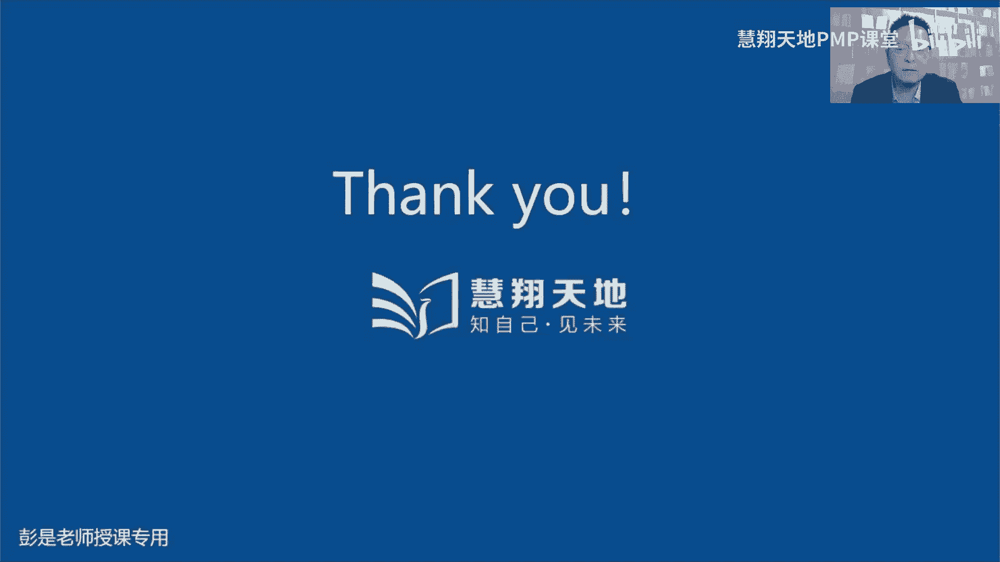
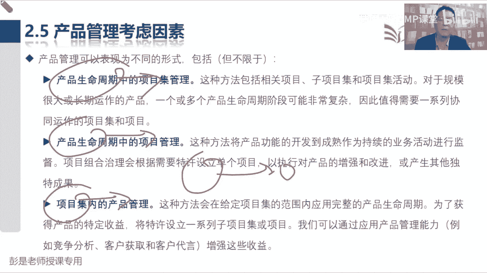
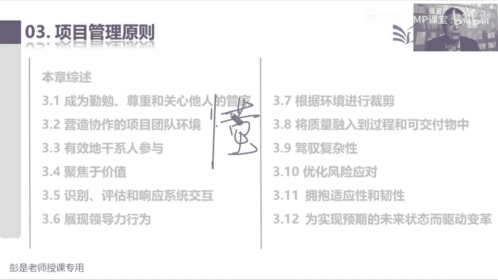
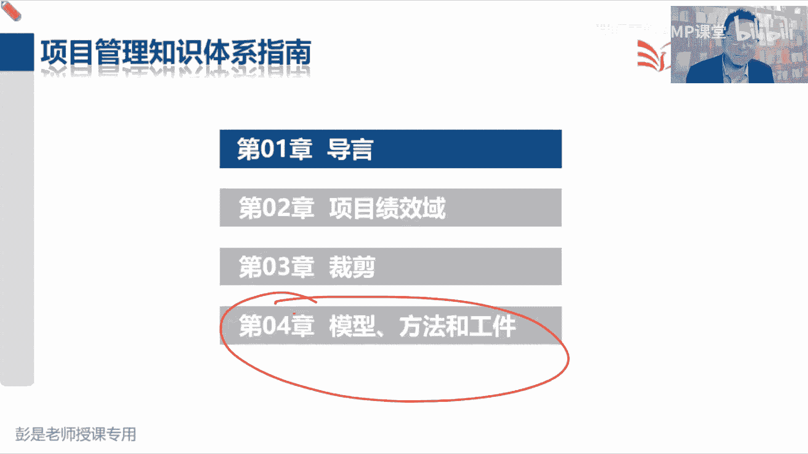

# 2024PMP认证考试课程（第六版+敏捷+第七版） - P15：第四部分 1-3 价值交付环境中的项目管理 - 慧翔天地PMP课堂 - BV1By411b7qM

那咱看看第七版到底说了啥，Pmbok，咱们那个官方教材，它的结构永远是这样的啊，一部分叫标准，一部分叫指南，标准是经过ISO国际标准化组织认可的东西，那咱第一部分标准里面其实就是12个原则。

指南呢就是那八个级教育导研价值交付系统。

项目管理的原则，这是第一部分，第七版，第一部分内容叫项目管理的标准，分成这些内容啊，这部分内容刚才说了啊，相当于复习了非常非常快，导演后面复习的时候可以不看了，没什么东西告诉我们什么目的目标，然后呢。

说用这些东西帮助我们提高项目成功的可能性，1。2，关键术语稍稍有一点点东西了，第一个单词叫outcome，成果成果，这个我们之前讲啊，指导与管理项目工作，按照计划去干活，得到的可交付成果。

现在呢现在更倾向于把它什么呢，物化叫可交付物，deliverable物化，它说这是我们的可交付物，那可交付对用户到底有没有价值呢，就是效果好不好呢，哎所以现在更更凸显一个价值交互吧。

还记得那个需求跟踪矩阵吗，更凸显一个价值交付，所以又又又提了一个新词叫outcome，说呀某一个过程或项目最终结果或者是后果，后果再好理解一点，就叫效果，所以粗暴帮助大家带场景去理解这玩意儿啊。

比如说我感冒了，我想吃感冒药，我去商店买白加黑诶，人家把白加黑递到我手里，这就是我的可交付物，对不对，这是我的可交付这个东西对我来说诶，效果好不好呢，不知道，如果效果好诶，刚好让我症状得到缓解。

那说明得到了outcome吧，如果吃了半天没感觉没反应诶，说明这个东西没有效果，对不对，所以现在我们要关注关注啊，不是客户要啥就给啥，我们要去分析他的业务需求，耳熟不耳熟呢，分析他的业务需求。

他的业务是啥呀，他有什么问题呀，有什么痛点需要我们去帮助他去去解决呀，也就是人家到底为什么要这个东西，对不对，考虑到我们交付交付物对它的价值，更好的做到价值，交付敏捷那段就强调这个东西了吧，这么多需求。

我们要有一个专业的人士PO排排序，看看哪些需求优先交付，对能够满足用户的业务需要，能够帮助用户解决他业务中的这些问题呀，痛点呐，从而做到价值交付，哎，就这意思啊，这个单词了解就可以了吧。

咱们传统项目和敏捷项目，现在都在强调价值照顾，传统项目就是需求评估，商业论证，效益计划的制定出章程，然后咱收集需求，得到需求文件，然后接下来需求跟踪矩阵，对不对，需求文件是不是满足人家的业务需要呢。

来确保收集到的每个需求的有效性，然后呢再把需求和成果连连看，未来呢我们要跟踪成果的状态，完成了测试了，验收了，移交了，确保最后确保最后做到价值交付，对除了东西交给人以外，还要产生相应的效果。

所以再看后面这段文字就好理解了，说成果呀包括输出和弓箭，但通过聚焦开展项目所交付的收益和价值，从而使得成果具有更广泛的意图，这是最终的效果，对好这个单词有一点点印象就可以了啊，价值交互。

价值交互主打强调的就这个逻辑，那再往下没有新的单词了，项目组合知道了吧，不解释啊，讲过的内容全都不解释，项目及项目项目管理，项目经理不解释不解释，然后项目团队价值交付系统是什么玩意呢。

你看这些东西眼熟不眼熟，对对对，企业来说，第一天上课，目标愿景使命使命价值观，做好企业的战略规划，接下来就有了四大管理，四大管理方法，项目项目集呃项目和运营，项目集和项目组合，这四个玩意儿。

这四个玩意儿，再加上我们的产品管理，共同构成了价值交付系统，对不对，产品管理关注的是什么呢，只做好产品的规划和设计啊，所以在敏捷环境之中，敏捷环境之中强调的是，如果用户需求不太确定。

如果技术方案不太确定，那我们就要有一个专业的人士，去做好产品的高屋建理方面的规划和设计，产品的愿景，产品的路线图，产品的发布计划，并且呢随着我们可交付成果，可交付物的不断产出去分析诶。

要不要对未来的产品做调整，就像那个滑板车，自行车，摩托车，小汽车，以此类推吧，诶那这一大堆东西就共同构成了价值交付系统，因为我们自己的项目可能和产品相关吧，可能会和运营相关，对不对。

然后呢和其他项目存在的依赖关系，有了项目集，另外呢要做的事这么多，排排序，帮助我们更好地分配人财物，这项目组合这一大套东西，共同组成了组织里边的价值交付系统，再粗暴理解就是这些东西帮助企业赚钱呗。

对好那价值没什么可解释的啊。

那再往下本标准的受众，这都可以不干了，就是跟项目有关的人都可以看，对不对，好知道这段知道知道这段的意思就可以了啊，然后再往下就说到了，既然提到了。

第二部分呢就是价值交付系统，既然提到了价值交付，他就开始导出了这段内容，你看看目录创造价值，组织治理和项目有关的职能项，项目环境，产品管理要考虑的因素，好像没有什么新的东西啊。

所以后面复习的时候过一遍就完事儿了，车轱辘话来回说啊，第一创造价值，说项目存在于更大的系统之中，对不对，因为我们可能上面有项目集，项目组合，还有运营，还有什么组织过程，资产事业环境因素。

再往上就是企业行业对国家国际以此类推导，所以项目创造价值的方式，这都不念了吧，帮助企业带来各帮助企业带来各种各样的好处，创造产品啊，服务啊，成果啊，降本啊，增效啊，提高质量啊，以此类推。

这都了解就可以了吧，项目在帮助企业创造价值，从而让企业状态发生变化，从当前状态经历过渡状态，从而达到将来状态，那为什么有项目呢，可能因为各种各样的原因和理由哈，什么技术进步，法律要求，对不对。

相关干行需要以此类推啊，什么组织改革，各种各样的原因好，第一天上课都讲了，然后再往下说，我们可以通过各种各样的东西来，帮助企业创造价值，因为可以考虑项目啊，产品啊，运营啊，保拉共同构成的价值交互系统。

见过了吧，那再往下就是说诶，说显示了价值交付系统的实力，它有两个项目组合，它们包含了多个项目和项目集，咱们第一天上课说的那个说有的项目独立存在，它它孤立的存在，有的项目之间存在着关联关系。

把它扔到项目基地，然后呢有的项目集太大了，拆成子项目集，另外呢有的事情和企业的战略相匹配，把它放到项目组合里，这张图和那张图一模一样，就是换了个角度，就是换了个角度啊，我们公司有两条事业事业事业线。

一条做新能源汽车，冰箱彩电空调沙发，一条线坐摩托车好，这是我们的两条战列线，那接下来，我们把符合战略的东西放到这个圈圈里，这条线是做新能源，这条线是坐摩托车，以此类推了吧，这都是复习啊，没有新的知识点。

好文字全都不念了，然后再往下这张图是这两个东西，敢不敢猜，价值交付系统是组织内部环境的一部分，在环境受政策程序，方法论框架，治理结构等制约，内部环境存在于更大的外部环境因素之中，包括经济竞争环境。

法律限制等等，嘿一对好朋友，事业环境因素和组织过剩资产，事业环境因素分成外部因素，内部因素，组织过程，资产分成我们的过程，政策程序，还有各种各样的历史资料库，对不对，这段文字和那个东西一模一样啊。

听听就可以了吧，好然后再往下说，价值交付系统，帮助我们创造产出成果的可交付物，就是以前的叫可交付成果，考试的时候，现在可交付成果可交付，不用那么严谨的去区分它啊，然后呢最后我们要关注最后带来的效果。

刚才说过了，然后信息流见见没见过那个奥迪四个圈啊，OP m那张图还有印象吗，说领导定战略，根据战略，我们对项目组合的内容做出相应的调整，我们不做，不做摩托车了，做新能源。

然后把摩托车相关的项目都给他推出去，把和新能源相关的项目扔进去，再排排序，合理的分配人财物，那我们关注的是A我们的项目啊，项目集啊，创造的产品服务，或者我真的帮助企业带来了价值吗，所以他要去分析。

哎我们这个项目组合管的到位不到位，对不对，看看是不是好钢用在了刀刃上，对不对，那项目和项目集呢，创造的产品服务或成果运营啊，你这东西卖的出去，卖不出去啊，所以他要根据运营的反馈来分分析。

验证有没有实现目标效益，那项目和项目及帮助企业创造价值，运营呢还要去分析啊，运营还要去分析啊，我们这个东西卖不动，要不要对战略做调整呢，就这个道理吧，好这段没有新的知识点，听一听就可以了。

商业环境会发生变化，出现影响企业的因素，我们不得不启动项目去进行应对，从而帮助企业创造价值，再通过运营想办法实现这个价值，那运营的过程中发现这个价值实现不了，我们再找高层，要不要考虑要不要调战略。

车轱辘话来回说好，然后2。2组织治理系统，这里边没东西啊，想看就看，不想看可以不看了吧，组织治理，组织治理还记得是什么东西吗，咱说到组织治理啊，项目治理呀，这玩意约等于这个权力的分配吧，定游戏规则。

组织架构啊，流程啊，政策呀这些东西啊，这段文字可以不看了，那2。3还是值得看一遍的啊，那和项目有关的职能，大家后面复习的时候，也像也像现在讲课的方式是一样的啊，看看这些角色能不能想到什么。

想到什么就可以了，好说有些项目受益于去中心化的协调，用这种协调方式，项目团队成员会进行自组织和自管理，这是啥敏捷对对，敏捷团队不太多，九个人左右，大家没有领导啊，我们是一个服务员啊。

然后PO你干你的开发团队完成关注怎么交付，PO关注做什么事情诶对不，这种我们要打，想办法想办法打造一个成熟的自组织团队，再想话前面讲过的讲的那个组织架构，什么职能型弱矩阵那一段那个大表格。

第一行就叫简单简单型吧，对不对，去中心化的这种东西吧，说大家都是兄弟并肩的上啊，平起平坐呀，对不对，就这东西啊不行，而其他项目则受益于指定的项目经理，或类似的角色领导和指导，集中化协调。

这不是我们规划资源管理跟的事情吗，对不对，传统项目规划资源管理，我们要定组织架构，定REMRCI责任分配矩阵，对对定岗定编，然后再去想想这些人怎么配备，怎么招聘，怎么奖励，怎么遣散，以此类推，不行吧。

最后这两段话听完了之后呢，就变成人话，就是说啊人太多呀，需要需要分层级，需要分369等，咱就画组织架构，那有一些有一些多变的环境下敏捷这种项目啊，我们是打造小团队作战，对不对。

打造一个通才自主制跨职能的团队，这样的战无不胜啊，最后一节一总结，看情况好，后面的文字全都不念了，那再往下看看啊，具体的职能说231提供监督和协调，具有此职能的人员，通常精心安排项目工作。

帮助团队实现目标，包括领导规划，监督和控制活动，这活儿谁干的，项目经理就兵分两路了吧，兵分两路了吧，传统项目咱还是操碎了心，对不对，敏捷项目呢，我们可能就把这个什么规划执行监控的权利。

交给成熟的自组织团队了，然后呢我们变成服务型的领导，对不对，但是不管是敏捷项目还是还是传统项目，不管是敏捷项目还是传统项目啊，传统项目权力在咱手里，敏捷项目呢权利交给团队，但是呢不管是传传统还是敏捷。

我们都是热心的服务员，帮助指导辅导启发，关心员工的成长，关心员员工的发展，想办法提高员工的能力，这个大道理是一样的，他最终的底层逻辑就是那个塔克曼，对不对，不管是什么模式。

总之啊我想办法打造一个成熟的团队，咱就可以放权了，对不对，把这种决策权交易到团队手里，由团队自行完成工作的规划，执行控制，咱就转变工作重心，关注员工的成长发展，什么环境条件，以此类推了啊。

好了解就可以了吧，现在教材上这部分内容全都没什么需要背的啊，今天的课主要是说这个东西是新的，之前没讲过的，大家再重点标一标，剩下的内容都是通过阅读，通过阅读更好的去回忆之前讲的那些大道理。

这是非常非常强调的一些新的价值观，不是新的价值观，新的一些就是一些比较重要的，重要的这个思路好，知道了，这就不念了，然后提出目标和反馈，具有此职能的人员，提供客户和最终用户的观点见解和清晰指导，诶。

谁是客户的代言人，谁是客户的代言人呐，说这东西呀，他去反正我也我也不懂，他有这个专业知识，这事都找他呀，产品负责人吧，MA错PO啊，对PO是代言人呐，他代表他去他去了，找他去搞，搞定客户，搞定最终用户。

他来根据客户和用户的反馈去分析啊，我们这个产品到底往哪走啊，他去搞需求啊，对不对，好知道这个意思啊，嗯所以你看后面的文字也需要读吗，需要读吗，说项项目需要客户什么什么，对这啦做做出明确指导，对不对。

这肯定肯定没啥可写的导，那在适应型和混合型项目之中，项目更需要获得持续反馈，对不对，适应型不就是敏捷吗，我们需要小步快跑，小步快跑，进短进，周期越短越好，尽快的获得客户的反馈，因为我们不确定。

因为我们要不断的探索呀，对不对，所以呢，希望希望客户能够持续地参与到项目之中，从而让客户来体验获得客户的反馈，对那你要想让或要想获得客户真实的反馈，就一定要可以使用，因为不可用的东西。

这个体验肯定就不对了，以此类推了吧，好引导和支持，说引导和支持可能和协监督协调相关，具体取决于项目性质，这项工作涉及鼓励什么协作，什么责任感，什么有助于解决冲突，什么引导，还有什么克服学习适应。

改进支持，这是想到谁全都是这种辅助型的用词吧，对什么鼓励呀，什么帮助大家成长啊，让大家有主人翁意识啊，让大家互相协作呀，教大家怎么解决冲突啊，怎么对事不对人，那就是服务型领导，就是服务型领导啊。

对我们需要这么一个人来给大家干这个事儿啊，好知道意思够了，那再往下开展工作并洞察贡献，这一群人会提供我们生产产品和实现项目成果，所需的知识技能和经验，可以在项目持持续时间干活干活干活，这是谁呢。

然后什么集中干办公虚拟团队诶，干活儿干活儿，然后从各个职能过来的人干活，这是我们的团队成员吧，好吃了啊，不念了，运用专业知识，这个前面是用知识干活，对不对，现在呢不一样了吧，专业知识专业知识。

专业的事找专业的人，对不对，专家呀，专家专家专家专家判断这个东西无处不在，对不对，好，所以自由取此职能作人员会提供项目主题，相关的知识愿景和专业知识，他给我们提出合理化的建议和建议，对我们支持。

以此类推，不念了啊，那再往下提供业务方向和洞察，具有此职能的人员会指导并澄清项目方向，或者是产品成果，它涉及根据商业价值，看到这句话能不能猜出来了，传统项目和敏捷项目好像不太一样了吧。

传统项目我们更愿意遵循发起人，对不对，但是敏捷项目的发起人啊，发起人弱化了没提，对不对，没提到这个角色，敏捷项目需不需要有发起人，那实际工作中是实实际工作中是有的啊，但是我们不提不提。

不代表着说不能有啊，可以有，但是最终还是PO来，帮助我们做产品的规划和设计，对不对，就这道理啊，因为敏捷敏捷就更更适合于这种产品的创造，这种这种这种项目好，2。3。7，提供资源和方向，看看啊。

具有此职能的人员会推动项目的开展，这就更明确了吧，刚才那个也不一样啊，传统项目可能是发起人，敏捷项目可能是PO那现在呢推动项目发展，什么目标愿景，什么倡导者帮助我们决策资源职权。

提供我们完成项目所需要的什么资源资金，找高层沟通，然后确保实现，哎这很明确了吧，对不对，传统项目敏捷项目，敏捷项目虽然没提发情，但是也需要这么一个人呐，给我们提供完成项目所需要的资源资金，对不对。

好不念了，238维持治理治理这活儿一听谁干，履行治理职能的人，会批准并支持项目团队成员的提供的建议，什么改进什么战略商业目标什么什么，这一看就是领导，对不对，往天上看，有权利的人，权力大的人。

权力大的人才能够治理权力小的人吧，这才叫治理啊，好所以大概这八个只能看一遍，看一遍就可以啊，嗯那2。4项目环境这眼熟不眼熟，说项目在内部环境，外部环境这些东西可能对我们产生影响啊，包括什么呢。

过程资产治理文件，自己数据，资产知识资产，这都不新吧，按这不念了吧，设施基础就是组织过程，资产事业环境因素，什么资源可用性，员工能力，市场条件不念了啊，什么行业标准，法律法规，以此类推，就是组织过程。

资产和事业环境因素，这段不兴，最后2。5产品管理要考虑的因素，这咱这其实是不在咱考试范围之内的啊，不在咱考试范围之内，但是呢我们要了解项目和产品的关系，所以听一遍就可以了，那说巴罗拉巴拉拉产品管理。

超出了本标准的范围，但是呢我们要了解我们和产品的东西，产品的研发，引入市场，上升成熟衰退，退出市场，在产品全生命周期各个阶段之中，都可能有各种各样的项目，产品的研发，产品的升级，产品的更新，以此类推。

知道这个道理就可以了，然后这是产品全生命周期，指的是一个产品从引入成长，成熟衰退到最终退出，退出市场各个阶段的一系列阶段，好在每个阶段之中都可能有各种各样的项目，知道这个意思，OK了。

后面的文字啊就没啥可念的了，看看就可以了啊，想看就看，不想看可以不看了，各种可能性，产品生命周期可能有项目及产品，生命周期可能有项目，对不对，项目集里面又涉及到产品管理，项目也可能涉及到产品管理。

以此类推啊，它有各种各样的交集。

好这就是第二部分，那接下来第一部分。

项目管理标准的第三章12个原则，这是相对来说呀，相对来说不是新的知识点啊，重新把我们以前反复给大家讲的大道理，然后呢又重新重新分组总结，归纳了一下这部分内容，这部分内容其实啊。

字儿咱也不一个一个给大家念了，先给大家看着目录，跟着思路听一听，听一听，是不是都讲过了，3。1成为勤勉尊重和关心他人的管家，服务型领导，仆人式领导，管家式领导，就这东西吧，帮助大家创造环境，该帮的帮。

能不决策就不决策，对不对，然后呢就是指导辅导教育，启发癌，想办法让大家提升提升能力，想办法让大家走向成熟，就这意思啊，然后呢还有一个事是什么呢，什么人挡杀人，佛挡杀佛，帮助团队排除阻碍，那3。

2营造协作的项目团队环境，这不塔克曼吗，对不对，塔克曼那形成震荡规范，成熟成熟团队，他们就会很很开心，很happy的自己去协作了，刚才那个提供资源仔细看一看文字，对提供项目网提供项目，向公司去申请。

我们完成项目所需要的资源和资金，在敏捷环境之中也需要啊，让公司投入人财物做事情啊，就这么简单一个道理啊，跟不上的同学一定去复听之前的精讲课，全都讲过了，咱现在没必要花特别多的时间。

把之前旧的知识点翻过来再讲，不然今天这课就没有意义了，对不对，所以还是一开始上课那句话呀，如果之前的基础打的不太好的同学，还是要先把先把那次之前的课给他基础打好啊，好那拐弯拐回来。

后边其他乱七八糟的问题我就不打断了啊，3。2，营造协作的项目团队环环境不就是塔克曼吗，对形成震荡规范，成熟解散，形成震荡前，形成震荡规范，前三个阶段，大家大家可能配合起来没有，那么绩效绩效不高啊。

士气不太好啊，我们要该指导的指导，该教的教的，不该该该让他们参与决策，参与决策，不断的想办法提高提高团队的能力，从而让团队能够变成一个成熟的自主，自主制团队，这不就这意思吗，对不对。

好第三个有效的干型人参与是说什么呢，识别干系人，规划，干系人参与管理，干系人参与监督，干型人参与，我们要找到这些人，然后对这些人做分析，做评估，分析他们的权利作用影响力，然后人分369等。

然后呢去看看他们对项目的参与度对不对，分析我们期望的参与度，定策略，想办法引导干系人持续地参与到项目之中，哎以此类推，不新呐，3。4，聚焦于价值，刚讲完对需求跟踪矩阵，我们传统项目关注价值交付。

敏捷项目更关注价值交付了，所以需要持续的排序，就是那个产品代办事项细化会梳理，会分析什么东西对客户价值高，什么东西价值低，以此类推，对不对，那3。5识别评估和响应系统。

交互系统交互系统交互牵一发动全身呐，传统项目我们范围进度成本质量资源沟通，采购干型这些东西牵一发动全身，这不是复杂吗，对不对，范围一变就会引起进度，成本质量资源全都发生变化呀。

那我们要能够驾驭驾驭这些东西啊，把它给它梳理清楚，那敏捷项目也如此吧，我们有这么多大需求池，小区周池，然后成果，然后这些之间存在着千丝万缕的关联关系，再要把它给识别出来，那3。6展现领导力行为。

就是说啊传统项目我们用权力管项目，管项目，大家全用权力管员工，人家可能不开心，不满意，没有主人翁意识，对不对，被动，那现在更关注的是什么呢，我们要兄弟们跟我上，对不对，以身作则，身先制足。

起到模范带头作用，让大家有动力，有意愿知道我们朝着什么方向去努力啊，对好不兴，3。7，根据项目环境做裁剪，这是呢每个项目有每个项目的独特性，所以呢该预测的就预测，该敏捷的就敏捷，这些过管理过程。

输入输出工具基础，我们要做出相应的调整，敏捷呢给我们讲了什么SQUAM呀，看板啊，极限编程啊，这些方法，这些方法也不能也不能一成不变的用到，用到工作之中，一定要根据我们项目的实际情况，去进行这种个性化。

个性化的调整，就是裁剪吧，好3。8，将质量融入到过程和可交付物之中，这不是质量那一章吗，我们不仅仅关注结果的质量，还要关注过程的质量，所以呢控制质量对过程呢就是管理质量，关注的质量，保证过程。

改进产品设计，这样呢过程好，结果好，过程好，结果好，让我们的过程更标准，更规范，是为了得到，为了更好的得到结果，这就是质量那一章说的东西，3。9呢加与复杂性，驾驭复杂性，其实啊看起来挺复杂。

其实呢一点也不复杂，这怎么有效的驾驭复杂性呢，就是事呗事儿复杂，人复杂，事而复杂，怎么怎么驾驭呢，分解呀，对分解天下大势，合久必分，分久必合，分久必合，分解哇，外面这么吵。

分解分解分解可以有效的降低事物的复杂程度，就像让咱听过的那个的飞机，那个是WBS飞机，这么复杂，拆呗发动机对吧，什么机身，什么起落架，什么什么翅膀，尾翼拆拆拆，总能拆到比较简单的这么一个颗粒度。

所以就有了我们传统项目WBS，对对，最上面那是主要成果，下面一大堆控制账户，最底层的是工作包，再往下分解就得到了活动，未来呢根据活动估算所需要的资源时间成本，这不是就不复杂了吗，对不。

那敏捷项目怎么驾驭这个事情的复杂性呢，分解呀，巨大个儿的故事叫特征，但是巨大故巨大个儿的故事叫史诗，小一点的叫特征，再小一点的叫用户故事，保持到合适的颗粒度，最理想的模式是这个用户故事。

每天每天一天就差不多把它做完，这样呢我们每天都有成果，对不对，那再往下就是我们完成这些用户故事，所需要开展的传统项目叫活动，敏捷项目呢叫任务，这不是可以驾驭复杂性了吗，那人怎么驾驭呢。

人呐人的心海底针呐，所以不好驾驭，对不对，传统项目呢就是OBS我们设组织架构，这人多了不就好管了吗，但是敏捷里面啊没那么多人，九个人左右啊，哎为什么要保持小小团队作战呢，这不是也是降低复杂性嘛，对不对。

细化到一个合适合适我们管控的颗粒度就可以，剩下的就是需要研究人的心理了，所以模型那一段会会学到一些新的知识点啊，什么塔克曼那些东西啊，不是马斯洛需求层次，赫兹伯格那堆东西。

所以模型那段有一点点新的知识点，好知道这个意思啊，那3。10是干嘛呢，优化风险应对哦，这女老师上课说了，风险管理，风险管理对不对，规划风险识别，风险定性分析，定量分析，排排序，规划风险应对。

实施风险应对，最后还要定期的看看风险有没有发生变化，看看应对措施好使不好使，然后呢持续的改进我们的风险管理过程好不行，3。11，拥抱适应性和韧性，适应性适应性适应性是什么玩意呢，这有的人身体素质好。

到哪都能适应，对不对，有的人身体素质不太好，可能就适应不了啊，诶他关注的是能力，我们团队能力越强，适应性不就越强吗，尤其是在这种多变的环境下，那怎么办呢，我们要打造一个成熟的跨职能的自组织的团队。

对还记得那句话吗，成我们要想办法提高团队的能力，即使离职在所不惜呀，没关系，对不好，这样呢我们有这么牛这么牛的一个团队，他们就战无不胜，攻无不克，他们可以更好的适应各种各样的变化，因为能力强。

因为工作模式工作模式轻，对不对，轻量级的好，那怎么提高韧性呢，这是储备，就是储备呀，从家到公司需要八分，需要一个小时，我储备个四个小时，这地震我都能到公司，就这道理吧，应急储备管理储备，这样呢。

面对这种突发事件，面对这种意外，我们仍然仍然有缓冲的余地，对不对对，达不到这例子啊，所以听完了是不是发现没有新的东西，3。12为实现预期的未来状态而驱动变革，这是个新单词，但实际上新吗不新啊。

咱项目内的那个小的东西，小的改变叫变更，那变革是什么呢，改革啊，改革开放啊，商鞅变法呀，就这东西吧，因为对企业来说，我们启动项目还记得那个三态嘛，不就这东西吗，启动项目启动项目。

把企业从当前状态经历过渡状态，达到将来状态，这对企业来说对对，其实就是变更，但是呢咱在形容这个东西规模大一点，所以叫变革，那对企业来说发生了变化，发生了变化，人呢又都懒，有惰性，不习惯变对吧。

公司规定九点钟上班，过两天发通知，08：30上班当天第一反应讨厌神经病，恶心不喜欢变更，所以呢面对着这种变更，我们或多或少都有一些负面情绪对吧，焦虑啊，不安呐，惶恐啊，抵触啊，大家看看你身边的同事。

想一想你工作中的职场都这个道理吧，公司一旦有了一些调整，哎这下面风言风语啊就全都出来了，对不对，什么嘲讽啊，看热闹啊，隔岸观火呀，都希望啊挑挑这个事儿的人，主导这个事情的人啊，看等着看人笑话吧。

唉都希望他把这个活干砸了，然后呢给他一大哄，就这道理啊，就是因就是因为人有这么多的婴儿面，所以呢面对着这种变革，那作为这个项目的领导者，我们也要做好心理准备，想办法想办法降低大家对项目的这种抵触情绪。

他提着根儿不就是干型管理吗，识别干系人人分369等，然后分析他们的权利作用，影响力排排序，再规划干系人参与，那我们要找到这些抵触我们的人，反对我们的人，对不对，然后管理一下干行参与啊，根据我们的策略。

持续的了解大家的需求啊，大家的期望啊，解决问题呀，处理冲突啊，让大家尽量的尽量的，尽量的把这种负面的周期给它最小化，从而呢渐渐的逐渐的逐渐的经历过渡期，接接受这个变革，好这12个原则。

听完了之后发现没什么新的东西啊，所以这段文字呢后面大家复习的时候，复习的时候看一遍就可以了，它没有逻辑，不要硬背逻辑啊，哪有什么逻辑啊，就是告诉你一些原则对吧，就晚上聚餐吃好喝好玩好，有你说有逻辑吗。

没有逻辑没有逻辑啊，吃好喝好玩好，注意安全，注意安全啊，别超支别超支啊，马上五一了，嗯没逻辑没逻辑，不要硬句去梳理逻辑啊，这东西梳理完逻辑也没用，没用啊，就是告诉你一些原什么叫原则大方向呗。

好这就是关于这12个原则，所以相当于复习对吧，没有新的东西啊，那再往下说，这个职业道德四个单词听过吧，责任尊重公正，诚实告诉我们，作为出色的卓卓卓越的领导者，作为项目经理第一。

我们有责任有义务积极主动完成项目中，解决项目中的各种各样的问题，迎接各种各样的挑战，人挡杀人，佛挡杀佛，那主要的是解决什么东西呢，四大恶人呢变更问题，风险冲突，对不对啊，然后呢主动主动主动，不要有问题。

装作看不见，对不对，不要有冲突，装作看不见，不要不要没有风险意识，对不要不要遇到问题就逃避，不要遇到变更就觉得很头疼，要想考虑这么多因素，不管了，随便了诶，那尊重呢就是众生平等，对事不对人。

每个人都有每个人的价值，每个人都有每个人的作用，呃我们认可一可尊重一大家的知识经验，诀窍技巧，所以呢希望全员参与到项目的计划的制定之中，给我们提出合理化的建议和见解，以此类推了吧，然后公平不解释了。

诚实不解释了，纯粹的字面意思啊，这四个东西还是考点，但是呢考试的时候大家道德水准应该都不错了，到模考你多做做题，然后课上的题也做过几道题了吧，品一品品一品，道德水准最高，天花板是什么。

是什么意思就可以了啊，好再往下说，这12个原则，一个一个带着大家快速过一遍，它的结构都是一样的，所以呀我们这个先说一说这个原则是什么玩意，然后呢大概细化一下，说我们有什么职责，什么正直关心可信合规。

你说这些单词需要解释吗，我是个正直的人对吧，看到一些看到一些不好的事情，我就会我就会指出我的，指出他们的缺陷，差距和不足就不念了啊，好就找新的知识点就就这么学了，讲过的内容大大面上给大家回归回顾。

回顾小细节咱就不解释了，都讲过了，好管家事不解释了，什么道德观，什么战略，什么材料，什么内容，干系人原则诚信，这解释吗，关心我们关心员工的成长，关心员工的发展，因为啊每个人的能力啊，水平啊不行啊。

不不一样啊，新员工我们该帮助的帮助该指导的指导，因为他啥也不懂，对不以此类推，关心一切哎，然后可信，这都不念了吧，合规合规，这是法律法规，这不不解释了吧，好所以这就是管家式服务，就讲完了。

就这些东西车轱辘话来回说话，营造协作的团队环境，领导协协作的项目环境，说呀什么本地什么本地文化就是黑化呗，对不对，不同人群，不同团队，他有不同的文化，我们要想办法想办法消除这种文化差异。

让大家让大家士气达到最高，尽量的尽量的帮助大家克度过这段磨合期，减少冲突，让大家学会相互信任，相互理解，相互包容，团结友爱，众志成城好，这就是那段那段东西啊，这个单词这个单词是新的单词。

但旧的知识点看看这是什么东西啊，团队共识是一套行为限制和工作规范，由团队制定，并通过个人和团队的承诺来他什么形成合作，确保遵守什么，不会不念了吧，哎所以大家后面复习的时候就找到这个技巧啊。

就找到这个技巧，就是蹦出来一些新的单词，旧酒装新瓶，然后呢咱标一标标一标，稍稍要考试的时候，看到这个术语能够反应过来他是个什么东西，就是团队章程基本规则，还有嘉伟同学说的工作协议，对不对，工作协议。

这是这不是咱达成的共识吗，对不对，马上过五一了，我我跟我媳妇儿达成了工作协议，我负责扫地，她负责擦桌子，我负责擦玻璃，这不是工作协议吗，这不是行为准则吗，对不对，以此类推啊，好对不到。

前两天群里面那道题叫什么来着，我记不住啊，说咱约定好了，约定好了，什么什么什么虚故故事，故事达到什么条件，就认为是DOR共识，达到什么条件，就认为是DOD整那些东西吧，这不是大家达成的共识吗。

共识不就是协议吗，好所以它很多很多相似的词，看他眼熟就够了啊，那再往下组织结构，这不解释了吧，看到他选到什么层级型，矩阵型文本型，嘿不念了啊，过程更不解释了，然后职权担责职责，这需要解释吗，没什么啊。

确保每一行只有一个A，那个A是什么呢，Accountable，背锅背锅侠，任何一个事情只有一个A，只有一个A，只有一个A，避免三个和尚没水喝，任何一个层级只有一个一把手哎，就这道理啊。

这是重要的重要的考点，其他的有几个咱不知道，随便了咳好，后面全都是讲过的知识点，说什么职责啊，共同就你看这种东西需要解释么，共同负责，这是我们是一条线上的蚂蚱，大家都上了贼船了，谁也跑不了，对不对。

所以呢我们是朝着一个目标，大家一起努力，一起加油吧，对不对，不要不要相互相互一一，有问题就解决，提出问题的人，我们解决问题对事不对人，对不对，消除我们这种主观的主观的偏见，不要一想遇到问题就说张三。

你神经病，李四宁怎么这么笨呐，这话这话都不要说，对不对，就事论事呗，好没啥解释的啊，复习的时候看一遍就可以，那3。3有效的干性参与，这还不抢了吧，识别规划，干洗人可能有同学。

有同学可能课听完课印象还不太深呢，再说一遍吧，干系人就是相关方，他俩是一个意思，一个意思一个意思，英文都是stakeholder，就是不同版本用词翻译成中文用词不同，仅此而已，以前还叫利害关系者。

因为敏捷的题啊，有的题是港澳台地区翻译出来的啊，有时候可能还会看到这个词啊，利益干系，利益相关者，利益攸关者，以此类推，老，回音我也不知道啊，我今儿没有回音呐，可能是家徒四壁吧，好换个设备试一试。

那这不解释了啊，这都不解释了，都见过了成果，文化收益实现，这都见过了，不念了，好，下班了下班了啊，什么规划干型，啥识别干型，规划干型参与那3。4聚焦于价值，你只要看到目录，大概能猜到这一章在说啥。

这一小节在说啥，其实文字就都可以不看了，好价值，什么什么收益，什么创造价值，预期效益不是为了名，就是为了利，写错字了啊，听就行了，不是为了名，就是为了利，有形价值，无形价值不就在说这些东西吗。

好所以价值什么什么成果，许多项目都基于商业论证，然后呢什么启动项目需求评估，商业论证，效益计划的制定，项目结束以后不一定赚钱的，可能还需要运营一段时间了，所以呢我们要把这个什么时间赚钱。

就是效益管理计划写清楚啊，还然后呢作为项目的项目经理啊，我们还要了解那些财务知识啊，对不对，那些相关的术语，回收期呀，回报率啊，效益成本比呀，净现值啊，知道他们是什么东西好，这段文字其实就是那些东西啊。

商业需要就是我们那个需求评估啊，人家要啥，对不对，为什么为什么为什么要做这个项目，他的动机，他的目的是啥，然后什么项目理由，那人家要啥，我们怎为什么要做这个事呢，能给我们企业带来什么价值呢，以此类推。

这都是看看看就可以了，都反复讲了，好不念了啊，说什么3。5评估识别评估响应系统，交互刚才也说了吧，牵一发动全身呐，好，所以项目是由多个相互依赖，相互什么活动力组成的一个系统，因为我们有范围进度成本。

让资源沟通风险，采购干系人管理工作，还有启动规划执行监控收尾，而敏捷里边呢大需求池，小需求池成果还有那么多事件对，还有什么各种什么规划会，嘿就是他们组成了一个系统，那我们要了解这些东西到底是如何交互的。

它们之间千丝万缕的管理关系，然后呢系统还会不断变化，为什么呢，因为我们的外部环境可能也会随随时发生变化，对多变环境下的项目到底怎么管，我们要有这个意识好，不然后再往下就再说这些东西了，系统前一八动全身。

然后我们要考虑什么时序啊，内外部环境的变化呀，是不是要调整范围，进度成本质量资源呢，以此类推，后面文字没什么解释的了啊，说我们要对什么领域大局观，什么同理心，这都想看就看，不想看，可以不看了，3。6呢。

展现领导力行为，这需要讲吗，不需要讲，管理和领导不一样，管理是用权力命令对方去干活，兄弟们给我上领导力呢是带领大家，所以呢，我们要热情对，要主动，有格局，大局观啥都懂好，所以项目的领导力有独特的要求。

那我们需要什么什么不念了吧，优先什么，就这些词啊，什么激励啊，热情啊，领导力风格呀，放任呐，交易啊，服务啊，改革呀，魅力呀，总之综合运用这些领导力风格，让大家持续的持续的有动力，愿意跟着你往前冲，嘶。

好纯子不念了啊，太多了，全都是之前我们见过的东西，并且呢原则都是虚的，原则都是虚的啊，就像刚才同学说，听完没逻辑啊，就是虚的，你看随便找几个所谓为项目寻求资源和支持，我们找发起任务。

给我们提供完成项目所需要的资源资金，对不对，产品项目成果激励性愿景，不是给大家描述一个美好的蓝图，项目章程，写情书，产品愿景说明白，让大家知道我们要做什么事，让团队聚焦于商定的目标，才目标不一不一致。

咱对不对，目标不一致，劲儿不往一地使，这也不行啊，咱都是一条线上的蚂蚱呀，都是反复讲的这些东西啊，都是大道理原则，就是大道理听一听就可以了，好然后后面文字全都不念了啊，3。7裁剪都可以不看了，因为裁剪。

咱们前面上课的时候也说过这个东西呀，知道第一什么是裁剪，知道第二个为什么要裁剪就够了，到底怎么做裁剪呢，这一定是具体情况具体分析，这不在咱考试的范畴范畴之内的好，所以看看什么是裁剪呢，就是量体裁衣。

对症下药，对不对，对，我们的过程输入输出，弓箭技术，会议事件什么的，做调整，做选择，因为独特性搞定好，所以裁剪的定义什么什么过程方法，工件这全都不念了，那3。8也不讲，不用讲了吧，刚才回过了吧。

规划质量管理，质量控制，质量指导与管理，项目工作确认范围，这五个圈一画出来就想到质量的五种水平，对最low的客户去发现，我们让客户来看看有没有问题，好一点的，我们站好最后一班岗，做指控，再好一点的。

我们关注适中，质保过程改进再好一点的，好的质量是规划和设计出来的，最后呢把它变成文化，这样呢从而做到从而做到我们能够满足要求，适合使用质量的适应性好，今天好像有同学在群里面发过那道题啊。

质量的适用性符合要求，适合使用就可以了，那后面这堆文字全都不念了，什么绩效一致性可靠性，这都不需要去背的啊，都不用背的，就想到质量的五种水平，其实这个这这段内容就过去了，说什么提高成本就提高效率。

这都不念了，369驾驭复杂性，就像他刚才那个场景分解分解天下大势，合久必分，一分开就好好管理了，对不对，因为事和人都是复杂的东西，那看看这段文字啊，说复杂性是由于人人类行为。

系统行为和模糊性而难以管理的，项目和管理特征，就是人不好管，复杂事情不好管，因为牵一发动全身，所以复杂好，那再往下又开始说人类行为，人类行为是人的行为，举止态度和经验的相互作用，主要因素引入。

巴拉巴巴拉巴巴拉说，不同时区不同语言不同文化，所以复杂对不对，大家就认真观察一下你的工作群，或者咱学习的微信群，对说吧，说说难听点啊，就是什么人都有，这不就复杂吗，对因为大家的背景不同。

不代表就说不好啊，好啊，因为大家背的背景不同，专业不同，三观不同，对不对，所以呢我们尊重大家，希望大家能够表达出你的主张见解观点，建议意见，以此类推，这样呢能够对我们的其他的事情形成启发，对不对。

好系统行为呢就是牵一发动全身，不解释了一大堆零件，那不确定性和模糊性风险，那张往这一塞，对不对，这也复杂呀，嗯新冠出出现之前，我们不知道它是个什么东西，新冠刚出来的时候不知道他是个什么东西。

这不是复杂吗，因为没有认知，对不对，导理梳梳理不明白，不知道这个东西怎么治疗，怎么防止它扩散得怎么，怎么来降低对我们产生的影响，啥都不知道，那就需要探索，那就需要探索，这不是敏捷吗，迭代增量，迭代增量。

不断的去进行这种技术方案的探索，对怎么治疗啊，怎么防御呀，以此类推，好不念了啊，技术创新刚说过啊，到底怎么治疗新冠呢，那不断的探索呗，好再往下优化风险应对，这是在说风险那一章的大道理了，威胁啊。

不好的东西叫威胁，好的东西叫机会，不好的东西让它概率影响下去，好的东西让它概率会影响上来，那怎么搞呢，所以我们才要识别，然后定性分析，定量分析，规划应对，实施应对，这段没有新的知识点，这就不念了。

咳然后适应性和韧性这两个单词，之前教材里面没有，但是呢大概粗暴理解啊，一个是能力，一个是储备能力强，适应性就好，对不对，储备多，韧性就强，我100万的项目储备个100个亿，应急储备管理储备哇。

这战无不胜，知道这意思啊，好所以适应性是指应对不断变化情形的能力，所以我们才要轻规划，对不对，重探索，轻文岗，重实践，我们轻装上阵呐，对轻装上阵敏捷呗，对这些过程啊，该精简的精简。

该优化的优化这些文档资料，文山会汇海，该精简，该简洁的简洁，该该轻装上阵，轻装上阵，这样我们才能够更好的去适应变化，不然花那么多的时间去做计划，做计划，计划定好了之后又变了，这不是代价高嘛，对不对。

还不如啊少花点时间在规划，在文档上，多花点时间去探索，尽早的把这个东西做出来，从而获得客户的反馈，那在这种工作模式下，如果如果能力不强，如果能力不强，很难敏捷呀，所以我们需要打造一个成熟的自组织的。

跨职能的这样一个团队，最好呢大家都是什么IT派，破数字，最好都是通才，这样才能够更好的更好的适应变化，所以从我们办事的方法和我们的人，如果这个能力能力都达到一定的水准，就可以更好的适应这种多变的环境。

而韧性呢是指吸收冲击的能力，和或者是从挫折或失败中快速恢复的能力，其实就是储备对吧，储备越多，储备越多，吸收冲击的能力不就越强吗，你就想你那个汽车汽车对吧，有的车一撞就散了。

好我前面弄个100米的缓冲区，唉随便撞啊，没关系啊，撞不动啊，这不是储备吗，就这意思啊，好这两个单词不太需要去背它啊，那再往下就是说项目很少会按照最初的计划，我们会受到各种各样的影响，那我们要考虑啊。

什么什么不念了吧，然后什么看看都讲过了吧，较短的反馈循环，持续学习和改进，然后跨宽泛技能破书的通才对，然后呢定期检查改进，就PDC的那个A呗，只不过在敏捷里边。

我们叫那个回顾会retrospective，多样化的项目团队获得广泛的经验，我们跨职能的跨职能的团队呀，大家都有工作，完成工作所需要的知识技能啊，开放和透明的规划，透明沟通，敏捷说了吧。

让大家及时的发现问题，然后小规模的原型阀，因为规模越小啊，规模越小啊，试错的代价越低啊，spec试一试，就这东西吧，允许运用运用新的思考方式和工作方式的能力，咱不管那你们成熟了对不对。

我们给你们提出我们合理化的建议和见解，然后指导辅导启发，就这以此类推啊，允许大家去探索，最后呢我们追求平稳的速度，不念了吧，我们追求的是持续的稳定的输出好，这都是前面讲过的知识点啊。

然后不没必要一个一个念了吧，什么开放式的对话，对事不对人，合作面对问题，解决问题，对不对，不要藏着掖着，具有宽泛的技能组合来跨职能，跨职能团队对过去相同或类似工作中，或所获得学习成果的能力理解力。

要不断的吃一堑长一智啊，以史为鉴呐，总结经验教训呢，复盘呢欲做多重潜大情景，并未多种可能的情况，做好准备的能力和意愿，这不是叔叔在说的，是考虑周全，对不对，考虑周全，考虑周全好。

将角色推卸到最后责任时刻，这是一句新的话术啊，但其实呢大家都好理解，将决策推迟到最后，责任时刻变成人话是什么意思呢，比如说呀，打个比方啊，我五一打算出去玩儿，然后呢今天哇今天今天29号啊，明天退票的话。

明天退票的话啊，就收退票费了，明天退票就收退票费了，那我现在还没想好到底去不去呢，但是呢我已经把票买了，我已经把票买了，嘿那什么时候什么时候我决策什么，最晚最晚最晚什么时候就要做决策了呢。

不就是今天晚上吗，到了明天就有损失了吧，嘿29号啊，28号啊，27号啊，到底去不去，我还没想好呢对吧，这种多变的环境下，我也不知道27号这么早做决策，28号做决策也行，29号做决策也行，那我就推到29。

不然呢明天就开始收费了，嘿佳伟同学理解能力超赞吧，寒假作业不到最后一天不写，到最后一天赶紧写啊，明天明天明天再没写完，老师该批评了，就这个东西啊，那什么情况下要考虑这个啊，什么情况下，刚才说了吧。

变化多敏捷呀，在这种变化多的环境下，我们要考虑这种决策方法，在变化多的环境下，我们要考虑这种决策方法，如果没有变数，没有变数，那就不需要这么这么费劲了吧，记住啊，就像刚才那个退票哎呀。

张三去张三去我就去，但是呢张三他现在态度不明确，他没说去，也没说不去，那你说我这个票到底退不退呢，27号可以不退，28号可以不退，29号诶，明天要收钱了，那我这是最晚最晚最晚需要做决策的时间点。

因为形式不明朗，对不对，因为形势并不明不明朗，好过了，明天过了，今天明天再退票就有损失了，那我今天高低要做决策了，就这道理吧，咳和拖延症听起来异曲同工啊，但不是一回事，拖延症提醒我们呢不要拖，不要拖。

赶早不赶晚，赶早不赶晚啊，那是明确的工作呀，但是不确定的工作你要做决策的时候怎么办呢，哎就往后拖，直到最后会产生损失之前就这道理啊啊啊，他就是敏捷环境之中，敏捷环境之中干这个事儿的咳。

哎连不通的同学帮大家总结了，其实就是留有余地，对不对，直到损失之前再做决策就可以了，好管理层支持什么平稳，这没啥可说的了啊，那再往下说预预期的成果，而非交付，能够促进解决解决方案。

什么替代方案比原原始定义替代方案不减了吧，就是方法总比问题多，方法总比困难多，我们要不要把鸡蛋放到一个篮子里，备选方案分析呀，时时刻刻提醒我们，解决问题的方法，千千万对，不要不要走，不要钻牛角尖好。

这都没啥可念的了，最后什么计划意外什么什么，这不是增增加优势，希望不念了吧，看看就可以了啊，3。12呢，刚才那个道理一讲一讲完，这段文字也是看一遍就完事了，是说变格变格大家不喜欢，所以有挑战。

就中间这句话说促成变革可能具有挑战性，因为并非所有干系人都接受变革对吧，就像大家你最最最耳熟能详的场景，就是拆迁这种事情，有的人就抵触对，因为大家都都都关注个人利益啊，好后面这个这句话需要解释吗。

在短时间内尝试进行过多变革，可能会导致变革疲劳或者是受到抵制，关键词就带多吧，一下改的太多也不行，以下改的太多也不行对吧，你们企业比如什么绩效改革呀，然后咱再改改企业流程，再把部门给调一调。

优化组织架构，然后呢再把这个什么考勤制度啊，都给改一改哇，这就疯了，这就疯了啊，逆天了，所以呢尝试什么呢，从少到多吧，哎小步快跑啊，这不是敏捷吗，他思路是一样的啊，从少到多慢慢改呀，小刀不快，慢慢剌呀。

温水煮青蛙呀，让大家不知不觉中嘿，咳看到变革带来的成果，再再去全面推广，以此类推了吧，好没啥可念的啊，所以这段文字啊知道这个中心思想OK了，变革管理和项目的变更管理不一样，变更管理是对企业层面来说的。

变更呢是我项目内部改范围，改进度这种东西啊，好后面文字后面这段文字全都不念了啊，复习的时候看一遍，从3。1到3。12，大家复习的时候看一遍，看看这些单词，这些术语都认识不认识，再复盘一下。

这些道理都讲一讲过就够了，记不住，一点影响都没有，说老师啊，有没有必要把3。1到3。12，全都给他背下来，有哪些12个原则不用背，那老师啊，需不需要像你刚才那样，把这3。13。22看着目录叨叨叨叨叨叨。

说一大堆东西啊，不需要不需要哈，这对大家来说有挑战太多了太多了啊，能看懂就可以，能看懂这些文字在说什么事就够了。

不要背的啊，这就是12个原则搞定，那接下来各位同学搞定原则，搞定原则。

这就是项目管理标准，pm播客第七版的上半部分，上半部分是项目管理标准，所以呢既然作为标准化的东西，读完了之后，观后感是什么呢，假大空标准一定是假大空的，它没办法落地，对不对，没办法写太细的东西。

一旦写太细呀，就写片面了，一旦写成了片面的东西，它怎么可能是标准呢，对不对，就这道理啊，所以前半段内容呢就是知道大方向，知道大方向，那接下来下半部分，下半场啊，这是项目管理知识体系指南第七版的第二部分。

第七版的第二部分啊，看导言先不念啊，绩效玉就是刚才说过的八个技巧玉，一会你看看名字都知都都见过，第三部分裁剪，其实咱就不讲了，刚才说知道什么是裁剪，为什么裁剪就够了，它信息量最大的就在第四章模型方法。

工件方法是什么呢，弓箭是什么呢，方法就是我们那些工具基础，弓箭是什么呢，输出输入输出模型是什么呢，咱至少现在应该能记牢牢记住一个模型，塔克曼模型不就是规律嘛，对不对好。

所以第四章模型这里边有一些新的知识点，方法和工件里面加了一点点新的知识点，后边大家复习的时候啊，以第四章第四章为重点，因为它里边多了一些新的东西，然后像巴克基教育要不要记呢，它里边的文字要不要记呢。

一会你看给一会给大家揭秘。

